# SQL

Полезные ресурсы:

- [SQL Tutorial, есть готовые БД, для тестирование `sql` команд](https://www.w3schools.com/sql/)
- [Примеры и описание `sql` команд](http://2sql.ru/advanced/sql-in/)
- [Тестовые БД](https://www.sql-ex.ru/db_script_download.php?Lang=0)
- [Генерировать рандомные данные для БД](https://mockaroo.com/schemas/new)

## Create / Delete

### Общее

Создать БД [+](https://postgrespro.ru/docs/postgresql/9.6/sql-createdatabase).

```sql
CREATE DATABASE <ИмяБд> OWNER <ИмяВладельцаДляНовойБд>;
```

Удалить БД.

```sql
DROP DATABASE <ИмяБд>;
```

---

Создать таблицу новую таблицу с указанными типами [+](https://postgrespro.ru/docs/postgresql/9.6/sql-createtable).

```sql
CREATE TABLE IF NOT EXISTS <ИмяТаблицы> (
	<ИмяСтолбца1> <Тип> <>,
	<ИмяСтолбца2> <Тип> <>,
	<ИмяСтолбца3> <Тип> <>,
);
```

|                                                                                                |                                                                                                                                                                                                       |                                                                                                    |
| ---------------------------------------------------------------------------------------------- | ----------------------------------------------------------------------------------------------------------------------------------------------------------------------------------------------------- | -------------------------------------------------------------------------------------------------- |
| `<ИмяСтолбца1> <Тип> DEFAULT <Значение по умолчанию>`                                          | Если данные не указаны, то будут подставлены значения по умолчанию.                                                                                                                                   |                                                                                                    |
| `<ИмяСтолбца1> <Тип> SERIAL`                                                                   | Если данные не указаны, то число будет автоматически увеличено на единицы(число возьмётся с последнего автоматического увеличения).                                                                   |                                                                                                    |
| `<ИмяСтолбца1> <Тип> CHECK (Столбец >/</=/ знаечние)`                                          | Проверять значения перед добавлением в таблицу, если данные не проходя проверку, возникает исключение (Ограничения столбца).                                                                          | [+](https://postgrespro.ru/docs/postgresql/9.5/ddl-constraints#ddl-constraints-check-constraints)  |
| `CHECK (Столбец1 >/</=/ Столбец2)`                                                             | Проверять столбец перед добавлением в таблицу, если данные не проходя проверку, возникает исключение (Ограничение таблицы).                                                                           |                                                                                                    |
| `<ИмяСтолбца1> <Тип> NOT NULL`                                                                 | Столбец должен быть заполнен.(Он не может быть NULL).                                                                                                                                                 |                                                                                                    |
| `<ИмяСтолбца1> <Тип> UNIQUE`                                                                   | Гарантирует уникальности значений в столбце.                                                                                                                                                          | [+](https://postgrespro.ru/docs/postgresql/9.5/ddl-constraints#ddl-constraints-unique-constraints) |
| `<ИмяСтолбца1> <Тип> CONSTRAINT <ЛюбоеНовоеИмяДляОграничителя> <PRIMARY KEY/UNIQUE/CHECK>` (-) | С помощью ключевого слова `CONSTRAINT` можно задать имя для ограничений.(но это не обязательно)                                                                                                       | [+](https://metanit.com/sql/postgresql/2.4.php)                                                    |
|                                                                                                |                                                                                                                                                                                                       |                                                                                                    |
| ---                                                                                            | ---                                                                                                                                                                                                   |                                                                                                    |
| `<ИмяСтолбца1> <Тип> PRIMARY KEY`                                                              | То же самое что `UNIQUE NOT NULL`, то есть столбец должен быть не пустым, и должен быть уникальным. Но при этом таблица может иметь максимум один первичный ключ, а `UNIQUE NOT NULL` сколько угодно. | [+](https://postgrespro.ru/docs/postgresql/9.5/ddl-constraints#ddl-constraints-primary-keys)       |
| `<ИмяСтолбца1> <Тип> SERIAL PRIMARY KEY`                                                       | Уникальное не пусто число, которое автоматически увеличивается на единицу, при добавление записи. Часто используется для создания `ID`.                                                               |                                                                                                    |
| ---                                                                                            | ---                                                                                                                                                                                                   |                                                                                                    |
| `<ИмяСтолбца1> <Тип> REFERENCES <ДрТаблица>(<ДрСтолбец>)`                                      | Связать столбце этой таблицы, со столбцом из другой таблицы. Это называется внешний ключ `FOREIGN KEY`, этих ключей может быть неограниченное количество в таблице.                                   | [+](https://postgrespro.ru/docs/postgresql/9.5/ddl-constraints#ddl-constraints-fk)                 |
| `<ИмяСтолбца1> <Тип> REFERENCES <ДрТаблица>(<ДрСтолбец>) UNIQUE(<ИмяСтолбца1>)`                | То же самое, но теперь наш внешний ключ должен быть уникальным в столбце.                                                                                                                             |                                                                                                    |
| ---                                                                                            |                                                                                                                                                                                                       |                                                                                                    |
|                                                                                                |                                                                                                                                                                                                       |                                                                                                    |
|                                                                                                |                                                                                                                                                                                                       |                                                                                                    |

> Создать таблицу новую таблицу на основе результата `sql` запроса. (Помните о том `<SQLЗапросИзДругойТаблицы>` вернет только данные, и их типы, дополнительные настройки и ограничений такие, как `pk`,`defaukt`,`not null` не будут добавленные в новую таблицу).
>
> ```sql
> CREATE TABLE IF NOT EXISTS <ИмяТаблицы>  as <SQLЗапросИзДругойТаблицы>
> ```

Создать временную Таблицу `TEMP`. Временная таблица автоматически удалится при выходе пользователя.

```sql
CREATE TEMP TABLE <ИмяТаблицы> (
	<ИмяСтолбца1> <Тип> <>,
	<ИмяСтолбца2> <Тип> <>,
	<ИмяСтолбца3> <Тип> <>,
);
```

Удалить таблицу.

```sql
DROP TABLE ИмяТАблицы;
```

---

Добавить записи в таблицу. (Даже если у вас одно `значение` его нужно заключить в круглые скобки)

```sql
INSERT INTO <ИмяТаблицы> (<поле1>, <поле2>, ...) VALUES (<значение1>, <значение2> ...), (<значение1>, <значение2> ...) ...;
```

Добавит записи в таблицу из другого `SQL` запроса. (Без перечисления `СвойСтолбец`, добавит все столбцы из `SQL` запроса)

```sql
INSERT INTO <ИмяТаблицы> (<СвойСтолбец1, СвлоСтолбец2, ...>) SELECT <ДругойСтолбец1, ДругойСтолбец2, ... > FROM <ИмяДругойТаблицы>
```

> ```sql
> CREATE TABLE A
> (
>     id   serial,
>     time integer
> );
> INSERT INTO A (id,time)
> VALUES (1, 5000),
>        (2, 2000);
>
>
> CREATE TABLE B
> (
>     id   serial,
>     time integer
> );
>
> INSERT INTO B (time) SELECT time FROM A;
> ```

Добавление строки, полностью состоящей из значений по умолчанию.

```sql
INSERT INTO  <ИмяТаблицы> DEFAULT VALUES;
```

Удалить запись из таблицы.

```sql
DELETE FROM <ИмяТаблицы> WHERE <УсловияДляУдаленияЗаписи>
```

### Индексация столбцов

Индексация столбцов - нужна для ускоренного поиска записи, по умолчанию столбцы (PK) и (FK) индексируются.

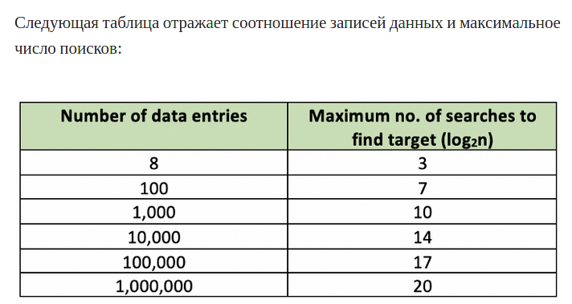

Добавить индексацию к столбцу [+](https://postgrespro.ru/docs/postgresql/9.6/sql-createindex)

```sql
CREATE INDEX <НовоеИмяОгранечителя> on <Таблица> (<Столбец>);
```

Удалить индексацию

```sql
DROP INDEX <ИмяОгранечителя>;
```

## Update

Обновить значения в таблице

```sql
UPDATE <ИмяТаблицы> SET <КакойСтолбцеМеняем>=<НовоеЗначение> WHERE <УсловиеИзмененияСтолбца>
```

Изменить значения указанного столбца, только у одной записи по её `id`.

```sql
UPDATE <ИмяТаблицы> SET <КакойСтолбцеМеняем>=<НовоеЗначение> WHERE id=<НужныйID>
```

---

Обновить таблицу [+](https://postgrespro.ru/docs/postgresql/10/sql-altertable):

- Изменить тип данных столбца

    ```sql
    ALTER TABLE <ИмяТаблицы> ALTER COLUMN <Столбец> TYPE <НовыйТипСтолбца>;
    ```

- Добавить столбце в таблицу

    ```sql
    ALTER TABLE <ИмяТаблицы> ADD COLUMN <Столбец> <Тип> <Ограничители>;
    ```

- Удалить столбец из таблицы

    ```sql
    ALTER TABLE <ИмяТаблицы> ADD DROP <Столбец>;
    ```

- Добавить проверку столбцу
    ```sql
    ALTER TABLE <ИмяТаблицы> ADD CHECK (<Столбец> >/</=/!= <Значению>);
    ```
- Добавить ограничитель

    ```sql
    ALTER TABLE <ИмяТаблицы> ALTER COLUMN <Столбец> SET <Ограничитель>;
    ```

- Снять ограничитель

    ```sql
    ALTER TABLE <ИмяТаблицы> ALTER COLUMN <Столбец> DROP <Ограничитель>;
    ```

- Добавить ограничитель уникальности

    ```sql
    ALTER TABLE <ИмяТаблицы> ADD UNIQUE (<Столбец>) ;
    ```

- Добавить оганичитель для внешнего ключа

```sql
	ALTER TABLE <ИмяТаблицы> ADD CONSTRAINT <НовоеИмяОгранечитселя>
	FOREIGN KEY (ИмяСтолбцаИзНашейТаблице)
	REFERENCES <ДругаяТаблица>(<ДругойСтолбце>) <ЧтоДелатьПриУдаленииЗаписи>
```

- Удалить ограничитель

```sql
    ALTER TABLE <ИмяТаблицы> DROP CONSTRAINT <ИмяОграничителя>
```

---

## Read

### Все команды

| Символы | Описание                  |
| ------- | ------------------------- |
| `*`     | Подразумевает все столбцы |
| `,`     | Перечисление              |

[Функции и операторы `PostgreSQL`](https://postgrespro.ru/docs/postgrespro/9.5/functions)

| Команда                                                                                | Описание                                                                                                 |     |
| -------------------------------------------------------------------------------------- | -------------------------------------------------------------------------------------------------------- | --- |
| `SELECT <ИзСтолбцов>`                                                                  | Забрать данные                                                                                           |     |
| `SELECT <ИмяСтолбца> AS <ОтобразитьНовоеИмяСтолбца>`                                   | Отобразить столбец с другим именем                                                                       |     |
| `SELECT DISTINCT <ИмяСтолбца>`                                                         | Выбирать только уникальные значения столбца                                                              |     |
| `FROM <ИзТаблицы>`                                                                     | Откуда взять данные, обычно из таблицы                                                                   |     |
| ---                                                                                    |                                                                                                          |     |
| `WHERE <Уловия>`                                                                       | Условие выборки[WHERE](#WHERE)                                                                           |     |
| ---                                                                                    |                                                                                                          |     |
| `LIMIT <ДоЧисла>`                                                                      | Ограничить выборку записей                                                                               |     |
| `LIMIT <ДоЧисла> OFFSET <СколькоПропустить>`                                           | Пропустить с начало, и ограничить выборку                                                                |     |
| ---                                                                                    |                                                                                                          |     |
| `ORDER BY <СортироватьПоСтолбцу1> <ASC/DESC>, <СортироватьПоСтолбцу2> <ASC/DESC>, ...` | Сортировать результат по указанным столбцам. `ASC` от меньшего к большему, `DESC` от большего к меньшему |     |

### `WHERE`

```sql
WHERE {Название_Столбца} {Операторы};
```

| Операторы                            | Описание                                                                        |
| ------------------------------------ | ------------------------------------------------------------------------------- |
| `==`                                 |                                                                                 |
| `!=`                                 |                                                                                 |
| `>`                                  |                                                                                 |
| `<`                                  |                                                                                 |
| `>=`                                 |                                                                                 |
| `<=`                                 |                                                                                 |
| `AND`                                |                                                                                 |
| `OR`                                 |                                                                                 |
| `BETWEEN <от> AND <до>`              | Промежуток                                                                      |
| `LIKE <шаблон>`                      | Устанавливает соответствие символьной строки с простым шаблоном.                |
| `IN (<значение1>,<значение2>, ...)`  | совпадает ли значение объекта со значением в списке.                            |
| `NOT`                                | Отрицание                                                                       |
| `SIMILAR TO <регуляроное выражение>` | Устанавливает соответствие символьной строки с шаблоном.(Регулярному выражению) |
|                                      |                                                                                 |

| `LIKE` | [+](https://postgrespro.ru/docs/postgrespro/9.5/functions-matching#functions-like) |
| ------ | ---------------------------------------------------------------------------------- |
| `'%'`  | Строка любой длинны                                                                |
| `'_'`  | Любой одиночный символ                                                             |

| `SIMILAR TO` | [+](https://postgrespro.ru/docs/postgrespro/9.5/functions-matching#functions-similarto-regexp) |
| ------------ | ---------------------------------------------------------------------------------------------- |
| `'│'`        | означает выбор (одного из двух вариантов).                                                     |
| `'*'`        | повторение предыдущего элемента 0 и более раз.                                                 |
| `'+'`        | повторение предыдущего элемента 1 и более раз.                                                 |
| `'?'`        | вхождение предыдущего элемента 0 или 1 раз.                                                    |
| `'{от,до}'`  | повторение предыдущего элемента `от` - `до` раз                                                |
| `'()'`       | объединяют несколько элементов в одну логическую группу.                                       |
| `[]`         | Причисление подходящих символов                                                                |
| `[^]`        | Причисление НЕ подходящих символов                                                             |

### Агрегатные функции

#### Все агрегатные функции

**Агрегатные функции** - это функции применяемые к набору входных данных и возвращающие по ним одно результирующее значение [Все агрегатные функции в PostgreSQL](https://postgrespro.ru/docs/postgrespro/9.5/functions-aggregate)

```SQL
SELECT SUM(price), MAX(price), FROM market;
```

| Функции                                       | Описание                                                                       |
| --------------------------------------------- | ------------------------------------------------------------------------------ |
| `avg(столбец)`                                | Среднее                                                                        |
| `count(столбец)`                              | Количество                                                                     |
| `max(столбец)`                                | Максимум                                                                       |
| `min(столбец)`                                | Минимум                                                                        |
| `sum(столбец)`                                | Сумма                                                                          |
| `floor(столбец)`                              | Округлить                                                                      |
| `coalesce(столбец, <ДругоеЗначениеЕслиNull>)` | Если значение из столбца равно `NULL` то показывает `<ДругоеЗначениеЕслиNull>` |

---

Для проверки условия результата агрегатных функций, аналогом `WHERE` является `HAVING`

```SQL
SELECT SUM(price), MAX(price), FROM market HAVING SUM(price)>10000;
```

---

#### `GROUP BY`

Изначально агрегатные функции группируют по все столбцы. Например, если мы используем `SUM(price_buy)` без группировки, то мы получим общую стоимость всех заказов в столбце.

| id  | id_client | price_buy |
| :-- | :-------- | :-------- |
| 1   | 1         | 4497      |
| 2   | 1         | 900       |
| 3   | 10        | 2007      |
| 4   | 10        | 3116      |
| 5   | 6         | 1767      |
| 6   | 9         | 1698      |
| 7   | 1         | 2661      |

```sql
select sum(price_buy)
from all_orders


```

| sum   |
| ----- |
| 16646 |

Но если мы хотим узнать, стоимость заказа для каждого `id` клиента то нам нужна группировка `group by`

```sql
select id_client, sum(price_buy)
from all_orders group by id_client;
```

| id_client | sum  |
| :-------- | :--- |
| 9         | 1698 |
| 10        | 5123 |
| 6         | 1767 |
| 1         | 8058 |

---

Пример:

```sql
-- Например у нас есть таблица которая хранит все заказы
-- на сайте, учтем тот факт что один и тот же
-- клиент может сделать несколько заказов.
-- Мы хотим чтобы те клиенты которы вообщем сделали
-- заказы более чем на 10_000 рублей получали скидку
-- на следующие заказы.


-------------------------
-- Таблица клиента
create table client
(
    id         serial primary key,
    first_name varchar(200)        not null,
    phone      varchar(40) unique  not null,
    email      varchar(200) unique not null
);
insert into client (id, first_name, phone, email)
values (1, 'Nomi', '+86-713-441-0872', 'nhitzke0@alexa.com'),
       (2, 'Micah', '+63-494-697-4014', 'mgilbart1@pbs.org'),
       (3, 'Karine', '+63-371-916-1099', 'kduffit2@aol.com'),
       (4, 'Fidel', '+66-175-890-0091', 'fmaclennan3@npr.org'),
       (5, 'Sean', '+351-711-481-7929', 'sossenna4@parallels.com'),
       (6, 'Rene', '+86-759-542-6974', 'rambroisin5@house.gov'),
       (7, 'Kent', '+66-291-346-0327', 'kcarville6@dedecms.com'),
       (8, 'Aleen', '+86-340-358-8279', 'amangin7@bloglovin.com'),
       (9, 'Osborne', '+54-340-340-2340', 'obedward8@list-manage.com'),
       (10, 'Zelma', '+86-903-277-9631', 'zlaxon9@amazon.com');

```

| id  | first_name | phone             | email                     |
| :-- | :--------- | :---------------- | :------------------------ |
| 1   | Nomi       | +86-713-441-0872  | nhitzke0@alexa.com        |
| 2   | Micah      | +63-494-697-4014  | mgilbart1@pbs.org         |
| 3   | Karine     | +63-371-916-1099  | kduffit2@aol.com          |
| 4   | Fidel      | +66-175-890-0091  | fmaclennan3@npr.org       |
| 5   | Sean       | +351-711-481-7929 | sossenna4@parallels.com   |
| 6   | Rene       | +86-759-542-6974  | rambroisin5@house.gov     |
| 7   | Kent       | +66-291-346-0327  | kcarville6@dedecms.com    |
| 8   | Aleen      | +86-340-358-8279  | amangin7@bloglovin.com    |
| 9   | Osborne    | +54-340-340-2340  | obedward8@list-manage.com |
| 10  | Zelma      | +86-903-277-9631  | zlaxon9@amazon.com        |

```sql
-- Таблица для всех заказов
create table all_orders
(
    id        serial primary key,
    id_client integer references client (id),
    price_buy numeric not null
);
insert into all_orders (id_client, price_buy)
values (1, 4497),
       (1, 900),
       (10, 2007),
       (10, 3116),
       (6, 1767),
       (9, 1698),
       (1, 2661),
       (8, 938),
       (8, 88),
       (4, 799),
       (8, 511),
       (1, 169),
       (6, 2979),
       (7, 109),
       (5, 2126),
       (10, 365),
       (2, 505),
       (2, 4953),
       (2, 2707),
       (5, 2383),
       (8, 3135),
       (2, 2186),
       (8, 2952),
       (6, 2790),
       (6, 2577);
```

| id  | id_client | price_buy |
| :-- | :-------- | :-------- |
| 1   | 1         | 4497      |
| 2   | 1         | 900       |
| 3   | 10        | 2007      |
| 4   | 10        | 3116      |
| 5   | 6         | 1767      |
| 6   | 9         | 1698      |
| 7   | 1         | 2661      |
| 8   | 8         | 938       |
| 9   | 8         | 88        |
| 10  | 4         | 799       |
| 11  | 8         | 511       |
| 12  | 1         | 169       |
| 13  | 6         | 2979      |
| 14  | 7         | 109       |
| 15  | 5         | 2126      |
| 16  | 10        | 365       |
| 17  | 2         | 505       |
| 18  | 2         | 4953      |
| 19  | 2         | 2707      |
| 20  | 5         | 2383      |
| 21  | 8         | 3135      |
| 22  | 2         | 2186      |
| 23  | 8         | 2952      |
| 24  | 6         | 2790      |
| 25  | 6         | 2577      |

```sql
-------------------------

-- Увидем результат объединения
select first_name, client.id, all_orders.price_buy
from client
         join all_orders on client.id = all_orders.id_client;

-------------------------

-- Увидем результат объединения и групировки
select first_name, sum(all_orders.price_buy)
from client
         join all_orders on client.id = all_orders.id_client
group by client.first_name;

-------------------------

-- Увидем результат объединения и групировки и проверки того что общая сумма заказов более 10_000 тысяч
select first_name, sum(all_orders.price_buy)
from client
         join all_orders on client.id = all_orders.id_client
group by client.first_name
HAVING sum(all_orders.price_buy) > 10000;

```

| first_name | sum   |
| :--------- | :---- |
| Rene       | 10113 |
| Micah      | 10351 |

# Связи таблиц

## `REFERENCES` - ссылка

### on delete

- `CASCADE` Если мы удалим запись из главной таблицы(там где первичный ключ), то автоматически удалятся записи из подчинённых таблиц(там где внешний ключ указывает на первичный ключ). Но такая цепная реакция работает только если мы удаляем запись из главной таблицы, а если мы удаляем запись из подчинённой таблице, то ни какого каскадного(ценённого) удаления не произойдет, удаляется только та запись которую мы удаляем.

> В `SQLite` для каскадно удаления нужно сначала выполнить команду `PRAGMA foreign_keys = ON;`, иначе каскадного удаления не будет, удалиться только запись из главной таблицы, а записи в подчинённых таблицах будут не тронуты.

```sql
-- Будет ошибка - потому что мы пытаемся создать подчененную таблицу, а её некому подчинятся.
-- Надо сначало создачть главную таблицу а потом уже почененню
create table other_vpnphoto2
(
    id        serial primary key,
    PathImage varchar(255) not null,
    fk_id     bigint references other_vpntable2 (id) on delete CASCADE
);
insert into other_vpnphoto2 (PathImage, fk_id)
values ('Длинный путь к фото1', 1),
       ('Длинный путь к фото2', 2),
       ('Длинный путь к фото3', 3),
       ('Длинный путь к фото4', 4),
       ('Длинный путь к фото5', 5),
       ('Длинный путь к фото6', 6);


create table other_vpntable2
(
    id       serial primary key,
    NameSend varchar(255) not null,
    Message  varchar(600) not null,
    NameGet  varchar(255) not null
);
insert into other_vpntable2 (NameSend, NameGet, Message)
values ('Петя', 'Кости', 'Привет'),
       ('Петя', 'Маше', 'Привет'),
       ('Петя', 'Сереже', 'Привет'),
       ('Костя', 'Пети', 'Здоров'),
       ('Маша', 'Кости', 'Я занята'),
       ('Петя', 'Кости', 'Как дела');

-- alter table other_vpnphoto2 drop constraint other_vpnphoto2_fk_i;
-- alter table other_vpnphoto2
--     add CONSTRAINT other_vpnphoto2_fk_i
--         foreign key (fk_id)
--             REFERENCES other_vpntable2 (id) on delete set null
```

| id    | namesend | message  | nameget |
| :---- | :------- | :------- | :------ |
| 1 (+) | Петя     | Привет   | Кости   |
| 2 (+) | Петя     | Привет   | Маше    |
| 3 (+) | Петя     | Привет   | Сереже  |
| 4     | Костя    | Здоров   | Пети    |
| 5     | Маша     | Я занята | Кости   |
| 6 (+) | Петя     | Привет   | Кости   |

| id    | pathimage            | fk_id |
| :---- | :------------------- | :---- |
| 1 (+) | Длинный путь к фото1 | 1     |
| 2 (+) | Длинный путь к фото2 | 2     |
| 3 (+) | Длинный путь к фото3 | 3     |
| 4     | Длинный путь к фото4 | 4     |
| 5     | Длинный путь к фото5 | 5     |
| 6 (+) | Длинный путь к фото1 | 6     |

Если удаляем запись в главной таблице, то удаляться записи в подчинённой таблице.

```sql
delete from other_vpntable2 where NameSend = 'Петя';
```

| id  | namesend | message  | nameget |
| :-- | :------- | :------- | :------ |
| 4   | Костя    | Здоров   | Пети    |
| 5   | Маша     | Я занята | Кости   |

| id  | pathimage            | fk_id |
| :-- | :------------------- | :---- |
| 4   | Длинный путь к фото4 | 4     |
| 5   | Длинный путь к фото5 | 5     |

---

- `RESTRICT` Запрещает удалять запись из главной таблицы, если на неё ссылаются внешний ключ из подчинённой таблицы. Но обратите внимание, мы можем спокойно удалять записи из подчинённой таблицы. Либо можно посмотреть с другой стороны. `RESTRICT` предотвращает какие-либо действия в зависимой таблице при удалении или изменении связанных строк в главной таблице, то есть предотвращать каскадное(цепное) удаление в обе стороны.

```sql
create table other_vpntable2
(
    id       serial primary key,
    NameSend varchar(255) not null,
    Message  varchar(600) not null,
    NameGet  varchar(255) not null
);
insert into other_vpntable2 (NameSend, NameGet, Message)
values ('Петя', 'Кости', 'Привет'),
       ('Петя', 'Маше', 'Привет'),
       ('Петя', 'Сереже', 'Привет'),
       ('Костя', 'Пети', 'Здоров'),
       ('Маша', 'Кости', 'Я занята'),
       ('Петя', 'Кости', 'Как дела');

create table other_vpnphoto2
(
    id        serial primary key,
    PathImage varchar(255) not null,
    fk_id     bigint references other_vpntable2 (id) on delete RESTRICT
);
insert into other_vpnphoto2 (PathImage, fk_id)
values ('Длинный путь к фото1', 1),
       ('Длинный путь к фото2', 2),
       ('Длинный путь к фото3', 3),
       ('Длинный путь к фото4', 4),
       ('Длинный путь к фото5', 5),
       ('Длинный путь к фото6', 6);

```

| id    | namesend | message  | nameget |
| :---- | :------- | :------- | :------ |
| 1     | Петя     | Привет   | Кости   |
| 2     | Петя     | Привет   | Маше    |
| 3     | Петя     | Привет   | Сереже  |
| 4     | Костя    | Здоров   | Пети    |
| 5     | Маша     | Я занята | Кости   |
| 6 (+) | Петя     | Привет   | Кости   |

| id    | pathimage            | fk_id |
| :---- | :------------------- | :---- |
| 1     | Длинный путь к фото1 | 1     |
| 2     | Длинный путь к фото2 | 2     |
| 3     | Длинный путь к фото3 | 3     |
| 4     | Длинный путь к фото4 | 4     |
| 5     | Длинный путь к фото5 | 5     |
| 6 (+) | Длинный путь к фото1 | 6     |

Если мы попробуем удалить запись с `id = 6` из главной таблице `other_vpntable2`, то будет ошибка, потому что на `id` 6, есть ссылка из таблицы `other_vpnphoto2`

```sql
delete from other_vpntable2 where id = 6;
```

Поэтому нам сначала нужно удалить запись из подчинённой таблицы, а потом уже мы можем удалить запись из главной

```sql
delete from other_vpnphoto2 where id = 6;
```

| id  | pathimage            | fk_id |
| :-- | :------------------- | :---- |
| 1   | Длинный путь к фото1 | 1     |
| 2   | Длинный путь к фото2 | 2     |
| 3   | Длинный путь к фото3 | 3     |
| 4   | Длинный путь к фото4 | 4     |
| 5   | Длинный путь к фото5 | 5     |

| id    | pathimage            | fk_id |
| :---- | :------------------- | :---- |
| 1     | Длинный путь к фото1 | 1     |
| 2     | Длинный путь к фото2 | 2     |
| 3     | Длинный путь к фото3 | 3     |
| 4     | Длинный путь к фото4 | 4     |
| 5     | Длинный путь к фото5 | 5     |
| 6 (+) | Длинный путь к фото1 | 6     |

```sql
delete from other_vpntable2 where id = 6;
```

| id  | pathimage            | fk_id |
| :-- | :------------------- | :---- |
| 1   | Длинный путь к фото1 | 1     |
| 2   | Длинный путь к фото2 | 2     |
| 3   | Длинный путь к фото3 | 3     |
| 4   | Длинный путь к фото4 | 4     |
| 5   | Длинный путь к фото5 | 5     |

| id  | namesend | message  | nameget |
| :-- | :------- | :------- | :------ |
| 1   | Петя     | Привет   | Кости   |
| 2   | Петя     | Привет   | Маше    |
| 3   | Петя     | Привет   | Сереже  |
| 4   | Костя    | Здоров   | Пети    |
| 5   | Маша     | Я занята | Кости   |

- `NO ACTION` Делает то же самое что и `RESTRICT`, (запрещает удалять записи из главной таблице если на неё ссылаются внешним ключом) только проверяет целостность в конце. (Используется по умолчанию)(Используется для проверки транзакции)

- `SET NULL` Похоже на каскадное удлинение, только вместо удаления всей записи в подчинённой таблице, столбец внешнего ключа устанавливается в `NULL`, а вся запись остается(не удаляется).

```sql
create table other_vpntable2
(
    id       serial primary key,
    NameSend varchar(255) not null,
    Message  varchar(600) not null,
    NameGet  varchar(255) not null
);
insert into other_vpntable2 (NameSend, NameGet, Message)
values ('Петя', 'Кости', 'Привет'),
       ('Петя', 'Маше', 'Привет'),
       ('Петя', 'Сереже', 'Привет'),
       ('Костя', 'Пети', 'Здоров'),
       ('Маша', 'Кости', 'Я занята'),
       ('Петя', 'Кости', 'Как дела');

create table other_vpnphoto2
(
    id        serial primary key,
    PathImage varchar(255) not null,
    fk_id     bigint references other_vpntable2 (id) on delete SET NULL
);
insert into other_vpnphoto2 (PathImage, fk_id)
values ('Длинный путь к фото1', 1),
       ('Длинный путь к фото2', 2),
       ('Длинный путь к фото3', 3),
       ('Длинный путь к фото4', 4),
       ('Длинный путь к фото5', 5),
       ('Длинный путь к фото6', 6);

```

| id    | namesend | message  | nameget |
| :---- | :------- | :------- | :------ |
| 1     | Петя     | Привет   | Кости   |
| 2     | Петя     | Привет   | Маше    |
| 3     | Петя     | Привет   | Сереже  |
| 4     | Костя    | Здоров   | Пети    |
| 5     | Маша     | Я занята | Кости   |
| 6 (+) | Петя     | Привет   | Кости   |

| id    | pathimage            | fk_id |
| :---- | :------------------- | :---- |
| 1     | Длинный путь к фото1 | 1     |
| 2     | Длинный путь к фото2 | 2     |
| 3     | Длинный путь к фото3 | 3     |
| 4     | Длинный путь к фото4 | 4     |
| 5     | Длинный путь к фото5 | 5     |
| 6 (+) | Длинный путь к фото1 | 6     |

Мы удаляем запись из главно таблице, и автоматически в подчинённой таблице столбце внешнего ключа устанавливается в `NULL`

```sql
delete  from other_vpntable2  where id = 6 ;
```

| id  | namesend | message  | nameget |
| :-- | :------- | :------- | :------ |
| 1   | Петя     | Привет   | Кости   |
| 2   | Петя     | Привет   | Маше    |
| 3   | Петя     | Привет   | Сереже  |
| 4   | Костя    | Здоров   | Пети    |
| 5   | Маша     | Я занята | Кости   |

| id  | pathimage            | fk_id    |
| :-- | :------------------- | :------- |
| 1   | Длинный путь к фото1 | 1        |
| 2   | Длинный путь к фото2 | 2        |
| 3   | Длинный путь к фото3 | 3        |
| 4   | Длинный путь к фото4 | 4        |
| 5   | Длинный путь к фото5 | 5        |
| 6   | Длинный путь к фото1 | NULL (+) |

- `SET DEFAULT` То же самое что и `set null` только устанавливает значение по умолчанию для столбца внешнего ключа. Ограничение `DEFAULT`(значение по умолчанию) нужно указывать отдельно.

```sql
create table other_vpntable2
(
    id       serial primary key,
    NameSend varchar(255) not null,
    Message  varchar(600) not null,
    NameGet  varchar(255) not null
);
insert into other_vpntable2 (NameSend, NameGet, Message)
values ('Петя', 'Кости', 'Привет'),
       ('Петя', 'Маше', 'Привет'),
       ('Петя', 'Сереже', 'Привет'),
       ('Костя', 'Пети', 'Здоров'),
       ('Маша', 'Кости', 'Я занята'),
       ('Петя', 'Кости', 'Как дела');


create table other_vpnphoto2
(
    id        serial primary key,
    PathImage varchar(255) not null,
    fk_id     bigint references other_vpntable2 (id) on delete set default default 5
);
insert into other_vpnphoto2 (PathImage, fk_id)
values ('Длинный путь к фото1', 1),
       ('Длинный путь к фото2', 2),
       ('Длинный путь к фото3', 3),
       ('Длинный путь к фото4', 4),
       ('Длинный путь к фото5', 5),
       ('Длинный путь к фото6', 6);
```

| id    | namesend | message  | nameget |
| :---- | :------- | :------- | :------ |
| 1     | Петя     | Привет   | Кости   |
| 2     | Петя     | Привет   | Маше    |
| 3     | Петя     | Привет   | Сереже  |
| 4     | Костя    | Здоров   | Пети    |
| 5     | Маша     | Я занята | Кости   |
| 6 (+) | Петя     | Привет   | Кости   |

| id    | pathimage            | fk_id |
| :---- | :------------------- | :---- |
| 1     | Длинный путь к фото1 | 1     |
| 2     | Длинный путь к фото2 | 2     |
| 3     | Длинный путь к фото3 | 3     |
| 4     | Длинный путь к фото4 | 4     |
| 5     | Длинный путь к фото5 | 5     |
| 6 (+) | Длинный путь к фото1 | 6     |

Мы удаляем запись из главно таблице, и автоматически в подчинённой таблице столбце внешнего ключа устанавливается в значение по умолчанию.(в нашем случае это 5)(Обратите внимание, что даже в этом случае мы не можем нарушить правило - указать значение по умолчанию которое бы указывала на несуществующе запись)

```sql
delete  from other_vpntable2  where id = 6 ;
```

| id  | namesend | message  | nameget |
| :-- | :------- | :------- | :------ |
| 1   | Петя     | Привет   | Кости   |
| 2   | Петя     | Привет   | Маше    |
| 3   | Петя     | Привет   | Сереже  |
| 4   | Костя    | Здоров   | Пети    |
| 5   | Маша     | Я занята | Кости   |

| id  | pathimage            | fk_id |
| :-- | :------------------- | :---- |
| 1   | Длинный путь к фото1 | 1     |
| 2   | Длинный путь к фото2 | 2     |
| 3   | Длинный путь к фото3 | 3     |
| 4   | Длинный путь к фото4 | 4     |
| 5   | Длинный путь к фото5 | 5     |
| 6   | Длинный путь к фото1 | 5 (+) |

### on update

Работает так же как `on delete` только в этом случаем контролируем обновление столбца `pk_id` в главной таблице, и обновления`fk_id` в подчененой таблице. Давайте посмотрим пример с каскадным обновлением.

- `CASCADE`

```sql
create table other_vpntable2
(
    id       serial primary key,
    NameSend varchar(255) not null,
    Message  varchar(600) not null,
    NameGet  varchar(255) not null
);
insert into other_vpntable2 (NameSend, NameGet, Message)
values ('Петя', 'Кости', 'Привет'),
       ('Петя', 'Маше', 'Привет'),
       ('Петя', 'Сереже', 'Привет'),
       ('Костя', 'Пети', 'Здоров'),
       ('Маша', 'Кости', 'Я занята'),
       ('Петя', 'Кости', 'Как дела');


create table other_vpnphoto2
(
    id        serial primary key,
    PathImage varchar(255) not null,
    fk_id     bigint references other_vpntable2 (id) on update cascade
);
insert into other_vpnphoto2 (PathImage, fk_id)
values ('Длинный путь к фото1', 1),
       ('Длинный путь к фото2', 2),
       ('Длинный путь к фото3', 3),
       ('Длинный путь к фото4', 4),
       ('Длинный путь к фото5', 5),
       ('Длинный путь к фото6', 6);

```

Обновляем `id`в главной таблице, и он автоматически обновляется в подчинённой таблице.

```sql
update other_vpntable2 set id = 99 where id = 6;
```

| id     | namesend | message  | nameget |
| :----- | :------- | :------- | :------ |
| 1      | Петя     | Привет   | Кости   |
| 2      | Петя     | Привет   | Маше    |
| 3      | Петя     | Привет   | Сереже  |
| 4      | Костя    | Здоров   | Пети    |
| 5      | Маша     | Я занята | Кости   |
| 99 (+) | Петя     | Как дела | Кости   |

| id  | pathimage            | fk_id |
| :-- | :------------------- | :---- |
| 1   | Длинный путь к фото1 | 1     |
| 2   | Длинный путь к фото2 | 2     |
| 3   | Длинный путь к фото3 | 3     |
| 4   | Длинный путь к фото4 | 4     |
| 5   | Длинный путь к фото5 | 5     |
| 6   | Длинный путь к фото6 | 99(+) |

---

### Комбинировать `on delete` и `on update`.

Вот пример каскадного обновления и каскадного удаления

```sql
create table other_vpntable2
(
    id       serial primary key,
    NameSend varchar(255) not null,
    Message  varchar(600) not null,
    NameGet  varchar(255) not null
);
insert into other_vpntable2 (NameSend, NameGet, Message)
values ('Петя', 'Кости', 'Привет'),
       ('Петя', 'Маше', 'Привет'),
       ('Петя', 'Сереже', 'Привет'),
       ('Костя', 'Пети', 'Здоров'),
       ('Маша', 'Кости', 'Я занята'),
       ('Петя', 'Кости', 'Как дела');


create table other_vpnphoto2
(
    id        serial primary key,
    PathImage varchar(255) not null,
    fk_id     bigint references other_vpntable2 (id) on update cascade on delete cascade
);
insert into other_vpnphoto2 (PathImage, fk_id)
values ('Длинный путь к фото1', 1),
       ('Длинный путь к фото2', 2),
       ('Длинный путь к фото3', 3),
       ('Длинный путь к фото4', 4),
       ('Длинный путь к фото5', 5),
       ('Длинный путь к фото6', 6);
```

Обновляем `id`в главной таблице, и он автоматически обновляется в подчинённой таблице.

```sql
update other_vpntable2 set id = 99 where id = 6;
```

| id     | namesend | message  | nameget |
| :----- | :------- | :------- | :------ |
| 1      | Петя     | Привет   | Кости   |
| 2      | Петя     | Привет   | Маше    |
| 3      | Петя     | Привет   | Сереже  |
| 4      | Костя    | Здоров   | Пети    |
| 5      | Маша     | Я занята | Кости   |
| 99 (+) | Петя     | Как дела | Кости   |

| id  | pathimage            | fk_id |
| :-- | :------------------- | :---- |
| 1   | Длинный путь к фото1 | 1     |
| 2   | Длинный путь к фото2 | 2     |
| 3   | Длинный путь к фото3 | 3     |
| 4   | Длинный путь к фото4 | 4     |
| 5   | Длинный путь к фото5 | 5     |
| 6   | Длинный путь к фото6 | 99(+) |

Если удаляем запись в главной таблице, то удаляться записи в подчинённой таблице.

```sql
delete from other_vpntable2 where id = 6;
```

| id  | pathimage            | fk_id |
| :-- | :------------------- | :---- |
| 1   | Длинный путь к фото1 | 1     |
| 2   | Длинный путь к фото2 | 2     |
| 3   | Длинный путь к фото3 | 3     |
| 4   | Длинный путь к фото4 | 4     |
| 5   | Длинный путь к фото5 | 5     |

| id  | namesend | message  | nameget |
| :-- | :------- | :------- | :------ |
| 1   | Петя     | Привет   | Кости   |
| 2   | Петя     | Привет   | Маше    |
| 3   | Петя     | Привет   | Сереже  |
| 4   | Костя    | Здоров   | Пети    |
| 5   | Маша     | Я занята | Кости   |

## `Join` - объединение

```sql
SELECT <СтолбцыОтображения> FROM <ИмяОсновнойТаблицы>
<LEFT INNER FULL RIGHT> JOIN <ИмяДругойТаблицы> ON <УсловияСвязывния>
```

> `OUTER` можно не указывать !

1. `INNER JOIN` или `INNER OUTER JOIN` или просто `JOIN`

    - 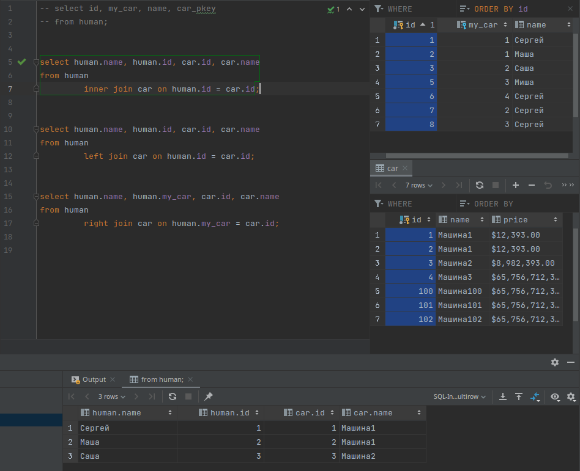
    - 

1. `LEFT JOIN` или `LEFT OUTER JOIN`

    - 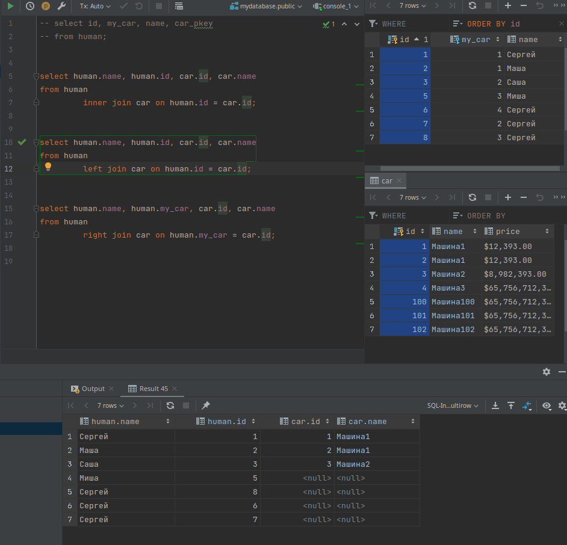
    - 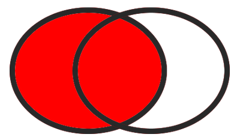

1. Выбрать столбцы из левой таблицы у которых нет значений в правой таблицы. Нужно указать условие `where СтолбецИзПравойТаблицы.id is null`

    - 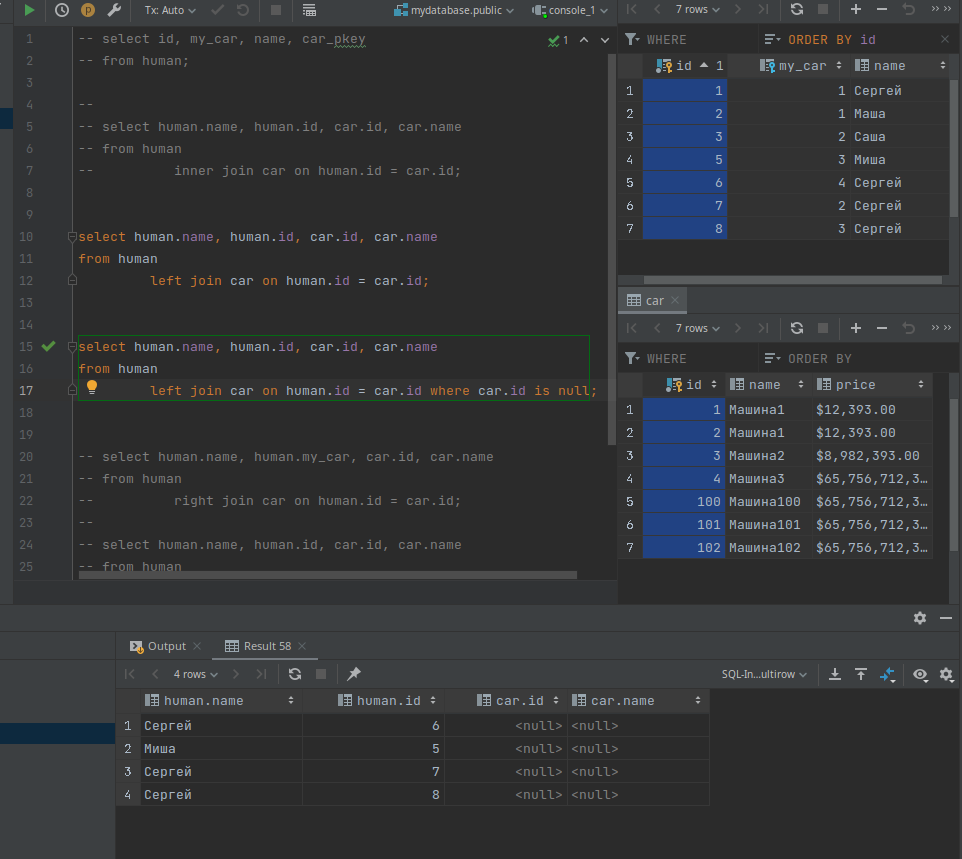
    - 

1. `RIGHT JOIN` или `RIGHT OUTER JOIN`

    - 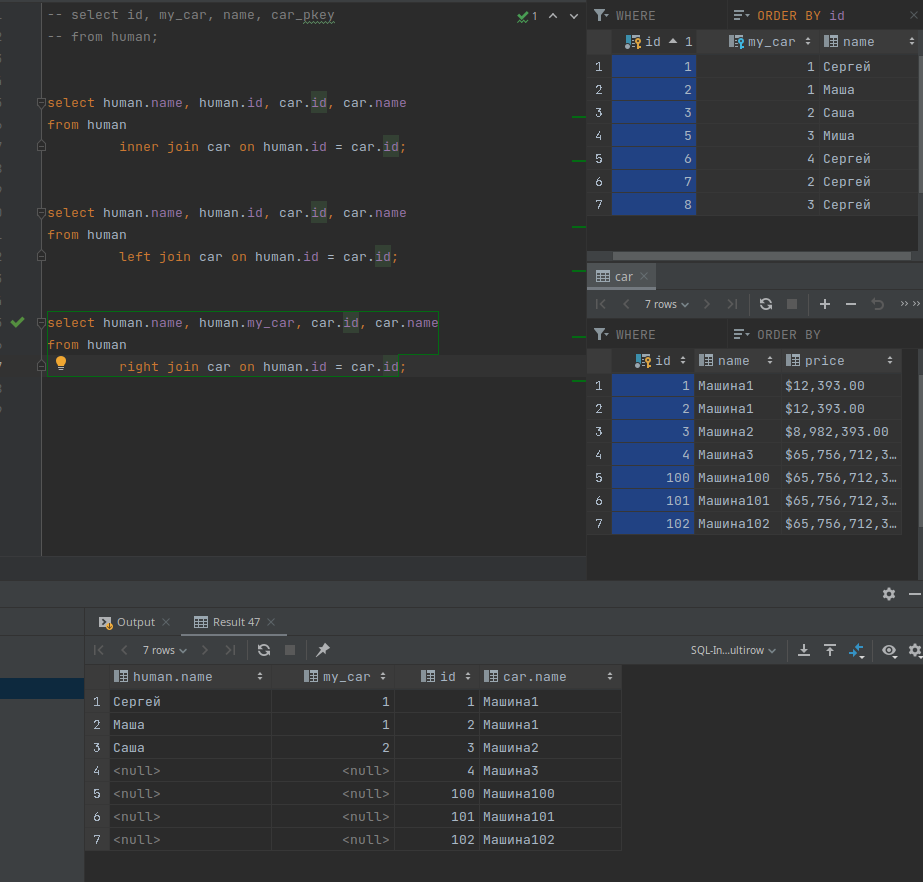
    - 

1. Выбрать столбцы из правой таблицы у которых нет значений в левой таблицы. Нужно указать условие `where СтолбецИзЛевойТаблицы.id is null`

    - 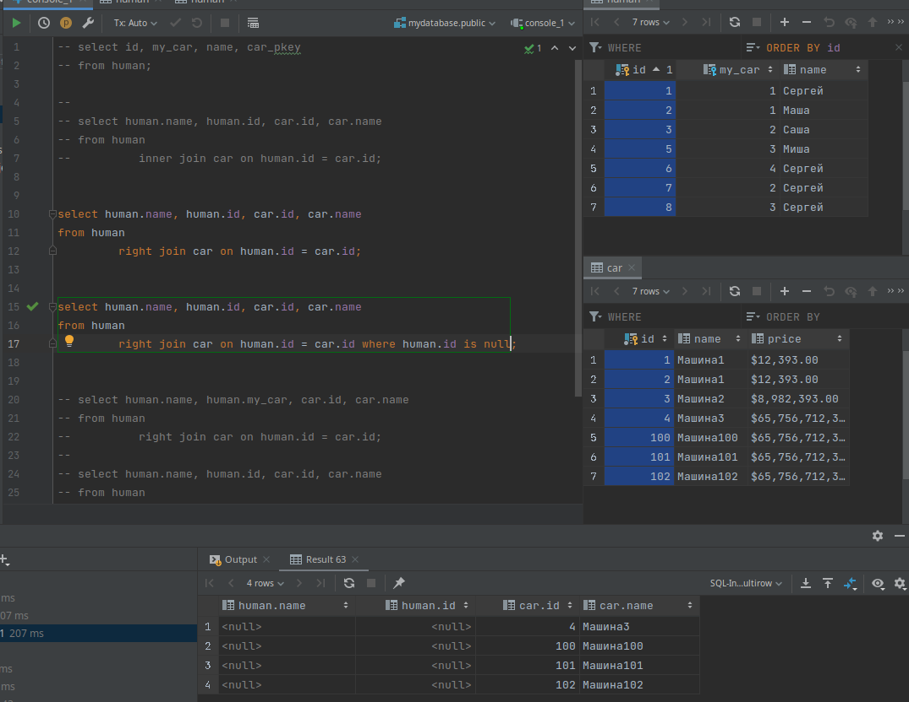
    - 

1. `FULL JOIN` или `FULL OUTER JOIN`

    - 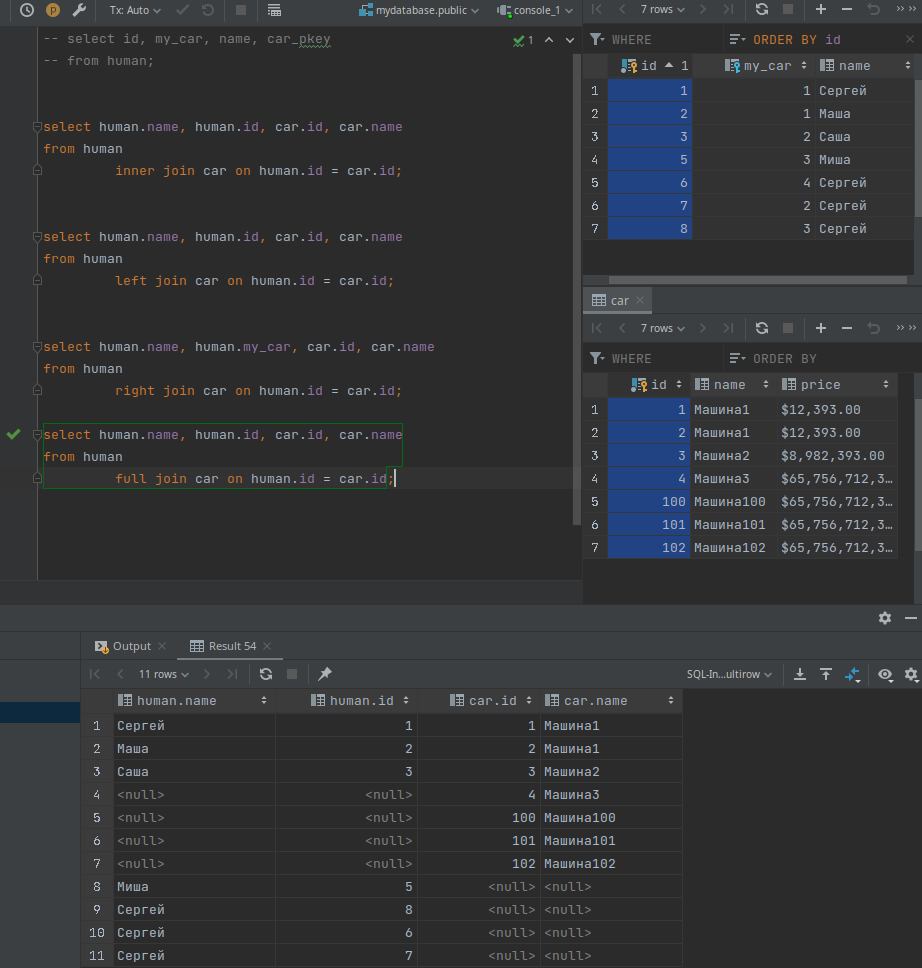
    - 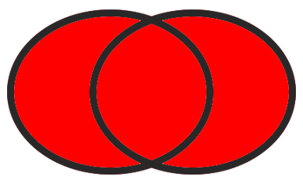

1. Выбрать столбцы у которых нет совпадений. Нужно указать условие `where СтолбецИзЛевойТаблицы.id is null OR СтолбецИзПравойТаблицы.id is null `
    - 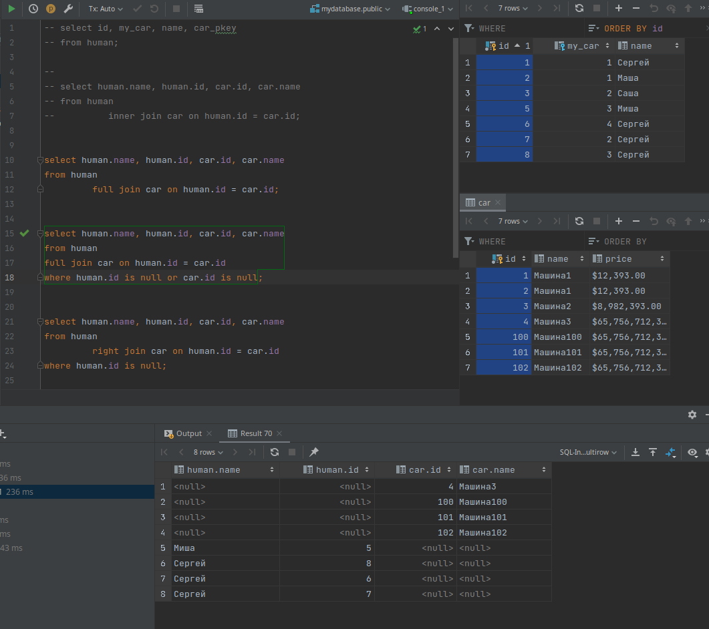
    - 

## Типы связей

### Один к одному

У одной записи в главной таблице есть только одна запись в другой таблице.

---

Связь один к одному используется для:

- Расширения данных о главной таблицы
- Для защиты (скрытия) данных, путем создания отдельных таблиц

---

В этом примере мы разделили таблицу сотрудников, и таблицу паспортных данных, ради конфиденциальности сотрудников, таблицу `сотрудник` мы можем спокойно давать читать и анализировать другим пользователям, не боясь того что кто-то узнает точные паспортные данных наших сотрудников. При этом у нас есть ограничитель уникальности в таблице `паспорта_сотрудников`, то есть у одного сотрудника есть только один паспорт.

```sql
create table сотрудник
(
    id       serial primary key,
    f_name   varchar(255) not null,
    l_name   varchar(255) not null,
    position integer default 0 -- Должность
);
insert into сотрудник (id, f_name, l_name, position)
values (1, 'Patrizio', 'Skeat', 35),
       (2, 'Raphael', 'Clouston', 82),
       (3, 'Karyn', 'Coole', 6),
       (4, 'Rhys', 'Cicconetti', 58),
       (5, 'Cahra', 'Belcham', 90),
       (6, 'Margareta', 'Aristide', 48),
       (7, 'Kristel', 'Garvan', 37),
       (8, 'Dallis', 'Robbings', 56),
       (9, 'Rafi', 'Dewerson', 51),
       (10, 'Jeannie', 'Durrant', 36);


create table паспорта_сотрудников
(
    id              serial,
    id_person       integer references сотрудник (id) on delete cascade UNIQUE, -- Уникальный
    passport_number varchar(255) not null
);
insert into паспорта_сотрудников (id, id_person, passport_number)
values (1, 3, '4041373299689293'),
       (2, 4, '4041593351596'),
       (3, 5, '4041372241190'),
       (4, 9, '4041379655579705'),
       (5, 10, '4041373879659'),
       (6, 7, '4041376224537479'),
       (7, 1, '4017952389376596'),
       (8, 6, '4041596168463750'),
       (9, 2, '4041594578866'),
       (10, 8, '4041592771576393');

--drop table сотрудник;
--drop table паспорта_сотрудников;
```

| id  | f_name    | l_name     | position |
| :-- | :-------- | :--------- | :------- |
| 1   | Patrizio  | Skeat      | 35       |
| 2   | Raphael   | Clouston   | 82       |
| 3   | Karyn     | Coole      | 6        |
| 4   | Rhys      | Cicconetti | 58       |
| 5   | Cahra     | Belcham    | 90       |
| 6   | Margareta | Aristide   | 48       |
| 7   | Kristel   | Garvan     | 37       |
| 8   | Dallis    | Robbings   | 56       |
| 9   | Rafi      | Dewerson   | 51       |
| 10  | Jeannie   | Durrant    | 36       |

| id  | id_person | passport_number  |
| :-- | :-------- | :--------------- |
| 1   | 3         | 4041373299689293 |
| 2   | 4         | 4041593351596    |
| 3   | 5         | 4041372241190    |
| 4   | 9         | 4041379655579705 |
| 5   | 10        | 4041373879659    |
| 6   | 7         | 4041376224537479 |
| 7   | 1         | 4017952389376596 |
| 8   | 6         | 4041596168463750 |
| 9   | 2         | 4041594578866    |
| 10  | 8         | 4041592771576393 |

```sql
select сотрудник.f_name, сотрудник.id, пс.id_person, пс.passport_number
from сотрудник
         join паспорта_сотрудников пс on сотрудник.id = пс.id_person;
```

| f_name    | id  | id_person | passport_number  |
| :-------- | :-- | :-------- | :--------------- |
| Karyn     | 3   | 3         | 4041373299689293 |
| Rhys      | 4   | 4         | 4041593351596    |
| Cahra     | 5   | 5         | 4041372241190    |
| Rafi      | 9   | 9         | 4041379655579705 |
| Jeannie   | 10  | 10        | 4041373879659    |
| Kristel   | 7   | 7         | 4041376224537479 |
| Patrizio  | 1   | 1         | 4017952389376596 |
| Margareta | 6   | 6         | 4041596168463750 |
| Raphael   | 2   | 2         | 4041594578866    |
| Dallis    | 8   | 8         | 4041592771576393 |

### Один ко многим

У одной записи в главной таблице может быть несколько записей в подчинённой таблице

- У одного пользователя может быть множество фотографий. (+)
- У одного покупателя может быть множество товаров.
- У одного дня может быть множество событий.

```sql
CREATE TABLE пользователь
(
    id     serial PRIMARY KEY,
    f_name varchar(255) NOT NULL,
    l_name varchar(255) NOT NULL
);
INSERT INTO пользователь (id, f_name, l_name)
VALUES (1, 'Carola', 'Yandle'),
       (2, 'Risa', 'Follet'),
       (3, 'Cele', 'Caslin'),
       (4, 'Osgood', 'Demead'),
       (5, 'Roldan', 'Malby'),
       (6, 'Reynard', 'Garlee'),
       (7, 'Erna', 'Vigurs'),
       (8, 'Stewart', 'Naismith'),
       (9, 'Poppy', 'Watling'),
       (10, 'Sybila', 'Teliga');

CREATE TABLE фотографии
(
    id         serial PRIMARY KEY,
    id_user    integer REFERENCES пользователь (id) ON DELETE CASCADE ON UPDATE CASCADE,
    path_image varchar(600)
);
INSERT INTO фотографии (id, id_user, path_image)
VALUES (1, 1, 'http://dummyimage.com/212x100.png/dddddd/000000'),
       (2, 4, 'http://dummyimage.com/170x100.png/cc0000/ffffff'),
       (3, 5, 'http://dummyimage.com/147x100.png/dddddd/000000'),
       (4, 6, 'http://dummyimage.com/122x100.png/5fa2dd/ffffff'),
       (5, 2, 'http://dummyimage.com/222x100.png/dddddd/000000'),
       (6, 4, 'http://dummyimage.com/217x100.png/dddddd/000000'),
       (7, 1, 'http://dummyimage.com/192x100.png/cc0000/ffffff'),
       (8, 9, 'http://dummyimage.com/118x100.png/5fa2dd/ffffff'),
       (9, 6, 'http://dummyimage.com/215x100.png/cc0000/ffffff'),
       (10, 4, 'http://dummyimage.com/235x100.png/ff4444/ffffff');

```

| id  | f_name  | l_name   |
| :-- | :------ | :------- |
| 1   | Carola  | Yandle   |
| 2   | Risa    | Follet   |
| 3   | Cele    | Caslin   |
| 4   | Osgood  | Demead   |
| 5   | Roldan  | Malby    |
| 6   | Reynard | Garlee   |
| 7   | Erna    | Vigurs   |
| 8   | Stewart | Naismith |
| 9   | Poppy   | Watling  |
| 10  | Sybila  | Teliga   |

| id  | id_user | path_image                                      |
| :-- | :------ | :---------------------------------------------- |
| 1   | 1       | http://dummyimage.com/212x100.png/dddddd/000000 |
| 2   | 4       | http://dummyimage.com/170x100.png/cc0000/ffffff |
| 3   | 5       | http://dummyimage.com/147x100.png/dddddd/000000 |
| 4   | 6       | http://dummyimage.com/122x100.png/5fa2dd/ffffff |
| 5   | 2       | http://dummyimage.com/222x100.png/dddddd/000000 |
| 6   | 4       | http://dummyimage.com/217x100.png/dddddd/000000 |
| 7   | 1       | http://dummyimage.com/192x100.png/cc0000/ffffff |
| 8   | 9       | http://dummyimage.com/118x100.png/5fa2dd/ffffff |
| 9   | 6       | http://dummyimage.com/215x100.png/cc0000/ffffff |
| 10  | 4       | http://dummyimage.com/235x100.png/ff4444/ffffff |

У одного пользователя может быть множество фотографий.

```sql
SELECT пользователь.f_name, пользователь.id, ф.id_user, ф.path_image
FROM пользователь
         JOIN фотографии ф ON пользователь.id = ф.id_user;
```

| f_name  | id  | id_user | path_image                                      |
| :------ | :-- | :------ | :---------------------------------------------- |
| Carola  | 1   | 1       | http://dummyimage.com/212x100.png/dddddd/000000 |
| Osgood  | 4   | 4       | http://dummyimage.com/170x100.png/cc0000/ffffff |
| Roldan  | 5   | 5       | http://dummyimage.com/147x100.png/dddddd/000000 |
| Reynard | 6   | 6       | http://dummyimage.com/122x100.png/5fa2dd/ffffff |
| Risa    | 2   | 2       | http://dummyimage.com/222x100.png/dddddd/000000 |
| Osgood  | 4   | 4       | http://dummyimage.com/217x100.png/dddddd/000000 |
| Carola  | 1   | 1       | http://dummyimage.com/192x100.png/cc0000/ffffff |
| Poppy   | 9   | 9       | http://dummyimage.com/118x100.png/5fa2dd/ffffff |
| Reynard | 6   | 6       | http://dummyimage.com/215x100.png/cc0000/ffffff |
| Osgood  | 4   | 4       | http://dummyimage.com/235x100.png/ff4444/ffffff |

```sql
SELECT пользователь.f_name, пользователь.id, ф.id_user, ф.path_image
FROM пользователь
         JOIN фотографии ф ON пользователь.id = ф.id_user WHERE пользователь.f_name = 'Osgood' ;
```

| f_name | id  | id_user | path_image                                      |
| :----- | :-- | :------ | :---------------------------------------------- |
| Osgood | 4   | 4       | http://dummyimage.com/170x100.png/cc0000/ffffff |
| Osgood | 4   | 4       | http://dummyimage.com/217x100.png/dddddd/000000 |
| Osgood | 4   | 4       | http://dummyimage.com/235x100.png/ff4444/ffffff |

Если я изменю `id`(pk) в главной таблице, то измениться ключ внешний ключ в подчинённой таблице.
Это происходит потому что я установил `ON UPDATE CASCADE`.

```sql
UPDATE пользователь  SET id=99 WHERE f_name='Osgood';
```

| id     | f_name  | l_name   |
| :----- | :------ | :------- |
| 1      | Carola  | Yandle   |
| 2      | Risa    | Follet   |
| 3      | Cele    | Caslin   |
| 5      | Roldan  | Malby    |
| 6      | Reynard | Garlee   |
| 7      | Erna    | Vigurs   |
| 8      | Stewart | Naismith |
| 9      | Poppy   | Watling  |
| 10     | Sybila  | Teliga   |
| 99 (+) | Osgood  | Demead   |

| id  | id_user | path_image                                      |
| :-- | :------ | :---------------------------------------------- |
| 1   | 1       | http://dummyimage.com/212x100.png/dddddd/000000 |
| 3   | 5       | http://dummyimage.com/147x100.png/dddddd/000000 |
| 4   | 6       | http://dummyimage.com/122x100.png/5fa2dd/ffffff |
| 5   | 2       | http://dummyimage.com/222x100.png/dddddd/000000 |
| 7   | 1       | http://dummyimage.com/192x100.png/cc0000/ffffff |
| 8   | 9       | http://dummyimage.com/118x100.png/5fa2dd/ffffff |
| 9   | 6       | http://dummyimage.com/215x100.png/cc0000/ffffff |
| 2   | 99 (+)  | http://dummyimage.com/170x100.png/cc0000/ffffff |
| 6   | 99 (+)  | http://dummyimage.com/217x100.png/dddddd/000000 |
| 10  | 99 (+)  | http://dummyimage.com/235x100.png/ff4444/ffffff |

Если я удалю запись из главной таблицы, то автоматически удаляться записи из подчиненной таблицы.
Это происходит потому что я установил `ON DELETE CASCADE`.

```sql
DELETE FROM пользователь WHERE id=99;
```

| id  | f_name  | l_name   |
| :-- | :------ | :------- |
| 1   | Carola  | Yandle   |
| 2   | Risa    | Follet   |
| 3   | Cele    | Caslin   |
| 5   | Roldan  | Malby    |
| 6   | Reynard | Garlee   |
| 7   | Erna    | Vigurs   |
| 8   | Stewart | Naismith |
| 9   | Poppy   | Watling  |
| 10  | Sybila  | Teliga   |

| id  | id_user | path_image                                      |
| :-- | :------ | :---------------------------------------------- |
| 1   | 1       | http://dummyimage.com/212x100.png/dddddd/000000 |
| 3   | 5       | http://dummyimage.com/147x100.png/dddddd/000000 |
| 4   | 6       | http://dummyimage.com/122x100.png/5fa2dd/ffffff |
| 5   | 2       | http://dummyimage.com/222x100.png/dddddd/000000 |
| 7   | 1       | http://dummyimage.com/192x100.png/cc0000/ffffff |
| 8   | 9       | http://dummyimage.com/118x100.png/5fa2dd/ffffff |
| 9   | 6       | http://dummyimage.com/215x100.png/cc0000/ffffff |

### Многие ко многим

Как понятно из названия если у нас есть множество разных объектов в одной таблице, и есть множество разных объектов в другой таблице, но нам как то нужно их объединить, то самый правильный вариант это **создать промежуточную общую таблицу** которая будет хранить связи.

Рассмотрим пример. У нас есть множество покупателей, и множество товаров, нам нужно создать таблицу "корзина" которая объединить их.

```sql
CREATE TABLE покупатель
(
    id    serial PRIMARY KEY,
    name  varchar(255) NOT NULL,
    email varchar(200) NOT NULL,
    phone varchar(30)  NOT NULL
);
INSERT INTO покупатель (id, name, email, phone)
VALUES (1, 'Judye', 'jtooher0@example.com', '347-939-4170'),
       (2, 'Modesty', 'mwatsonbrown1@qq.com', '161-531-4674'),
       (3, 'Aeriell', 'atytler2@timesonline.co.uk', '998-431-1572'),
       (4, 'Fina', 'fclaessens3@nhs.uk', '730-912-4144'),
       (5, 'Nancey', 'ngloy4@bigcartel.com', '254-308-9831'),
       (6, 'Odelia', 'ofarherty5@bloomberg.com', '507-974-3377'),
       (7, 'Theda', 'tlitchmore6@mlb.com', '409-530-0378'),
       (8, 'Sibby', 'stiddy7@stanford.edu', '716-841-6935'),
       (9, 'Brana', 'browthorne8@bloglovin.com', '653-677-7885'),
       (10, 'Dyanna', 'dfishwick9@a8.net', '843-828-9672');
CREATE TABLE продукт
(
    id    serial PRIMARY KEY,
    name  varchar(255),
    price money
);
INSERT INTO продукт (id, name, price)
VALUES (1, 'Sonsing', 4231),
       (2, 'Voyatouch', 7226),
       (3, 'Opela', 9666),
       (4, 'Greenlam', 2354),
       (5, 'Bigtax', 2796),
       (6, 'Ventosanzap', 8864),
       (7, 'Voyatouch', 9515),
       (8, 'Sonsing', 7622),
       (9, 'Tresom', 8602),
       (10, 'Pannier', 8115);
CREATE TABLE корзина
(
    id         serial,
    id_buyer   integer REFERENCES покупатель (id) ON DELETE CASCADE ON UPDATE CASCADE,
    id_product integer REFERENCES продукт (id) ON DELETE CASCADE ON UPDATE CASCADE
);
INSERT INTO корзина (id, id_buyer, id_product)
VALUES (1, 1, 9),
       (2, 5, 2),
       (3, 1, 9),
       (4, 10, 3),
       (5, 4, 5),
       (6, 9, 6),
       (7, 8, 10),
       (8, 9, 7),
       (9, 4, 2),
       (10, 2, 10);
```

| id  | name    | email                      | phone        |
| :-- | :------ | :------------------------- | :----------- |
| 1   | Judye   | jtooher0@example.com       | 347-939-4170 |
| 2   | Modesty | mwatsonbrown1@qq.com       | 161-531-4674 |
| 3   | Aeriell | atytler2@timesonline.co.uk | 998-431-1572 |
| 4   | Fina    | fclaessens3@nhs.uk         | 730-912-4144 |
| 5   | Nancey  | ngloy4@bigcartel.com       | 254-308-9831 |
| 6   | Odelia  | ofarherty5@bloomberg.com   | 507-974-3377 |
| 7   | Theda   | tlitchmore6@mlb.com        | 409-530-0378 |
| 8   | Sibby   | stiddy7@stanford.edu       | 716-841-6935 |
| 9   | Brana   | browthorne8@bloglovin.com  | 653-677-7885 |
| 10  | Dyanna  | dfishwick9@a8.net          | 843-828-9672 |

| id  | name        | price     |
| :-- | :---------- | :-------- |
| 1   | Sonsing     | $4,231.00 |
| 2   | Voyatouch   | $7,226.00 |
| 3   | Opela       | $9,666.00 |
| 4   | Greenlam    | $2,354.00 |
| 5   | Bigtax      | $2,796.00 |
| 6   | Ventosanzap | $8,864.00 |
| 7   | Voyatouch   | $9,515.00 |
| 8   | Sonsing     | $7,622.00 |
| 9   | Tresom      | $8,602.00 |
| 10  | Pannier     | $8,115.00 |

| id  | id_buyer | id_product |
| :-- | :------- | :--------- |
| 1   | 1        | 9          |
| 2   | 5        | 2          |
| 3   | 1        | 9          |
| 4   | 10       | 3          |
| 5   | 4        | 5          |
| 6   | 9 (+)    | 6          |
| 7   | 8        | 10         |
| 8   | 9 (+)    | 7          |
| 9   | 4        | 2          |
| 10  | 2        | 10         |

Объединим три таблицы, чтобы узнать имя покупателя и имя товара.

```sql
SELECT покупатель.name, п.name, concat(п.price::numeric, ' руб')
FROM покупатель
         JOIN корзина к ON покупатель.id = к.id_buyer
         JOIN продукт п ON п.id = к.id_product;
```

| name      | name        | concat      |
| :-------- | :---------- | :---------- |
| Judye     | Tresom      | 8602.00 руб |
| Nancey    | Voyatouch   | 7226.00 руб |
| Judye     | Tresom      | 8602.00 руб |
| Dyanna    | Opela       | 9666.00 руб |
| Fina      | Bigtax      | 2796.00 руб |
| Brana (+) | Ventosanzap | 8864.00 руб |
| Sibby     | Pannier     | 8115.00 руб |
| Brana (+) | Voyatouch   | 9515.00 руб |
| Fina      | Voyatouch   | 7226.00 руб |
| Modesty   | Pannier     | 8115.00 руб |

Теперь мы можем с помощью агрегатной функции, и группировки по имени, найти общую стоимость заказа для каждого покупателя. (Например отправим эти данные покупателям на почту )

```sql
SELECT покупатель.name, покупатель.email,concat(sum(п.price::numeric), ' руб')
FROM покупатель
         JOIN корзина к ON покупатель.id = к.id_buyer
         JOIN продукт п ON п.id = к.id_product
GROUP BY покупатель.name,покупатель.email;
```

| name      | email                     | concat       |
| :-------- | :------------------------ | :----------- |
| Modesty   | mwatsonbrown1@qq.com      | 8115.00 руб  |
| Nancey    | ngloy4@bigcartel.com      | 7226.00 руб  |
| Brana (+) | browthorne8@bloglovin.com | 18379.00 руб |
| Sibby     | stiddy7@stanford.edu      | 8115.00 руб  |
| Judye     | jtooher0@example.com      | 17204.00 руб |
| Fina      | fclaessens3@nhs.uk        | 10022.00 руб |
| Dyanna    | dfishwick9@a8.net         | 9666.00 руб  |

Мы также можем узнать что конкретно закакз пользователь.

```sql
SELECT покупатель.name, concat(п.price::numeric, ' руб'), п.name
FROM покупатель
         JOIN корзина к ON покупатель.id = к.id_buyer
         JOIN продукт п ON п.id = к.id_product WHERE покупатель.name = 'Brana';
```

| name  | concat      | name        |
| :---- | :---------- | :---------- |
| Brana | 8864.00 руб | Ventosanzap |
| Brana | 9515.00 руб | Voyatouch   |

---

Мы можем спокойно удалять записи из корзины, и это не затронет записи в таблице `покупатель` и таблице `продукт`

| id    | id_buyer | id_product |
| :---- | :------- | :--------- |
| 1     | 1        | 9          |
| 2     | 5        | 2          |
| 3     | 1        | 9          |
| 4     | 10       | 3          |
| 5     | 4        | 5          |
| 6     | 9        | 6          |
| 7     | 8        | 10         |
| 8 (+) | 9        | 7          |
| 9     | 4        | 2          |
| 10    | 2        | 10         |

```sql
DELETE FROM корзина WHERE id=8;
```

| id  | id_buyer | id_product |
| :-- | :------- | :--------- |
| 1   | 1        | 9          |
| 2   | 5        | 2          |
| 3   | 1        | 9          |
| 4   | 10       | 3          |
| 5   | 4        | 5          |
| 6   | 9        | 6          |
| 7   | 8        | 10         |
| 9   | 4        | 2          |
| 10  | 2        | 10         |

| id    | name    | email                      | phone        |
| :---- | :------ | :------------------------- | :----------- |
| 1     | Judye   | jtooher0@example.com       | 347-939-4170 |
| 2     | Modesty | mwatsonbrown1@qq.com       | 161-531-4674 |
| 3     | Aeriell | atytler2@timesonline.co.uk | 998-431-1572 |
| 4     | Fina    | fclaessens3@nhs.uk         | 730-912-4144 |
| 5     | Nancey  | ngloy4@bigcartel.com       | 254-308-9831 |
| 6     | Odelia  | ofarherty5@bloomberg.com   | 507-974-3377 |
| 7     | Theda   | tlitchmore6@mlb.com        | 409-530-0378 |
| 8     | Sibby   | stiddy7@stanford.edu       | 716-841-6935 |
| 9 (+) | Brana   | browthorne8@bloglovin.com  | 653-677-7885 |
| 10    | Dyanna  | dfishwick9@a8.net          | 843-828-9672 |

| id    | name        | price     |
| :---- | :---------- | :-------- |
| 1     | Sonsing     | $4,231.00 |
| 2     | Voyatouch   | $7,226.00 |
| 3     | Opela       | $9,666.00 |
| 4     | Greenlam    | $2,354.00 |
| 5     | Bigtax      | $2,796.00 |
| 6     | Ventosanzap | $8,864.00 |
| 7 (+) | Voyatouch   | $9,515.00 |
| 8     | Sonsing     | $7,622.00 |
| 9     | Tresom      | $8,602.00 |
| 10    | Pannier     | $8,115.00 |

---

Если мы удалим покупателя, то удалиться и его заказ из корзины, но при этом записи из таблицы `продукт` не удалятся. (Это потому что мы указали `id_buyer ... REFERENCES ... ON DELETE CASCADE`)

| id    | name    | email                      | phone        |
| :---- | :------ | :------------------------- | :----------- |
| 1     | Judye   | jtooher0@example.com       | 347-939-4170 |
| 2     | Modesty | mwatsonbrown1@qq.com       | 161-531-4674 |
| 3     | Aeriell | atytler2@timesonline.co.uk | 998-431-1572 |
| 4 (+) | Fina    | fclaessens3@nhs.uk         | 730-912-4144 |
| 5     | Nancey  | ngloy4@bigcartel.com       | 254-308-9831 |
| 6     | Odelia  | ofarherty5@bloomberg.com   | 507-974-3377 |
| 7     | Theda   | tlitchmore6@mlb.com        | 409-530-0378 |
| 8     | Sibby   | stiddy7@stanford.edu       | 716-841-6935 |
| 9     | Brana   | browthorne8@bloglovin.com  | 653-677-7885 |
| 10    | Dyanna  | dfishwick9@a8.net          | 843-828-9672 |

| id  | id_buyer | id_product |
| :-- | :------- | :--------- |
| 1   | 1        | 9          |
| 2   | 5        | 2          |
| 3   | 1        | 9          |
| 4   | 10       | 3          |
| 5   | 4 (+)    | 5 (-)      |
| 6   | 9        | 6          |
| 7   | 8        | 10         |
| 9   | 4 (+)    | 2 (-)      |
| 10  | 2        | 10         |

| id    | name        | price     |
| :---- | :---------- | :-------- |
| 1     | Sonsing     | $4,231.00 |
| 2 (-) | Voyatouch   | $7,226.00 |
| 3     | Opela       | $9,666.00 |
| 4     | Greenlam    | $2,354.00 |
| 5 (-) | Bigtax      | $2,796.00 |
| 6     | Ventosanzap | $8,864.00 |
| 7     | Voyatouch   | $9,515.00 |
| 8     | Sonsing     | $7,622.00 |
| 9     | Tresom      | $8,602.00 |
| 10    | Pannier     | $8,115.00 |

```sql
DELETE FROM покупатель WHERE name='Fina';
```

| id  | name    | email                      | phone        |
| :-- | :------ | :------------------------- | :----------- |
| 1   | Judye   | jtooher0@example.com       | 347-939-4170 |
| 2   | Modesty | mwatsonbrown1@qq.com       | 161-531-4674 |
| 3   | Aeriell | atytler2@timesonline.co.uk | 998-431-1572 |
| 5   | Nancey  | ngloy4@bigcartel.com       | 254-308-9831 |
| 6   | Odelia  | ofarherty5@bloomberg.com   | 507-974-3377 |
| 7   | Theda   | tlitchmore6@mlb.com        | 409-530-0378 |
| 8   | Sibby   | stiddy7@stanford.edu       | 716-841-6935 |
| 9   | Brana   | browthorne8@bloglovin.com  | 653-677-7885 |
| 10  | Dyanna  | dfishwick9@a8.net          | 843-828-9672 |

| id  | id_buyer | id_product |
| :-- | :------- | :--------- |
| 1   | 1        | 9          |
| 2   | 5        | 2          |
| 3   | 1        | 9          |
| 4   | 10       | 3          |
| 6   | 9        | 6          |
| 7   | 8        | 10         |
| 10  | 2        | 10         |

| id    | name        | price     |
| :---- | :---------- | :-------- |
| 1     | Sonsing     | $4,231.00 |
| 2 (-) | Voyatouch   | $7,226.00 |
| 3     | Opela       | $9,666.00 |
| 4     | Greenlam    | $2,354.00 |
| 5 (-) | Bigtax      | $2,796.00 |
| 6     | Ventosanzap | $8,864.00 |
| 7     | Voyatouch   | $9,515.00 |
| 8     | Sonsing     | $7,622.00 |
| 9     | Tresom      | $8,602.00 |
| 10    | Pannier     | $8,115.00 |

---

Соответственно если мы удаляем продукт, то он удаляется из корзины, но при этом записи из таблицы `покупатель` не удалятся. (Это потому что мы указали `id_product ... REFERENCES ... ON DELETE CASCADE`)

| id  | name    | email                      | phone        |
| :-- | :------ | :------------------------- | :----------- |
| 1   | Judye   | jtooher0@example.com       | 347-939-4170 |
| 2   | Modesty | mwatsonbrown1@qq.com       | 161-531-4674 |
| 3   | Aeriell | atytler2@timesonline.co.uk | 998-431-1572 |
| 5   | Nancey  | ngloy4@bigcartel.com       | 254-308-9831 |
| 6   | Odelia  | ofarherty5@bloomberg.com   | 507-974-3377 |
| 7   | Theda   | tlitchmore6@mlb.com        | 409-530-0378 |
| 8   | Sibby   | stiddy7@stanford.edu       | 716-841-6935 |
| 9   | Brana   | browthorne8@bloglovin.com  | 653-677-7885 |
| 10  | Dyanna  | dfishwick9@a8.net          | 843-828-9672 |

| id  | id_buyer | id_product |
| :-- | :------- | :--------- |
| 1   | 1        | 9          |
| 2   | 5        | 2          |
| 3   | 1        | 9          |
| 4   | 10       | 3          |
| 6   | 9        | 6          |
| 7   | 8        | 10 (+)     |
| 10  | 2        | 10 (+)     |

| id     | name        | price     |
| :----- | :---------- | :-------- |
| 1      | Sonsing     | $4,231.00 |
| 2      | Voyatouch   | $7,226.00 |
| 3      | Opela       | $9,666.00 |
| 4      | Greenlam    | $2,354.00 |
| 5      | Bigtax      | $2,796.00 |
| 6      | Ventosanzap | $8,864.00 |
| 7      | Voyatouch   | $9,515.00 |
| 8      | Sonsing     | $7,622.00 |
| 9      | Tresom      | $8,602.00 |
| 10 (+) | Pannier     | $8,115.00 |

```sql
DELETE FROM продукт WHERE name='Pannier';
```

| id  | name    | email                      | phone        |
| :-- | :------ | :------------------------- | :----------- |
| 1   | Judye   | jtooher0@example.com       | 347-939-4170 |
| 2   | Modesty | mwatsonbrown1@qq.com       | 161-531-4674 |
| 3   | Aeriell | atytler2@timesonline.co.uk | 998-431-1572 |
| 5   | Nancey  | ngloy4@bigcartel.com       | 254-308-9831 |
| 6   | Odelia  | ofarherty5@bloomberg.com   | 507-974-3377 |
| 7   | Theda   | tlitchmore6@mlb.com        | 409-530-0378 |
| 8   | Sibby   | stiddy7@stanford.edu       | 716-841-6935 |
| 9   | Brana   | browthorne8@bloglovin.com  | 653-677-7885 |
| 10  | Dyanna  | dfishwick9@a8.net          | 843-828-9672 |

| id  | id_buyer | id_product |
| :-- | :------- | :--------- |
| 1   | 1        | 9          |
| 2   | 5        | 2          |
| 3   | 1        | 9          |
| 4   | 10       | 3          |
| 6   | 9        | 6          |

| id  | name        | price     |
| :-- | :---------- | :-------- |
| 1   | Sonsing     | $4,231.00 |
| 2   | Voyatouch   | $7,226.00 |
| 3   | Opela       | $9,666.00 |
| 4   | Greenlam    | $2,354.00 |
| 5   | Bigtax      | $2,796.00 |
| 6   | Ventosanzap | $8,864.00 |
| 7   | Voyatouch   | $9,515.00 |
| 8   | Sonsing     | $7,622.00 |
| 9   | Tresom      | $8,602.00 |

# Сохранить и перенести БД - `dump`

## `SQLite3`

Для того чтобы сохранить данные БД, нужно сделать `Dump`.

```bush
sqlite3 ИмяБД.sqlite .dump > ДампФайл.sql
```

> Создать `dump` определённой таблицы из БД
>
> 1. Войти в Бд из которой нужно сохранить таблицу `sqlite ИмяБД.db`
> 2. Выбрать файл в который будет записан результат `.output ДампФайл.sql`
> 3. Создать дамп определённой таблицы `.dump ИмяТаблицы`
> 4. Выйти из БД `.exit`

Для того чтобы восстановить БД из `dump`

```bush
sqlite3 ИмяНовойБд.db < ДампФайл.sql
```

---

## `PostgreSQL`

Для того чтобы сохранить данные БД, нужно сделать `Dump`.

1. Войти в `sudo -iu postgres`
2. Сделать `dump`

```bush
pg_dump -h Хост -U Пользователь -F Формат -f ПутькДамбФайл.dump ИмяБдКоторуюСохранить
```

- `Хост` = если бд расположена на вашем локальном сервере то хост равен `127.0.0.1`
- `Пользователь` = Указать каким пользователем сделать дамп
- `Формат`
    - c = архив `tar.gz`
    - t = архивировать `tar`
    - p = текстовый файл
- `ПутькДамбФайл` нужно указать общедоступную папку например `/tmp/ИмяДампа.dump`
- `ИмяБдКоторуюСохранить` указать какую БД нужно сохранить

Для того чтобы восстановить БД из `dump`

```bush
psql -d ИмяБД -U ИмяПользователя < ПутькДамбФайл.dump
```

## Переносить БД через `Django`

Создать `dump` БД.

```bush
python manage.py dumpdata Приложени.Модель > ИмяДамФайла.json
```

Загрузить `dump` в новую БД.

```bush
python manage.py loaddata --database ИмяБД  ИмяДамФайла.json
```

> При первом запуске проекта сначало выполните миграции БД.
>
> ```bash
> python manage.py migrate &&  python manage.py makemigrations
> ```

# `PostgreSQL`

`PostgreSQL` Реляционная, клиент серверная СУБД(система управления базами данных).

## Установка

### Установка `PostgreSQL`

---

Скачать PostgreSQL [+](https://www.postgresql.org/download/)

| Платформа  | Команда                                                                                                                                                                                                                                                          |
| ---------- | ---------------------------------------------------------------------------------------------------------------------------------------------------------------------------------------------------------------------------------------------------------------- |
| Arch Linux | `sudo pacman -S postgresql pgadmin4 && sudo su - postgres -c "initdb --locale ru_RU.UTF-8 -E UTF8 -D '/var/lib/postgres/data'" && sudo chown -R postgres:postgres /var/lib/postgres/` [+](https://gist.github.com/superjojo140/2a0221d517f356965371b3969f37b29f) |
| Ubuntu     | `sudo apt install postgresql postgresql-contrib`                                                                                                                                                                                                                 |
| Windows    | https://www.postgresql.org/download/windows/                                                                                                                                                                                                                     |
| MacOS      | https://www.postgresql.org/download/macosx/                                                                                                                                                                                                                      |

Запускам сервер `PostgreSQL`

```bush
sudo systemctl start postgresql
```

В ходе установки была создана учетную запись пользователя `postgres`, которая связана с используемой по умолчанию ролью `postgres`. Переходим на пользователя `postgres` который создался автоматически при загрузке `PostgreSQL`.

```bush
sudo -iu postgres
```

## Команды `PostgreSQL`

- Справочное руководство `PostgreSQL` [+](https://postgrespro.ru/docs/postgresql/11/reference)
- `psql` = интерактивный терминал PostgreSQL [+]https://postgrespro.ru/docs/postgresql/9.6/app-psql

---

| Полезные команды для `postgres`       |                                                                           |     |
| ------------------------------------- | ------------------------------------------------------------------------- | --- |
| `sudo netstat -plunt │ grep postgres` | Посмотреть где запущен `postgreSQL`(Вызывать вне пользователя `postgres`) |     |
| `sudo -iu postgres`                   | Войти в профиль                                                           |     |
|                                       |                                                                           |     |

---

| Команды из `postgres` |                            | Документация |
| --------------------- | -------------------------- | ------------ |
| `psql`                | Заходим в командную строку |              |
| `\q`                  | Выйти из `psql`            |              |

---

### Работа с пользователями

| Работа с пользователями                                                      |                                                                                                                              |                                                               |
| ---------------------------------------------------------------------------- | ---------------------------------------------------------------------------------------------------------------------------- | ------------------------------------------------------------- |
| `\du`                                                                        | Список всех пользователей                                                                                                    |                                                               |
| `SELECT current_user;`                                                       | Отобразить имя текущего пользователя                                                                                         |                                                               |
| `\conninfo`                                                                  | Отобразить имя текущего пользователя,БД, путь к сокету, порт                                                                 |                                                               |
| ---                                                                          | ---                                                                                                                          |                                                               |
| `createuser --interactive -P`                                                | Создать пользователя, `--interactive` задавать вопросы, `-P` запросить создание пароля                                       | [+](https://postgrespro.ru/docs/postgresql/11/app-createuser) |
| `CREATE USER <ИмяПользователя> WITH PASSWORD <'ВашПароль'>;`                 | Создать нового пользователя                                                                                                  |                                                               |
| ---                                                                          | ---                                                                                                                          |                                                               |
| `\password <ИмяПользователя>`                                                | Сменить пароль у пользователя                                                                                                |                                                               |
| `ALTER USER <ИмяПользователя> WITH PASSWORD <'НовыйПароль'>;`                | Изменить пароль у пользователя                                                                                               |                                                               |
| ---                                                                          | ---                                                                                                                          |                                                               |
| `ALTER USER <ИмяПользователя> WITH SUPERUSER;`                               | Дать пользователю супер права                                                                                                |                                                               |
| `ALTER TABLE <'ИмяБД'> OWNER TO <ИмяПользователя>;`                          | Назначить нового владельца таблицы из БД                                                                                     | [+](https://postgrespro.ru/docs/postgrespro/13/ddl-priv)      |
| ---                                                                          | ---                                                                                                                          |                                                               |
| `GRANT <UPDATE/SELECT/ALL ...> ON TABLE <'ИмяТаблиц'> TO <ИмяПользователя>;` | Наделить правами (добавления/чтения/Всеми правами/изменения/удаления/создания) данных в таблице, для указанного пользователя | [+](https://postgrespro.ru/docs/postgrespro/13/ddl-priv)      |
| `GRANT <UPDATE/SELECT/ALL ...> ON DATABASE <'ИмяБД'> TO <ИмяПользователя>;`  | Наделить правами (добавления/чтения/Всеми правами/изменения/удаления/создания) данных в БД, для указанного пользователя      | [+](https://postgrespro.ru/docs/postgrespro/13/ddl-priv)      |
| ---                                                                          | ---                                                                                                                          |                                                               |
| `REVOKE ALL ON TABLE <'ИмяБД'> FROM <ИмяПользователя>;`                      | Лишить прав (добавления/чтения/Всеми правами/изменения/удаления/создания) данных в таблице, для указанного пользователя      |                                                               |
| `REVOKE ALL ON DATABASE <'ИмяБД'> FROM <ИмяПользователя>;`                   | Лишить прав (добавления/чтения/Всеми правами/изменения/удаления/создания) данных в БД, для указанного пользователя           |                                                               |
| ---                                                                          | ---                                                                                                                          |                                                               |
| `DROP USER <ВашеИмя>;`                                                       | Удалить пользователя                                                                                                         |                                                               |
| `dropuser`                                                                   | Удалить пользователя                                                                                                         | [+](https://postgrespro.ru/docs/postgresql/11/app-dropuser)   |

### Привилегии

| Право      | Сокращение | Применимые типы объектов                                                                       |
| ---------- | ---------- | ---------------------------------------------------------------------------------------------- |
| SELECT     | r          | («read», чтение) LARGE OBJECT, SEQUENCE, TABLE (и объекты, подобным таблицам), столбец таблицы |
| INSERT     | a          | («append», добавление) TABLE, столбец таблицы                                                  |
| UPDATE     | w          | («write», запись) LARGE OBJECT, SEQUENCE, TABLE, столбец таблицы                               |
| DELETE     | d          | TABLE                                                                                          |
| TRUNCATE   | D          | TABLE                                                                                          |
| REFERENCES | x          | TABLE, столбец таблицы                                                                         |
| TRIGGER    | t          | TABLE                                                                                          |
| CREATE     | C          | DATABASE, SCHEMA, TABLESPACE                                                                   |
| CONNECT    | c          | DATABASE                                                                                       |
| TEMPORARY  | T          | DATABASE                                                                                       |
| EXECUTE    | X          | FUNCTION, PROCEDURE                                                                            |
| USAGE      | U          | DOMAIN, FOREIGN DATA WRAPPER, FOREIGN SERVER, LANGUAGE, SCHEMA, SEQUENCE, TYPE                 |

| Тип объекта                          | Все права | Права PUBLIC по умолчанию | Команда `psql` |
| ------------------------------------ | --------- | ------------------------- | -------------- |
| DATABASE                             | CTc       | Tc                        | `\l `          |
| DOMAIN                               | U         | U                         | `\dD+ `        |
| FUNCTION или PROCEDURE               | X         | X                         | `\df+ `        |
| FOREIGN DATA WRAPPER                 | U         | нет                       | `\dew+ `       |
| FOREIGN SERVER                       | U         | нет                       | `\des+`        |
| LANGUAGE                             | U         | U                         | `\dL+ `        |
| LARGE OBJECT                         | rw        | нет                       |                |
| SCHEMA                               | UC        | нет                       | `\dn+ `        |
| SEQUENCE                             | rwU       | нет                       | `\dp `         |
| TABLE (и объекты, подобные таблицам) | arwdDxt   | нет                       | `\dp `         |
| Столбец таблицы                      | arwx      | нет                       | `dp`           |
| TABLESPACE                           | C         | нет                       | `\db+ `        |
| TYPE                                 | U         | U                         | `\dT+ `        |

### Работа с БД

| Работа с БД              |                                                                     |
| ------------------------ | ------------------------------------------------------------------- |
| `CREATE DATABASE ИмяБД;` | Создать БД.                                                         |
| `createdb <ИмяБД>`       | Создать БД                                                          |
| ---                      | ---                                                                 |
| `DROP DATABASE ИмяБД;`   | Удалить БД. Для удаления таблицы нужно закрыть все соединения к ней |
| `dropdb <ИмяБд>`         | Удалить БД. Для удаления таблицы нужно закрыть все соединения к ней |
| ---                      | ---                                                                 |
| `\l`                     | Показать все БД                                                     |
| `\c ИмяБД`               | Подключиться к БД                                                   |
|                          |                                                                     |
|                          |                                                                     |

> Закрыть все соединения с таблицей (Это нужно для удаления таблицы)
>
> ```sql
> SELECT pg_terminate_backend(pg_stat_activity.pid)
> FROM pg_stat_activity
> WHERE pg_stat_activity.datname = '<ИмяТаблицы>'
>   AND pid <> pg_backend_pid();
> ```

---

| Работа с таблицами |                                                                |
| ------------------ | -------------------------------------------------------------- |
| `\dt`              | Все таблицы в БД. Аналог `SELECT * FROM pg_catalog.pg_tables;` |
| `\dp`              | Отобразить привилегии и права пользователей на таблицы.        |
| `\d+ <ИмяТяблицы>` | Получить информацию о типах столбцов в таблицы                 |

### Информационные схемы

Информационная схема сама по себе — это схема с именем `information_schema`. Данная схема автоматически доступна во всех базах данных. Владельцем этой схемы является начальный пользователь баз данных в кластере, и этот пользователь, естественно, имеет все права в ней, включая возможность её удалить [+](https://postgrespro.ru/docs/postgresql/9.6/information-schema)

1. Получить схему таблицы. [+](https://postgrespro.ru/docs/postgresql/9.6/infoschema-columns)

```sql
SELECT column_name, column_default, data_type
FROM INFORMATION_SCHEMA.COLUMNS
WHERE table_name = 'my_table';
```

## Типы данных в `PostgreSQL`

[Исходная таблица данных](https://postgrespro.ru/docs/postgresql/9.4/datatype)

| Целые числа | Псевдонимы | Описание                                                         |
| ----------- | ---------- | ---------------------------------------------------------------- |
| smallint    | int2       | Число -32.768 ... 32.767                                         |
| integer     | int , int4 | Число -2.147.483.648 ... 2.147.483.647                           |
| bigint      | int8       | Число -9.223.372.036.854.7775.808 ... 9.223.372.036.854.7775.807 |
| smallserial | serial2    | двухбайтное целое с автоувеличением (При вставке)                |
| serial      | serial4    | четырёхбайтное целое с автоувеличением (При вставке)             |
| bigserial   | serial8    | восьмибайтное целое с автоувеличением (При вставке)              |

| Дробные числа    | Псевдонимы |                                                                                                                                                                          |
| ---------------- | ---------- | ------------------------------------------------------------------------------------------------------------------------------------------------------------------------ |
| numeric          | decimal    | вещественное число заданной точности.                                                                                                                                    |
| real             | float4     | число одинарной точности с плавающей точкой (4 байта)                                                                                                                    |
| double precision | float8     | число двойной точности с плавающей точкой (8 байт)                                                                                                                       |
| money            |            | денежная сумма, не обращайте внимание на валюту, изначально валюта отображатеся в долорах (Для отображения рублей `SELECT concat(price::numeric,' руб') FROM <Таблица>`) |

| Текст                 | Псевдонимы  | Описание                                                                         |
| --------------------- | ----------- | -------------------------------------------------------------------------------- |
| character [n]         | char [n]    | символьная строка фиксированной длины (Недостающая длинна дополняется пробелами) |
| character varying [n] | varchar [n] | символьная строка переменной длины (Недостающая длинна остаётся пустой)          |
| text                  |             | символьная строка произвольной длины                                             |

| Логический | Псевдонимы | Описание                         |
| ---------- | ---------- | -------------------------------- |
| boolean    | bool       | логическое значение (true/false) |

| Дата                            | Псевдонимы  | Описание                             |
| ------------------------------- | ----------- | ------------------------------------ |
| time [ without time zone ]      |             | время суток (без часового пояса)     |
| time                            | timetz      | время суток с учётом часового пояса  |
| timestamp [ without time zone ] |             | дата и время (без часового пояса)    |
| timestamp                       | timestamptz | дата и время с учётом часового пояса |
| date                            |             | календарная дата (год, месяц, день)  |
| interval                        |             | интервал времени(`timestamp`)        |

| Другие          | Псевдонимы | Описание                           |
| --------------- | ---------- | ---------------------------------- |
| bit [n]         |            | битовая строка фиксированной длины |
| bit varying [n] | varbit     | битовая строка переменной длины    |
| box             |            | прямоугольник в плоскости          |
| bytea           |            | двоичные данные ("массив байт")    |
| cidr            |            | сетевой адрес IPv4 или IPv6        |
| circle          |            | круг в плоскости                   |
| inet            |            | адрес узла IPv4 или IPv6           |
| json            |            | текстовые данные JSON              |
| jsonb           |            | двоичные данные JSON, разобранные  |
| line            |            | прямая в плоскости                 |
| lseg            |            | отрезок в плоскости                |
| macaddr         |            | MAC-адрес                          |

| path          |     | геометрический путь в плоскости             |
| ------------- | --- | ------------------------------------------- |
| pg_lsn        |     | Последовательный номер в журнале PostgreSQL |
| point         |     | геометрическая точка в плоскости            |
| polygon       |     | замкнутый геометрический путь в плоскости   |
| tsquery       |     | запрос текстового поиска                    |
| tsvector      |     | документ для текстового поиска              |
| txid_snapshot |     | снимок идентификатора транзакций            |
| uuid          |     | универсальный уникальный идентификатор      |
| xml           |     | XML-данные                                  |

## Подключение к БД

### Подключение к БД от имени другого пользователя

** Для того чтобы подключится к `PostgreSQL` под другим пользователем нужно выполнить следующие шаги:**

1. Создать нового пользователя в `postgreSQL`. (Если у вас уже есть пользователь то можно пропустить этот этап)

    ```bash
    createuser --interactive -P
    ```

1. Создать нового пользователя `Linux`, с таким же именем как и в `postgreSQL`(Если у вас уже есть пользователь с таким же именем то можно пропустить этот этап)

    ```bash
    sudo createuser <ИмяПользователя>
    ```

1. Переключиться или войти в профиль нужно нам пользователя.

    ```bash
    sudo -iu <ИмяПользователя>
    ```

---

### Удаленное подключение к серверу `PostgreSQL`

Изначала сервер `PostgreSQL` разрешает подключения только на локальном адресе `127.0.0.0.1`, чтобы разрешить удаленное подключение, нам нужно отредактировать настройки `pg_hba.conf` [+](https://www.dmosk.ru/miniinstruktions.php?mini=pgsql-remote).

1. Чтобы узнать абсолютный путь к настройкам введите команду (У пользователя `postgres` должен быть пароль, если его нет то создайте. `sudo passwd postgres`)

    ```bash
    su - postgres -c "psql -c 'SHOW config_file;'"
    # /etc/postgresql/12/main/postgresql.conf
    ```

2. `/etc/postgresql/12/main/postgresql.conf` (по умолчанию, параметр закомментирован и настроен на прослушивание запросов только с локального сетевого интерфейса. В данном примере мы разрешили прослушивание запросов на всех IP-адресах, но, если требуется более безопасная настройка, можно просто перечислить последние через пробел.)

    ```bash
    listen_addresses = '*'
    ```

3. Добавьте в настройки `/etc/postgresql/12/main/pg_hba.conf`(**путь может быть другим, нужно смотреть на результат `su - postgres -c "psql -c 'SHOW config_file;'"`** ). Если нам нужно подключатся к БД которая находится во локальной сети, то указываем локальный `ip` адрес , а если нам нужно подключаться из к ней из интернета, то укажите ваш внешний `ip` адрес в настройки.(Чтобы узнать внешний `ip` адрес воспользуйтесь командой `wget -O - -q icanhazip.com` )

    ```bash
    # TYPE  DATABASE        USER            ADDRESS                 METHOD
    # "local" is for Unix domain socket connections only
    local   all             all                                     peer
    # IPv4 local connections:
    host    all             all             127.0.0.1/32            md5
    # IPv6 local connections:
    host    all             all             ::1/128                 md5
    # Allow replication connections from localhost, by a user with the
    host    all     		all     		<192.168.0.10/32>     	password  # !!!!!!!!!!!!

    # (Обратите внимание что нужно ставить именно `TAB`ы для разделения слов)
    ```

    > `<192.168.0.10/32>` Замените на свой `ip` адрес. Если вы хотите разрешить подключение только одному устройству из сети, то укажите маску `5.18.135.76/0`

    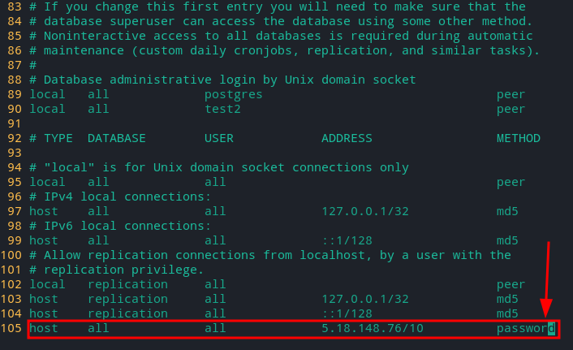

4. Перезагрузите сервер

    ```bash
    sudo systemctl restart postgresql.service
    ```

    ```bash
    # У вас может отличатся версия `PostgreSQL`
    sudo systemctl restart postgresql@12-main.service
    ```

---

- Для подключения используйте команду. (введите пароль от пользователя БД)

    ```bash
    psql -h <IpАдресСервера> -U <ИмяПользователяБд> -d <ИмяБд>
    ```

- Пример подключения к Бд через `DataGrip`

    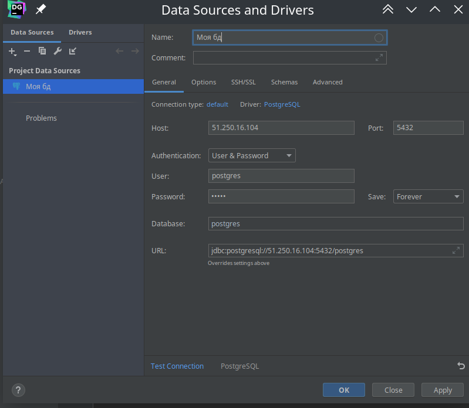

- `Name` - любое
- `Host` - `ip/domen` на котром расположен сервер `postgerSQL`
- `Port` - по умолчанию `postgreSQL` работать на `5432` порту
- `User` - пользователь в БД
- `Password`- пароль от пользователя в БД

## Про `pgAdmin4`

### Установка `pgAdmin4`

Для удобной работы с `PostgreSQL` установить программу `pgAdmin` [Как установить `pgAdmin` в python](https://www.pgadmin.org/download/pgadmin-4-python/).

| ОС           | Команда                     |
| ------------ | --------------------------- |
| `Arch Linux` | `sudo pacman -S pgadmin4`   |
| `Ubuntu`     | `sudo apt install pgadmin4` |

Для запуска программы просто введите. После этого по адресу `http://127.0.0.1:5050/` у вас запуститься `pgAdmin4`

```bash
pgadmin4
```

### Общее

---

**Создать сервер**

- 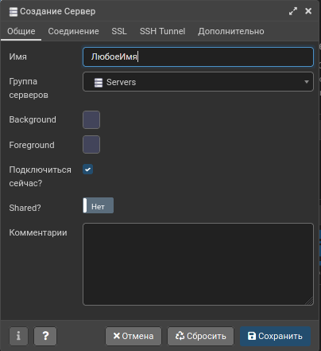
- 
    > Изначально у нас есть пользователь `postgres` на локальном сервере `127.0.0.1` поэтому для теста можно использовать его.

---

Создать таблицу
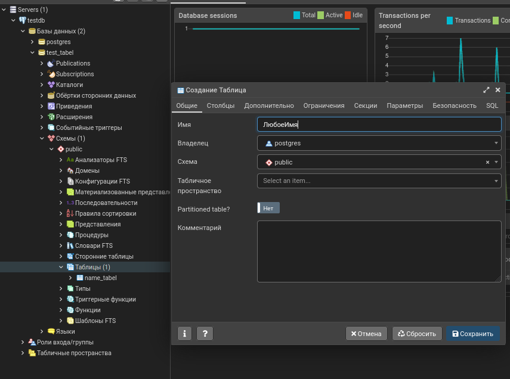

---

## Подключение `PostgreSQL` к `Django`

1. Установить адаптер в `Django` для `PostgreSQL`.

    ```bush
    pip install psycopg2-binary
    ```

1. Войти на сервер. Для этого нужно иметь установленный `postgres` [Установка PostgreSQL](#Установка%20PostgreSQL).

    ```bush
    sudo -iu postgres
    ```

1. Создать Пользователя, либо командой из пользователя `postgres`, либо `sql` командой.

    ```sql
    CREATE USER ИмяПользователя WITH PASSWORD 'ПарольПользователя';
    ```

    ```bash
    createuser --interactive -P
    ```

1. Создать БД.

    ```sql
    CREATE DATABASE ИмяБД;
    ```

1. Наделить всеми правами нашего пользователя по изменения ранее созданной БД

    ```sql
    GRANT ALL PRIVILEGES ON DATABASE "ИмяБД" TO ИмяПользователя;
    ```

1. Добавить в настройки `Django` нашу БД. `proj/settimgs.py`

    ```python
    DATABASES = {
    		# По умолчанию `Django` используйет БД с именем `default` для всех моделей.
    		# Раз мы хотим использовать `PostgreSQL` то настроим его в `default`

    		'default': {
    				'ENGINE'  : 'django.db.backends.postgresql_psycopg2',  # Адаптер
    				'NAME'    : '<ИмяБД>',  # Имя Бд
    				'USER'    : '<ИмяПользователя>',  # Имя пользователя
    				'PASSWORD': '<ПарольПользователя>',  # Пароль пользователя
    				'HOST'    : '127.0.0.1',  # Хост, мзначально `postgreSQL использовать локальный сервер.
    				'PORT'    : 5432,  # Порт для подключения. По умолчанию это 5432
    		},

    		# Можем отсавить `SQLite` которая идет по стндарту.
    		#'sqlite' : {
    		#		'ENGINE': 'django.db.backends.sqlite3',
    		#		'NAME'  : BASE_DIR / 'db.sqlite3',
    		#}

    }
    ```

1. Для того чтобы переносить данные из одной БД в другую посмотрите главу [Через Django](#Переносить%20БД%20через%20Django)

# DataGrip

## Горячие клавиши

| Windwos | MacOs | Linux              |                                                                                                                                                       | Контекст активации |
| ------- | ----- | ------------------ | ----------------------------------------------------------------------------------------------------------------------------------------------------- | ------------------ |
|         |       | `F4`               | Открыть графический редактор таблицы                                                                                                                  | Таблица            |
|         |       | `alt+siht+1`       | Увидеть объект в других местах программы                                                                                                              | Объект             |
|         |       | `ctrl+shift+a`     | Открыть окно с для поиск команд                                                                                                                       | Везде              |
|         |       | `ctrl+N`           | Поиск таблиц                                                                                                                                          | Везде              |
|         |       | `ctrl+shit+F12`    | Скрыть все лишнее окна, и сфокусироваться на главном (Работает и в обратном режиме)                                                                   | Везде              |
|         |       | `ctrl+alt+Z`       | Отменить изменения выделенных записей в редакторе таблицы                                                                                             | Редактор таблицы   |
|         |       | `ctrl+Enter`       | Применить изменения всех записей в редакторе таблицы                                                                                                  | Редактор таблицы   |
|         |       | `ctrl+D`           | Добавить пустую запись конец таблицы                                                                                                                  | Редактор таблицы   |
|         |       | `ctrl+F`           | Поиск записей (Использует собственный поиск, не отправляет `SQL` запросы)(Можно поставить галочку для фильтрации, чтобы неподходящие поля скрывались) | Редактор таблицы   |
|         |       | `ctrl+shift+alt+F` | Поиск данных по всему серверу                                                                                                                         | Везде              |
|         |       | `ctrl+E`           | Открыть историю последних открытых файлов/таблиц                                                                                                      | Везде              |
|         |       | `shift+ctrl+E`     | Открыть историю мест, где вы редактировали текст файлов/таблиц                                                                                        | Везде              |
|         |       | `ctrl+4`           | Закрыть активную вкладку                                                                                                                              | Везде              |
|         |       | `ctrl+5`           | Обновить Окно/таблицу                                                                                                                                 | Везде              |
|         |       | `alt+< / alt+>`    | Перемещаться между окнами редактора                                                                                                                   | Везде              |

- Вы можете выделить нужные записи, и скопировать их в необходимый формат
    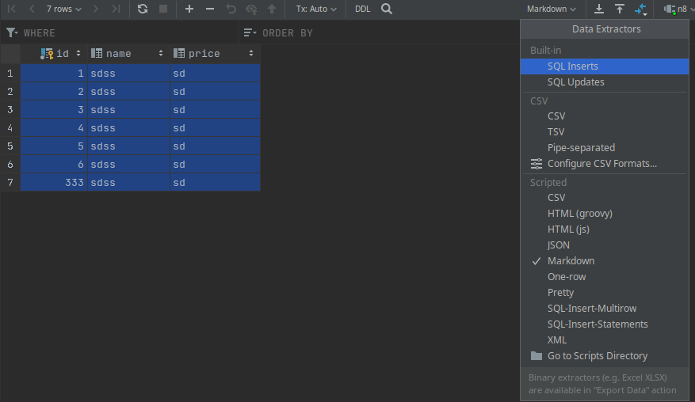

    ```bash
    | id | name | price |
    | :--- | :--- | :--- |
    | 1 | sdss | sd |
    | 2 | sdss | sd |
    | 3 | sdss | sd |
    | 4 | sdss | sd |
    | 5 | sdss | sd |
    | 6 | sdss | sd |
    | 333 | sdss | sd |

    ```

    ```sql
    INSERT INTO public.n8 (id, name, price) VALUES (1, 'sdss', 'sd');
    INSERT INTO public.n8 (id, name, price) VALUES (2, 'sdss', 'sd');
    INSERT INTO public.n8 (id, name, price) VALUES (3, 'sdss', 'sd');
    INSERT INTO public.n8 (id, name, price) VALUES (4, 'sdss', 'sd');
    INSERT INTO public.n8 (id, name, price) VALUES (5, 'sdss', 'sd');
    INSERT INTO public.n8 (id, name, price) VALUES (6, 'sdss', 'sd');
    INSERT INTO public.n8 (id, name, price) VALUES (333, 'sdss', 'sd');
    ```

    ```sql
    insert into public.n8 (id, name, price)
    values  (1, 'sdss', 'sd'),
    		(2, 'sdss', 'sd'),
    		(3, 'sdss', 'sd'),
    		(4, 'sdss', 'sd'),
    		(5, 'sdss', 'sd'),
    		(6, 'sdss', 'sd'),
    		(333, 'sdss', 'sd');
    ```

## Сохранить таблицу в нужный формат

1. 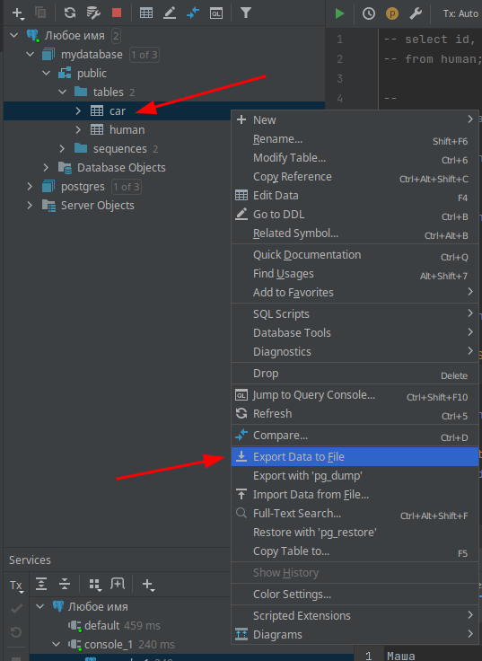
2. 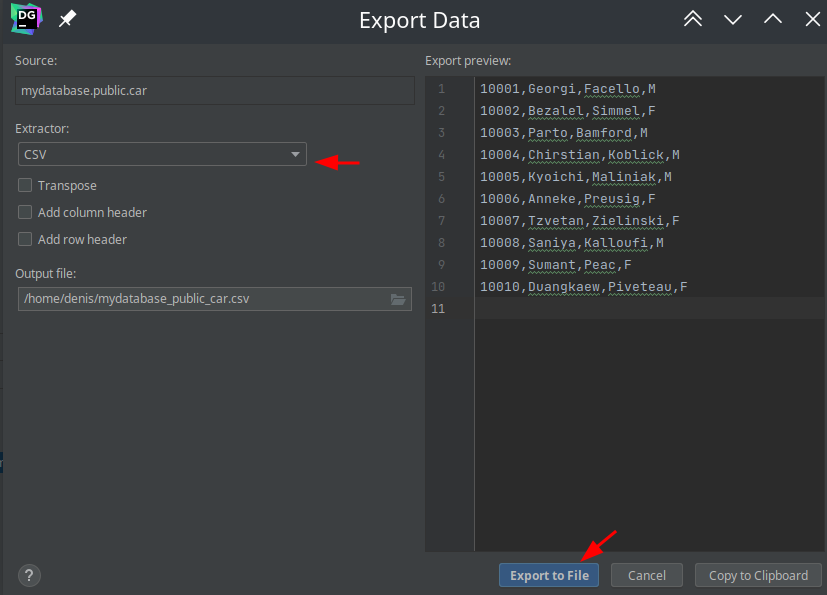

## Скопировать настройки подключения к серверу, и поделиться ими с товарищами

1. Копируем Сервер в буфер обмена `CTRL+C` (Все копируется кроме пароля от пользователя, поэтому это безопасно)

- 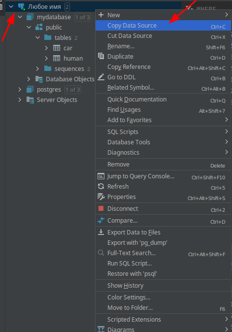

    Пример копии

    ```bash
    #DataSourceSettings#
    #LocalDataSource: Любое имя
    #BEGIN#
    <data-source source="LOCAL" name="Любое имя" uuid="209ee994-c9db-41f3-8714-a00aa5da7709">
    <database-info product="PostgreSQL" version="12.8 (Ubuntu 12.8-0ubuntu0.20.04.1)" jdbc-version="4.2" driver-name="PostgreSQL JDBC Driver" driver-version="42.2.22" dbms="POSTGRES" exact-version="12.8" exact-driver-version="42.2"><identifier-quote-string>&quot;</identifier-quote-string></database-info><case-sensitivity plain-identifiers="lower" quoted-identifiers="exact"/><driver-ref>postgresql
    </driver-ref><synchronize>true</synchronize>
    <jdbc-driver>org.postgresql.Driver</jdbc-driver><jdbc-url>jdbc:<Имя>:/<IP>:5432/postgres</jdbc-url><secret-storage>master_key</secret-storage>
    <user-name>postgres</user-name><schema-mapping><introspection-scope>
    <node negative="1"><node kind="database" qname="@"><node kind="schema" qname="@"/>
    </node><node kind="database" qname="mydatabase"><node kind="schema" qname="public"/>
    </node></node></introspection-scope></schema-mapping><working-dir>$ProjectFileDir$</working-dir></data-source>
    #END#
    ```

1. Вставляем сервер из Буфера обмена `CTRL+V`. (Вводим пароль от пользователя).

- 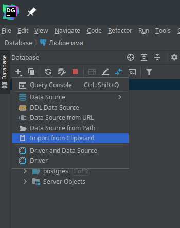
