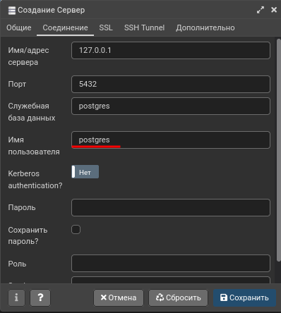

# `PostgreSQL`

`PostgreSQL` Реляционная, клиент серверная СУБД(система управления базами данных).

## Установка

### Установка `PostgreSQL`

---

Скачать PostgreSQL [+](https://www.postgresql.org/download/)

| Платформа  | Команда                                                                                                                                                                                                                                                          |
| ---------- | ---------------------------------------------------------------------------------------------------------------------------------------------------------------------------------------------------------------------------------------------------------------- |
| Arch Linux | `sudo pacman -S postgresql pgadmin4 && sudo su - postgres -c "initdb --locale ru_RU.UTF-8 -E UTF8 -D '/var/lib/postgres/data'" && sudo chown -R postgres:postgres /var/lib/postgres/` [+](https://gist.github.com/superjojo140/2a0221d517f356965371b3969f37b29f) |
| Ubuntu     | `sudo apt install postgresql postgresql-contrib`                                                                                                                                                                                                                 |
| Windows    | https://www.postgresql.org/download/windows/                                                                                                                                                                                                                     |
| MacOS      | https://www.postgresql.org/download/macosx/                                                                                                                                                                                                                      |

Запускам сервер `PostgreSQL`

```bush
sudo systemctl start postgresql
```

В ходе установки была создана учетную запись пользователя `postgres`, которая связана с используемой по умолчанию ролью `postgres`. Переходим на пользователя `postgres` который создался автоматически при загрузке `PostgreSQL`.

```bush
sudo -iu postgres
```

## Команды `PostgreSQL`

- Справочное руководство `PostgreSQL` [+](https://postgrespro.ru/docs/postgresql/11/reference)
- `psql` = интерактивный терминал PostgreSQL [+]https://postgrespro.ru/docs/postgresql/9.6/app-psql

---

| Полезные команды для `postgres`       |                                                                           |     |
| ------------------------------------- | ------------------------------------------------------------------------- | --- |
| `sudo netstat -plunt │ grep postgres` | Посмотреть где запущен `postgreSQL`(Вызывать вне пользователя `postgres`) |     |
| `sudo -iu postgres`                   | Войти в профиль                                                           |     |
|                                       |                                                                           |     |

---

| Команды из `postgres` |                            | Документация |
| --------------------- | -------------------------- | ------------ |
| `psql`                | Заходим в командную строку |              |
| `\q`                  | Выйти из `psql`            |              |

---

### Работа с пользователями

| Работа с пользователями                                                      |                                                                                                                              |                                                               |
| ---------------------------------------------------------------------------- | ---------------------------------------------------------------------------------------------------------------------------- | ------------------------------------------------------------- |
| `\du`                                                                        | Список всех пользователей                                                                                                    |                                                               |
| `SELECT current_user;`                                                       | Отобразить имя текущего пользователя                                                                                         |                                                               |
| `\conninfo`                                                                  | Отобразить имя текущего пользователя,БД, путь к сокету, порт                                                                 |                                                               |
| ---                                                                          | ---                                                                                                                          |                                                               |
| `createuser --interactive -P`                                                | Создать пользователя, `--interactive` задавать вопросы, `-P` запросить создание пароля                                       | [+](https://postgrespro.ru/docs/postgresql/11/app-createuser) |
| `CREATE USER <ИмяПользователя> WITH PASSWORD <'ВашПароль'>;`                 | Создать нового пользователя                                                                                                  |                                                               |
| ---                                                                          | ---                                                                                                                          |                                                               |
| `\password <ИмяПользователя>`                                                | Сменить пароль у пользователя                                                                                                |                                                               |
| `ALTER USER <ИмяПользователя> WITH PASSWORD <'НовыйПароль'>;`                | Изменить пароль у пользователя                                                                                               |                                                               |
| ---                                                                          | ---                                                                                                                          |                                                               |
| `ALTER USER <ИмяПользователя> WITH SUPERUSER;`                               | Дать пользователю супер права                                                                                                |                                                               |
| `ALTER TABLE <'ИмяБД'> OWNER TO <ИмяПользователя>;`                          | Назначить нового владельца таблицы из БД                                                                                     | [+](https://postgrespro.ru/docs/postgrespro/13/ddl-priv)      |
| ---                                                                          | ---                                                                                                                          |                                                               |
| `GRANT <UPDATE/SELECT/ALL ...> ON TABLE <'ИмяТаблиц'> TO <ИмяПользователя>;` | Наделить правами (добавления/чтения/Всеми правами/изменения/удаления/создания) данных в таблице, для указанного пользователя | [+](https://postgrespro.ru/docs/postgrespro/13/ddl-priv)      |
| `GRANT <UPDATE/SELECT/ALL ...> ON DATABASE <'ИмяБД'> TO <ИмяПользователя>;`  | Наделить правами (добавления/чтения/Всеми правами/изменения/удаления/создания) данных в БД, для указанного пользователя      | [+](https://postgrespro.ru/docs/postgrespro/13/ddl-priv)      |
| ---                                                                          | ---                                                                                                                          |                                                               |
| `REVOKE ALL ON TABLE <'ИмяБД'> FROM <ИмяПользователя>;`                      | Лишить прав (добавления/чтения/Всеми правами/изменения/удаления/создания) данных в таблице, для указанного пользователя      |                                                               |
| `REVOKE ALL ON DATABASE <'ИмяБД'> FROM <ИмяПользователя>;`                   | Лишить прав (добавления/чтения/Всеми правами/изменения/удаления/создания) данных в БД, для указанного пользователя           |                                                               |
| ---                                                                          | ---                                                                                                                          |                                                               |
| `DROP USER <ВашеИмя>;`                                                       | Удалить пользователя                                                                                                         |                                                               |
| `dropuser`                                                                   | Удалить пользователя                                                                                                         | [+](https://postgrespro.ru/docs/postgresql/11/app-dropuser)   |

### Привилегии

| Право      | Сокращение | Применимые типы объектов                                                                       |
| ---------- | ---------- | ---------------------------------------------------------------------------------------------- |
| SELECT     | r          | («read», чтение) LARGE OBJECT, SEQUENCE, TABLE (и объекты, подобным таблицам), столбец таблицы |
| INSERT     | a          | («append», добавление) TABLE, столбец таблицы                                                  |
| UPDATE     | w          | («write», запись) LARGE OBJECT, SEQUENCE, TABLE, столбец таблицы                               |
| DELETE     | d          | TABLE                                                                                          |
| TRUNCATE   | D          | TABLE                                                                                          |
| REFERENCES | x          | TABLE, столбец таблицы                                                                         |
| TRIGGER    | t          | TABLE                                                                                          |
| CREATE     | C          | DATABASE, SCHEMA, TABLESPACE                                                                   |
| CONNECT    | c          | DATABASE                                                                                       |
| TEMPORARY  | T          | DATABASE                                                                                       |
| EXECUTE    | X          | FUNCTION, PROCEDURE                                                                            |
| USAGE      | U          | DOMAIN, FOREIGN DATA WRAPPER, FOREIGN SERVER, LANGUAGE, SCHEMA, SEQUENCE, TYPE                 |

| Тип объекта                          | Все права | Права PUBLIC по умолчанию | Команда `psql` |
| ------------------------------------ | --------- | ------------------------- | -------------- |
| DATABASE                             | CTc       | Tc                        | `\l `          |
| DOMAIN                               | U         | U                         | `\dD+ `        |
| FUNCTION или PROCEDURE               | X         | X                         | `\df+ `        |
| FOREIGN DATA WRAPPER                 | U         | нет                       | `\dew+ `       |
| FOREIGN SERVER                       | U         | нет                       | `\des+`        |
| LANGUAGE                             | U         | U                         | `\dL+ `        |
| LARGE OBJECT                         | rw        | нет                       |                |
| SCHEMA                               | UC        | нет                       | `\dn+ `        |
| SEQUENCE                             | rwU       | нет                       | `\dp `         |
| TABLE (и объекты, подобные таблицам) | arwdDxt   | нет                       | `\dp `         |
| Столбец таблицы                      | arwx      | нет                       | `dp`           |
| TABLESPACE                           | C         | нет                       | `\db+ `        |
| TYPE                                 | U         | U                         | `\dT+ `        |

### Работа с БД

| Работа с БД              |                                                                     |
| ------------------------ | ------------------------------------------------------------------- |
| `CREATE DATABASE ИмяБД;` | Создать БД.                                                         |
| `createdb <ИмяБД>`       | Создать БД                                                          |
| ---                      | ---                                                                 |
| `DROP DATABASE ИмяБД;`   | Удалить БД. Для удаления таблицы нужно закрыть все соединения к ней |
| `dropdb <ИмяБд>`         | Удалить БД. Для удаления таблицы нужно закрыть все соединения к ней |
| ---                      | ---                                                                 |
| `\l`                     | Показать все БД                                                     |
| `\c ИмяБД`               | Подключиться к БД                                                   |

> Закрыть все соединения с таблицей (Это нужно для удаления таблицы)
>
> ```sql
> SELECT pg_terminate_backend(pg_stat_activity.pid)
> FROM pg_stat_activity
> WHERE pg_stat_activity.datname = '<ИмяТаблицы>'
>   AND pid <> pg_backend_pid();
> ```

---

| Работа с таблицами |                                                                |
| ------------------ | -------------------------------------------------------------- |
| `\dt`              | Все таблицы в БД. Аналог `SELECT * FROM pg_catalog.pg_tables;` |
| `\dp`              | Отобразить привилегии и права пользователей на таблицы.        |
| `\d+ <ИмяТяблицы>` | Получить информацию о типах столбцов в таблицы                 |

### Информационные схемы

Информационная схема сама по себе — это схема с именем `information_schema`. Данная схема автоматически доступна во всех базах данных. Владельцем этой схемы является начальный пользователь баз данных в кластере, и этот пользователь, естественно, имеет все права в ней, включая возможность её удалить [+](https://postgrespro.ru/docs/postgresql/9.6/information-schema)

1. Получить схему таблицы. [+](https://postgrespro.ru/docs/postgresql/9.6/infoschema-columns)

```sql
SELECT column_name, column_default, data_type
FROM INFORMATION_SCHEMA.COLUMNS
WHERE table_name = 'my_table';
```

## Типы данных в `PostgreSQL`

[Исходная таблица данных](https://postgrespro.ru/docs/postgresql/9.4/datatype)

| Целые числа | Псевдонимы | Описание                                                         |
| ----------- | ---------- | ---------------------------------------------------------------- |
| smallint    | int2       | Число -32.768 ... 32.767                                         |
| integer     | int , int4 | Число -2.147.483.648 ... 2.147.483.647                           |
| bigint      | int8       | Число -9.223.372.036.854.7775.808 ... 9.223.372.036.854.7775.807 |
| smallserial | serial2    | двухбайтное целое с автоувеличением (При вставке)                |
| serial      | serial4    | четырёхбайтное целое с автоувеличением (При вставке)             |
| bigserial   | serial8    | восьмибайтное целое с автоувеличением (При вставке)              |

| Дробные числа    | Псевдонимы |                                                                                                                                                                          |
| ---------------- | ---------- | ------------------------------------------------------------------------------------------------------------------------------------------------------------------------ |
| numeric          | decimal    | вещественное число заданной точности.                                                                                                                                    |
| real             | float4     | число одинарной точности с плавающей точкой (4 байта)                                                                                                                    |
| double precision | float8     | число двойной точности с плавающей точкой (8 байт)                                                                                                                       |
| money            |            | денежная сумма, не обращайте внимание на валюту, изначально валюта отображатеся в долорах (Для отображения рублей `SELECT concat(price::numeric,' руб') FROM <Таблица>`) |

| Текст                 | Псевдонимы  | Описание                                                                         |
| --------------------- | ----------- | -------------------------------------------------------------------------------- |
| character [n]         | char [n]    | символьная строка фиксированной длины (Недостающая длинна дополняется пробелами) |
| character varying [n] | varchar [n] | символьная строка переменной длины (Недостающая длинна остаётся пустой)          |
| text                  |             | символьная строка произвольной длины                                             |

| Логический | Псевдонимы | Описание                         |
| ---------- | ---------- | -------------------------------- |
| boolean    | bool       | логическое значение (true/false) |

| Дата                            | Псевдонимы  | Описание                             |
| ------------------------------- | ----------- | ------------------------------------ |
| time [ without time zone ]      |             | время суток (без часового пояса)     |
| time                            | timetz      | время суток с учётом часового пояса  |
| timestamp [ without time zone ] |             | дата и время (без часового пояса)    |
| timestamp                       | timestamptz | дата и время с учётом часового пояса |
| date                            |             | календарная дата (год, месяц, день)  |
| interval                        |             | интервал времени(`timestamp`)        |

| Другие          | Псевдонимы | Описание                           |
| --------------- | ---------- | ---------------------------------- |
| bit [n]         |            | битовая строка фиксированной длины |
| bit varying [n] | varbit     | битовая строка переменной длины    |
| box             |            | прямоугольник в плоскости          |
| bytea           |            | двоичные данные ("массив байт")    |
| cidr            |            | сетевой адрес IPv4 или IPv6        |
| circle          |            | круг в плоскости                   |
| inet            |            | адрес узла IPv4 или IPv6           |
| json            |            | текстовые данные JSON              |
| jsonb           |            | двоичные данные JSON, разобранные  |
| line            |            | прямая в плоскости                 |
| lseg            |            | отрезок в плоскости                |
| macaddr         |            | MAC-адрес                          |

| path          |     | геометрический путь в плоскости             |
| ------------- | --- | ------------------------------------------- |
| pg_lsn        |     | Последовательный номер в журнале PostgreSQL |
| point         |     | геометрическая точка в плоскости            |
| polygon       |     | замкнутый геометрический путь в плоскости   |
| tsquery       |     | запрос текстового поиска                    |
| tsvector      |     | документ для текстового поиска              |
| txid_snapshot |     | снимок идентификатора транзакций            |
| uuid          |     | универсальный уникальный идентификатор      |
| xml           |     | XML-данные                                  |

## Подключение к БД

### Подключение к БД от имени другого пользователя

** Для того чтобы подключится к `PostgreSQL` под другим пользователем нужно выполнить следующие шаги:**

1. Создать нового пользователя в `postgreSQL`. (Если у вас уже есть пользователь то можно пропустить этот этап)

    ```bash
    createuser --interactive -P
    ```

1. Создать нового пользователя `Linux`, с таким же именем как и в `postgreSQL`(Если у вас уже есть пользователь с таким же именем то можно пропустить этот этап)

    ```bash
    sudo createuser <ИмяПользователя>
    ```

1. Переключиться или войти в профиль нужно нам пользователя.

    ```bash
    sudo -iu <ИмяПользователя>
    ```

---

### Удаленное подключение к серверу `PostgreSQL`

Изначала сервер `PostgreSQL` разрешает подключения только на локальном адресе `127.0.0.0.1`, чтобы разрешить удаленное подключение, нам нужно отредактировать настройки `pg_hba.conf` [+](https://www.dmosk.ru/miniinstruktions.php?mini=pgsql-remote).

> Для корректной работы ваш пользователь должен иметь пароль. Как в `PostgreSQL`, так и в системе `Linux`
>
> -   Создать/Изменить пароль в `PostgreSQL` для подключения
>
>     ```bash
>     sudo -iu postgres
>     psql
>
>     #SQL
>     ALTER USER <ИмяПользователя> PASSWORD 'ВашПароль';
>     ```
>
> -   Создать/Изменить пароль пользователя в `Linux`
>
>     ```bash
>     sudo passwd <ИмяПользователя>
>     ```

1. Чтобы узнать абсолютный путь к настройкам введите команду (У пользователя `postgres` должен быть пароль, если его нет то создайте. `sudo passwd postgres`)

    ```bash
    su - postgres -c "psql -c 'SHOW config_file;'"
    # /etc/postgresql/12/main/postgresql.conf
    ```

2. `/etc/postgresql/12/main/postgresql.conf` (по умолчанию, параметр закомментирован и настроен на прослушивание запросов только с локального сетевого интерфейса. В данном примере мы разрешили прослушивание запросов на всех IP-адресах, но, если требуется более безопасная настройка, можно просто перечислить последние через пробел.)

    ```bash
    listen_addresses = '*'
    ```

3. Добавьте в настройки `/etc/postgresql/12/main/pg_hba.conf`(**путь может быть другим, нужно смотреть на результат `su - postgres -c "psql -c 'SHOW config_file;'"`** ). Если нам нужно подключатся к БД которая находится во локальной сети, то указываем локальный `ip` адрес , а если нам нужно подключаться из к ней из интернета, то укажите ваш внешний `ip` адрес в настройки.(Чтобы узнать внешний `ip` адрес воспользуйтесь командой `wget -O - -q icanhazip.com` )

    ```bash
    # TYPE  DATABASE        USER            ADDRESS                 METHOD
    # "local" is for Unix domain socket connections only
    local   all             all                                     peer
    # IPv4 local connections:
    host    all             all             127.0.0.1/32            md5
    # IPv6 local connections:
    host    all             all             ::1/128                 md5
    # Allow replication connections from localhost, by a user with the
    host    all     		all     		<192.168.0.10/32>     	password  # !!!!!!!!!!!!

    # (Обратите внимание что нужно ставить именно `TAB`ы для разделения слов)
    ```

    > `<192.168.0.10/32>` Замените на свой `ip` адрес. Если вы хотите разрешить подключение только одному устройству из сети, то укажите маску `5.18.135.76/0`

    

4. Обязательно Перезагрузите сервер чтобы он обновил свои настройки

    ```bash
    sudo systemctl restart postgresql.service
    ```

    ```bash
    # У вас может отличатся версия `PostgreSQL`
    sudo systemctl restart postgresql@12-main.service
    ```

---

- Для подключения используйте команду. (введите пароль от пользователя БД)

    ```bash
    psql -h <IpАдресСервера> -U <ИмяПользователяБд> -d <ИмяБд>
    ```

- Пример подключения к Бд через `DataGrip`

    

- `Name` - любое
- `Host` - `ip/domen` на котром расположен сервер `postgerSQL`
- `Port` - по умолчанию `postgreSQL` работать на `5432` порту
- `User` - пользователь в БД
- `Password`- пароль от пользователя в БД

## Про `pgAdmin4`

### Установка `pgAdmin4`

Для удобной работы с `PostgreSQL` установить программу `pgAdmin` [Как установить `pgAdmin` в python](https://www.pgadmin.org/download/pgadmin-4-python/).

| ОС           | Команда                     |
| ------------ | --------------------------- |
| `Arch Linux` | `sudo pacman -S pgadmin4`   |
| `Ubuntu`     | `sudo apt install pgadmin4` |

Для запуска программы просто введите. После этого по адресу `http://127.0.0.1:5050/` у вас запуститься `pgAdmin4`

```bash
pgadmin4
```

### Общее

---

**Создать сервер**

- 
- 
    > Изначально у нас есть пользователь `postgres` на локальном сервере `127.0.0.1` поэтому для теста можно использовать его.

---

Создать таблицу


---

## Подключение `PostgreSQL` к `Django`

1. Установить адаптер в `Django` для `PostgreSQL`.

    ```bush
    pip install psycopg2-binary
    ```

1. Войти на сервер. Для этого нужно иметь установленный `postgres` [Установка PostgreSQL](#Установка%20PostgreSQL).

    ```bush
    sudo -iu postgres
    ```

1. Создать Пользователя, либо командой из пользователя `postgres`, либо `sql` командой.

    ```sql
    CREATE USER ИмяПользователя WITH PASSWORD 'ПарольПользователя';
    ```

    ```bash
    createuser --interactive -P
    ```

1. Создать БД.

    ```sql
    CREATE DATABASE ИмяБД;
    ```

1. Наделить всеми правами нашего пользователя по изменения ранее созданной БД

    ```sql
    GRANT ALL PRIVILEGES ON DATABASE "ИмяБД" TO ИмяПользователя;
    ```

1. Добавить в настройки `Django` нашу БД. `proj/settimgs.py`

    ```python
    DATABASES = {
    		# По умолчанию `Django` используйет БД с именем `default` для всех моделей.
    		# Раз мы хотим использовать `PostgreSQL` то настроим его в `default`

    		'default': {
    				'ENGINE'  : 'django.db.backends.postgresql_psycopg2',  # Адаптер
    				'NAME'    : '<ИмяБД>',  # Имя Бд
    				'USER'    : '<ИмяПользователя>',  # Имя пользователя
    				'PASSWORD': '<ПарольПользователя>',  # Пароль пользователя
    				'HOST'    : '127.0.0.1',  # Хост, мзначально `postgreSQL использовать локальный сервер.
    				'PORT'    : 5432,  # Порт для подключения. По умолчанию это 5432
    		},

    		# Можем отсавить `SQLite` которая идет по стндарту.
    		#'sqlite' : {
    		#		'ENGINE': 'django.db.backends.sqlite3',
    		#		'NAME'  : BASE_DIR / 'db.sqlite3',
    		#}

    }
    ```

1. Для того чтобы переносить данные из одной БД в другую посмотрите главу [Через Django](#Переносить%20БД%20через%20Django)

# plpython3

## Подготовка

- Оглавление Документации [+](https://postgrespro.ru/docs/postgrespro/9.6/plpython)
- Введение в Функции на `PL/Python` [+](https://postgrespro.ru/docs/postgrespro/9.6/plpython-funcs)

---

- Установка:

    ```bash
    sudo apt update && sudo  apt install postgresql-plpython3-11
    ```

- Установка: `Dockerfile` (!!! Изменить данные в переменных окружениях)

    ```bash
    FROM postgres:12

    ENV POSTGRES_DB=postgres \
    	POSTGRES_USER=postgres \
    	POSTGRES_PASSWORD=postgres

    RUN apt update &&  apt install postgresql-plpython3-12 postgresql-contrib-12 -y

    EXPOSE 5432
    ```

    Создать образ

    ```bash
    docker build -t postgres_py .;
    ```

    Запустить образ

    ```bash
    docker run --rm -ti  --name postgres_py_container postgres_py;
    ```

---

Добавить (один раз) поддержку языка в `Postgres`

```sql
CREATE LANGUAGE plpython3u;
--CREATE EXTENSION plpython3u;
```


---

## Использование `Python` функций

Шаблон

```sql
CREATE FUNCTION <ИмяФункции>(<Аргумент1> <SqlТипАргумента>, ... ) RETURNS <SqlТипДанныхВыхода>
AS
$$
-- Тело `Python`


if len(a) > 5:
	return a
return None


$$ LANGUAGE plpython3u
```

- Чтобы указать массив `SQL` типов используйте квадратные скобки (`int[]`)
- Чтобы внутри `Python` функции выполнить запрос к БД используйте метод `res = plpy.execute(""" <SqlЗапрос> """)`[+](https://postgrespro.ru/docs/postgrespro/9.6/plpython-subtransaction)[+](https://postgrespro.ru/docs/postgrespro/9.6/plpython-database)

---

```sql
CREATE LANGUAGE plpython3u;


CREATE FUNCTION pumax(a varchar) RETURNS varchar
AS
$$
if len(a) > 5:
	return a
return None
$$ LANGUAGE plpython3u;


SELECT pumax(name)
FROM table_name;


CREATE TABLE table_name
(
    id    serial PRIMARY KEY,
    name  varchar(200),
    price money
);

INSERT INTO table_name (name, price)
VALUES ('Петя', 123),
       ('Костя', 123),
       ('Степа', 43),
       ('Маша', 34345),
       ('Сергей', 634),
       ('Игорь', 346)
;
```

# `DataGrip`

## Горячие клавиши

| `Windwos` | `MacOs` | `Linux`            | Описание                                                                                                                                              | Контекст активации |
| --------- | ------- | ------------------ | ----------------------------------------------------------------------------------------------------------------------------------------------------- | ------------------ |
|           |         | `F4`               | Открыть графический редактор таблицы                                                                                                                  | Таблица            |
|           |         | `alt+siht+1`       | Увидеть объект в других местах программы                                                                                                              | Объект             |
|           |         | `ctrl+shift+a`     | Открыть окно с для поиск команд                                                                                                                       | Везде              |
|           |         | `ctrl+N`           | Поиск таблиц                                                                                                                                          | Везде              |
|           |         | `ctrl+shit+F12`    | Скрыть все лишнее окна, и сфокусироваться на главном (Работает и в обратном режиме)                                                                   | Везде              |
|           |         | `ctrl+alt+Z`       | Отменить изменения выделенных записей в редакторе таблицы                                                                                             | Редактор таблицы   |
|           |         | `ctrl+Enter`       | Применить изменения всех записей в редакторе таблицы                                                                                                  | Редактор таблицы   |
|           |         | `ctrl+D`           | Добавить пустую запись конец таблицы                                                                                                                  | Редактор таблицы   |
|           |         | `ctrl+F`           | Поиск записей (Использует собственный поиск, не отправляет `SQL` запросы)(Можно поставить галочку для фильтрации, чтобы неподходящие поля скрывались) | Редактор таблицы   |
|           |         | `ctrl+shift+alt+F` | Поиск данных по всему серверу                                                                                                                         | Везде              |
|           |         | `ctrl+E`           | Открыть историю последних открытых файлов/таблиц                                                                                                      | Везде              |
|           |         | `shift+ctrl+E`     | Открыть историю мест, где вы редактировали текст файлов/таблиц                                                                                        | Везде              |
|           |         | `ctrl+4`           | Закрыть активную вкладку                                                                                                                              | Везде              |
|           |         | `ctrl+5`           | Обновить Окно/таблицу                                                                                                                                 | Везде              |
|           |         | `alt+< / alt+>`    | Перемещаться между окнами редактора                                                                                                                   | Везде              |

- Вы можете выделить нужные записи, и скопировать их в необходимый формат
    

    ```bash
    | id | name | price |
    | :--- | :--- | :--- |
    | 1 | sdss | sd |
    | 2 | sdss | sd |
    | 3 | sdss | sd |
    | 4 | sdss | sd |
    | 5 | sdss | sd |
    | 6 | sdss | sd |
    | 333 | sdss | sd |

    ```

    ```sql
    INSERT INTO public.n8 (id, name, price) VALUES (1, 'sdss', 'sd');
    INSERT INTO public.n8 (id, name, price) VALUES (2, 'sdss', 'sd');
    INSERT INTO public.n8 (id, name, price) VALUES (3, 'sdss', 'sd');
    INSERT INTO public.n8 (id, name, price) VALUES (4, 'sdss', 'sd');
    INSERT INTO public.n8 (id, name, price) VALUES (5, 'sdss', 'sd');
    INSERT INTO public.n8 (id, name, price) VALUES (6, 'sdss', 'sd');
    INSERT INTO public.n8 (id, name, price) VALUES (333, 'sdss', 'sd');
    ```

    ```sql
    insert into public.n8 (id, name, price)
    values  (1, 'sdss', 'sd'),
    		(2, 'sdss', 'sd'),
    		(3, 'sdss', 'sd'),
    		(4, 'sdss', 'sd'),
    		(5, 'sdss', 'sd'),
    		(6, 'sdss', 'sd'),
    		(333, 'sdss', 'sd');
    ```

## Сохранить таблицу в нужный формат

1. 
2. 

## Скопировать настройки подключения к серверу, и поделиться ими с товарищами

1. Копируем Сервер в буфер обмена `CTRL+C` (Все копируется кроме пароля от пользователя, поэтому это безопасно)

- 

    Пример копии

    ```bash
    #DataSourceSettings#
    #LocalDataSource: Любое имя
    #BEGIN#
    <data-source source="LOCAL" name="Любое имя" uuid="209ee994-c9db-41f3-8714-a00aa5da7709">
    <database-info product="PostgreSQL" version="12.8 (Ubuntu 12.8-0ubuntu0.20.04.1)" jdbc-version="4.2" driver-name="PostgreSQL JDBC Driver" driver-version="42.2.22" dbms="POSTGRES" exact-version="12.8" exact-driver-version="42.2"><identifier-quote-string>&quot;</identifier-quote-string></database-info><case-sensitivity plain-identifiers="lower" quoted-identifiers="exact"/><driver-ref>postgresql
    </driver-ref><synchronize>true</synchronize>
    <jdbc-driver>org.postgresql.Driver</jdbc-driver><jdbc-url>jdbc:<Имя>:/<IP>:5432/postgres</jdbc-url><secret-storage>master_key</secret-storage>
    <user-name>postgres</user-name><schema-mapping><introspection-scope>
    <node negative="1"><node kind="database" qname="@"><node kind="schema" qname="@"/>
    </node><node kind="database" qname="mydatabase"><node kind="schema" qname="public"/>
    </node></node></introspection-scope></schema-mapping><working-dir>$ProjectFileDir$</working-dir></data-source>
    #END#
    ```

1. Вставляем сервер из Буфера обмена `CTRL+V`. (Вводим пароль от пользователя).

- 
