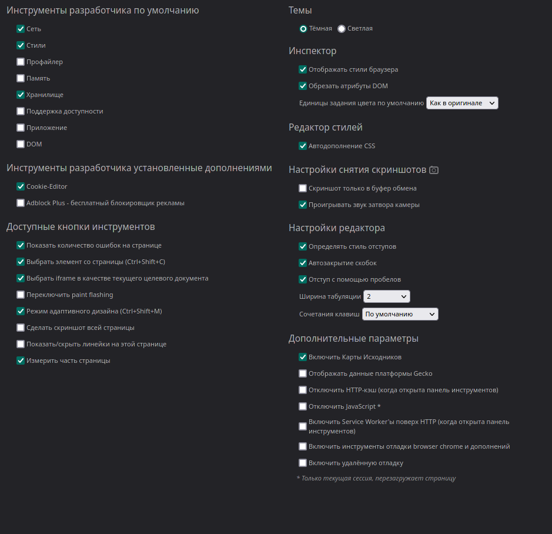
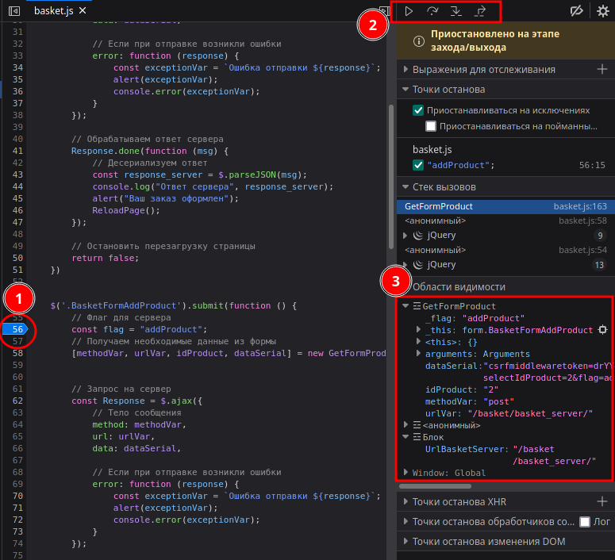

# Firefox

Вкладки

- `Стили` позволяет изменять `CSS` стили.
- `Сеть` Запросы к серверам.
- `Отладчик` - Отладка `JavaScript`
    

    1.  Поставить точку остановки
    2.  Навигация по проекту
    3.  Переменные

- `Консоль` консоль для `JavaScript`
- `Хранилище` отображает `Cookie` файлы
- `Инспектор` Навигация по `html` документу

