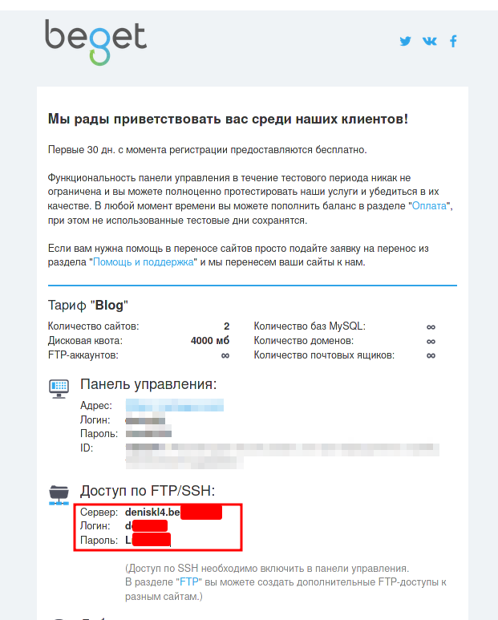

# Сайт на хостинге

[Официальная документация](https://beget.com/ru/kb/how-to/web-apps/python)

---

## Получить хостинг

https://beget.com/ru/hosting/virtual

## Подключиться к хостингу по SSH

Включить доступ по SSH (Нужно привязать номер телефона)


---

Подключиться по SHH. Ввести логин, сервер, пароль

```bush
shh Login@IP
```

- `Login` Логин
- `Ip` Сервер

Ввести пароль который вам вышлют на почту

> 

Потом необходимо войти в `Docker`.(Он спросит пароль)

```bush
ssh localhost -p222
```

---

## Подключится по FTP

Нужно создать FTP-Аккаунт


Нужно ввести Логин, Сервер, Пароль. **Порт 21**


## Установка `Python`

Сначала необходимо войти в `Docker`.(Он спросит пароль)

```bush
ssh localhost -p222
```

Создать папку со временными файлами

```bush
mkdir -p ~/.beget/tmp && cd ~/.beget/tmp
```

Скачать компилятор, распаковать архив, удалить архив, перейти в папку

```bush
wget ftp://sourceware.org/pub/libffi/libffi-3.2.1.tar.gz && tar -xf libffi-3.2.1.tar.gz && rm -r libffi-3.2.1.tar.gz && cd libffi-3.2.1
```

Настройка конфигурации, компиляция, установка

```bush
./configure --prefix $HOME/.local LDFLAGS="-L/usr/local/lib" && make -j33 && make install
```

Копируем файлы в `include`

```bush
mkdir -p ~/.local/include &&  cp x86_64-unknown-linux-gnu/include/ffi.h ~/.local/include/ && cp x86_64-unknown-linux-gnu/include/ffitarget.h ~/.local/include/
```

Скачиваем исходники `python`, разархивируем, удаляем архив (Можно выбрать другую версию Python)

```bush
cd ~/.beget/tmp &&  wget https://www.python.org/ftp/python/3.8.2/Python-3.8.2.tgz && tar -xf Python-3.8.2.tgz && rm -r Python-3.8.2.tgz && cd Python-3.8.2
```

Настраиваем, компилируем `python`, проверим

```bush
./configure --prefix=$HOME/.local LDFLAGS="-L/usr/local/lib" && make -j33 && make install && ~/.local/bin/python3.8 -V
```

Проверим работоспособность

```bush
python3.8
```

---

Установить общий доступ к папке `.local` [+](https://sprutio.beget.com/)

- 
- 

---

## Создать виртуальное окружение

`venv` нужно располагать в папке с именем `Сервер` (`deniskl4.beget.tech`) (Чтобы проверить путь к ВО `which python`)

```bush
python3.8 -m venv <ИмяВО>
```

Скачать все необходимые зависимости. (Лучше заранее создать файл `requirements.txt`и хранить его вмести с проектом на `GitHab`)

```bush
pip3 install -r requirements.txt
```

## Скачать проект

Разместите свой сайт на `GitHab`, а потом просто скачайте его на сервер командой

```bush
git clone <URL_Вашего проета>
```


## Настроить Djang

Помощник для оформления `passenger_wsgi.py` `.htaccess `. Файл должен находится в папке сервера `/home/d/<Имя>/<Сервер>.beget.tech`.

```python
import os
import site
import sys

catpath = lambda _index=-1: "/".join(os.path.abspath(__file__).split("/")[:_index])


def init_beget(_name_path):
    """
    python ...py init HelloDjango
    """

    passenger_wsgi = f"""
import os, sys
sys.path.insert(0, '{catpath(-1)}/{_name_path}')
sys.path.insert(1, '{site.getsitepackages()[0]}')
os.environ['DJANGO_SETTINGS_MODULE'] = '{_name_path}.settings'
from django.core.wsgi import get_wsgi_application
application = get_wsgi_application()
"""[1:]

    htaccess = f"""
PassengerEnabled On
PassengerPython {sys.executable}
"""[1:]
    print("\nОбратите внимание каким интерпретатором вы запустили код!\n")
    print("\n<passenger_wsgi.py>\n", passenger_wsgi)
    print("<.htaccess>\n", htaccess)

    res = input("Все верно ? Y/n  ")

    if res == "y" or res == "Y":
        with open("passenger_wsgi.py", "w") as _file:
            _file.write(passenger_wsgi)
        with open(".htaccess", "w") as _file:
            _file.write(htaccess)
        print("Не забудьте изменить имя хоста в settings.py")
    else:
        print("Файлы не созданы")


if __name__ == '__main__':
    """
    chmod +x ./<myscript>
    ./<myscript>
    """
    _request = sys.argv

    if _request[-1] == "docker":  # Активировать Docker
        print("ssh localhost -p222")


    elif _request[-1] == "venv":  # Активировать ВО
        print(f". {catpath()}/venv/bin/activate && which python")

    elif len(_request) == 3 and _request[-2] == "set":  # Настроить переадресацию
        # python ...py init HelloDjango
        name_path = _request[-1]
        init_beget(name_path)

    elif _request[-1] == "help":
        print("docker = Активировать Docker\n"
              "venv =  Активировать ВО\n"
              "set <ИмяПроектаDjango> = Настроить переадресацию\n")

    else:
        print("Неизвестная команда")
```

Допустим у него будет название `helpr.py`. Тогда необходимо запустить таким образом.

```bush
pythno3.8 helper.py <ИмяПроекта>
```

---

Пример `pythno3.8 helper.py HelloDjango`

`passenger_wsgi.py`

```python
import os, sys
sys.path.insert(0, '/home/d/deniskl4/deniskl4.beget.tech/HelloDjango')
sys.path.insert(1, '/home/d/deniskl4/deniskl4.beget.tech/venv/lib/python3.8/site-packages')
os.environ['DJANGO_SETTINGS_MODULE'] = 'HelloDjango.settings' # обратите внимание что название главного приложения может отличатся от папки, если это так то сделайте имена одинаковые.
from django.core.wsgi import get_wsgi_application
application = get_wsgi_application()
```

`.htaccess`

```bush
PassengerEnabled On
PassengerPython /home/d/deniskl4/deniskl4.beget.tech/venv/bin/python3.8
```

---

Добавить хостинг в программе`settings.py`

```python
ALLOWED_HOSTS = ["Сервер"]  # Указать свое имя сервера
```

---

Создать `restart.txt`

```bush
cd ~/<Сервер>/ && mkdir tmp; touch tmp/restart.txt
```

---

Для корректной отдачи статического контента средствами **Nginx** создается симлинк на **public_html**:

```bush
ln -s public_html public
```
