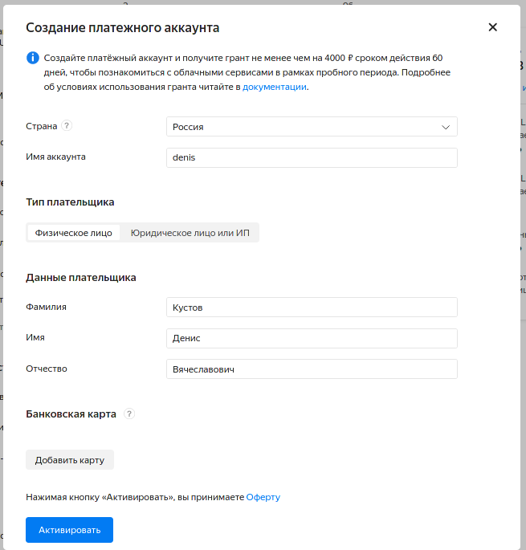
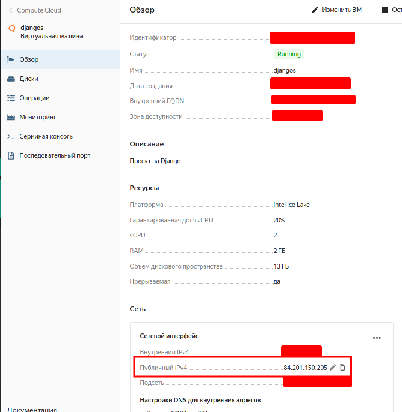

# beget

[Официальная документация](https://beget.com/ru/kb/how-to/web-apps/python)

---

## Получить хостинг

https://beget.com/ru/hosting/virtual

## Подключиться к хостингу по SSH

Включить доступ по SSH (Нужно привязать номер телефона)


---

Подключиться по SHH. Ввести логин, сервер, пароль

```bash
shh Login@IP
```

- `Login` Логин
- `Ip` Сервер

Ввести пароль который вам вышлют на почту

> 

Потом необходимо войти в `Docker`.(Он спросит пароль)

```bash
ssh localhost -p222
```

---q

## Подключится по FTP

Нужно создать FTP-Аккаунт


Нужно ввести Логин, Сервер, Пароль. **Порт 21**


## Установка `Python`

Сначала необходимо войти в `Docker`.(Он спросит пароль)

```bash
ssh localhost -p222
```

Создать папку со временными файлами

```bash
mkdir -p ~/.beget/tmp && cd ~/.beget/tmp
```

Скачать компилятор, распаковать архив, удалить архив, перейти в папку

```bash
wget ftp://sourceware.org/pub/libffi/libffi-3.2.1.tar.gz && tar -xf libffi-3.2.1.tar.gz && rm -r libffi-3.2.1.tar.gz && cd libffi-3.2.1
```

Настройка конфигурации, компиляция, установка

```bash
./configure --prefix $HOME/.local LDFLAGS="-L/usr/local/lib" && make -j33 && make install
```

Копируем файлы в `include`

```bash
mkdir -p ~/.local/include &&  cp x86_64-unknown-linux-gnu/include/ffi.h ~/.local/include/ && cp x86_64-unknown-linux-gnu/include/ffitarget.h ~/.local/include/
```

Скачиваем исходники `python`, разархивируем, удаляем архив (Можно выбрать другую версию Python)

```bash
cd ~/.beget/tmp &&  wget https://www.python.org/ftp/python/3.8.2/Python-3.8.2.tgz && tar -xf Python-3.8.2.tgz && rm -r Python-3.8.2.tgz && cd Python-3.8.2
```

Настраиваем, компилируем `python`, проверим

```bash
./configure --prefix=$HOME/.local LDFLAGS="-L/usr/local/lib" && make -j33 && make install && ~/.local/bin/python3.8 -V
```

Проверим работоспособность

```bash
python3.8
```

---

Установить общий доступ к папке `.local` [+](https://sprutio.beget.com/)

- 
- 

---

## Создать виртуальное окружение

`venv` нужно располагать в папке с именем `Сервер` (`deniskl4.beget.tech`) (Чтобы проверить путь к ВО `which python`)

```bash
python3.8 -m venv <ИмяВО>
```

Скачать все необходимые зависимости. (Лучше заранее создать файл `requirements.txt`и хранить его вмести с проектом на `GitHab`)

```bash
pip3 install -r requirements.txt
```

## Скачать проект

Разместите свой сайт на `GitHab`, а потом просто скачайте его на сервер командой

```bash
git clone <URL_Вашего проета>
```


## Настроить Djang

Помощник для оформления `passenger_wsgi.py` `.htaccess `. Файл должен находится в папке сервера `/home/d/<Имя>/<Сервер>.beget.tech`.

```python
import os
import site
import sys

catpath = lambda _index=-1: "/".join(os.path.abspath(__file__).split("/")[:_index])


def init_beget(_name_path):
    """
    python ...py init HelloDjango
    """

    passenger_wsgi = f"""
import os, sys
sys.path.insert(0, '{catpath(-1)}/{_name_path}')
sys.path.insert(1, '{site.getsitepackages()[0]}')
os.environ['DJANGO_SETTINGS_MODULE'] = '{_name_path}.settings'
from django.core.wsgi import get_wsgi_application
application = get_wsgi_application()
"""[1:]

    htaccess = f"""
PassengerEnabled On
PassengerPython {sys.executable}
"""[1:]
    print("\nОбратите внимание каким интерпретатором вы запустили код!\n")
    print("\n<passenger_wsgi.py>\n", passenger_wsgi)
    print("<.htaccess>\n", htaccess)

    res = input("Все верно ? Y/n  ")

    if res == "y" or res == "Y":
        with open("passenger_wsgi.py", "w") as _file:
            _file.write(passenger_wsgi)
        with open(".htaccess", "w") as _file:
            _file.write(htaccess)
        print("Не забудьте изменить имя хоста в settings.py")
    else:
        print("Файлы не созданы")


if __name__ == '__main__':
    """
    chmod +x ./<myscript>
    ./<myscript>
    """
    _request = sys.argv

    if _request[-1] == "docker":  # Активировать Docker
        print("ssh localhost -p222")


    elif _request[-1] == "venv":  # Активировать ВО
        print(f". {catpath()}/venv/bin/activate && which python")

    elif len(_request) == 3 and _request[-2] == "set":  # Настроить переадресацию
        # python ...py init HelloDjango
        name_path = _request[-1]
        init_beget(name_path)

    elif _request[-1] == "help":
        print("docker = Активировать Docker\n"
              "venv =  Активировать ВО\n"
              "set <ИмяПроектаDjango> = Настроить переадресацию\n")

    else:
        print("Неизвестная команда")
```

Допустим у него будет название `helpr.py`. Тогда необходимо запустить таким образом.

```bash
pythno3.8 helper.py <ИмяПроекта>
```

---

Пример `pythno3.8 helper.py HelloDjango`

`passenger_wsgi.py`

```python
import os, sys
sys.path.insert(0, '/home/d/deniskl4/deniskl4.beget.tech/HelloDjango')
sys.path.insert(1, '/home/d/deniskl4/deniskl4.beget.tech/venv/lib/python3.8/site-packages')
os.environ['DJANGO_SETTINGS_MODULE'] = 'HelloDjango.settings' # обратите внимание что название главного приложения может отличатся от папки, если это так то сделайте имена одинаковые.
from django.core.wsgi import get_wsgi_application
application = get_wsgi_application()
```

`.htaccess`

```bash
PassengerEnabled On
PassengerPython /home/d/deniskl4/deniskl4.beget.tech/venv/bin/python3.8
```

---

Добавить хостинг в программе`settings.py`

```python
ALLOWED_HOSTS = ["Сервер"]  # Указать свое имя сервера
```

---

Создать `restart.txt`

```bash
cd ~/<Сервер>/ && mkdir tmp; touch tmp/restart.txt
```

---

Для корректной отдачи статического контента средствами **Nginx** создается симлинк на **public_html**:

```bash
ln -s public_html public
```

# Яндекс облако

[Создадим виртуальна машину](https://console.cloud.yandex.ru/folders/b1gsrodsa6ckfimjd5km/compute?section=instances)

## Оформляем сервер

- 
    > -   Логин можно придумать любой,
    > -   ssh ключ, если у вас его нет ключа то можно сгенерировать командной `ssh-keygen`, а потом получить командой `cat ~/.ssh/id_rsa.pub`(Это нужно для удаленного подклчения к серверу по ssh)
- 

    > -   Нужно добавить банковскуб карту с 11 рублями на счету

- 

    > -   Копируем публинчый IP адрес

- Заходим на север через `ssh Логин@ПубличныйIPv4`

# Настраиваем сервер

[Пример](https://github.com/alexey-goloburdin/debian-set-up-for-django)

1.  Установить пароль супер пользователя.
    ```bash
    sudo passwd root
    ```
1.  И установить пароля для пользователя

    ```bash
    sudo passwd ВАШ_ПОЛЬЗОВАТЕЛЬ
    ```

1.  Установка необходимый программ

    ```bash
    sudo apt update ; \
    sudo apt install -y vim tmux vsftpd openssh-server htop tree git zsh nginx  curl wget \
    python3-pip python3-dev libpq-dev \
    unzip zip gcc net-tools redis-server build-essential make \


    ```

1.  Скачиваем `PostgreSQL`

    ```bash
     sudo apt install postgresql postgresql-contrib
    ```

1.  Скачиваем `python` и ВО

    ```bash
    sudo apt install python3.9 python3.9-venv
    ```

1.  Создаем ВО
    ```bash
     python3.9 -m venv ~/venv_django
    ```
1.  Скачиваем проект

    ```bash
    git clone
    ```

    > Можно воспользоваться [Скрипт для авто настройки Расположите этот файл в одной папке с manage py](#Скрипт%20для%20авто%20настройки)

1.  Настраиваем `gunicorn`. И настраиваем его [Настройка gunicorn](#Настройка%20gunicorn)

1.  Настраиваем `nginx`. [Настройка Nginx](#Настройка%20Nginx)

1.  Настраиваем `systemd` для `Gunicorn` [Настраиваем systemd для Gunicorn](#Настраиваем%20systemd%20для%20Gunicorn)

---

1.  Настраиваем `FTP` [FTP](../Уроки/Блок6%20-%20Сети.md#FTP)
2.  Настраиваем `vim` [Быстрая настройка vim](../../Linux/Программы%20для%20Linux.md#Быстрая%20настройка%20vim)
3.  Настраиваем `zsh` [Быстрая настройка zsh](../../Linux/Программы%20для%20Linux.md#Быстрая%20настройка%20zsh)
4.  Настраиваем `tmux` [Быстрая настройка Tmux](../../Linux/Программы%20для%20Linux.md#Быстрая%20настройка%20Tmux)
5.  Настраиваем `mc`[Быстрая настройка mc](../../Linux/Программы%20для%20Linux.md#Быстрая%20настройка%20MC)
6.  Локализация `linux` [Локализация - Русский язык](../../Linux/Ядро%20Linux.md#Локализация%20-%20Русский%20язык)

---

# `gunicorn`

## Настройка `gunicorn`

Установите `gunicorn` в ваше Виртуальное Окружение

```bash
pip install gunicorn
```

Мы можем использовать `gunicron` самостоятельно без `nginx`, для этого, мы запустим сервера по протоколу `IP`. Мы указываем серверу какой `ip:port` слушать флагом `--bind`, также мы можем указать дополнительные настройки для работы `gunicorn`[+](https://docs.gunicorn.org/en/stable/settings.html#settings).

```bash
gunicorn --bind 0.0.0.0:8090 ИмяГлавногоПриложения.wsgi:application
```

Либо можем запускать `gunicorn` вне виртуального окружения, тогда нужно указать полный путь `gunicorn` который расположен в вашем ВО.

```bash
"/home/Пользователь/ИмяВо/bin/gunicorn" --bind 0.0.0.0:8090 ИмяГлавногоПриложения.wsgi:application
```

> В контексте серверов `0.0.0.0` означает «все адреса IPv4 на локальном компьютере». Если хост имеет два IP-адреса, `192.168.1.1` и` 10.1.2.1`, и сервер, запущенный на хосте, прослушивает `0.0.0.0`, он будет доступен на обоих этих IP-адресах.[+](https://ip-calculator.ru/blog/ask/v-chem-raznitsa-mezhdu-127-0-0-1-i-0-0-0-0/) . Либо мы можем указать явно наш внутренний `ip`, для этого используйте команду `ifconfig`

Для того чтобы не запоминать все настройки для `wsgi`-`gunicorn` , мы можем создать файл конфигураций, обычно его называют `gunicorn.conf.py` и, для того чтобы эти применить конфигурации используйте флаг `--config`. Также мы можем указать полный путь к вашему проекту через флаг `--chdir`. В итоги нам нужно будет только одну команду.

```bash
"/home/Пользователь/venvdjango/bin/gunicorn" \
--config "gunicorn.conf.py" \
--chdir "/home/Пользвоатель/ВашПроект" ИмяГлавногоПриложения.wsgi:application
```

---

Запуск `gunucorn` в `Pycharm`


- `<ПутьВО>/venv/bin/gunicorn`
- `--bind 0.0.0.0:8080 <ИмяПроекта>.wsgi:application`
- `<ПолныйПутьК_Проекту>`

---

Ниже приведен пример шаблона `gunicorn.conf.py`.

Файл настроек для запуска `gunicorn`. Храниться обычно под именем`gunicorn.conf.py`. Для запуска сервера с этими настройками используйте команду `gunicorn -c gunicorn.conf.py ИмяГлавногоПриложения.wsgi:application` [Документация](https://docs.gunicorn.org/en/stable/settings.html#settings). [Официальный шаблон](https://github.com/benoitc/gunicorn/blob/master/examples/example_config.py)

```python
# Путь к `gunicron` /home/Пользователь/ВиртОкр/bin/gunicorn
command = ''
# Путь к проекту  `/home/Пользователь/Проект/ГлавныйПроект`
pythonpath = ''
# Слушать указанный ip адрес и порт  '<10.130.0.34:8001>'. Но лучше указать UDS сокет 'unix:./gunicorn.sock'
bind = "127.0.0.1:8000"
# Путь к `WSGI` приложению  `ИмяГлавногоПриложения.wsgi:application`
wsgi_app = "market_dajngo.wsgi:application"
# От какого пользователя запуститься проект
user = ''
# Установить переменные окружения, писать в виде  `["key1=value","key2=value"]`
raw_env = 'DJANGO_SETTINGS_MODULE=Проект.settings'


# Количество рабочих процессов для обработки запросов. Оптимально установить количество процессов по формуле `2-(4xЯдерЦпу)`
workers = 3
# Этот параметр используется для ограничения количества заголовков в запросе до предотвратить DDOS-атаку.
limit_request_fields = 32000
# Ограничьте допустимый размер поля заголовка HTTP-запроса.
limit_request_field_size = 0
# Максимальное количество одновременных клиентов
worker_connections = 1000


# Авто перезагрузка сервера при изменение файлов проекта `Django`
reload = True
# Путь для вывода лог данных
accesslog = "acc.log"
# Путь для вывода ошибок
errorlog = "err.log"

##  Показывать отладочную информацию
#spew = False
## Запустить сервер в фонов режиме
#daemon = True
## Измените каталог на указанный каталог перед загрузкой приложений.
#chdir = ""
```

## `gunicorn` и `nginx`

Однако лучше использовать `gunicorn` в связки с `nginx`. Благодаря перенаправлению (проксированию)`nginx`мы можем запустить наш `wsgi` сервер на `unix socket`. `nginx` будет принимать запросы от клиентов и перенаправлять их на ваш `unix socket`, а статические файлы и медиа будет отдавать самостоятельно без обращения к серверу `wsgi`.

Для того чтобы запустить `wsgi`-`gunicorn` на `unix socket` нам нужно указать в `--bind` `unix:ПутьК_UnixSocket`, название и путь может быть любым, но давайте дадим название нашему сокету `gunicorn.sock`. Вот так мы запускаем наш `wsgi`-`gunicorn` сервер. (Тут также можно использовать файл конфигурацией `gunicotn.conf.py`)

```bash
"/home/Пользователь/venvdjango/bin/gunicorn" \
--bind  "unix:/home/Пользователь/gunicorn.sock" \
ИмяГлавногоПриложения.wsgi:application
```

В конфигурациях `nginx` по пути `/etc/nginx/sites-enabled/ЛюбоййФайл` добавим правило маршрутизации, в нашем случае мы перенаправляем (проксируем) на `unix socket` который работать по протоколу `http`. Поэтому шаблон будет выглядеть так `proxy_pass http://unix:ПутьК_UnixSocket`

```bash
server {

	# Порт для подключений клиентов. Можно укзать что этот главынй сервер  `listen 80 default_server;`
    listen 80;

	# Раздача статических файлов
    location /static/ {
            root /home/denis/__django_market;
    }

	# Разадча медиа файлов
    location /media/ {
            root /home/denis/__django_market;
    }

	# Перенаправление на наш `unix socket`
    location / {
                proxy_set_header X-Forwarded-For $proxy_add_x_forwarded_for;
                proxy_set_header X-Forwarded-Proto $scheme;
                proxy_set_header Host $http_host;
                proxy_redirect off;
                proxy_pass http://unix:ПутьК_UnixSocket;
    }
}
```

## Настраиваем `systemd` для `Gunicorn`

`systemd` - подсистема инициализации и управления службами в Linux. Она нам пригодится для автоматического запуска нашего сервера, при перезагрузке системы.

- Создаем файл для обслуживания и контроля `unix socket` на котором запуститься `wsgi` - `gunicorn` [`systemd.socket` - Конфигурация сокета](https://www.freedesktop.org/software/systemd/man/systemd.socket.html)

    ```bash
    sudo vim /etc/systemd/system/gunicorn.socket
    ```

    ```bash
    [Unit]
    	# Описание.
    Description=gunicorn socket
    [Socket]
    	# Слушаем UDS сокет.
    ListenStream= </run/gunicorn.sock: Ваш путь к сокету>
    [Install]
    WantedBy=sockets.target
    ```

- Создаем управляющий файл. `sudo systemctl status gunicorn.service` == `sudo systemctl status gunicorn` мы можем не указывать расширение `.service` потому что это одно и тоже. [`systemd.service` Конфигурация служебного блока](https://www.freedesktop.org/software/systemd/man/systemd.service.html)

    ```bash
    sudo vim /etc/systemd/system/gunicorn.service
    ```

    ```bash
    [Unit]
    	# Описание.
    Description=gunicorn daemon
    	# Зависит от сокета.
    Requires=gunicorn.socket
    	# Запустить сервер после (сетевой карты).
    After=network.target
    	# Настройка запска
    [Service]
    	# Имя пользователя от которого будет запущен процесс.
    User=<ИмяПользователя>
    	# Имя группы от которого будет запущен процесс (Если группы нет то укажите имя пользователя).
    Group=<ИмяГруппы>
    	# Путь к проекту.
    WorkingDirectory=<>
    	# Скрипт котоырй нужно выполнить при старте системы.
    ExecStart=<>
    	# Перезапускать сервер при ошибках
    Restart=on-failure
    [Install]
    	# При каких обстоятельствах должен быть запущен сервис.
    	# `WantedBy=multi-user.target` устанавливает запуск при обычной загрузке компьютера.
    WantedBy=multi-user.target
    ```

---

- Посмотреть журнал
    ```bash
    sudo journalctl -xeu gunicorn.socket
    ```
    ```bash
    sudo journalctl -xeu gunicorn
    ```
- Перезагрузить все службы
    ```bash
    sudo systemctl daemon-reloa
    ```
- Запустить сервис
    ```bash
    sudo systemctl start gunicorn.socket
    ```
    ```bash
    sudo systemctl start gunicorn
    ```
- Добавить в авто заупск сервис
    ```bash
    sudo systemctl enable gunicorn.socket
    ```
    ```bash
    sudo systemctl enable gunicorn
    ```

## Шаблон для `docker`

Запустить через

```bash
gunicorn -c gunicorn.conf.py
```

```python
### Уточнения
# Слушать указанный ip адрес и порт  '<10.130.0.34:8001>'. Но лучше указать UDS сокет 'unix:/run/gunicorn.sock'
bind = "127.0.0.1:8000"
# Путь к `WSGI` приложению  `ИмяГлавногоПриложения.wsgi:application`
wsgi_app = "<ИмяПроекта>.wsgi:application"


### Производительность
# Количество рабочих процессов для обработки запросов. Оптимально установить количество процессов по формуле `2-(4xЯдерЦпу)`
workers = 3
# Этот параметр используется для ограничения количества заголовков в запросе до предотвратить DDOS-атаку.
limit_request_fields = 32000
# Ограничьте допустимый размер поля заголовка HTTP-запроса.
limit_request_field_size = 0
# Максимальное количество одновременных клиентов
worker_connections = 1000


### Другие
# Авто перезагрузка сервера при изменении файлов проекта `Django`
reload = True
# Путь для вывода лог данных
accesslog = "gunicorn_ass.log"
# Путь для вывода ошибок
errorlog = "gunicorn_err.log"
```

# `Nginx`

`Nginx` - прокси-сервер, используется для [+](https://nginx.org/ru/)

- Распределение нагрузки и отказоустойчивость;
- Для выдачи статических и меда файлов. (Обслуживание статических запросов)
- Модульность, фильтры, в том числе сжатие (`gzip`), byte-ranges (докачка), chunked ответы, XSLT-фильтр, SSI-фильтр, преобразование изображений;
- Поддержка SSL и расширения TLS SNI;
- Ограничение скорости отдачи ответов;
- Ограничение числа одновременных соединений и запросов с одного адреса;
- Проксирование TCP и UDP;
- Ограничение доступа в зависимости от адреса клиента;
- Выполнение разных функций в зависимости от адреса клиента;

## Настройка `Nginx`

Все файлы из `/etc/nginx/sites-enable` подключаются в главный `/etc/nginx/nginx.conf`. Поэтому нам достаточно отредактировать `/etc/nginx/sites-enabled/default`

```bash
server {
		# Обрабатываем запросы с Ip/Domen
        server_name <_>;

		# Обрабатываем запросы с порта
        listen <80>;

		# Отключить предупреждения об отсутсвии иконки сайта
		location = /favicon.ico { access_log off; log_not_found off; }

		# Отдаем статически файлы, без ображения к `wsgi`
        location /static/ {
                root </home/denis/__django_market>;
        }

		# Отдаем медиа файлы, без ображения к `wsgi`
        location /media/ {
                root </home/denis/__django_market>;
        }

		# Все остольные запросы отдаем `wsgi`
        location / {
			include proxy_params;

			# Проксируем на адрес, который прослушивает `wsgi` для UDS
			proxy_pass http://<unix:/run/gunicorn.sock>;

			# Проксируем на адрес, который прослушивает `wsgi` для IP
        	#proxy_pass http://<127.0.0.1:8000>;

        }
}
```

---

Протестировать конфигурацию `ngix`. Если етсь ошибки они выведутся в консоль.

```bash
sudo nginx -t -c /etc/nginx/nginx.conf
```

Перезагрузить `ngix`(При изменение настроек `nginx` нужно его перезагрузить)

```bash
sudo systemctl restart nginx.service
```

---

## Описание


`/etc/nginx/nginx.conf`

```bash
# !!! Обязательно указать своего имя пользователя
user <ИмяПрользователя>;

worker_processes 1;
events {
  worker_connections  1024;
}


http {
    # common http settings
    # Копироание файлов без буфиризации
    sendfile on;
    tcp_nopush on;
    tcp_nodelay on;

    # максимальное время соединения
    keepalive_timeout 65;
	types_hash_max_size 4096;


	include /etc/nginx/mime.types;
	default_type application/octet-stream;


    access_log /var/log/nginx/access.log;
	error_log /var/log/nginx/error.log;

    gzip on;

	#include /etc/nginx/conf.d/*.conf;
	include /etc/nginx/sites-enabled/*;
}

```

`/etc/nginx/sites-enabled/...`

```bash
server {
    listen 80 default_server;

    # Задаёт максимально допустимый размер тела запроса клиента.
    client_max_body_size 4G;

	location = /favicon.ico { access_log off; log_not_found off; }


    location /static/ {
            root /home/denis/PycharmProjects/testvpn/experement;
    }
    location /media/ {
            root /home/denis/PycharmProjects/testvpn/experement;
    }

    location / {
        proxy_set_header X-Forwarded-For $proxy_add_x_forwarded_for;
        proxy_set_header X-Forwarded-Proto $scheme;
        proxy_set_header Host $http_host;
        proxy_redirect off;
        proxy_pass http://unix:/home/denis/PycharmProjects/testvpn/experement/gunicorn/gunicorn.sock;
    }
}
```

---

`worker_processes` = эта настройка описывает число рабочих процессов, которые сервер будет использовать. Поскольку NGINX является однопоточным, это число обычно эквивалентно количеству ядер процессора.

`worker_connections` = максимальное число одновременных подключений для каждого worker_processes, оно сообщает, сколько людей одновременно NGINX сможет обслужить. Чем это число больше, тем больше запросов пользователей сможет обработать веб-сервер.

`access_log` и `error_log` = это файлы, которые сервер использует для логирования всех ошибок и попыток входа. Эти логи нужно в первую очередь проверять при возникновении проблем и при поиске неисправностей. (**Их нужно создать зарание**)

> ```bash
> error_log /var/log/nginx/error.log;
> access_log /var/log/nginx/access.log;
> ```

`gzip` = это свойство устанавливает настройки сжатия GZIP для NGINX ответов.

---

`listen` = Правила для указанного порта. `listen <Порт> default_server` указывает что этот порт главный, и если есть несколько сервера слушающий один и тот же порт, выберется сервер с аргументом `default_server`.

`proxy_pass`= запрос будет отправлен на указанный cервер.

`root`= Задаёт корневой каталог для запросов.

`alias` = Задаёт замену для указанного location’а. Например, при такой конфигурации

`keepalive_timeout` = Первый параметр задаёт таймаут, в течение которого keep-alive соединение с клиентом не будет закрыто со стороны сервера. Значение 0 запрещает keep-alive соединения с клиентами.

`client_max_body_size` = Задаёт максимально допустимый размер тела запроса клиента.

`types_hash_max_size` = Задаёт максимальный размер хэш-таблиц типов. Подробнее настройка хэш-таблиц обсуждается в отдельном

`user` указать под каким юзером будут заходить пользователи. (**Если не указать возможно ошибка 403**)

---

- [Модули и детективы](https://nginx.org/ru/docs/http/ngx_http_core_module.html#root)
- [Проксирование](https://nginx.org/ru/docs/http/ngx_http_proxy_module.html#proxy_pass)
- [Особые функции](http://nginx.org/ru/docs/ngx_core_module.html#accept_mutex)

# Скрипт для авто настройки.

Настройка `gunicorn`,`nginx`. **Расположите этот файл в одной папке с `manage.py`**. [+](https://gist.github.com/denisxab/7730eec6e2d7daad6aa6d4aa44f93609)

```python
"""
# Запускать скрипт нужно от рута, и из ВО окружения которое должно вязаться для проекта.
sudo /home/ИмяПользователя/bin/python3.9 init.py


# Полезные команды
sudo systemctl daemon-reload

sudo systemctl restart gunicorn.socket
sudo systemctl restart gunicorn

sudo systemctl status gunicorn.socket
sudo systemctl status gunicorn

sudo systemctl start gunicorn.socket
sudo systemctl start gunicorn

sudo journalctl -u  gunicorn.socket > t.xt; cat t.xt
sudo journalctl -u  gunicorn > t.xt; cat t.xt

curl --unix-socket /home/denis/PycharmProjects/testvpn/experement/gunicorn/gunicorn.sock localhost
"""
import os
from os import path, listdir
from os import system
from re import sub
from sys import executable
from typing import Optional

try:
	from jinja2 import Template
except ImportError:
	os.system("pip install Jinja2")


class DevOps:
	"""


	sudo systemctl status gunicorn
	sudo systemctl status gunicorn.socket


	sudo journalctl -u  gunicorn > t.xt; cat t.xt
	"""
	venv_bin_gunicorn: object
	path_folder_gunicorn: str
	path_gunicorn_access: str
	path_gunicorn_error: str
	path_gunicorn_sock: str
	path_gunicorn_conf_py: str

	def __init__(self,
	             username: str = "",
	             host: str = "",
	             name_proj: str = "",
	             bind: str = "",
	             ):

		# Проверка что скрипт запущен через `root`
		if os.getuid() != 0:
			raise PermissionError(
					"Вы не `root`!\nПопробуйте выполнить код в виде\nsudo /home/ИмяПользователя/bin/python3.9 init.py")

		# Информация
		print(f"Файл:{__file__}")
		print(f"Путь к ВО(Внимание указывайте полный путь к ВО !!!):{executable}\n")

		# Имя пользователя
		self.username = username if username else input("Введите пользователя: ")
		# Разрешенный хост
		self.host = host if host else input("Введите имя хоста: ")
		# Имя приложения, в котором находится файл `setting.py`
		self.name_proj = name_proj if name_proj else self.SearchMainAppDjango()
		# Путь к настройкам проекта
		self.path_settings = f"{path.dirname(__file__)}/{self.name_proj}/settings.py"
		# Путь к проекту
		self.path_proj = path.dirname(__file__)

		# Путь к скриптам `gunicorn`
		self.venv_bin_gunicorn = os.path.split(executable)[0] + "/gunicorn"
		# Путь к папке с нашими настройками  `gunicorn`
		self.path_folder_gunicorn = f"{self.path_proj}/gunicorn/"
		# Логи `gunicorn`
		self.path_gunicorn_access = self.path_folder_gunicorn + "gunicorn_access.log"
		# Ошибки `gunicorn`
		self.path_gunicorn_error = self.path_folder_gunicorn + "gunicorn_error.log"
		# Путь для сокета `gunicorn`
		self.path_gunicorn_sock = self.path_folder_gunicorn + "gunicorn.sock"

		# На каком ("ip:порту")("unix:{path}") будет работать сервер
		self.bind = f"unix:{self.path_gunicorn_sock}"

	def main(self):
		# Установить первоначальные пакеты?
		if self.Input("?: Установить первоначальные пакеты?"):
			self.SetupSelf()

		# Изменить домен в `setting.py->ALLOWED_HOSTS` на `self.host`
		if self.Input("?: Изменить settings.py->ALLOWED_HOSTS на `*`?"):
			self.ChangeALLOWED_HOSTS()

		# Установить зависимости
		if self.Input("?: Выполнить команду `pip install -r requirements.txt`?"):
			self.InstallRequirements()

		# Собрать статически файлы `Django`
		if self.Input("?: Собрать статически файлы `Django`?"):
			system("./manage.py collectstatic")

		# Создать `gunicorn/gunicorn.conf.py`?
		if self.Input("?: Создать `gunicorn.conf.py`?"):
			self.SetupGunicorn()

		# Создать `/etc/nginx/sites-enabled/...`?
		if self.Input(f"?: Создать `/etc/nginx/sites-enabled/{self.name_proj}_nginx`?"):
			self.SetupNginx()

		# Удалить `/etc/nginx/sites-enabled/default`?
		if self.Input(f"?: Удалить `/etc/nginx/sites-enabled/default`?"):
			if os.path.exists("/etc/nginx/sites-enabled/default"):
				os.remove("/etc/nginx/sites-enabled/default")
			else:
				print("Файл не существует")

		# Создать настройки для `systemd`
		if self.Input("?: Создать настройки для `systemd`"):
			self.SetupSystemd()

		if self.Input("?: Настроить `systemctl`?"):
			# Перезагружаем все службы
			system("sudo systemctl daemon-reload")
			# Запускам службы `gunicorn.socket` и `gunicorn`
			system("sudo systemctl restart gunicorn.socket")
			system("sudo systemctl restart gunicorn")
			# Добавляем в авто загрузку `gunicorn.socket` и `gunicorn`
			system("sudo systemctl enable gunicorn.socket")
			system("sudo systemctl enable gunicorn")

	#
	def SetupGunicorn(self):
		"""Настройка `gunicorn`"""

		"""
		mange.py
		- gunicorn
			- gunicorn.conf.py (Спрашиваем)
			- gunicorn_access.log (Не спрашиваем)
			- gunicorn_error.log (Не спрашиваем)
			- gunicorn.sock (Указать только путь, сам сокет файл не нужно создавать, но создаст `systemctl` )
		"""

		os.makedirs(self.path_folder_gunicorn, exist_ok=True)
		_access_log = open(self.path_gunicorn_access, "a").close()
		_error_log = open(self.path_gunicorn_error, "a").close()

		path, res = self.TemplateGunicornConfPy()
		print(f">>>{path}{res}\n")
		if self.Input("Записать шаблон ?"):
			self.save_file(path, res)
		# Поменять  пользователя и группу ` `root` на `self.username`. Разрешить  читать писать и исполнять этот файл !!!
		system(
				f"sudo chown -R {self.username}:{self.username} {self.path_folder_gunicorn} && sudo chmod -R 777 {self.path_folder_gunicorn}")

		self.path_gunicorn_conf_py = path

	def SetupNginx(self):
		path, res = self.TemplateNginxSitesEnabled()
		print(f">>>{path}{res}\n")
		if self.Input("Записать шаблон ?"):
			self.save_file(path, res)
		self.pathNginx = path

	def SetupSystemd(self):
		res1, res2 = self.TemplateSystemd
		print(f">>>{res1[0]}{res1[1]}\n")
		if self.Input("Записать шаблон?"):
			self.save_file(res1[0], res1[1])

		print(f">>>{res2[0]}{res2[1]}\n")
		if self.Input("Записать шаблон?"):
			self.save_file(res2[0], res2[1])

	def SetupSelf(self):
		"""Установить первоначальные пакеты"""
		system("pip install gunicorn Pillow Django psycopg2-binary")
	#
	#
	@property
	def TemplateSystemd(self):
		res1 = """
[Unit]
Description=gunicorn socket
[Socket]
ListenStream={path_gunicorn_sock}
[Install]
WantedBy=sockets.target
		""".format(path_gunicorn_sock=self.path_gunicorn_sock)

		"""
		[Unit]
		Description=gunicorn daemon
		Requires=gunicorn.socket
		After=network.target

		[Service]
		User=denis
		Group=denis
		WorkingDirectory=/home/denis/PycharmProjects/testvpn/experement
		ExecStart=/home/denis/PycharmProjects/testvpn/venv/bin/gunicorn -c "/home/denis/PycharmProjects/testvpn/experement/gunicorn.conf.py" experement.wsgi:application

		[Install]
		WantedBy=multi-user.target
		"""

		res2 = """
[Unit]
Description=gunicorn daemon
Requires=gunicorn.socket
After=network.target

[Service]
User={username}
Group={username}
WorkingDirectory={path_proj}
ExecStart={venv_bin_gunicorn} -c "{path_gunicorn_conf_py}" {wsgi}
Restart=on-failure

[Install]
WantedBy=multi-user.target
		""".format(username=self.username,
		           path_proj=self.path_proj,
		           venv_bin_gunicorn=self.venv_bin_gunicorn,
		           path_gunicorn_conf_py=self.path_gunicorn_conf_py,
		           wsgi=f"{self.name_proj}.wsgi:application", )

		return ("/etc/systemd/system/gunicorn.socket", res1), \
		       ("/etc/systemd/system/gunicorn.service", res2)

	def TemplateGunicornConfPy(self):
		"""
		Создать файл `gunicorn.conf.py`
		"""

		res_gunicorn_conf_py = Template("""
reload=True # Для продакшина лучше False
command = "{{ command }}"
pythonpath = "{{ pythonpath }}"
bind = "{{ bind }}"
workers = 3
user = "{{ user }}"
limit_request_fields = 32000
limit_request_field_size = 0
raw_env = ["{{ raw_env }}",]
accesslog = "{{ path_gunicorn_access }}"
errorlog = "{{ path_gunicorn_error }}"
	""").render(
				command=self.venv_bin_gunicorn,  # Путь у `gunicorn`
				pythonpath=path.split(__file__)[0] + f"/{self.name_proj}",  # Путь к главному приложению проекта
				bind=self.bind,  # Работаем на порту/сокету
				user=self.username,  # Пользователь
				path_gunicorn_access=self.path_gunicorn_access,  # Путь для логов
				path_gunicorn_error=self.path_gunicorn_error,  # Путь для исключений
				raw_env=f"DJANGO_SETTINGS_MODULE={self.name_proj}.settings",  # Данные в переменные окружения
		)
		return self.path_folder_gunicorn + "gunicorn.conf.py", res_gunicorn_conf_py,

	def TemplateNginxSitesEnabled(self):
		"""
		"""

		# include proxy_params !!!

		res = Template("""
server {
    # server_name {{ host }};

    listen 80;

    # Задаёт максимально допустимый размер тела запроса клиента.
    client_max_body_size 4G;

	location = /favicon.ico { access_log off; log_not_found off; }

    location /static/ {
            root {{ static }};
    }
    location /media/ {
            root {{ media }};
    }

    location / {
		        proxy_set_header X-Forwarded-For $proxy_add_x_forwarded_for;
		        proxy_set_header X-Forwarded-Proto $scheme;
		        proxy_set_header Host $http_host;
		        proxy_redirect off;
                proxy_pass http://{{ bind }};
    }
}
	    """).render(host=self.host,
		            static=self.path_proj,
		            media=self.path_proj,
		            bind=self.bind)

		return f"/etc/nginx/sites-enabled/{self.name_proj}_ngix", res

	@staticmethod
	def Input(text):
		if input(f"{text}: yes/n   ") == "yes":
			return True
		else:
			return False

	def InstallRequirements(self):
		if os.path.exists("requirements.txt"):
			system("pip install -r requirements.txt")
		elif os.path.exists("req.txt"):
			system("pip install -r req.txt")

	def ChangeALLOWED_HOSTS(self):
		with open(self.path_settings, 'r') as _file:
			file_read = _file.read()
			res = sub('ALLOWED_HOSTS\s*=\s*\[.+\]', f'ALLOWED_HOSTS = ["*"]', file_read)  # [800:900]
		with open(self.path_settings, "w") as _file:
			_file.write(res)

	@staticmethod
	def SearchMainAppDjango(search_file: str = "settings.py") -> Optional[str]:
		"""
		Поиск главного приложения
		"""
		for _path1 in listdir(path.dirname(__file__)):
			try:
				for _path2 in listdir(f"{path.dirname(__file__)}/{_path1}"):
					if _path2 == search_file:
						return _path1  # Файл, в котором лежит `setting.py` является главныйм
			except (NotADirectoryError, FileNotFoundError):
				pass
		raise FileNotFoundError(f"Файл `{search_file}` не найден")

	@staticmethod
	def save_file(file_name: str, text: str):
		with open(file_name, "w") as _file:
			_file.write(text)


if __name__ == '__main__':
	# Запустить скрипт
	DevOps().main()
```

# Контейнеры

[Официальный сайт Docker](https://hub.docker.com/)

## Установка

| ОС           | команда                                |
| ------------ | -------------------------------------- |
| `Arch Linux` | `sudo pacman -S docker docker-compose` |
|              |                                        |
|              |                                        |

## `Docker`

Особенности:

- Образ = Сценарий установки. (Собирается из `Dockerfile`)
- Контейнер = Готовая виртуальная машина (Запускается)
- Все сценарии сборки и запуска контейнера хранятся в `Dockerfile`
- Если вы хотите исключить(проигнорировать) файл или папку в проекте при копирование, то укажите их в `.dockerignore`
- Чтобы пользователь `docker` выполнятся без `sudo` выполните следующие команды

    ```bash
    sudo usermod -aG docker $USER
    ```

%% `bash sudo groupadd docker; sudo gpasswd -a $USER docker; newgrp docker `%%

### Команды `docker`

| Команда                                                                                                                                                 | Описание                                                                                           |
| ------------------------------------------------------------------------------------------------------------------------------------------------------- | -------------------------------------------------------------------------------------------------- |
| `sudo docker images`                                                                                                                                    | Посмотреть доступные(скаченные) образы                                                             |
| ---                                                                                                                                                     | ---                                                                                                |
| `sudo docker image rm <ImageId>`                                                                                                                        | Удалить образ по указанному `IMAGE ID`                                                             |
| `sudo docker image prune`                                                                                                                               | Удалить все неиспользуемые образы                                                                  |
| ---                                                                                                                                                     | ---                                                                                                |
| `sudo docker container rm <ИмяКонтейнера>`                                                                                                              | Удалить указанный контейнер                                                                        |
| `sudo docker container prune`                                                                                                                           | Удалить все неиспользуемыем контейнеры                                                             |
| ---                                                                                                                                                     | ---                                                                                                |
| `sudo docker container stop <ИмяКонтейнера>`                                                                                                            | Остановить контейнер                                                                               |
| `sudo docker stop $(docker ps -a -q)`                                                                                                                   | Остановить все контейнеры                                                                          |
| ---                                                                                                                                                     | ---                                                                                                |
| `sudo docker ps`                                                                                                                                        | Посмотреть запущенные контейнеры                                                                   |
| `sudo docker ps -a`                                                                                                                                     | Посмотреть историю запущенных контейнеров                                                          |
| `sudo docker logs <ИмяКонтейнера>`                                                                                                                      | Посмотреть логи контейнера                                                                         |
| `docker volume ls`                                                                                                                                      | Посмотреть все общие папки                                                                         |
| ---                                                                                                                                                     | ---                                                                                                |
| `sudo docker build <ПутьК_ПапкеГдеХранитьсяDocerfile> [-t <ИмяДляНовогоОбраза>] [--build-arg <КлючАргумента>=<ЗначениеАргмента>]`                       | Собрать образ                                                                                      |
| ---                                                                                                                                                     | ---                                                                                                |
| `sudo docker run [-ti] [--env-file <ПутьК_Фалу_С_ПО>.env] [--name=<ИмяДляНовогоКонтейнера>] [-p <РеальныйПорт>:<ПортВ_Контейнере>] -d <ИмяОбраза>`      | Запустить контейнер на основе указанного образа. (Чтобы отключиться от контейнера `Ctrl+P Ctrl+Q`) |
| `sudo docker run [-ti] [--env-file <ПутьК_Фалу_С_ПО>.env] [--name=<ИмяДляНовогоКонтейнера>] [-p <РеальныйПорт>:<ПортВ_Контейнере>] -d <ИмяОбраза> bash` | Запустить контейнер и войти в него                                                                 |
| `sudo docker start`                                                                                                                                     | Запускает остановленные контейнеры                                                                 |
| ---                                                                                                                                                     | ---                                                                                                |
| `sudo docker exec -it <ИмяКонтейнера/Id> bash`                                                                                                          | Войти в контейнер                                                                                  |

---

- Удалить все ненужные образы и контейнеры

    ```bash
    y | sudo docker image prune;
    y | sudo docker container prune
    ```

### Оформление `Dockerfile`

`Dockerfile` По умолчанию `docker` ищет этот файл там где вы исполняете команду.

```python
# Взять за основу образ `python`
FROM python:3.9


# Получем аргумент из `docker-compose.yml` (путь рабочей деректории)
ARG WORK_DIR
# Отобразить путь к консоле дабы убедиться в существавание Аргумента
RUN echo $WORK_DIR
# Создать робочую деректроию проекта
WORKDIR $WORK_DIR


# Не создавать папку `.pyc` для кеширование байт кода
ENV PYTHONDONTWRITEBYTECODE=1
# Не кешировать вывод из консоли
ENV PYTHONUNBUFFERED=1


# Скопировать файл зависемсотие в рабочую деректроию
COPY requirements.txt .
# Обновить `pip`
RUN pip install --upgrade pip
# Установить зависемости из файла
RUN pip install -r requirements.txt

# Скопировать файл со скриптами запска
COPY entrypoint.sh .
# Разрешить исполнять скрипты
RUN chmod +x entrypoint.sh


# Скопировать весь проект в робочию дерикторию
COPY . .

# Выполнить скрипт при запуске контейнера
ENTRYPOINT sh ${WORK_DIR}/entrypoint.sh
```

[Большая документация про `Dockerfile`](https://dker.ru/docs/docker-engine/engine-reference/dockerfile-reference/)

| Ключ                                                    | Описание                                                                                                                                                               |
| ------------------------------------------------------- | ---------------------------------------------------------------------------------------------------------------------------------------------------------------------- |
| `FROM <ИмяОбраза>:<Тег/Версия>`                         | Задает базовый образ                                                                                                                                                   |
| ---                                                     | ---                                                                                                                                                                    |
| `ARG <ИмяАргумента>`                                    | Получает аргумент из команды сборки (`--build-arg`-команда)(`args:`-`docker-compose.yml`)(используется для получения ПО из `docker-compose.yml`)                       |
| `ENV <ИмяПО> <ЗначениеПО>`                              | Создать переменную окружения                                                                                                                                           |
| ---                                                     | ---                                                                                                                                                                    |
| `WORKDIR <ПутьК_Дериктории>`                            | Задать путь к для хранения рабочей директории и перейти в неё. (по этому пути будет храниться проект в контейнере)(точка `.` будет равна указанному пути в `WORKDIR` ) |
| ---                                                     | ---                                                                                                                                                                    |
| `COPY <ОткудаЧтоКопировать> <Куда>`                     | Копировать файл или папку. (Напишите `.` точку, для того чтобы использовать относительный путь от `Docerfile` )                                                        |
| `ADD <Url> <Куда>`                                      | Скачать указанный файл, и поместить его в указанный путь.                                                                                                              |
| ---                                                     | ---                                                                                                                                                                    |
| `RUN <Команда>`                                         | Выполнить команду. Используется для установки в контейнер пакетов. (Выполняется один раз при сборки)                                                                   |
| `CMD ['<Команда>', '<Аругмент11>', '<Аргумент2>', ...]` | Выполнить команду когда контейнер будет запущен. (Выполняется каждый раз при запуске)                                                                                  |
| `ENTRYPOINT ["sh", "ПутьКСкриптуВ_Контейнере"]`         | Выполнить указанный скрипт при запуске контейнера.(Обязательно разрешить выполнять указанный скрипт `RUN chmod +x entrypoint.sh`)                                      |
| ---                                                     | ---                                                                                                                                                                    |
| `EXPOSE <НомерПорта>`                                   | Открыть указанный порт. (Будет открыть если запустить контейнер командой `docker run -P`)                                                                              |
| `VOLUME <ПутьК_ЗеркальнойПапке>`                        | Связать реальную папку с папкой в контейнере.                                                                                                                          |

`entrypoint.sh` файл со скриптами, которые будут выполняться при старте контейнера.

```bash
#! /bin/bash

# Создать миграции
python manage.py makemigrations --no-input
# Применить миграции
python manage.py migrate --no-input


# Запустить сервер djnago
python manage.py runserver 0.0.0.0:8000

# Запустить сервер gunicorn
#gunicorn --bind 0.0.0.0:8000 ${NAME_PROJ}.wsgi:application
```

[Шаблон для `gunicorn`](#Шаблон%20для%20docker)

### Подключение к контейнерам

- Войти в любой контейнер

    ```bash
      docker exec -it <ИмяКонтейнера/Id> bash
    ```

- Подключиться к БД которая находится в контейнере. (Нужна указать именно `ip` адрес, а не имя контейнера в `Host:`) Для того чтобы узнать `IP` адрес контейнера используйте команду

    ```bash
    docker inspect -f '{{range .NetworkSettings.Networks}}{{.IPAddress}}{{end}}' <CONTAINER_ID/NAMES>
    ```

    

## `Docker-compose`

Все сценарии запуска нескольких контейнеров хранятся в `docker-compose.yml`(Он нужен для управления контейнерами)

---

Для удобного редактирования файлов `docker-compose.yml` используйте. `Vs Code` и плагы

- [`YAML`](https://open-vsx.org/vscode/item?itemName=redhat.vscode-yaml)
- [`Docker`](https://open-vsx.org/vscode/item?itemName=ms-azuretools.vscode-docker)

---

### Команды `docker-compose`

| Команда                                                         | Описание                                                                                                     |
| --------------------------------------------------------------- | ------------------------------------------------------------------------------------------------------------ |
| `sudo docker-compose [--env-file <ПутьК_Фалу_С_ПО>.env] config` | Вывести конфигурации файла `docker-compose.yaml` с учетом вставки переменных окружения                       |
| ---                                                             | ----                                                                                                         |
| `sudo docker-compose [--env-file <ПутьК_Фалу_С_ПО>.en] build`   | Собрать образ указанный в `docker-compose.yaml` (нужно находится в одной папке с файлом)                     |
| `sudo docker-compose up`                                        | Запустить контейнеры по указанному сценарию в `docker-compose.yaml` (нужно находится в одной папке с файлом) |
| `sudo docker-compose dowm`                                      | Остановить контейнеры                                                                                        |
| ---                                                             | ---                                                                                                          |
| `sudo docker-compose logs <ИмяСервиса>`                         | Посмотреть логи у указанного сервиса                                                                         |
| `sudo docker-compose exec <ИмяСервиса> <КомандаВ_Контейне>`     | Выполнить указанную команду в указанном сервисе                                                              |
| ---                                                             | ---                                                                                                          |
| `sudo docker-compose ps`                                        | Посмотреть все запущенные контейнеры                                                                         |
| `sudo docker-compose images`                                    | Посмотреть все образы                                                                                        |

### Оформление `docker-compose.yml`

`docker-compose.yml`

```yml
# Версия docker-compose
version: "3"

# Список контейнеров
services:

  # Контейнер с базой данных
  db:
    # Взять готовый образ `postgres`
    image: "postgres"

    # Зеркальная папка с БД
    # Если вы хотите использовать данные из реальной БД(которая вне контейнера)
    # То установите путь `./data/db:/var/lib/postgresql/data`
    volumes:
      - "${POSTGRES_VOLUMES}:/var/lib/postgresql/data"

    # Имя контейнера
    container_name: "postgres-db"

    # Взять переменные окружения
    env_file: ${PATH_ENV}

  # Даем любое название для WEB контейнера
  name_web:

    # Найти Dockerfile(по указанному пути) и собрать контейнер
    build:
      context: .
      # Передать аргумент с путем к рабочей деректории
      args:
        WORK_DIR: ${WORK_DIR}

    # Путь к файлу с переменными окружениями  (Эти переменные будут доступны во всем контейнере)
    env_file: ${PATH_ENV}


    # Зеркальная папка с Проектом
    volumes:
      - ".:${WORK_DIR}"

    # Проброска портов для web приложения `<РеальныйПорт>:<ПортВ_Контейнере>`
    ports:
      - ${EXTERNAL_WEB_PORT}:8000

    # Имя контейнера
    container_name: "djnago-web"

    # Зависит от контейнеров(сервисов)
    depends_on:
      - db
```

[Большая документация про `docker-compose.yaml`](https://dker.ru/docs/docker-compose/compose-file-reference/)

| Ключ:тип:подтип                                   | Описние                                                                                                                                                                             |
| ------------------------------------------------- | ----------------------------------------------------------------------------------------------------------------------------------------------------------------------------------- |
| version: `str`                                    | Версия `docker-compose`                                                                                                                                                             |
| container_name: `str`                             | Имя контейнера                                                                                                                                                                      |
| ---                                               |                                                                                                                                                                                     |
| services: `dict`                                  | Список со всеми сервисами(контейнеров)                                                                                                                                              |
| depends_on: `list`: `str`                         | Зависимости с другими контейнерами. Сначала запускаются зависимости потом главный контейнер                                                                                         |
| image: `str`                                      | Задает базовый образ. (аналог `FROM` из `Dockerfile`)                                                                                                                               |
| ---                                               |                                                                                                                                                                                     |
| build: `dict`                                     | Путь к `Dockerfile`. Принимает также `args: dict` в котром можно указать аргументы доступные в `Dockerfile`                                                                         |
| ---                                               |                                                                                                                                                                                     |
| ports: `list`:`<РеальныйПорт>:<ПортВ_Контейнере>` | Проброс портов из контейнера наружу                                                                                                                                                 |
| expose: `lsit`:`str`                              | Список портов доступные только для между контейнерами                                                                                                                               |
| network_mode: host                                | Не визуализировать сеть, а использовать реальную сеть. (Стоит использовать если вы хотите подключиться из контейнера к локальной сети)                                              |
| ---                                               |                                                                                                                                                                                     |
| env_file: `str` или список с путями               | Путь к файлу с переменными окружениями                                                                                                                                              |
| environment: `dict` : `str`                       | Указать переменные окружения прямо в файле `docker-compose.yml`                                                                                                                     |
| volumes: `list`:`str`                             | Связать реальную папку с контейнером. (Все изменения в реальной папке будут отражены в контейнере, и все изменения в контейнере будут отражены в реальной папке. Похоже на зеркало) |
| ---                                               |                                                                                                                                                                                     |
| command: `str`                                    | Выполнить указанную команду при запуски контейнреа                                                                                                                                  |

---

Использование переменных окружений в файле `docker-compose.yml`[+](https://docs.docker.com/compose/environment-variables/).

- По умолчанию `docker-compose` ищет файл `.env`(именно такой файл) с переменными окружения в той же директории где `docker-compose.yml`. Для того чтобы указать другое имя файла с переменными окружениями укажите флаг `--env-file <ПутьК_Фалу_С_ПО>.env` к команде `docker-compose`.
- Переменны окружения, которые добавлены через `env_file: ...` также доступны для использования в `docker-compose.yml`

- Использование переменных окружений в файле `docker-compose.yml`

    ```yml
      ${ИмяПерееннойОкружения}
    ```

`__env.env` Файл с переменными окружениями. Оформлять в виде (`<ключ>=<занчение>`)

```bash
# (!) - обозначает что нелья изменять имя ПО, так как его используют офицальное образы.
# Docekr

# Путь к рабочей деректори
WORK_DIR=/usr/src/dj_s
# Внешний порт
EXTERNAL_WEB_PORT=8090
# Путь к зеракльной папке с БД
POSTGRES_VOLUMES=./pg_data
# Путь к переемнным окружениям
PATH_ENV=./__env.env
# Имя проекта
NAME_PROJ=market_dajngo

# Postgres

#  Имя БД (!)
POSTGRES_DB=market4
# Имя пользователя (!)
POSTGRES_USER=denis_123
# Пароль от пользователя (!)
POSTGRES_PASSWORD=123456
# Имя сервиса(контейнера)
POSTGRES_HOST=db
# Порт подключения к БД. (По умолчанию 5432)
POSTGRES_PORT=5432
```

`settings.py` Шаблон подключения к `PostgreSQL`

```python
DATABASES = {
		'default': {

				'ENGINE'  : 'django.db.backends.postgresql_psycopg2',  # Адаптер
				'NAME'    : os.environ.get('POSTGRES_DB', default=''),  # Имя Бд
				'USER'    : os.environ.get('POSTGRES_USER', default=''),  # Имя пользователя
				'PASSWORD': os.environ.get('POSTGRES_PASSWORD', default=''),  # Пароль от пользователя
				'HOST'    : os.environ.get('POSTGRES_HOST', default='localhost'),  # Хост, имя контейнера.
				'PORT'    : os.environ.get('POSTGRES_PORT', default=5432),  # Порт для подключения к БД.
		},
}
```

### Сборки `docker-compose.yml`

Если вы используете реальную локальную базу данных. Для контейнера с `WEB` приложением.

- Создаем контейнер только с `web` приложением
- Используем общую сеть между контейнером и реальной машиной

```yaml
# Версия docker-compose
version: "3"

# Список контейнеров
services:

  # Даем любое название для WEB контейнера
  name_web:

    # Найти Dockerfile(по указанному пути) и собрать контейнер
    build:
      context: .
      # Передать аргумент с путем к рабочей деректории
      args:
        WORK_DIR: ${WORK_DIR}

    # Путь к файлу с переменными окружениями  (Эти переменные будут доступны во всем контейнере)
    env_file: ${PATH_ENV}


    # Зеркальная папка с Проектом
    volumes:
      - ".:${WORK_DIR}"

    # Так как сеть общая то проброска портов будет проигнорирована
    # ports:
    #  - ${EXTERNAL_WEB_PORT}:8000

    # Имя контейнера
    container_name: "djnago-web"

	# Не вертуализировать сеть а использовать реальную сеть !!!
    network_mode: host

```

---

Если вы используете локальный контейнер с БД. Который используется для контейнера с `WEB` приложением.

- Создаем контейнеры с `web` приложением и бд `db`

```yml
# Версия docker-compose
version: "3"

# Список контейнеров
services:

  # Контейнер с базой данных
  db:
    # Взять готовый образ `postgres`
    image: "postgres"

    # Зеркальная папка с БД
    # Если вы хотите использовать данные из реальной БД(которая вне контейнера)
    # То установите путь
    volumes:
      - "${POSTGRES_VOLUMES}:/var/lib/postgresql/data"

    # Имя контейнера
    container_name: "postgres-db"

    # Взять переменные окружения
    env_file: ${PATH_ENV}

  # Даем любое название для WEB контейнера
  name_web:

    # Найти Dockerfile(по указанному пути) и собрать контейнер
    build:
      context: .
      # Передать аргумент с путем к рабочей деректории
      args:
        WORK_DIR: ${WORK_DIR}

    # Путь к файлу с переменными окружениями  (Эти переменные будут доступны во всем контейнере)
    env_file: ${PATH_ENV}

    # Зеркальная папка с Проектом
    volumes:
      - ".:${WORK_DIR}"

    # Проброска портов для web приложения `<РеальныйПорт>:<ПортВ_Контейнере>`
    ports:
      - ${EXTERNAL_WEB_PORT}:8000

    # Имя контейнера
    container_name: "djnago-web"

    # Зависит от контейнеров(сервисов)
    depends_on:
      - db

```

---

## `Kubernetes`
