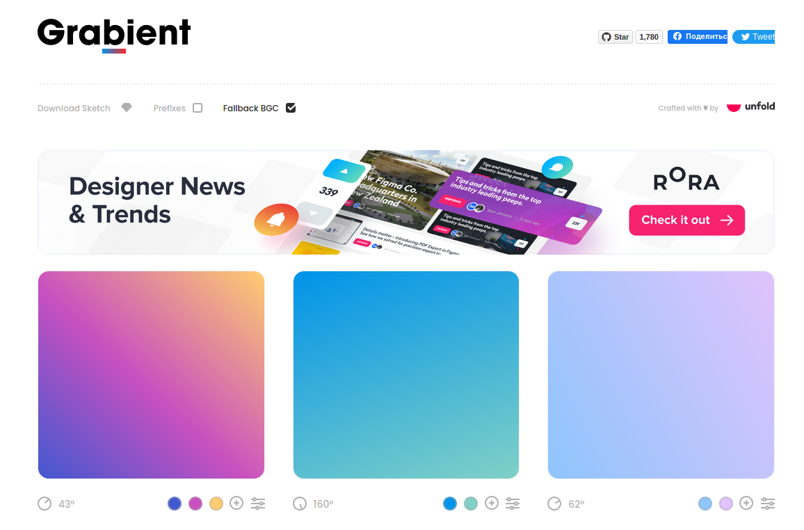
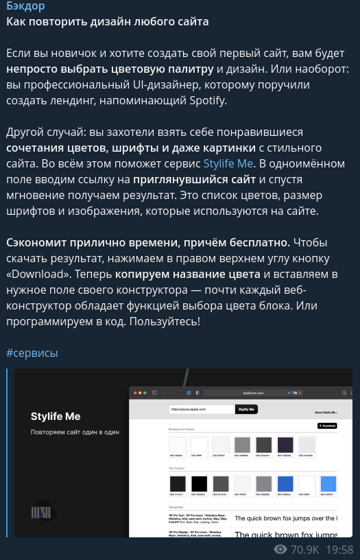
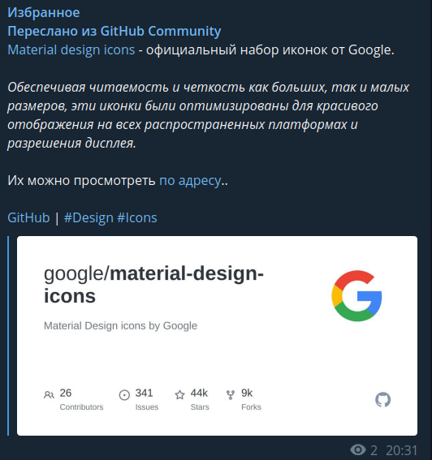
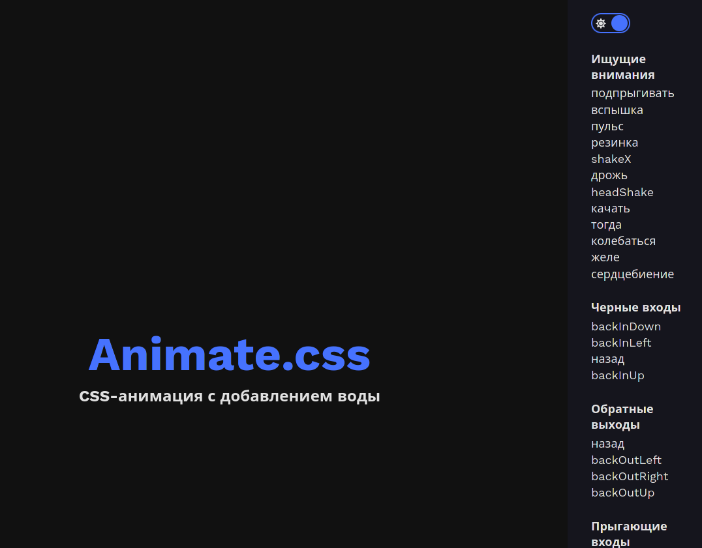

# Программы для фронта

## Разработка

---

- [Случайное фото](https://source.unsplash.com/)

    > 

---

- [Responsively = Разрабатывайте адаптивные веб-приложения в 5 раз быстрее!](https://responsively.app/)

    > 

- [Генератор градиента](https://www.grabient.com/)

> 

---

## Фичи

---

- [Как повторить дизайн любого сайта](http://stylifyme.com/)

    > 

- [Получить все изображения указанного сайта](https://extract.pics/)
    - 
    - 

---

## Готовые решения

- [Бесплатные иконки и шрифты. Более 6200+ Иконок от сообщества!](https://github.com/Templarian/MaterialDesign)

    - 

- [Бесплатные игонки от Google](https://github.com/google/material-design-icons)

    - 

- [Свободные анимации для сайта](https://github.com/animate-css/animate.css)
    - [Пример](https://animate.style/)
    - 

# CSS

## Селекторы CSS

[Знаете ли вы селекторы](https://learn.javascript.ru/css-selectors)

---

`id` - Должен быть уникальный в документе -> `#NAME_ID{}`

```css
#NameId{ }


===


<div id= "NameId">

</div>
```

---

`class` - может быть определен у нескольких ->`.NAME_CLASS{}`

```css
.NameClass{ }


===


<div class = "NameClass">

</div>
```

---

`Атрибут` - можем обращаться по знаению атрибуту

```css
[name="ЛюбоеИмя"]{}


===

<div name="ЛюбоеИмя">

</div>
```

---

Также можно перечислять теги/классы/id через запятую

```css
html, body {}
```

---

Выбрать теги/классы/id, которые находятся в `NameClass1`

```css
.NameClass1 NameClass2{ }
```

Выбрать только теги с именем класса `NameClass`

```css
NameTag.NameClass{ }
```

Теги могут наследоваться от нескольких классов

```html
<style>
    .menu_item {
        background: #97bba4;
    }
    .menu_item.selected {
        color: #e30f0f;
    }
    .selected {
        font-size: 32px;
    }
</style>

<li class="menu_item">1</li>

<li class="menu_item">2</li>

<li class="menu_item selected">3</li>

<li class="menu_item">4</li>

<li class="selected">5</li>
```

---

Есть селекторы, который учитывают вложенность:

- Не учитывает вложенность. В `с1` должен быть где-то `с3`

    ```css
    с1 с3 {
    	font-size: 24px;
    }
    ```

- Учитывает вложенности. После `с1` должен быть тег `с2`

    ```css
    с1 > с2 {
    	font-size: 24px;
    }
    ```

```html
<style>
	.c1 {
		background: #53b477;
	}


	.c1 > .c2 {
		background: #4b6ac7;
	}

	.c1  .c3 {
		background: #ec679d;
	}
</style>

<div class="c1">
    1
    <div class="c2">
        2
        <div class="c3">
            3
        </div>
    </div>

    <div class="c2">
        2
        <div class="c3">
            3
        </div>
    </div>
</div>
```

## Цевета

[Шпаргалка по заливки](https://fls.guru/cssbackground.html)
[Создание Градиента](https://www.colorzilla.com/gradient-editor/)

- `color: #000` Цвет текста
- `opacity: 0.<Прозрачноть>` Прозрачность блока (`op50`)
- `visibility: <>` Показать | Скрыть элемент
    - `visible` Показать
    - `hidden` Скрыть
- `background: <>` Фон (`bg`)
    - `#<ЦветФона>` Цвет фона
- `background-image: <>` Фон из изображения
    - `url(<'path'>)` Фото в качестве фона
- `background-repeat: <>` Повторение картинки фона
    - `repeat` Повторять картинки
    - `no-repeat` Не повторять картинки
    - `repeat-x` Повторять по вертикали
    - `repeat-y` Повторять по горизонтали
    - `space` Отступы между картинками
    - `round` Не обрезать картинки (растягивать)
- `background-position: <>` Расположить картинку
    - `<Вертикаль>px`
    - `<Горизонталь>px`
- `background-size: <>`Размер картинки на фона
    - `<Ширина>px`
    - `<Высота>px`
    - `contain` Сохранить пропорции, но не гарантируется что займет весь элемент
    - `cover` Сохранить пропорции и поместить полностью в элемент
- `background-attachment: <>` Прокрутка фона
    - `fixed` Зафиксировать фон при прокрутке
    - `local` Прокручивать фон вместе с элементом
    - `scroll` Не прокручивается

## Размеры

Единицы измерения:

- `px`
- `%`

- `padding: <В>px <П>px <М>px <Л>px` Внутренний отступ (`p20`)
- `margin: <В>px <П>px <М>px <Л>px` Внешний отступ (`m10`) (Можно отрицательные числа)

- `width: <Число>px` Ширина блока (`w100`)
- `max-width: <Число>px` Максимальная ширина блока
- `min-width: <Число>px` Минимальная ширина блока

- `height: <>px` Высота блока (`h200`)
- `max-height: <Число>px` Максимальная высота блока
- `min-height: <Число>px` Минимальная высота блока

- `overflow: <>` Отображения содержания выходящего за границы

    - `visible` Изначально
    - `hidden` Скрывает все что находится за пределами
    - `scroll` Полоса прокручивания независимо от содержания
    - `auto` Полоса прокрутки когда содержание выходит за границы

- `display: <>` Стиль отображения
    - `block` Отображать как блочный элемент (`d-b`)
    - `inline` Отображать как сточный элемент
    - `inline-block` И блок и текст
    - `none` Не отображать

## Позиционирование

[Шпаргалка по позиционирование](https://fls.guru/cssposition.html)

- `margin: <>px auto`Блок посередине
- `position: <>` Позиционирование

    - `static` Изначально
    - `relative` Относительный размер (Оставляет за собой пространство)
    - `absolute` Абсолютный размер по родителю (Не за собой пространство)
    - `fixed` Абсолютный размер по документу (Не за собой пространство)
    - `sticky` Блок прилипает при прокрутке страницы (Оставляет за собой пространство)

- `left: <>px` Cдвиг слева
- `top: <>px` Cдвиг сверху
- `right: <>px` Cдвиг справа
- `bottom: <>px` Сдвиг снизу
- `z-index: <>` Номер слоя

---

- `float` - Расположение блоков -`left`. (Вышестоящий блок должен иметь атрибут `overflow: hidden;` для того чтобы помещать в себя все блоки с атрибутом `flot`)
    - `right`
    - `bottom`
    - `top`

## Шрифты

- `font-size: 0px` Размер шрифта (`fz40`)
- `font-family: <ИмяШрифта>` Стиль шрифта
- `font-style: <>` Жирный | Курсивный
- `font-weight: <Число>` Насыщенность текста
    - 100
    - 300
    - 400
    - 500
    - 600
    - 700
    - 900
- `text-align: <КакВыравнять>` Выравнивание текста
    - `right`
    - `left`
    - `center`
    - `justify` Растянуть текст на всю ширину
- `text-shadow: <Вертикаль>px <Горизонталь>px <Размытие>px #<Цвет>` Тень текста
- `text-indent: <ОтступСлево>px` Красная строка
- `letter-spacing: <Расстянуть>px` Расстояние между символами
- `word-spacing: <Расстояние>px` Расстояние между словами
- `white-space: <>` Перенос строки
- `nowrap` Не перенести текст
- `normal`Стандартное
- `line-height: <Расстояние>px` Межстрочный интервал

## Границы

- `border: <ТолщинаГраницы>px <СтильЛинии> #<Цвет>` Границы (`bd+`)
- `border-radius: <ПВ>px <ПМ>px <ЛМ>px <ЛВ>px` Закругление границ
- `box-shadow: <Горизонталь>px <Вертикаль>px <Радиус>px <Размытие>px #<Цвет>` Тень границы
- `box-shadow: inset <Горизонталь>px <Вертикаль>px <Радиус>px <Размытие>px #<Цвет>` Внутрення тень

## Псевдокассы

- [Шпаргалки по псевдо классам](https://webref.ru/css/type/pseudoclass)

```css
input:focus{
}
```

---

Формы

- `:focus` При фокусировке на элемент
- `:focus-within` Если дочерний элемент получил фокус
- `:invalid` Неверные данные по шаблону `type`
- `:valid` Верные данные по шаблону `type`
- `:in-range` Число в пределах допустимы значений
- `:out-of-range` Число выходит за пределы допустимых значений
- `:placeholder-shown` Когда в `input` ни чего не введено
- `:target` При переходе по имени внутри документа

---

Ссылка

- `:link` Не посещенная ссылка
- `:visited` Посещенная ссылка
- `:active` Определяет стиль для активной ссылки. Активной ссылка становится при нажатии на не

---

Все

- `:hover` Наведение мыши на элемент
- `:active` Нажатье на элемент

---

Обращение к по позиции

- `:first-child` Первый элемент
- `:last-child`Последний элемент
- `:nth-child(<index>)` По индексу элемента
    - `odd` Все не четные элементы
    - `even` Все четные элементы
    - `<Число>n+<Смещение=0>` Каждый N элемент

---

Псевдоэлемент

- `:first-line` Стиль первой строки
- `:before{content: '';}` До содержания элемента
- `:after{content: '';}` После содержания элемента

## Создать переменную в CSS

Нужно создать вверху тег `:root` и в нем создавать переменные

```css
:root {
  --ИмяПеременной: Значение;
}
```

Чтобы получить значение из переменно, нужно вызвать функцию `var(ИмяПеременной)`

```css
Слектор {
  атрибут: var(--ИмяПеременной);
}
```

## Теги

### Тег `<a>`

Тег `<a> ... </a>` = это ссылка на ресурс, в ней может быть как текст, так и блок.

| Псевдокласс | Описание                                                                             |
| ----------- | ------------------------------------------------------------------------------------ |
| a:link      | Определяет стиль для обычной не посещенной ссылки.                                   |
| A:visited   | Определяет стиль для посещенной ссылки.                                              |
| a:active    | Определяет стиль для активной ссылки. Активной ссылка становится при нажатии на нее. |
| a:hover     | Определяет стиль для ссылки при наведении на нее мышью.                              |

```css
a{

	//  Убрать подчёркивание ссылки
	text-decoration:none
}

a:link {

}

a:visited {

}

a:focus {

}

a:hover {

}

a:active {

}
```

### Тег `src`

[Свойства object-fit и object-position](https://html5book.ru/svoystva-object-fit-i-object-position/)

- `object-fit` определяет, каким образом содержимое замещаемых элементов будет подогнано к краям контейнера тега в случае, когда для элемента заданы ширина и высота, отличные от его собственных размеров
    - `fill` Значение по умолчанию. Содержимое замещаемого элемента полностью заполняет область контейнера тега, используя его высоту и ширину.
    - `contain` Содержимое элемента масштабируется, выравниваясь по центру с сохранением пропорций таким образом, чтобы полностью поместиться внутри контейнера. (+)
    - `cover` Содержимое элемента обрезается, выравниваясь по центру с сохранением пропорций таким образом, чтобы полностью заполнить область контейнера.
    - `scale-down`
    - `none`Замещаемое содержимое не изменяет свои собственные размеры, чтобы поместиться и заполнить область контейнера.
    - `initial` Устанавливает это свойство в значение по умолчанию.
    - `inherit` Наследует значение свойства от родительского элемента.
- `object-position` Задаёт положение содержимого замещаемого элемента внутри контейнера относительно координатных осей X и Y. Значение по умолчанию 50% 50%.
    - `top`
    - `left`
    - `center`
    - `right`
    - `bottom`

# Bootstrap

## Цвета

[Все цвета в `Bootstrap`](https://getbootstrap.su/docs/5.0/customize/color/)

## Позиционирование элементов

[Документация по позиционированию элементов](https://getbootstrap.su/docs/5.0/utilities/flex/)

---

Размеры и отступы

`class="w-<ЧислоПроцента>"` Ширина в процентах
`class="h-<ЧислоПроцента>"` Высота в процентах
`class="p-<Число>"`= padding (t-верх/b-низ/s-лево/e-право)
`class="m-<Число>"`= margin (t-верх/b-низ/s-лево/e-право)

---

Расположение элементов в виде сетки [+](https://getbootstrap.su/docs/5.0/layout/grid/)

| Название                       | Размер   |
| ------------------------------ | -------- |
| `.col-<КоличествоСтолбцов>`    | <576px   |
| `.col-sm-<КоличествоСтолбцов>` | >=576px  |
| `.col-md-<КоличествоСтолбцов>` | >=768px  |
| `.col-lg-<КоличествоСтолбцов>` | >=992px  |
| `.col-xl-<КоличествоСтолбцов>` | >=1200px |

- Максимум 12 столбцов.
- Мы можем комбинировать классы, чтобы указать оптимальный размер под разрешение экрана.( `class="col col-sm-3 col-md-6"`)
- Иерархия сетки`container -> row -> col`

---

Для указания нескольких строк создавайте новый блок с классом `row`

```html
<div class="container">

    <div class="row">
        <div class="col">
            1 из 2
        </div>
        <div class="col">
            2 из 2
        </div>
    </div>
    <div class="row">
        <div class="col">
            1 из 3
        </div>
        <div class="col">
            2 из 3
        </div>
        <div class="col">
            3 из 3
        </div>
    </div>
</div>
```

Либо можно задать сколько максимум столбцов может быть у котейнера

```html
<div class="container">
  <div class="row row-cols-<СколькоСтолбцов>">
    <div class="col">Колонка</div>
    <div class="col">Колонка</div>
    <div class="col">Колонка</div>
    <div class="col">Колонка</div>
  </div>
</div>
```

---

| Класс                                              | Описание                                                                                 |
| -------------------------------------------------- | ---------------------------------------------------------------------------------------- |
| `d-flex`                                           | Гибкий блок                                                                              |
| `flex-<Дисплей>-row` либо `flex-row-reverse`       | Располагать элементы по горизонтали (по умолчанию) (`-reverse` меняет порядок элементов) |
| `flex-<Дисплей>-column` либо `flex-column-reverse` | Располагать элементы по вертикали                                                        |

---

Выравнять содержимого элемента в `div`

| Класс                               | Описание                         |
| ----------------------------------- | -------------------------------- |
| `justify-content-<Дисплей>-start`   | В начало                         |
| `justify-content-<Дисплей>-end`     | В конец                          |
| `justify-content-<Дисплей>-center`  | В центр                          |
| `justify-content-<Дисплей>-between` | Элементы по краям                |
| `justify-content-<Дисплей>-around`  | Равное растение между элементами |

```html
<div class="d-flex flex-row justify-content-start" style="height: 200px;background: #000;">

    <div class="p-5 " style="background: #535353;">
        Flex 1
    </div>
    <div class="p-5 " style="background: #535353;">
        Flex 2
    </div>
    <div class="p-5 " style="background: #535353;">
        Flex 3
    </div>
</div>
```


---

Выравнять элементов в `div`

| Класс                            | Описание                                   |
| -------------------------------- | ------------------------------------------ |
| `align-items-<Дисплей>-start`    | Верхняя граница                            |
| `align-items-<Дисплей>-end`      | Нижняя граница                             |
| `align-items-<Дисплей>-center`   | По центру                                  |
| `align-items-<Дисплей>-baseline` |                                            |
| `align-items-<Дисплей>-stretch`  | Вытянуть на всю высоту родительского блока |
|                                  |                                            |

```html
<div class="d-flex flex-row justify-content-around align-items-sm-center" style="height: 200px;background: #000;">

    <div class="p-5 " style="background: #535353;">
        Flex 1
    </div>
    <div class="p-5 " style="background: #535353;">
        Flex 2
    </div>
    <div class="p-5 " style="background: #535353;">
        Flex 3
    </div>
</div>
```


---

Выравнивание одного элемента в `div`

| Класс                           | Описание                                   |
| ------------------------------- | ------------------------------------------ |
| `align-self-<Дисплей>-start`    | Верхняя граница                            |
| `align-self-<Дисплей>-end`      | Нижняя граница                             |
| `align-self-<Дисплей>-center`   | По центру                                  |
| `align-self-<Дисплей>-baseline` |                                            |
| `align-self-<Дисплей>-stretch`  | Вытянуть на всю высоту родительского блока |

```html
<div class="d-flex flex-row justify-content-around align-items-start" style="height: 200px;background: #000;">

    <div class="p-5 " style="background: #535353;">
        Flex 1
    </div>
    <div class="p-5 align-self-end" style="background: #535353;">
        Flex 2
    </div>
    <div class="p-5 " style="background: #535353;">
        Flex 3
    </div>
</div>
```


# `jQuery`

## Основы

[jQuery документация на русском](https://jquery-docs.ru/category/events/)

```js
$(document).ready(function () {

	// Когда документ загружен
})
```

|                                                                                         |                                                                                                                                                                    |
| --------------------------------------------------------------------------------------- | ------------------------------------------------------------------------------------------------------------------------------------------------------------------ |
| `$('.text1').text('НовыйТекст');`                                                       | Установить новый текст                                                                                                                                             |
| `$('.text1').text();`                                                                   | Получить текст из селектора переменную                                                                                                                             |
| `$('.text1').html("<a href='#'>qwewqeqwe</a>")`                                         | Вставить `html` текст                                                                                                                                              |
| `$('.text1').html();`                                                                   | Получить `html` текст элемента                                                                                                                                     |
| `$('.text1').css({'color': '#c96464', 'font-size': '50px'})`                            | Добавить стили элементу                                                                                                                                            |
| `$('.text1').attr('ИмяАтрибутаТега');`                                                  | Получить значение атрибута тега                                                                                                                                    |
| `$('.text1').attr('ИмяАтрибутаТега','НовоеЗначениеАтрибута');`                          | Установить новое значение атрибуту тега                                                                                                                            |
| `$('.text1').removeAttr('ИмяАтрибутаТега');`                                            | Удалить атрибут у тега                                                                                                                                             |
| `$('.text1').val();` -> str                                                             | Получить значение из тега                                                                                                                                          |
| `$('.text1').length; `->int                                                             | Сколько существуют указанных элементов                                                                                                                             |
| ---                                                                                     | ---                                                                                                                                                                |
| `$('.text1').hide(<ВремяАнимацииСкрытияЭлемента>,<ВызватьФункцияПослеСкрытия>);`        | Скрыть элемент                                                                                                                                                     |
| `$('.text1').show(<ВремяАнимацииПоявленияЭлемента>,<ВызватьФункцияПослеПоявления>);`    | Показать текст элемент                                                                                                                                             |
| `$('.text1').slideUp(<ВремяАнимацииСкрытияЭлемента>,<ВызватьФункцияПослеСкрытия>);`     | Закатать элемент                                                                                                                                                   |
| `$('.text1').slideDown(<ВремяАнимацииСкрытияЭлемента>,<ВызватьФункцияПослеПоявления>);` | Раскатать элемент                                                                                                                                                  |
| `$('.text1').slideToggle(<ВремяАнимацииЭлемента>,<ВызватьФункцияПоявления>));`          | Переключает `slideUp` и `slideDown`                                                                                                                                |
| `$('.text1').fadeOut(<ВремяАнимацииСкрытияЭлемента>,<ВызватьФункцияПослеПоявления>));`  | Растворить элемент                                                                                                                                                 |
| `$('.text1').fadeIn(<ВремяАнимацииСкрытияЭлемента>,<ВызватьФункцияПослеПоявления>));`   | Проявить элемент                                                                                                                                                   |
| `$('.text1').fadeToggle(<ВремяАнимацииЭлемента>,<ВызватьФункцияПоявления>));`           | Переключает `fadeOut` и `fadeIn`                                                                                                                                   |
| ---                                                                                     | ---                                                                                                                                                                |
| `$('.text1').each(<Функция>)`                                                           | Перебирать элементы в цикле                                                                                                                                        |
| `$('.text1').toArray()`                                                                 | Получить массив из селекторов                                                                                                                                      |
| ---                                                                                     | ---                                                                                                                                                                |
| `$('.text1').addClass('ИмяНовогоКласса');`                                              | Добавить класс к элементу                                                                                                                                          |
| `$('.text1').removeClass('ИмяКлассаКотороеУдалить');`                                   | Удалить клас из элемента                                                                                                                                           |
| `$('.text1').toggleClass('ИмяСменяющегосяКласса');`                                     | Если класс есть то он удалиться , если класса нет то он добавится                                                                                                  |
| ---                                                                                     | ---                                                                                                                                                                |
| `$('.text1').wrap(<'ИмяТега' ... ></'ИмяТега'>);`                                       | Заключить(Обернуть) элементы в `<ИмяТега> ... </ИмяТега>` по Отдельности для каждого элемента                                                                      |
| `$('.text1').wrapAll(<'ИмяТега' ... ></'ИмяТега'>);`                                    | Заключить(Обернуть) элементы в `<ИмяТега> ... </ИмяТега>` Для всех рядо стоящих элементов                                                                          |
| `$('.text1').unwrap('ИмяТега');`                                                        | Освободить(Раскрыть) от тега                                                                                                                                       |
| ---                                                                                     | ---                                                                                                                                                                |
| `$('.text1').append('htmlТекст');`                                                      | Добавить в конец элемента(перед закрывающем тегом) `html` текст                                                                                                    |
| `$('.text1').prepend('htmlТекст');`                                                     | Добавить в начало элемента(после открывающего тега) `html` текст                                                                                                   |
| `$('.text1').before('htmlТекст');`                                                      | Добавить в начло тега (перед открывающем тегом) `html` текст                                                                                                       |
| `$('.text1').after('htmlТекст');`                                                       | Добавить в конец тега (после закрывающего тега) `html` текст                                                                                                       |
| ---                                                                                     | ---                                                                                                                                                                |
| `$('.text1').replaceWith('ТекстЗамены');`                                               | Заменить элемент на `ТекстЗамены`                                                                                                                                  |
| `$('.text1').clone();`                                                                  | Сделать копию элемента                                                                                                                                             |
| ---                                                                                     | ---                                                                                                                                                                |
| `$('.text1').remove('ИмяСелектора');`                                                   | Удалить элементы                                                                                                                                                   |
| `$('.text1').empty('ИмяСелектора');`                                                    | Удалить содержание элемента                                                                                                                                        |
| ---                                                                                     | ---                                                                                                                                                                |
| `$('.text1').find('ИмяСелектора');`                                                     | Поиск элемента по селектору внутри элемента                                                                                                                        |
| `$('.text1').is('ИмяСелектора');`                                                       | Проверить сущетсование элемента, еслие сть то `true`                                                                                                               |
| ---                                                                                     | --                                                                                                                                                                 |
| `setInterval(<Функция>,<Время>,<Аргументы ...>)` ->timerId                              | Постоянно выполнять указанную функцию через указанное количество миллисекунд (1000 = 1 секунда) [+](https://learn.javascript.ru/settimeout-setinterval#settimeout) |
| `setTimeout(<Функция>,<Время>,<Аргументы ...>)` ->timerId                               | Один раз выполнить указанную функцию через указанное количество секунд (1000 = 1 секунда)                                                                          |
| `clearTimeout(timerId);`                                                                | Отменить выполнение интервальной функции                                                                                                                           |

Перебирать элементы в цикле `$('.text1').each(<Функция>)`

```html
<div class="text1">
 1a
</div>
<div class="text1">
 2a
</div>
<div class="text1">
 3a
</div>
<div class="text1">
 4a
</div>
<div class="text1">
 5a
</div>

<script>

 $(document).ready(function () {

      function MyFun() {
         console.log($(this).text())
      }

      $('.text1').each(MyFun)

   })

</script>
```

## Обработка событий

[События jQuery](https://jquery-docs.ru/category/events/)

| Событие                 | Описание                                                                                                               |
| ----------------------- | ---------------------------------------------------------------------------------------------------------------------- |
| `.click(<Функция>)` (+) | Нажатие мышью на элемент                                                                                               |
| focus (+)               | Наведение на элемент                                                                                                   |
| blur (+)                | Устанавливает обработчик потери фокуса, либо, запускает это событие.                                                   |
| focusin                 | Устанавливает обработчик получения фокуса самим элементом или одним из его дочерних.                                   |
| focusout                | Устанавливает обработчик потери фокуса элементом или одним из его дочерних.                                            |
| load (+)                | Устанавливает обработчик полной загрузки выбранных элементов.                                                          |
| resize                  | Устанавливает обработчик изменения размеров окна браузера, либо, запускает это событие.                                |
| scroll                  | Устанавливает обработчик "прокрутки" элементов документа, либо, запускает это событие.                                 |
| unload                  | Устанавливает обработчик выхода со страницы (при переходе по ссылке, закрытии браузера и.т.д.) для объекта window.     |
| dblclick                | Устанавливает обработчик двойного "клика" мышью по элементу, либо, запускает это событие.                              |
| mousedown               | Устанавливает обработчик нажатия кнопки мыши на элементе, либо, запускает это событие.                                 |
| mouseup                 | Устанавливает обработчик возвращения кнопки мыши в ненажатое состояние, либо, запускает это событие.                   |
| mousemove               | Устанавливает обработчик движения курсора мыши внутри элемента, либо, запускает это событие.                           |
| mouseover               | Привяжите обработчик события к событию JavaScript «наведения указателя мыши» или инициируйте это событие для элемента. |
| mouseout                | Устанавливает обработчик выхода курсора из области элемента, либо, запускает это событие.                              |
| mouseenter              | Устанавливает обработчик появления курсора над элементом, либо, запускает это событие.                                 |
| mouseleave              | Устанавливает обработчик выхода курсора из области элемента, либо, запускает это событие.                              |
| change                  | Устанавливает обработчик изменения заданного элемента формы, либо, запускает это событие.                              |
| select                  | Устанавливает обработчик выделения текста внутри элемента или , либо, запускает это событие.                           |
| submit (+)              | Устанавливает обработчик отправки формы на сервер, либо запускает это событие.                                         |
| keydown                 | Устанавливает обработчик перехода клавиши клавиатуры в нажатое состояние, либо, запускает это событие.                 |
| keypress (+)            | Устанавливает обработчик ввода символа с клавиатуры, либо, запускает это событие.                                      |
| keyup                   | Устанавливает обработчик возвращения клавиши клавиатуры в ненажатое состояние, либо, запускает это событие.            |
| error (+)               | Устанавливает обработчик ошибки при загрузке элементов (например отсутствие необходимой картинки на сервере).          |

---

Перехватить события

```html
<ul>
	<li>пункт 1</li>
	<li>пункт 2</li>
	<li>пункт 3</li>
</ul>


<script>

	$(document).ready(function () {
		$('li').click(function () {
			$(this).append('!');
		});
	})
</script>
```

Перехватить любого события `.on('Событие',Функция)`

```html
<ul>
	<li>пункт 1</li>
	<li>пункт 2</li>
	<li>пункт 3</li>
</ul>

<script>
	$('li').on('click',func);


	function func() {
		$(this).append('!');
		$(this).unbind('click', func);

	}
</script>
```

Перехватить несколько событий `.on('Событие1 Событие2 ...',Функция)`

```html
<ul>
	<li>пункт 1</li>
	<li>пункт 2</li>
	<li>пункт 3</li>
</ul>

<script>
	$('li').on('click focus',func);


	function func() {
		$(this).append('!');
		$(this).unbind('click', func);

	}
</script>
```

---

Отвязать событие `.unbind('Событие',Функция)`

```html
<ul>
	<li>пункт 1</li>
	<li>пункт 2</li>
	<li>пункт 3</li>
</ul>

<script>
	$('li').click(func);
	function func() {
		$(this).append('!');
		$(this).unbind('click', func);
	}
</script>
```

Отвязать любое событие `.off('Событие',Функция)`

```html
<ul>
	<li>пункт 1</li>
	<li>пункт 2</li>
	<li>пункт 3</li>
</ul>

<script>
	$('li').click(func);
	function func() {
		$(this).append('!');
		$(this).off('click', func);
	}
</script>
```

---

Перехватить только один раз событие. (А потом отвязать перехват) `.one('Событие',Функция);`

```html
<ul>
	<li>пункт 1</li>
	<li>пункт 2</li>
	<li>пункт 3</li>
</ul>

<script>
	$('li').one('click',func);

	function func() {
		$(this).append('!');
		$(this).off('click', func);
	}
</script>
```

---

Перехватить отправку формы.

```html
<form method="post" name="SendFormName"
	  action="#"
	  accept-charset="UTF-8"
	  autocomplete="on"
	  target="_self"
	  enctype="application/x-www-form-urlencoded"> 


	<input type="submit">
</form>

```

- В этом варианте мы предотвращаем всплытия события

    ```js
    $(document).ready(function () {
    	$('[name=SendFormName]').submit(function (event) {
    		console.log($(this));
    		event.preventDefault();
    	})
    })
    ```

- В этом варианте мы предотвращаем отправку формы но не всплытие события

    ```js
    $(document).ready(function () {
    	$('[name=SendFormName]').submit(function () {
    		console.log($(this));
    		return false;
    	})
    })
    ```

---


### Нажатие клавиши

```js
//  Отслеживаем нажатие клавиши в полле ввода
$('input').keydown(function (e) {
	
	// Если нажата клавиша `Enter`
	if (e.keyCode === 13) {
		console.log(`Class:${$(this).attr('class')};Id:${$(this).attr('id')}`);
		// Что то делаем ... 
	}
	
});
```


## Анимировать элементы

[Работа с эффектами и анимацией jQuery](http://old.code.mu/books/javascript/jquery/rabota-s-effektami-i-animaciej-jquery.html)

```html
<button id="hide">Спрятать</button>
<button id="show">Показать</button>
<div id="elem">Блок с текстом.</div>
```

Скрывать элемент по всем направлениям

```javascript
$('#hide').click(function() {
	$('#elem').hide();
});

$('#show').click(function() {
	$('#elem').show();
});
```

Закатывание элемента

```javascript
$('#hide').click(function() {
	$('#elem').slideUp(1000);
});

$('#show').click(function() {
	$('#elem').slideDown(1000);
});
```

Растворение элемента

```javascript
$('#hide').click(function() {
	$('#elem').fadeOut(1000);
});

$('#show').click(function() {
	$('#elem').fadeIn(1000);
});
```

---

Плавно анимировать изменение элемента

```html
<style>
#elem {
	width: 150px;
	height: 150px;
	padding: 10px;
	border: 1px solid green;
}
</style>

<button id="button">Нажми на меня</button>
<div id="elem">Блок с текстом.</div>
```

`.animate({<css>},<ВремяВыполения>)`

```javascript
$('#button').click(function () {
   $('#elem').animate({height: '50', width: '+=300'}, 1000);
});
```

## Асинхронный запрос `Ajax`

[Ajax Асинхронная отправка форм](../Уроки/Блок7%20-%20Django.md#Ajax%20Асинхронная%20отправка%20форм)

## URL

Получить `GET` параметры из `URL`

Если `http://127.0.0.1:8000/?re=search`

```js
$.urlParam = function (name) {
	var results = new RegExp('[\?&]' + name + '=([^&#]*)').exec(window.location.href);
	if (results == null) {
		return null;
	}
	return decodeURI(results[1]) || 0;
}

$.urlParam('re') // То будет ответ `search`
```

## `Json`

- Из строки в `Json`

    ```js
    $.parseJSON(<JsonТекст>)
    ```

- Из `Json` в строку

    ```js
    $.toJSON(<JsonТекст>)
    ```

# JS

## Изменять `Html`

### Получение элемента динамически

> Главная особенность в том что если html документ меняться то изменения автоматически
> вносятся в результат Живой коллекции

Получить по id

```js
let <elem> = document.getElementById(<"ID_Html">)
```

Получить по имени класса

```js
let <elem> = document.getElementsByClassName(<"Class_Html">)
```

Получить по тегу `Html`

```js
let <elem> = document.getElementByTagName(<"Tag_Html">))
```

Получить по [Имени `Html`](http://htmlbook.ru/html/a/name)

```js
let <elem> = document.getElementByName(<"NameHtml">)
```

### Работа с существующими тегами `Html`

`.innerHTML`Текст тега (`read`/`write`)

```js
<elem>.innerHTML = 10;
console.log(<elem>.innerHTML);
```

`.outerHTML` Установить элемент вмести с тегом (`read`/`write`)

```js
<elem>.outerHTML = "<h1>  Изменен тег  </h1>";
console.log(<elem>.outerHTML);
```

`.textContent` Установить значение именно как текст, с учетом экранирования.

```js
<elem>.textContent = "Новое знаечение текста";
```

`.hidden` Скрыть / Показать элемент

```js
<elem>.hidden = true; 	// Скрыт
<elem>.hidden = false;	// Показан
```

`.remove()`Удаление элемент

```js
<elem>.remove();
```

`.className` Стандартное имя класса(Первый класс слева)

```js
<elem>.className;
```

`.classList` Коллекция со всеми классами элемента

```js
<elem>.classList;

<elem>.classList.add('ИмяКласса'); // Добавить класс к элементу
<elem>.classList.remove('ИмяКласса'); // Удалить класс из элемента

<elem>.classList.toggle('ИмяКласса'); // Добавить каласс если он не существует
<elem>.classList.contains('ИмяКласса'); // Проверить наличие класса. Если есть `true`
```

### Добавление элементов в Html


---

Особенности:

- После создания элемента с ним можно обращаться как с [Существующем](#Работа/с/существующими/тегaми/Html)

---

Создать элемент `.createElement()` или `.insertAdjacentElement(<Куда>,<Элемент>)`

```js
let <elem_new> = document.createElement("<TAG>"); // div/h1/a/img/...др
```

Создаем элемент как текст `.createTextNode()` или `.insertAdjacentText(<Куда>,<"Текст">)`

```js
let <elem_new> = deocument.ctreateTextNode("Мой_Текст");
```

Добавление созданный элементов в Html

```js
<elem>.append(<elem_new>);	// Добавить в конец
<elem>.prepend(<elem_new>);	// Вставить в начало
<elem>.after(<elem_new>);	// Вставить после
<elem>.before(<elem_new>);	// Вставить до
```

Замена элемента

```js
<elem>.replaceWith(<elem_new>); // Заменить текущий элемент на новый
```

Создать клон `cloneNode`

```js
let <NewCopy> = <Tag>.cloneNode(<flDeep>); // Если <flDeep> == `true` то создастя глубокий клон с дочерними элементами
```

Создать фрагмент HTML кода `DocumentFragment`

```js
let fr = new DocumentFragment();
let list=["Меркурий", "Венера", "Земля", "Марс"];
for(let p of list) {
    let item = document.createElement('li');
    item.innerHTML = p;
    fr.append(item);
}

let ul = document.querySelector("ul");
ul.append(fr);
```

Создаем и добавить `Html` код `.insertAdjacentHTML(<Куда>,<"Html_Код">)`

```js
<Tag>.insertAdjacentHTML("beforebegin", <"Html_Код">);	// Перд
<Tag>.insertAdjacentHTML("afterbebin", <"Html_Код">);	// Первый
<Tag>.insertAdjacentHTML("beforeend", <"Html_Код">);	// Последний
<Tag>.insertAdjacentHTML("afterend", <"Html_Код">);		// После
```

## Циклы

Цикл со счетчиком

```js
for (<Инициализация_Счетчика>; <Условие>; <Изменение_Счетчика>){
	... ;
}
```

Перебрать свойств объекта(если это массив то Индексы)

```js
for (let <item> in <arr>){
	... ;
}

```

Перебрать значения обьекта

```js
for (let <item> of <arr>){
	... ;
}
```

Цикл с условием остановки

```js
while(<условие>){
	... ;
}
```

## `async`/ `defer`

Эти два атрибута нужны, чтобы указать браузеру скачать асинхронно `JS`код. Загружать данные асинхронно полезно, потому что они не блокируют загрузку все страницы [Про асинхронную загрузку](https://learn.javascript.ru/external-script)

```js
<script src="async.js" async></script>
<script src="defer.js" defer></script>
```

**Отличие** `async`от `defer` в том что

- `defer` Гарантирует порядок исполнение `js` кода, даже если какой-то скрипт скачался раньше, он будет ждать своей очереди.
- `async` Нет порядка, какой скрипт первый скачался тот и исполниться.
