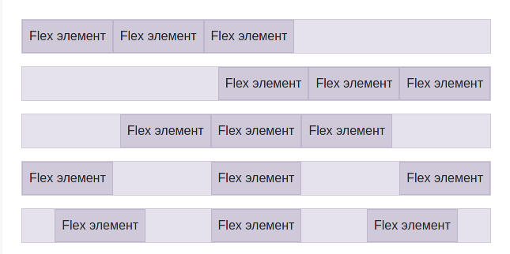
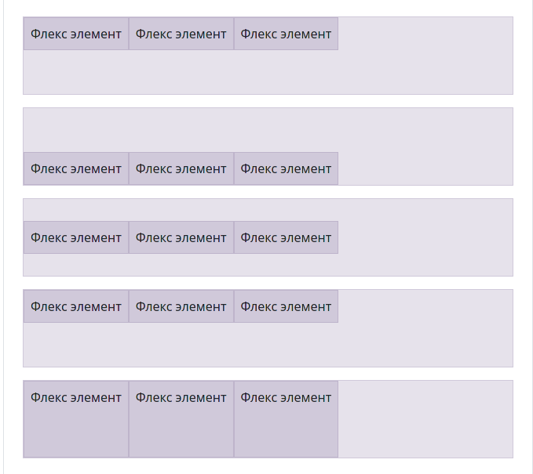
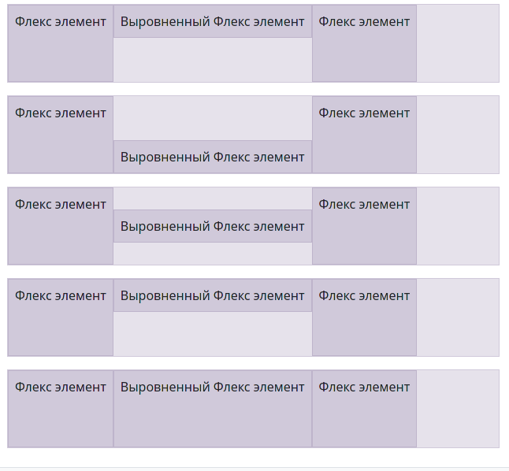

# CSS

## Селекторы CSS

[Знаете ли вы селекторы](https://learn.javascript.ru/css-selectors)

---

`id` - Должен быть уникальный в документе -> `#NAME_ID{}`

```css
#NameId{ }


===


<div id= "NameId">

</div>
```

---

`class` - может быть определен у нескольких ->`.NAME_CLASS{}`

```css
.NameClass{ }


===


<div class = "NameClass">

</div>
```

---

`Атрибут` - можем обращаться по знаению атрибуту

```css
[name="ЛюбоеИмя"]{}


===

<div name="ЛюбоеИмя">

</div>
```

---

Также можно перечислять теги/классы/id через запятую

```css
html, body {}
```

---

Выбрать теги/классы/id, которые находятся в `NameClass1`

```css
.NameClass1 NameClass2{ }
```

Выбрать только теги с именем класса `NameClass`

```css
NameTag.NameClass{ }
```

Теги могут наследоваться от нескольких классов

```html
<style>
    .menu_item {
        background: #97bba4;
    }
    .menu_item.selected {
        color: #e30f0f;
    }
    .selected {
        font-size: 32px;
    }
</style>

<li class="menu_item">1</li>

<li class="menu_item">2</li>

<li class="menu_item selected">3</li>

<li class="menu_item">4</li>

<li class="selected">5</li>
```

---

Есть селекторы, который учитывают вложенность:

- Не учитывает вложенность. В `с1` должен быть где-то `с3`

  ```css
  с1 с3 {
  	font-size: 24px;
  }
  ```

- Учитывает вложенности. После `с1` должен быть тег `с2`

  ```css
  с1 > с2 {
  	font-size: 24px;
  }
  ```

```html
<style>
	.c1 {
		background: #53b477;
	}


	.c1 > .c2 {
		background: #4b6ac7;
	}

	.c1  .c3 {
		background: #ec679d;
	}
</style>

<div class="c1">
    1
    <div class="c2">
        2
        <div class="c3">
            3
        </div>
    </div>

    <div class="c2">
        2
        <div class="c3">
            3
        </div>
    </div>
</div>
```

## Цевета

[Шпаргалка по заливки](https://fls.guru/cssbackground.html)
[Создание Градиента](https://www.colorzilla.com/gradient-editor/)

- `color: #000` Цвет текста
- `opacity: 0.<Прозрачноть>` Прозрачность блока (`op50`)
- `visibility: <>` Показать | Скрыть элемент
  - `visible` Показать
  - `hidden` Скрыть
- `background: <>` Фон (`bg`)
  - `#<ЦветФона>` Цвет фона
- `background-image: <>` Фон из изображения
  - `url(<'path'>)` Фото в качестве фона
- `background-repeat: <>` Повторение картинки фона
  - `repeat` Повторять картинки
  - `no-repeat` Не повторять картинки
  - `repeat-x` Повторять по вертикали
  - `repeat-y` Повторять по горизонтали
  - `space` Отступы между картинками
  - `round` Не обрезать картинки (растягивать)
- `background-position: <>` Расположить картинку
  - `<Вертикаль>px`
  - `<Горизонталь>px`
- `background-size: <>`Размер картинки на фона
  - `<Ширина>px`
  - `<Высота>px`
  - `contain` Сохранить пропорции, но не гарантируется что займет весь элемент
  - `cover` Сохранить пропорции и поместить полностью в элемент
- `background-attachment: <>` Прокрутка фона
  - `fixed` Зафиксировать фон при прокрутке
  - `local` Прокручивать фон вместе с элементом
  - `scroll` Не прокручивается

## Размеры

Единицы измерения:

- `px`
- `%`
- `vw` – 1% ширины окна
- `vh` – 1% высоты окна
- `vmin` – наименьшее из (`vw`, `vh`), в IE9 обозначается `vm`
- `vmax` – наибольшее из (`vw`, `vh`)

---

- `padding: <В>px <П>px <М>px <Л>px` Внутренний отступ (`p20`)

- `margin: <В>px <П>px <М>px <Л>px` Внешний отступ (`m10`) (Можно отрицательные числа)

- `width: <Число>px` Ширина блока (`w100`)

- `max-width: <Число>px` Максимальная ширина блока

- `min-width: <Число>px` Минимальная ширина блока

- `height: <>px` Высота блока (`h200`)

- `max-height: <Число>px` Максимальная высота блока

- `min-height: <Число>px` Минимальная высота блока

- `overflow: <>` Отображения содержания выходящего за границы

  - `visible` Изначально
  - `hidden` Скрывает все что находится за пределами
  - `scroll` Полоса прокручивания независимо от содержания
  - `auto` Полоса прокрутки когда содержание выходит за границы

- `display: <>` Стиль отображения
  - `block` Отображать как блочный элемент (`d-b`)
  - `inline` Отображать как сточный элемент
  - `inline-block` И блок и текст
  - `none` Не отображать

## Позиционирование

[Шпаргалка по позиционирование](https://fls.guru/cssposition.html)

- `margin: <>px auto`Блок посередине

- `position: <>` Позиционирование

  - `static` Изначально
  - `relative` Относительный размер (Оставляет за собой пространство)
  - `absolute` Абсолютный размер по родителю (Не за собой пространство)
  - `fixed` Абсолютный размер по документу (Не за собой пространство)
  - `sticky` Блок прилипает при прокрутке страницы (Оставляет за собой пространство)

- `left: <>px` Cдвиг слева

- `top: <>px` Cдвиг сверху

- `right: <>px` Cдвиг справа

- `bottom: <>px` Сдвиг снизу

- `z-index: <>` Номер слоя

---

- `float` - Расположение блоков -`left`. (Вышестоящий блок должен иметь атрибут `overflow: hidden;` для того чтобы помещать в себя все блоки с атрибутом `flot`)
  - `right`
  - `bottom`
  - `top`

## Шрифты

- `font-size: 0px` Размер шрифта (`fz40`)
- `font-family: <ИмяШрифта>` Стиль шрифта
- `font-style: <>` Жирный | Курсивный
- `font-weight: <Число>` Насыщенность текста
  - 100
  - 300
  - 400
  - 500
  - 600
  - 700
  - 900
- `text-align: <КакВыравнять>` Выравнивание текста
  - `right`
  - `left`
  - `center`
  - `justify` Растянуть текст на всю ширину
- `text-shadow: <Вертикаль>px <Горизонталь>px <Размытие>px #<Цвет>` Тень текста
- `text-indent: <ОтступСлево>px` Красная строка
- `letter-spacing: <Расстянуть>px` Расстояние между символами
- `word-spacing: <Расстояние>px` Расстояние между словами
- `white-space: <>` Перенос строки
- `nowrap` Не перенести текст
- `normal`Стандартное
- `line-height: <Расстояние>px` Межстрочный интервал

## Границы

- `border: <ТолщинаГраницы>px <СтильЛинии> #<Цвет>` Границы (`bd+`)
- `border-radius: <ПВ>px <ПМ>px <ЛМ>px <ЛВ>px` Закругление границ
- `box-shadow: <Горизонталь>px <Вертикаль>px <Радиус>px <Размытие>px #<Цвет>` Тень границы
- `box-shadow: inset <Горизонталь>px <Вертикаль>px <Радиус>px <Размытие>px #<Цвет>` Внутрення тень

## Псевдокассы

- [Шпаргалки по псевдо классам](https://webref.ru/css/type/pseudoclass)

```css
input:focus{
}
```

---

Формы

- `:focus` При фокусировке на элемент
- `:focus-within` Если дочерний элемент получил фокус
- `:invalid` Неверные данные по шаблону `type`
- `:valid` Верные данные по шаблону `type`
- `:in-range` Число в пределах допустимы значений
- `:out-of-range` Число выходит за пределы допустимых значений
- `:placeholder-shown` Когда в `input` ни чего не введено
- `:target` При переходе по имени внутри документа

---

Ссылка

- `:link` Не посещенная ссылка
- `:visited` Посещенная ссылка
- `:active` Определяет стиль для активной ссылки. Активной ссылка становится при нажатии на не

---

Все

- `:hover` Наведение мыши на элемент
- `:active` Нажатье на элемент

---

Обращение к по позиции

- `:first-child` Первый элемент
- `:last-child`Последний элемент
- `:nth-child(<index>)` По индексу элемента
  - `odd` Все не четные элементы
  - `even` Все четные элементы
  - `<Число>n+<Смещение=0>` Каждый N элемент

---

Псевдоэлемент

- `:first-line` Стиль первой строки
- `:before{content: '';}` До содержания элемента
- `:after{content: '';}` После содержания элемента

## Создать переменную в CSS

Нужно создать вверху тег `:root` и в нем создавать переменные

```css
:root {
  --ИмяПеременной: Значение;
}
```

Чтобы получить значение из переменно, нужно вызвать функцию `var(ИмяПеременной)`

```css
Слектор {
  атрибут: var(--ИмяПеременной);
}
```

## Теги

### Тег `<a>`

Тег `<a> ... </a>` = это ссылка на ресурс, в ней может быть как текст, так и блок.

| Псевдокласс | Описание                                                                             |
| ----------- | ------------------------------------------------------------------------------------ |
| a:link      | Определяет стиль для обычной не посещенной ссылки.                                   |
| A:visited   | Определяет стиль для посещенной ссылки.                                              |
| a:active    | Определяет стиль для активной ссылки. Активной ссылка становится при нажатии на нее. |
| a:hover     | Определяет стиль для ссылки при наведении на нее мышью.                              |

```css
a{

	//  Убрать подчёркивание ссылки
	text-decoration:none
}

a:link {

}

a:visited {

}

a:focus {

}

a:hover {

}

a:active {

}
```

### Тег `src`

[Свойства object-fit и object-position](https://html5book.ru/svoystva-object-fit-i-object-position/)

- `object-fit` определяет, каким образом содержимое замещаемых элементов будет подогнано к краям контейнера тега в случае, когда для элемента заданы ширина и высота, отличные от его собственных размеров
  - `fill` Значение по умолчанию. Содержимое замещаемого элемента полностью заполняет область контейнера тега, используя его высоту и ширину.
  - `contain` Содержимое элемента масштабируется, выравниваясь по центру с сохранением пропорций таким образом, чтобы полностью поместиться внутри контейнера. (+)
  - `cover` Содержимое элемента обрезается, выравниваясь по центру с сохранением пропорций таким образом, чтобы полностью заполнить область контейнера.
  - `scale-down`
  - `none`Замещаемое содержимое не изменяет свои собственные размеры, чтобы поместиться и заполнить область контейнера.
  - `initial` Устанавливает это свойство в значение по умолчанию.
  - `inherit` Наследует значение свойства от родительского элемента.
- `object-position` Задаёт положение содержимого замещаемого элемента внутри контейнера относительно координатных осей X и Y. Значение по умолчанию 50% 50%.
  - `top`
  - `left`
  - `center`
  - `right`
  - `bottom`

# Bootstrap

## Цвета

[Все цвета в `Bootstrap`](https://getbootstrap.su/docs/5.0/customize/color/)

## Позиционирование элементов

[Документация по позиционированию элементов](https://getbootstrap.su/docs/5.0/utilities/flex/)

---

Размеры и отступы

`class="w-<ЧислоПроцента>"` Ширина в процентах
`class="h-<ЧислоПроцента>"` Высота в процентах
`class="p-<Число>"`= padding (t-верх/b-низ/s-лево/e-право)
`class="m-<Число>"`= margin (t-верх/b-низ/s-лево/e-право)

---

Расположение элементов в виде сетки [+](https://getbootstrap.su/docs/5.0/layout/grid/)

| Название                       | Размер   |
| ------------------------------ | -------- |
| `.col-<КоличествоСтолбцов>`    | <576px   |
| `.col-sm-<КоличествоСтолбцов>` | >=576px  |
| `.col-md-<КоличествоСтолбцов>` | >=768px  |
| `.col-lg-<КоличествоСтолбцов>` | >=992px  |
| `.col-xl-<КоличествоСтолбцов>` | >=1200px |

- Максимум 12 столбцов.
- Мы можем комбинировать классы, чтобы указать оптимальный размер под разрешение экрана.( `class="col col-sm-3 col-md-6"`)
- Иерархия сетки`container -> row -> col`

---

Для указания нескольких строк создавайте новый блок с классом `row`

```html
<div class="container">

    <div class="row">
        <div class="col">
            1 из 2
        </div>
        <div class="col">
            2 из 2
        </div>
    </div>
    <div class="row">
        <div class="col">
            1 из 3
        </div>
        <div class="col">
            2 из 3
        </div>
        <div class="col">
            3 из 3
        </div>
    </div>
</div>
```

Либо можно задать сколько максимум столбцов может быть у котейнера

```html
<div class="container">
  <div class="row row-cols-<СколькоСтолбцов>">
    <div class="col">Колонка</div>
    <div class="col">Колонка</div>
    <div class="col">Колонка</div>
    <div class="col">Колонка</div>
  </div>
</div>
```

---

| Класс                                              | Описание                                                                                 |
| -------------------------------------------------- | ---------------------------------------------------------------------------------------- |
| `d-flex`                                           | Гибкий блок                                                                              |
| `flex-<Дисплей>-row` либо `flex-row-reverse`       | Располагать элементы по горизонтали (по умолчанию) (`-reverse` меняет порядок элементов) |
| `flex-<Дисплей>-column` либо `flex-column-reverse` | Располагать элементы по вертикали                                                        |

---

Выравнять содержимого элемента в `div`

| Класс                               | Описание                         |
| ----------------------------------- | -------------------------------- |
| `justify-content-<Дисплей>-start`   | В начало                         |
| `justify-content-<Дисплей>-end`     | В конец                          |
| `justify-content-<Дисплей>-center`  | В центр                          |
| `justify-content-<Дисплей>-between` | Элементы по краям                |
| `justify-content-<Дисплей>-around`  | Равное растение между элементами |

```html
<div class="d-flex flex-row justify-content-start" style="height: 200px;background: #000;">

    <div class="p-5 " style="background: #535353;">
        Flex 1
    </div>
    <div class="p-5 " style="background: #535353;">
        Flex 2
    </div>
    <div class="p-5 " style="background: #535353;">
        Flex 3
    </div>
</div>
```



---

Выравнять элементов в `div`

| Класс                            | Описание                                   |
| -------------------------------- | ------------------------------------------ |
| `align-items-<Дисплей>-start`    | Верхняя граница                            |
| `align-items-<Дисплей>-end`      | Нижняя граница                             |
| `align-items-<Дисплей>-center`   | По центру                                  |
| `align-items-<Дисплей>-baseline` |                                            |
| `align-items-<Дисплей>-stretch`  | Вытянуть на всю высоту родительского блока |
|                                  |                                            |

```html
<div class="d-flex flex-row justify-content-around align-items-sm-center" style="height: 200px;background: #000;">

    <div class="p-5 " style="background: #535353;">
        Flex 1
    </div>
    <div class="p-5 " style="background: #535353;">
        Flex 2
    </div>
    <div class="p-5 " style="background: #535353;">
        Flex 3
    </div>
</div>
```



---

Выравнивание одного элемента в `div`

| Класс                           | Описание                                   |
| ------------------------------- | ------------------------------------------ |
| `align-self-<Дисплей>-start`    | Верхняя граница                            |
| `align-self-<Дисплей>-end`      | Нижняя граница                             |
| `align-self-<Дисплей>-center`   | По центру                                  |
| `align-self-<Дисплей>-baseline` |                                            |
| `align-self-<Дисплей>-stretch`  | Вытянуть на всю высоту родительского блока |

```html
<div class="d-flex flex-row justify-content-around align-items-start" style="height: 200px;background: #000;">

    <div class="p-5 " style="background: #535353;">
        Flex 1
    </div>
    <div class="p-5 align-self-end" style="background: #535353;">
        Flex 2
    </div>
    <div class="p-5 " style="background: #535353;">
        Flex 3
    </div>
</div>
```



