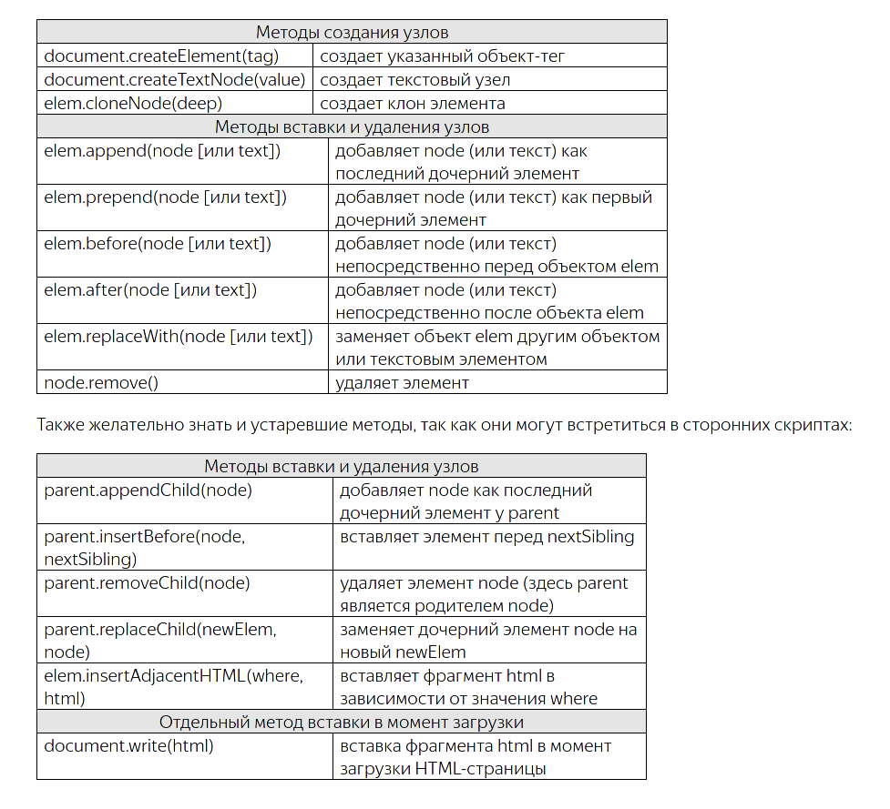

# JS

## Изменять `Html`

### Получение элемента динамически

> Главная особенность в том что если html документ меняться то изменения автоматически
> вносятся в результат Живой коллекции

Получить по id

```js
let <elem> = document.getElementById(<"ID_Html">)
```

Получить по имени класса

```js
let <elem> = document.getElementsByClassName(<"Class_Html">)
```

Получить по тегу `Html`

```js
let <elem> = document.getElementByTagName(<"Tag_Html">))
```

Получить по [Имени `Html`](http://htmlbook.ru/html/a/name)

```js
let <elem> = document.getElementByName(<"NameHtml">)
```

### Работа с существующими тегами `Html`

`.innerHTML`Текст тега (`read`/`write`)

```js
<elem>.innerHTML = 10;
console.log(<elem>.innerHTML);
```

`.outerHTML` Установить элемент вмести с тегом (`read`/`write`)

```js
<elem>.outerHTML = "<h1>  Изменен тег  </h1>";
console.log(<elem>.outerHTML);
```

`.textContent` Установить значение именно как текст, с учетом экранирования.

```js
<elem>.textContent = "Новое знаечение текста";
```

`.hidden` Скрыть / Показать элемент

```js
<elem>.hidden = true; 	// Скрыт
<elem>.hidden = false;	// Показан
```

`.remove()`Удаление элемент

```js
<elem>.remove();
```

`.className` Стандартное имя класса(Первый класс слева)

```js
<elem>.className;
```

`.classList` Коллекция со всеми классами элемента

```js
<elem>.classList;

<elem>.classList.add('ИмяКласса'); // Добавить класс к элементу
<elem>.classList.remove('ИмяКласса'); // Удалить класс из элемента

<elem>.classList.toggle('ИмяКласса'); // Добавить каласс если он не существует
<elem>.classList.contains('ИмяКласса'); // Проверить наличие класса. Если есть `true`
```

### Добавление элементов в Html



---

Особенности:

- После создания элемента с ним можно обращаться как с [Существующем](#Работа/с/существующими/тегaми/Html)

---

Создать элемент `.createElement()` или `.insertAdjacentElement(<Куда>,<Элемент>)`

```js
let <elem_new> = document.createElement("<TAG>"); // div/h1/a/img/...др
```

Создаем элемент как текст `.createTextNode()` или `.insertAdjacentText(<Куда>,<"Текст">)`

```js
let <elem_new> = deocument.ctreateTextNode("Мой_Текст");
```

Добавление созданный элементов в `Html`

```js
<elem>.append(<elem_new>);	// Добавить в конец
<elem>.prepend(<elem_new>);	// Вставить в начало
<elem>.after(<elem_new>);	// Вставить после
<elem>.before(<elem_new>);	// Вставить до
```

Замена элемента

```js
<elem>.replaceWith(<elem_new>); // Заменить текущий элемент на новый
```

Создать клон `cloneNode`

```js
let <NewCopy> = <Tag>.cloneNode(<flDeep>); // Если <flDeep> == `true` то создастя глубокий клон с дочерними элементами
```

Создать фрагмент HTML кода `DocumentFragment`

```js
let fr = new DocumentFragment();
let list=["Меркурий", "Венера", "Земля", "Марс"];
for(let p of list) {
    let item = document.createElement('li');
    item.innerHTML = p;
    fr.append(item);
}

let ul = document.querySelector("ul");
ul.append(fr);
```

Создаем и добавить `Html` код `.insertAdjacentHTML(<Куда>,<"Html_Код">)`

```js
<Tag>.insertAdjacentHTML("beforebegin", <"Html_Код">);	// Перд
<Tag>.insertAdjacentHTML("afterbebin", <"Html_Код">);	// Первый
<Tag>.insertAdjacentHTML("beforeend", <"Html_Код">);	// Последний
<Tag>.insertAdjacentHTML("afterend", <"Html_Код">);		// После
```

## Циклы

Цикл со счетчиком.

```js
for (<Инициализация_Счетчика>; <Условие>; <Изменение_Счетчика>){
	... ;
}
```

Перебрать свойств объекта(если это массив то Индексы).

```js
for (let <item> in <arr>){
	... ;
}

```

Перебрать значения объекта.

```js
for (let <item> of <arr>){
	... ;
}
```

Цикл с условием остановки.

```js
while(<условие>){
	... ;
}
```

- Циклы специально для массивов:

  Перебрать элементы массива.

  ```js
  let <arr> = [..., ..., ...]

  <arr>.map((<Элемент>,<Индекс>,<КопияТекущегоМассива>) =>
  	...;
  )
  ```

  Отфильтровать элементы массива.

  ```js
  let <arr> = [..., ..., ...]

  let <NewArrr> = <arr>.filter((<Элемент>,<Индекс>,<КопияТекущегоМассива>) =>
  	// Условие фильтрации - должен вернться `boolean`
  )
  ```

## Условные операторы

```bush
&&  = И
||  = Или
! 	= Не
in  = Вхождение значения в массив
```

Обычный

```js
if(){
	... ;
}
else if () {
	... ;
}
else {
	... ;
}
```

Тернарный оператор

```js
let <res> = (<условие>) ? true : false;
```

switch-case

```js
switch(<var>) {
	case <Значение1>: ... ;
	case <Значение2>: ... ;break;
	default: ... ;
}
```

## `async`/ `defer`

Эти два атрибута нужны, чтобы указать браузеру скачать асинхронно `JS`код. Загружать данные асинхронно полезно, потому что они не блокируют загрузку все страницы [Про асинхронную загрузку](https://learn.javascript.ru/external-script)

```js
<script src="async.js" async></script>
<script src="defer.js" defer></script>
```

**Отличие** `async`от `defer` в том что

- `defer` Гарантирует порядок исполнение `js` кода, даже если какой-то скрипт скачался раньше, он будет ждать своей очереди.
- `async` Нет порядка, какой скрипт первый скачался тот и исполниться.

# `jQuery`

## Основы

[jQuery документация на русском](https://jquery-docs.ru/category/events/)

```js
$(document).ready(function () {

	// Когда документ загружен
})
```

|                                                                                         |                                                                                                                                                                    |
| --------------------------------------------------------------------------------------- | ------------------------------------------------------------------------------------------------------------------------------------------------------------------ |
| `$('.text1').text('НовыйТекст');`                                                       | Установить новый текст                                                                                                                                             |
| `$('.text1').text();`                                                                   | Получить текст из селектора переменную                                                                                                                             |
| `$('.text1').html("<a href='#'>qwewqeqwe</a>")`                                         | Вставить `html` текст                                                                                                                                              |
| `$('.text1').html();`                                                                   | Получить `html` текст элемента                                                                                                                                     |
| `$('.text1').css({'color': '#c96464', 'font-size': '50px'})`                            | Добавить стили элементу                                                                                                                                            |
| `$('.text1').attr('ИмяАтрибутаТега');`                                                  | Получить значение атрибута тега                                                                                                                                    |
| `$('.text1').attr('ИмяАтрибутаТега','НовоеЗначениеАтрибута');`                          | Установить новое значение атрибуту тега                                                                                                                            |
| `$('.text1').removeAttr('ИмяАтрибутаТега');`                                            | Удалить атрибут у тега                                                                                                                                             |
| `$('.text1').val();` -> str                                                             | Получить значение из тега                                                                                                                                          |
| ` $('.text1').length;  `->int                                                           | Сколько существуют указанных элементов                                                                                                                             |
| ---                                                                                     | ---                                                                                                                                                                |
| `$('.text1').hide(<ВремяАнимацииСкрытияЭлемента>,<ВызватьФункцияПослеСкрытия>);`        | Скрыть элемент                                                                                                                                                     |
| `$('.text1').show(<ВремяАнимацииПоявленияЭлемента>,<ВызватьФункцияПослеПоявления>);`    | Показать текст элемент                                                                                                                                             |
| `$('.text1').slideUp(<ВремяАнимацииСкрытияЭлемента>,<ВызватьФункцияПослеСкрытия>);`     | Закатать элемент                                                                                                                                                   |
| `$('.text1').slideDown(<ВремяАнимацииСкрытияЭлемента>,<ВызватьФункцияПослеПоявления>);` | Раскатать элемент                                                                                                                                                  |
| `$('.text1').slideToggle(<ВремяАнимацииЭлемента>,<ВызватьФункцияПоявления>));`          | Переключает `slideUp` и `slideDown`                                                                                                                                |
| `$('.text1').fadeOut(<ВремяАнимацииСкрытияЭлемента>,<ВызватьФункцияПослеПоявления>));`  | Растворить элемент                                                                                                                                                 |
| `$('.text1').fadeIn(<ВремяАнимацииСкрытияЭлемента>,<ВызватьФункцияПослеПоявления>));`   | Проявить элемент                                                                                                                                                   |
| `$('.text1').fadeToggle(<ВремяАнимацииЭлемента>,<ВызватьФункцияПоявления>));`           | Переключает `fadeOut` и `fadeIn`                                                                                                                                   |
| ---                                                                                     | ---                                                                                                                                                                |
| `$('.text1').each(<Функция>)`                                                           | Перебирать элементы в цикле                                                                                                                                        |
| `$('.text1').toArray()`                                                                 | Получить массив из селекторов                                                                                                                                      |
| ---                                                                                     | ---                                                                                                                                                                |
| `$('.text1').addClass('ИмяНовогоКласса');`                                              | Добавить класс к элементу                                                                                                                                          |
| `$('.text1').removeClass('ИмяКлассаКотороеУдалить');`                                   | Удалить клас из элемента                                                                                                                                           |
| `$('.text1').toggleClass('ИмяСменяющегосяКласса');`                                     | Если класс есть то он удалиться , если класса нет то он добавится                                                                                                  |
| ---                                                                                     | ---                                                                                                                                                                |
| `$('.text1').wrap(<'ИмяТега' ... ></'ИмяТега'>);`                                       | Заключить(Обернуть) элементы в `<ИмяТега> ... </ИмяТега>` по Отдельности для каждого элемента                                                                      |
| `$('.text1').wrapAll(<'ИмяТега' ... ></'ИмяТега'>);`                                    | Заключить(Обернуть) элементы в `<ИмяТега> ... </ИмяТега>` Для всех рядо стоящих элементов                                                                          |
| `$('.text1').unwrap('ИмяТега');`                                                        | Освободить(Раскрыть) от тега                                                                                                                                       |
| ---                                                                                     | ---                                                                                                                                                                |
| `$('.text1').append('htmlТекст');`                                                      | Добавить в конец элемента(перед закрывающем тегом) `html` текст                                                                                                    |
| `$('.text1').prepend('htmlТекст');`                                                     | Добавить в начало элемента(после открывающего тега) `html` текст                                                                                                   |
| `$('.text1').before('htmlТекст');`                                                      | Добавить в начло тега (перед открывающем тегом) `html` текст                                                                                                       |
| `$('.text1').after('htmlТекст');`                                                       | Добавить в конец тега (после закрывающего тега) `html` текст                                                                                                       |
| ---                                                                                     | ---                                                                                                                                                                |
| `$('.text1').replaceWith('ТекстЗамены');`                                               | Заменить элемент на `ТекстЗамены`                                                                                                                                  |
| `$('.text1').clone();`                                                                  | Сделать копию элемента                                                                                                                                             |
| ---                                                                                     | ---                                                                                                                                                                |
| `$('.text1').remove('ИмяСелектора');`                                                   | Удалить элементы                                                                                                                                                   |
| `$('.text1').empty('ИмяСелектора');`                                                    | Удалить содержание элемента                                                                                                                                        |
| ---                                                                                     | ---                                                                                                                                                                |
| `$('.text1').find('ИмяСелектора');`                                                     | Поиск элемента по селектору внутри элемента                                                                                                                        |
| `$('.text1').is('ИмяСелектора');`                                                       | Проверить сущетсование элемента, еслие сть то `true`                                                                                                               |
| ---                                                                                     | --                                                                                                                                                                 |
| `setInterval(<Функция>,<Время>,<Аргументы ...>)` ->timerId                              | Постоянно выполнять указанную функцию через указанное количество миллисекунд (1000 = 1 секунда) [+](https://learn.javascript.ru/settimeout-setinterval#settimeout) |
| `setTimeout(<Функция>,<Время>,<Аргументы ...>)` ->timerId                               | Один раз выполнить указанную функцию через указанное количество секунд (1000 = 1 секунда)                                                                          |
| `clearTimeout(timerId);`                                                                | Отменить выполнение интервальной функции                                                                                                                           |

Перебирать элементы в цикле `$('.text1').each(<Функция>)`

```html
<div class="text1">
 1a
</div>
<div class="text1">
 2a
</div>
<div class="text1">
 3a
</div>
<div class="text1">
 4a
</div>
<div class="text1">
 5a
</div>

<script>

 $(document).ready(function () {

      function MyFun() {
         console.log($(this).text())
      }

      $('.text1').each(MyFun)

   })

</script>
```

## Обработка событий

[События jQuery](https://jquery-docs.ru/category/events/)

| Событие                 | Описание                                                                                                               |
| ----------------------- | ---------------------------------------------------------------------------------------------------------------------- |
| `.click(<Функция>)` (+) | Нажатие мышью на элемент                                                                                               |
| focus (+)               | Наведение на элемент                                                                                                   |
| blur (+)                | Устанавливает обработчик потери фокуса, либо, запускает это событие.                                                   |
| focusin                 | Устанавливает обработчик получения фокуса самим элементом или одним из его дочерних.                                   |
| focusout                | Устанавливает обработчик потери фокуса элементом или одним из его дочерних.                                            |
| load (+)                | Устанавливает обработчик полной загрузки выбранных элементов.                                                          |
| resize                  | Устанавливает обработчик изменения размеров окна браузера, либо, запускает это событие.                                |
| scroll                  | Устанавливает обработчик "прокрутки" элементов документа, либо, запускает это событие.                                 |
| unload                  | Устанавливает обработчик выхода со страницы (при переходе по ссылке, закрытии браузера и.т.д.) для объекта window.     |
| dblclick                | Устанавливает обработчик двойного "клика" мышью по элементу, либо, запускает это событие.                              |
| mousedown               | Устанавливает обработчик нажатия кнопки мыши на элементе, либо, запускает это событие.                                 |
| mouseup                 | Устанавливает обработчик возвращения кнопки мыши в ненажатое состояние, либо, запускает это событие.                   |
| mousemove               | Устанавливает обработчик движения курсора мыши внутри элемента, либо, запускает это событие.                           |
| mouseover               | Привяжите обработчик события к событию JavaScript «наведения указателя мыши» или инициируйте это событие для элемента. |
| mouseout                | Устанавливает обработчик выхода курсора из области элемента, либо, запускает это событие.                              |
| mouseenter              | Устанавливает обработчик появления курсора над элементом, либо, запускает это событие.                                 |
| mouseleave              | Устанавливает обработчик выхода курсора из области элемента, либо, запускает это событие.                              |
| change                  | Устанавливает обработчик изменения заданного элемента формы, либо, запускает это событие.                              |
| select                  | Устанавливает обработчик выделения текста внутри элемента или , либо, запускает это событие.                           |
| submit (+)              | Устанавливает обработчик отправки формы на сервер, либо запускает это событие.                                         |
| keydown                 | Устанавливает обработчик перехода клавиши клавиатуры в нажатое состояние, либо, запускает это событие.                 |
| keypress (+)            | Устанавливает обработчик ввода символа с клавиатуры, либо, запускает это событие.                                      |
| keyup                   | Устанавливает обработчик возвращения клавиши клавиатуры в ненажатое состояние, либо, запускает это событие.            |
| error (+)               | Устанавливает обработчик ошибки при загрузке элементов (например отсутствие необходимой картинки на сервере).          |

---

Перехватить события

```html
<ul>
	<li>пункт 1</li>
	<li>пункт 2</li>
	<li>пункт 3</li>
</ul>


<script>

	$(document).ready(function () {
		$('li').click(function () {
			$(this).append('!');
		});
	})
</script>
```

Перехватить любого события `.on('Событие',Функция)`

```html
<ul>
	<li>пункт 1</li>
	<li>пункт 2</li>
	<li>пункт 3</li>
</ul>

<script>
	$('li').on('click',func);


	function func() {
		$(this).append('!');
		$(this).unbind('click', func);

	}
</script>
```

Перехватить несколько событий `.on('Событие1 Событие2 ...',Функция)`

```html
<ul>
	<li>пункт 1</li>
	<li>пункт 2</li>
	<li>пункт 3</li>
</ul>

<script>
	$('li').on('click focus',func);


	function func() {
		$(this).append('!');
		$(this).unbind('click', func);

	}
</script>
```

---

Отвязать событие `.unbind('Событие',Функция)`

```html
<ul>
	<li>пункт 1</li>
	<li>пункт 2</li>
	<li>пункт 3</li>
</ul>

<script>
	$('li').click(func);
	function func() {
		$(this).append('!');
		$(this).unbind('click', func);
	}
</script>
```

Отвязать любое событие `.off('Событие',Функция)`

```html
<ul>
	<li>пункт 1</li>
	<li>пункт 2</li>
	<li>пункт 3</li>
</ul>

<script>
	$('li').click(func);
	function func() {
		$(this).append('!');
		$(this).off('click', func);
	}
</script>
```

---

Перехватить только один раз событие. (А потом отвязать перехват) `.one('Событие',Функция);`

```html
<ul>
	<li>пункт 1</li>
	<li>пункт 2</li>
	<li>пункт 3</li>
</ul>

<script>
	$('li').one('click',func);

	function func() {
		$(this).append('!');
		$(this).off('click', func);
	}
</script>
```

---

Перехватить отправку формы.

```html
<form method="post" name="SendFormName"
	  action="#"
	  accept-charset="UTF-8"
	  autocomplete="on"
	  target="_self"
	  enctype="application/x-www-form-urlencoded"> 


	<input type="submit">
</form>

```

- В этом варианте мы предотвращаем всплытия события

  ```js
  $(document).ready(function () {
  	$('[name=SendFormName]').submit(function (event) {
  		console.log($(this));
  		event.preventDefault();
  	})
  })
  ```

- В этом варианте мы предотвращаем отправку формы но не всплытие события

  ```js
  $(document).ready(function () {
  	$('[name=SendFormName]').submit(function () {
  		console.log($(this));
  		return false;
  	})
  })
  ```

---

### Нажатие клавиши

```js
//  Отслеживаем нажатие клавиши в полле ввода
$('input').keydown(function (e) {

	// Если нажата клавиша `Enter`
	if (e.keyCode === 13) {
		console.log(`Class:${$(this).attr('class')};Id:${$(this).attr('id')}`);
		// Что то делаем ...
	}

});
```

## Анимировать элементы

[Работа с эффектами и анимацией jQuery](http://old.code.mu/books/javascript/jquery/rabota-s-effektami-i-animaciej-jquery.html)

```html
<button id="hide">Спрятать</button>
<button id="show">Показать</button>
<div id="elem">Блок с текстом.</div>
```

Скрывать элемент по всем направлениям

```javascript
$('#hide').click(function() {
	$('#elem').hide();
});

$('#show').click(function() {
	$('#elem').show();
});
```

Закатывание элемента

```javascript
$('#hide').click(function() {
	$('#elem').slideUp(1000);
});

$('#show').click(function() {
	$('#elem').slideDown(1000);
});
```

Растворение элемента

```javascript
$('#hide').click(function() {
	$('#elem').fadeOut(1000);
});

$('#show').click(function() {
	$('#elem').fadeIn(1000);
});
```

---

Плавно анимировать изменение элемента

```html
<style>
#elem {
	width: 150px;
	height: 150px;
	padding: 10px;
	border: 1px solid green;
}
</style>

<button id="button">Нажми на меня</button>
<div id="elem">Блок с текстом.</div>
```

`.animate({<css>},<ВремяВыполения>)`

```javascript
$('#button').click(function () {
   $('#elem').animate({height: '50', width: '+=300'}, 1000);
});
```

## Асинхронный запрос `Ajax`

[Ajax Асинхронная отправка форм](../Уроки/Блок7%20-%20Django.md#Ajax%20Асинхронная%20отправка%20форм)

## URL

Получить `GET` параметры из `URL`

Если `http://127.0.0.1:8000/?re=search`

```js
$.urlParam = function (name) {
	var results = new RegExp('[\?&]' + name + '=([^&#]*)').exec(window.location.href);
	if (results == null) {
		return null;
	}
	return decodeURI(results[1]) || 0;
}

$.urlParam('re') // То будет ответ `search`
```

## `Json`

- Из строки в `Json`

  ```js
  $.parseJSON(<JsonТекст>)
  ```

- Из `Json` в строку

  ```js
  $.toJSON(<JsonТекст>)
  ```

