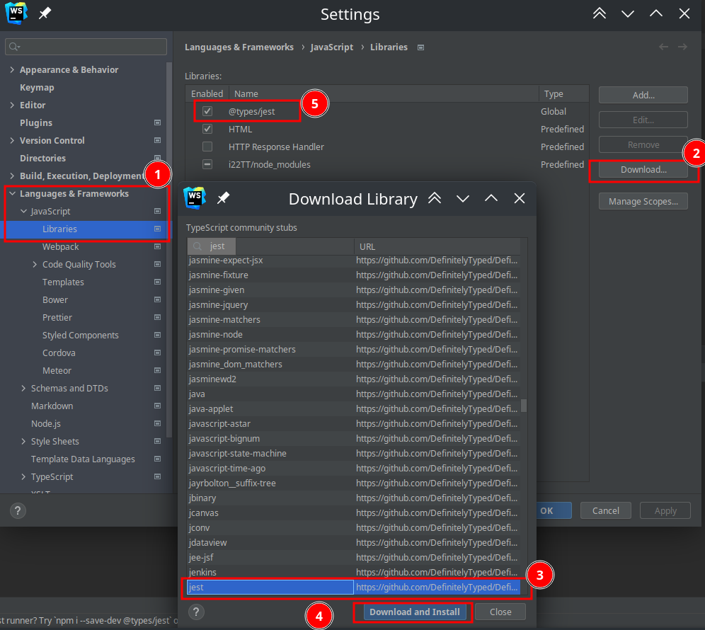

---

## date created: 2021-12-28 15:59

date updated: 2021-12-28 16:18

# Тестирование кода

## Использование `assert`

```ts
import * as assert from "assert";

let a : number = 1
let b : number = 1

assert.equal(a+b, 3,"Сообзение");
```

## Unit testing

### `JEST`

#### Подготовка

[Документация](https://jestjs.io/ru/)

Установка

- Скачать [про то как запускать `jest` для `TS`](https://www.npmjs.com/package/ts-jest)

    ```bash
    npm install --save-dev jest ts-jest @types/jest
    ```

- Создать конфигурации для тестов

    ```ts
    npx ts-jest config:init
    ```

- Добавить команду запуска тестов `package.json`

    ```json
    {
    	"scripts": {
    		"test": "jest" // !!!
    	}
    }
    ```

- Настроить подсказки в `WEBshtorm`
    

---

Все файлы тестирования должны иметь следующий паттерн

```bash
ИмяФайла.test.js
ИмяФайла.test.ts
```

Запустить все тесты

```bash
npm t or npx jest
```

#### Использование

```ts
function delimiter(a : number, b : number) : number {
	return a / b
}

function add(a : number, b : number) : number {
	return a + b
}


exports.delimiter = delimiter;
exports.add = add;
```

```ts
const tmps = require("../tmps");


test("Деление", () => {
	expect(tmps.delimiter(1, 2)).toEqual(4)
})

test("Сложение", () => {
	expect(tmps.add(1, 2)).toEqual(3)
})
```

---

Общий шаблон

```ts
describe("Описание блока с тестами", () => {

	// Функция будет запущена одина раз (конструктор)
	beforeAll(()=>{

	})
	// Эта функция будет вызваться каждый раз при функции теста
	beforeEach(()=>{

	})

	// Фунция будет запускатся каждый раз при выхде из функции теста
	afterEach(() => {

	})

	// Функция бедте работать по типу диструктора
	afterAll(() => {

	})

	// Функция теста
	test("Описание теста", () => {
		expect($ТекущийОтвет$).toEqual($ВерныйОтвет$)
	})
})
```

---

[Полный список методов](https://jestjs.io/ru/docs/expect)

| Функция                                     | Аналог                   | Описание                                              |
| ------------------------------------------- | ------------------------ | ----------------------------------------------------- |
| `toBe($ВерныйОтвет$)`                       | ===                      | Для проверки равенства простых данных                 |
| `toEqual($ВерныйОтвет$)`                    | `_.isEqual()` (`Lodash`) | Для проверки равенства объектов и массивов            |
| `.toBeTruthy()`                             |                          | Относиться к `True`                                   |
| `.toBeFalsy()`                              |                          | Относиться к `False`                                  |
| `.toMatch(/ /)`                             |                          | Проверка строки на соответствие регулярному выражению |
| `expect(()=>{throw "123" }).toThrow("123")` |                          | В процессе выполнения должна возникнуть ошибка        |
| `.toContain("$Элемент$")`                   | `is`                     | Проверить наличие элемента в массиве                  |
