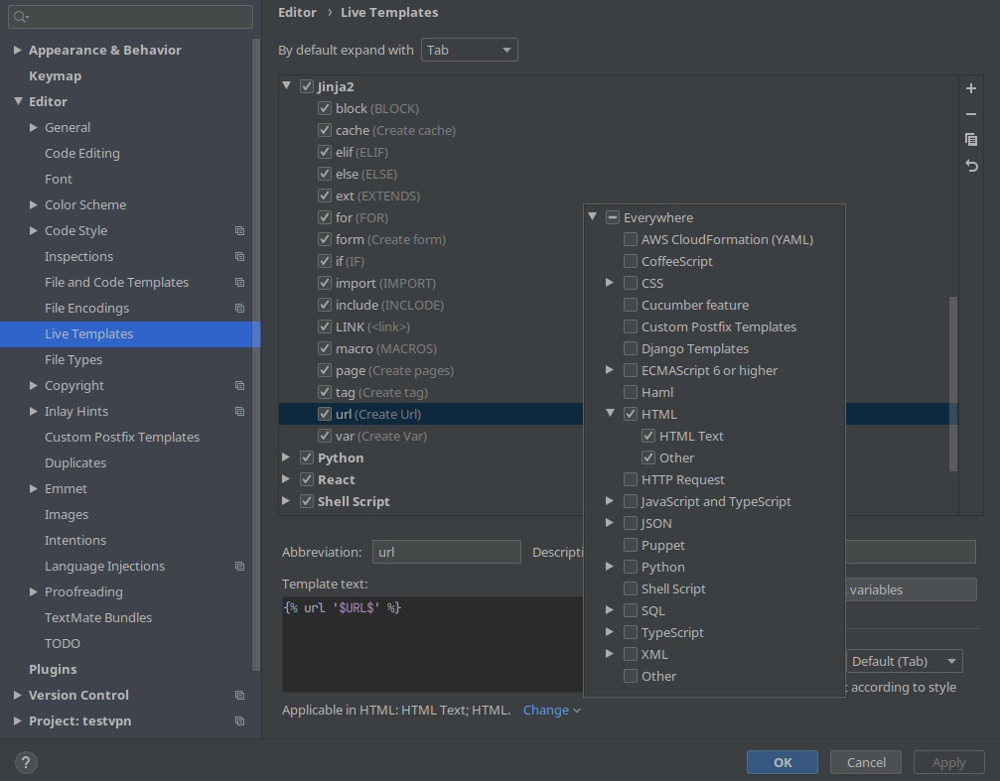

# Настройка удобных шаблонов для `Django`

## Настройка шаблонов Html



---

### Простое

tag = Обратится к тегу

```bush

```

var = Обратится к переменной

```bush
{{ $name$ }}
```

for = Создать цикл

```bush

$END$

```

if = Условный оператор

```bush
{% if $one$ $operand$ $two$}
$END$

```

elif = Условный оператор

```bush

$END$
```

else = Условный оператор

```bush

$END$
```

---

### Против дубликатов

incl = Вставить `html` контент из другого файла

```bush

```

ext = Расширить шаблон

```bush

$END$
```

block = Создать блок

```bush

{{ block.super }}
$END$

```

---

### Статические файлы

laod = Подключить тег для статических файлов

```bush

```

licss = Подключить статический `css` файл

```bush
<link href="" rel="stylesheet" type="text/css">
```

img = Подключить фото `img`

```bush

```

lijs = Подключить `js` файл

```bush
<script src="" type="text/javascript" defer></script>
```

---

### Ссылки

aurl = Создать ссылку

```bush
<a href="">$END$</a>
```

url = Обратиться к `url`

```bush

```

---

### Другие

cache = Создать кеш

```bush

$END$

```

### Форма

form = Создать форму для текста

```
<form method="$Method$" name="$NameForm$"
      action=""
      accept-charset="UTF-8"
      autocomplete="on"
      target="_self"
      enctype="application/x-www-form-urlencoded"> 

$END$

</form>
```

```python
<label>
    $Discription$<br>
    <input type="$TypeInput$" name="$NameInput$">
</label><br>
```

---

## Настройка шаблонов `python`

defr = Создать функцию представления

```bush
def $name$ (request:WSGIRequest):
    $END$

    context = {

    }
    return render(request,
                  template_name = "&app&/$name$.html",
                  context = context,)
```

path = Создать обработчик `URL`

```python
path('$path$/', $fan$, name="$path$"),
```

model = Создать модель БД

```python
class $NameDB$(models.Model):

    def __str__(self):
        """
        Для отображение в текстовом виде для админ панели, и консоли.
        """
        return str(self.pk)

    def get_absolute_url(self):
        """
        Для получения ссылки записи в Html и отображение в админ панели.
        """
        # return reverse("#", kwargs={"": self.pk})

    class Meta:
        """
        Вспомогательный класс для админ панели.
        """
        verbose_name = "$NameDB$"  # Имя таблицы в единственном числе
        verbose_name_plural = "$NameDB$s"  # Имя таблицы во множественном числе
        ordering = ["pk", ]  # Сортировать записи по указанным столбцам (можно указывать несколько столбцов)
```

dbform = Создать форму связанную с моделью БД

```python
class $NameModel$Form(forms.ModelForm):

    def __init__(self, *args, **kwargs):
        super().__init__(*args, **kwargs)

        # Пример установки параметров поля. Во время создания формы
        # self.fields['ИмяПоля'].Атрибут1 = "Значение1"

    class Meta:
        """
        Класс отвечает за логику связи модели БД с формой.
        """

        # Установить связь с моделью БД
        model = $NameModel$

        # Какие поля нужно отобразить в форме
        fields = [
        $NmaeRows$
        ]

        # Какие поля нужно исключить из формы
        # exclude = []

        # Если вам нужно задать атрибуты (class) для html формы, то сделайте это здесь.
        widgets = {
            # "ИмяПоля": forms.<СпецКлассФормы>(attrs={"<Атрибут1>": Значение1, "Атрибут2": Значение2}),
        }

    @staticmethod
    def save_from_form(cls, request: WSGIRequest, true_method="POST") -> Tuple[bool, Any]:
        """
        Метод для верификации и сохранения данных, из формы, в БД. Вызывать вручную.
        """
        """
        def index(request:WSGIRequest):
            form = $NameModel$.create_form(request)
            context = {"form": form[1], ... }
            return render(request, template_name="Name_app/Name.html", context=context, )
        """
       if request.method == true_method:  # Проверим метод запроса с необходимым методом
            form = cls(request.POST)  # Если метод подходящий, то создаем объект формы
            if form.is_valid():  # Проверим валидность данных из формы
                form.save()  # Если данные корректны, то сохранить данные в БД
                return True, ""  # Возвращаем заглушку
            return False, form  # Если валидация не пройдена, то вернем форму с сообщениями об ошибках
        else:
            return False, cls()  # Если метод не подходящий, то вернем форму для html шаблона
```

### Классы предстовления

[Все шаблоны в заголовке](#Классы/представления)

# Настройка шаблона приложения

Шаблон приложения расположен по пути `/venv/lib/python3.9/site-packages/django/conf/app_template`

- `app_template`

    - `migrations`
        - `__init__.py-tpl`
    - `templates` (+)

        - `app_name` (+)

    - `static` (+) Для статических файлов
        - `app_name` (+)
            - `css` (+)
            - `js` (+)
            - `img` (+)
            - `fonts` (+) Для шрифтов
    - `templatetags` (+) Для своих тегов

        - `__init__.py` (+)

    - `__init__.py-tpl`
    - `admin.py-tpl`
    - `apps.py-tpl`
    - `models.py-tpl`
    - `tests.py-tpl`
    - `views.py-tpl`
    - `README.md` (+) Описание приложения, инструкция по добовлению его в проект
    - `urls.py-tpl` (+) Url маршрутизация
    - `forms.py` (+) Формы

        ```python
        from django.urls import path

        from {{ app_name }}.views import index_main

        urlpatterns = [
        	path('', index_main, name="index_main"),
        ]
        ```

---

# Настройке проекта

Шаблон проекта расположен по пути `/venv/lib/python3.9/site-packages/django/conf/project_template`

- `project_template`

    - `media` (+) Хрянтся меда файлы

    - `project_name`

        - `__init__.py-tpl`
        - `asgi.py-tpl`
        - `settings.py-tpl` (Изменить и добавить)

        ```python
        # Конфиденциальность

        def set_environ_from_file_env(path: str):
        	"""
        	Прочитать файл в формате `.env` и добавить эти данные в переменные окружения
        	"""
        	# Проверка на корректное расширения
        	if splitext(path)[1] != ".env":
        		raise FileExistsError('Файл должен иметь расширение `.env`')
        	# Парсим файл
        	with open(path, 'r') as f:
        		res = dict(tuple(line.replace('\n', '').split('='))
        				   for line in f
        				   if not line.startswith('#'))
        	# Добавляем в переменные окружения данные из файла
        	os.environ.update(res)

        # Добовляем переменные окружения из файла
        set_environ_from_file_env(`__env.env`)

        SECRET_KEY = os.getenv("DJANGO_SECRET_KEY") # Секретный ключ, который нужно держать в  тайне. Например получать из переменных окружения


        # Локализацтя
        LANGUAGE_CODE = 'ru' # Язык сервера
        USE_I18N = True # Логическое значение, указывающее, должна ли быть включена система перевода Django.
        TIME_ZONE = 'Europe/Moscow' #  Часовой пояс
        USE_L10N = True # Логическое значение, указывающее, будет ли включено локализованное форматирование данны
        USE_TZ = True # Логическое значение, указывающее, будут ли даты по умолчанию учитывать часовой пояс


        ## Статические файлы
        STATIC_URL = '/static/' # URL-адрес для использования при обращении к статическим файлам, расположенным в STATIC_ROOT.
        STATIC_ROOT = os.path.join(BASE_DIR, "static/")  # Путь к общей статической папки.
        STATICFILES_DIRS = [ # Список нестандартных путей используемых для сборки.
        	# os.path.join(BASE_DIR, "static"),
        ]
        """
        Внимание **если у вас есть две папки** `static`, одна общая папка для всех,
        а другая в приложение, то данные будут **браться из папки приложения**
        """

        ## Изображения
        MEDIA_ROOT = os.path.join(BASE_DIR, 'media')  # Имя папки в корневом каталоге, для изображений
        MEDIA_URL = '/media/' # Добавляет к файлам префикс

        ```

        - `urls.py-tpl`
        - `wsgi.py-tpl`

        ```python
        	import os

        	from django.contrib.staticfiles.handlers import StaticFilesHandler
        	from django.core.wsgi import get_wsgi_application

        	from market_dajngo import settings

        	# Изменить `<ИмяПроекта>` на коректное имяя !!!
        	os.environ.setdefault('DJANGO_SETTINGS_MODULE', '<ИмяПроекта>.settings')

        	if settings.DEBUG:
        		# Для получения статических файлов при запуске `gunicorn` в режиме отладки
        		application = StaticFilesHandler(get_wsgi_application())
        	else:
        		application = get_wsgi_application()

        ```

    - `__env.env-tpl` (+) Файл который хранит приватные данные. Эти данные мы будем добовляеть в переменные окружения, и использовать их в проекте. Этот файл мы добовляем в `.gitignore` и держим его в тайне.

        ```python
        # Ключ для расшифровки сессии
        DJANGO_SECRET_KEY={{ secret_key }}
        ```

    - `manage.py-tpl`
    - `README.md` (+) Описание проекта
    - `requirements.txt` (+) Хранить зависемости

        ```bash
        asgiref==3.4.1
        beautifulsoup4==4.10.0
        Django==3.2.9
        django-cleanup==5.2.0
        django-debug-toolbar==3.2.2
        django-livereload-server==0.3.2
        gunicorn==20.1.0
        Pillow==8.4.0
        psycopg2-binary==2.9.2
        pytz==2021.3
        six==1.16.0
        soupsieve==2.3.1
        sqlparse==0.4.2
        tornado==6.1
        urwid==2.1.2
        ```

    - `dump.json` (+) Хранить сохранения БД
    - `gunicorn.conf.py` (+) Настройки для `gunicorn`
    - `.gitignore`
        ```bush
        /.idea
        /venv
        __env.env
        ```
