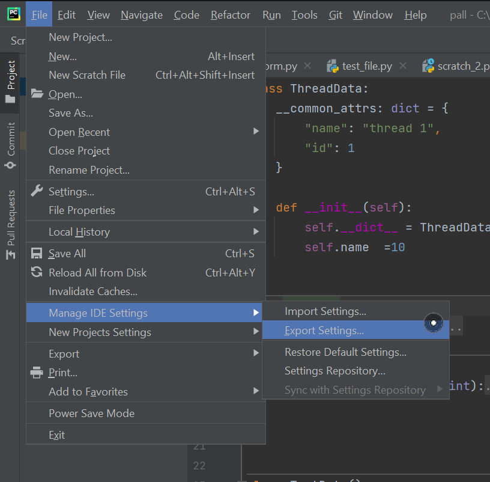

## Тесты

1. Создаем папку test где будут храниться все тесты

> 
>
> Для удобства можно сразу создать шаблон теста
>
> 

2. Настройка запуска тестов

> 

3. Добавляем конфигурацию запуска теста

> 

4. Тут можно указать как папку с тестами так и отдельный файл


5. Потом просто выбираем тесты который нужно провести .Советую создать конфигурацию запуска для всех файлов


# Горячие клавиши

## Редактирование кода

- Перемещать строки местами

```cmd
Ctrl+Shift+Вверх или Ctrl+Shift+Вниз.
```

- Выделить участка код в строке

```cmd
Ctr+W или Ctr+Shift+W
```

- Дублировать строку

```cmd
Ctr+D
```

- Удалить строку

```cmd
Ctr+Y
```

- Быстро перемещаться между методами в редакторе.

```cmd
Alt+Up и Alt+Down
```

- Поставить метки в коде по которым можно потом перемещаться

```cmd
Ctrl+Shit+[1-9] – поставить метку
Ctr +[1-9] – переместиться к метки

```

- Вернуться к предыдущему месту курсора

```cmd
Ctrl + Shift + Backspace
```

- Перемещение по последним курсорам

```cmd
Ctrl+Alt+Left // Ctrl+Alt+Right
```

- Вынести выделенное в отделанную переменную

```cmd
Ctrl+Alt+V
```

- Выделить несколько строк сразу

```cmd
Alt +Shift + выделение мышью
```

- Перемещать курсор по краям скобок

```cmd
Ctr+Shift+M
```

- Переместить курсор на следящую строку

```cmd
Shift+Enter
```

- Завершить строку и Переместить курсор на следящую строку

```bush
Cttl + Shit + Enter
```

- Однострочных комментариев (// ...)

```cmd
Ctrl + /:
```

- Комментариев блока (/_..._/)

```cmd
Ctrl + Shift + /:
```

- Навигация между файлами

```cmd
Alt+<- || Alt +->
```

- Форматирование кода

```cmd
Ctr + Alt + L
```

- Посмотреть автодополнения только к префиксам и шаблонам

```bush
Ctrl + J
```

- Прокрутка предложений [+](https://www.jetbrains.com/help/idea/auto-completing-code.html#expand-a-string-at-caret-to-an-existing-word)

```bush
Alt + / # Вперед
Alt + Shift + / # Назад
```

- Генерировать случайные слова

```bush
lorem<ЧислоСлов>
```

## Подсказки в коде

- Нажмите Ctrl + Shift + I (Просмотр | Быстрое определение), чтобы просмотреть определение или содержимое символа в каретке, не открывая его в отдельной вкладке редактора.

```cmd
Ctrl + Shift + I
```

- Если курсор находится между круглыми скобками при вызове метода, нажмите чтобы открыть список допустимых параметров.

```cmd
Ctrl + P,
```

- Всплывающее окно документации

```cmd
Ctr+Q
```

- Места в коде где используется эта переменная или функция

```cmd
Ctrl + B
```

- Вызвать автодополнение и подсказки

```cmd
Ctrl + Space,
```

- Посмотреть список с метами, где используется переменная

```cmd
Зажать Ctr и нажать мышью на переменную(функцию)
```

- Пример решение выделенной проблемы(ошибки)

```cmd
Alt+enter
```

## Поиск

- Поиск в файле

```cmd
Ctr+F
```

- Поиск в файлах

```cmd
Ctr+Shift+F
```

- Поиск методов классов и переменных

```cmd
Ctr+Shift+N
```

- Pep 8 перейти к ошибке

```cmd
F2
```

- Найти места, где используется переменная или функция в большом окне

```cmd
Alt+F7
```

- Окно с закладками

```cmd
Shift+F11
```

- Переменную в области видимости

```cmd
Shift+F6
```

- Переименовать во всем проекте

```cmd
Ctr+F6
```

## Создание элементов кода

- Создать метод класса автоматически

```cmd
Ctrl+O
```

- Создать шаблон условия, обработки исключения

```cmd
Ctr+Alt+T
```

- Создать временный файл

```cmd
Ctrl + Alt + Shift + Insert,
```

## История кода

- Список недавно изменений кода

```cmd
Ctrl + Shift + E.
```

- История копирование

```cmd
Ctrl + Shift + V,
```

## Отладка

- Поставить точку остановки

```cmd
Ctrl + F8
```

# Отладка

> Посмотреть значение любой переменной в отдельном окне

```cmd
Alt+F8
```

> Посмотреть значение переменной Быстро

```cmd
Зажать Alt и навести на перерешённую
```

> Если не работает сочетание клавиш [Хитрости](#_Хитрости)

## Авто тесты


> Тесты будут автоматом запускаться когда вы изменили данные

## Исправление ошибок

> Откроется удобное окно


# Создание своих шаблонов

## Снипетты

> [Документация](https://www.jetbrains.com/help/pycharm/tutorial-creating-and-applying-live-templates-code-snippets.html#template-text)


> 1. Выбираем в каком языке будет работать шаблон
>
> 2. добавляем
>
> 
>
> 3.  пешим код шаблона
>
> ```python
> class $class$($object$):
> 	"""
> 	$class$
> 	"""
>
> 	__slots__ = ()
>
> 	def __init__(self,$args$):
> 		super.**init**($args$)
> 		$END$
> 		pass
>
> 	def __repr__(self):
> 		return f"{$class$}:{self.**dict**}"
>
> 	def __del__(self):
> 		pass
> ```
>
> 4.  тут писать описание шаблона
>
> 5.  тут писать имя шаблона
>
> 6.  тут можно изменять редактировать значения по умолчанию шаблона

## Значения по умолчанию

> Двойные кавычки для констант


## Expression

[Функции ](https://i.imgur.com/Wsp15kZ.png)

## Постфикс

Стандартные


Расширенный префиксы

```bush
Custom Postfix Templates
```

[Документация](https://github.com/xylo/intellij-postfix-templates#order-of-template-filesrules)


### Добавить свой шаблон

Нужно создать отдельный файл с шаблонами
`Tools -> Custom Postfix Templates -> Edit Templates of ...`

### Правила составления шаблона

```bush
.NAME: decription

	MATCHING_TYPE  →  TEMPLATE_CODE
```

`.NAME` = Название постфикса
`decription` = Описание постфикса

---

`MATCHING_TYPE` = Для какого типа применять указанный шаблон

[Все типы](https://github.com/xylo/intellij-postfix-templates#simple-template-rules)
Типы `Python`

- `ANY`- любое выражение
- `object`
- `list`
- `dict`
- `set`
- `tuple`
- `int`
- `float`
- `complex`
- `str`
- `unicode`
- `bytes`
- `bool`
- `classmethod`
- `staticmethod`
- `type`

```bush
.example : example template
    dict →   dict($expr$)
    str →   str($expr$)
    float →   float($expr$)
    int →   int($expr$)
    list →   list($expr$)
    tuple →   tuple($expr$)
    set →     set($expr$)
    object →   object($expr$)
    ANY  →  foo($expr$)
```

---

`TEMPLATE_CODE` = Шаблон постфикса

Можно использовать любые имена в виде `$NAME_VAR$` кроме зарезервированных

- Зарезервированные имена в шаблоне
    - `$expr$`= Выражение к которому применятся постфикс
    - `$END$`= Конечное место курсора

Так же можно использовать значения по умолчанию

```python
.example : example template
    ANY  →  foo($expr$,$Name*#<Идекс>:<Выражение>:"<Значение_по_умолчанию>"$)
```

- `*`= Вставить значение по умолчанию
- `Идекс` = Номер выражения
- `Выражение` = активный макрос шаблона (редко) [ Примеры функций](https://www.jetbrains.com/help/idea/template-variables.html#predefined_functions)
- `Значение_по_умолчанию`= Значение должно быть в кавычках `"_"`!
    > Если какой-то параметр не нужен, то пропускать его как слайс `$Name$#::<"Значение по умолчанию">`

---

Интересные функции для шаблона:

`date([format])` Вставляет текущую дату
`time("H:m z")` Текущее системное время

```python
.datprint : Вывести текущую дату
    ANY →  print("$Name:date("Y-MM-d, E, H:m")$",$expr$)
```

---

`enum(<String>, ...)` Свой список дополнений для переменных

```python
.choice : Пример как создать шаблон со списком параметров
    ANY →  print("$Name:enum("1","2","3")$",$expr$)
```

---

`fileName()` Имя текущего файла с его расширением
`fileNameWithoutExtension` Имя текущего файла без его расширения
`filePath()` Полный путь до текущего файла
`fileRelativePath()` Путь относительно текущего проекта
`user()` Имя текущего пользователя
`pyFunctionName()` Имя текущей функции
`pyClassName()`Имя текущего класса

```python
.name_proj : Получить имя файла
    ANY →  print("$Name:fileName()$",$expr$)
```

---

`showParameterInfo()` Показывает окно с параметрами у вызываемой функции

```python
.show_args : Показать окно параметров функции
	ANY →  print(sum($Name:showParameterInfo()$),$expr$)
```

---

### Шаблоны

```python
.example : example template
    dict →   dict($expr$)
    str →   str($expr$)
    float →   float($expr$)
    int →   int($expr$)
    list →   list($expr$)
    tuple →   tuple($expr$)
    set →     set($expr$)
    object →   object($expr$)
    ANY  →  foo($expr$,$Name*:methodName()$)

.printD : Отправить в Debugger
    ANY → printD($expr$,$END$)

.def: Создать функци с указанным колличеством параметров
    ANY → def $expr$ ($Args$):\
        $END$
```

# Хитрости

## !

> Отключить комбинацию Alt+F8
> 

## SCSS - Sasss

[Doc scss](https://www.jetbrains.com/help/pycharm/transpiling-sass-less-and-scss-to-css.html)

---

Установка SCSS

- Установить `Node.js`

```bush
sudo pacman -S npm
```

- Установить компилятор `SCSS`

```bush
sudo npm install -g sass
```

---

Создать наблюдатель `SCSS` | `Sasss`


---

Настройка наблюдателя


`Scorpe` Где искать изменения фала
`Program` Путь к scss. Если установили scss через `npm` то путь автоматически создастся
`Output paths to refrsh` Путь выхода компилированного файла

---

Создать файл SCSS


---

Вот такой результат


## Git

[Git](../Знания/Git.md##Pychram%5CGit)

## Построить диаграмму классов

[Doc](https://www.jetbrains.com/help/pycharm/class-diagram.html#manage_class_diagram)


1. Показать/Скрыть (методы/функции)

```bush
Ctrl + Alt + U # Вызвать всплывающие окно
Shift + Ctrl + Alt + U # Отдельная вкладка
```

## Размер окна PyCharm

> Изменять размер по прокрутки мыши
> 

## Импорт | Экспорт настроек PyCharm

> 

## Свернуть Код

> 

## Структура проекта

```bash
# Свернуть весь код
cntrl+shift+-
# Развернть код на достаточный уровень
cntrl+shift++
```

> 

## Заметки закладки

> 

## TODO

> Чтобы создать TODO напишите
>
> ```cmd
>  #: TODO Написать напоминание
> ```
>
> 

## Requirements.txt

> 

## Добавить проверку орфографии

> Скачать плагин Grazie
> 
>
> или
>
> 
>
> Качаем именно исходный код
>
>  > 
>
> **ПЕРЕЗАГРУЗИТЬ** проект!

## Экспорт настроект

> 

## Добавить `pylint`

Скачать плагин [pylint](https://plugins.jetbrains.com/plugin/11084-pylint)


`C:\Users\denis\AppData\Local\Programs\Python\Python37\Scripts\pylint.exe`

## ИИ автокомплит


## Всплывающее окно параметров для автокомплита


