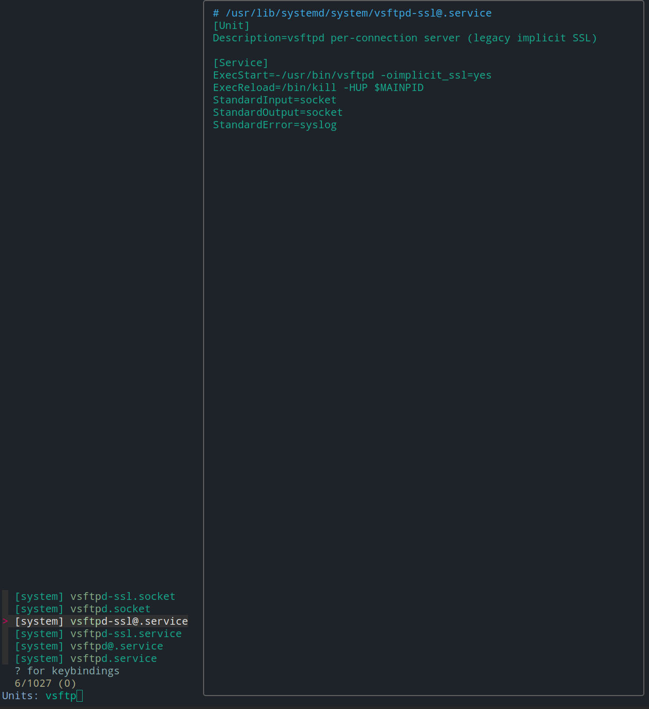
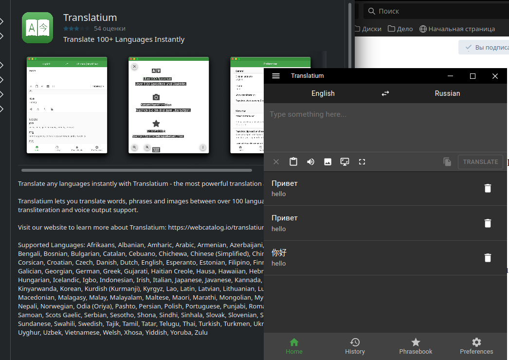
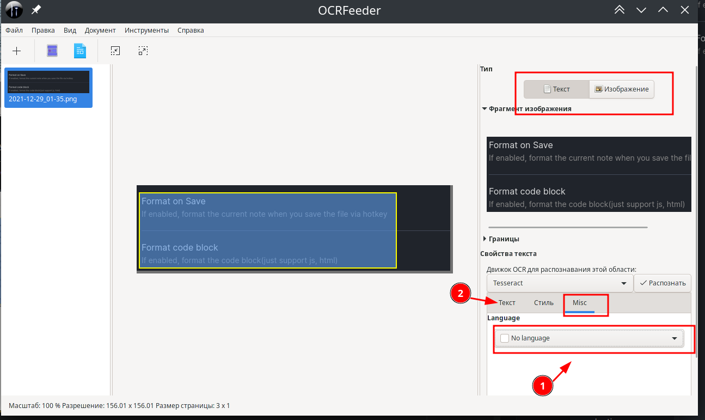
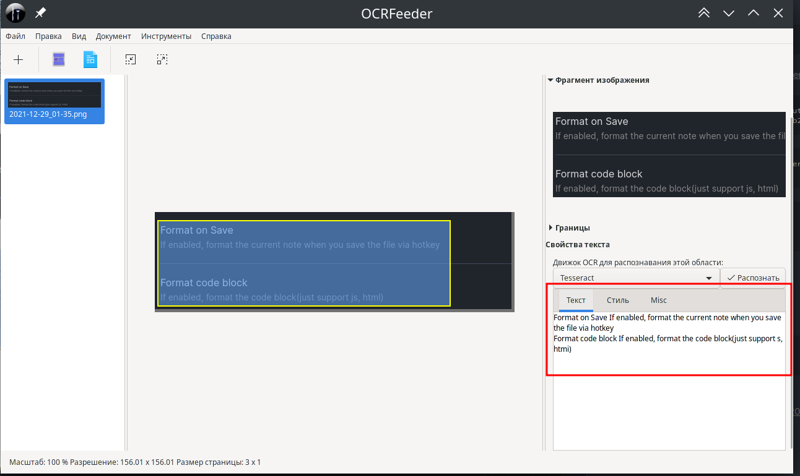

# Основные

## `Zsh` настройка oh my zsh

### Быстрая настройка `zsh`

[zsh](https://gist.github.com/denisxab/7b91e1d09ff8fbe6d8e738a5326e9ced)

```bash
curl https://gist.githubusercontent.com/denisxab/7b91e1d09ff8fbe6d8e738a5326e9ced/raw/19f9a498998a7f0a442ca11a801bc0a184afef21 > ~/.zshrc; . ~/.zshrc; chsh -s $(which zsh)
```

### Общее

1. Установить `zsh` и `oh my zsh`

    ```bash
    sudo apt install zsh git curl; sh -c "$(curl -fsSL https://raw.github.com/ohmyzsh/ohmyzsh/master/tools/install.sh)"
    ```

1. Установить плагины

    ```bash
    git clone https://github.com/zsh-users/zsh-autosuggestions ~/.oh-my-zsh/custom/plugins/zsh-autosuggestions && \
    git clone https://github.com/zsh-users/zsh-syntax-highlighting.git ~/.oh-my-zsh/custom/plugins/zsh-syntax-highlighting && \
    git clone https://github.com/marlonrichert/zsh-autocomplete.git ~/.oh-my-zsh/custom/plugins/zsh-autocomplete && \
    mkdir $ZSH_CUSTOM/plugins/poetry && \
    poetry completions zsh > $ZSH_CUSTOM/plugins/poetry/_poetry
    ```

> Настроить `oh my zsh` `vim ~/.zshrc` (Перезагрузить оболочку командой `. ~/.zshrc`) [Код](https://gist.github.com/denisxab/7b91e1d09ff8fbe6d8e738a5326e9ced)

## `Tmux` - Много терминалов в одном окне

### Быстрая настройка `Tmux`

[tmux](https://gist.github.com/denisxab/e0b547f143de9b8c7471395a3fb4180c)

```bash
curl https://gist.githubusercontent.com/denisxab/e0b547f143de9b8c7471395a3fb4180c/raw/acb4f97a4a564f8c1356f75d3a8af1e1b889dd84 > ~/.tmux.conf; tmux kill-server; . ~/.tmux.conf
```

### Общее

1.  Скачать `tmux`

    ```bash
    sudo apt install tmux
    ```

### Комбинации клавиш

Создать новое окно

```bash
ctr+b C
```

Закрыть окно

```bash
ctr+b x
```

Список окон

```bash
ctr+b W
```

Переключиться между окнам

```bash
ctr+b N		Следующие окно
ctr+b P		Преидущее окно
ctr+b 0..9	Переключиться по номер
```

Разделить окно

```bash
ctr+b shift + "	По горизонтали
ctr+b shift + %	По вертикали
```

Навигация по разделенному окну

```bash
ctr+b стрелки
```

Выбрать сессию

```bash
ctr+b s
```

Отсоединиться от сессии

```bash
ctr+b d
```

### Команды `tmux`

| Команды                          | Описание                                                                                    |
| -------------------------------- | ------------------------------------------------------------------------------------------- |
| `tmux new -s ИмяСессим`          | Создать новую сессию                                                                        |
| `tmux kill-session -t ИмяСессим` | Закрыть сессию                                                                              |
| `tmux kill-server`               | Завершить все сессии                                                                        |
| `tmux ls`                        | Посмотреть список сессий                                                                    |
| `tmux attach -t ИмяСессии`       | Подключиться к сессии по **первому** номеру(без флага `-t` подключится к первой попавшейся) |
| `tmux attach`                    | Или можно просто подсоединиться к последней сессии потом нажать `ctr+b s`                   |

## `MC`

### Быстрая настройка MC

```bash
curl https://gist.githubusercontent.com/denisxab/77d0fc4b51c60a65cf95e289ed58ed2f/raw/cc1f051720176ce046394c248b89ac348b7b272e  > ~/.config/mc/ini
```

### Общее

Конфигурации лежат в `~/.config/mc` в частности в `~/.config/mc/ini` (темы оформления `julia256`/`modarcon16`)

Выключить стандартный редактор и просмотр файлов `~/.config/mc/ini`, и использовать свои. введите команду в `mc` - `select-editor` и выберете свой люимый редактор файлов.

```bash
use_internal_view=0
use_internal_edit=0
```

Установить редактор(`micro`) по умолчанию

```bash
export EDITOR=micro
```

### Горячие клавиши

Поиск файлов

```bash
ctrl+s
```

Созда папку

```bash
F7
```

Удалить папку

```bash
F8
```

Копировать файлы

```bash
F5
```

Переместить

```bash
F6
```

Выделить несколько фалов

```bash
INS - клавиша
```

Выбрать меню

```bash
F9
```

Скрыть окно / раскрыть

```bash
Ctr+O
```

Подняться в самый верх,`клавша`

```bash
PU
```

Переключить курсор на другое окно

```bash
Tab
```

Предпросмотр

```bash
F3
```

Поиск

```bash
F7
```

Редактировать Файл

```bash
F4
```

Изменить редактор файла по умолчанию

```bash
select-editor
```

# Скрытность

## `MetadataCleaner` - Удалить метеоданные из файла

[`MetadataCleaner`](https://flathub.org/apps/details/fr.romainvigier.MetadataCleaner)

```bash
flatpak install flathub fr.romainvigier.MetadataCleaner
```

```bash
flatpak run fr.romainvigier.MetadataCleaner
```

# Текст

## `micro`

[Исходники](https://github.com/zyedidia/micro#usage)

---

**Скачать**

| Система                  | Команда                   |
| ------------------------ | ------------------------- |
| Скачать исполняемый файл | `curl https://getmic.ro`  |
| `Arch Linux`             | `sudo pacman -S micro `   |
| `Ubuntu`                 | `sudo apt install micro ` |

---

`> help keybindings`

| Комбинация | Описание                           |
| ---------- | ---------------------------------- |
| `Ctrl+E`   | Открыть командную строку редактора |
| `Ctrl+B`   | Открыть окно терминала             |
| `Ctrl+W`   | Переместиться между окнами         |
| `Tab`      | Автодополнение                     |
| `Ctrl+R`   | Вкл/Выкл нумерацию строк           |

Вкладки

| Комбинация | Описание                            |
| ---------- | ----------------------------------- |
| `Ctrl+T`   | Открыть новую вкладку               |
| `Alt+,`    | Переключиться на предыдущую вкладку |
| `Alt+.`    | Переключиться на следующие вкладку  |

Файловые операции

| Комбинация | Описание             |
| ---------- | -------------------- |
| `Ctrl+Q`   | Закрыть текущий файл |
| `Ctrl+S`   | Сохранить файл       |
| `Ctrl+O`   | Открыть новый файл   |

Поиск

| Комбинация | Описание                                                                  |
| ---------- | ------------------------------------------------------------------------- |
| `Ctrl+F`   | Поиск слова                                                               |
| `Ctrl+N`   | Показать следующие совпадение (Перед этим нужно нажать `Enter` в поиске)  |
| `Ctrl+P`   | Показать предыдущие совпадение (Перед этим нужно нажать `Enter` в поиске) |

Текстовые операции

| Комбинация                           | Описание                                                                   |
| ------------------------------------ | -------------------------------------------------------------------------- |
| `Ctrl+C` / `Shift+<Выделить>+Crtl+C` | Копировать                                                                 |
| `Ctrl+X`                             | Вырезать                                                                   |
| `Ctrl+V` / `Ctrl+Shift+V`            | Вставить                                                                   |
| `Ctrl+D`                             | Дублировать строку                                                         |
| `Ctrl+Z`                             | Отменить действие                                                          |
| `Ctrl+Y`                             | Вернуть действие                                                           |
| `Alt+^`                              | Переместить строку верх                                                    |
| `Alt+v`                              | Переместить строку вниз                                                    |
| `Ctrl+A`                             | Выделить весь текст                                                        |
| `Alt+M`                              | Войти в режим нескольких курсоров (Сначало нужно выделить несколько строк) |
|                                      |                                                                            |

---

Настройки `~/.config/micro/settings.json`. (Для применения изменений выйдете и войдите в `micro`)

```bash
"colorscheme": "geany",
"scrollbar":true,
```

## `Vim`

### Быстрая настройка `vim`

[vim](https://gist.github.com/denisxab/ed66ad2ac78701f0ac0c9456350345e9)

```bash
curl -fLo ~/.vim/autoload/plug.vim --create-dirs \
    	https://raw.githubusercontent.com/junegunn/vim-plug/master/plug.vim \
curl \ https://gist.githubusercontent.com/denisxab/ed66ad2ac78701f0ac0c9456350345e9/raw/a9d825d26e07d9d62d3c09ab04e107c4059e6ae0 > ~/.vimrc;
```

```bash
sudo cp ~/.vimrc /root/.vimrc && \
sudo curl -fLo /root/.vim/autoload/plug.vim \
--create-dirs https://raw.githubusercontent.com/junegunn/vim-plug/master/plug.vim
```

### Общее

Работа с файлами

```bash
:w - записать файл
:q! - выйти без записи
:x - сохранить и выйти

```

Режимы

```bash
i - вставка
v - выделение
/ - поиск
```

Клавиши

```bash
y - копировать
p - вставка
u - отмена
```

---

1.  Скачать `vim`

    ```bash
    sudo apt install vim
    ```

1.  Скачать программу для плагинов. Для скачивания плагинов вводите `:PlugInstall`

    ```bash
    curl -fLo ~/.vim/autoload/plug.vim --create-dirs \
    	https://raw.githubusercontent.com/junegunn/vim-plug/master/plug.vim
    ```

---

> Для того чтобы настройки `vim` были у **администратора**, скопируйте текущие настройки пользователя в `sudo cp ~/.vimrc /root/.vimrc`. И измените путь для скачивания плагинов.
>
> ```bash
> sudo cp ~/.vimrc /root/.vimrc && sudo curl -fLo /root/.vim/autoload/plug.vim --create-dirs https://raw.githubusercontent.com/junegunn/vim-plug/master/plug.vim
> ```

---

Настройки пользователя для `vim` хранятся в файле `vim ~/.vimrc`.(его нужно создать)

```bash
" Место для плагинов
call plug#begin('~/.vim/plugged')

Plug 'preservim/nerdtree'

" Initialize plugin system
call plug#end()


"Для замены Tab на пробелы"
set expandtab
set foldcolumn=2
set smarttab
set tabstop=4
set softtabstop=4
set shiftwidth=4
set autoindent


"Подсвечиваем все что можно подсвечивать"
let python_highlight_all = 1
" Перед сохранением вырезаем пробелы на концах (только в .py файлах)
autocmd BufWritePre *.py normal m`:%s/\s\+$//e ``"
" В .py файлах включаем умные отступы после ключевых слов"
autocmd BufRead *.py set smartindent cinwords=if,elif,else,for,while,try,except,finally,def,class


"Нумеровать строки"
set number
"Тема"
colorscheme elflord
"Включаем 256 цветов в терминале"
set t_Co=256
"on/off подсветку синтаксиса для Языков программирования"
syntax on


"Не мигать"
set novisualbell
"Не пищать!"
set t_vb=
" Выключаем звук в Vim"
set visualbell t_vb=


"Спрятать курсор мыши когда набираем текст"
set mousehide
"Выделение текста мышью"
set mouse=a


"Включить проверку орфографии"
 map <leader>ss :setlocal spell!<CR>


"Делает общий буфер обмена"
set clipboard=unnamedplus
"Горячие клавиши для буфера обмена"
inoremap <C-v> <ESC>"+pa
vnoremap <C-c> "+y
vnoremap <C-d> "+d


"Поиск через кнопку пробел"
map <space> /
"Игнорировать регистр при поиске"
set ignorecase
set smartcase
"Подсвечивать все результаты поиска"
set hlsearch
"Динамическая подсветка результат поиска"
set incsearch


"Открыть панель навигации у плагина nerdtree"
nmap <F6> :NERDTreeToggle<CR>


"Кодировка по стандарту"
set encoding=utf8
"Кодировка терминала"
set termencoding=utf-8
```

|             |                                                                                     |
| ----------- | ----------------------------------------------------------------------------------- |
| expandtab   | Включить замену `Tab` на пробелы                                                    |
| smarttab    | При нажатии `Tab` в начале строки добавляет количество пробелов равное `shiftwidth` |
| tabstop     | Количество вставки пробелов в одном`Tab`                                            |
| softtabstop | Количество удаления пробелов в одном`Tab`                                           |
| number      | Установить нумерацию строк                                                          |
| foldcolumn  | отступ между левой частью окна                                                      |
| colorscheme | Цветовая тема                                                                       |
| syntax      | Включить/Выключить подсветку синтаксиса для Языков программирования                 |
| mouse       | Выделение текста мышью                                                              |
| clipboard   | Делает общий буфер обмена [+](https://wiki.archlinux.org/title/Vim#Clipboard)       |

### Плагины

**NERDTree** - Боковая панель [+](https://github.com/preservim/nerdtree)

```bash
call plug#begin()
  Plug 'preservim/nerdtree'
call plug#end()
```

## `NeoVim` - 0.5

Приготовление:

1. Создаем нужную папку и файл

    ```bash
    mkdir -p ~/.config/nvim/ && > ~/.config/nvim/init.vim
    ```

1. Скачиваем программу для плагинов [Менеджер плагинов Vim](https://github.com/junegunn/vim-plug)

    ```python
    sh -c 'curl -fLo "${XDG_DATA_HOME:-$HOME/.local/share}"/nvim/site/autoload/plug.vim --create-dirs \
    	   https://raw.githubusercontent.com/junegunn/vim-plug/master/plug.vim'
    ```

---

Настройки пользователя для `nvim` хранятся в файле `vim ~/.config/nvim/init.vim`.(его нужно создать)

```bash
"Для замены Tab на пробелы"
set expandtab
set foldcolumn=2
set smarttab
set tabstop=4
set softtabstop=4
set shiftwidth=4
set autoindent


"Список используемых плагинов. Для устоновки использовать команду `:PlugInstall` "
call plug#begin('~/.vim/plugged')

Plug 'neovim/nvim-lspconfig'
Plug 'hrsh7th/nvim-cmp'
Plug 'hrsh7th/cmp-nvim-lsp'
Plug 'saadparwaiz1/cmp_luasnip'
Plug 'L3MON4D3/LuaSnip'
Plug 'preservim/nerdtree'

" color schemas
Plug 'morhetz/gruvbox'  " colorscheme gruvbox
Plug 'mhartington/oceanic-next'  " colorscheme OceanicNext
Plug 'kaicataldo/material.vim', { 'branch': 'main' }
Plug 'ayu-theme/ayu-vim'

" For JS/JSX
Plug 'yuezk/vim-js'
Plug 'maxmellon/vim-jsx-pretty'

call plug#end()

"Настрйока для плагинов"
"Открыть панель навигации у плагина nerdtree"
nmap <F6> :NERDTreeToggle<CR>


"Нумеровать строки"
set number
"Тема"
colorscheme OceanicNext
"Включаем 256 цветов в терминале"
set t_Co=256
"on/off подсветку синтаксиса для Языков программирования"
syntax on
"Грница правой линии"
set colorcolumn=120


"Спрятать курсор мыши когда набираем текст"
set mousehide
"Выделение текста мышью"
set mouse=a


"Включить проверку орфографии"
map <leader>ss :setlocal spell!<CR>


"Делает общий буфер обмена `sudo pacman -S xclip`"
set clipboard+=unnamedplus
"Горячие клавиши для буфера обмена"
inoremap <C-v> <ESC>"+pa
vnoremap <C-c> "+y
vnoremap <C-d> "+d


"Поиск через кнопку пробел"
map <space> /
"Игнорировать регистр при поиске"
set ignorecase
set smartcase
"Подсвечивать все результаты поиска"
set hlsearch
"Динамическая подсветка результат поиска"
set incsearch


"Кодировка по стандарту"
set encoding=utf8
"Кодировка терминала"
set termencoding=utf-8


"Это LSP"
if (has('termguicolors'))
  set termguicolors
endif
" turn off search highlight
nnoremap ,<space> :nohlsearch<CR>
lua << EOF
-- Set completeopt to have a better completion experience
vim.o.completeopt = 'menuone,noselect'

-- luasnip setup
local luasnip = require 'luasnip'

-- nvim-cmp setup
local cmp = require 'cmp'
cmp.setup {
  completion = {
    autocomplete = true
  },
  snippet = {
    expand = function(args)
      require('luasnip').lsp_expand(args.body)
    end,
  },
  mapping = {
    ['<C-p>'] = cmp.mapping.select_prev_item(),
    ['<C-n>'] = cmp.mapping.select_next_item(),
    ['<C-d>'] = cmp.mapping.scroll_docs(-4),
    ['<C-f>'] = cmp.mapping.scroll_docs(4),
    ['<C-Space>'] = cmp.mapping.complete(),
    ['<C-e>'] = cmp.mapping.close(),
    ['<CR>'] = cmp.mapping.confirm {
      behavior = cmp.ConfirmBehavior.Replace,
      select = true,
    },
    ['<Tab>'] = function(fallback)
      if vim.fn.pumvisible() == 1 then
        vim.fn.feedkeys(vim.api.nvim_replace_termcodes('<C-n>', true, true, true), 'n')
      elseif luasnip.expand_or_jumpable() then
        vim.fn.feedkeys(vim.api.nvim_replace_termcodes('<Plug>luasnip-expand-or-jump', true, true, true), '')
      else
        fallback()
      end
    end,
    ['<S-Tab>'] = function(fallback)
      if vim.fn.pumvisible() == 1 then
        vim.fn.feedkeys(vim.api.nvim_replace_termcodes('<C-p>', true, true, true), 'n')
      elseif luasnip.jumpable(-1) then
        vim.fn.feedkeys(vim.api.nvim_replace_termcodes('<Plug>luasnip-jump-prev', true, true, true), '')
      else
        fallback()
      end
    end,
  },
  sources = {
    { name = 'nvim_lsp' },
    { name = 'luasnip' },
  },
}
EOF
lua << EOF
local nvim_lsp = require('lspconfig')

-- Use an on_attach function to only map the following keys
-- after the language server attaches to the current buffer
local on_attach = function(client, bufnr)

  local function buf_set_keymap(...) vim.api.nvim_buf_set_keymap(bufnr, ...) end
  local function buf_set_option(...) vim.api.nvim_buf_set_option(bufnr, ...) end

  -- Enable completion triggered by <c-x><c-o>
  buf_set_option('omnifunc', 'v:lua.vim.lsp.omnifunc')

  -- Mappings.
  local opts = { noremap=true, silent=true }

  -- See `:help vim.lsp.*` for documentation on any of the below functions
  buf_set_keymap('n', 'gD', '<cmd>lua vim.lsp.buf.declaration()<CR>', opts)
  buf_set_keymap('n', 'gd', '<cmd>lua vim.lsp.buf.definition()<CR>', opts)
  buf_set_keymap('n', 'K', '<cmd>lua vim.lsp.buf.hover()<CR>', opts)
  buf_set_keymap('n', 'gi', '<cmd>lua vim.lsp.buf.implementation()<CR>', opts)
  buf_set_keymap('n', '<C-k>', '<cmd>lua vim.lsp.buf.signature_help()<CR>', opts)
  buf_set_keymap('n', '<space>wa', '<cmd>lua vim.lsp.buf.add_workspace_folder()<CR>', opts)
  buf_set_keymap('n', '<space>wr', '<cmd>lua vim.lsp.buf.remove_workspace_folder()<CR>', opts)
  buf_set_keymap('n', '<space>wl', '<cmd>lua print(vim.inspect(vim.lsp.buf.list_workspace_folders)))<CR>', opts)
  buf_set_keymap('n', '<space>D', '<cmd>lua vim.lsp.buf.type_definition()<CR>', opts)
  buf_set_keymap('n', '<space>rn', '<cmd>lua vim.lsp.buf.rename()<CR>', opts)
  buf_set_keymap('n', '<space>ca', '<cmd>lua vim.lsp.buf.code_action()<CR>', opts)
  buf_set_keymap('n', 'gr', '<cmd>lua vim.lsp.buf.references()<CR>', opts)
  buf_set_keymap('n', '<space>e', '<cmd>lua vim.lsp.diagnostic.show_line_diagnostics()<CR>', opts)
  buf_set_keymap('n', '[d', '<cmd>lua vim.lsp.diagnostic.goto_prev()<CR>', opts)
  buf_set_keymap('n', ']d', '<cmd>lua vim.lsp.diagnostic.goto_next()<CR>', opts)
  buf_set_keymap('n', '<space>q', '<cmd>lua vim.lsp.diagnostic.set_loclist()<CR>', opts)
  buf_set_keymap('n', '<space>f', '<cmd>lua vim.lsp.buf.formatting()<CR>', opts)

end

-- Use a loop to conveniently call 'setup' on multiple servers and
-- map buffer local keybindings when the language server attaches
local servers = { 'pyright' }
for _, lsp in ipairs(servers) do
  nvim_lsp[lsp].setup {
    on_attach = on_attach,
    flags = {
      debounce_text_changes = 150,
    }
  }
end
EOF
" Delete buffer while keeping window layout (don't close buffer's windows).
" Version 2008-11-18 from http://vim.wikia.com/wiki/VimTip165
if v:version < 700 || exists('loaded_bclose') || &cp
  finish
endif
let loaded_bclose = 1
if !exists('bclose_multiple')
  let bclose_multiple = 1
endif

" Display an error message.
function! s:Warn(msg)
  echohl ErrorMsg
  echomsg a:msg
  echohl NONE
endfunction

" Command ':Bclose' executes ':bd' to delete buffer in current window.
" The window will show the alternate buffer (Ctrl-^) if it exists,
" or the previous buffer (:bp), or a blank buffer if no previous.
" Command ':Bclose!' is the same, but executes ':bd!' (discard changes).
" An optional argument can specify which buffer to close (name or number).
function! s:Bclose(bang, buffer)
  if empty(a:buffer)
    let btarget = bufnr('%')
  elseif a:buffer =~ '^\d\+$'
    let btarget = bufnr(str2nr(a:buffer))
  else
    let btarget = bufnr(a:buffer)
  endif
  if btarget < 0
    call s:Warn('No matching buffer for '.a:buffer)
    return
  endif
  if empty(a:bang) && getbufvar(btarget, '&modified')
    call s:Warn('No write since last change for buffer '.btarget.' (use :Bclose!)')
    return
  endif
  " Numbers of windows that view target buffer which we will delete.
  let wnums = filter(range(1, winnr('$')), 'winbufnr(v:val) == btarget')
  if !g:bclose_multiple && len(wnums) > 1
    call s:Warn('Buffer is in multiple windows (use ":let bclose_multiple=1")')
    return
  endif
  let wcurrent = winnr()
  for w in wnums
    execute w.'wincmd w'
    let prevbuf = bufnr('#')
    if prevbuf > 0 && buflisted(prevbuf) && prevbuf != btarget
      buffer #
    else
      bprevious
    endif
    if btarget == bufnr('%')
      " Numbers of listed buffers which are not the target to be deleted.
      let blisted = filter(range(1, bufnr('$')), 'buflisted(v:val) && v:val != btarget')
      " Listed, not target, and not displayed.
      let bhidden = filter(copy(blisted), 'bufwinnr(v:val) < 0')
      " Take the first buffer, if any (could be more intelligent).
      let bjump = (bhidden + blisted + [-1])[0]
      if bjump > 0
        execute 'buffer '.bjump
      else
        execute 'enew'.a:bang
      endif
    endif
  endfor
  execute 'bdelete'.a:bang.' '.btarget
  execute wcurrent.'wincmd w'
endfunction
command! -bang -complete=buffer -nargs=? Bclose call <SID>Bclose(<q-bang>, <q-args>)
nnoremap <silent> <Leader>bd :Bclose<CR>


map gn :bn<cr>
map gp :bp<cr>
map gw :Bclose<cr>


" run current script with python3 by CTRL+R in command and insert mode
autocmd FileType python map <buffer> <C-r> :w<CR>:exec '!python3' shellescape(@%, 1)<CR>
autocmd FileType python imap <buffer> <C-r> <esc>:w<CR>:exec '!python3' shellescape(@%, 1)<CR>
```

### Плагины

NERDTree - Боковая панель [+](https://github.com/preservim/nerdtree)

1. Скачать и устоновить

    ```bash
    Plug 'preservim/nerdtree'
    ```

1. Добавить горячую клавишу для вызова панели в `vim ~/.vimrc`

    ```bash
    nmap <F6> :NERDTreeToggle<CR>
    ```

---

LSP сервер - Помощник для `Python`

- [nvim-lspconfig](https://github.com/neovim/nvim-lspconfig)

```bash
sudo npm install -g pyright
```

---

|                |                           |
| -------------- | ------------------------- |
| `Ctrl + Spase` | Предложить автодополнение |
| `bg`           | К определению функции     |
| `bn`           | Обратное от `bg`          |

## `cloc` - реальная длинна кода

[GitHab cloc ](https://github.com/AlDanial/cloc)

Установка на `arch linux`

```bash
sudo pacman -S cloc
```

---

Чтобы воспользоваться напишите

```bash
cloc <Имя>файла
```

```bash
╭─denis@denis-prog ~/PycharmProjects/testvpn
╰─➤  cloc __dont_publish.py
       1 text file.
       1 unique file.
       0 files ignored.

github.com/AlDanial/cloc v 1.90  T=0.01 s (164.1 files/s, 3282.4 lines/s)
-------------------------------------------------------------------------------
Language                     files          blank        comment           code
-------------------------------------------------------------------------------
Python                           1              6             11              3
-------------------------------------------------------------------------------
```

## `sysz` - удобный интерфейс для `systemctl`

[GitHab](https://github.com/joehillen/sysz)



---

Установка:

- `Arch Linux`

    ```bash
    yay -S sysz
    ```

---

## PDF

### PDF Arranger - Редактор PDF

[PDF Arranger](https://flathub.org/apps/details/com.github.jeromerobert.pdfarranger)

```bash
flatpak install flathub com.github.jeromerobert.pdfarranger
```

```bash
flatpak run com.github.jeromerobert.pdfarranger
```

# Программы для сети

[Программы для сети](Сети%20и%20Linux.md#Программы%20для%20сети)

# Виртализация

## KVM

[Подсказки](https://losst.ru/ustanovka-kvm-ubuntu-16-04)

```bash
sudo gpasswd -a <USER> libvirt
```

Запустить ВРМ

```bash
sudo systemctl start libvirtd
```

Статус ВРМ

```bash
sudo systemctl status libvirtd
```

Остановить ВРМ

```bash
sudo systemctl stop libvirtd
```

## VirtialBox

Скачать `Windows` можно с [Rutracker](https://rutracker.net/forum/viewtopic.php?t=6066600)

0. Скачать `VirtialBox`
1. Посмотреть версию ядра `Linux`

```bash
uname -r
```

2. Выбрать версию такую же как у ядра `Linux`

```bash
sudo pacman -S virtualbox linux-headers virtualbox-host-dkms virtualbox-guest-iso
```

3.

```bash
sudo modprobe vboxdrv
```

4. Перезагрузить `VirtialBox`

```cmd

```

[Про то как подключить образ Windows к VirialBox](https://losst.ru/oshibka-no-bootable-medium-found-virtualbox)

## `Virt-Manager` - Виртуальная машина

[Сайт разработчиков](https://virt-manager.org/)

```bash
sudo pacman -S archlinux-keyring qemu virt-manager virt-viewer dnsmasq vde2 bridge-utils openbsd-netcat libguestfs ebtables iptables;
```

```bash
sudo systemctl enable libvirtd.service
sudo systemctl start libvirtd.service
```

## `balenaEtcher`- Создать загрузочный диск

# Переводчики

## `Translatium`

```bash
sudo apt install translatium
```



# Работа с файлами

### `tail` - Отображать в реальном времени состояние файла

> Прекрасная вещь, чтобы смотреть логи

Запустить отображение в консоли реальное состояние файла, в нем будет отображаться последнее добавления

```bash
tail -f name.log
```

По молчанию выводи 10 последних строк, но можно указать свое количество

```bash
tail -n 100 name.log
```

- [КОМАНДА TAIL LINUX](https://losst.ru/komanda-tail-linux)

### `less` - Прокрутка консоли

[Документация](https://losst.ru/komanda-less-v-linux)

### `watch` - Запускать команду через определенный промежуток времени

Запустить программу и показывать отличия

```bash
watch -d NAME
```

Установить время обновления команды

```bash
watch -n 5 NAME
```

### `grep` - Поиск данных в строке вывода

Слово должно начинаться с текста или символа`TEXT`

```bash
| grep "^TEXT"
```

Исключение слова или символы из посика

```bash
| grep "[^TEXT] ... "
```

Должно оканчиваться указанным словом или символом

```bash
| grep "TEXT$"
```

Поиск с оператор `ИЛИ`

```bash
| grep  -E "TEXT_1|TEXT_2"
```

Игнорировать регистр при поиске

```bash
| grep -i "TEXT"
```

Показать номер строки в которой найдено слово

```bash
| grep -n "TEXT"
```

Показать результат до и после найденных слов

```bash
| grep -C <ЧИСЛО> "TEXT"
```

Сортировать результат

```bash
| grep "TEXT" | sort
```

### `fsearch` - Быстрый поиск файлов и папок

Установка [+](https://github.com/cboxdoerfer/fsearch)

Arch Linux

```bash
yay -S fsearch
```

Ubuntu [+](https://github.com/cboxdoerfer/fsearch/wiki/Build-instructions)

```bash
sudo apt install git build-essential automake autopoint autoconf libtool pkg-config intltool autoconf-archive libicu-dev libpcre3-dev libglib2.0-dev libgtk-3-dev libxml2-utils
```

```bash
git clone https://github.com/cboxdoerfer/fsearch.git
cd fsearch
```

```bash
./autogen.sh
./configure
make && sudo make install
```

# Пакетные менеджеры

## yaourt

```bash
sudo pacman -S --needed base-devel git wget yajl
cd /tmp
git clone https://aur.archlinux.org/package-query.git
cd package-query/
makepkg -si
cd ..
git clone https://aur.archlinux.org/yaourt.git
cd yaourt/
makepkg -si
cd ..
sudo rm -dR yaourt/ package-query/
```

## Независемые менеджеры пакетов

### `Snap`

Программа, упакованная в snap, выполняется в изолированном окружении, ей недоступны никакие библиотеки из системы и даже конфигурационные файлы. Это реализуется с помощью профилей AppArmor. Она может работать только с тем, что установлено в пакете. Домашняя папка программы тоже в её директории. Для общения с X сервером, файловой системой, окружением рабочего стола и другими компонентами используются интерфейсы, предоставляемые главным пакетом - ubuntu-core. Если программе не разрешить доступ к этим интерфейсам она не сможет работать. Чтобы предоставить доступ программе к файлам пользователя тоже нужно использовать соответствующий интерфейс - home.

---

Установка

```bash
sudo apt install snapd
```

| Команда                                          | Описание                           |
| ------------------------------------------------ | ---------------------------------- |
| `snap run $Программа$`                           | Запустить программ                 |
| `sudo snap install $Программа$`                  | Установить программу из облака     |
| `sudo snap install --dangerous $Программа$.snap` | Установить программу из файла      |
| `snap refresh`                                   | Обновить все пакеты                |
| `snap refresh $Программа$`                       | Обновить программу                 |
| `sudo snap remove $Программа$`                   | Удалить программу                  |
| `snap list`                                      | Посмотреть установленные программы |
| `snap find $Программа$`                          | Поиск программы                    |
| `snap info $Программа$`                          | Информация о программе             |

### `Flatpak`

Установка

```bash
 sudo apt install flatpak;
```

Добавить репозиторий [`flathub`](https://flathub.org/home)

```bash
flatpak remote-add --if-not-exists flathub https://flathub.org/repo/flathub.flatpakrepo
```

Для управления программ скаченных через `Flatpak` есть программа [`Flatseal`](https://flathub.org/apps/details/com.github.tchx84.Flatseal)

```bash
flatpak install flathub com.github.tchx84.Flatseal
```

---

| Команда                                           | Описание                                    |
| ------------------------------------------------- | ------------------------------------------- |
| `flatpack install $имя_репозитория$ $имя_пакета$` | Установка программы из репозитория          |
| `flatpak install $Файл.flatpakref$`               | Установить программу из файла `.flatpakref` |
| `flatpak uninstall $ИмяПрограммы$`                | Удалить программу                           |
| `flatpak uninstall --unused`                      | Удалить неиспользуемые компоненты           |
| `flatpak update`                                  | Обновить программы                          |
| `flatpak list -d`                                 | Посмотреть список установленных программ    |
| `flatpak run $ИмяПрограммы$`                      | Запустить программу                         |
| `flatpak remotes`                                 | Посмотреть добавленные репозитории          |
| `flatpak search $имя_пакета$`                     | Поиск программы                             |

## для Ubuntu

### Apt

| Команда        | Описание                                                |
| -------------- | ------------------------------------------------------- |
| `search`       | поиск пакетов по имени;                                 |
| `list`         | список пакетов;                                         |
| `show`         | показать подробную информацию о пакете;                 |
| `update`       | обновить списки доступных пакетов;                      |
| `install`      | установить пакет;                                       |
| `remove`       | удалить пакет;                                          |
| `upgrade`      | установить доступные новые версии пакетов;              |
| `full-upgrade` | полное обновление системы;                              |
| `edit-sources` | редактировать файл источников программного обеспечения. |

### dpkg - установка `.deb` из файла

Установка

```bash
yaourt -S dpkg
```

Использование

```bash
sudo dpkg -i <ИмяФайла>.deb
```

После этого програма будет доступа для запуска

### aptitude - консольный менеджер пакетов

Комбинации клавиш

Вернуться на уровень назад

```bash
q
```

Выбрать для установки

```bash
+
```

Выбрать для удаления

```bash
-
```

Установить/удалить выделенное

```bash
g
```

## для Arch

### pacman

| Команда                          | Описание                                     |
| -------------------------------- | -------------------------------------------- |
| `sudo pacman -Sy`                | Проверить обновления - синхронизироваться    |
| `sudo pacman -Ss <name>`         | Поиск пакета                                 |
| `sudo pacman -S <name>`          | Установка пакета                             |
| `sudo pacman -Sy <name>`         | Синхронизация индексов и установка пакета    |
| `sudo pacman -Syu <name>`        | Обновить пакет                               |
| `sudo pacman -Syu`               | Обновить все пакеты                          |
| `pacman -Fy `                    | Обновить индексы                             |
| `pacman -Fl <name>`              | Получить зависимости у пакета                |
| `pacman -Qo <name>`              | Посмотреть родителя пакета                   |
| `sudo pacman -Qi <name>`         | Информация о пакета                          |
| `sudo pacman -Qdtq`              | Посмотреть все ненужные зависимости          |
| `pacman -Qm`                     | Посмотреть пакеты установленные из `AurHome` |
| ---                              | ---                                          |
| `sudo pacman -R <name>`          | Удалить пакет                                |
| `sudo pacman -R $(pacman -Qdtq)` | Удалить ненужные зависимости                 |
| `sudo pacman -Rscun <name>`      | Удалить пакет и все его зависимости          |

---

Посмотреть список зеркал для скачивания пакетов [Про то как найти оптимальные зеркала для Arch](https://youtu.be/qSdu6Mqgur4)

```bash
vi /etc/pacman.d/mirrorlist
```

### yay - установка из `AurHome`

Установка программ из`AurHome`

| Команда          | Описание                        |
| ---------------- | ------------------------------- |
| `yay -Ss <name>` | Поиск пакета                    |
| `yay -S <nmae>`  | Установить пакет из `<AyrHome>` |

---

`AurHome`

Есть два типа пакетов

- `-bin` = Скомпилированные
- ` ` = Исходники пакеты

Пакеты для компиляции `PKGBUILD`

```bash
sudo pacamn -S base-devel
```

Скачать нужные файлы из `PKGBUILD` (запускать без root!)(`-s` установить зависимости)

```bash
makepkg -s
```

> Получаем на выходе `<name>.pkg.tar.xz` его нужно установить через `pacman`

Установить скаченный проект через `pacman`

```bash
sudo pacman -U <name>.pkg.tar.xz
```

Скачать проект и установить через `pacman`

```bash
makepkg -si
```

# Информация о железе

## `df` - Место на носителе

```bash
df -h
```

- **Файловая система** **(filesystem**)- предоставляет имя файловой системы.
- **Размер (size)** — дает общий размер всех файлов в конкретной файловой системе.
- **Использовано (used)** — показывает количество уже использованного места в конкретной файловой системе.
- **Доступно (avail)** — показывает, как много свободного места осталось в конкретной файловой системе.
- **%Использования (use%)** — показывает процент использованного дискового пространства.
- **Смонтирован на (mounted on)** — последняя колонка показывает точку монтирования файловой системы.

## `sensors` - Температура процессора

### Команды

```bash
sudo apt install lm-sensors
```

Дальше везде жмем `Enter`

```bash
sudo sensors-detect
```

Запустить программу

```bash
watch -d -n 1 sensors
```

## `acpi` - Данные про батарею

### Команды

```cmd
sudo apt install acpi
```

Запуск данные о заряде батареи

```cmd
watch -d acpi -V
```

## `htop` — Отображение загрузки системы

[http://linux-bash.ru/menusistem/79-htop.html](http://linux-bash.ru/menusistem/79-htop.html)

Поиск процесса по имени

```bash
/name
```

Применить фильтр поиска

```bash
\name
```

Показать процессы у определенного пользователя

```bash
u
```

Показать древовидную структуру

```bash
t
```

Убить процесс

```bash
k
```

Посмотреть переменные окружения процесса

```bash
e
```

Посмотреть список используемых файлов у процесса

```bash
l
```

# Без категории

## `ocrfeeder` - Распознавать текста

[Аналоги](https://zalinux.ru/?p=2119)

Установка

```bash
sudo pacman -S ocrfeeder tesseract-data-eng tesseract-data-rus
sudo pacman -S python-gobject;
pip install defusedxml reportlab
```

- 
- 

## GPG - Шифрвание файлов

Зашифрвать файл

```bash
gpg -c $Файл$
```

## `Google Disk`Терминальный

[Установка](https://propk.ru/google-drive/):

```bash
sudo add-apt-repository ppa:alessandro-strada/ppa;
sudo apt-get install google-drive-ocamlfuse;
```

Использование:

Монтируем папке с удалённым диском (авторизуемся в `google`) у ас будет синхронизироваться данные на компьютере с удаленным диском, любые изменения в папке будут отправиться на сервер `Google Disk`.

```bash
google-drive-ocamlfuse $ПутьМонтированияПапки$
```

> Чтобы размонтировать диск
>
> ```bash
> fusermount -u mountpoint
> ```

Особенности:

- Не удаляйте файлы через ПК, так как они сначала скачаются, а потом переместятся в корзину ПК
- Вы не скачиваете все данные с удаленного диска, вы только получаете к нему доступ
- Возможны задержки между удаленным диском и ПК

---

Настраиваем автозапуск программы. Нужно создать `.sh` скрипт, который будет выполниться при запуске сеанса.


## `Disk Usage Analyzer` - Использование диска

Установка

```bash
sudo apt install baobab
```

Использование

```bash
baobab
```
