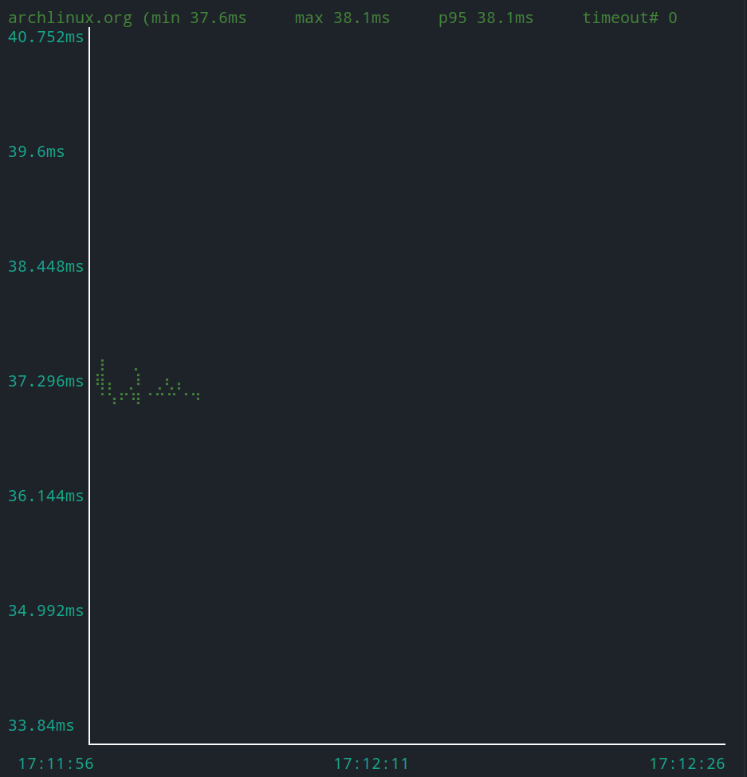
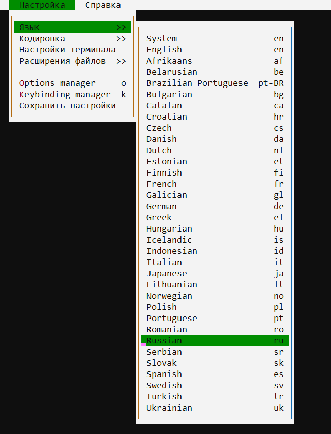
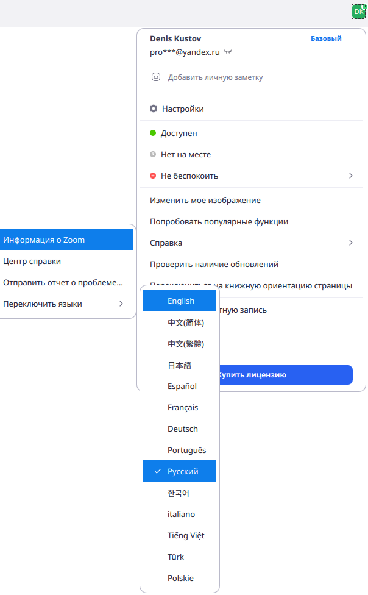

# Про интернет

Скачать

```bush
sudo pacman -Sy iproute
sudo pacman -Sy traceroute
sudo pacman -Sy arp-scan
sudo pacman -Sy mtr
sudo pacman -Sy ethtool
```

## Проверка маршрутизации

Посмотреть таблицу маршрутизации

```bush
route -n
```

```bush
netstat  -r
```

Посмотреть путь пакета [traceroute](https://losst.ru/komanda-traceroute-linux)

```bush
sudo traceroute <IP>
```

```bush
mtr -c <N> -b  <IP>
```

> `-c <N>` Количество запросов перед остановкой
> `-b` Показать ip и имя

Быстрая проверка доступа

```python
ping <IP>
```

Просмотреть все устройства подключенные к сети

```bush
sudo arp-scan  --interface=<ИМЯ_ИНТЕРФЕСА> --localnet
```

## Проверить сокеты

```bush
sudo pacman -Sy gnu-netcat
```

Клиент

```bush
nc 127.0.0.1 9092
```

Сервер

```python
nc -l -s 127.0.0.1 -p 9092
```

Посмотреть внешний ip

```bush
wget -O - -q icanhazip.com
```

## Порты `netstat`

Установка в `ArchLinux`

```bush
sudo pacman -S net-tools
```

Посмотреть открытые порты TSP

```bush
watch -d -n 2 netstat -nlpt
```

Перечислить все порты

```bush
netstat -a
```

> t = TCP
> u = UDP
> x = UDS

- `-l` = Показать только `LISTEN`
- `-s` = Посмотреть статистику порта
- `-p` = Выводит `PID` и имя файла использующий порт[]()

## Включить wifi

Посмотреть все устройства

```bush
ifconfig - a
```

Включить устройство

```bush
ifcofig <wlp30s> up
```

## Сетевая карта

[Посмотреть буфер сетевой карты](https://ittricks.ru/administrirovanie/linux/555/optimizaciya-setevoj-karty-pod-vysokuyu-propusknuyu-sposobnost)

Посмотреть возможные ошибки карты и отбрасывание пакетов

```bush
ip -s -s link show <ИНТЕРФЕЙС>
```

Посмотреть размер сетевой карты

```bush
ethtool -g <ИНТЕРФЕЙС>
```

> TX = Сколько используется
> RX = Сколько можно использовать

# Программы для сети

## `ufw` - фаервол

Установить `ufw`

```bush
sudo apt install ufw
```

|                                               |                                                          |
| --------------------------------------------- | -------------------------------------------------------- |
| `sudo ufw status verbose`                     | Посмотреть статус активности фаервола. `inactive` - выкл |
| `sudo ufw enable`                             | Включить фаервол                                         |
| `sudo ufw disable`                            | Выключить фаервол                                        |
| `sudo ufw reload`                             | Перезагрузить фаервол                                    |
| `sudo ufw reset`                              | Сбросить все настройки                                   |
| ---                                           | ---                                                      |
| `sudo ufw app list`                           | Посмотреть профили                                       |
| `sudo ufw app info <Профиль>`                 | Посмотреть настройки профиля                             |
| ---                                           | ---                                                      |
| `sudo ufw allow Port/Транспорт`               | Открыть указанный `tcp`/`udp` порт                       |
| `sudo ufw deny Port/Транспорт`                | Закрыть указанный `tcp`/`udp` порт                       |
| `sudo ufw allow out Port/Транспорт`           | Разрешить только исходящий трафик                        |
| `sudo ufw deny in Port/Транспорт`             | Запретить входящий трафик                                |
| `sudo ufw allow 20:22/tcp`                    | Открыть интервал портов (20,21,22)                       |
| `sudo ufw deny 20:22/tcp`                     | Закрыть интервал портов (20,21,22)                       |
| `sudo ufw allow <Профиль>`                    | Открыть порты указанные в профиле                        |
| `sudo ufw deny <Профиль>`                     | Закрыть порты указанные в профиле                        |
| ---                                           | ---                                                      |
| `sudo ufw delete <allow/deny> Port/Транспорт` | Удалить правило                                          |
|                                               |                                                          |

---

Перед тем, как мы перейдём к добавлению правил, необходимо указать политику по умолчанию. Какие действия будут применяться к пакетам, если они не подпадают под созданные правила ufw. Все входящие пакеты будем отклонять:

Все входящие пакеты будем отклонять

```bush
sudo ufw default deny incoming
```

А все исходящие разрешим:

```bush
sudo ufw default allow outgoing
```

---

### Создать профиль фаервола

Мы можем создать профиль, в нем будт указанны все порты которые нужно **открыть** или **закрыть**. Для этого:

1. Нужно в папке `/etc/ufw/applications.d` создать файл (профиль) с любым именем
2. В этом файле нужно обязательно указать следующий шаблон
    ```bush
    [<название_профиля>]
    title=<заголовок>
    description=<краткое описание>
    ports=<список портов>/<протокол>
    ```
    > Например:
    >
    > ```bush
    > [App1]
    > title=Text editor
    > description=Most popular open source application for editing text.
    > ports=53,80,5223,16393:16472/udp
    > ```

## `SSH`

[SSH](../Уроки/Блок6%20-%20Сети.md#SSH)

## `FTP`

[FTP](../Уроки/Блок6%20-%20Сети.md#FTP)

## `VNC` / `RDP` /

### VNC

Сервер [+](https://losst.ru/nastrojka-x11vnc-na-ubuntu):

- Установка:

| ОС     | Команда                   |
| ------ | ------------------------- |
| Ubuntu | `sudo apt install x11vnc` |
| Arch   | `sudo pacman -S x11vnc`   |

- Запустить сервер:
    ```bash
    x11vnc;
    ```

---

Клиент:

- Установить `KRDC`

## `TeamViewer`

[Скачать](https://www.teamviewer.com/ru/%d1%81%d0%ba%d0%b0%d1%87%d0%b0%d1%82%d1%8c/linux/)

---

Вариант для `Arch linux`

```bash
yay -S teamviewer
```

```bash
sudo systemctl start teamviewerd.service
```

## `Termshark` - перехватывать трафик

[Githab Termshark](https://github.com/gcla/termshark)

---

Установка:

- `Arch linux`
    ```bash
     sudo pacman -S termshark
    ```

---

## `gping` - визуализировать `ping`

[`GitHab` `gping`](https://github.com/orf/gping)

---

Установка:

- `Arch linux`
    ```bash
     sudo pacman -S gping
    ```

---

Использование

```bash
gping <Ip/Domen>
```



## Браузеры

### Яндекс браузер

Arch

```bush
yaourt -S yandex-browser-beta
```

Ubuntu Скачать с [ОФ сайта](https://browser.yandex.ru/beta/)

```bash
dpkg -i Файл.deb
```

---

Если не работает видео кодек, то [Про это](https://yandex.ru/support/browser-beta/working-with-files/video.html#problems__video-linux)

```bash
sudo apt install ffmpeg
sudo /opt/yandex/browser-beta/update-ffmpeg
```

### Elinks – Консольный браузер.

```bush
apt install elinks
```

Поменять язык интерфейса



Вставить URl из буфера

```python
Shift+ПКМ
```

Панель закладок

```bush
s
```

Поиск

```bush
/
```

## `qbittorrent` - Торрент клиент

## `Zoom`

[Скачать `zoom`](https://zoom.us/download?os=linux)

[Установка](https://support.zoom.us/hc/ru/articles/204206269-%D0%A3%D1%81%D1%82%D0%B0%D0%BD%D0%BE%D0%B2%D0%BA%D0%B0-%D0%B8%D0%BB%D0%B8-%D0%BE%D0%B1%D0%BD%D0%BE%D0%B2%D0%BB%D0%B5%D0%BD%D0%B8%D0%B5-Zoom-%D0%BD%D0%B0-Linux):

```bash
sudo apt install ./zoom_amd64.deb
```

---

Перевести интерфейс на русский язык


