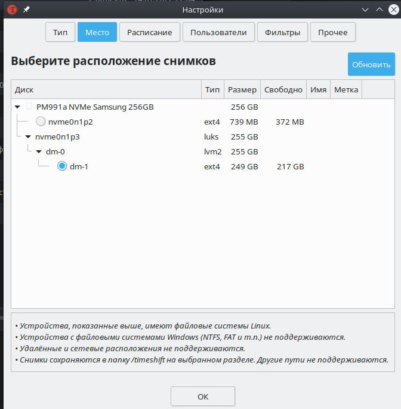
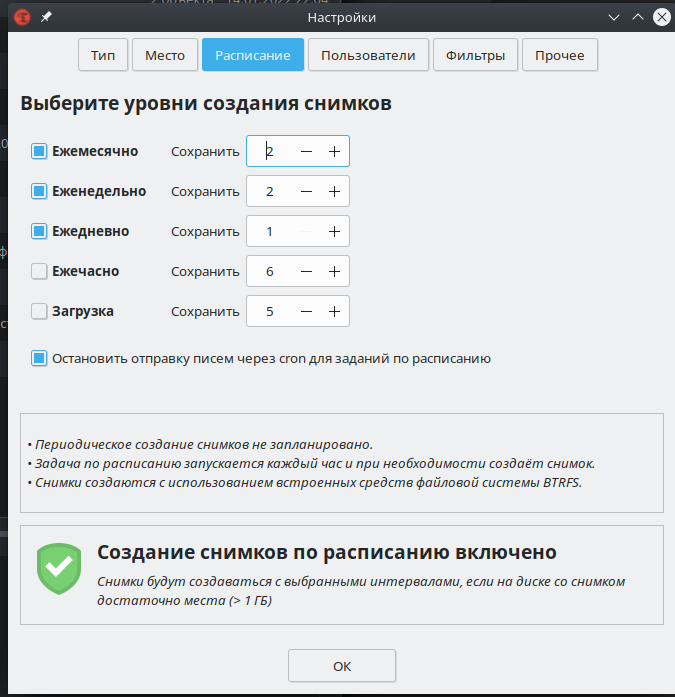
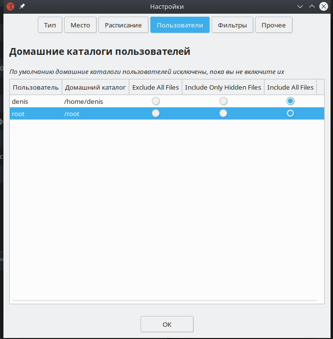

## Полезные сайты про Linux

[Man документация Api на русском](https://www.opennet.ru/man.shtml?topic=watch&category=1&russian=0)

[Много разных гайдов и команд Ubuntu](https://losst.ru/commands)

# Стартовая конфигурация

### Установка Пакетов

```bush
sudo apt update

sudo apt upgrade

sudo apt install neovim

sudo apt install htop

sudo apt install python

sudo apt install pip

sudo apt install virtualenv

sudo apt install mc

sudo apt install nano

sudo apt install elinks
```

### Настройка программ

Установить python3 по умолчанию

```bush
sudo ln -sfn /usr/bin/python3.8 /usr/bin/python
```

### Настройка `autocomplite`

sudo nano /etc/bash.bashrc

bash.bashrc

```bush
if ! shopt -oq posix; then
if [ -f /usr/share/bash-completion/bash_completion ]; then
. /usr/share/bash-completion/bash_completion
elif [ -f /etc/bash_completion ]; then
. /etc/bash_completion
fi
fi
```

## Локализация - Русский язык

Для локализации `linux` введите команду

```bash
sudo localedef ru_RU.UTF-8 -i ru_RU -fUTF-8 ; \
export LANGUAGE=ru_RU.UTF-8 ; \
export LANG=ru_RU.UTF-8 ; \
export LC_ALL=ru_RU.UTF-8 ; \
sudo locale-gen ru_RU.UTF-8 ; \
sudo dpkg-reconfigure locales
```

---

Посмотреть доступные языки

```bash
locale -a
```

## Тачпад - `tachpad`

- Скачиваем сервер(ядро) программы [Проект для настройки жестов тачпада](https://github.com/JoseExposito/touchegg#installation)

    Скачать расширенные драйвер для тачпада

    ```bash
    sudo apt install xserver-xorg-input-synaptics
    ```

    Скашиваем `touchegg`

    ```bash
    sudo add-apt-repository ppa:touchegg/stable;
    sudo apt update;
    sudo apt install touchegg flatpak;
    ```

    Скачать мои настройки тачпада. Настройки хранясь в файле `~/.config/touchegg/touchegg.conf`

    ```bash
    curl https://gist.githubusercontent.com/denisxab/2c3f1d5ac896c493674cb1628adfd305/raw/0c36c03b4accd6a9395183b644603713292e093a/touchegg.conf > ~/.config/touchegg/touchegg.conf
    ```

    Запускаем

    ```bash
    touchegg
    ```

---

- Скачиваем графический настройщик программы [Проект для графической настройки жестов `Touché`](https://github.com/JoseExposito/touche)

    Разрешить установку из `FlatpackHub`

    ```bash
    flatpak remote-add --if-not-exists flathub https://flathub.org/repo/flathub.flatpakrepo
    ```

    Скачиваем программу

    ```bash
    flatpak install flathub com.github.joseexposito.touche;
    ```

    Запускаем

    ```bash
    flatpak run com.github.joseexposito.touche;
    ```

---

## Стандартные комбинации клавиш в KDE

<table> <tbody> <tr> <td style="text-align: center;">Комбинация клавиш</td> <td style="text-align: center;">Значение</td> </tr> <tr> <td style="text-align: center;" colspan="2">Приложения</td> </tr> <tr> <td><strong>Meta+E</strong></td> <td>Запустить файловый менеджер</td> </tr> <tr> <td><strong>Print</strong></td> <td>Создать снимок активного экрана</td> </tr> <tr> <td><strong>Meta+Print</strong></td> <td>Создать снимок активного окна</td> </tr> <tr> <td><strong>Shift+Print</strong></td> <td>Создать снимок всех экранов</td> </tr> <tr> <td><strong>Meta+Shift+Print</strong></td> <td>Создать снимок выделенной области экрана</td> </tr> <tr> <td><strong>Alt+Space, Alt+F2</strong></td> <td>Открыть строку поиска и запуска KRunner</td> </tr> <tr> <td><strong>Alt+Shift+F2</strong></td> <td>Запустить команду KRunner из буфера обмена</td> </tr> <tr> <td><strong>Meta+Alt+S</strong></td> <td>Специальные возможности — включить/выключить чтение с экрана</td> </tr> <tr> <td style="text-align: center;" colspan="2">KDE Daemon</td> </tr> <tr> <td><strong>Ctrl+Alt+K</strong></td> <td>Переключиться между раскладками клавиатуры</td> </tr> <tr> <td><strong>Meta+P</strong></td> <td>Переключиться между экранами</td> </tr> <tr> <td><strong>Ctrl+Alt+T</strong></td> <td>Запустить эмулятор терминала</td> </tr> <tr> <td style="text-align: center;" colspan="2">kmserver</td> </tr> <tr> <td><strong>Meta+L, Ctrl+Alt+L</strong></td> <td>Блокировать сеанс</td> </tr> <tr> <td><strong>Ctrl+Alt+Del</strong></td> <td>Завершить сеанс</td> </tr> <tr> <td><strong>Ctrl+Alt+Shift+PgDown</strong></td> <td>Выключить компьютер без подтверждения</td> </tr> <tr> <td><strong>Ctrl+Alt+Shift+Del</strong></td> <td>Завершить сеанс без подтверждения</td> </tr> <tr> <td><strong>Ctrl+Alt+Shift+PgUp</strong></td> <td>Перезагрузить компьютер без предупреждения</td> </tr> <tr> <td style="text-align: center;" colspan="2">KWin</td> </tr> <tr> <td><strong>Alt+F3</strong></td> <td>Открыть меню действий с окном</td> </tr> <tr> <td><strong>Alt+F4</strong></td> <td>Закрыть окно</td> </tr> <tr> <td><strong>Ctrl+Alt+A</strong></td> <td>Активировать привлечение внимания к окну</td> </tr> <tr> <td><strong>Alt+Tab</strong></td> <td>Перейти на одно окно вперёд</td> </tr> <tr> <td><strong>Alt+</strong></td> <td>Перейти к следующему окну активного приложения</td> </tr> <tr> <td><strong>Alt+~</strong></td> <td>Перейти к предыдущему окну активного приложения</td> </tr> <tr> <td><strong>Alt+Tab</strong></td> <td>Перейти на одно окно вперёд</td> </tr> <tr> <td><strong>Alt+Shift+Backtab</strong></td> <td>Перейти на одно окно назад</td> </tr> <tr> <td><strong>Meta+Alt+Left</strong></td> <td>Переключиться на окно слева</td> </tr> <tr> <td><strong>Meta+Alt+Right</strong></td> <td>Переключиться на окно справа</td> </tr> <tr> <td><strong>Ctrl+n</strong>, где n — клавиша F1, F2, F3 или F4</td> <td>Переключиться на рабочий стол 1, 2, 3 или 4</td> </tr> <tr> <td><strong>Meta+F5</strong></td> <td>Переместить указателя мыши в видимую область экрана</td> </tr> <tr> <td><strong>Meta+F6</strong></td> <td>Переместить указателя мыши в центр экрана</td> </tr> <tr> <td><strong>Ctrl+F9</strong></td> <td>Показать все окна активного рабочего стола</td> </tr> <tr> <td><strong>Ctrl+F10</strong></td> <td>Показать все окна со всех рабочих столов</td> </tr> <tr> <td><strong>Ctrl+F8</strong></td> <td>Показать все рабочие столы</td> </tr> <tr> <td><strong>Ctrl+F7</strong></td> <td>Показать все окна одного класса</td> </tr> <tr> <td><strong>Meta+D</strong></td> <td>Показать рабочий стол</td> </tr> <tr> <td><strong>Alt+Shift+F12</strong></td> <td>Приостановить композитное расширение</td> </tr> <tr> <td><strong>Meta+W</strong></td> <td>Развернуть окно</td> </tr> <tr> <td><strong>Meta+Up</strong></td> <td>Развернуть окно в верхней половине экрана</td> </tr> <tr> <td><strong>Meta+Down</strong></td> <td>Развернуть окно на нижней половине экрана</td> </tr> <tr> <td><strong>Meta+Shift+Up</strong></td> <td>Развернуть окно на левой верхней четверти экрана</td> </tr> <tr> <td><strong>Meta+Shift+Down</strong></td> <td>Развернуть окно на правой нижней четверти экрана</td> </tr> <tr> <td><strong>Meta+Shift+Right</strong></td> <td>Развернуть окно на правой верхней четверти экрана</td> </tr> <tr> <td><strong>Meta+Shift+Left</strong></td> <td>Развернуть окно на левой нижней четверти экрана</td> </tr> <tr> <td><strong>Meta+Right</strong></td> <td>Развернуть окно на правой половине экрана</td> </tr> <tr> <td><strong>Meta+Left</strong></td> <td>Развернуть окно на левой половине экрана</td> </tr> <tr> <td><strong>Meta+Alt+Down</strong></td> <td>Свернуть окно</td> </tr> <tr> <td><strong>Meta+=</strong></td> <td>Увеличить размер окна</td> </tr> <tr> <td><strong>Meta+-</strong></td> <td>Уменьшить размер окна</td> </tr> <tr> <td><strong>Ctrl+Alt+Esc</strong></td> <td>Удалить окно</td> </tr> <tr> <td style="text-align: center;" colspan="2">Plasma</td> </tr> <tr> <td><strong>Ctrl+Alt+X</strong></td> <td>Включить действия с буфером обмена</td> </tr> <tr> <td><strong>Ctrl+Alt+R</strong></td> <td>Выбрать действие с буфером обмена вручную</td> </tr> <tr> <td><strong>Meta+Q</strong></td> <td>Показать список рабочих пространств (комнат)</td> </tr> <tr> <td><strong>Meta+Tab</strong></td> <td>Перейти на одну комнату вперёд</td> </tr> <tr> <td><strong>Meta+Shift+Tab</strong></td> <td>Перейти на одну комнату назад</td> </tr> <tr> <td><strong>Meta+n</strong>, где n — число от 1 до 9 либо 0</td> <td>Открыть 1-ю, 2-ю, 3-ю, 4-ю, 5-ю, 6-ю, 7-ю, 8-ю, 9-ю либо 10-ю кнопку на панели задач</td> </tr> <tr> <td><strong>Ctrl+F12</strong></td> <td>Показать рабочий стол</td> </tr> <tr> <td><strong>Meta+S</strong></td> <td>Выйти из текущей комнаты</td> </tr> <tr> <td><strong>Alt+F1</strong></td> <td>Сделать виджет «Меню запуска приложений» активным</td> </tr> </tbody> </table>

# Про ядро Linux

## Переменные окружения

Прочитать переменную окружения

```bush
echo $<NAME>
```

Вывести все переменные окружения

```bush
printenv
```

---

**Переменные окружения могут устанавливаться на разных уровнях**

1. Системный уровень (Виден всем)

```bush
sudo vim /etc/environment
```

2. Пользователя (Доступна Пользователю)

Изменить переменные окружения в файле

```bush
sudo vim ~/.zshrc
```

или

```bush
sudo vim ~/.bash
```

> `export <NAME> = <VAL>`

3. Сеанс (Доступен только в сиссе после перезагрузки преподаёт)

```bush
export <NAME> = <VAL>
```

## Клавиши

Поиск команды. Можно нажать стрелку в право, чтобы редактировать ее.
Можно нажать еще раз эту комбинацию и перейти к новому варианту

```bush
ctrl + r
```

Отменить изменение команды

```bush
alt + r
```

Дополняет прошлую команду к текущей

```bush
!!

______________
apt install vim
sudo !!
```

Написать и исполнить последнюю команду

```bush
ctrl + p
ctrl + o
```

Переместить курсор

```bush
crtl + a | home = Начало
ctrl + e | end = Конец
```

Вырезать текст

```bush
ctrl + u
```

Вставить текст

```bush
ctrl + y
```

## Режим консоли

Console

```bush
ctrl+ alt + f2

alt + < = Навигация между консолями
```

Gui

```bush
ctrl+ alt + f7 - Gui
```

Установка чего-либо должна выполняться с помощью apt (хотя с терминала у вас может быть терминал, нажав ctrl + alt + F1, чтобы перейти в режим без графического интерфейса, нажмите ctrl + alt + F7, чтобы вернуться на рабочий стол, эти ярлыки переключаются между что Linux называет pty) [+](https://forums.puri.sm/t/unable-to-install-terminal-command-line/2427)

## Запуск программы в фонов режиме

[https://1cloud.ru/help/linux/linux_zapusk_komand_fonovom_rezhime](https://1cloud.ru/help/linux/linux_zapusk_komand_fonovom_rezhime)

Пример запуска программы — нужно добавить в конец команды &

```bush
python main.py &
```

|                   |                                       |
| ----------------- | ------------------------------------- |
| `jobs –l`         | Показать запущенные процессы с их PID |
| `kill [PID_ID]`   | Закрыть процесс                       |
| `fg [INDEX_Jobs]` | Перейти к процессу                    |
| `Сtr+z`           | Выйти из процесса и приостановить его |
| `bg [INDEX_Jobs]` | Восстановить работу процесса          |

# Пользователи

## Общее, Создание, Удаление

Флаги к файлам

|     |     |                       |
| --- | --- | --------------------- |
| r   | 4   | Чтение                |
| w   | 2   | Запись/Редактирование |
| x   | 1   | Исполнение/Просмотр   |

Полномочия к файлам

```bush
rwx rwx rwx
```

- Владелец
- Группа
- Другие

---

- Узнать какой сейчас выбран пользователь

    ```bush
    whoami
    ```

- Узнать группу пользователя

    ```bush
    id ИмяПользователя
    ```

- Посмотреть активных пользователей

    ```bush
    w
    ```

    > ```bush
    >  16:01:09 up  2:05,  5 sudo useraddusers,  load average: 0,74, 1,03, 1,01
    > USER     TTY        LOGIN@   IDLE   JCPU   PCPU WHAT
    > denis    tty1      15:25    5:06m  5:08   0.07s /usr/bin/startplasma-x11
    > denis    pts/0     15:25   35:31   0.00s  2.72s /usr/bin/kded5
    > denis    pts/1     15:25    1.00s  1.69s  0.01s w
    > denis    pts/4     14:53    1:07m  0.00s  0.00s -bash
    > denis    pts/5     15:59   33.00s  0.33s  0.08s ssh denis@84.201.150.205
    > ```

- Посмотреть подробную информацию о всех пользователей

    ```bush
    cat /etc/passwd
    ```

    > Посмотреть соль от поролей пользователей.[+](https://andreyex.ru/linux/ponimanie-fajla-etc-shadow/) знаки ` !``* ` указывают что у пользователя нет пароля
    >
    > ```bush
    > cat /etc/shadow
    > ```

- Посмотреть только имена всех пользователей

    ```bush
    sed 's/:.*//' /etc/passwd
    ```

- Посмотреть историю входов пользователей

    ```bush
    last -a
    ```

- Посмотреть историю выходов

    ```bush
    lastlog
    ```

---

- Создать пользователя, `-m` создать папку в `/home/` для нового пользователя

    ```bush
    sudo useradd -m ИмяПользователя
    ```

    > В папке `cd /etc/skel` находится шаблон, который добавить в домашнюю директорию нового пользователя. М можем изменить этот шаблон

- Установить пароль для пользователя

    ```bush
    sudo passwd ИмяПользователя
    ```

- Войти в профиль пользователя

    ```bush
    su ИмяПользователя
    ```

- Удалить пользователя. Флаг `-r` удалит все файлы пользователя

    ```bush
    sudo userdel ИмяПользователя
    ```

---

## Права доступа

- Сменить права доступа

    ```bush
    sudo chmod <777> <Файл/Папка>
    ```

    `<777>` - Код достпуности
    `-R` выполнить в рекурсивном режиме, для всех файлов в и папок в деректории

- Сменить пользователя и группу

    ```bush
    sudo chown <Пользователь>:<Группа> <Файл/Папка>
    ```

    `-R` выполнить в рекурсивном режиме, для всех файлов в и папок в директории

# Безопасность системы

## Бекабы система Linux

[Статья про это](https://losst.ru/rezervnoe-kopirovanie-ubuntu)

### Архивирование

Создать архив с системой

```bash
sudo tar czf /backup.tar.gz --exclude=/backup.tar.gz --exclude=/home --exclude=/media --exclude=/dev --exclude=/mnt --exclude=/proc --exclude=/sys --exclude=/tmp /
```

### `Timeshift`

Для бекапов будем использовать программу `Timeshift` установить:

```bash
sudo apt install timeshift
```

---

Восстановление системы через консоль:

- Все бекап хранятся по пути `/run/timeshift/backup/timeshift/snapshots/`
- .html>)
- Выбираем бекап (Вводим индекс бекапа)

    ```bash
    sudo timeshift --restore
    ```

- Выбираем кокой диск мы хотим восстановить

    ```bash
    Select GRUB device:
    Num     Device  Description
    ------------------------------------------------------------------------------
    0    >  sda     ATA WDC_WD7500AZEX-00RKKA0 [MBR]
    1    >  sda1     ext4, 110.1 GB GB
    2    >  sda2     ext4, 640.1 GB GB
    [ENTER = Default (/dev/sda), a = Abort]
    Enter device name or number (a=Abort):
    ```

---

Создать бекап система

```bash
timeshift-launcher
```

- 
- Настройки `Timeshift`
    - 
    - 
    - 
    - 

# Служба автозапуска Linux

## `systemctl`

| Команда                                    | Описание                                  |
| ------------------------------------------ | ----------------------------------------- |
| `sudo systemctl enable имя_службы`         | Добвить службу в автозапуск               |
| `sudo systemctl disable имя_службы`        | Удалить службу из автозапуска             |
| `sudo systemctl is-enabled httpd`          | Проверить включена ли служба в автозапуск |
| `systemctl list-unit-files ǀ grep enabled` | Посмотреть весь список включенный служб   |
| `sudo systemctl daemon-reload `            | Перезагрузить все службы                  |

# Настройки `Desktop`

## Настройки экрана

### Ночной свет

https://www.reddit.com/r/ManjaroLinux/comments/drcimv/kde_night_color_not_working/

Настройки ночного света храниться в файле `~/.config/kwinrc`

## `.desktop` файл

Файлы `.desktop` должны храниться в папке `/usr/share/applications/`

`onlyoffice.desktop`

```bash
[Desktop Entry]
# Тип
Type=Application
# Версия спецификации записи рабочего стола, которой соответствует данный файл
Version=1.0
# Имя файла
Name=Onlyoffice
# Комментарий, который может/будет использоваться в качестве всплывающей подсказки
Comment=Офис
# Путь к папке, в которой запускается исполняемый файл
Path=/snap/bin/
# Исполняемый файл приложения, возможно, с аргументами.
Exec=onlyoffice-desktopeditors
# Путь к иконки, который будет использоваться для отображения этой записи
Icon=/home/denis/Изображения/offise.png
# Описывает, нужно ли запускать это приложение в терминале или нет
Terminal=false
# Описывает категории, в которых должна быть показана данная запись
Categories=Education;Languages;Java;
```
