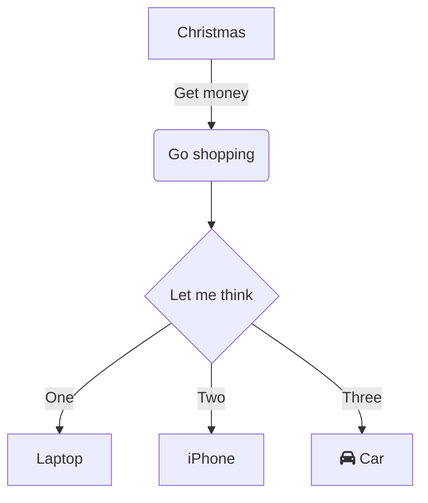
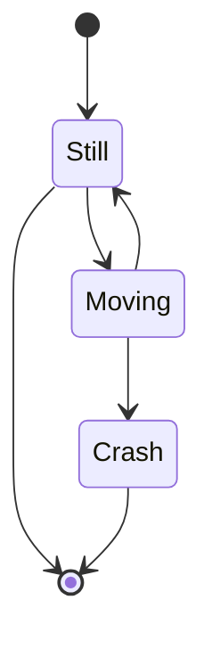
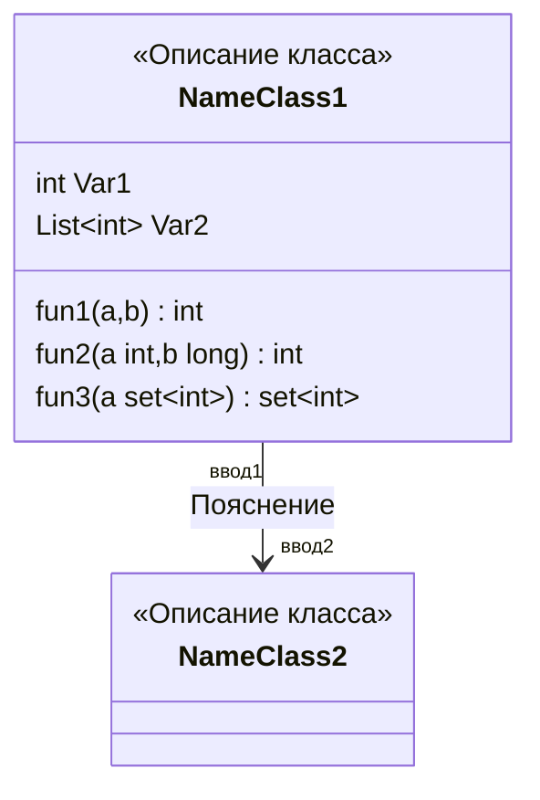

# 1

## 2

### 3

#### 4

##### 5

###### 6

# Стиль текста, смайлик, циаты

**Жирный шрифт** <br/>
_Курсивный щрифт_ <br/>
**_Курсивный и жирынй щрифт_** <br/>
~~Зачеркнтый текст~~ <br/>
<mark>Выделение цветом</mark> <br/>
%%Коментарий который не отображаеться%%

## Разместить смайлик

[Список эмодзи](https://github.com/GnuriaN/format-README/blob/master/emoji.md)
:white_check_mark:

## Пример оформления цитат

> 1 lvl
>
> > 2 lvl
> >
> > > 3 lvl

---

# Пример оформления кода

## Фрагмента в тексте

Оформление кода `x+2-1`

## Пример оформления участка кода

```python
class TTT:

    def __init__(self):
        configText = print("documents/testName/testName.txt")
        rConfigText = configText.readFile(encoding="utf-8")

        self.parser(rConfigText)

    def parser(self, rConfigText: str):
        beginTag: bool = False
        endTag = 0
        res: str = ""
        buff: str = ""
        for symbol in rConfigText:

            if symbol == "%":
                beginTag = True
            if beginTag and symbol == "\\":
                beginTag = False
            if beginTag:
                buff += symbol
if __name__ == '__main__':
    TTT()
```

---

# Пример оформления списка

## Ненумерованный список

    Ставить 2 пробела

- 1
- 2
    - 2.1
        - 2.1.1
    - 2.2
- 3
    - 3.1
    - 3.2

## Нумерованы список

    Ставить 4 пробела

1. 1
2. 2
    1. 2.1
        1. 2.1.1
3. 2
4. 2
5. 2

## Разделить списки

    Ставить разные знаки перед значением

- 1
- 2
- 3

- 1
- 2
- 3

## Список задач

- [x] Учить .md

    - [ ] ВУчить .md
    - [x] Уычить .md

- [ ] Учить Go
- [ ] Учить C++

---

# Ссылки

## Ссылка на внешние ресурсы

[Урок по Markdown](https://www.youtube.com/watch?v=NXNf9aYTCZ0)

## Внутрення ссылка на файлы

[Внутрення ссылка на файл](../../Python/Pycharm/Pycharm.md)

## Вынесение url ссылки

Благодаря Markdown разработчики могу писать красиво оформленную и удобную в использовании документацию в любом удобном редакторе. Причём хранить эту документацию можно прямо в репозитории с исходным кодом. И самое главное - [GitHub][1], GitLab, BitBucket и прочие хостеры исходного кода имеют средства для отображения Markdown разметки в виде H

[1]: (https://www.youtube.com/)

## Сноски в тексте которая будет в конце файла

Благодаря Markdown разработчики могу писать красиво оформленную и удобную в использовании документацию в любом удобном редакторе. Причём хранить эту документацию можно прямо в репозитории с исходным кодом. И самое главное - GitHub[^1], GitLab, BitBucket и прочие хостеры исходного кода имеют средства для отображения Markdown разметки в виде H

[^1]: Это сноска

## Ссылка на дргую секцию внутри .md

Пример использование ссылки в тексте для перехода в другую главу [раздл Добавить вложения](#Добавить\вложения)

## Рендерить ссылки на внешние сайты

<iframe src="https://www.google.com" 
		 width="800" height= "400"
		></iframe>

---

# Добавить вложения

## Image


## Изменить размер изображения


## Пример GIF


## Пример Видео

[](https://www.youtube.com/results?search_query=pyqt5&sp=EgIQAw%253D%253D)

```
<iframe src="https://www.youtube.com/results?search_query=pyqt5&sp=EgIQAw%253D%253D"
		 width="800" height= "400"
		></iframe>
```

## Добавить шилдик

[Cсылка на сайт создания шилдиков](https://img.shields.io/appveyor/build/wqe/we)


---

# Таблицы

[Ссылка на онайлн редактор таблиц](https://www.tablesgenerator.com/markdown_tables)

## С заголовками

| Left | Center | Right |
| ---- | ------ | ----- |
| Left | Center | Right |
| Left | Center | Right |
| Left | Center | Right |
| Left | Center | Right |

## Выравнять текст в таблице

    Нужно поставить двоеточие

| Left                |      Center       |             Right |
| :------------------ | :---------------: | ----------------: |
| Left                | Centeasdasdasdasr |             Right |
| Lasdasdasasdasddeft |      Center       |             Right |
| Left                |      Center       |             Right |
| Left                |      Center       | Rigasdasdasdasdht |

---

# Mermaid

[Ссыкла на сайт онлайн редактирвоание](https://mermaid-js.github.io/mermaid-live-editor/edit#eyJjb2RlIjoiZ3JhcGggVERcbiAgICBBW0NocmlzdG1hc10gLS0-fEdldCBtb25leXwgQihHbyBzaG9wcGluZylcbiAgICBCIC0tPiBDe0xldCBtZSB0aGlua31cbiAgICBDIC0tPnxPbmV8IERbTGFwdG9wXVxuICAgIEMgLS0-fFR3b3wgRVtpUGhvbmVdXG4gICAgQyAtLT58VGhyZWV8IEZbZmE6ZmEtY2FyIENhcl1cbiAgIiwibWVybWFpZCI6IntcbiAgXCJ0aGVtZVwiOiBcImRlZmF1bHRcIlxufSIsInVwZGF0ZUVkaXRvciI6dHJ1ZSwiYXV0b1N5bmMiOnRydWUsInVwZGF0ZURpYWdyYW0iOnRydWV9) Нужно вставлять текст сочетание клавишь `Ctr+Shift+V` чтобы не форматировать текст

## Графы





### `classDiagram`



---

# Раскрывающейся объект

## Текст

<details><summary>Свернутый текст</summary>

```python
class TTT:

    def __init__(self):
        configText = print("documents/testName/testName.txt")
        rConfigText = configText.readFile(encoding="utf-8")

        self.parser(rConfigText)

    def parser(self, rConfigText: str):
        beginTag: bool = False
        endTag = 0
        res: str = ""
        buff: str = ""
        for symbol in rConfigText:

            if symbol == "%":
                beginTag = True
            if beginTag and symbol == "\\":
                beginTag = False
            if beginTag:
                buff += symbol
if __name__ == '__main__':
    TTT()
```

</details>

<details><summary>Свернутый текст</summary>
<pre>
```bush
If you come from bash you might have to change your $PATH.
export PATH=$HOME/bin:/usr/local/bin:$PATH
#
Example aliases
alias zshconfig="mate ~/.zshrc"
alias ohmyzsh="mate ~/.oh-my-zsh"
```
</pre>
</details>

## Изображени

<details><summary>Настройить 
	отображение по нажатию горячей клавиши</summary>


</details>

---

| name | id  | count |
| ---- | --- | ----- |
| cro  | 330 | qdqd  |
|      |     |       |

---

---

---

---

---

---

---

---

---

---

---

---
