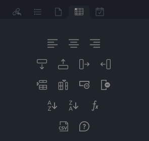
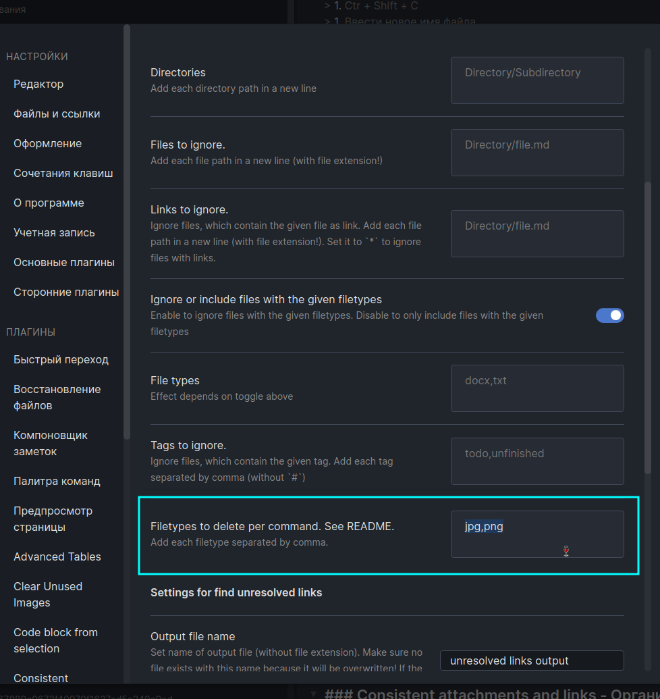
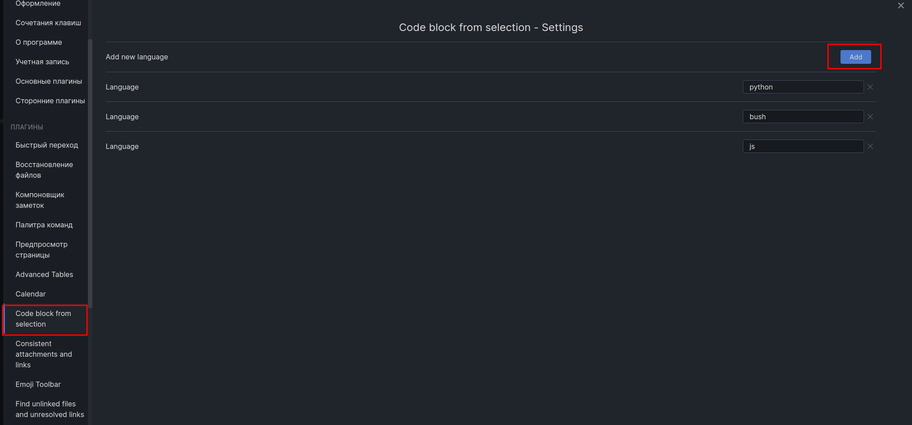
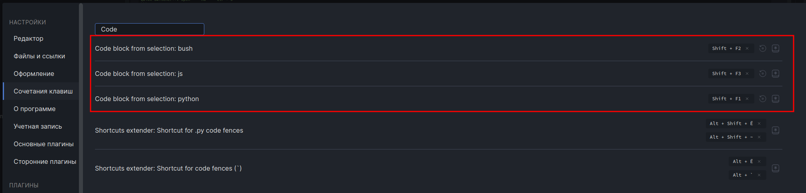
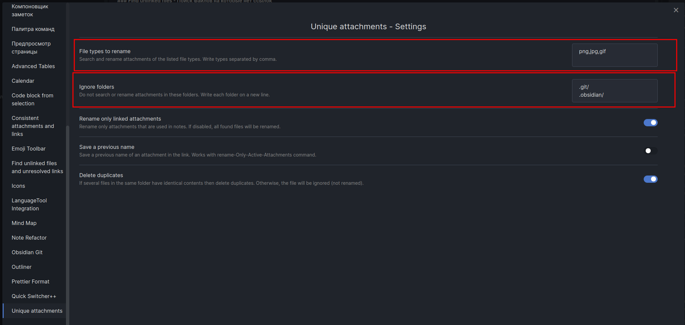
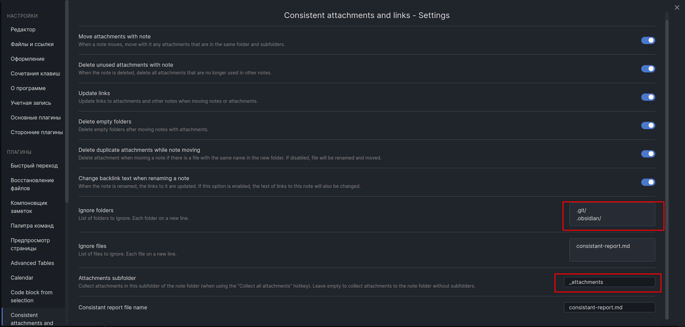
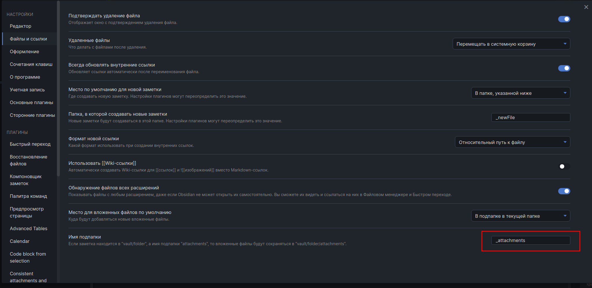
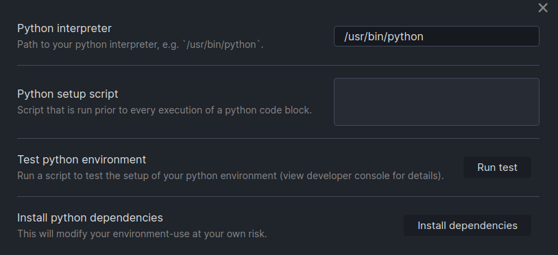

## Гайд по Obsidian

- [Плейлист: Курс по Obsidian (1/8): Введение в Markdown](https://www.youtube.com/watch?v=aeebp25l9Gg&list=PLrRc3UisLr6KVOYhzpSnywtHkCi2PEza5)
- [Текстовый вариант гайда](https://github.com/derwish-pro/obsidian-wiki/)
- [Скачать obsidian](https://obsidian.md/)
- [Marckdown Online](https://dillinger.io/)

---

## Горячими клавиши

Переключение значения в -[ ] -[ x ]

```bush
 Ctrl + Enter
```

> Toggle checklist status

Удалить абзац

```bush
Ctrl + D
```

> Удалить абзац

Настроить форматированное отображение по нажатию горячей клавиши

```bush
 Ctrl + Q
```

> Toggle edit/preview mode

При зажатии `Ctrl` + нажать на вкладку откроется окно синхронного отображения

```bush
 Ctrl + Нажать на кнопку
```

> 

Переключиться на другой файл

```bush
Ctrl + 0
```

Вставить текст не форматируя

```bush
Ctrl + Shift + V
```

Мульти курсор

```bush
Alt+ЛКМ
```

Создать/убрать Список

```bush
Ctrl + -
```

Создать/убрать Нумерованный список

```bush
Ctrl + +
```

Todo

```bush
Ctrl + Enter (2 раза)
```

Вынесете выделенного текста в другой файл

```bush
Ctrl+Shift+C
```

Вернуться назад после перехода по ссылки

```bush
Alt + <
Alt + >
```

Показать положение файла в менеджере файлов

```bush
Ctrl + ]
```

---

## Плагины

### Advanced Tables - создание таблиц

Напечатать <|> потом нажать Tab или Enter

> 

### Mind Map - отображение структуры файла

```bush
Mind map: Preview the current note as a Mind Map
```

### Emoji Toolbar - Вставлять эмодзи

```bush
Emoji Toolbar: Open emoji picker
```

### Shortcuts Extender - Изменять заголовки горячее клавишами

```bush
Ctrl + 1...6
```

### Prettier - Авто форматирование текст

```bush
Prettier Format: Format the entire note
```

> ```bush
> Alt + L
> ```

### LanguageTool - Проверка орфографии

Установить авто проверку слов


Проверить принудительно документ

```bush
LanguageTool Integration: Check Text
```

### Obsidian Git - Работа с git

Лучше сначала проинициализировать хранилище через консоль [Git](../Знания/Git.md) сделать commit, соединиться с сервером GitHab, сделать push, проверить что все работает, а Потом уже использовать команды плагина через Ctr+P

```bush
git init
git add *
git remote add origin <https://<user_name>:<token>@github.com/<user_name>/<Проект>>
git push -u origin master
```

Сделать`Push`

```bush
Obsidian Git: Create backup
```

### Note Refactor - Вынесение строчек в отдельный файл

1. Выделить фрагмент текста и нажать
2. Ctr + Shift + C
3. Ввести новое имя файла

### Quick Switcher - Навигация по заголовкам через окно быстрого перехода файлов

Нужно будет снять горячую клавишу с обычного быстрого перехода, и переназначить ее для функции

```bush
Quick Switcher++: Open   = На =   Ctr + O
```

Вот таким синтаксисам искать заголовок

```bush
@ <NameSabjec\>
```

### Find unlinked files - Поиск файлов на которые нет ссылок

Плагин нужен, чтобы найти бесполезных файлы на которые уже нет ссылок. **Например**, изображения на которые не кто не ссылаться

```bush
Find unlinked files and unresolved links: Find unlinked files
```

Удалить файлы определенного расширения если на них нет ссылок<

```bush
Find unlinked files and unresolved links: Delete unlinked files with certain extension. See README
```

Указать какой формат файлов можно удалять, если на него нет ссылке.


### Code block from selection - Вставить блок кода

Можно создать свои шаблоны для фрагментов кода


Теперь нужно назначить горячие клавиши


### Unique attachments - Переименовывать вложение по имени хеш функции

Переименовывает файлы с расширением **.png .jpg .gif** Плюс удаляет дубликаты

```cmd
Unique attachments: Rename all attachments
```



1. Файлы какого типа нужно переименовывать
2. Какие папки нужно игнорировать

### Consistent attachments and links - Организовать правильно скрутку проекта

Назначить имя папки в которой будут храниться файлы/фото

- 
- 

Получить полный отчет о состояние хранилища

```python
Consistent attachments and links: Check vault consistent
```

| Команда                                                                       | Описание                               |
| ----------------------------------------------------------------------------- | -------------------------------------- |
| `Consistent attachments and links: Replace all wikilinks with markdown links` | Изменить все Wiki ссылки на нормальные |
| `Consistent attachments and links: Convert all embed paths to relative`       | Изменить пути на относительные         |
| `Consistent attachments and links: Convert all link paths to relative`        | Изменить ссылки на относительные       |
| `Consistent attachments and links: Delete empty folders`                      | Удалить пустые папки                   |
| `Consistent attachments and links: Reorganize vault`                          | Настройка путей                        |

[Документация Consistent attachments and links ](https://github.com/derwish-pro/obsidian-consistent-attachments-and-links)

### Copy button for code - Копировать код

[Code block copy](https://github.com/jdbrice/obsidian-code-block-copy)

### Outliner - Перемещение элементов списка

```bush
shift + V (стрелка)
shift + ^ (стрелка)
```

### Editor Syntax Highlight - Раскраска текста

### Paste URL into selection - Вставить ссылку

1. Выделить текст
2. Нажать `Cntl+V`

### Remember cursor position - Запомнить положение курсора в файле

### Limelight - Выделить активный файл

### Obsidian Tabs - Вкладки

### Hotkey Helper - Помощник по горячим клавишам

[Hotkey Helper](https://github.com/pjeby/hotkey-helper)

### Jupyter - Python

1. `python -c 'import sys; print(sys.executable)'`
2. `pip install jupyter --upgrade`
3. 

### Obsidian Footnotes - сноски текст

[Footnotes](https://github.com/akaalias/obsidian-footnotes)

Установить горячую клавишу

```bash
Footnote Shortcut  = Alt+F1
```

### `Pandoc` - экспорт в различные форматы

Для корректной работы плагина нужно установить программу `pandoc`. [Скачать программу](https://github.com/jgm/pandoc/releases/tag/2.17.0.1)

```bash
sudo dpkg -i  $Программа$
```

---

Использование `Ctl+P`

```bash
Pandoc
```

## Настройки

### Использовать относительный путь к файлам


### Перенести настройки из одного хранилища в другое

В каждом хранилище есть папка .`.obsidian` в ней лежат все настройки. Поэтому если нужно перенести настройки из одно хранилища в другое то нужно **скопировать с заменой** эту папку

### Добавить оглавления к документам


### Форматировать текст по санитарным отступам


### Перевести на русский язык интерфейс


### Настроить по умолчанию место для вложений

> \_attachments
>
> 

## Фишки Obsidian

### Изменять размер изображения в Obsidian

`![Title |800x300]`


### Тема оформления

> Obsidian Nord

### Ссылки на файлы и заголовки

[Источник](https://help.obsidian.md/How+to/Internal+link)

- Для того чтобы создать ссылку на файл нужно ввести две квадратные скобки `[[` и выбрать файл.
- Для того чтобы создать ссылку на заголовок нужно ввести две квадратные скобки и символ решётке `[[#` и выбрать главу
- Для того чтобы можно было обратиться к главе в другом файла введите `[[` выберете нужный файл, стрелками нажмите `#` и у вас будет предложения из заголовков указанного файла

**Внимание для того чтобы имена файлов и заголовков изменялись и в ссылках нужно переименовывать их через стандартные инструменты, а не просто изменить ввести другое имя - в этом случае ссылки не обновят имя и будут не действительными**
