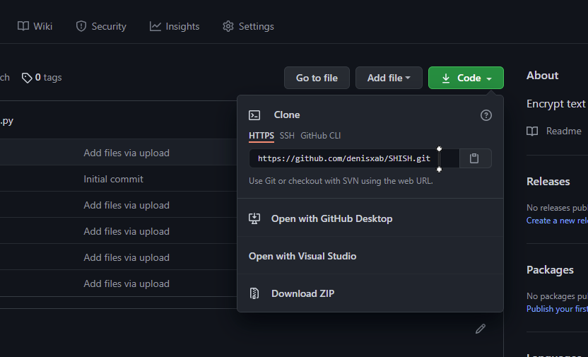

## Общее

### Источники

[Скачать Git](https://git-scm.com/)

[Урок по Git 1](https://www.youtube.com/watch?v=zZBiln_2FhM)

[Урок по Git 2](https://www.youtube.com/watch?v=SEvR78OhGtw)

### Инициализация репозитория

```-
git int
```

### .gitignore

> Оформляться

```-
/Folder – вся папка игнорируеться
file.txt – файл игнорируеться
/Folder/file.png – вложенный файл игнорируретсья
```

> Потом нужно добавить .gitignore в отслеживание

```-
git add .gitignore
```

---

## Состояние репозитория

### Статус репозитория в ветке

```-
git status
```

<details><summary>Подробности вывода</summary>

> On branch master – **Имя ветки**

> No commits yet – **Количество комитов**

> Changes to be committed: - **Фалы, которые отлёживаются**

> Changes not staged for commit: **Файлы были изменены**

> Untracked files: - **файлы которые НЕ отслеживается**

</details>

### Посмотреть историю commit

```-
git log
```


> Origin/master – **Commit на сервере**

> Head -> Name **Выбранный в данный момент commit**

> new_branch – **Ветки указывающие на commit**

### Показать конкретные изменения в ветки

```-
git diff
```

### Добавить файл в отслеживания

```-
git add <Nmae_File>
```

### Убрать файл из отслеживания

```-
git rm --cached <Name_File>
```

### Откатить ветку на прошлый commit

Откатить _**modified**_ файл на прошлый Commit

```-
git restore <NameFile>
```

Откатить _**committed**_ файл на прошлый Commit

```-
git restore --staged <NameFile>
```

## Работа с файлами

> При использовании этих команд происходит авто добавление в индекс

### Переместить файл

```-
git mv <new_file.txt> <Folder/>
```

### Переименовать файл

```-
git mv <new_file.txt> <NewFile.txt>
```

### Удалить файл

```-
git rm <NameFile.bmp>
```

- Удалить файл из отслеживания, но оставить его локально

    ```-
    git rm --cached <NameFile>
    ```

## Операции с Ветки

### Создать ветку

- Создать новую ветку

    ```-
    git branch <Name_Branch>
    ```

- Создать новую ветку и сразу переключиться на нее

    ```-
    git checkout -b <new_branch>
    ```

- Создать новую ветка на определенном коммите

    ```-
    git checkout -b <new_branch>
    ```

### Удалить ветку

- Удалить ветку – удалиться только если эта ветка слита с другой – **безопасное** удаление

    ```-
    git branch -d <test>
    ```

- Удалить ветку в **любом** случае
    ```-
    $ git branch -D <test>
    ```

### Навигация по веткам

- Посмотреть список веток

    ```$
    git branch
    	* master - Выбранная ветка
    	  test
    ```

- Переключиться на другую ветку

    ```$
    git checkout <test>
    ```

### Слияние веток Merge

1.  **Выбираем** ветку в которую нужно добавить код

    ```$
    git checkout <LastBranch>
    ```

2.  Соединяем **Измененную ветку** с, **Вибронной**

    ```$
    git merge <NewBranch>
    ```

### Commit

```-
git commit -am ”Сообщение о коммите”
```

### Push

```$
git push -u origin master
```

> origin - это новое имя удаленно сервера
>
> master – имя втеки удаленного сервера

### Pull

```$
git pull <origin> <master>
```

> origin - из сервера
>
> master – из ветки на сервере ветку

## Работа с GitHub

### Авторизоваться

> Нужно создать конфигурацию если ее нет

- Создать конфигурацию | Изменить

    ```$
    git config --global user.name “denis”
    git config --global user.email “denis@kustov.com”
    ```

- Посмотреть конфигурацию
    ```-
    git config user.name
    git config user.email
    ```

### Добавить данные о репозитории GitHub

Создать папку для синхронизации

```bush
git remote add origin <https://github.com/denisxab/TestGit.git>
```

> origin - любое имя папки
> 

Посмотреть Remote

```bush
git remote -v
```

> origin https://github.com/denisxab/TestGit.git (fetch) - для чтения
>
> origin https://github.com/denisxab/TestGit.git (push) - для записи

Заменить URL в `remote`

```bush
git remote set-url <origin> <url>
```

URL формируется по правилу

```bush
https://<user_name>:<token>@github.com/<user_name>/<Проект>
```

> `https://denisxab:<token>@github.com/denisxab/mydoc.git`

## Pychram Git

### Подготовка

- Включить контроль версий
    > 
- Создаем .gitignore для исключения пуша файлов
    > 
- Добавить отслеживание изменений фалов
    >  >  > 
- Если надо, то войти в запись git
    > 
- Добавляем ссылку репозитория

    > 

- Получить URL и вводим
    > 
- Нужно создать ветку вспомогательную ветку

> 
>
>     После нужно пройти регистрацию на jlbreains
>     Потом на git создастся ветка master в которой будут писаться изменения

- Можно посмотреть изменения в файле
    > 

### Слияние веток

1. Делаем commit на вторичную ветку

2. Делаем push на вторичную ветку

3. Выбираем первичную ветку


4. Делаем слияние со вторичной веткой


5. Делаем push первичной ветки

### Конфликт слияния веток


>     Два раза нажимаем на файл
>     И выбрать какие значения принять в результате

### Посмотреть commit


### Откатить ветку


### Принудительное слияние веток

```cmd
git merge master --allow-unrelated-histories
```
