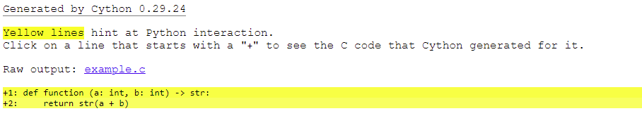
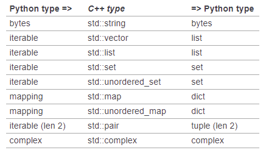

# Установка Cython

1. Иметь компиллятор.
    > `gcc` для Linux
    >
    > `mingw` для Windows (И добавить в переменные окружения `Path` = `C:\MinGW\bin`)
    > для проверки правильности введите в консоль `gcc --version`
2. Установить `cython`

```bush
pip install cython
```

# Скомпилировать Cython

## Приготовления

Рекомендую создавать отдельный пакет для модулей `Cython` например назвем его `cpp`.

Иерархия до компиляции

- MainProj
    - cpp
        - setup.py
        - test_c.pyx
    - main.py

Иерархия после компиляции

- MainProj
    - cpp
        - build
            - lib.linux-x86_64-3.9
                - test_c.cpython-39-x86_64-linux-gnu.so
            - temp.linux-x86_64-3.9
                - test_c.o
        - test_c.c
        - test_c.cpython-39-x86_64-linux-gnu.so
        - setup.py
        - test_c.pyx
    - main.py

`setup.py` в нем пишутся правила компилляции.
Пример:

```python
from Cython.Build import cythonize
from setuptools import setup, Extension

extensions = [
	# Можно указывать несколько файлов для компиляции
	Extension(
		'test_c',  # Имя файлов после компиляции
		sources=['test_c.pyx']  # Пути к файлам для компиляции
	),
]

setup(
	ext_modules=cythonize(
		extensions,
		annotate=True,  # True чтобы был .html файл с показанием зависимости от python
	)
)
```

> `annotate=True` >  > [Все параметры cythonize](https://cython.readthedocs.io/en/latest/src/userguide/source_files_and_compilation.html#cythonize-arguments)

## Варианты компиляции

Команда для компилляции в `.pyd` или `.so` через `setup.py`. В итоги нам нужен будет только `cpp/test_c.cpython-39-x86_64-linux-gnu.so`

```bush
python setup.py build_ext --inplace
```

> Для открытия `.html` файла сразу после компилляции
>
> ```bush
> python setup.py build_ext --inplace && firefox :NAME:.html
> ```

Компилировать на лету.
Компиляция будет выполняться автоматически при изменении `.pyx` модуля.
Для этого нужно вставить в `.py` следующую команду

```python
import pyximport; pyximport.install()
```

> Пример:
>
> ```python
> import pyximport; pyximport.install()
> from cpp.test_c import function
>
> if __name__ == '__main__':
> 	print(function(1, 2))
> ```

# Синтаксис Cython

## Типы данных Cython

### Типы функций

- `def` = Функцию доступная только из Python
- `cpdef` = функция которую можно вызывать из Python и Cython
- `cdef` = Функция которую можно вызывать только в Cython.
    Поскольку для них не будет перевода с языка C на Python.

### Типы данных

Python `bool`:

- `bint` (логическое значение, закодированное в 4 бита, для краткости псевдонимt)

Python `int` and `long`

- [unsigned] `char`
- [unsigned] `short`
- [unsigned] `int`
- [unsigned] `long`
- [unsigned] `long long`

Python `float`

- `float`
- `double`
- `long double`

Python `complex`

- `float complex`
- `double complex`

Python `bytes` / `str` / `unicode`

- `char *`
- `std::string`

### Примеры

Объявления переменных

```python
def function(a: int,int b) -> str:
	cdef int a1
	cdef int b1 = 1
	cdef int c, c1, c2 = 2

	return str(a + b)
```

```python
def function(a: int,int b) -> str:
	cdef:
		int a1
		int b1 = 1
		int c1, c2, c3 = 2

	return str(a + b)
```

Работа с указателями

```python
def function():
	cdef  int a1
	cdef  int *b1

	b1 = &a1
	a1 = 10

	print(a1)		# 10
	print(b1[0])	# 10
```

Строки

```python
def function():
	cdef:
		bytes a = b'123'
		bytes b = b'456'
		bytes tmp
		char *buf

	tmp = a + b
	buf = tmp

	print(buf)  # b'123456'
	print(tmp)  # b'123456'

	# Ascii код символов
	for x in range(len(buf)):
		print(buf[x])  # 49 50 51 52 53 54

	# Ascii код символов
	for x in buf:
		print(x)  # 49 50 51 52 53 54
```

Размеры стандартных данных

```python
# .py
a = [1, 2, 3]
b = (1, 2, 3)
c = {1, 2, 3}

print(".py")
print("tuple", sys.getsizeof(b))
print("list", sys.getsizeof(a))
print("set", sys.getsizeof(c))
```

```bush
.py
tuple 64
list 120
set 216
```

```python
# .pyx
cdef:
   list a = [1, 2, 3]
   tuple b = (1, 2, 3)
   set c = {1, 2, 3}


print(".py")
print("tuple", sys.getsizeof(b))
print("list", sys.getsizeof(a))
print("set", sys.getsizeof(c))
```

```bush
.pyx
('tuple', 64)
('list', 80)
('set', 216)
```

cpdef

```python
cpdef inline long function(long num):
	if num <= 1:
		return 1
	return num * function(num - 1)
```

# Использование С++

> Обязательно указывать в начале файла с `C++` `# distutils: language = c++`

```python
# distutils: language = c++

from libcpp.string cimport string
cpdef str get_bytes():
    cdef string s = b'hello world'
    s.append('abc')
    return s.decode('UTF-8')

```

> А также в `setup.py` language="c++"

```python
from Cython.Build import cythonize
from setuptools import setup, Extension

extensions = Extension('example', sources=['example.pyx'])

setup(
    name='cythonTest',
    version='1.0',
    author='jetbrains',
    ext_modules=cythonize(extensions, annotate=True, language="c++"),
)
```

### Типы данных C++

[Все типы libcpp](https://github.com/cython/cython/tree/master/Cython/Includes/libcpp)

[Документация по типам C++ в Cython](https://cython.readthedocs.io/en/latest/src/userguide/wrapping_CPlusPlus.html#standard-library)



---

- [list](https://github.com/cython/cython/blob/master/Cython/Includes/libcpp/list.pxd)

    ```python
    # distutils: language = c++


    from libcpp.list cimport list as cpplist

    cpdef int get_bytes():
    	cdef cpplist[int] s
    	s.push_back(1)
    	s.push_back(2)
    	s.push_back(3)
    	s.push_back(4)
    	s.push_front(99)
    	print(s)
    	return 0
    ```

- [string](https://github.com/cython/cython/blob/master/Cython/Includes/libcpp/string.pxd)

    ```python
    # distutils: language = c++

    from libcpp.string cimport string as cstr

    cpdef int get_bytes():
    	cdef cstr s = b"hello world"
    	print(s)
    	return 0
    ```

- str
    > ```python
    > cpdef str function(int a):
    >     cdef str hello_world = 'hello world'
    >     print("Greeting message: %s\n", hello_world)
    >     return hello_world
    >
    > ```
    >
    > ```python
    > from cy.example import function
    >
    > if __name__ == '__main__':
    >     a = function(4)
    >     print("*"*40)
    >     print(type(a))
    >     print(a)
    >
    > ```

#### Динамическая память

[Распределение памяти](https://cython.readthedocs.io/en/latest/src/tutorial/memory_allocation.html#memory-allocation)

---

> Файлы Cython пишутсья в формате `.pyx`

```python
def function (a: int, b: int) -> str:
    return str(a + b)
```

# Полезные ссылки

[Видио урок на английком про Cython](https://www.youtube.com/watch?v=-nXrJmI5JjU&list=PLMOobVGrchXNbTrmUb8_3yZNscK3rle3B)

[Поддержка Cython в Pychram Professional](https://www.jetbrains.com/help/pycharm/cython.html#prereq)

[Basic Tutorial Cython](https://cython.readthedocs.io/en/latest/src/tutorial/cython_tutorial.html)
