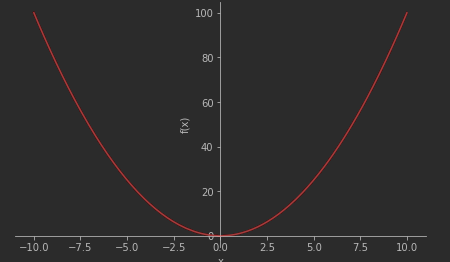
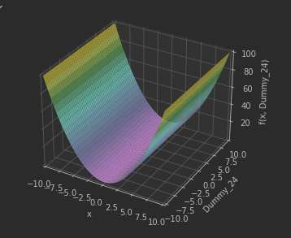

# `Api`

## Таблица `Api`

Математические функции [Большая документация про `SymPy`](https://pythonru.com/biblioteki/sympy-v-python#%D0%A1%D0%B8%D0%BC%D0%B2%D0%BE%D0%BB%D1%8C%D0%BD%D1%8B%D0%B5-%D0%B2%D1%8B%D1%87%D0%B8%D1%81%D0%BB%D0%B5%D0%BD%D0%B8%D1%8F-%D0%B2-SymPy)

| Метод                                                                                      | Описание                                                                                                                        | Пример                                            |
| ------------------------------------------------------------------------------------------ | ------------------------------------------------------------------------------------------------------------------------------- | ------------------------------------------------- |
| ----                                                                                       | --- Арифметические операции ---                                                                                                 | ---                                               |
| `sp.sqrt($Число$)`                                                                         | Возвести число в квадратную степень                                                                                             | `sp.sqrt(2)**2 == 2`                              |
| `x ** (sp.Integer(1)/sp.Integer($Степень$))`                                               | Возведение числа в произвольную степень                                                                                         | `x ** (sp.Integer(1)/sp.Integer(3)) == x**(1/3)`  |
| `sp.factorial($Число$)`                                                                    | Факториал                                                                                                                       |                                                   |
| `sp.log($Число$)`                                                                          | Логарифм                                                                                                                        |                                                   |
| `sp.sin($Число$)`                                                                          | Синус числа                                                                                                                     |                                                   |
| `sp.cos($Число$)`                                                                          | Косинус числа                                                                                                                   |                                                   |
| `sp.tag($Число$)`                                                                          | Тангенс                                                                                                                         |                                                   |
| `sp.limit($Уравнение$)`                                                                    | Предел                                                                                                                          |                                                   |
| `sp.integrate($Уравнение$,<$КакойСимволИнтегрировать$>)`                                   | Интеграл                                                                                                                        | `sp.integrate($Уравнение$).diff() == $Уравнение$` |
| `sp.diff($Уравнение$,<$КакойСимволДифференцировать$>, ...)`                                | Дифференцировать уравнение, для нескольких дифференцирований укажите их через запятую в аргументе или напишите число повторений |                                                   |
| ---                                                                                        | --- Сокращение уравнений ---                                                                                                    | ---                                               |
| `sp.sympify("$Уравнение$")`                                                                | Общий вариант сокращения уравнения, если передать строку то он её распрасит в `SymPy`                                           |                                                   |
| `sp.expand($УравнениеSymPy$)`                                                              | Расширенное раскрытие уравнения                                                                                                 |                                                   |
| `sp.factor($УравнениеSymPy$)`                                                              | Эта функция берет многочлен и раскладывает его на неприводимые множители по рациональным числам.                                |                                                   |
| `sp.cancel($Уравнение$)`                                                                   | Каноническое сокращение                                                                                                         |                                                   |
| ---                                                                                        | --- Доп функционал ---                                                                                                          |                                                   |
| `sp.solveset($Уравнение$,$КакойСимволИскать$)`                                             | Найти неизвестное значения в уравнение                                                                                          |                                                   |
| `sp.linsolve([$Уравнение_1$,...], ($Символ_1$, ...))`                                      | Найти несколько неизвестных значений (Линейные уравнения)                                                                       |                                                   |
| `sp.lambdify([x_1, x_...], $УравнениеSymPy$)` -> `lamda`                                   | Создать `lamda` функцию из уравнения `SymPy` которая принимает аргументы                                                        |                                                   |
| `$УравнениеSymPy$.subs({"SymPyСимвол":$Значение$, ... })`                                  | Вставить конкретные значения в уравнение с `SymPy` символами                                                                    |                                                   |
| `$УравнениеSymPy$.evalf($СколькоЗнаковПослеЗапятой$,subs={"SymPyСимвол":$Значение$, ...})` | Высчитать уравнение и получить конкретное число                                                                                 |                                                   |
| ---                                                                                        | --- Типы данных ---                                                                                                             | ---                                               |
| `sp.Integer($Число$)`                                                                      | Создаст число которое корректно работает в уравнениях                                                                           |                                                   |
| `sp.Float($Число$)`                                                                        | Число с плавающей точкой.                                                                                                       |                                                   |
| `sp.Rational($Врех$,$Низ$)`                                                                | Создаст дробное число                                                                                                           |                                                   |
| `sp.symbols("$Символ_1$,$Символ_...$")`                                                    | Создать один или несколько символов `SymPy`                                                                                     |                                                   |
| `sp.Symbol("$Символ")`                                                                     | Создать один символ `SymPy`                                                                                                     |                                                   |
| `sp.Eq($Лево$,$Право$)`                                                                    | Создать равенство. Получить строну равенства = левую `.lhs`, правую `.rhs`                                                      | `sq.Eq(x**2,5) == "x^2 = 5"`                      |
| `sp.N($Уравнение$,$СколькоЗнаковПослеЗапятой$)` == `$УравнениеSymPy$.evalf()`              | Получить числовое значение уравнения                                                                                            |                                                   |
| `exper.free_symbols`                                                                       | Получить уникальные свободные символы `SymPy` в уравнение                                                                       |                                                   |

## Вставить конкретные значения в символы `SymPy`

```python
a, b, c = sp.symbols("a,b,c")
exper = (a + b + c) * 10
print(exper) # 10*a + 10*b + 10*c
print(exper.subs({"a": 10, "b": 11, c: "-8"})) # 130
```

## Распарсить сроку с уравнением в `SymPy` объект

```python
exper = "(x+2-c^2) * 1/2"
sp.sympify(exper,strict=True)  # -c**2/2 + x/2 + 1
```

| Аргумент   | Рекомендую | Описание                     |
| ---------- | ---------- | ---------------------------- |
| `strict`   | `False`    | Строгость проверки           |
| `evaluate` | `False`    | Нужно ли сокращать выражение |

## Создать анонимную функцию из `SymPy`

```python
expr = a ** 2 + b ** 3
f = sp.lambdify([a, b], expr)
f(2, 3) # 31
```

## Сокращение уравнения

```python
x, y = sp.symbols("x,y")
exper = (x ** 3 + 10 * x ** 2 + 31 * x + 30) / (x ** 2 + 12 * x + 35)
sp.pprint(exper)
"""
 3       2
x  + 10⋅x  + 31⋅x + 30
──────────────────────
     2
    x  + 12⋅x + 35
"""


sp.pprint(sp.factor(exper))
"""
(x + 2)⋅(x + 3)
───────────────
     x + 7
"""

sp.pprint(sp.simplify(exper))
"""
 2
x  + 5⋅x + 6
────────────
   x + 7
"""

sp.pprint(sp.cancel(exper))
"""
 2
x  + 5⋅x + 6
────────────
   x + 7
"""

sp.pprint(sp.apart(exper))
"""
          20
x - 2 + ─────
        x + 7
"""
```

## Интегралы и Ряды

[Видео про интеграл и ряд Тейлора ](https://www.youtube.com/watch?v=Rb5rjrUTdxg&list=PLSE7WKf_qqo1T5VV1nqXTj2iNiSpFk72T&index=9)

## Пределы

[Видео про пределы](https://www.youtube.com/watch?v=DqrfAev6eCI&list=PLSE7WKf_qqo1T5VV1nqXTj2iNiSpFk72T&index=10)

## Дифференцирование

[Видео про дифференцирование](https://www.youtube.com/watch?v=Z2havWsxa-E&list=PLSE7WKf_qqo1T5VV1nqXTj2iNiSpFk72T&index=11)

## Переписать представление тригонометрические значения

[Если непонятно вот видео про это](https://www.youtube.com/watch?v=ALg32BYwECM&list=PLSE7WKf_qqo1T5VV1nqXTj2iNiSpFk72T&index=8)

Простой пример как мы представили `cos` через `sin`

```python
x = sp.symbols('x')
expr = sp.cos(x)
expr_in_terms_of_sin = expr.rewrite(sp.sin)
expr_in_terms_of_sin
"""
   ⎛    π⎞
sin⎜x + ─⎟
   ⎝    2⎠
"""
```

# Переменные

## Создание переменных

Создать переменю `Sympy` которою можно использовать в уравнениях

```python
import sympy as sp
x = sp.symbols("x") # Теперь переменая `x` достпуна для использования в уравнениях
expr =  2 + x * 3
exper # {2+3x}
```

Чтобы узнать получить уникальные символы в уравнение воспользуйтесь методом

```python
x = sp.symbols("x,y") # Теперь переменая `x` достпуна для использования в уравнениях
expr =  2 + x * 3 + y
exper.free_symbols # {x,y}
```

Пример сокращения уравнение. Обратите внимание, что метод `.expand()` дополнительно раскрывает скобки в уравнение

```python
x,y,z = sp.symbols("x,y,z")
res = x*(x+2+x*4)
print(res) # x*(5*x + 2)
print(res.expand()) # 5*x**2 + 2*x
```

Создать последовательность из переменных

```python
x_many = sp.symbols("x0:3") # (x0,x1,x2)
```

---

## Рациональные числа - дробные

Если вам нужно использовать дробные значение в уравнениях, то вы можете их создать

```python
x = sp.symbols("x")
rational = sp.Rational(1, 4) # Создаем дробно число
res = x ** rational
print(res)# x**(1/4)
```

Можно установить предел знаменателя (число под чертой) `limit_denominator($МАксимальноеЗначениеЗнамеателя$)`

```python
sp.Rational(0.2) # 3602879701896397/18014398509481984
sp.Rational(0.2).limit_denominator(100) # 1/5
```

# Найти неизвестные значения

Найти одну неизвестную

```python
x, y = sp.symbols("x,y")
exper = sp.Eq(x + 5,10)
sp.solveset(exper,x) # 5
```

Найти несколько неизвестных (Линейные уравнения)

```python
x, y = sp.symbols("x,y")
sp.linsolve([sp.Eq(x - y, 4), sp.Eq(x + y, 1)], (x, y)) # {(5/2, -3/2)}
```

---

Найти вариант решения уравнения и подставить конкретное значение в решение. Так как в уравнениях ответы цикличны то у нас есть бесконечно много вариантов решить уравнение.

```python
x, n = sp.symbols("x,n")
exper = lambda _I: sp.Eq((_I * 0.001 * N_витков) / (2 * R_м * sp.tan(x)), 11)
# Находим корни решения
exper = sp.solveset(exper(110), x)
# Выбираем анонимную функцию из реешния (в данном случае перем положительынй корень)
exp = exper.args[0].args[0]
print(type(exp)) # <class 'sympy.core.function.Lambda'>
# Так как мы получили анонимную функцию то мы можем подставить конкреное значение в уравнение и получить ответ
sp.pprint(exp(7).evalf()) # 44.7151122520436 + 1.11022302462516e-16⋅ⅈ
```

> Аналог переписывания уравнения в ручную
>
> ```python
> _X = sp.symbols("x")
> exper = -sp.I * (sp.I * (2 * _X * sp.pi + 0.732815101786507) - 1.11022302462516e-16)
> print(exper)
> print(type(exper))
> exper.evalf(3, subs={"x": 7}) # 44.7151122520436 + 1.11022302462516e-16⋅ⅈ
> ```

# Отображения информации

## Красивый вывод в консоль

```python
import sympy as sp


if __name__ == '__main__':
    x, y = sp.symbols("x,y")
    sp.pprint(sp.simplify(x + y ** 2 / 4))#

"""
     2
    y
x + ──
    4
"""
```

Аргументы `sp.pprint`

- `use_unicode=False` Если нужно отобразить в кодировки `ASCII`

## Отображение графиков

Для отображения графиков нужно установить библиотеку `matplotlib`

```bash
pip install matplotlib
```

---

Пример построения графика

```python
from sympy.plotting import plot, plot3d
from sympy import *

x = Symbol('x')
plot(x ** 2, line_color='red')
plot3d(x ** 2, line_color='red')
```

Аргументы `plot`

- `line_color` — определяет цвет линии графика.
- `title` — название графика.
- `xlabel` — метка для оси X.
- `ylabel` — метка для оси Y.




# Варианты решений

## Дискриминант - поиск корней

```python
x = sp.symbols("x")
res = x ** 2 - 4 * x - 5
print(res.factor()) # (x - 5)*(x + 1)
```
