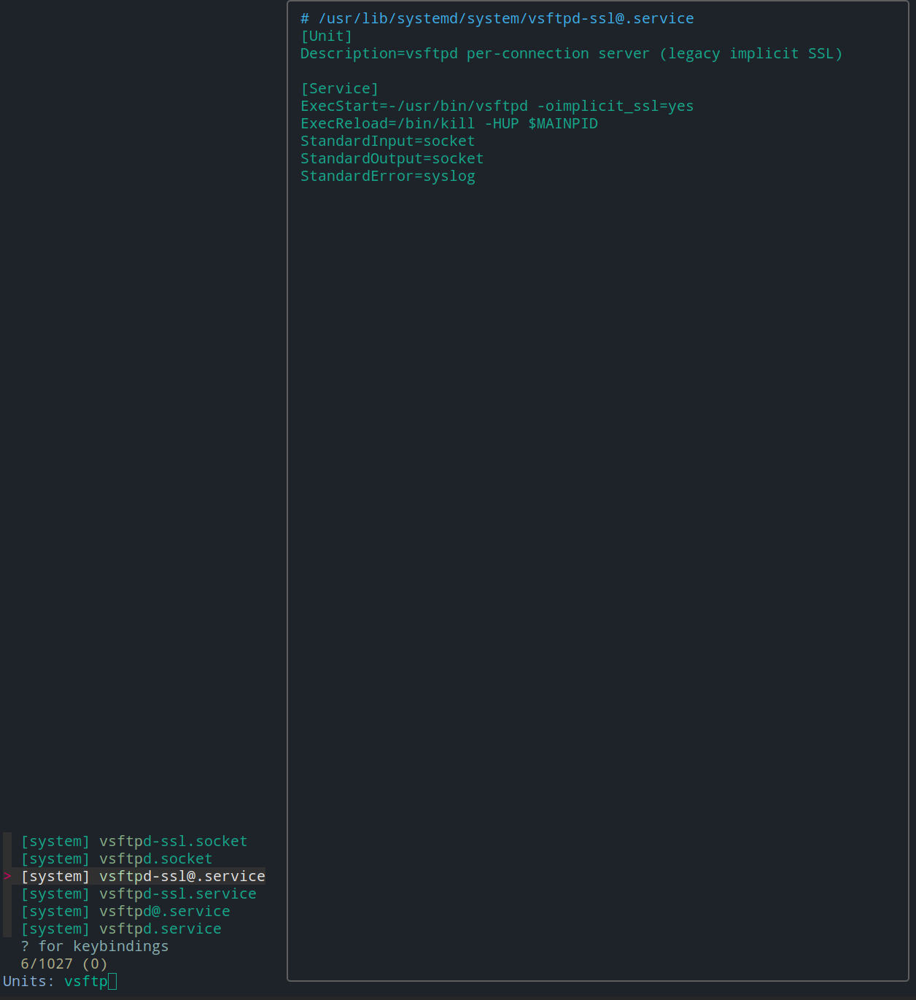
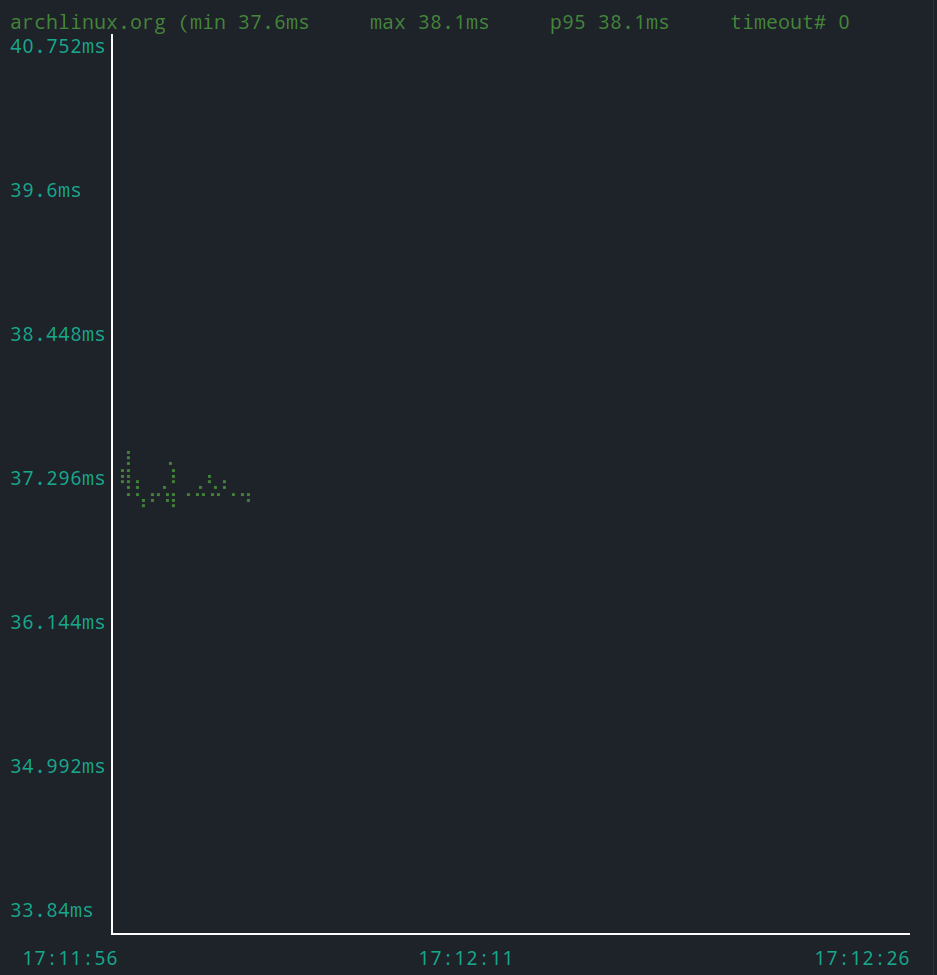

# Яндекс браузер

```bush
yaourt -S yandex-browser-beta
```

# `Zsh` настройка oh my zsh

## Быстрая настройка `zsh`

[zsh](https://gist.github.com/denisxab/7b91e1d09ff8fbe6d8e738a5326e9ced)

```bush
curl https://gist.githubusercontent.com/denisxab/7b91e1d09ff8fbe6d8e738a5326e9ced/raw/19f9a498998a7f0a442ca11a801bc0a184afef21 > ~/.zshrc; . ~/.zshrc; chsh -s $(which zsh)
```

## Общее

1. Установить `zsh`

    ```bush
    sudo apt install zsh \ git sh curl
    ```

1. Установить `oh my zsh` и плагины

    ```bush
    sh -c "$(curl -fsSL https://raw.github.com/ohmyzsh/ohmyzsh/master/tools/install.sh)";
    \
    git clone https://github.com/zsh-users/zsh-autosuggestions ~/.oh-my-zsh/custom/plugins/zsh-autosuggestions;
    \
    git clone https://github.com/zsh-users/zsh-syntax-highlighting.git ~/.oh-my-zsh/custom/plugins/zsh-syntax-highlighting;
    \
    git clone  https://github.com/marlonrichert/zsh-autocomplete.git ~/.oh-my-zsh/custom/plugins/zsh-autocomplete;
	\
	mkdir $ZSH_CUSTOM/plugins/poetry; poetry completions zsh > $ZSH_CUSTOM/plugins/poetry/_poetry
    ```

> Настроить `oh my zsh` `vim ~/.zshrc` (Перезагрузить оболочку командой `. ~/.zshrc`) [Код](https://gist.github.com/denisxab/7b91e1d09ff8fbe6d8e738a5326e9ced)

# `micro`

[Исходники](https://github.com/zyedidia/micro#usage)

---

**Скачать**

| Система                  | Команда                   |
| ------------------------ | ------------------------- |
| Скачать исполняемый файл | `curl https://getmic.ro`  |
| `Arch Linux`             | `sudo pacman -S micro `   |
| `Ubuntu`                 | `sudo apt install micro ` |

---

`> help keybindings`

| Комбинация | Описание                           |
| ---------- | ---------------------------------- |
| `Ctrl+E`   | Открыть командную строку редактора |
| `Ctrl+B`   | Открыть окно терминала             |
| `Ctrl+W`   | Переместиться между окнами         |
| `Tab`      | Автодополнение                     |
| `Ctrl+R`   | Вкл/Выкл нумерацию строк           |

Вкладки

| Комбинация | Описание                            |
| ---------- | ----------------------------------- |
| `Ctrl+T`   | Открыть новую вкладку               |
| `Alt+,`    | Переключиться на предыдущую вкладку |
| `Alt+.`    | Переключиться на следующие вкладку  |

Файловые операции

| Комбинация | Описание             |
| ---------- | -------------------- |
| `Ctrl+Q`   | Закрыть текущий файл |
| `Ctrl+S`   | Сохранить файл       |
| `Ctrl+O`   | Открыть новый файл   |

Поиск

| Комбинация | Описание                                                                  |
| ---------- | ------------------------------------------------------------------------- |
| `Ctrl+F`   | Поиск слова                                                               |
| `Ctrl+N`   | Показать следующие совпадение (Перед этим нужно нажать `Enter` в поиске)  |
| `Ctrl+P`   | Показать предыдущие совпадение (Перед этим нужно нажать `Enter` в поиске) |

Текстовые операции

| Комбинация                           | Описание                                                                   |
| ------------------------------------ | -------------------------------------------------------------------------- |
| `Ctrl+C` / `Shift+<Выделить>+Crtl+C` | Копировать                                                                 |
| `Ctrl+X`                             | Вырезать                                                                   |
| `Ctrl+V` / `Ctrl+Shift+V`            | Вставить                                                                   |
| `Ctrl+D`                             | Дублировать строку                                                         |
| `Ctrl+Z`                             | Отменить действие                                                          |
| `Ctrl+Y`                             | Вернуть действие                                                           |
| `Alt+^`                              | Переместить строку верх                                                    |
| `Alt+v`                              | Переместить строку вниз                                                    |
| `Ctrl+A`                             | Выделить весь текст                                                        |
| `Alt+M`                              | Войти в режим нескольких курсоров (Сначало нужно выделить несколько строк) |
|                                      |                                                                            |

---

Настройки `~/.config/micro/settings.json`. (Для применения изменений выйдете и войдите в `micro`)

```bash
"colorscheme": "geany",
"scrollbar":true,
```

# `Vim`

## Быстрая настройка `vim`

[vim](https://gist.github.com/denisxab/ed66ad2ac78701f0ac0c9456350345e9)

```bush
curl -fLo ~/.vim/autoload/plug.vim --create-dirs \
    	https://raw.githubusercontent.com/junegunn/vim-plug/master/plug.vim \
curl \ https://gist.githubusercontent.com/denisxab/ed66ad2ac78701f0ac0c9456350345e9/raw/a9d825d26e07d9d62d3c09ab04e107c4059e6ae0 > ~/.vimrc;
```

```bash
sudo cp ~/.vimrc /root/.vimrc && \
sudo curl -fLo /root/.vim/autoload/plug.vim \
--create-dirs https://raw.githubusercontent.com/junegunn/vim-plug/master/plug.vim
```

## Общее

Работа с файлами

```bush
:w - записать файл
:q! - выйти без записи
:x - сохранить и выйти

```

Режимы

```bush
i - вставка
v - выделение
/ - поиск
```

Клавиши

```bush
y - копировать
p - вставка
u - отмена
```

---

1.  Скачать `vim`

    ```bush
    sudo apt install vim
    ```

1.  Скачать программу для плагинов. Для скачивания плагинов вводите `:PlugInstall`

    ```bush
    curl -fLo ~/.vim/autoload/plug.vim --create-dirs \
    	https://raw.githubusercontent.com/junegunn/vim-plug/master/plug.vim
    ```

---

> Для того чтобы настройки `vim` были у **администратора**, скопируйте текущие настройки пользователя в `sudo cp ~/.vimrc /root/.vimrc`. И измените путь для скачивания плагинов.
>
> ```bush
> sudo cp ~/.vimrc /root/.vimrc && sudo curl -fLo /root/.vim/autoload/plug.vim --create-dirs https://raw.githubusercontent.com/junegunn/vim-plug/master/plug.vim
> ```

---

Настройки пользователя для `vim` хранятся в файле `vim ~/.vimrc`.(его нужно создать)

```bush
" Место для плагинов
call plug#begin('~/.vim/plugged')

Plug 'preservim/nerdtree'

" Initialize plugin system
call plug#end()


"Для замены Tab на пробелы"
set expandtab
set foldcolumn=2
set smarttab
set tabstop=4
set softtabstop=4
set shiftwidth=4
set autoindent


"Подсвечиваем все что можно подсвечивать"
let python_highlight_all = 1
" Перед сохранением вырезаем пробелы на концах (только в .py файлах)
autocmd BufWritePre *.py normal m`:%s/\s\+$//e ``"
" В .py файлах включаем умные отступы после ключевых слов"
autocmd BufRead *.py set smartindent cinwords=if,elif,else,for,while,try,except,finally,def,class


"Нумеровать строки"
set number
"Тема"
colorscheme elflord
"Включаем 256 цветов в терминале"
set t_Co=256
"on/off подсветку синтаксиса для Языков программирования"
syntax on


"Не мигать"
set novisualbell
"Не пищать!"
set t_vb=
" Выключаем звук в Vim"
set visualbell t_vb=


"Спрятать курсор мыши когда набираем текст"
set mousehide
"Выделение текста мышью"
set mouse=a


"Включить проверку орфографии"
 map <leader>ss :setlocal spell!<CR>


"Делает общий буфер обмена"
set clipboard=unnamedplus
"Горячие клавиши для буфера обмена"
inoremap <C-v> <ESC>"+pa
vnoremap <C-c> "+y
vnoremap <C-d> "+d


"Поиск через кнопку пробел"
map <space> /
"Игнорировать регистр при поиске"
set ignorecase
set smartcase
"Подсвечивать все результаты поиска"
set hlsearch
"Динамическая подсветка результат поиска"
set incsearch


"Открыть панель навигации у плагина nerdtree"
nmap <F6> :NERDTreeToggle<CR>


"Кодировка по стандарту"
set encoding=utf8
"Кодировка терминала"
set termencoding=utf-8
```

|             |                                                                                     |
| ----------- | ----------------------------------------------------------------------------------- |
| expandtab   | Включить замену `Tab` на пробелы                                                    |
| smarttab    | При нажатии `Tab` в начале строки добавляет количество пробелов равное `shiftwidth` |
| tabstop     | Количество вставки пробелов в одном`Tab`                                            |
| softtabstop | Количество удаления пробелов в одном`Tab`                                           |
| number      | Установить нумерацию строк                                                          |
| foldcolumn  | отступ между левой частью окна                                                      |
| colorscheme | Цветовая тема                                                                       |
| syntax      | Включить/Выключить подсветку синтаксиса для Языков программирования                 |
| mouse       | Выделение текста мышью                                                              |
| clipboard   | Делает общий буфер обмена [+](https://wiki.archlinux.org/title/Vim#Clipboard)       |

## Плагины

**NERDTree** - Боковая панель [+](https://github.com/preservim/nerdtree)

```bush
call plug#begin()
  Plug 'preservim/nerdtree'
call plug#end()
```

# `Tmux` - Много терминалов в одном окне

## Быстрая настройка `Tmux`

[tmux](https://gist.github.com/denisxab/e0b547f143de9b8c7471395a3fb4180c)

```bush
curl https://gist.githubusercontent.com/denisxab/e0b547f143de9b8c7471395a3fb4180c/raw/acb4f97a4a564f8c1356f75d3a8af1e1b889dd84 > ~/.tmux.conf; tmux kill-server; . ~/.tmux.conf
```

## Общее

1.  Скачать `tmux`

    ```bush
    sudo apt install tmux
    ```

## Комбинации клавиш

Создать новое окно

```bush
ctr+b C
```

Закрыть окно

```bush
ctr+b x
```

Список окон

```bush
ctr+b W
```

---

Переключиться между окнам

```bush
ctr+b N		Следующие окно
ctr+b P		Преидущее окно
ctr+b 0..9	Переключиться по номер
```

Разделить окно

```bush
ctr+b shift + "	По горизонтали
ctr+b shift + %	По вертикали
```

Навигация по разделенному окну

```bush
ctr+b стрелки
```

---

Создать новую сессию

```bush
tmux new -s ИмяСессим
```

Закрыть сессию

```bush
tmux kill-session -t ИмяСессим
```

Завершить все сессии

```bush
tmux kill-server
```

Выбрать сессию

```bush
ctr+b s
```

Отсоединиться от сессии

```bush
ctr+b d
```

Посмотреть список сессий

```bush
tmux ls
```

Подключиться к сессии по **первому** номеру(без флага `-t` подключится к первой попавшейся)

```bush
tmux attach -t ИмяСессии
```

Или можно просто подсоединиться к последней сессии потом нажать `ctr+b s`

```bush
tmux attach
```

# `MC`

## Быстрая настройка MC

```bush
curl https://gist.githubusercontent.com/denisxab/77d0fc4b51c60a65cf95e289ed58ed2f/raw/cc1f051720176ce046394c248b89ac348b7b272e  > ~/.config/mc/ini
```

## Общее

Конфигурации лежат в `~/.config/mc` в частности в `~/.config/mc/ini` (темы оформления `julia256`/`modarcon16`)

Выключить стандартный редактор и просмотр файлов `~/.config/mc/ini`, и использовать свои. введите команду в `mc` - `select-editor` и выберете свой люимый редактор файлов.

```bash
use_internal_view=0
use_internal_edit=0
```

Установить редактор(`micro`) по умолчанию

```bash
export EDITOR=micro
```

## Горячие клавиши

Поиск файлов

```bash
ctrl+s
```

Созда папку

```bash
F7
```

Удалить папку

```bash
F8
```

Копировать файлы

```bush
F5
```

Переместить

```bush
F6
```

Выделить несколько фалов

```bush
INS - клавиша
```

Выбрать меню

```bush
F9
```

Скрыть окно / раскрыть

```bush
Ctr+O
```

Подняться в самый верх,`клавша`

```bush
PU
```

Переключить курсор на другое окно

```bush
Tab
```

Предпросмотр

```bush
F3
```

Поиск

```bush
F7
```

Редактировать Файл

```bush
F4
```

Изменить редактор файла по умолчанию

```bush
select-editor
```

# `NeoVim` - 0.5

Приготовление:

1. Создаем нужную папку и файл

    ```bush
    mkdir -p ~/.config/nvim/ && > ~/.config/nvim/init.vim
    ```

1. Скачиваем программу для плагинов [Менеджер плагинов Vim](https://github.com/junegunn/vim-plug)

    ```python
    sh -c 'curl -fLo "${XDG_DATA_HOME:-$HOME/.local/share}"/nvim/site/autoload/plug.vim --create-dirs \
    	   https://raw.githubusercontent.com/junegunn/vim-plug/master/plug.vim'
    ```

---

Настройки пользователя для `nvim` хранятся в файле `vim ~/.config/nvim/init.vim`.(его нужно создать)

```bush
"Для замены Tab на пробелы"
set expandtab
set foldcolumn=2
set smarttab
set tabstop=4
set softtabstop=4
set shiftwidth=4
set autoindent


"Список используемых плагинов. Для устоновки использовать команду `:PlugInstall` "
call plug#begin('~/.vim/plugged')

Plug 'neovim/nvim-lspconfig'
Plug 'hrsh7th/nvim-cmp'
Plug 'hrsh7th/cmp-nvim-lsp'
Plug 'saadparwaiz1/cmp_luasnip'
Plug 'L3MON4D3/LuaSnip'
Plug 'preservim/nerdtree'

" color schemas
Plug 'morhetz/gruvbox'  " colorscheme gruvbox
Plug 'mhartington/oceanic-next'  " colorscheme OceanicNext
Plug 'kaicataldo/material.vim', { 'branch': 'main' }
Plug 'ayu-theme/ayu-vim'

" For JS/JSX
Plug 'yuezk/vim-js'
Plug 'maxmellon/vim-jsx-pretty'

call plug#end()

"Настрйока для плагинов"
"Открыть панель навигации у плагина nerdtree"
nmap <F6> :NERDTreeToggle<CR>


"Нумеровать строки"
set number
"Тема"
colorscheme OceanicNext
"Включаем 256 цветов в терминале"
set t_Co=256
"on/off подсветку синтаксиса для Языков программирования"
syntax on
"Грница правой линии"
set colorcolumn=120


"Спрятать курсор мыши когда набираем текст"
set mousehide
"Выделение текста мышью"
set mouse=a


"Включить проверку орфографии"
map <leader>ss :setlocal spell!<CR>


"Делает общий буфер обмена `sudo pacman -S xclip`"
set clipboard+=unnamedplus
"Горячие клавиши для буфера обмена"
inoremap <C-v> <ESC>"+pa
vnoremap <C-c> "+y
vnoremap <C-d> "+d


"Поиск через кнопку пробел"
map <space> /
"Игнорировать регистр при поиске"
set ignorecase
set smartcase
"Подсвечивать все результаты поиска"
set hlsearch
"Динамическая подсветка результат поиска"
set incsearch


"Кодировка по стандарту"
set encoding=utf8
"Кодировка терминала"
set termencoding=utf-8


"Это LSP"
if (has('termguicolors'))
  set termguicolors
endif
" turn off search highlight
nnoremap ,<space> :nohlsearch<CR>
lua << EOF
-- Set completeopt to have a better completion experience
vim.o.completeopt = 'menuone,noselect'

-- luasnip setup
local luasnip = require 'luasnip'

-- nvim-cmp setup
local cmp = require 'cmp'
cmp.setup {
  completion = {
    autocomplete = true
  },
  snippet = {
    expand = function(args)
      require('luasnip').lsp_expand(args.body)
    end,
  },
  mapping = {
    ['<C-p>'] = cmp.mapping.select_prev_item(),
    ['<C-n>'] = cmp.mapping.select_next_item(),
    ['<C-d>'] = cmp.mapping.scroll_docs(-4),
    ['<C-f>'] = cmp.mapping.scroll_docs(4),
    ['<C-Space>'] = cmp.mapping.complete(),
    ['<C-e>'] = cmp.mapping.close(),
    ['<CR>'] = cmp.mapping.confirm {
      behavior = cmp.ConfirmBehavior.Replace,
      select = true,
    },
    ['<Tab>'] = function(fallback)
      if vim.fn.pumvisible() == 1 then
        vim.fn.feedkeys(vim.api.nvim_replace_termcodes('<C-n>', true, true, true), 'n')
      elseif luasnip.expand_or_jumpable() then
        vim.fn.feedkeys(vim.api.nvim_replace_termcodes('<Plug>luasnip-expand-or-jump', true, true, true), '')
      else
        fallback()
      end
    end,
    ['<S-Tab>'] = function(fallback)
      if vim.fn.pumvisible() == 1 then
        vim.fn.feedkeys(vim.api.nvim_replace_termcodes('<C-p>', true, true, true), 'n')
      elseif luasnip.jumpable(-1) then
        vim.fn.feedkeys(vim.api.nvim_replace_termcodes('<Plug>luasnip-jump-prev', true, true, true), '')
      else
        fallback()
      end
    end,
  },
  sources = {
    { name = 'nvim_lsp' },
    { name = 'luasnip' },
  },
}
EOF
lua << EOF
local nvim_lsp = require('lspconfig')

-- Use an on_attach function to only map the following keys
-- after the language server attaches to the current buffer
local on_attach = function(client, bufnr)

  local function buf_set_keymap(...) vim.api.nvim_buf_set_keymap(bufnr, ...) end
  local function buf_set_option(...) vim.api.nvim_buf_set_option(bufnr, ...) end

  -- Enable completion triggered by <c-x><c-o>
  buf_set_option('omnifunc', 'v:lua.vim.lsp.omnifunc')

  -- Mappings.
  local opts = { noremap=true, silent=true }

  -- See `:help vim.lsp.*` for documentation on any of the below functions
  buf_set_keymap('n', 'gD', '<cmd>lua vim.lsp.buf.declaration()<CR>', opts)
  buf_set_keymap('n', 'gd', '<cmd>lua vim.lsp.buf.definition()<CR>', opts)
  buf_set_keymap('n', 'K', '<cmd>lua vim.lsp.buf.hover()<CR>', opts)
  buf_set_keymap('n', 'gi', '<cmd>lua vim.lsp.buf.implementation()<CR>', opts)
  buf_set_keymap('n', '<C-k>', '<cmd>lua vim.lsp.buf.signature_help()<CR>', opts)
  buf_set_keymap('n', '<space>wa', '<cmd>lua vim.lsp.buf.add_workspace_folder()<CR>', opts)
  buf_set_keymap('n', '<space>wr', '<cmd>lua vim.lsp.buf.remove_workspace_folder()<CR>', opts)
  buf_set_keymap('n', '<space>wl', '<cmd>lua print(vim.inspect(vim.lsp.buf.list_workspace_folders)))<CR>', opts)
  buf_set_keymap('n', '<space>D', '<cmd>lua vim.lsp.buf.type_definition()<CR>', opts)
  buf_set_keymap('n', '<space>rn', '<cmd>lua vim.lsp.buf.rename()<CR>', opts)
  buf_set_keymap('n', '<space>ca', '<cmd>lua vim.lsp.buf.code_action()<CR>', opts)
  buf_set_keymap('n', 'gr', '<cmd>lua vim.lsp.buf.references()<CR>', opts)
  buf_set_keymap('n', '<space>e', '<cmd>lua vim.lsp.diagnostic.show_line_diagnostics()<CR>', opts)
  buf_set_keymap('n', '[d', '<cmd>lua vim.lsp.diagnostic.goto_prev()<CR>', opts)
  buf_set_keymap('n', ']d', '<cmd>lua vim.lsp.diagnostic.goto_next()<CR>', opts)
  buf_set_keymap('n', '<space>q', '<cmd>lua vim.lsp.diagnostic.set_loclist()<CR>', opts)
  buf_set_keymap('n', '<space>f', '<cmd>lua vim.lsp.buf.formatting()<CR>', opts)

end

-- Use a loop to conveniently call 'setup' on multiple servers and
-- map buffer local keybindings when the language server attaches
local servers = { 'pyright' }
for _, lsp in ipairs(servers) do
  nvim_lsp[lsp].setup {
    on_attach = on_attach,
    flags = {
      debounce_text_changes = 150,
    }
  }
end
EOF
" Delete buffer while keeping window layout (don't close buffer's windows).
" Version 2008-11-18 from http://vim.wikia.com/wiki/VimTip165
if v:version < 700 || exists('loaded_bclose') || &cp
  finish
endif
let loaded_bclose = 1
if !exists('bclose_multiple')
  let bclose_multiple = 1
endif

" Display an error message.
function! s:Warn(msg)
  echohl ErrorMsg
  echomsg a:msg
  echohl NONE
endfunction

" Command ':Bclose' executes ':bd' to delete buffer in current window.
" The window will show the alternate buffer (Ctrl-^) if it exists,
" or the previous buffer (:bp), or a blank buffer if no previous.
" Command ':Bclose!' is the same, but executes ':bd!' (discard changes).
" An optional argument can specify which buffer to close (name or number).
function! s:Bclose(bang, buffer)
  if empty(a:buffer)
    let btarget = bufnr('%')
  elseif a:buffer =~ '^\d\+$'
    let btarget = bufnr(str2nr(a:buffer))
  else
    let btarget = bufnr(a:buffer)
  endif
  if btarget < 0
    call s:Warn('No matching buffer for '.a:buffer)
    return
  endif
  if empty(a:bang) && getbufvar(btarget, '&modified')
    call s:Warn('No write since last change for buffer '.btarget.' (use :Bclose!)')
    return
  endif
  " Numbers of windows that view target buffer which we will delete.
  let wnums = filter(range(1, winnr('$')), 'winbufnr(v:val) == btarget')
  if !g:bclose_multiple && len(wnums) > 1
    call s:Warn('Buffer is in multiple windows (use ":let bclose_multiple=1")')
    return
  endif
  let wcurrent = winnr()
  for w in wnums
    execute w.'wincmd w'
    let prevbuf = bufnr('#')
    if prevbuf > 0 && buflisted(prevbuf) && prevbuf != btarget
      buffer #
    else
      bprevious
    endif
    if btarget == bufnr('%')
      " Numbers of listed buffers which are not the target to be deleted.
      let blisted = filter(range(1, bufnr('$')), 'buflisted(v:val) && v:val != btarget')
      " Listed, not target, and not displayed.
      let bhidden = filter(copy(blisted), 'bufwinnr(v:val) < 0')
      " Take the first buffer, if any (could be more intelligent).
      let bjump = (bhidden + blisted + [-1])[0]
      if bjump > 0
        execute 'buffer '.bjump
      else
        execute 'enew'.a:bang
      endif
    endif
  endfor
  execute 'bdelete'.a:bang.' '.btarget
  execute wcurrent.'wincmd w'
endfunction
command! -bang -complete=buffer -nargs=? Bclose call <SID>Bclose(<q-bang>, <q-args>)
nnoremap <silent> <Leader>bd :Bclose<CR>


map gn :bn<cr>
map gp :bp<cr>
map gw :Bclose<cr>


" run current script with python3 by CTRL+R in command and insert mode
autocmd FileType python map <buffer> <C-r> :w<CR>:exec '!python3' shellescape(@%, 1)<CR>
autocmd FileType python imap <buffer> <C-r> <esc>:w<CR>:exec '!python3' shellescape(@%, 1)<CR>
```

### Плагины

NERDTree - Боковая панель [+](https://github.com/preservim/nerdtree)

1. Скачать и устоновить

    ```bush
    Plug 'preservim/nerdtree'
    ```

1. Добавить горячую клавишу для вызова панели в `vim ~/.vimrc`

    ```bush
    nmap <F6> :NERDTreeToggle<CR>
    ```

---

LSP сервер - Помощник для `Python`

- [nvim-lspconfig](https://github.com/neovim/nvim-lspconfig)

```bush
sudo npm install -g pyright
```

---

|                |                           |
| -------------- | ------------------------- |
| `Ctrl + Spase` | Предложить автодополнение |
| `bg`           | К определению функции     |
| `bn`           | Обратное от `bg`          |

# `ufw` - фаервол

Установить `ufw`

```bush
sudo apt install ufw
```

|                                               |                                                          |
| --------------------------------------------- | -------------------------------------------------------- |
| `sudo ufw status verbose`                     | Посмотреть статус активности фаервола. `inactive` - выкл |
| `sudo ufw enable`                             | Включить фаервол                                         |
| `sudo ufw disable`                            | Выключить фаервол                                        |
| `sudo ufw reload`                             | Перезагрузить фаервол                                    |
| `sudo ufw reset`                              | Сбросить все настройки                                   |
| ---                                           | ---                                                      |
| `sudo ufw app list`                           | Посмотреть профили                                       |
| `sudo ufw app info <Профиль>`                 | Посмотреть настройки профиля                             |
| ---                                           | ---                                                      |
| `sudo ufw allow Port/Транспорт`               | Открыть указанный `tcp`/`udp` порт                       |
| `sudo ufw deny Port/Транспорт`                | Закрыть указанный `tcp`/`udp` порт                       |
| `sudo ufw allow out Port/Транспорт`           | Разрешить только исходящий трафик                        |
| `sudo ufw deny in Port/Транспорт`             | Запретить входящий трафик                                |
| `sudo ufw allow 20:22/tcp`                    | Открыть интервал портов (20,21,22)                       |
| `sudo ufw deny 20:22/tcp`                     | Закрыть интервал портов (20,21,22)                       |
| `sudo ufw allow <Профиль>`                    | Открыть порты указанные в профиле                        |
| `sudo ufw deny <Профиль>`                     | Закрыть порты указанные в профиле                        |
| ---                                           | ---                                                      |
| `sudo ufw delete <allow/deny> Port/Транспорт` | Удалить правило                                          |
|                                               |                                                          |

---

Перед тем, как мы перейдём к добавлению правил, необходимо указать политику по умолчанию. Какие действия будут применяться к пакетам, если они не подпадают под созданные правила ufw. Все входящие пакеты будем отклонять:

Все входящие пакеты будем отклонять

```bush
sudo ufw default deny incoming
```

А все исходящие разрешим:

```bush
sudo ufw default allow outgoing
```

---

### Создать профиль фаервола

Мы можем создать профиль, в нем будт указанны все порты которые нужно **открыть** или **закрыть**. Для этого:

1. Нужно в папке `/etc/ufw/applications.d` создать файл (профиль) с любым именем
2. В этом файле нужно обязательно указать следующий шаблон
    ```bush
    [<название_профиля>]
    title=<заголовок>
    description=<краткое описание>
    ports=<список портов>/<протокол>
    ```
    > Например:
    >
    > ```bush
    > [App1]
    > title=Text editor
    > description=Most popular open source application for editing text.
    > ports=53,80,5223,16393:16472/udp
    > ```

# `SSH`

[SSH](../Уроки/Блок6%20-%20Сети.md#SSH)

# `FTP`

[FTP](../Уроки/Блок6%20-%20Сети.md#FTP)

# Служба автозапуска Linux `systemctl`

| Команда                                    | Описание                                  |
| ------------------------------------------ | ----------------------------------------- |
| `sudo systemctl enable имя_службы`         | Добвить службу в автозапуск               |
| `sudo systemctl disable имя_службы`        | Удалить службу из автозапуска             |
| `sudo systemctl is-enabled httpd`          | Проверить включена ли служба в автозапуск |
| `systemctl list-unit-files ǀ grep enabled` | Посмотреть весь список включенный служб   |
| `sudo systemctl daemon-reload `            | Перезагрузить все службы                  |

## `sysz` - удобный интерфейс для `systemctl`

[GitHab](https://github.com/joehillen/sysz)



---

Установка:

- `Arch Linux`

    ```bash
    yay -S sysz
    ```

---

# `TeamViewer`

[Скачать](https://www.teamviewer.com/ru/%d1%81%d0%ba%d0%b0%d1%87%d0%b0%d1%82%d1%8c/linux/)

---

Вариант для `Arch linux`

```bash
yay -S teamviewer
```

```bash
sudo systemctl start teamviewerd.service
```

# `VNC` / `RDP` /

## VNC

Сервер [+](https://losst.ru/nastrojka-x11vnc-na-ubuntu):

- Установка:

| ОС     | Команда                   |
| ------ | ------------------------- |
| Ubuntu | `sudo apt install x11vnc` |
| Arch   | `sudo pacman -S x11vnc`   |

- Запустить сервер:
    ```bash
    x11vnc;
    ```

---

Клиент:

- Установить `KRDC`

# `Termshark` - перехватывать трафик

[Githab Termshark](https://github.com/gcla/termshark)

---

Установка:

- `Arch linux`
    ```bash
     sudo pacman -S termshark
    ```

---

# `gping` - визуализировать `ping`

[Githab gping](https://github.com/orf/gping)

---

Установка:

- `Arch linux`
    ```bash
     sudo pacman -S gping
    ```

---

Использование

```bash
gping <Ip/Domen>
```



# `cloc` - реальная длинна кода

[GitHab cloc ](https://github.com/AlDanial/cloc)

Установка на `arch linux`

```bash
sudo pacman -S cloc
```

---

Чтобы воспользоваться напишите

```bash
cloc <Имя>файла
```

```bash
╭─denis@denis-prog ~/PycharmProjects/testvpn
╰─➤  cloc __dont_publish.py
       1 text file.
       1 unique file.
       0 files ignored.

github.com/AlDanial/cloc v 1.90  T=0.01 s (164.1 files/s, 3282.4 lines/s)
-------------------------------------------------------------------------------
Language                     files          blank        comment           code
-------------------------------------------------------------------------------
Python                           1              6             11              3
-------------------------------------------------------------------------------
```

# `Termux`

## Установка Ubuntu без рут

[Исходный гайд](https://tech-geek.ru/install-ubuntu-on-android-termux/)

---

1. Обновить систему

    ```bash
    apt update; apt upgrade;
    ```

1. Скачать устоновщие

    ```bash
    apt install proot-distro
    ```

1. Установить `ubuntu`

    ```bash
    proot-distro install ubuntu
    ```

1. Войти в `ubuntu`

    ```bash
    proot-distro login ubuntu
    ```

> -   Создать файл для заупска
>     ```bash
>     "proot-distro login ubuntu" > ubu.sh
>     ```

# `Virt-Manager` - Виртуальная машина

[Сайт разработчиков](https://virt-manager.org/)

```bash
sudo pacman -S archlinux-keyring qemu virt-manager virt-viewer dnsmasq vde2 bridge-utils openbsd-netcat libguestfs ebtables iptables;
```

```bash
sudo systemctl enable libvirtd.service
sudo systemctl start libvirtd.service
```

# `fsearch` - Быстрый поиск файлов и папок

Установка [+](https://github.com/cboxdoerfer/fsearch)

Arch Linux

```bash
yay -S fsearch
```

Ubuntu [+](https://github.com/cboxdoerfer/fsearch/wiki/Build-instructions)

```bash
sudo apt install git build-essential automake autopoint autoconf libtool pkg-config intltool autoconf-archive libicu-dev libpcre3-dev libglib2.0-dev libgtk-3-dev libxml2-utils
```

```bash
git clone https://github.com/cboxdoerfer/fsearch.git
cd fsearch
```

```bash
./autogen.sh
./configure
make && sudo make install
```
