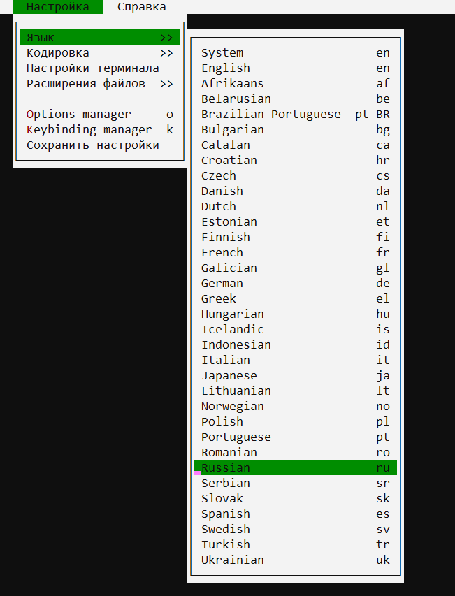

# Полезные сайты про Linux

[Man документация Api на русском](https://www.opennet.ru/man.shtml?topic=watch&category=1&russian=0)

[Много разных гайдов и команд Ubuntu](https://losst.ru/commands)

## Работа с файлами

### `tail` - Отображать в реальном времени состояние файла

> Прекрасная вещь, чтобы смотреть логи

Запустить отображение в консоли реальное состояние файла, в нем будет отображаться последнее добавления

```bush
tail -f name.log
```

По молчанию выводи 10 последних строк, но можно указать свое количество

```bush
tail -n 100 name.log
```

- [КОМАНДА TAIL LINUX](https://losst.ru/komanda-tail-linux)

### `less` - Прокрутка консоли

[Документация](https://losst.ru/komanda-less-v-linux)

### `watch` - Запускать команду через определенный промежуток времени

Запустить программу и показывать отличия

watch -d NAME

````

Установить время обновления команды

```bush
watch -n 5 NAME
````

### `grep` фильтрует результат

```bush
ls | grep t
```

# Стартовая конфигурация

### Установка Пакетов

```bush
sudo apt update

sudo apt upgrade

sudo apt install neovim

sudo apt install htop

sudo apt install python

sudo apt install pip

sudo apt install virtualenv

sudo apt install mc

sudo apt install nano

sudo apt install elinks
```

### Настройка программ

Установить python3 по умолчанию

```bush
sudo ln -sfn /usr/bin/python3.8 /usr/bin/python
```

### Настройка `autocomplite`

sudo nano /etc/bash.bashrc

bash.bashrc

```bush
if ! shopt -oq posix; then
if [ -f /usr/share/bash-completion/bash_completion ]; then
. /usr/share/bash-completion/bash_completion
elif [ -f /etc/bash_completion ]; then
. /etc/bash_completion
fi
fi
```

## Локализация - Русский язык

Для локализации `linux` введите команду

```bash
sudo localedef ru_RU.UTF-8 -i ru_RU -fUTF-8 ; \
export LANGUAGE=ru_RU.UTF-8 ; \
export LANG=ru_RU.UTF-8 ; \
export LC_ALL=ru_RU.UTF-8 ; \
sudo locale-gen ru_RU.UTF-8 ; \
sudo dpkg-reconfigure locales
```

---

Посмотреть доступные языки

```bash
locale -a
```

## Тачпад - tachpad

[Проект для настройки жестов тачпада](https://github.com/JoseExposito/touchegg#installation)

```bash
sudo add-apt-repository ppa:touchegg/stable;
sudo apt update;
sudo apt install touchegg;
```

[Проект для графической настройки жестов Touché](https://github.com/JoseExposito/touche)

```bash
flatpak install flathub com.github.joseexposito.touche;
flatpak run com.github.joseexposito.touche;
```


Настройки хранясь в файле `~/.config/touchegg/touchegg.conf`

> -   [Расширенные драйвера для тачпада](https://ubunlog.com/en/the-plasma-touchpad-does-not-work-well-try-this/)
> -   [Запасной вариант](https://askubuntu.ru/questions/311286/zhesty-tachpada-v-ubuntu-18-04-lts)

---

<table> <tbody> <tr> <td style="text-align: center;">Комбинация клавиш</td> <td style="text-align: center;">Значение</td> </tr> <tr> <td style="text-align: center;" colspan="2">Приложения</td> </tr> <tr> <td><strong>Meta+E</strong></td> <td>Запустить файловый менеджер</td> </tr> <tr> <td><strong>Print</strong></td> <td>Создать снимок активного экрана</td> </tr> <tr> <td><strong>Meta+Print</strong></td> <td>Создать снимок активного окна</td> </tr> <tr> <td><strong>Shift+Print</strong></td> <td>Создать снимок всех экранов</td> </tr> <tr> <td><strong>Meta+Shift+Print</strong></td> <td>Создать снимок выделенной области экрана</td> </tr> <tr> <td><strong>Alt+Space, Alt+F2</strong></td> <td>Открыть строку поиска и запуска KRunner</td> </tr> <tr> <td><strong>Alt+Shift+F2</strong></td> <td>Запустить команду KRunner из буфера обмена</td> </tr> <tr> <td><strong>Meta+Alt+S</strong></td> <td>Специальные возможности — включить/выключить чтение с экрана</td> </tr> <tr> <td style="text-align: center;" colspan="2">KDE Daemon</td> </tr> <tr> <td><strong>Ctrl+Alt+K</strong></td> <td>Переключиться между раскладками клавиатуры</td> </tr> <tr> <td><strong>Meta+P</strong></td> <td>Переключиться между экранами</td> </tr> <tr> <td><strong>Ctrl+Alt+T</strong></td> <td>Запустить эмулятор терминала</td> </tr> <tr> <td style="text-align: center;" colspan="2">kmserver</td> </tr> <tr> <td><strong>Meta+L, Ctrl+Alt+L</strong></td> <td>Блокировать сеанс</td> </tr> <tr> <td><strong>Ctrl+Alt+Del</strong></td> <td>Завершить сеанс</td> </tr> <tr> <td><strong>Ctrl+Alt+Shift+PgDown</strong></td> <td>Выключить компьютер без подтверждения</td> </tr> <tr> <td><strong>Ctrl+Alt+Shift+Del</strong></td> <td>Завершить сеанс без подтверждения</td> </tr> <tr> <td><strong>Ctrl+Alt+Shift+PgUp</strong></td> <td>Перезагрузить компьютер без предупреждения</td> </tr> <tr> <td style="text-align: center;" colspan="2">KWin</td> </tr> <tr> <td><strong>Alt+F3</strong></td> <td>Открыть меню действий с окном</td> </tr> <tr> <td><strong>Alt+F4</strong></td> <td>Закрыть окно</td> </tr> <tr> <td><strong>Ctrl+Alt+A</strong></td> <td>Активировать привлечение внимания к окну</td> </tr> <tr> <td><strong>Alt+Tab</strong></td> <td>Перейти на одно окно вперёд</td> </tr> <tr> <td><strong>Alt+</strong></td> <td>Перейти к следующему окну активного приложения</td> </tr> <tr> <td><strong>Alt+~</strong></td> <td>Перейти к предыдущему окну активного приложения</td> </tr> <tr> <td><strong>Alt+Tab</strong></td> <td>Перейти на одно окно вперёд</td> </tr> <tr> <td><strong>Alt+Shift+Backtab</strong></td> <td>Перейти на одно окно назад</td> </tr> <tr> <td><strong>Meta+Alt+Left</strong></td> <td>Переключиться на окно слева</td> </tr> <tr> <td><strong>Meta+Alt+Right</strong></td> <td>Переключиться на окно справа</td> </tr> <tr> <td><strong>Ctrl+n</strong>, где n — клавиша F1, F2, F3 или F4</td> <td>Переключиться на рабочий стол 1, 2, 3 или 4</td> </tr> <tr> <td><strong>Meta+F5</strong></td> <td>Переместить указателя мыши в видимую область экрана</td> </tr> <tr> <td><strong>Meta+F6</strong></td> <td>Переместить указателя мыши в центр экрана</td> </tr> <tr> <td><strong>Ctrl+F9</strong></td> <td>Показать все окна активного рабочего стола</td> </tr> <tr> <td><strong>Ctrl+F10</strong></td> <td>Показать все окна со всех рабочих столов</td> </tr> <tr> <td><strong>Ctrl+F8</strong></td> <td>Показать все рабочие столы</td> </tr> <tr> <td><strong>Ctrl+F7</strong></td> <td>Показать все окна одного класса</td> </tr> <tr> <td><strong>Meta+D</strong></td> <td>Показать рабочий стол</td> </tr> <tr> <td><strong>Alt+Shift+F12</strong></td> <td>Приостановить композитное расширение</td> </tr> <tr> <td><strong>Meta+W</strong></td> <td>Развернуть окно</td> </tr> <tr> <td><strong>Meta+Up</strong></td> <td>Развернуть окно в верхней половине экрана</td> </tr> <tr> <td><strong>Meta+Down</strong></td> <td>Развернуть окно на нижней половине экрана</td> </tr> <tr> <td><strong>Meta+Shift+Up</strong></td> <td>Развернуть окно на левой верхней четверти экрана</td> </tr> <tr> <td><strong>Meta+Shift+Down</strong></td> <td>Развернуть окно на правой нижней четверти экрана</td> </tr> <tr> <td><strong>Meta+Shift+Right</strong></td> <td>Развернуть окно на правой верхней четверти экрана</td> </tr> <tr> <td><strong>Meta+Shift+Left</strong></td> <td>Развернуть окно на левой нижней четверти экрана</td> </tr> <tr> <td><strong>Meta+Right</strong></td> <td>Развернуть окно на правой половине экрана</td> </tr> <tr> <td><strong>Meta+Left</strong></td> <td>Развернуть окно на левой половине экрана</td> </tr> <tr> <td><strong>Meta+Alt+Down</strong></td> <td>Свернуть окно</td> </tr> <tr> <td><strong>Meta+=</strong></td> <td>Увеличить размер окна</td> </tr> <tr> <td><strong>Meta+-</strong></td> <td>Уменьшить размер окна</td> </tr> <tr> <td><strong>Ctrl+Alt+Esc</strong></td> <td>Удалить окно</td> </tr> <tr> <td style="text-align: center;" colspan="2">Plasma</td> </tr> <tr> <td><strong>Ctrl+Alt+X</strong></td> <td>Включить действия с буфером обмена</td> </tr> <tr> <td><strong>Ctrl+Alt+R</strong></td> <td>Выбрать действие с буфером обмена вручную</td> </tr> <tr> <td><strong>Meta+Q</strong></td> <td>Показать список рабочих пространств (комнат)</td> </tr> <tr> <td><strong>Meta+Tab</strong></td> <td>Перейти на одну комнату вперёд</td> </tr> <tr> <td><strong>Meta+Shift+Tab</strong></td> <td>Перейти на одну комнату назад</td> </tr> <tr> <td><strong>Meta+n</strong>, где n — число от 1 до 9 либо 0</td> <td>Открыть 1-ю, 2-ю, 3-ю, 4-ю, 5-ю, 6-ю, 7-ю, 8-ю, 9-ю либо 10-ю кнопку на панели задач</td> </tr> <tr> <td><strong>Ctrl+F12</strong></td> <td>Показать рабочий стол</td> </tr> <tr> <td><strong>Meta+S</strong></td> <td>Выйти из текущей комнаты</td> </tr> <tr> <td><strong>Alt+F1</strong></td> <td>Сделать виджет «Меню запуска приложений» активным</td> </tr> </tbody> </table>
# Про ядро Linux

## Переменные окружения

Прочитать переменную окружения

```bush
echo $<NAME>
```

Вывести все переменные окружения

```bush
printenv
```

---

**Переменные окружения могут устанавливаться на разных уровнях**

1. Системный уровень (Виден всем)

```bush
sudo vim /etc/environment
```

2. Пользователя (Доступна Пользователю)

Изменить переменные окружения в файле

```bush
sudo vim ~/.zshrc
```

или

```bush
sudo vim ~/.bash
```

> `export <NAME> = <VAL>`

3. Сеанс (Доступен только в сиссе после перезагрузки преподаёт)

```bush
export <NAME> = <VAL>
```

## Клавиши

Поиск команды. Можно нажать стрелку в право, чтобы редактировать ее.
Можно нажать еще раз эту комбинацию и перейти к новому варианту

```bush
ctrl + r
```

Отменить изменение команды

```bush
alt + r
```

Дополняет прошлую команду к текущей

```bush
!!

______________
apt install vim
sudo !!
```

Написать и исполнить последнюю команду

```bush
ctrl + p
ctrl + o
```

Переместить курсор

```bush
crtl + a | home = Начало
ctrl + e | end = Конец
```

Вырезать текст

```bush
ctrl + u
```

Вставить текст

```bush
ctrl + y
```

## Режим консоли

Console

```bush
ctrl+ alt + f2

alt + < = Навигация между консолями
```

Gui

```bush
ctrl+ alt + f7 - Gui
```

Установка чего-либо должна выполняться с помощью apt (хотя с терминала у вас может быть терминал, нажав ctrl + alt + F1, чтобы перейти в режим без графического интерфейса, нажмите ctrl + alt + F7, чтобы вернуться на рабочий стол, эти ярлыки переключаются между что Linux называет pty) [+](https://forums.puri.sm/t/unable-to-install-terminal-command-line/2427)

## Запуск программы в фонов режиме

[https://1cloud.ru/help/linux/linux_zapusk_komand_fonovom_rezhime](https://1cloud.ru/help/linux/linux_zapusk_komand_fonovom_rezhime)

Пример запуска программы — нужно добавить в конец команды &

```bush
python main.py &
```

|                   |                                       |
| ----------------- | ------------------------------------- |
| `jobs –l`         | Показать запущенные процессы с их PID |
| `kill [PID_ID]`   | Закрыть процесс                       |
| `fg [INDEX_Jobs]` | Перейти к процессу                    |
| `Сtr+z`           | Выйти из процесса и приостановить его |
| `bg [INDEX_Jobs]` | Восстановить работу процесса          |

## Автозагрузка

[Служба автозапуска Linux](Программы%20для%20Linux.md#Служба%20автозапуска%20Linux)

## Пользователи

### Общее, Создание, Удаление

Флаги к файлам

|     |     |                       |
| --- | --- | --------------------- |
| r   | 4   | Чтение                |
| w   | 2   | Запись/Редактирование |
| x   | 1   | Исполнение/Просмотр   |

Полномочия к файлам

```bush
rwx rwx rwx
```

- Владелец
- Группа
- Другие

---

- Узнать какой сейчас выбран пользователь

    ```bush
    whoami
    ```

- Узнать группу пользователя

    ```bush
    id ИмяПользователя
    ```

- Посмотреть активных пользователей

    ```bush
    w
    ```

    > ```bush
    >  16:01:09 up  2:05,  5 sudo useraddusers,  load average: 0,74, 1,03, 1,01
    > USER     TTY        LOGIN@   IDLE   JCPU   PCPU WHAT
    > denis    tty1      15:25    5:06m  5:08   0.07s /usr/bin/startplasma-x11
    > denis    pts/0     15:25   35:31   0.00s  2.72s /usr/bin/kded5
    > denis    pts/1     15:25    1.00s  1.69s  0.01s w
    > denis    pts/4     14:53    1:07m  0.00s  0.00s -bash
    > denis    pts/5     15:59   33.00s  0.33s  0.08s ssh denis@84.201.150.205
    > ```

- Посмотреть подробную информацию о всех пользователей

    ```bush
    cat /etc/passwd
    ```

    > Посмотреть соль от поролей пользователей.[+](https://andreyex.ru/linux/ponimanie-fajla-etc-shadow/) знаки ` !``* ` указывают что у пользователя нет пароля
    >
    > ```bush
    > cat /etc/shadow
    > ```

- Посмотреть только имена всех пользователей

    ```bush
    sed 's/:.*//' /etc/passwd
    ```

- Посмотреть историю входов пользователей

    ```bush
    last -a
    ```

- Посмотреть историю выходов

    ```bush
    lastlog
    ```

---

- Создать пользователя, `-m` создать папку в `/home/` для нового пользователя

    ```bush
    sudo useradd -m ИмяПользователя
    ```

    > В папке `cd /etc/skel` находится шаблон, который добавить в домашнюю директорию нового пользователя. М можем изменить этот шаблон

- Установить пароль для пользователя

    ```bush
    sudo passwd ИмяПользователя
    ```

- Войти в профиль пользователя

    ```bush
    su ИмяПользователя
    ```

- Удалить пользователя. Флаг `-r` удалит все файлы пользователя

    ```bush
    sudo userdel ИмяПользователя
    ```

---

### Права доступа

- Сменить права доступа

    ```bush
    sudo chmod <777> <Файл/Папка>
    ```

    `<777>` - Код достпуности
    `-R` выполнить в рекурсивном режиме, для всех файлов в и папок в деректории

- Сменить пользователя и группу

    ```bush
    sudo chown <Пользователь>:<Группа> <Файл/Папка>
    ```

    `-R` выполнить в рекурсивном режиме, для всех файлов в и папок в деректории

# Виртуальные машины

## KVM

[Подсказки](https://losst.ru/ustanovka-kvm-ubuntu-16-04)

```bush
sudo gpasswd -a <USER> libvirt
```

Запустить ВРМ

```bush
sudo systemctl start libvirtd
```

Статус ВРМ

```bush
sudo systemctl status libvirtd
```

Остановить ВРМ

```bush
sudo systemctl stop libvirtd
```

## VirtialBox

Скачать `Windows` можно с [Rutracker](https://rutracker.net/forum/viewtopic.php?t=6066600)

0. Скачать `VirtialBox`
1. Посмотреть версию ядра `Linux`

```bush
uname -r
```

2. Выбрать версию такую же как у ядра `Linux`

```bush
sudo pacman -S virtualbox linux-headers virtualbox-host-dkms virtualbox-guest-iso
```

3.

```bush
sudo modprobe vboxdrv
```

4. Перезагрузить `VirtialBox`

```cmd

```

[Про то как подключить образ Windows к VirialBox](https://losst.ru/oshibka-no-bootable-medium-found-virtualbox)

# Про интернет

Скачать

```bush
sudo pacman -Sy iproute
sudo pacman -Sy traceroute
sudo pacman -Sy arp-scan
sudo pacman -Sy mtr
sudo pacman -Sy ethtool
```

## Проверка маршрутизации

Посмотреть таблицу маршрутизации

```bush
route -n
```

```bush
netstat  -r
```

Посмотреть путь пакета [traceroute](https://losst.ru/komanda-traceroute-linux)

```bush
sudo traceroute <IP>
```

```bush
mtr -c <N> -b  <IP>
```

> `-c <N>` Количество запросов перед остановкой
> `-b` Показать ip и имя

Быстрая проверка доступа

```python
ping <IP>
```

Просмотреть все устройства подключенные к сети

```bush
sudo arp-scan  --interface=<ИМЯ_ИНТЕРФЕСА> --localnet
```

## Проверить сокеты

```bush
sudo pacman -Sy gnu-netcat
```

Клиент

```bush
nc 127.0.0.1 9092
```

Сервер

```python
nc -l -s 127.0.0.1 -p 9092
```

Посмотреть внешний ip

```bush
wget -O - -q icanhazip.com
```

## Порты `netstat`

Установка в `ArchLinux`

```bush
sudo pacman -S net-tools
```

Посмотреть открытые порты TSP

```bush
watch -d -n 2 netstat -nlpt
```

Перечислить все порты

```bush
netstat -a
```

> t = TCP
> u = UDP
> x = UDS

- `-l` = Показать только `LISTEN`
- `-s` = Посмотреть статистику порта
- `-p` = Выводит `PID` и имя файла использующий порт[]()

## Включить wifi

Посмотреть все устройства

```bush
ifconfig - a
```

Включить устройство

```bush
ifcofig <wlp30s> up
```

## Сетевая карта

[Посмотреть буфер сетевой карты](https://ittricks.ru/administrirovanie/linux/555/optimizaciya-setevoj-karty-pod-vysokuyu-propusknuyu-sposobnost)

Посмотреть возможные ошибки карты и отбрасывание пакетов

```bush
ip -s -s link show <ИНТЕРФЕЙС>
```

Посмотреть размер сетевой карты

```bush
ethtool -g <ИНТЕРФЕЙС>
```

> TX = Сколько используется
> RX = Сколько можно использовать

# Информация о железе

## `df` - Место на носителе

```bush
df -h
```

- **Файловая система** **(filesystem**)- предоставляет имя файловой системы.
- **Размер (size)** — дает общий размер всех файлов в конкретной файловой системе.
- **Использовано (used)** — показывает количество уже использованного места в конкретной файловой системе.
- **Доступно (avail)** — показывает, как много свободного места осталось в конкретной файловой системе.
- **%Использования (use%)** — показывает процент использованного дискового пространства.
- **Смонтирован на (mounted on)** — последняя колонка показывает точку монтирования файловой системы.

## `sensors` - Температура процессора

### Команды

```bush
sudo apt install lm-sensors
```

Дальше везде жмем `Enter`

```bush
sudo sensors-detect
```

Запустить программу

```bush
watch -d -n 1 sensors
```

## `acpi` - Данные про батарею

### Команды

```cmd
sudo apt install acpi
```

Запуск данные о заряде батареи

```cmd
watch -d acpi -V
```

## htop — Отображение загрузки системы

### Общее

[http://linux-bash.ru/menusistem/79-htop.html](http://linux-bash.ru/menusistem/79-htop.html)

Поиск процесса по имени

```bush
/name
```

Применить фильтр поиска

```bush
\name
```

Показать процессы у определенного пользователя

```bush
u
```

Показать древовидную структуру

```bush
t
```

Убить процесс

```bush
k
```

Посмотреть переменные окружения процесса

```bush
e
```

Посмотреть список используемых файлов у процесса

```bush
l
```

# Про пакеты

## ZSH

0. If `ZSH` is not already installed on your Manjaro system you can do it with the command:

```
sudo pacman -Syu zsh
```

1. Install [Oh My ZSH](https://ohmyz.sh/)

```
sh -c "$(curl -fsSL https://raw.github.com/ohmyzsh/ohmyzsh/master/tools/install.sh)"
```

or

```
sh -c "$(wget https://raw.github.com/ohmyzsh/ohmyzsh/master/tools/install.sh -O -)"
```

2. Installation of two important plugins I can't live without

```
git clone https://github.com/zsh-users/zsh-syntax-highlighting.git ${ZSH_CUSTOM:-~/.oh-my-zsh/custom}/plugins/zsh-syntax-highlighting
```

and

```
git clone https://github.com/zsh-users/zsh-autosuggestions ${ZSH_CUSTOM:-~/.oh-my-zsh/custom}/plugins/zsh-autosuggestions
```

3. Configuring zsh

Modify the `~/.zshrc` config file editting plugins section like this:

```
plugins=(
    git
    zsh-autosuggestions
    zsh-syntax-highlighting
)
```

Change the theme to agnoster:

```
ZSH_THEME="agnoster"
```

4. Logout/logon or apply the changes with:

```
source ~/.zshrc
```

5. Make zsh default if you haven't already:

```
chsh -s $(which zsh)
```

## `yaourt`

### Установка

```bush
sudo pacman -S --needed base-devel git wget yajl
cd /tmp
git clone https://aur.archlinux.org/package-query.git
cd package-query/
makepkg -si
cd ..
git clone https://aur.archlinux.org/yaourt.git
cd yaourt/
makepkg -si
cd ..
sudo rm -dR yaourt/ package-query/
```

### `dpkg`

Установка

```bush
yaourt -S dpkg
```

Использование

```bush
sudo dpkg -i <NAME>
```

## wireshark

```bush
kdesu wireshark
```

## Snap
Чтобы все работало
```bash
sudo ln -s /var/lib/snapd/snap /snap
```


## Flatpak

## grep

Слово должно начинаться с текста или символа`TEXT`

```bush
| grep "^TEXT"
```

Исключение слова или символы из посика

```bush
| grep "[^TEXT] ... "
```

Должно оканчиваться указанным словом или символом

```bush
| grep "TEXT$"
```

Поиск с оператор `ИЛИ`

```bush
| grep  -E "TEXT_1|TEXT_2"
```

Игнорировать регистр при поиске

```bush
| grep -i "TEXT"
```

Показать номер строки в которой найдено слово

```bush
| grep -n "TEXT"
```

Показать результат до и после найденных слов

```bush
| grep -C <ЧИСЛО> "TEXT"
```

Сортировать результат

```bush
| grep "TEXT" | sort
```

## `pacman` - Пакетный менеджер Arch

| Команда                          | Описание                                     |
| -------------------------------- | -------------------------------------------- |
| `sudo pacman -Sy`                | Проверить обновления - синхронизироваться    |
| `sudo pacman -Ss <name>`         | Поиск пакета                                 |
| `sudo pacman -S <name>`          | Установка пакета                             |
| `sudo pacman -Sy <name>`         | Синхронизация индексов и установка пакета    |
| `sudo pacman -Syu <name>`        | Обновить пакет                               |
| `sudo pacman -Syu`               | Обновить все пакеты                          |
| `pacman -Fy `                    | Обновить индексы                             |
| `pacman -Fl <name>`              | Получить зависимости у пакета                |
| `pacman -Qo <name>`              | Посмотреть родителя пакета                   |
| `sudo pacman -Qi <name>`         | Информация о пакета                          |
| `sudo pacman -Qdtq`              | Посмотреть все ненужные зависимости          |
| `pacman -Qm`                     | Посмотреть пакеты установленные из `AurHome` |
| ---                              | ---                                          |
| `sudo pacman -R <name>`          | Удалить пакет                                |
| `sudo pacman -R $(pacman -Qdtq)` | Удалить ненужные зависимости                 |
| `sudo pacman -Rscun <name>`      | Удалить пакет и все его зависимости          |

---

Посмотреть список зеркал для скачивания пакетов [Про то как найти оптимальные зеркала для Arch](https://youtu.be/qSdu6Mqgur4)

```bush
vi /etc/pacman.d/mirrorlist
```

#### `AurHome`

Есть два типа пакетов

- `-bin` = Скомпилированные
- ` ` = Исходники пакеты

Пакеты для компиляции `PKGBUILD`

```bush
sudo pacamn -S base-devel
```

Скачать нужные файлы из `PKGBUILD` (запускать без root!)(`-s` установить зависимости)

```bush
makepkg -s
```

> Получаем на выходе `<name>.pkg.tar.xz` его нужно установить через `pacman`

Установить скаченный проект через `pacman`

```bush
sudo pacman -U <name>.pkg.tar.xz
```

Скачать проект и установить через `pacman`

```bush
makepkg -si
```

#### `yay` Пакетный менеджер `AurHome`

Поиск пакета

```bush
yay -Ss <name>
```

Установить пакет из `<AyrHome>`

```bush
yay -S <nmae>
```

## `Shh`

[Настраиваем аутентификацию SSH по ключу в Linux / Unix](https://www.youtube.com/watch?v=IVHv3eVQa14)

[Если чё](https://www.cyberciti.biz/faq/howto-start-stop-ssh-server/)

### Подключиться к серверу

```bush
ssh denis@192.123.06
```

> `denis` Имя `root` у клиента
>
> `192.123.06` Это данные из `ifconfig` -> `inet addf:192.123.06`

Сгенерировать ключ

```bush
ssh-keygen

...
 ~/.ssh/id_rsa = Приватынй ключ
 ~/.ssh/id_rsa.pub = Публичный ключ
 ~/.ssh/known_host = Файл который создаетья при первом успешном соединение с сервером
```

Посмотреть приватны ключ

```bush
vim ~/.ssh/id_rsa
```

Посмотреть публичный ключ

```bush
vim ~/.ssh/id_rsa.pub
```

Скопировать свой ключ серверу

```bush
ssh-copy-id denis@192.168.10.39

-f  = чтобы принудительно отправить новый варинт ключей
```

Посмотреть статус shh

```cmd
service ssh status
```

Перезагрузить `ssh`

```bush
sudo service shh restart
```

Включить `ssh`

```bush
sudo service shh start
```

Выключить `ssh`

```bush
sudo service shh stop
```

Настроить сервер

```bush
sudo vim /etc/ssh/sshd_config
```

Запретить входить на сервер через пароль, вход только теми кто имеет приватный ключ.
Поэтому сначала ставим `yes` обмениваемся ключами, а потом ставим `no`.
После изменения файлов конфигурации нужно перезагружать `ssh`

```cmd
PasswordAuthentication no = Авторизацяи по паролю

PermitRootLogin prohibit-password = Спрашивать пороль от сервера root
```

## `aptitude` - консольный менеджер пакетов

### Комбинации клавишь

Вернуться на уровень назад

```bush
q
```

Выбрать для устновки

```bush
+
```

Выбрать для удаления

```bush
-
```

Установить/удалить выделенное

```bush
g
```

## Apt – Пакетный менеджер

### Общее

- **`Search`** `- поиск пакетов по имени;`
- **`list`** `- список пакетов;`
- **`show`** `- показать подробную информацию о пакете;`
- **`update`** `- обновить списки доступных пакетов;`
- **`install`** `- установить пакет;`
- **`remove`** `- удалить пакет;`
- **`upgrade`** `- установить доступные новые версии пакетов;`
- **`full-upgrade`** `- полное обновление системы;`
- **`edit-sources`** `- редактировать файл источников программного обеспечения.`

## Elinks – Консольный браузер.

```bush
apt install elinks
```

### Общее

Поменять язык интерфейса



Вставить URl из буфера

```python
Shift+ПКМ
```

Панель закладок

```bush
s
```

Поиск

```bush
/
```
