# Введение

Существуют достаточно много инструментов для написания кода. И лидирующими программы для это сейчас являются

- `PyCharm`
- `VS Code`
    

В данном уроке мы рассмотрим профессиональную интегрированною среду разработки `PyCharm`.

- [Создание проекта и виртуальное окружение](#создание/проекта/и/виртуальное/окружение)
- [Навигация в проекте](#Навигация/в/проекте)
- [Примеры использования полезных горячих клавиш](#Примеры/использования/полезных/горячих/клавиш)
- [Использование Живых шаблонов `Live Templatse`](#Использование/Живых/шаблонов/Live/Templatse)
- [Использование постфиксов `Postfix` и плагины `Custom Postfix Templates`](#Использование/постфиксов/Postfix/и/плагины/Custom/Postfix/Templates)
- [Работа с `Git` и подключение к `GitHab`](#Работа/с/Git/и/подключение/к/GitHab)
- [Тестирование кода](#Тестирование/кода)

# Создание проекта и виртуальное окружение

`File -> New Project`

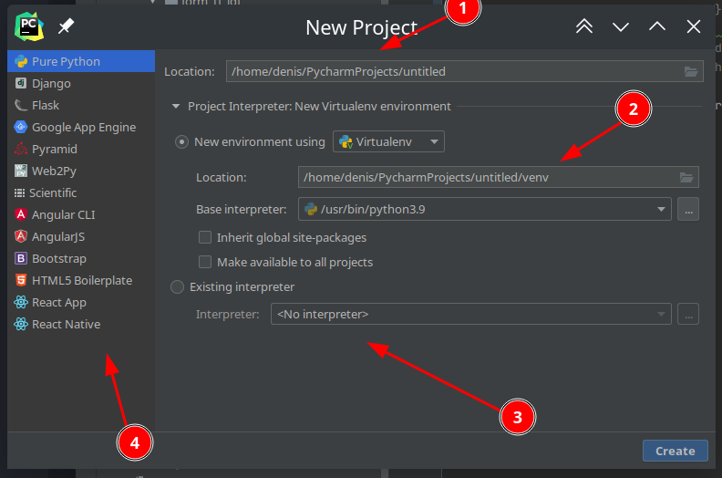

1. Путь где будет находиться проект
2. Путь где будет находиться виртуальное окружение
3. Вы можете использовать уже ранее созданные виртуальное окружения
4. Шаблоны проектов для различных Фреймворков

- `Inherit global site-packages` Если вы хотите, чтобы все пакеты, установленные в глобальном Python на вашем компьютере, добавлялись в виртуальную среду, которую вы собираетесь создать.
- `Make available to all projects` Если вы хотите повторно использовать эту среду при создании интерпретаторов Python в PyCharm.

---

Если после создания проекта вам нужно поменять виртуальное окружение
вы можете это сделать.

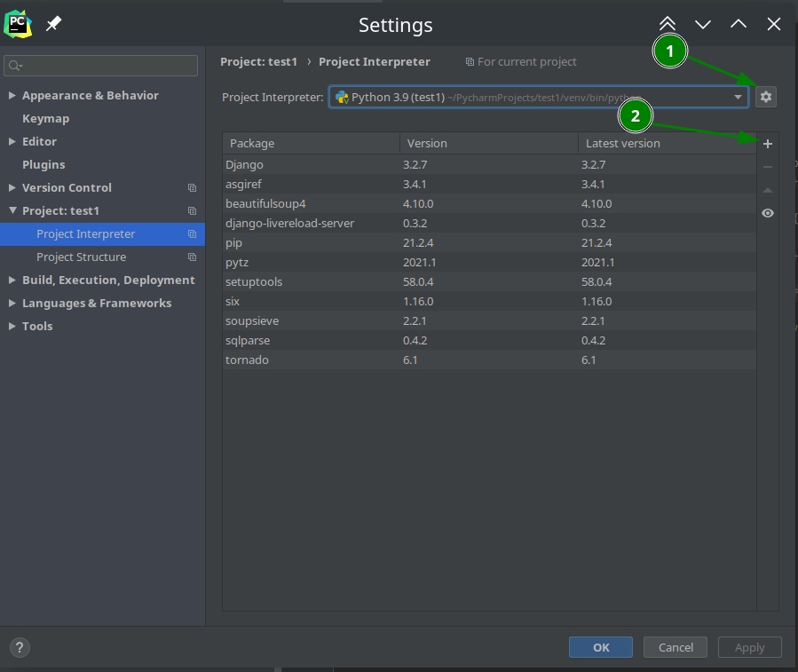

1. Здесь вы можете добавить существующее ВО или создать новое
   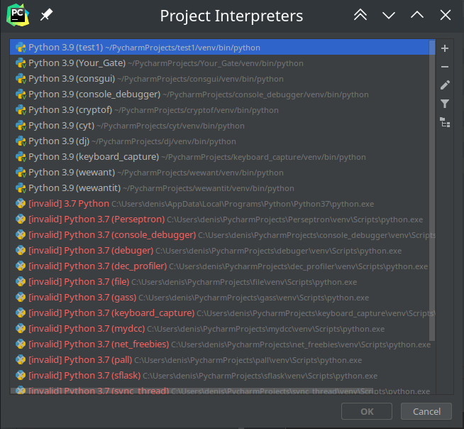

2. Также тут можно добавить пакет из PIP репозитория
   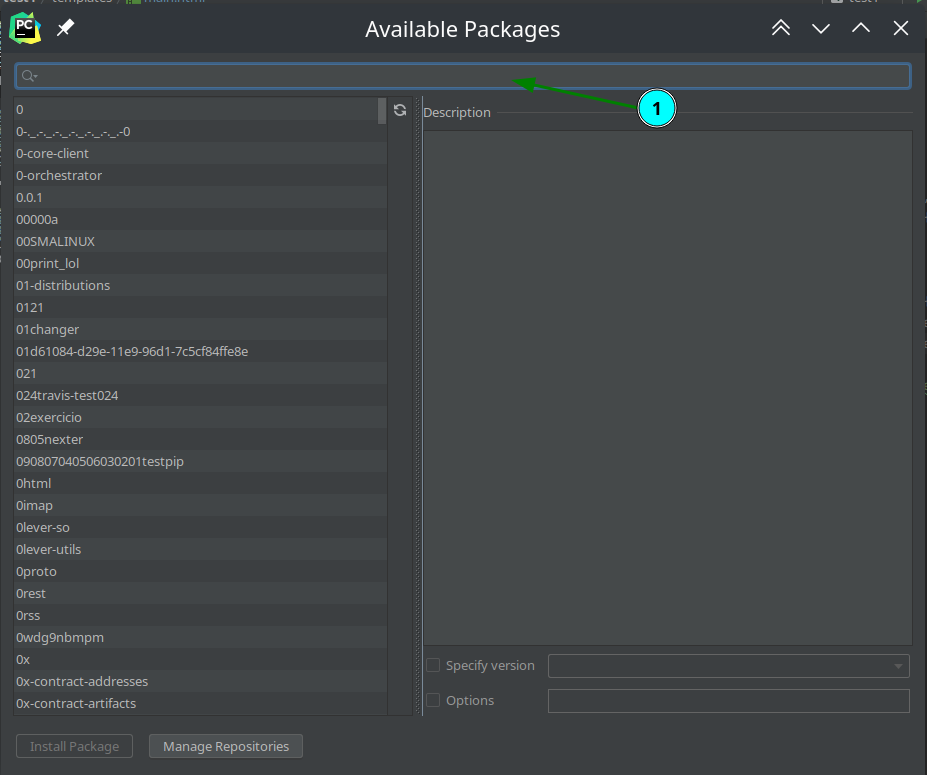

# Навигация в проекте

Одна из главных особенностей `PyCharm` - это возможность
автоматически изменять пути импортирования модулей при
переносе модуля

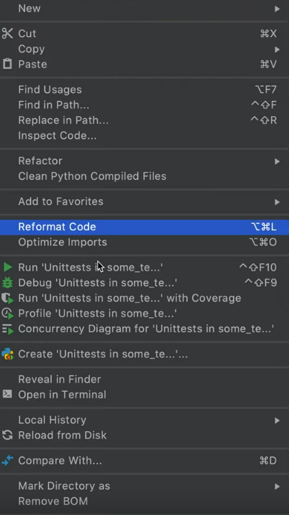

- `New` Создать файл по шаблону
- `Copy`Копировать относительный, или абсолютный путь к файлу
- `Refactor` Переименовать, переместить, Копировать файл или
    директорию
- `Show Explorer` Показать в проводнике
- `Open in Terminal` Открывает терминал, и переходит
    к ближайшей директории в котором находиться файл.
- `Local History` Можете посмотреть историю изменения файла
- `Mark Directory as` Установить папку как `Sources Root` или `Tamplate`

Использование `Sources Root`
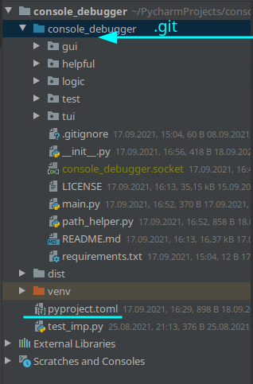

---

Перемещение модулей

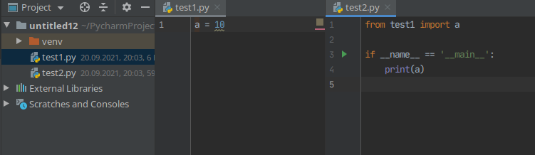

---

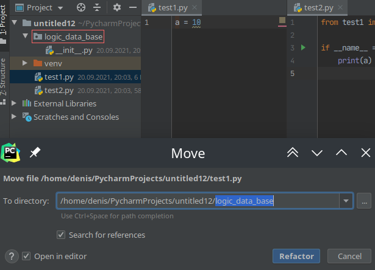

---

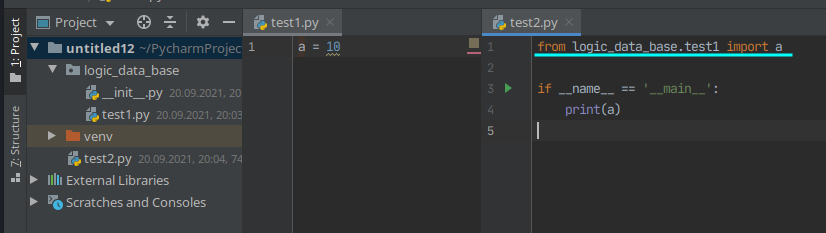

# Примеры использования полезных горячих клавиш

## Редактирование кода

- Перемещать строки местами

```cmd
Ctrl+Shift+Вверх или Ctrl+Shift+Вниз.
```

- Выделить участка код в строке, исходя из синтаксиса языка программирования

```cmd
Ctrl+W или Ctrl+Shift+W
```

- Дублировать строку

```cmd
Ctrl+D
```

- Удалить строку

```cmd
Ctrl+Y
```

- Быстро перемещаться между методами в редакторе.

```cmd
Alt+Up и Alt+Down
```

- Поставить метки в коде по которым можно потом перемещаться "На линукс другая комбинация"

```cmd
Ctrl+Shit+[1-9] – поставить метку
Ctrl +[1-9] – переместиться к метки
```

- Вернуться к предыдущему месту курсора

```cmd
Ctrl+Shift+Backspace
```

- Перемещение по последним курсорам

```cmd
Ctrl+Alt+Left // Ctrl+Alt+Right
```

- Вынести выделенное в отделанную переменную

```cmd
Ctrl+Alt+V
Shift+Alt+V [Linux]
```

- Выделить несколько строк сразу

```cmd
Alt +Shift + выделение мышью
```

- Перемещать курсор по краям скобок

```cmd
Ctrl+Shift+M
```

- Переместить курсор на следящую строку

```cmd
Shift+Enter
```

- Завершить строку и Переместить курсор на следящую строку

```bush
Cttl + Shit + Enter
```

- Однострочных комментариев (// ...)

```cmd
Ctrl + /:
```

- Комментариев блока (/_..._/)

```cmd
Ctrl + Shift + /:
```

- Навигация между файлами

```cmd
Alt+<- || Alt +->
```

- Форматирование кода

```cmd
Ctrl + Alt + L
Alt + Shift + L [Linux]
```

- Прокрутка предложений [+](https://www.jetbrains.com/help/idea/auto-completing-code.html#expand-a-string-at-caret-to-an-existing-word)

```bush
Alt + / # Вперед
Alt + Shift + / # Назад
```

- Генерировать случайные слова

```bush
lorem<ЧислоСлов>
```

## Подсказки в коде

- Быстрое просмотр определения

```cmd
Ctrl + Shift + I
```

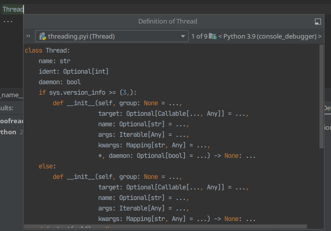

- Список допустимых параметров.

```cmd
Ctrl+P
```

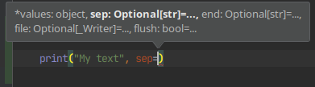

- Всплывающее окно документации

```cmd
Ctrl+Q
```

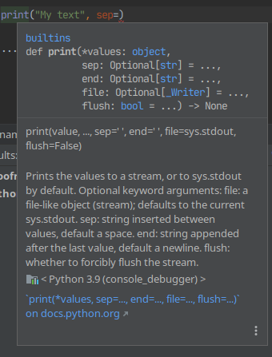

- Для объявления = Показать места в коде, где используется функция.
- Для вызова = Открывает объявления функции.

```cmd
Ctrl + B
```

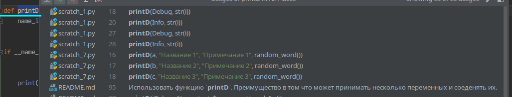

- Принудительно вызвать автодополнение

```cmd
Ctrl+Space,
```

- Посмотреть автодополнения только к постфиксам и шаблонам

```bush
Ctrl+J
```

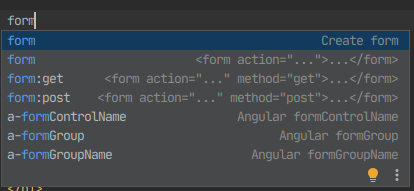

- Пример решение проблемы

```cmd
Alt+Enter
```

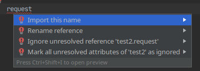

## Поиск

- Поиск в текущем файле

```cmd
Ctrl+F
```

- Поиск в файлах проекта

```cmd
Ctrl+Shift+F
```

- Замена в файлах проекта

```bush
Crtl+Shift+R
```

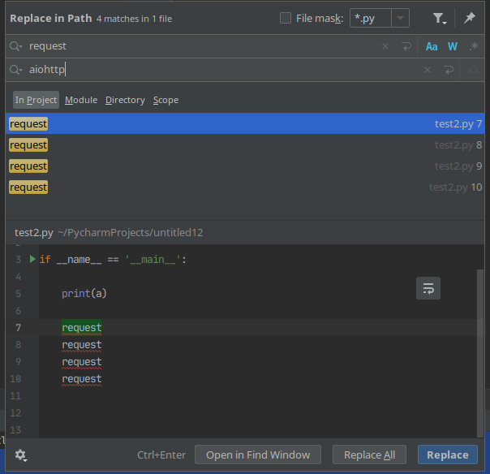

- Перейти к сведущий ошибке

```cmd
F2
```

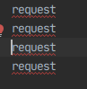

## Создание элементов кода

- Создать метод класса автоматически

```cmd
Ctrl+O
```

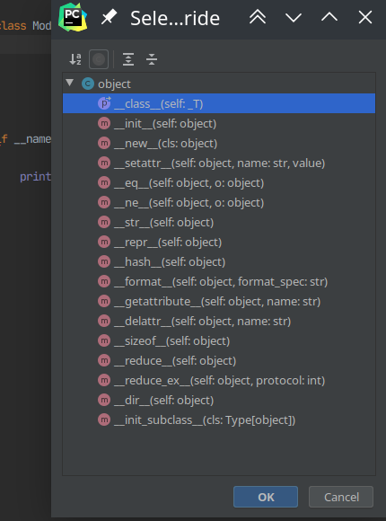
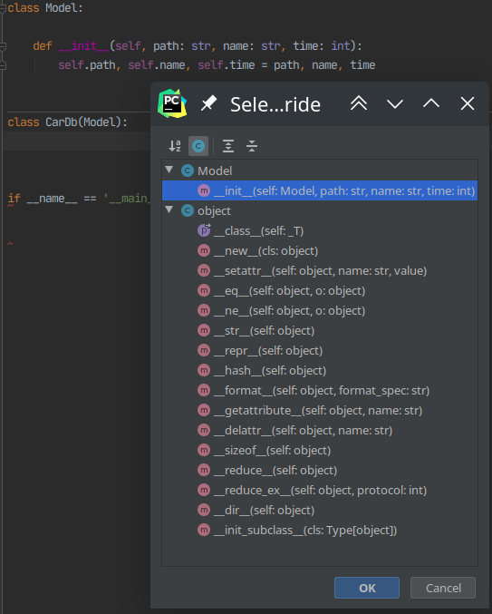
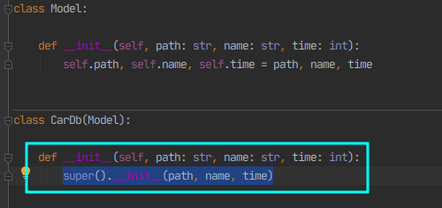

Также можно переопределять другие методы класса
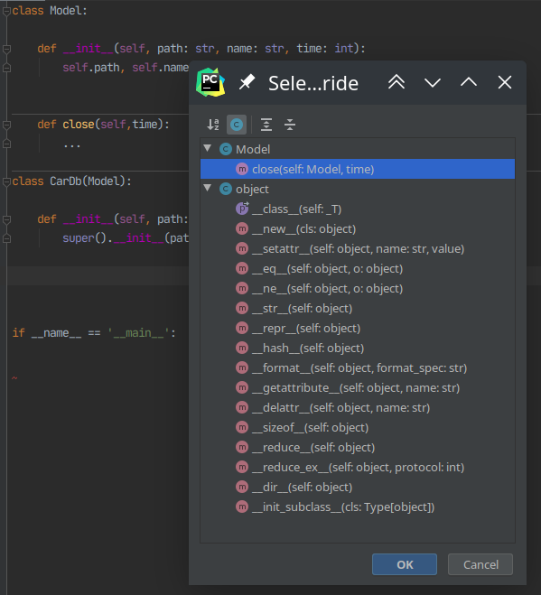
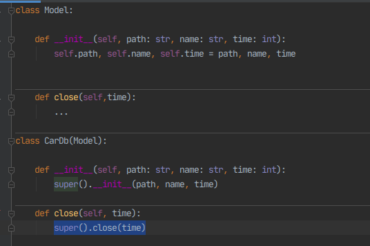

- Создать временный файл

```cmd
Ctrl + Alt + Shift + Insert
```

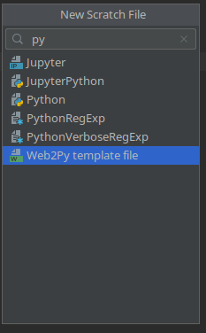

## История кода

- Список недавно изменений кода

```cmd
Ctrl + Shift + E.
```

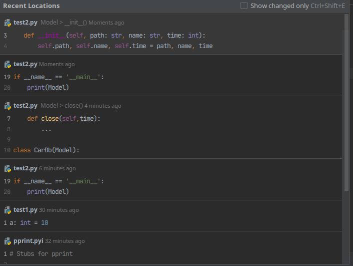

- История копирование

```cmd
Ctrl + Shift + V,
```

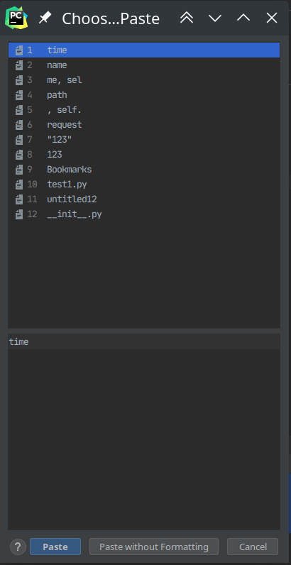

## Отладка

- Поставить точку остановки

```cmd
Ctrl + F8
```

# Использование Живых шаблонов `Live Templatse`

Пример использования `Live Templatse`
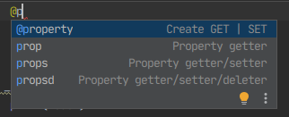
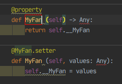

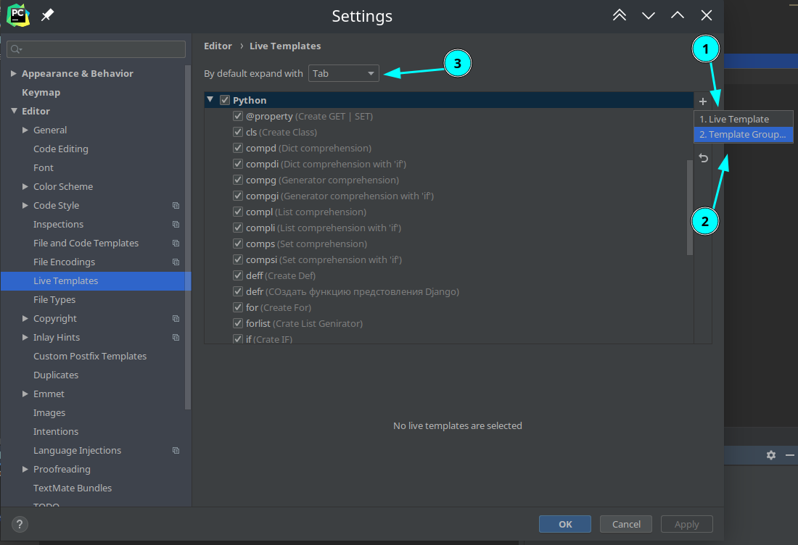

1. Добавить шаблон в текущую группу
2. Добавить группу
3. Горячая клавиша создания шаблона

Пример создания шаблона
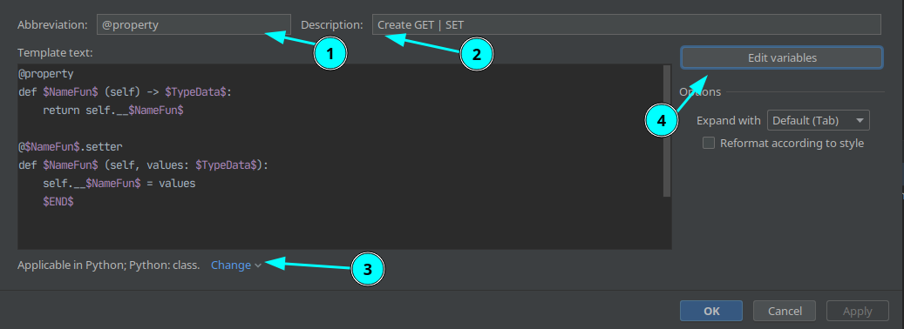

1.  Шаблонное слово
2.  Описание шаблонного слова
3.  Где будет действовать шаблон
    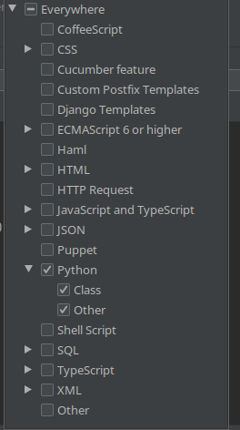
4.  Указать значения по умолчанию, и шаблонные функции
    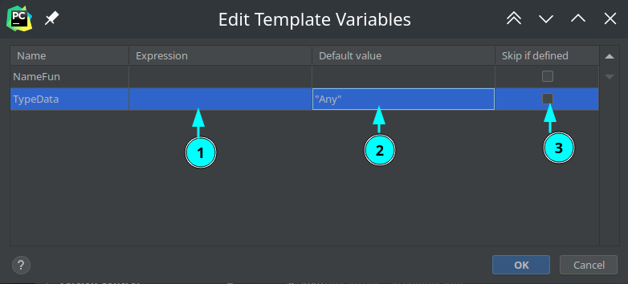

    1.  Переопределенные функции [Документация](https://www.jetbrains.com/help/idea/template-variables.html#predefined_functions).
    2.  Значение по умолчанию должно быть обязательно в двойных ковычках `" "`.
    3.  Вставить значение по умолчанию.

# Использование постфиксов `Postfix` и плагины `Custom Postfix Templates`

Пример постфикса

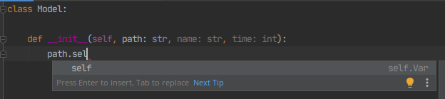


---

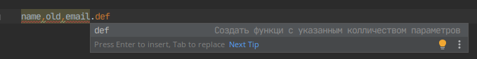
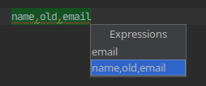
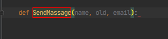

Стандартные постфиксы
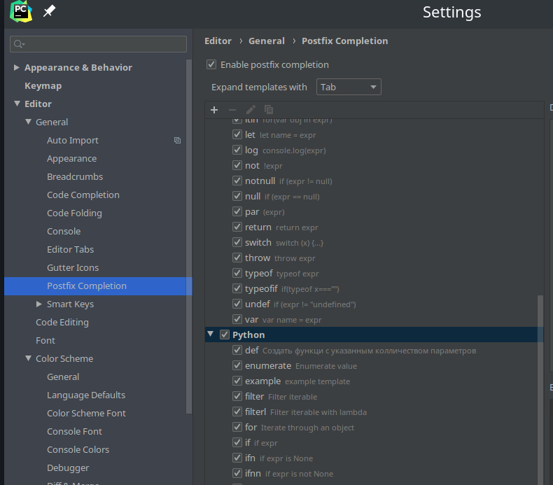

Плагин `Custom Postfix Templates`
[Ссылка на плагин](https://plugins.jetbrains.com/plugin/9862-custom-postfix-templates)

После установки плагины нажмите чтобы быстро открыть меню плагина

```bush
Ctrl + Alt + Shift + P
```

Добавить свой постфикс
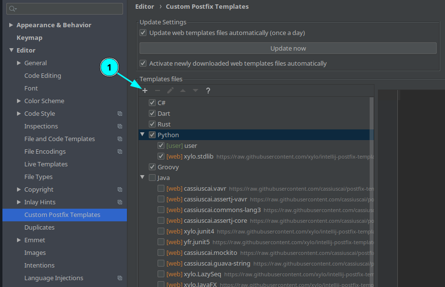

Окно с пользовательскими шаблонами

```bush
Alt + Shift + P
```

```python
.example : example template
    dict →   dict($expr$)
    str →   str($expr$)
    float →   float($expr$)
    int →   int($expr$)
    list →   list($expr$)
    tuple →   tuple($expr$)
    set →     set($expr$)
    object →   object($expr$)
    ANY  →  foo($expr$,$Name*:methodName()$)

.def : Создать функци с указанным колличеством параметров
    ANY → def $NameDef$ ($expr$):\
    $END$

.list : В list
    ANY → list($expr$)$END$

.self : self.Var
    ANY → self.$expr$ = $expr$ $END$

.type : В list
    ANY -> type($expr$)$END$

.printD : Отправить в Debugger
    ANY → printD($END$,$expr$)

```

# Работа с `Git` и подключение к `GitHab`

## Включить контроль версий

`VCS -> Enable Version Control Integration`
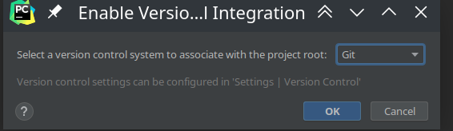

## Создать `.gitignore`

```bush
/venv
/.git
/.idea
```

## Добавляем файлы в отслеживание

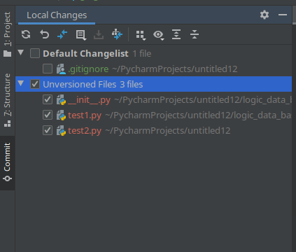

`Add to VCS`

## Создаем `commit`

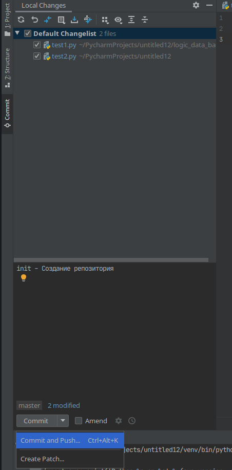

## Делаем `push`

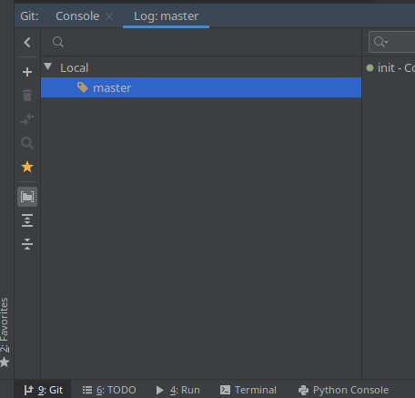

Создать удаленный сервер
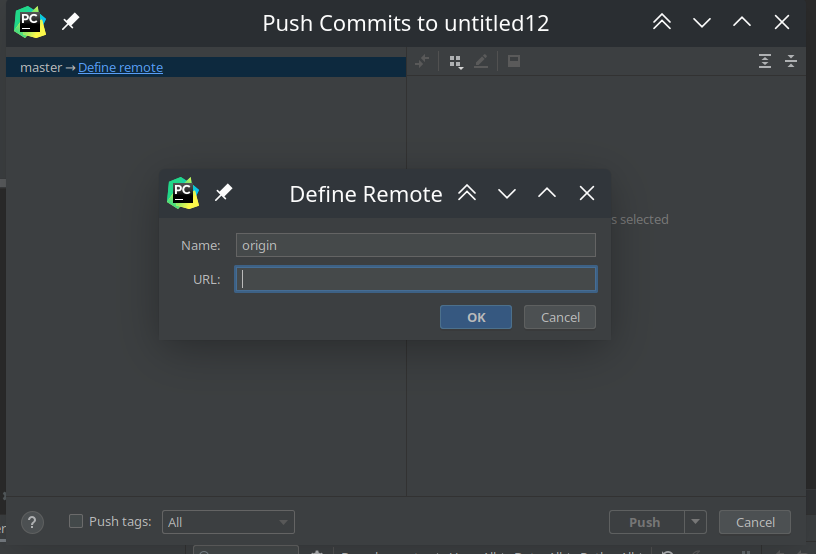

# Тестирование кода

Создаем файл с тестами

```python
import unittest


class MyTestCase(unittest.TestCase):
	def test_something(self):
		self.assertEqual(True, False)


if __name__ == '__main__':
	unittest.main()

```

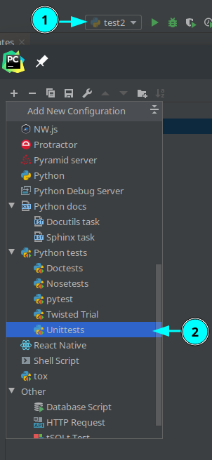

1. `Eddit Configuration`
2. Выбираем библиотеку для тестирования

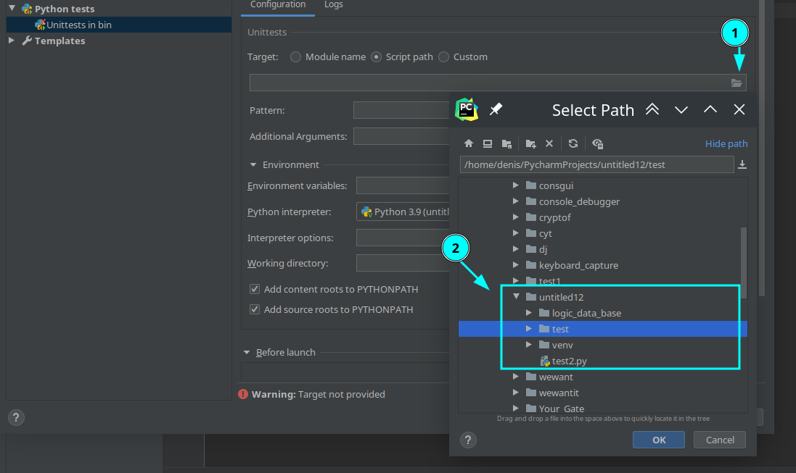

1. Указываем путь к папке с тестами, или указываем путь на весь проект
2. Если указать весь проект, то `PyCharm` по умолчанию будет искать и запускать
   файлы начинающиеся с именем `test`

Пример правильной компоновки тестов
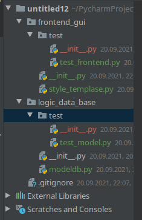

Не правильный пример, но так тоже будет работать
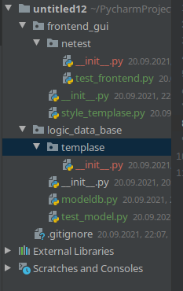
