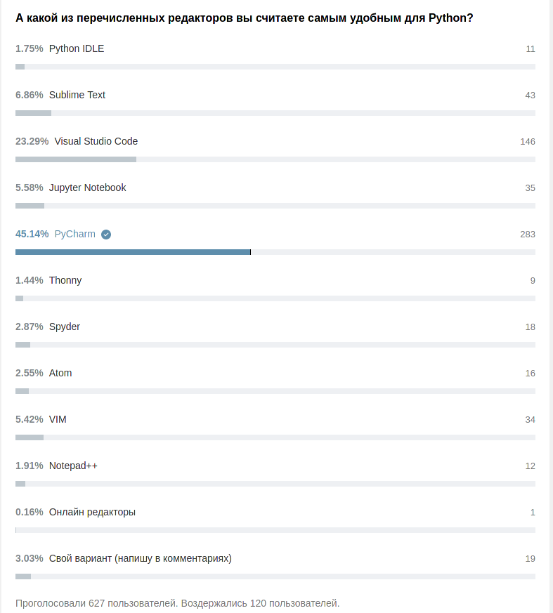

Блок 1. Основы Python

# Тема 1. Настройка IDE

## Теория:

Существуют достаточно много инструментов для написания кода. И лидирующими программы для это сейчас являются

- `PyCharm`

- `VS Code`



### Создание проекта и виртуальное окружение

`File -> New Project`


1. Путь где будет находиться проект
2. Путь где будет находиться виртуальное окружение
3. Вы можете использовать уже ранее созданные виртуальное окружения
4. Шаблоны проектов для различных Фреймворков

### Навигация в проекте

Одна из главных особенностей `PyCharm` - это возможность
автоматически изменять пути импортирования модулей при
переносе модуля


- `New` Создать файл по шаблону
- `Copy`Копировать относительный, или абсолютный путь к файлу
- `Refactor` Переименовать, переместить, Копировать файл или
    директорию
- `Show Explorer` Показать в проводнике
- `Open in Terminal` Открывает терминал, и переходит
    к ближайшей директории в котором находиться файл.
- `Local History` Можете посмотреть историю изменения файла
- `Mark Directory as` Установить папку как `Sources Root` или `Tamplate`

## Закрепление

Создать проект с виртуальным окружением, и создать свой первый скрипт на `Python`.

```python
print("Hello world")
```

# Тема 2. Базовый синтаксис

## Теория:

### История языка, сравнение с другими языками программирования, сфера его использования.

Первая версия Python создан в 1994, разработчиком по имени **Гвидо ван Россу**,
это название язык получил в память британского комика Monty Python. В этом же году была создана первая версия `CPython`.

---

Основной конкурент `Python` это `Java` и `C#`.

Чем Python лучше ?

- Изначально создан для удобного использования.
    Существует `Python Zen` и `PEP 8` которого все стараются придерживаться.
- Самое активное комьюнити в РФ.
    
- Более 1 миллиона проектов на GitHab
    

- `Python`Язык который развивается сообществом.

---

1. Веб-разработка

- `Django`
- `Flask`

2. Data Analysis

- `Numpy`
- `Pandos`
- `matplotlib`

3. ML

- `keras`
- `tensorflow`

3. Создание программ с графическим интерфейсом

- `wxPython`
- `PyQt`

4. Системное администрирование

- `sh`
- `subprocess`

[Остальные 92 области в которых применяться Python](https://github.com/vinta/awesome-python#http-clients)

---

### Принцип работы языка. Разница между компилируемым и интерпретируемым языком.

`Python`

1. Динамический, со строгой типизацией.
2. Автоматически управляет памятью.
3. Объектно-ориентированный.
4. Интерпретируемый в реализации `CPython`,
   с возможностью компилляции в машинный код `Nuitka` `Cython` `Numba`,
   и с возможность JIT компиляции в реализации `PyPy`.

---

Компилируемым:

- Исходный код программы зависит от платформы;
- Компилятор использует все возможности платформы и архитектуры;
- Скомпилированная программа может самостоятельно исполняться.

Интерпретируемым:

- Независимость от платформы;
- Меньший размер исполняемых файлов;
- Программ запускаться только через интерпретатор.

### Целочисленные `int`

Аннотация типов `Python (3.6+)`

```python
a:int = 77
b:int = 23
print(a+b)

#> 100
```

Максимально число которое может быть записано в `int` определяться
архитектурой процессора.

Например, для `x64`это `2**63 == 9_223_372_036_854_775_807` (Девять квинтиллионов)

[Видео о том как компания потеряла 500 миллионов $ из-за переполнения значения целого числа](https://www.youtube.com/watch?v=vFNfVUHb9SI)

В `Python` у значения `int` нет программных ограничений

```python
a = 9_223_372_036_854_775_807
a += 10
print(a)

# 9223372036854775817 (Девять квинтиллионов)


a = 9_223_372_036_854_775_807
a *= 9_223_372_036_854_775_807
print(a)

# 85070591730234615847396907784232501249 (Восемьдесят пять ундециллионов)
```

Проверим другой язык. Аналог `int` в `C` это `long long`

```c++
#include <iostream>

using namespace std;

int main()
{
    long long a = 9223372036854775807;

    cout << a <<'\n'; // 9223372036854775807;

    a += 10;

    cout << a; // -9223372036854775799;
    return 0;
}
```

### Дробными `float`

```python
a:float= 0.4
b:float = 0.9
print(a+b)

#> 1.3
```

Проблемы с точностью после запятой

```python
"""
Сумма
"""
a:float= 0.1
b:float = 0.2
print(a + b)

#> 0.30000000000000004
```

[Видео о том как ПВО Patriot не мог сбивать ракеты,
из-за не точности в суммировании чисел с плавающей точкой ](https://www.youtube.com/watch?v=G-TdIFOHcWY)

Решение проблемы точности после запятой, с помощью библиотеки `Decimal`(Децимал)

```python
from decimal import Decimal

a: Decimal = Decimal("0.1")
b: Decimal = Decimal("0.2")
print(a + b)

#> 0.3
```

---

Бесконечность

+∞

```bush
a = float('inf')

>>> 999999999999 < a
True
```

-∞

```bush
a = float('-inf')

>>> 0.0000000001 > a
True
```

## Закрепление

Подсчитать сколько вам сейчас месяцев

> ```python
> # Сколько мне месяцев
>
> if __name__ == "__main__":
> 	old:float = 21.7
> 	year:int  = 12
> 	print(year * old)
>
> #> 259.20000000000005
>
> ```

[Сайт на котором проверить Проверить](http://mycount.org/ru/?wm=3&inv=1&fid=6)

# Тема 3. Переменные, типы переменных. Типизация.

## Теория:

### `immutable`

`immutable` Не изменяемые тип. При присвоении значения копируются.

- `int`Челые числа
- `flaot` Числа с плавающей точкой
- `bool`Логические переменные
- `str` Строки
- `None` Отсутствие типа
- `tuple` Картежи

```python
a:int = 1

b = a

b = 0

print(b) # 0
print(a) # 1
```

### `mutable`

- `mutable` Изменяемые тип. При присвоении создаются ссылки на объект.
- `list` Список. Непрерывный участок памяти
- `set` Множество
- `dict` Словарь

```bush
a:list  = [1]

b = a

b[0] = 0

print(b)	# [0]
print(a)	# [0]
```

### Типизация

Строгая типизация `Python`

```python
a = 1
b = "10"

c = a + b # TypeError: unsupported operand type(s) for +: 'int' and 'str'

print(c)
```

Не строгая типизация `JavaScript`

```js
a = 1
b = "10"

с = a+b # Все Ок

console.log(c) # "110"
```

## Закрепление:

Будет в следующей теме

# Темы 3.1. Основные арифметические операции

## Теория:

### Виды операции

Операция:

- Арифметические операции
- Логические операции
- Присвоение / Чтение
- Операции ввода-вывода
- Переход выполнения (взаимодействие внутри программы)
- Системные операции (взаимодействие с ОС)

Инструкция = Одна стока кода.

Алгоритм = последовательность инструкций.

### Арифметические операции

| Знак     | Вызываемый метод | Описание              |
| -------- | ---------------- | --------------------- |
| `a + b`  | `__add__`        | Сложение              |
| `a - b`  | `__sub__`        | Вычитание             |
| `a * b`  | `__mul__`        | Умножение             |
| `a / b`  | `__truediv__`    | Деление               |
| `a // b` | `__floordiv__`   | Целочисленное деление |
| `a % b`  | `__mod__`        | Остаток от деления    |
| `a ** b` | `__pow__`        | Возведение в степень  |

```python
a = 13
b = 7

a = a+b # 20
```

| Знак      | Вызываемый метод |
| --------- | ---------------- |
| `a += b`  | `__iadd__`       |
| `a -= b`  | `__isub__`       |
| `a *= b`  | `__imul__`       |
| `a /= b`  | `__itruediv__`   |
| `a //= b` | `__ifloordiv__`  |
| `a %= b`  | `__imod__`       |
| `a **= b` | `__ipow__`       |

```python
a = 13
b = 7

a+=b # 20
```

## Закрепление.

Извлечь квадратный корень из числа 25


> ```python
> num = 25
> sqrt = num ** 0.5
>
> print(sqrt) # 5.0
> ```

---

Дано:

- Расстояние от Земли от солнца: 149 600 000 км
- Скорость света: 299 792 458 `м/c`

Вопрос:

- Сколько времени потребуется свету, чтобы преодолеть дистанцию от Солнца до Земли ?

> ```python
> # Сколько времени потребуется свету, чтобы преодолеть дистанцию от Солнца до Земли
>
> # 1км == 1000м
>
> if __name__ == '__main__':
> 	Earth_kilometers = 149_600_000
> 	speed_light_meter_second = 299_792_458
> 	a = Earth_kilometers * 1000
>
> 	print(a) # 149600000000
>
> 	c = a / speed_light_meter_second
> 	print(c) # 499.01188641643546
>
> 	c /= 60
> 	print(c) # 8.316864773607257
> ```

# Тема 4. Условные конструкции

## Теория:

### Виды логических операций

| Знак     | Вызываемый метод | Описание                          |
| -------- | ---------------- | --------------------------------- |
| `a == b` | `__eq__`         | Равенство значений                |
| `a != b` | `__ne__`         | Неравенство значений              |
| `a >= b` | `__ge__`         | Больше или равно                  |
| `a <= b` | `__le__`         | Меньше или равно                  |
| `a > b`  | `__gt__`         | Больше                            |
| `a < b`  | `__lt__`         | Меньше                            |
| `a is b` |                  | Указывают на один и тот же объект |

```python
if __name__ == '__main__':
	res = input("Python динамический язык ? (y/n): ")
	if res == "y":
		print("Это правильный ответ")
	else:
		print("Это не правильный ответ")
```

---

Пример `a is b`

```python
a = [1]
b = [1]

print((a == b)) # True
print((a is b)) # False


print(id(a)) # 140380746996800
print(id(b)) # 140380743800320
```

Пример `a == b`

```python
a = 1
b = 1

print((a == b)) # True
print((a is b))	# True

print(id(a)) # 140569467918640
print(id(b)) # 140569467918640
```

### Стандартный условный оператор.

```python
if <Выражение1 Выражение2 ... Выражение3>:
	...

elif <Выражение1 Выражение2 ... Выражение3>:
	...

else:
	...
```

Пример где применять стандартный условный оператор.

```python
# Двери на скалде
if __name__ == '__main__':

   total_doors_warehouse = -1

 if total_doors_warehouse >= 1:
      print("Двери есть в наличии")

   elif total_doors_warehouse < 0:
      raise ValueError("Отрицательно количество дверей")

   else:
      print("Дверей нет в наличии")
```

---

### Тернарный условный оператор.

```python
<Ответ> if <Выражение1 Выражение2 ... Выражение3> else ...
```

Пример где применять тернарный условный оператор.

```python
# Пороговая функции активации

response_neural_network = 0.7

res = 1 if response_neural_network >= 0.5 else 0

print(res) # 1
```


### `switch case` на `Python`

```python
# Горячие клавиши

ArrHotKey = {
		"Ctrl+C"   : "Копировать текст",
		"Ctrl+V"   : "Вставить текст",
		"Ctrl+X"   : "Вырезать текст",
		"Win+Space": "Копировать текст",
		}

if __name__ == '__main__':
	hotkey = "Ctrl+C

	res = ArrHotKey.get(hotkey, None)

	print(res) if res else  print("Не известная комбинация клавиш")

#[Реальный пример использования](https://github.com/denisxab/keyboard_capture/blob/master/app/logic.py)
```

## Закрепление:

Пример программы для разбора.

```python
# Регистрации пользователя
from typing import NamedTuple


class UserDataClass(NamedTuple):
	name: str
	email: str


UpperSymbol = ['Q',               'W',               'E',
               'R',               'T',               'Y',
               'U',               'I',               'O',
               'P',               'A',               'S',
               'D',               'F',               'G',
               'H',               'J',               'K',
               'L',               'Z',               'X',
               'C',               'V',               'B',
               'N',               'M', ]


if __name__ == '__main__':
	response_user = input("Введите ваш email: ")
	if "@" in response_user:
		email = response_user
	else:
		exit("Некорректный email")

	response_user = input("Укажите ваш имя  с заглавной буквы: ")
	if response_user[0] in UpperSymbol:
		name = response_user
	else:
		exit("Некорректное имя")

	user = UserDataClass(name=name, email=email)
	print(user)


# Введите ваш email: denis@rma
# Укажите ваш имя  с заглавной буквы: Denis
# UserDataClass(name='Denis', email='denis@rma')
```

# Тема 4.1. Циклы. Цикл for, while.

## Теория:

### `for` Пример итерации по массиву

```python
for <item> in <obj.__iter__()>:
	...

	# <obj.__next__()>
```

range(`<start>,<stop>,<steep>`) → `int`

```python
# Пример создания массива с псевдослучайными числами

N = 10
a = []
for i in range(1,N,1):
	a.append(1277 % i)
print(a)

#> [0, 1, 2, 1, 2, 5, 3, 5, 8]
```

enumerate(`<__iter__>`) → `tuple[int,obj]`

```python
# Нумерация фамилий

array_name = [
		"Иванов",
		"Петров",
		"Сидоров",
		"Веткин",
		]

for index, name in enumerate(array_name):
	print(index, name)

# 0 Иванов
# 1 Петров
# 2 Сидоров
# 3 Веткин
```

zip(`<arr_A>`,`<arr_B>`) → `tuple[obj,obj]`

```python
# Контактные даннык

array_name = [
		"Иванов",
		"Петров",
		"Сидоров",
		"Веткин",
		]

array_phone_number = [
		89291207106,
		89291045106,
		892923007106,
		892910074446,
		]

array_contact_details = {}
for name, number in zip(array_name, array_phone_number):
	array_contact_details[name] = number

print(array_contact_details)

#{'Иванов': 89291207106, 'Петров': 89291045106, 'Сидоров': 892923007106, 'Веткин': 892910074446}
```

---

Использование `continue`

```python
# Излишки товаров на складе

array_warehouse: dict[str, int] = {
		"Шкафы"   : 3,
		"Ковры"   : 5,
		"Телефоны": 10,
		"Кровати" : 7,
		}

surplus_goods: int = 0
for _name_item, _count in array_warehouse.items():
	if _count > 4:
		if _name_item == "Телефоны":
			continue
		surplus_goods += _count

print(surplus_goods)

#> 12
```

---

Использование `break`

```python
# Поиск сменщика

array = [
		[8, "Ваня", 8922307124, "vany@google.com"],
		[9, "Петя", 89293007124, "pety@google.com"],
		[11, "Олег", 892910074312, "oleg@google.com"],
		[12, "Сергей", 89292317124, "sergoi@google.com"],
		[16, "Катя", 892913107124, "katy@google.com"],
		[14, "Маша", 8929147124, "masha@google.com"],
		]

required_time = 11 # У кого начинаться смена 11 часов ?

people_work_shift:list = []
for _item in array:
	if _item[0] == required_time:
		people_work_shift = _item
		break
else:
	print("В это время не у кого нет смены")

print(people_work_shift)

#> [11, 'Олег', 892910074312, 'oleg@google.com']
```

`break` останавливает только внутренний цикл, и не влияет на выше стоящий

```python
for _x in range(10):
	for _i in range(2):
		if _x == 2:
			break

	print(_x, end=" ")

# 0 1 2 3 4 5 6 7 8 9
```

Как остановить главный цикл из вложенного

```python
for _x in range(10):
	try:
		for _i in range(2):
			if _x == 2:
				raise StopIteration
	except StopIteration:
		break
	print(_x, end=" ")

# 0 1
```

### Знакомство с `itertools`

[Все итераторы](https://docs.python.org/3/library/itertools.html)

chain(`<obj.__iter__>, <obj.__iter__>, ..., `) Соединить массивы

```python
from itertools import chain

if __name__ == '__main__':

	a = [1, 2, 3]
	b = [4, 5, 6]
	c = [7, 8, 9]

	for x in chain(a, b, c):
		print(x, end=" ")

# 1 2 3 4 5 6 7 8 9
```

cycle(`<obj.__iter__>`) Бесконечно итерироваться по одному и тому же массиву

```python
# Распределить месяцы для вахт
from itertools import cycle

if __name__ == '__main__':

	a = ["Петя", "Коля"]
	b = [1, 2, 3, 4, 5, 6, 7, 8, 9, 10, 11, 12]

	for  _name,_month in zip(cycle(a), b): #  zip прервет итерацию, когда закончиться один из массивов
		print(f"{_name}:\t{_month}"


# Петя:	1
# Коля:	2
# Петя:	3
# Коля:	4
# Петя:	5
# Коля:	6
# Петя:	7
# Коля:	8
# Петя:	9
# Коля:	10
# Петя:	11
# Коля:	12
```

takewhile(`<fun>, <obj.__iter__>`) Выполняет итерации, пока функция возвращает `True`. Противоположность `dropwhile()`

```python
from itertools import takewhile


def test_fun(var):
    if var % 4:
        return True
    return False


if __name__ == '__main__':
    a = [1, 2, 3, 4, 5, 6]
    for x in takewhile(test_fun, a):
        print(x)

# 1
# 2
# 3
```

### `while`

```python
while <Выражение1 Выражение2 ... Выражение3>:
	...
```

Использование `while`

```python
# Нахождение НОД (Наибольшего общего делителя)

a = 50
b = 130

while a != 0 and b != 0:
	if a > b:
		a = a % b
	else:
		b = b % a

print(a + b)
```

### `__iter__` | `__next__`

Пример как получить четные числа

```python
# Получить четные числа

class EvenNumbers:
	def __init__(self, end): # 1
		self.end = end

	def __iter__(self): # 2
		self.next_val = 2
		self.count = 0
		return self

	def __next__(self): # 2.5, 3, 4 ... , N
		if self.count < self.end:
			self.next_val *= 2

			self.count+=1
			return self.next_val
		else:
			raise StopIteration


if __name__ == '__main__':
	for x in EvenNumbers(5):
		print(x)

# 4
# 8
# 16
# 32
# 64
```

## Закрепление:

---

Задание:<br>
Найти наименьшее число в массиве

> ```python
> # Пример поиска минимума в массиве
> array = [77, 10, 2, 233, 0, 99, 1]
>
> last_num = array[0]  # 77
> for i in array:
> 	if i < last_num:
> 		last_num = i
> print(last_num)
>
> ```

---

Задание:<br>
Получить 10 нечетных отрицательных чисел

> ```python
> # Получить 10 нечетных отрицательных чисел
> class NegativeNumbers:
> 	def __init__(self, end):  # 1
> 		self.end = end
>
> 	def __iter__(self):  # 2
> 		self.next_val = -1
> 		self.count = 0
> 		return self
>
> 	def __next__(self):  # 3
> 		if self.count < self.end:
> 			self.next_val *= 3
>
> 			self.count += 1
> 			return self.next_val
> 		else:
> 			raise StopIteration
>
>
> if __name__ == '__main__':
> 	for x in NegativeNumbers(10):
> 		print(x)
> ```

# Тема 5. Ввод - вывод, файловый ввод вывод.

## Теория:

### Ввод - вывод

- input(`<"Текст_в_консоль"="">`) → `str`
- print(`<"Текст_в_консоль"="">, *args, sep=' ', end='\n', file=None`) вызывает `__str__`

Пример пин-код

```python
# Пример пин-код
pin_cod_db = 6628 # 2209

pin_cod_user = int(input("Введите пин-код: "))

if 3*pin_cod_user+1 == pin_cod_db:
	print("Пик-код верный")
else:
	print("Пик-код не верный")
```

### Файловый ввод вывод

Сохранить настройки в файл

```python
# Сохранить в файл настройки
if __name__ == '__main__':
    with open('text1', "w") as MyFile:
        print("Green", file=MyFile) # Вызывает метод `MyFile.write("Green")`

    with open('text1', "r") as MyFile:
        color = MyFile.read()
        print(color) # Green
```

Зачем нужно закрывать файлы

```python
if __name__ == '__main__':
	MyFile2 = open('text1', "w")
	print("Black", file=MyFile2)

	# MyFile2.close() #!

	MyFile1 = open('text1', "r")
	print(MyFile1.read())
```

Как устроен `with`

```python
class controlled_execution:
	def __enter__(self):
		self.file = []
		print(f"__enter__ {self.file}")
		return self

	def write(self, text: str):
		print("write", end=" :\t")
		self.file = text
		print(f"Привет {self.file}. Данные записаны")

	def __exit__(self, type, value, traceback):
		print(f"__exit__ :\t{'Файл закрыт'}")


if __name__ == '__main__':
	with controlled_execution() as thing:
		thing.write("Denis")
		raise StopIteration #!
		print(f'thing.file == {thing.file}')

```

[Пример сохранения геометрии и положения окна](https://github.com/denisxab/console_debugger/blob/master/gui/tk_terminal.py)

## Закрепление:

Создать свой зашифрованный токен, и сохранить его в файл

```python
# Создать свой зашифрованный токен, и сохранить его в файл
if __name__ == '__main__':
	token = 12345
	_secret_token = token * 3 + 5
	with open("text1", "w") as f:
		print(_secret_token, file=f)

	with open("text1", "r") as f:
		fr = f.read()
		print(fr)
```

# Тема 6.1. Строки. Основные операции со строками

## Теория:

Строки в `Python` могут храниться в кодировке `utf-2` `utf-8` `utf-16`. Кодировка определяется
автоматически

### Форматирование строк

```python
# Падеж для возроста
from typing import Union


def GetMaturityOld(age: Union[int, str]):
	age = str(age)

	if age in ["11", "12", "13", "14"]:
		return "лет"
	if age[-1] == '1':
		return 'год'
	elif age[-1] in '234':
		return "года"
	else:
		return "лет"


if __name__ == '__main__':
	first_name = "Denis"
	last_name = "Kustov"
	old = 21

	_tmp = f"Меня зовут {first_name} {last_name} мне {old} {GetMaturityOld(old)}"

	_tmp = "Меня зовут {} {} мне {} {}".format(first_name, last_name, old, GetMaturityOld(old))

	_tmp = "Меня зовут {fn} {ln} мне {old} {mt}".format(fn=first_name, ln=last_name, old=old, mt=GetMaturityOld(old))
	print(_tmp)

# Меня зовут Denis Kustov мне 21 год
```

### Основные операции со строками

| Команда                                                                            | Описание                                                                                   |
| ---------------------------------------------------------------------------------- | ------------------------------------------------------------------------------------------ |
| len(`<str>`)→`int`                                                                 | Длинна итерируемого объекта (`__len__`)                                                    |
| **str**.find(`<ИскомоеСлово>, <start>, <end>`) → `int`                             | Поиск подстроки в строке. Возвращает номер первого вхождения или -1                        |
| **str**.refind(`<ИскомоеСлово>, <start>, <end>`) → `int`                           | Поиск подстроки в строке. Возвращает номер последнего вхождения или -1                     |
| **str** `*` `<3>` →`str`                                                           | Повторить строку                                                                           |
| **str_A** + **str_B** → `str`                                                      | Конкатенация                                                                               |
| **str**[`<Индекс>`] → `str`                                                        | Обращение по индексу                                                                       |
| **str**[`<start>:<stop>:<steep>`] → `str`                                          | Слайс (`__getitem__`)                                                                      |
| **str**.replace(`'<ИскатьЭто>', '<ЗаменитьНа>', <МаксимальноеЧислоЗамен>`) → `str` | Замена слов в строке, на шаблон                                                            |
| **str**.split(`'<РазделитьПоСимволу>'`) → `lsit`                                   | Разделяет строку по указанным символам                                                     |
| **str**.isdigit() → `bool`                                                         | Состоит ли вся строка из цифр                                                              |
| **str**.isalpha() →`bool`                                                          | Состоит ли вся строка из букв                                                              |
| **"РазделительСимволом"**.join(`<List>`) → `str`                                   | Собрать строку из списка, через разделитель !(Все элементы массива должны быть типа `str`) |
| **str**.count(`<ИскомоеСлово>,<start>, <end>`)                                     | Подсчитать количество слов в строке                                                        |
| **str**.strip(`<СимволКоторыйУдалить>`)                                            | Обрезать стоку, по указанному символы, в начале и в конце                                  |

[Все методы строк](https://pythonworld.ru/tipy-dannyx-v-python/stroki-funkcii-i-metody-strok.html)

---

Поиск подстроки в строке `find()`

```python
string = "Меня зовут Denis Kustov мне 21 год"
print(string.find("21", 0, 10)) # -1

print(string.find("21", 0))  # 28
```

---

Замена слова по шаблону `replace()`

```python
string = "Меня зовут Denis Kustov мне 21 год"
print(string.replace("21 год", "22 года")) # Меня зовут Denis Kustov мне 22 года

string = "10+22+33+5-6*7"
print(string.replace("+", "-",2)) # 10-22-33+5-6*7
```

---

Использование `split()`

```python
string = "Меня зовут Denis Kustov мне 21 год"
print(string.split(" "))  # ['Меня', 'зовут', 'Denis', 'Kustov', 'мне', '21', 'год']

string = "  \t Меня зовут \nDenis Kustov мне 21 год  "
print(string.split(" "))  # ['', '', '\t', 'Меня', 'зовут', '\nDenis', 'Kustov', 'мне', '21', 'год', '', '']

string = "  \t Меня зовут \nDenis Kustov мне 21 год  "
print(string.split())  # ['Меня', 'зовут', 'Denis', 'Kustov', 'мне', '21', 'год']

string = "https://pythonz.net/references/named/str.split"
print(string.split("/")[2:])  # ['pythonz.net', 'references', 'named', 'str.split']
```

---

Конвертируем данные для записи в cvs файл через `join()`

- Неправильно

```python
array_name = [
		[0, "Иванов", ],
		[1, "Петров", ],
		[2, "Сидоров", ],
		[3, "Веткин", ],
		]

file = ""
for item in array_name:
	file += ", ".join(item) #TypeError: sequence item 0: expected str instance, int found
	file+='\n'

print(file)
```

- Относительно правильно

```python
array_name = [
		[0, "Иванов", ],
		[1, "Петров", ],
		[2, "Сидоров", ],
		[3, "Веткин", ],
		]

file = ""
for item in array_name:
	item[0] = str(item[0]) #!

	file += ", ".join(item)
	file+='\n'

print(file)


# 0, Иванов
# 1, Петров
# 2, Сидоров
# 3, Веткин
```

- Правильно

```python
array_name = [
		[0, "Иванов", ],
		[1, "Петров", ],
		[2, "Сидоров", ],
		[3, "Веткин", ],
		]

file = ""
for item in array_name:

	file += ", ".join(str(x) for x in item) #!
	file+='\n'

print(file)

# 0, Иванов
# 1, Петров
# 2, Сидоров
# 3, Веткин
```

---

Подсчитать все указанные слова в строке `count()`

```python

if __name__ == '__main__':
	string = """
Россия — священная наша держава,
Россия — любимая наша страна.
Могучая воля, великая слава —
Твоё достоянье на все времена!
"""
	print(string)
	print(string.count("Россия")) # 2

```

---

Обрезать указанные символы в строке, в начале, и в конце`strip()`

```python
name = "_Denis_1_"
print(name) # _Denis_1_
print(name.strip("_")) # Denis_1

```

---

Переопределяем слайсы `__getitem__`

```python
# Переопределяем слайсы
from typing import Union


class Vector:
	def __init__(self, lst):
		self.lst = lst

	def __getitem__(self, item: Union[int, slice]):
		# Проверяем что передан срез
		if isinstance(item, slice):  # slice(2, 5, None)
			return self.lst[item.start:item.stop:item.step]
		else:
			return self.lst[item]

	def __repr__(self) → str:
		return str(self.lst)


if __name__ == '__main__':
	x = Vector([0, 1, 2, 3, 4, 5, 6, 7, 8, 9])
	print(x)
	print(x[2:5])
```

---

Все символы `Ascii`

```python
import string

print(string.ascii_letters) # abcdefghijklmnopqrstuvwxyzABCDEFGHIJKLMNOPQRSTUVWXYZ

print(string.ascii_lowercase) # abcdefghijklmnopqrstuvwxyz

print(string.ascii_uppercase) # ABCDEFGHIJKLMNOPQRSTUVWXYZ

print(string.digits) # 0123456789

print(string.punctuation) # !"#$%&'()*+,-./:;<=>?@[\]^_`{|}~
```

## Закрепление

> Разбираем задачи

Дана строка, проверить, что она является палиндромом

```python
def isPalindrome(palemorf):
	palemorf = ''.join(palemorf.split())
	# Используем встроенную функцию
	rev = ''.join(reversed(palemorf))

	# Проверяем строки на равенство
	return True if palemorf == rev else False


if __name__ == '__main__':
	_string = "лёша на полке клопа нашёл"
	ans = isPalindrome(_string)
	print(ans)

```

Подобрать пин-код

```python
# Брутфорс
import string
from random import *

PASSWORD = "1010"

if __name__ == '__main__':

	guess = "" # Переменная для сравнения с паролем
	letters = string.digits # Дата сет с числами для брутфорса
	_max_index = len(letters) - 1 # Ограничение для индекса  `randint`
	_index = 0 # Для статистики
	while guess != PASSWORD:
		guess = ""
		for letter in PASSWORD:
			guess_letter = letters[randint(0, _max_index)]
			guess = f"{guess_letter}{guess}"

		_index += 1
		print(f"{_index}: {guess}")

	print(f"Password = {guess}")
```

# Тема 6.2. Встроенные структуры данных

## Теория:

### tuple

#### Неизменяемость `tuple`

> Фиксированная длина

Вы не можете изменять элементы в кортеже:

```python
>>> a = (1,2,3)
>>> a[0] = 10
Traceback (most recent call last):
  File "<stdin>", line 1, in <module>
TypeError: 'tuple' object does not support item assignment
```

Но вы можете изменить изменяемые объекты:

```python
>>> b = (1,[1,2,3],3)
>>> b[1]
[1, 2, 3]
>>> b[1].append(4)
>>> b
(1, [1, 2, 3, 4], 3)
```

Одинаковые кортежи ссылаются на один и тот же объект

```python
if __name__ == '__main__':
	a = (1, 2, 3, 1, 2, 3, 1, 2, 3, 1, 2, 3)
	b = (1, 2, 3, 1, 2, 3, 1, 2, 3, 1, 2, 3)

	print(id(a)) # 140009012709696
	print(id(b)) # 140009012709696
```

Обратное правило - разные картежи ссылаются на разные объекты

```python
if __name__ == '__main__':
	a = (1, 2, 3, 1, 2, 3, 1, 2, 3, 1, 2, 9)
	b = (1, 2, 3, 1, 2, 3, 1, 2, 3, 1, 2, 3)

	print(id(a)) # 139951179315520
	print(id(b)) # 139951179571552
```

#### Api `tuple`

Мы можем только получать данные из `tuple`

```python
if __name__ == '__main__':
	a = (1, 2, 3, 1, 2, 3, 1, 2, 3, 1, 2, 9)

	print(a[2:5])  # (3, 1, 2)
	print(a + a)  # (1, 2, 3, 1, 2, 3, 1, 2, 3, 1, 2, 9, 1, 2, 3, 1, 2, 3, 1, 2, 3, 1, 2, 9)
	print(a[3])  # 1
	print(a.count(3))  # 3
	print(len(a))  # 12

```

### namedtuple

#### Характеристика

[Cпециализированные типы](https://docs.python.org/3/library/collections.html))

`namedtuple` Именованный картеж

### list

#### Характеристика


[Асимптотика](https://pythonz.net/references/named/slozhnost-operatsii-so-spiskami/)

- Доступ к элементу О(1)
- Вставка | удаление в конец О(1 амортизированное)
- Вставка | удаление в начало О(n)

#### Api `list`

| Метод                                                     | Описание                                                                                                         |
| --------------------------------------------------------- | ---------------------------------------------------------------------------------------------------------------- |
| list.append(`<ЧтоДобавить>`)                              | Добавляет элемент в конец списка                                                                                 |
| list.extend(`<NewList:list>`)                             | Расширяет список list, добавляя в конец все элементы списка L                                                    |
| list.insert(`<index>`, `<ЧтоДобавить>`)                   | Вставляет перед `<index>` значение `<ЧтоДобавить>`                                                               |
| list.remove(`<ЧтоУдалить>`)                               | Удаляет первый элемент в списке, имеющий значение `<ЧтоУдалить>`. ValueError, если такого элемента не существует |
| list.pop(`<index>`) -> `obj`                              | Удаляет элемент по индексу, и возвращает его. Если индекс не указан, удаляется последний элемент                 |
| list.index(`<ЧтоИскать>, <start:int> <end:int>`) -> `int` | Возвращает `<index>` первого элемента со значением `<ЧтоИскать>` (при этом поиск ведется от `start` до `end`)    |
| list.count(`<ЧтоИскать>`) -> `int`                        | Возвращает количество элементов со значением x                                                                   |
| list.sort(`[key=функция], reverse=False`)                 | Сортирует список на основе функции                                                                               |
| list.reverse()                                            | Разворачивает список                                                                                             |
| list.copy() ->`list`                                      | Поверхностная копия списка                                                                                       |
| list.clear()                                              | Очищает список                                                                                                   |

---

`.insert()`

```python
if __name__ == '__main__':
	a = [1, 2, 3, 1, 2, 3, 1, 2, 3, 1, 2, 9]
	a.insert(1,"H")
	print(a) # [1, 'H', 2, 3, 1, 2, 3, 1, 2, 3, 1, 2, 9]
```

---

`.remove()`

```python
if __name__ == '__main__':
	a = ["Дом","Телевизор","Мост"]
	a.remove("Телевизор")
	print(a) # ['Дом', 'Мост']
```

---

`.pop()`

```python
if __name__ == '__main__':
	a = ["Дом","Телевизор","Мост"]
	a.pop()
	print(a)
```

```python
if __name__ == '__main__':
	a = ["Дом","Телевизор","Мост"]
	a.pop(0)
	print(a)
```

---

`.index()`

```python
if __name__ == '__main__':
	a = ["Дом","Телевизор","Мост"," Дом"]
	print(a.index("Телевизор")) # 1
	print(a.index("Дом")) # 0
```

---

`.sort()`


Простой пример использования **устойчивой** сортировки. (Не требует дополнительной памяти) (`Timsort`)

```python
if __name__ == '__main__':
	a = [3, 4, 2, 56, 1, 23, 56]

	print(a) # [3, 4, 2, 56, 1, 23, 56]
	print(id(a)) # 139822752937600

	a.sort()

	print(a) # [1, 2, 3, 4, 23, 56, 56]
	print(id(a)) # 139822752937600

```

Как использовать ананимную функцию в сортировки

```python
from typing import NamedTuple


class User(NamedTuple):
	evaluations: int

if __name__ == '__main__':
	arr = [User(x) for x in range(5, 1, -1)]

	print(arr) # [User(evaluations=5), User(evaluations=4), User(evaluations=3), User(evaluations=2)]
	print(id(arr)) # 139699357231552

	arr.sort(key=lambda k: k.evaluations)

	print(arr) # [User(evaluations=2), User(evaluations=3), User(evaluations=4), User(evaluations=5)]
	print(id(arr)) # 139699357231552

```

---

`.reverse()`

```python
if __name__ == '__main__':
	a = [1, 2, 3, 4, 5]
	print(a)  # [1, 2, 3]
	a.reverse()
	print(a)  # []
```

---

`.copy()`

List при доболвение элементов в него, всегда один указывает на один и тот же объект

```python
# List при доболвение элементов в него, всегда один указывает на один и тот же объект

if __name__ == '__main__':
   a = [1, 2, 3, 1, ]
   print("do\t\t", id(a))

   for x in range(1_000_000):
      a.append(x)
   print("after\t", id(a))

# do	140118270103369
# after	140118270103369
```

Но при копировании такого не происходит

```python
# Но при копировании такого не происходит
if __name__ == '__main__':

	a = [1, 2, 3, 1, ]
	print("do\t\t", id(a))

	a = a.copy()

	print("after\t", id(a))

# do	140118270240576
# after	140118270103360
```

Пример объясняющий, что такое поверхностное копии

```python
# Пример поверхностной копии
if __name__ == '__main__':


	a = [1, 2, 3,]
	b = a.copy()
	print(a) # [1, 2, 3]
	a[1] = "H"
	print(b)  # [1, 2, 3]


	a = [1, [1,2,3], 3,]
	b = a.copy()
	print(a) # [1, [1, 2, 3], 3]
	a[1][0] = "H"
	print(b) # [1, ['H', 2, 3], 3]
```

Пример глубокого копии

```python
# Пример глубокого копии
import copy

if __name__ == '__main__':
	a = [1, [1,2,3], 3,]
	b = copy.deepcopy(a)
	print(a) # [1, [1, 2, 3], 3]
	a[1][0] = "H"
	print(b) # [1, [1, 2, 3], 3]

```

---

`.clear()`

```python
if __name__ == '__main__':
	a = [1, 2, 3]
	print(a) # [1, 2, 3]
	a.clear()
	print(a) # []
```

---

#### Многомерные массивы

```python
if __name__ == '__main__':
	arr = [
			[1, 2, 3],
			[4, 5, 6],
			[7, 8, 9],
			]

	for _x in arr:
		for _y in _x:
			print(_y, end=", ")

# 1, 2, 3, 4, 5, 6, 7, 8, 9,
```

#### Генераторы списков (list comprehension)

### deque

#### Характеристика

[Cпециализированные типы](https://docs.python.org/3/library/collections.html))

`deque`Очередь. Двусвязный список


[Асимптотика](https://docs.python.org/3/library/queue.html)

- Доступ к элементу О(n)
- Вставка | удаление в конец О(1 амортизированное)
- Вставка | удаление в начало О(1)

### set

#### Характеристика


[Асимптотика](https://pythonz.net/references/named/slozhnost-operatsii-so-mnozhestvami/)

- Доступ к элементу О(1)
- Вставка О(1 амортизированное)

#### Api `set`

#### Генератор множества (set comprehension)

### dict

#### Характеристика


[Асимптотика](https://pythonz.net/references/named/slozhnost-operatsii-so-mnozhestvami/)

- Доступ к элементу О(1)
- Вставка О(1 амортизированное)

#### Api `dict`

| Метод                                              | Описане                                                                    |
| -------------------------------------------------- | -------------------------------------------------------------------------- |
| dict.get(`<ЧтоИскать>,<ВернутьЕслиНету>`) -> `obj` | возвращает значение ключа, но если его нет, возвращает `<ВернутьЕслиНету>` |
| dict.items()                                       |                                                                            |
|                                                    |                                                                            |
|                                                    |                                                                            |

#### Генератор словаря (dictionary comprehension)

## Закрепление:

# Стандартные функции

## Теория:

## Закрепление:

# Свои функции

## Теория:

Копирование переменных

```python
def test4(a):
	print("test4\t", id(a))


def test3(a):
	print("test3\t", id(a))
	test4(a)


def test2(a):
	print("test2\t", id(a))
	a = a.copy() # !!!!
	test3(a)


def test1(a):
	print("test1\t", id(a))
	# a = ["1", "2"]
	test2(a)


if __name__ == '__main__':
	a = [1, 2, 3, 1, 2, 3, 1, 2, 3, 1, 2, 3, 1, 2, 3, 1, 2, 3, 1, 2, 3, 1, 2, 3, 1, 2, 3, ]
	print("main\t", id(a))
	test1(a)
	print("main\t", id(a))

# main	 140303703459648
# test1	 140303703459648
# test2	 140303703459648
# test3	 140303703322432
# test4	 140303703322432
# main	 140303703459648
```

### Выражения-генераторы (generator expressions)

## Закрепление:
