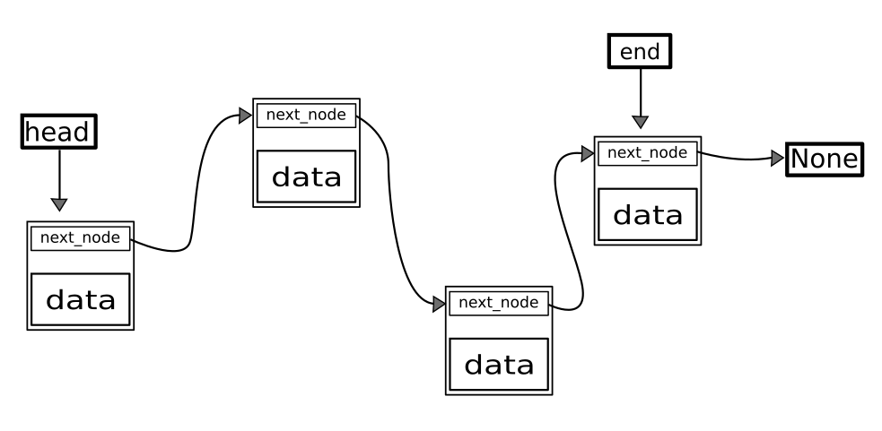
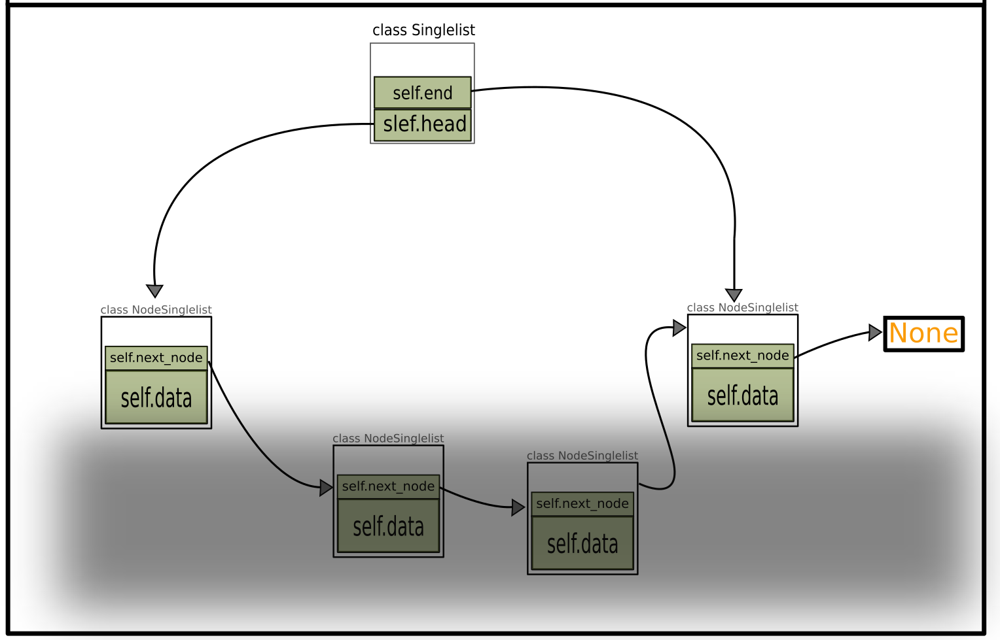
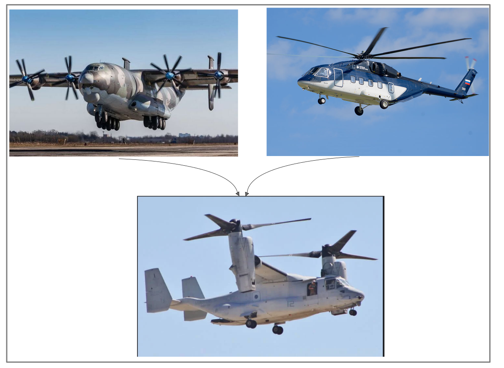

# Тема 1. Базовые понятия. Предпосылки и история

## Теория:

### Зачем нужно ООП

---

Программные проекты редко терпят крах по техническим
причинам. Чаще всего провал объясняется неадекватной
выработкой требований, неудачным планированием или
неэффективным управлением. Если же провал обусловлен
все-таки преимущественно технической причиной, очень
часто ею оказывается неконтролируемая сложность. Иначе
говоря, приложение стало таким сложным, что разработчики
перестали по-настоящему понимать, что же оно делает. Если
работа над проектом достигает момента, после которого уже
никто не может полностью понять, как изменение одного фрагмента программы
повлияет на другие фрагменты, прогресс прекращается.

Управление сложностью — самый важный технический аспект разработки ПО.

---

Функциональный подход

```python
from pprint import pprint


def create_table(_model, _name_table, head: list):
    _model[_name_table] = [head]


def add_row(_model, _name_table, new_row_):
    _model[_name_table].append(new_row_)


def verification_user_name(name_: str):
    return True if not name_.isdigit() else False


def verification_email(email_: str):
    return True if "@" in email_ else False


def verification_id(_id: int):
    return True if type(_id) == int else False


def verification_old(_old: int):
    return True if 0 < _old < 200 else False


def verification(_email, _user_name, _id, _old):
    _res = []
    if verification_email(_email):
        _res.append(_email)
    else:
        raise ValueError

    if verification_user_name(_user_name):
        _res.append(_user_name)
    else:
        raise ValueError

    if verification_id(_id):
        _res.append(_id)
    else:
        raise ValueError

    if verification_old(_old):
        _res.append(_old)
    else:
        raise ValueError

    return _res


if __name__ == '__main__':
    model = {}
    name_table_ = "User"

    create_table(model, name_table_, ["email", "id", "old"])

    add_row(model, name_table_, verification("denis@123", "Denis", 123223, 21))
    add_row(model, name_table_, verification("kosta@1323", "Kosta", 231, 34))
    add_row(model, name_table_, verification("gena@146", "Gena", 312, 28))

    pprint(model)

"""
{'User': [['email', 'id', 'old'],
          ['denis@123', 'Denis', 123223, 21],
          ['kosta@1323', 'Kosta', 231, 34],
          ['gena@146', 'Gena', 312, 28]]}
"""
```

Объектно ориентированный подход

```python

from pprint import pformat


class ModelUser:
	"""
	Модель пользователя

	email: 		str,
	user_name: 	str,
	id_: 		int,
	old: 		int
	"""


	def __init__(self, name_table: str, head: list):
		self._name_table = name_table
		self.rows = []
		self.create_table(head)

	def __main_verification(self, email: str, user_name: str, id_: int, old: int) -> list:

		res = []

		if self._verification_email(email):
			res.append(email)
		else:
			raise ValueError

		if self._verification_user_name(user_name):
			res.append(user_name)
		else:
			raise ValueError

		if self._verification_id(id_):
			res.append(id_)
		else:
			raise ValueError

		if self._verification_old(old):
			res.append(old)
		else:
			raise ValueError

		return res

	def create_table(self, head: list):
		self.head = head

	def add_row(self, email: str, user_name: str, id_: int, old: int):
		self.rows.append(self.__main_verification(email, user_name, id_, old))

	def _verification_user_name(self, name_: str):
		return True if not name_.isdigit() else False

	def _verification_email(self, email_: str):
		return True if "@" in email_ else False

	def _verification_id(self, id_: int):
		return True if type(id_) == int else False

	def _verification_old(self, old_: int):
		return True if 0 < old_ < 200 else False

	def __str__(self):
		return pformat(self.__dict__)

	def __repr__(self):
		return pformat(self.__dict__)


if __name__ == '__main__':
	user = ModelUser("User", ["email", "id", "old"])

	user.add_row("denis@123", "Denis", 123223, 21)
	user.add_row("kosta@1323", "Kosta", 231, 34)
	user.add_row("gena@146", "Gena", 312, 28)

	print(user)


# {'_name_table': 'User',
# 'head': ['email', 'id', 'old'],
# 'rows': [['denis@123', 'Denis', 123223, 21],
#          ['kosta@1323', 'Kosta', 231, 34],
#          ['gena@146', 'Gena', 312, 28]]}
```

Из книги Совершенный код. 1993 год. Автор Стив Макконнелл. 93% положительных отзывов. [+](https://www.google.com/search?client=firefox-b-d&sxsrf=AOaemvIGC140FKAUCudiu6HwV46GpGJJbw:1632737111702&q=%D0%A1%D0%BE%D0%B2%D0%B5%D1%80%D1%88%D0%B5%D0%BD%D0%BD%D1%8B%D0%B9+%D0%BA%D0%BE%D0%B4&stick=H4sIAAAAAAAAAONgFuLQz9U3sDSvKFHiBLGMyg3S4rUEHEtLMvKLQvKd8vOz_fNyKhexyl5YeGHfhU0Xtl5suNhxYeuFvRf2Xuy-sFPhwi6g8JYdrIwAltywxkwAAAA&sa=X&ved=2ahUKEwj7nLfc857zAhXksYsKHe7GBTEQxA16BAguEAU&biw=960&bih=889&dpr=1)

- Минимизация сложности.
    > Управление сложностью - самый важный технический аспект разработки ПО.
- Фрагментация.
    > Не следует пытаться охватить всю программу сразу. Вместо этого лучше работать с её отдельными фрагментами.
- Слабое сопряжение.
    > Сведите к минимуму число соединений между разными частями проекта. (Относится к Наследованию).
- Расширяемость.
    > Изменение одного фрагмента программы, не должно влиять на её другой фрагмент программы.
- Возможность повторного использования.
    > Проектируйте системы так, чтобы её фрагменты можно было повторно использовать.
- Портируемость
    > Проектируйте систему так, чтобы её можно было лего адоптировать к другой среде
- Минимизация, но полная функциональность
    > Отсутствие лишних частей. Вольтер говорил "Книга закончены не тогда, когда в неё больше ничего добавить, а когда из неё нечего нельзя выбрасить"
- Стратификация
    > Проектируйте программу так, чтобы её можно было тестировать по отдельности.
- Быстрый поиск ошибок
    > Возникнувшую ошибку будет проще найти, если она локализована в классе, а не размазана по всему коду.

### Базовые понятия

```python
class <Имя_класса>(<Имя_Базового_класса=object>):

	<статические_атрибут_класса> = <var>


	def __магический_метод__(self):
		self.<атрибут_класса> = <var>

	def __init__(self): # Конструктор класса
		...

	def пользовательский_метод(self):
		....

	def __приватный_метод_класса(self):
		...


if __name__ == '__main__':
	<Экземпляр> = <Имя_класса>(<Параметры_Для_Конструктора_класса>)
```

Класс = это набор данных и методов, имеющих общую, целостную, хорошо определенную сферу ответственности.
Метод = это отдельная функция, или процедура, выполняющая **одну** конкретную задачу.

В следующей теме, рассмотрим подробно как устроенны классы

## Закрепление

### !

==Задача:== Создать класс с именем `Writer`. В нем должны быть следующие атрибуты:

- Имя вашего любимого писателя.
- Массив в котром хранятся книгами который он написал

Также у этого класса, должен быть пользовательский метод, который выводит в консоль, похожий текст.

```python
"А.C Пушкин автор следующих книг 'Капитанская дочка', 'Евгений Онегин', 'Сказка о Попе и о работнике его Балде'"
```

# Тема 2. Класс, экземпляр класса, атрибуты, поведение

## Теория:

### Что такое `self` ?


`self` - В нем хранятся индивидуальные данные экземпляра класса

```python
# У одного класса может быть сколько угодно экземпляров

import pprint


class DayEvents:
	def __init__(self, num_day: int, event: str):
		self.num_day:int = num_day
		self.event:str = event


	def show_event(self) ->str :
		return self.event

	def __repr__(self):
		return pprint.pformat(self.__dict__)


if __name__ == '__main__':
	A = DayEvents(19, "Занятие по  Python ООП")
	B = DayEvents(22, "Занятие по  Python Структуры данных и Алгоритмы")

	print(A) # {'event': 'Занятие по  Python ООП', 'num_day': 19}
	print(B) # {'event': 'Занятие по  Python Структуры данных и Алгоритмы', 'num_day': 22}
```

`self` вызывает метод `__getattribute__` в котром происходит поиск атрибута

```python
class A:

    def __init__(self, name) -> None:
        self.name = name
        self.a = self.name

    def __getattribute__(self, name: str):
        if name == "name":
            return str(self.__dict__)
        return super().__getattribute__(name)


if __name__ == '__main__':
    a = A("AnyName")

    print(a.__dict__)
    print(a.a)
```

- 
- 
- 
- 

Итог: `self` это не магия, а приятная абстракция.

---

### Что такое `__init__` ?

Это конструктор класса. Он всегда автоматически вызывается при создании класса.

```python
import pprint


class DayEvents:

	def __init__(self, num_day: int, event: str):
	 	self.num_day = num_day
	 	self.event = event

	def __repr__(self):
		return pprint.pformat(self.__dict__)

if __name__ == '__main__':
	A = DayEvents(19, "Занятие по  Python ООП")
```

Если нет конструктора класса, то мы не можем передавать параметры для создания класса.

```python
# Если нет конструктора то класс не может принмать параметры
import pprint


class DayEvents:

	# def __init__(self, num_day: int, event: str):
	# 	self.num_day = num_day
	# 	self.event = event

	def __repr__(self):
		return pprint.pformat(self.__dict__)

if __name__ == '__main__':
	A = DayEvents(19, "Занятие по  Python ООП")  # TypeError: DayEvents() takes no arguments
```

Но мы можем создать класс без параметров, а потом вызвать свой конструктор.
(В `__init__` нет магии, он просто удобная абстракция)

```python
import pprint


class DayEvents:

	def any_constrict(self, num_day: int, event: str):
		self.num_day = num_day
		self.event = event

	def __repr__(self):
		return pprint.pformat(self.__dict__)


if __name__ == '__main__':
	A = DayEvents()
	print(A) # {}

	A.any_constrict(19, "Занятие по  Python ООП")
	print(A) # {'event': 'Занятие по  Python ООП', 'num_day': 19}

```

Мы можем снова вызвать конструктор у созданного класса, чтобы обновить его свойства

```python
import pprint


class DayEvents:

	def __init__(self, num_day: int, event: str):
		self.num_day = num_day
		self.event = event

	def __repr__(self):
		return pprint.pformat(self.__dict__)


if __name__ == '__main__':
	A = DayEvents(19, "Занятие по  Python ООП")
	print(A) # {'event': 'Занятие по  Python ООП', 'num_day': 19}
	A.__init__(20, "Занятие по Python Структуры данных и Алгоритмы")
	print(A) # {'event': 'Занятие по  Python ООП', 'num_day': 19} 	# {'event': 'Занятие по Python Структуры данных и Алгоритмы', 'num_day': 20}

```

---

==Задача:== Нужно создать объект - Товар. Он должен иметь название, описание, цену, количество штук на складе.
Так же нужно создать метод класса, который бы подсчитал общую стоимость всех товаров.

> (количество на складе`*`соимость за штуку)

---

### Что такое `__new__` ?

Метод `__new__` вызывается до конструктора класса. (Использовать для паттерна Синглтон)

```python
# __new__ можно использует для создания Singleton
from pprint import pformat


class Singleton:
	_instance = None  # статический атрибут класса

	def __new__(cls, *args, **kwargs):  # 1
		if not cls._instance:
			cls._instance = super().__new__(cls)
			cls._instance.MAIN = args

		return cls._instance

	def __init__(self, name: str):  # 2
		self.name = name

	def __repr__(self):
		return pformat(self.__dict__)


if __name__ == '__main__':
	A = Singleton("Name A")
	B = Singleton("Name B")
	C = Singleton("Name C")
	D = Singleton("Name D")

	print(A) # {'MAIN': ('Name A',), 'name': 'Name D'}
	print(B) # {'MAIN': ('Name A',), 'name': 'Name D'}
	print(C) # {'MAIN': ('Name A',), 'name': 'Name D'}
	print(D) # {'MAIN': ('Name A',), 'name': 'Name D'}
```

---

Метод `__init__` всегда должен возвращать `None`, а в методе `__new__` нет ограничений, он может возвращать что угодно.

```python
class Singleton:
	_instance = None  # Keep instance reference

	def __new__(cls, *args, **kwargs):  # 1
		if not cls._instance:
			cls._instance = super().__new__(cls)
			cls._instance.MAIN = args

		return "Можем возвращать что угодно"

	def __init__(self, name: str):  # 2
		self.name = name


if __name__ == '__main__':
	A = Singleton()
	print(A) # Можем возвращать что угодно

```

А вот ошибка в `__init__`

```python
class Singleton:
	def __init__(self):  # 2
		return "Можем возвращать что угодно"


if __name__ == '__main__':
	A = Singleton() #TypeError: __init__() should return None, not 'str'
	print(A)
```

---

Пример того как использовать `__new__` для подключения к Базе Данных.

- (Если мы захотим создать новое подключение, к одной и той же БД, то нам вернется прошлое подключение)
- (Это нужно для того чтобы не создавать лишние подключения к БД)

```python
from pprint import pformat


class DataBase(object):
	_instance = None  # Keep instance reference

	def __new__(cls, *args, **kwargs):  # 1
		if not cls._instance:
			cls._instance = super().__new__(cls)
			cls._instance.__connect_db = args
			return cls._instance

		elif args == cls._instance.__connect_db:
			return cls._instance


	def connect(self):
		return id(self)

	def __repr__(self):
		return pformat(self.__dict__)


if __name__ == '__main__':
	A = DataBase("/home/user/prj/sql_test.txt")
	B = DataBase("/home/user/prj/sql_test.txt")

	print(id(A)) # 139733808389520
	print(id(B)) # 139733808389520

	print(A.connect()) # 139733808389520
	print(B.connect()) # 139733808389520

```

А вот что будет если мы будем создавать новое подключение .(ID разные)

```python
from pprint import pformat


class DataBase(object):
	_instance = None  # Keep instance reference

	def __new__(cls, *args, **kwargs):  # 1

		cls._instance = super().__new__(cls)
		cls._instance.__connect_db = args
		return cls._instance

	def connect(self):
		return id(self)

	def __repr__(self):
		return pformat(self.__dict__)


if __name__ == '__main__':
	A = DataBase("/home/user/prj/sql_test.txt")
	B = DataBase("/home/user/prj/sql_test.txt")

	print(id(A))  # 140199584529808
	print(id(B))  # 140199584526832

	print(A.connect())  # 140199584529808
	print(B.connect())  # 140199584526832

```

## Закрепление:

### !

Самый лучший способ понять смысл ООП - это создать структуру данных.

==Задача:== Создать метод для добавления элементов, в структуру данных под названием `односвязный списка`

```python
# Добавить функционал к методу append

from typing import Any


class NodeSinglelist:
	def __init__(self, var):
		self.data: Any = var
		self.new_pt = None


class Singlelist:

	def __init__(self):
		self.head = None
		self.end = None

	def append(self, var):
		...


	def __str__(self):
		res = []
		tmp = self.head
		while tmp is not None:
			res.append(tmp.data)
			tmp = tmp.new_pt
		return str(res)


if __name__ == '__main__':
	A = Singylist()
	A.append(1)
	A.append(2)
	A.append(3)
	A.append(4)

	print(A) # [1, 2, 3, 4]
```

Концепция:

- 

Реализация на `Python`

- 

> ```python
> def append(self, var):
> 	if self.end is not None:
> 		self.end.new_pt = NodeSinglelist(var)
> 		self.end = self.end.new_pt
> 	else:
> 		self.head = NodeSinglelist(var)
> 		self.end = self.head
> ```

# Тема 3. Полиморфизм

## Теория:

### Введение.


Простой пример полиморфизма.

```python
class DoorGreen:

	def open(self):
		print("Открыта Зеленная дверь")

	def close(self):
		print("Закрыта Зеленная дверь")


class DoorRead:

	def open(self):
		print("Открыта Красная дверь")

	def close(self):
		print("Закрыта Красная дверь")


class DoorBlue:

	def open(self):
		print("Открыта Синяя дверь")

	def close(self):
		print("Закрыта Синяя дверь")


if __name__ == '__main__':
	A = DoorBlue()
	B = DoorGreen()
	C = DoorRead()

	for _x in [A, B, C]:
		_x.open()
```

Пример полиморфизма для стандартных массивов.

```python
from array import array
from collections import deque

if __name__ == '__main__':
	A = []
	B = deque()
	C = array('i')

	A.append(1)
	B.append(1)
	C.append(1)

	print(A)
	print(B)
	print(C)
```

---

==Задача:== Вспомнить где еще нам встречается полиморфизм ?

---

### Магические методы

Магические методы в `Python` самый распространенный случай полиморфизма. Давайте лучше с ними познакомимся. [95 магических методов](https://docs.python.org/2/reference/datamodel.html#special-method-names)

| Название                | Описание                              |
| ----------------------- | ------------------------------------- |
| `.__str__()` -> `str`   | `str()`                               |
| `.__repr__()` -> `str`  | `repr()`                              |
| `.__len__()` ->`int`    | `len()`                               |
| `.__copy__()` -> `obj`  | `copy.copy()`                         |
| `.__iter__()` -> `self` | Инициализация перед `for`             |
| `.__next__()` -> `Any`  | Вызваться при каждой итерации в `for` |
| `.__del__()`            | Деструктор класса                     |

`.__len__()`

```python
from typing import Any


class NodeSinglelist:
	def __init__(self, var):
		self.data: Any = var
		self.new_pt = None


class Singlelist:

	def __init__(self):
		self.head = None
		self.end = None
		self.len = 0

	def append(self, var):
		if self.end is not None:
			self.end.new_pt = NodeSinglelist(var)
			self.end = self.end.new_pt
		else:
			self.head = NodeSinglelist(var)
			self.end = self.head

		self.len += 1

	def __str__(self):
		res = []
		tmp = self.head
		while tmp is not None:
			res.append(tmp.data)
			tmp = tmp.new_pt
		return str(res)

	def __len__(self):  # !!
		return self.len


if __name__ == '__main__':
	A = Singlelist()
	A.append(1)
	A.append(2)
	A.append(3)
	A.append(4)

	print(A)
	print(len(A))
```

---

`.__iter__()` | `.__next__()`

```python
from typing import Any


class NodeSinglelist:
	def __init__(self, var):
		self.data: Any = var
		self.new_pt = None


class Singlelist:

	def __init__(self):
		self.head = None
		self.end = None
		self.len = 0

	def append(self, var):
		if self.end is not None:
			self.end.new_pt = NodeSinglelist(var)
			self.end = self.end.new_pt
		else:
			self.head = NodeSinglelist(var)
			self.end = self.head

		self.len += 1

	def __str__(self):
		res = []
		tmp = self.head
		while tmp is not None:
			res.append(tmp.data)
			tmp = tmp.new_pt
		return str(res)

	def __len__(self):  # !!
		return self.len

	def __iter__(self):  # !!
		self.tmp: Singlelist = self.head
		return self

	def __next__(self):  # !!
		if self.tmp is not None:
			tmp = self.tmp
			self.tmp = self.tmp.new_pt
			return tmp.data
		else:
			raise StopIteration


if __name__ == '__main__':
	A = Singlelist()
	A.append(1)
	A.append(2)
	A.append(3)
	A.append(4)

	for _x in A:
		print(_x)

```

---

==Задача:== Добавить в класс `Singlelist`метод для удаления элемента с начала.

> ```python
> def popleft(self):
> 	if self.head is not None:
> 		tmp = self.head
> 		self.head = self.head.new_pt
> 		del tmp
> ```

---

`.__copy__()`

```python
from copy import copy
from typing import Any


class NodeSinglelist:
	def __init__(self, var):
		self.data: Any = var
		self.new_pt = None


class Singlelist:

	def __init__(self):
		self.head = None
		self.end = None
		self.len = 0

	def append(self, var):
		if self.end is not None:
			self.end.new_pt = NodeSinglelist(var)
			self.end = self.end.new_pt
		else:
			self.head = NodeSinglelist(var)
			self.end = self.head

		self.len += 1

	def __copy__(self):  # !!
		"""
		Пример конструктор копирования
		"""

		tmp = Singlelist()
		_last_self_tmp = self.head
		while _last_self_tmp is not None:
			tmp.append(copy(_last_self_tmp.data))  # tmp.append(_last_self_tmp.data)
			_last_self_tmp = _last_self_tmp.new_pt

		return tmp

	def __iter__(self):
		self.tmp: Singlelist = self.head
		return self

	def __next__(self):
		if self.tmp is not None:
			tmp = self.tmp
			self.tmp = self.tmp.new_pt
			return tmp.data
		else:
			raise StopIteration


if __name__ == '__main__':
	A = Singlelist()
	A.append([1, 3, 4])
	A.append([4, 3])
	A.append([22, 2, 2])
	A.append([3, 3, 1, ])

	print("A")
	for _x in A:
		print(id(_x), _x)

	B = copy(A)  # Копирование

	print("B")
	for _x in B:
		print(id(_x), _x)

```

---

`.__del__()` Деструктор класса. Вызваться автоматически, при выходе из области видимости экземпляра класса. Либо когда мы явно
вызываем оператор `del`

```python
del A == A.__del__()
```

## Закрепление:

### !

==Задача:== Реализовать деструктор класса `Singylist`. Деструктор автоматически вызывается при выходе из функций

```python

if __name__ == '__main__':
	A = Singlelist()
	A.append(1)
	A.append(2)
	A.append(3)
	A.append(4)

	print(A)  # [1, 2, 3, 4]

	del A # Вызвался __del__
```

> ```python
> def __del__(self):
> 	for _x in range(self.len):
> 		self.popleft()
> 	print("Вызвался __del__")
> ```

# Тема 4. Инкапсуляция

## Теория:

### Зачем нужна Инкапсуляция ?

Инкапсуляция помогает управлять сложностью, блокируя доступ к неё.


---

Нам не нужно допускать программистов к приватным атрибутам, потому что это может нарушить работу системы.

```python
from typing import Any


class Singylist:
	def __init__(self):
		self.head = self
		self.data: Any = None
		self.new_pt = None
		self.end = None

	def append(self, data):
		if self.new_pt is not None:
			self.end.data = data
			self.end.new_pt = Singylist()
			self.end = self.end.new_pt
		else:
			self.data = data
			self.new_pt = Singylist()
			self.end = self.new_pt

	def __str__(self):
		res = []
		tmp = self.head
		while tmp.new_pt is not None:
			res.append(tmp.data)
			tmp = tmp.new_pt
		return str(res)


if __name__ == '__main__':
	A = Singylist()
	A.append(1)
	A.append(2)
	A.head = None # Случайно ломаем программу
	A.append(3)
	A.append(4)
	print(A) # AttributeError: 'NoneType' object has no attribute 'new_pt'
```

Пример создания приватных атрибутов.

```python
from typing import Any


class Singylist:
	def __init__(self):
		self.__head = self
		self.__data: Any = None
		self.__new_pt = None
		self.__end = None

	def append(self, data):
		if self.__new_pt is not None:
			self.__end.__data = data
			self.__end.__new_pt = Singylist()
			self.__end = self.__end.__new_pt
		else:
			self.__data = data
			self.__new_pt = Singylist()
			self.__end = self.__new_pt

	def __str__(self):
		res = []
		tmp = self.__head
		while tmp.__new_pt is not None:
			res.append(tmp.__data)
			tmp = tmp.__new_pt
		return str(res)


if __name__ == '__main__':
	A = Singylist()
	A.append(1)
	A.append(2)
	A.append(3)
	A.append(4)
	print(A)

	A.__head # AttributeError: 'Singylist' object has no attribute '__head' # такого атрибута нет
```

---

==Задача:== Сделать приватными все необходимые атрибуты класса `Singylist`.

---

### Get | Set

Зачем нужны гетеры и сеттеры ?

- 
- 

Пример Get | Set

```python
from typing import Any


class Singylist:
	def __init__(self):
		self.__head = self
		self.__data: Any = None
		self.__new_pt = None
		self.__end = None

		self.__max_len = 10  # !!

	def append(self, data):
		if self.__new_pt is not None:
			self.__end.__data = data
			self.__end.__new_pt = Singylist()
			self.__end = self.__end.__new_pt
		else:
			self.__data = data
			self.__new_pt = Singylist()
			self.__end = self.__new_pt

	@property
	def max_len(self) -> Any:  # !! GET
		return self.__max_len

	@max_len.setter
	def max_len(self, values: Any):  # !! SET
		if type(values) == int:
			self.__max_len = values
		else:
			raise ValueError("Переменная максимально длинны должна быть типа int")


if __name__ == '__main__':
	A = Singylist()
	A.append(1)
	A.append(2)
	A.append(3)
	A.append(4)

	print(A.max_len)  # 10
	A.max_len = 20
	print(A.max_len)  # 20
```

---

`@property` Правила для `GET`

```python
@property
def <Имя_Публичного_Атрибута>(self) -> Any: # GET
	return self.<Имя_Приватного_Атрибута>
```

`@property` Правила для `SET`

```python
@<Имя_Публичного_Атрибута>.setter
def <Имя_Публичного_Атрибута>(self, values: Any):  # !! SET
	self.<Имя_Приватного_Атрибута> = values
```

---

Скорость `@property`

Без инкопсуляции

```python
import time


class Singylist:
	def __init__(self):
		self.max_len = 10  # !!


if __name__ == '__main__':
	A = Singylist()
	start = time.process_time()
	print("Start")
	for x in range(0, 1_000_000):
		A.max_len
	end = time.process_time()
	print(end - start)  # 0.062035757 sec
```

`@property` медленнее в 1.7 раза

```python
import time
from typing import Any


class Singylist:
	def __init__(self):
		self.__max_len = 10  # !!

	@property
	def max_len(self) -> Any:  # !! GET
		return self.__max_len


if __name__ == '__main__':
	A = Singylist()
	start = time.process_time()
	print("Start")
	for x in range(0, 1_000_000):
		A.max_len
	end = time.process_time()
	print(end - start)  # 0.104866687 sec

```

`.__getattribute__()` медленнее в 4.5 раза

```python
import time


class Singylist:
	def __init__(self):
		self.__max_len = 10  # !!

	def __getattribute__(self, item):  # !! GET
		if item == "max_len":
			return self.__dict__["_Singylist__max_len"]

		return super().__getattribute__(item)


if __name__ == '__main__':
	A = Singylist()
	start = time.process_time()
	print("Start")
	for x in range(0, 1_000_000):
		A.max_len
	end = time.process_time()
	print(end - start)  # 0.28106023199999997 sec
```

---

Итог:

- Инкапсуляция влияет на время доступа к элементу. Но в реальных программах это почти не заметно.
- `@property` На данный момент самый быстрый способ сделать гетер и сеттер `GET | SET`

### Что такое `@staticmethod`

`@staticmethod` Означает что мы можем вызвать методы без создания экземпляра класса

```python
class Math:

	@staticmethod
	def pow(a, b):
		return pow(a, b)

	@staticmethod
	def sum(a, b):
		return a + b

	@staticmethod
	def abs(a):
		return abs(a)


if __name__ == '__main__':
	Math.pow(3, 3)  # 27
	Math.pow(5, 2)  # 25
	Math.abs(-3)    # 3
```

Итог: `@staticmethod` используют для того чтобы метод работал независим от класса, но при этом находился в самом классе.
Например `@staticmethod` использует всегда когда нам не нужен `self`.

```python
"""
Например, используем один и тот же метод `is_file_exists` для проверки существования файла.
Как в экземпляре класса, так и вне его.
"""

import os


class File:

    def __init__(self, file_name: str):
        self.__file_name = file_name

    def read(self, text: str):
        if self.is_file_exists(self.__file_name):
            with open(self.__file_name, 'r') as _f:
                print("Данные прочитаны")
                return _f.read()
        else:
            print("Файла не существует")

    @staticmethod
    def is_file_exists(file_name: str):
        return os.path.exists(file_name)


if __name__ == '__main__':
    my_file = File("/home/denis/PycharmProjects/consgui/test.csv")
    my_file.read("Python Zen")

    print(File.is_file_exists("/home/denis/PycharmProjects/consgui/test.csv"))
```

### Что такое `@classmethod`

`@classmethod` Этот метод мы также можем вызвать без создания экземпляра класса,
но теперь первым параметров в методе будет передан сам класс. Его принято называть `cls`

Через `cls`у нас есть доступ к статическим атрибутам класса.

```python
"""
Например, мы создаем статический метод, который возвращает количество всех созданных потоков
"""


class MyTread:
	__count_thread = 0

	def __init__(self, thread_name: str) -> None:
		self.thread_name = thread_name

	def create_thread(self):
		print(f"Поток с именем {self.thread_name} создан")
		MyTread.__count_thread += 1

	@classmethod # !!!
	def get_all_count_thread(cls):
		return cls.__count_thread


if __name__ == '__main__':
	my_thread = MyTread("Тест")  # Поток с именем Тест создан

	my_thread.create_thread()

	print(MyTread.get_all_count_thread())  # 1

```

Это можно сделать и без `@classmethod`.

```python
"""
Например, мы создаем статический метод, который возвращает количество всех созданных потоков
"""


class MyTread:
	__count_thread = 0

	def __init__(self, thread_name: str) -> None:
		self.thread_name = thread_name

	def create_thread(self):
		print(f"Поток с именем {self.thread_name} создан")
		MyTread.__count_thread += 1

	@staticmethod # !!!
	def get_all_count_thread():
		return MyTread.__count_thread


if __name__ == '__main__':
	my_thread = MyTread("Тест")  # Поток с именем Тест создан

	my_thread.create_thread()

	print(MyTread.get_all_count_thread())  # 1


```

Итог: `@classmethod` это стандартное решение, когда вам нужно обращаться к статическим атрибутам класса.

## Закрепление:

### !

==Задача:== Создать класс `User`, с приватными атрибутами `user_name` `email` `__photo` `id`. Для приватного атрибута `__photo` сделать
геттер и сеттер.

# Тема 5. Абстракция

## Теория

### Зачем нужна **Абстракция** ?

Абстракция это представление сложной операции в упрощённой форме.

Абстракция позволяет пользоваться программой, игнорируя детали её реализации.

Нужно поддерживать модульность проекта - это подразумевает что каждый метод или класс, должен быть похож на "черный ящик"
, вы знаете, что в него поступает и что из него выходит, но не знаете, что происходит внутри. Черный ящик должен быть предсказуем
, для конкретных входных данных, мы точно можем предсказать соответствующие выходные данные.


```python
print() # *args, sep=' ', end='\n', file=None
```

---

Давайте найдем связи между Абстракцией и Инкапсуляцией.

**Абстракция** помогает игнорировать детали реализации, а **инкапсуляция** не позволяет узнать детали реализации.
Эти две концепции связаны, без инкапсуляции абстракция разрушается.
Как пишет Стивен Макконнелл "Вы или имеете и абстракцию и инкапсуляцию, или не имеете ни того, ни другого.
Промежуточного варианта нет"

## Закрепление:

==Задача== Создать класс `Meters`(Метры). Определить в нем необходимые атрибуты, создать гетер и сеттер.

# Тема 6. Интерфейсы и абстрактные классы

## Теория:

### Зачем нужен **Интерфейс** ?

Первый и самый важный этап разработки высококачественного класса - создать адекватного интерфейса. Это значит, что
интерфейс должен предоставлять хорошую абстракцию, скрывающую детали реализации кода.

Плохой пример

```python
class Meters:
	def __init__(self, metres):
		self.__metres: int = metres

	@property
	def metres(self) -> int:
		return self.__metres

	@metres.setter
	def metres(self, values: int):
		self.__metres = values


if __name__ == '__main__':
	A = Meters(10)
	B = Meters(5)

	print(A.metres + B.metres) # Не интуитивный интерфейс.

```

Хороший пример интерфейса

```python
class Meters:
	def __init__(self, metres):
		self.__metres: int = metres

	@property
	def metres(self) -> int:
		return self.__metres

	@metres.setter
	def metres(self, values: int):
		self.__metres = values

	def __add__(self, other):
		return self.__metres + other.metres


if __name__ == '__main__':
	A = Meters(10)
	B = Meters(5)

	print(A + B)              # Пользуемся классом как обычной переменной Python
```

---

==Задача:== Добавить к классу `Meters` вычитание и умножение.

| Знак     | Вызываемый метод | Описание              |
| -------- | ---------------- | --------------------- |
| `a + b`  | `__add__`        | Сложение              |
| `a - b`  | `__sub__`        | Вычитание             |
| `a * b`  | `__mul__`        | Умножение             |
| `a / b`  | `__truediv__`    | Деление               |
| `a // b` | `__floordiv__`   | Целочисленное деление |
| `a % b`  | `__mod__`        | Остаток от деления    |
| `a ** b` | `__pow__`        | Возведение в степень  |

---

### Зачем нужен **Абстрактные классы** ?

Вот у нас появляться еще один класс `Kilometer`. И теперь нам можно создать метод конвертации из одного типа в другой.
Но как нам сообщить другим программистам, что можно конвертировать только километры в метры, или метры в километры ?

```python
class Kilometer:

	def __init__(self, kilometer):
		self.__kilometer: int = kilometer

	@property
	def kilometer(self) -> int:
		return self.__kilometer

	@kilometer.setter
	def kilometer(self, values: int):
		self.__kilometer = values

	def __add__(self, other):
		return self.__kilometer + other.kilometer

	def __sub__(self, other):
		return self.__kilometer - other.kilometer

	def convertFrom(self, val) -> float:  # Какой тип у val  ????
		...


class Meters:
	def __init__(self, metres):
		self.__metres: int = metres

	@property
	def metres(self) -> int:
		return self.__metres

	@metres.setter
	def metres(self, values: int):
		self.__metres = values

	def __add__(self, other):
		return self.__metres + other.metres

	def __sub__(self, other):
		return self.__metres - other.metres

	def convertFrom(self, val) -> float:  # Какой тип у val  ????
		...


if __name__ == '__main__':
	A = Meters(10)
	B = Meters(5)

	print(A + B)  # 15
	print(A - B)  # 15
	C = Kilometer(6)
	D = Kilometer(4)

	print(C + D)
	print(C - D)
```

Нужно создать абстрактный класс

```python
class Distance:  # В Абстрактном классе, есть только методы для переопределния
	def convertFrom(self, val):
		# Если в наследники не переопределен этот метод, то возникнет ошибка  `Метод не реализован`
		raise NotImplementedError


class Kilometer(Distance):

	def __init__(self, kilometer):
		self.__kilometer: int = kilometer

	@property
	def kilometer(self) -> int:
		return self.__kilometer

	@kilometer.setter
	def kilometer(self, values: int):
		self.__kilometer = values

	def __add__(self, other):
		return self.__kilometer + other.kilometer

	def __sub__(self, other):
		return self.__kilometer - other.kilometer

	def convertFrom(self, val: Distance) -> float:  # !
		if isinstance(val, Meters):
			return val.metres / 1000
		elif isinstance(val, Kilometer):
			return val.kilometer


class Meters(Distance):
	def __init__(self, metres):
		self.__metres: int = metres

	@property
	def metres(self) -> int:
		return self.__metres

	@metres.setter
	def metres(self, values: int):
		self.__metres = values

	def __add__(self, other):
		return self.__metres + other.metres

	def __sub__(self, other):
		return self.__metres - other.metres

	def convertFrom(self, val: Distance) -> float:  # !
		if isinstance(val, Meters):
			return val.metres
		elif isinstance(val, Kilometer):
			return val.kilometer * 1000


if __name__ == '__main__':
	A = Meters(10)
	D = Kilometer(4)

	print(A.convertFrom(D))  # 4000
	print(D.convertFrom(A))  # 0.01

```

## Закрепление:

### !

---

==Задача:== Добавить еще один класс `Centimeters`, добавить возможность конвертации.
Километров в сантиметры, и метров в сантиметры.

---

# Тема 7. Наследование

## Теория:

### Что такое Наследование ?

Цель наследования - создать более простой код, что достигается путем определения базового класс, в котром есть необходимый
функционал для производных классов. Наследование подразумевает, что клас является более специализированный вариантом другого класса.

Наследование — одно из самых мощных средств объектно-ориентированного
программирования. При правильном применении оно может принести большую
пользу, однако в обратном случае и ущерб будет немалым.

- 
- 

---

Польза:

- Наследование помогает избегать повторения кода. (Принцип **DRY**)
- Данных в нескольких местах, централизованны в базовом классе. (Легче находить баги и отлаживать программу)
- При правильном использовании способствует уменьшению сложности (Принцип **KISS**)

Ущерб:

- При злоупотреблении. Наследование повышает сложность программы, и в этом смысле оно может быть опасным. (Можно лего запутаться)
- Круговая зависимость это плохо. (Потому что тогда не получится тестировать программу по отдельности)

---

Разберем пример, где наследование приносит пользу. `ViewRoot` [console_debugger](https://github.com/denisxab/console_debugger/blob/20bd80839ceff66578f1cb1386108c9efc965151/helpful/date_obj.py#L94)
Все что здесь делает базовый класс, это импортирует модуль для работы с сокетами, и
создает атрибут `SeverGet` для взаимодействия с сокетом. В итоги мы можем независимо разрабатывать интерфейс
как на GUI, так для консолей. При этом, для того чтобы работать с сокетами нам нужно написать всего две строчки.

```python
super().__init__()
MgGetSocket.RunThread(self)
```

И теперь если мы захотим создать новый графически интерфейс, например на `PyQt` то:

- Нам не придётся, вспоминать, переписывать, выдумывать способы работы с сокетами.
- Меньше тестировать код, так как если возникнут ошибки в работе с сокетами, мы можем в одном месте их исправить.

---

Лучший способ подготовки к будущей работе — не проектировать дополнительные уровни базовых классов,
которые «когда-нибудь могут понадобиться», а написать максимально ясный, понятный и простой код.
Это означает, что иерархию наследования не надо усложнять без крайней нужды. (Принцип **YAGNI**)

---

Помните про Главный Технический Императив и убедитесь, что вы используете наследование,
чтобы избежать дублирования кода и минимизировать сложность.

### Примеры Наследования:

Пример расширения функционала через наследование

```python
class Bike:  # (Велосипед)
	def __init__(self, x, y):
		self._x = x
		self._y = y

	def goto_point(self, add_x=0, add_y=0):
		self._x += add_x
		self._y += add_y

	def __str__(self):
		return f'X:{self._x}; Y:{self._y}'


class ElectricBike(Bike):  # (Электро Велосипед)
	def __init__(self, x, y):
		super().__init__(x, y)

	def charge_battery(self, time_sec_charge: int):
		print(f"Заряжаем батарею {time_sec_charge} секунд")


if __name__ == '__main__':
	B = Bike(100, 50)
	EB = ElectricBike(300, 50)

	print(B)  # X:100; Y:50
	print(EB)  # X:300; Y:50

	B.goto_point(3, 4)
	EB.goto_point(10, 40)

	print(B)  # X:103; Y:54
	print(EB)  # X:310; Y:90

	EB.charge_battery(100)  # Заряжаем батарею 100 секунд
	B.charge_battery()  # TypeError: charge_battery() missing 1 required positional argument: 'time_charge

```

---

Как работает `super`.

`super` автоматически определяет порядок вызова родительского класса. Порядок зависит от иерархии класса и начальной точки вызова.

```python
class A:
	def __init__(self, message: str) -> None:
		print(f"{message} из A")


class B(A):
	def __init__(self, message: str) -> None:
		super().__init__(message)
		print(f"{message} из B")


class C(B):
	def __init__(self, message: str) -> None:
		super().__init__(message)
		print(f"{message} из C")


class D(C):
	def __init__(self, message: str) -> None:
		super().__init__(message)
		print(f"{message} из D")


if __name__ == '__main__':
	a = D("Я вызвал класс D")

	"""
	Я вызвал класс D из A
	Я вызвал класс D из B
	Я вызвал класс D из C
	Я вызвал класс D из D
	"""
```

---

Мы можем сами определить иерархию вызова. Путем указания аргументов в `super(<Начало>,self)`

```python
class A:
	def __init__(self, message: str) -> None:
		print(f"{message} из A")


class B(A):
	def __init__(self, message: str) -> None:
		super().__init__(message)
		print(f"{message} из B")


class C(B):
	def __init__(self, message: str) -> None:
		super().__init__(message)
		print(f"{message} из C")


class D(C):
	def __init__(self, message: str) -> None:
		super(B,self).__init__(message)
		print(f"{message} из D")


if __name__ == '__main__':
	a = D("Я вызвал класс D")

	"""
	Я вызвал класс D из A
	Я вызвал класс D из D
	"""
```

---

Множественной наследование

- 

```python
class Helicopter:  # (Вертолет)
	def __init__(self) -> None:
		super().__init__()
		self.screws = True  # Венты


class Plane:  # (Самолет)
	def __init__(self) -> None:
		super().__init__()
		self.wings = True  # Крылья


class Avenger(Plane, Helicopter):
	def __init__(self) -> None:
		super().__init__()
		self.shift_joints = True  # Шарниры переключения положения винтов из вертолетного в самолетны режим

	def __str__(self):
		return str(self.__dict__)


if __name__ == '__main__':
	Aveng_ = Avenger()
	print(Aveng_)
```

---

## Закрепление:

### !

> ==Задача:== Создать класс `DblLinkedList`(двусвязный список). И унаследовать от `ArrayLink`(его нужно создать).
> Так же `ArrayLink`должен являться базовым классом для `Singylist`
