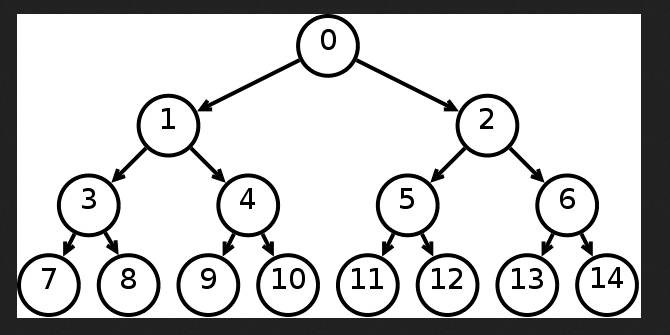
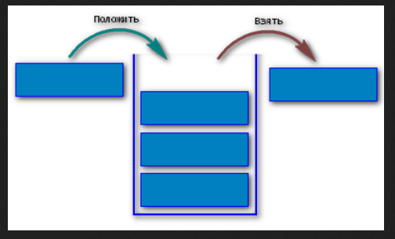
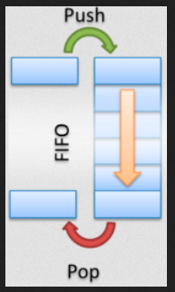
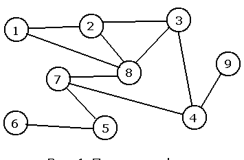
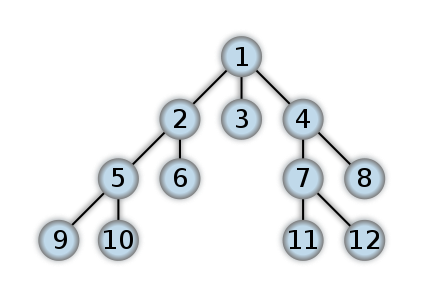
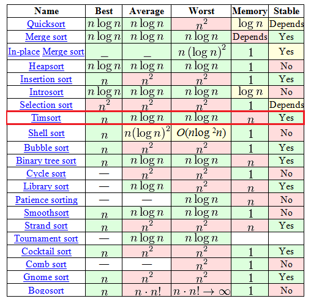
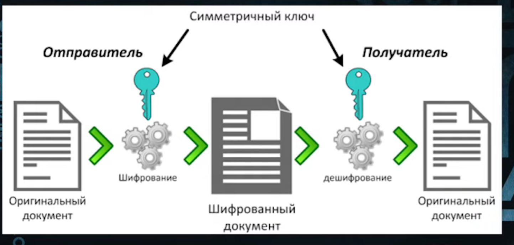
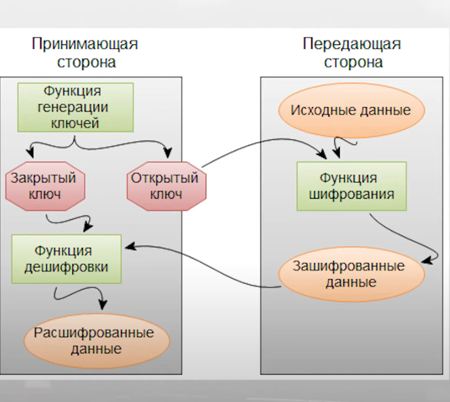
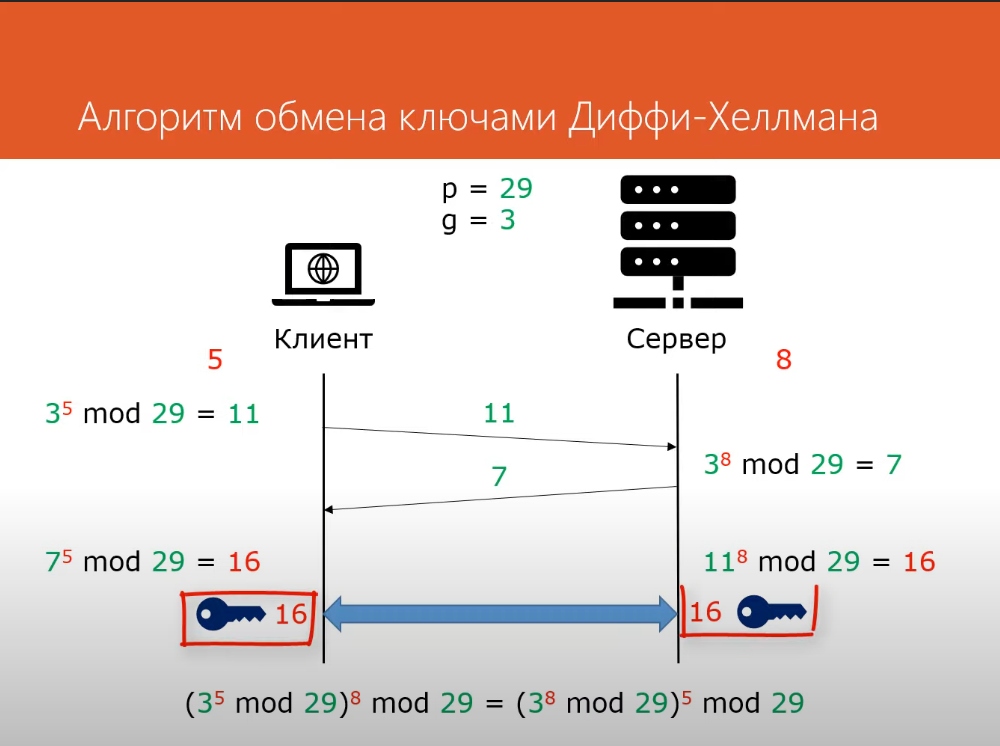
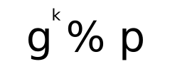

# Основные структуры данных

## Теория:

### Полезная информация

[Список из реализованных алгоритмов на Python](https://github.com/TheAlgorithms/Python/blob/master/DIRECTORY.md)

### Бинарные деревья



Реализация на [C++](https://github.com/denisxab/Data-structure-/blob/master/Binary_tree_1.cpp)

```python
from typing import Optional


class NodeBinaryTree:
	def __init__(self, val):
		self.left = None
		self.right = None
		self._key = val

	def __repr__(self):
		return str(self._key)


class BinaryTree:
	def __init__(self):
		self.root: Optional[NodeBinaryTree] = None
		self.size: int = 0

	def add(self, val):
		if self.root is None:
			self.root = NodeBinaryTree(val)
		else:
			self.__add(val, self.root)
		self.size += 1

	def __add(self, val, node):
		if val < node._key:
			if node.left is not None:
				self.__add(val, node.left)
			else:
				node.left = NodeBinaryTree(val)
		else:
			if node.right is not None:
				self.__add(val, node.right)
			else:
				node.right = NodeBinaryTree(val)

	def find(self, val):
		if self.root is not None:
			return self.__find(val, self.root)
		else:
			return None

	def __find(self, val, node):
		if val == node._key:
			return node._key
		elif val < node._key and node.left is not None:
			return self.__find(val, node.left)
		elif val > node._key and node.right is not None:
			return self.__find(val, node.right)

	def deleteTree(self):
		if self.root is not None:
			self.__deleteTree(self.root)
		self.root = None

	def __deleteTree(self, node=None):
		if node is not None:
			self.__deleteTree(node.left)
			self.__deleteTree(node.right)
			del node

	def printTree(self):
		if self.root is not None:
			self.__printTree(self.root)

	def __printTree(self, node):
		if node is not None:
			self.__printTree(node.left)
			print(f"{node._key}")
			self.__printTree(node.right)

	def remove(self, key):

		tmp: NodeBinaryTree = self.root
		del_: NodeBinaryTree = tmp
		save_val = key

		# Если это центр
		if key == self.root._key:
			# //Если  с ЛЕВО не пусто
			if del_.left is not None:
				# //Если с ПРАВО не пусто
				if del_.right is not None:
					self.root = del_.right
					tmp = self.root.left

					if tmp:
						# //Спуск до самого меньшего значения слева
						while tmp.left is not None:
							tmp = tmp.left
						tmp.left = del_.left
					else:
						self.root.left = del_.left

				# //Если с ПРАВО пусто
				elif del_.right is None:
					self.root = self.root.left

			# //Если с ЛЕВО пусто
			elif del_.left == None:
				self.root = self.root.right

			save_val = del_._key
			del del_._key
			del del_
			self.size -= 1
			return save_val

		while True:
			# //Удаление и преставление элементов дерева

			# //Если с ЛЕВА
			if tmp.left != None and key == tmp.left._key:
				del_ = tmp.left
				# //Если  с ЛЕВО не пусто
				if del_.left != None:
					# //Если с ПРАВО не пусто
					if del_.right != None:
						tmp.left = del_.right
						tmp = tmp.left
						# //Спуск до самого меньшего значения слево
						while (tmp.left != None):
							tmp = tmp.left
						tmp.left = del_.left
					# //Если с ПРАВО пусто
					elif del_.right == None:
						tmp.left = del_.left

				# //Если с ЛЕВО пусто
				elif del_.left == None:
					tmp.left = del_.right

				save_val = del_._key
				del del_._key
				del del_
				self.size -= 1
				return save_val

			# //Если с ПРАВА
			elif tmp.right != None and key == tmp.right._key:
				del_ = tmp.right
				# //Если  с ЛЕВО не пусто
				if del_.left != None:
					# //Если с ПРАВО не пусто
					if del_.right != None:
						tmp.right = del_.right
						tmp = tmp.right
						# //Спуск до самого меньшего значения слево
						while (tmp.left != None):
							tmp = tmp.left
						tmp.left = del_.left
					# //Если с ПРАВО пусто
					elif del_.right == None:
						tmp.right = del_.left

				# //Если с ЛЕВО пусто
				elif del_.left == None:
					tmp.right = del_.right

				save_val = del_._key
				del del_._key
				del del_
				self.size -= 1
				return save_val

			# //Передвижение по дереву

			# //Если с ЛЕВА
			if key < tmp._key:
				if tmp.left != None:
					tmp = tmp.left
				elif tmp.left == None:
					raise ValueError("Ключ не найден")
			elif key > tmp._key:
				if tmp.right != None:
					tmp = tmp.right
				elif tmp.right == None:
					raise ValueError("Ключ не найден")


if __name__ == '__main__':
	#     3
	# 0     4
	#   2      8
	tree = BinaryTree()
	tree.add(3)
	tree.add(4)
	tree.add(0)
	tree.add(8)
	tree.add(2)

	# tree.remove()

	tree.printTree()
	print()
	print(tree.find(3))
	print(tree.find(110))
	tree.deleteTree()
	tree.printTree()
```

---

> Придумали в 1960 году

Сложность алгоритма

Память O(N)
Поиск O(log N)
Вставка O(log N)
Удаление O(log N)

---

### Хеш таблицы

```python
from typing import NamedTuple


class Colisuion(NamedTuple):
	arr: list


class HashMap:

	def __init__(self, start_size: int=0):
		self.__arr = [None for _x in range(start_size)]
		self.size = start_size

	def __get_index(self, key: int):
		return hash(key) % self.size

	def add(self, key):
		_index: int = self.__get_index(key)

		if self.__arr[_index] is None:
			self.__arr[_index] = key
		elif type(self.__arr[_index]) == Colisuion:
			self.__arr[_index].arr.append(key)
		else:
			self.__arr[_index] = Colisuion(arr=[key])

	def find(self, key):
		_index: int = self.__get_index(key)

		if self.__arr[_index] is None:
			return False

		elif type(self.__arr[_index]) == Colisuion:

			if key in self.__arr[_index].arr:
				return True
			else:
				return False
		else:
			return False

	def remove(self, key):
		_index: int = self.__get_index(key)

		if self.__arr[_index] is None:
			raise KeyError

		elif type(self.__arr[_index]) == Colisuion:
			self.__arr[_index].arr.remove(key)

		else:
			self.__arr[_index] = None

	def __repr__(self):
		return f"{self.__arr}"


if __name__ == '__main__':
	dict_ = HashMap(10)

	for _x in range(30):
		dict_.add(_x)

	print(dict_)
	print(dict_.find(22))
	print(dict_.find(222))
	dict_.remove(22)
	print(dict_.find(22))
```

---

> Придумали в 1953 году

Сложность алгоритма

Память O(N)
Поиск O(1)
Вставка O(N)
Удаление O(N)

---

### Стек



```python
class Stack:

	def __init__(self) -> None:
		self.__arr = []

	def append(self, var):
		self.__arr.append(var)

	def get(self):
		return self.__arr.pop()

	def __repr__(self):
		return f"{self.__arr}"


if __name__ == '__main__':
	stack = Stack()

	for _x in range(10):
		stack.append(_x)

	print(stack)
	print(stack.get())
	print(stack.get())
	print(stack.get())
	print(stack.get())
	print(stack.get())
	print(stack)
```

### Очередь



```python
from collections import deque


class Deque:

	def __init__(self) -> None:
		self.__arr = deque()

	def append(self, var):
		self.__arr.append(var)

	def get(self):
		return self.__arr.popleft()

	def __repr__(self):
		return f"{self.__arr}"


if __name__ == '__main__':
	stack = Deque()

	for _x in range(10):
		stack.append(_x)

	print(stack)
	print(stack.get())
	print(stack.get())
	print(stack.get())
	print(stack.get())
	print(stack.get())
	print(stack)
```

### Графы



```python
from collections import deque


def dfs(visited, graph, node):
	print(node, end=" ")

	if node in visited:  # Если вершина уже посещена, выходим
		return False

	visited.add(node)  # Посетили вершину v

	for _i in graph[node]:  # Все смежные с v вершины
		if not _i in visited:
			dfs(visited, graph, _i)


if __name__ == '__main__':
	graph = {
			1: [2, 8],
			2: [1, 3, 8],
			3: [2, 4, 8],
			4: [3, 7, 9],
			5: [6, 7],
			6: [5],
			7: [4, 5, 8],
			8: [1, 2, 3, 7],
			9: [4],
			}

	start = 1
	visited = set()
	dfs(visited, graph, start)
	print()
```

---



```python
from collections import deque


def bfs(visited, graph, node, queue):
	visited.append(node)
	queue.append(node)
	while queue:
		s = queue.popleft()
		print(s, end=" ")
		for neighbour in graph[s]:
			if neighbour not in visited:
				visited.append(neighbour)
				queue.append(neighbour)


if __name__ == '__main__':
	graph = {
			1: [2, 8],
			2: [1, 3, 8],
			3: [2, 4, 8],
			4: [3, 7, 9],
			5: [6, 7],
			6: [5],
			7: [4, 5, 8],
			8: [1, 2, 3, 7],
			9: [4],
			}

	start = 1

	visited = []
	Q = deque()  # Очередь
	bfs(visited, graph, start, Q)
```

## Закрепеление:

### !

==Задание== Спроектировать, класс для структуры данных двусвязный список.

# Сортировки

## Теория:

### Пузырьковая сортировка

```python
def bubble_sort(nums):
	# Устанавливаем swapped в True, чтобы цикл запустился хотя бы один раз
	len_ = len(nums) - 1

	swapped = True
	while swapped:

		swapped = False
		for i in range(len_):

			print(nums)

			if nums[i] > nums[i + 1]:
				# Меняем элементы
				nums[i], nums[i + 1] = nums[i + 1], nums[i]
				# Устанавливаем swapped в True для следующей итерации
				swapped = True

		print("_" * 40)


if __name__ == '__main__':
	random_list_of_nums = [5, 2, 1, 8, 4]
	bubble_sort(random_list_of_nums)
	print(random_list_of_nums)
```


---

Сложность алгоритма:

- O(n²)

---

### Сортировка выборкой

```python
def selection_sort(nums):
	# Значение i соответствует кол-ву отсортированных значений
	for i in range(len(nums)):
		# Исходно считаем наименьшим первый элемент
		lowest_value_index = i
		# Этот цикл перебирает несортированные элементы
		for j in range(i + 1, len(nums)):
			if nums[j] < nums[lowest_value_index]:
				lowest_value_index = j
		# Самый маленький элемент меняем с первым в списке
		nums[i], nums[lowest_value_index] = nums[lowest_value_index], nums[i]


if __name__ == '__main__':
	random_list_of_nums = [5, 2, 1, 8, 4]
	selection_sort(random_list_of_nums)
	print(random_list_of_nums)

```


---

Сложность алгоритма:

- O(n²)

---

### Сортировка вставками

```python
def insertion_sort(nums):
	# Сортировку начинаем со второго элемента, т.к. считается, что первый элемент уже отсортирован
	for i in range(1, len(nums)):
		item_to_insert = nums[i]
		# Сохраняем ссылку на индекс предыдущего элемента
		j = i - 1
		# Элементы отсортированного сегмента перемещаем вперёд, если они больше
		# элемента для вставки
		while j >= 0 and nums[j] > item_to_insert:
			nums[j + 1] = nums[j]
			j -= 1
		# Вставляем элемент
		nums[j + 1] = item_to_insert


if __name__ == '__main__':
	random_list_of_nums = [5, 2, 1, 8, 4]
	insertion_sort(random_list_of_nums)
	print(random_list_of_nums)

```


---

Сложность алгоритма:

- O(n²)

---

### Сортировка слиянием

```python
def merge(left_list, right_list):
	sorted_list = []
	left_list_index = right_list_index = 0

	# Длина списков часто используется, поэтому создадим переменные для удобства
	left_list_length, right_list_length = len(left_list), len(right_list)

	for _ in range(left_list_length + right_list_length):
		if left_list_index < left_list_length and right_list_index < right_list_length:
			# Сравниваем первые элементы в начале каждого списка
			# Если первый элемент левого подсписка меньше, добавляем его
			# в отсортированный массив
			if left_list[left_list_index] <= right_list[right_list_index]:
				sorted_list.append(left_list[left_list_index])
				left_list_index += 1
			# Если первый элемент правого подсписка меньше, добавляем его
			# в отсортированный массив
			else:
				sorted_list.append(right_list[right_list_index])
				right_list_index += 1

		# Если достигнут конец левого списка, элементы правого списка
		# добавляем в конец результирующего списка
		elif left_list_index == left_list_length:
			sorted_list.append(right_list[right_list_index])
			right_list_index += 1
		# Если достигнут конец правого списка, элементы левого списка
		# добавляем в отсортированный массив
		elif right_list_index == right_list_length:
			sorted_list.append(left_list[left_list_index])
			left_list_index += 1

	return sorted_list


def merge_sort(nums):
	# Возвращаем список, если он состоит из одного элемента
	if len(nums) <= 1:
		return nums

	# Для того чтобы найти середину списка, используем деление без остатка
	# Индексы должны быть integer
	mid = len(nums) // 2

	# Сортируем и объединяем подсписки
	left_list = merge_sort(nums[:mid])
	right_list = merge_sort(nums[mid:])

	# Объединяем отсортированные списки в результирующий
	return merge(left_list, right_list)


if __name__ == '__main__':
	random_list_of_nums = [5, 2, 1, 8, 4]
print(f"{merge_sort(random_list_of_nums)}")

```


---

Сложность алгоритма:

- O(n log n)

---

### Быстрая сортировка

```python
def partition(nums, low, high):
	# Выбираем средний элемент в качестве опорного
	# Также возможен выбор первого, последнего
	# или произвольного элементов в качестве опорного
	pivot = nums[(low + high) // 2]
	i = low - 1
	j = high + 1
	while True:
		i += 1
		while nums[i] < pivot:
			i += 1

		j -= 1
		while nums[j] > pivot:
			j -= 1

		if i >= j:
			return j

		# Если элемент с индексом i (слева от опорного) больше, чем
		# элемент с индексом j (справа от опорного), меняем их местами
		nums[i], nums[j] = nums[j], nums[i]


def quick_sort(nums):
	# Создадим вспомогательную функцию, которая вызывается рекурсивно
	def _quick_sort(items, low, high):
		if low < high:
			# Это индекс после разворота, на который разбиваются наши списки.
			split_index = partition(items, low, high)
			_quick_sort(items, low, split_index)
			_quick_sort(items, split_index + 1, high)

	_quick_sort(nums, 0, len(nums) - 1)


if __name__ == '__main__':
	random_list_of_nums = [5, 2, 1, 8, 4]
	quick_sort(random_list_of_nums)
	print(random_list_of_nums)

```


---

Сложность алгоритма:

- O(n log n)

---

### TimSort

TimSort изобретен в 2002 году Тимом Петерсом.
С тех пор он уже стал стандартным алгоритмом сортировки в Python, OpenJDK 7 и Android JDK



```python
from pprint import pprint


class TimSort:

	@staticmethod
	def sort(array: list):

		min_run = 32
		n = len(array)
		# Начните с нарезки и сортировки небольших порций
		# входной массив. Размер этих срезов определяется
		# размер вашего `min_run`.
		for i in range(0, n, min_run):
			TimSort.__insertion_sort(array, i, min((i + min_run - 1), n - 1))
		# Теперь вы можете начать объединение отсортированных фрагментов.
		# Начать с min_run, увеличивая размер вдвое
		# каждую итерацию, пока вы не превысите длину
		# массив.
		size = min_run
		while size < n:
			# Определить массивы, которые будут
			# быть объединенными
			for start in range(0, n, size * 2):
				# Вычислить среднюю точку (где заканчивается первый массив
				# и второй запуск) и ʻendpoint` (где
				# второй массив заканчивается)
				midpoint = start + size - 1
				end = min((start + size * 2 - 1), (n - 1))
				# Объединить два подмассива.
				# Массив `left` должен идти от` start` до
				# `midpoint + 1`, а массив` right` должен
				# перейти от `midpoint + 1` к ʻend + 1`.
				merged_array = TimSort.__merge(
						left=array[start:midpoint + 1],
						right=array[midpoint + 1:end + 1])
				# Наконец, поместите объединенный массив обратно в
				# ваш массив
				array[start:start + len(merged_array)] = merged_array
			# Каждая итерация должна удваивать размер ваших массивов
			size *= 2
		return array

	@staticmethod
	def __insertion_sort(array, left=0, right=None):
		if right is None:
			right = len(array) - 1
		# Цикл от элемента, обозначенного
		# `left` до элемента, обозначенного` right`
		for i in range(left + 1, right + 1):
			# Это элемент, который мы хотим разместить в
			# правильное место
			key_item = array[i]
			# Инициализировать переменную, которая будет использоваться для
			# найти правильную позицию указанного элемента
			# by `key_item`
			j = i - 1
			# Просмотрите список элементов (слева
			# часть массива) и найдите правильную позицию
			# элемента, на который ссылается `key_item`. Сделай это только
			# если `key_item` меньше, чем соседние значения.
			while j >= left and array[j] > key_item:
				# Сдвинуть значение на одну позицию влево
				# и переместите `j`, чтобы указать на следующий элемент
				# (справа налево)
				array[j + 1] = array[j]
				j -= 1
			# Когда вы закончите сдвигать элементы, установите
			# `key_item` в правильном месте
			array[j + 1] = key_item
		return array

	@staticmethod
	def __merge(left, right):
		# Если первый массив пуст, то ничего не нужно
		# для объединения, и вы можете вернуть второй массив в качестве результата
		if len(left) == 0:
			return right
		# Если второй массив пуст, то ничего не нужно
		# для объединения, и вы можете вернуть первый массив как результат
		if len(right) == 0:
			return left
		result = []
		index_left = index_right = 0
		# Теперь перебираем оба массива, пока все элементы
		# превратить его в результирующий массив
		while len(result) < len(left) + len(right):
			# Элементы необходимо отсортировать, чтобы добавить их в
			# результирующий массив, поэтому вам нужно решить, получать ли
			# следующий элемент из первого или второго массива
			if left[index_left] <= right[index_right]:
				result.append(left[index_left])
				index_left += 1
			else:
				result.append(right[index_right])
				index_right += 1
			# Если вы дойдете до конца любого массива, вы можете
			# добавляем оставшиеся элементы из другого массива в
			# результат и разорвать цикл
			if index_right == len(right):
				result += left[index_left:]
				break
			if index_left == len(left):
				result += right[index_right:]
				break
		return result


if __name__ == '__main__':
	random_list_of_nums = [
			5, 2, 1, 8, 4,
			5, 2, 1, 8, 4,
			5, 2, 1, 8, 4,
			5, 2, 1, 8, 4,
			5, 2, 1, 8, 4,
			5, 2, 1, 8, 4,
			5, 2, 1, 8, 4,
			5, 2, 1, 8, 4,
			5, 2, 1, 8, 4,
			5, 2, 1, 8, 4,
			5, 2, 1, 8, 4,
			5, 2, 1, 8, 4,
			5, 2, 1, 8, 4,
			]

	TimSort.sort(random_list_of_nums)
	pprint(random_list_of_nums, width=40, compact=True)

```

---

Сложность алгоритма:

- O(n log n)

---

## Закрепление:

### !

==Задача== Перечислите алгоритмы сортировоки

# Алгоритмы шифрования

## Теория

### Криптографическое хеширование

#### Зачем это нужно ?

- Для хранения паролей
- Для проверки целостности данных

#### SHA-256

Sha256 Криптографическое алгоритм хеширования используемый в протоколах шифрования и аутентификации, например в:

- `SSL` : уровень защищенных сокетов
- `TLS`: безопасность транспортного уровня
- `IPsec`: безопасность интернет-протокола
- `SSH`: безопасная оболочка

> Sha256 также используется в unix и linux для защиты паролей с помощью хэша.

---

`<class '_hashlib.HASH'>`

| Метод                                             | Описание                                       |
| ------------------------------------------------- | ---------------------------------------------- |
| hashlib.sha256(`<Сообщение:bytes>`)->`class HASH` | Пропустить через криптографическую хеш функцию |
| `HASH`.hexdigest()->`str`                         | Получить хеш строку в x16 виде                 |
| `HASH`.digest() ->`bytes`                         | Получить хеш строку в байтах                   |

| Атрибут            | Описание                                                                       | Для sha-256        |
| ------------------ | ------------------------------------------------------------------------------ | ------------------ |
| `HASH`.digest_size | Размер результирующего хеша в байтах.(Размер зависит от алгоритма хеширования) | 32 байт == 256 бит |
| `HASH`.block_size  | Размер внутреннего блока хеш алгоритма в байтах.(Длинна хеш строки)            | 64 байта           |
| `HASH`.name        | Название алгоритма хеширования                                                 | sha256             |

```python
import hashlib


def sha_str(text: str):
	byte_sting = text.encode("utf-8")
	res = hashlib.sha256(byte_sting)
	return res


if __name__ == '__main__':
	a = sha_str("Hello world")
	b = sha_str("123123123123123123123123123131231231231231233123123123123d12dsdacasdcasdcsad")

	print(a.digest_size)  # Размер результирующего хеша в байтах.
	print(a.block_size)  # Размер внутреннего блока хеш-алгоритма в байтах.
	print(a.name)  # Название алгоритма хеширования
	print(a.hexdigest())  # Получить хеш строку в x16 виде
	print(a.digest())  # Получить хеш строку байт
	print(type(a))
```

---

Использование sha-256 с файлами

```python
def sha_file(file_name: str):
	with open(file_name, "rb") as f:
		bytes = f.read()
		hash = hashlib.sha256(bytes).hexdigest()
		return hash

print(sha_file("model.py"))
```

[hashlib](https://docs.python.org/3/library/hashlib.html)

#### Ключевое хеширование для аутентификации сообщений (Электронная подпись)

| Функция                                                             | Описание                                       |
| ------------------------------------------------------------------- | ---------------------------------------------- |
| hmac.new(`<Ключ:bytes>, <Сообщение:bytes>, <Алгоритм_Хеширования>`) | Пропустить через криптографическую хеш функцию |

```python
import hashlib
import hmac


def sha_str_key(key: str, text: str):
	key = key.encode("utf-8")
	msg = text.encode("utf-8")
	return hmac.new(key, msg, hashlib.sha256).hexdigest()


if __name__ == '__main__':
	a = sha_str_key("Очень секретный данные", "Верная подпись")
	b = sha_str_key("Очень секретный данные", "Неверная подпись")

	print(a) # ae91516884cbce04dfee1054a1993533eb9c2140494fbe811cfaa9a2120c1e7c
	print(b) # 2585ed9475ac5163576410a879b8ce9ded473767c7ec54972b34d019564ae958
```

[hmac](https://docs.python.org/3/library/hmac.html)

### Симметричное шифрование

#### Зачем это нужно ?

- Передача больших зашифрованных данных



#### AES

AES - симметричный алгоритм блочного шифрования (размер блока 128 бит, ключ 128/192/256 бит), принятый в качестве стандарта шифрования правительством США

- `TLS`
- Шифрование AES используется в защищенных протоколах передачи файлов, таких как FTPS и HTTPS
- Приложения для обмена сообщениями, такие как Whatsapp, обеспечивают сквозное шифрование AES256
- маршрутизаторы Wi-Fi могут быть настроены на конфигурацию WPA2/AES для использования шифрования AES
- Правительство США использует AES128 и 256 для шифрования своих сверхсекретных файлов. С момента его введения в 2001 году в качестве федерального стандарта шифрования С

---

| Метод                                                                                   | Описание                                   |
| --------------------------------------------------------------------------------------- | ------------------------------------------ |
| AES.new(`<Ключ:bytes>, AES.MODE_EAX`) ->`class cipher`                                  | Создать новый ключи                        |
| AES.new(`<Ключ:bytes>, AES.MODE_EAX, nonce=`) ->`class cipher`                          | Создать ключ на основание чей-то кодировки |
| `class cipher`.encrypt_and_digest(`<Текст:bytes>`)->`<зашифрованные*данные>, <подпись>` | Зашифровать данные                         |
| `class cipher`.decrypt_and_verify(`<зашифрованные*данные>, <подпись>`) -> `bytes`       | Расшифровать данные                        |

[Документация](https://pycryptodome.readthedocs.io/en/latest/src/cipher/aes.html)

---

```python
# pip install pycryptodome
from pprint import pformat
from secrets import token_hex

from Cryptodome.Cipher import AES


class AESpy:

	def __init__(self, key: str):
		"""
		__key:str           # Ключ для шифрования, должен иметь длину 16,24,32 байта
		nonce:bytes         # Нужен для дешифровки (Соль)
		ciphertext:bytes    # Зашифрованные данные
		tag:bytes           # Проверка подлинности
		"""

		self.__keys: bytes = self.check_len_password(key.encode('utf-8'))
		self.nonce: bytes = b""
		self.ciphertext: bytes = b""
		self.tag: bytes = b""

	def encodeAES(self, text: str):
		"""
		Закодировать данные
		"""

		cipher = AES.new(self.__keys, AES.MODE_EAX)
		self.nonce = cipher.nonce  # Ключ
		self.ciphertext, self.tag = cipher.encrypt_and_digest(text.encode("utf-8"))

	def decodeAES(self, nonce: bytes, ciphertext: bytes, tag: bytes) -> str:
		"""
		Раскодировать данные
		"""

		cipher = AES.new(self.__keys, AES.MODE_EAX, nonce=nonce)

		try:
			plaintext = cipher.decrypt_and_verify(ciphertext, tag)
			return plaintext.decode("utf-8")
		except ValueError:
			raise ValueError("Неверные данные")

	def __str__(self):
		return pformat(self.__dict__)

	def get_encode_data(self):
		return self.nonce, self.ciphertext, self.tag

	##############################################################
	@staticmethod
	def generate_password(len_: int = 16):
		"""
		Создать случайный пароль необходимой длинны пароль
		"""
		return token_hex(len_)

	@staticmethod
	def check_len_password(key: bytes) -> bytes:
		"""
		Проверить длину пароля
		"""
		if len(key) in (16, 24, 32):
			return key
		else:
			raise ValueError("Длинна ключа должна быть 16,24,32 байта")


if __name__ == '__main__':
	A = AESpy(key="Sixteen byte key")
	A.encodeAES("Мои секретные данные")

	###################
	nonce, ciphertext, tag = A.get_encode_data()
	###################

	B = AESpy(key="Sixteen byte key")
	print(B.decodeAES(nonce, ciphertext, tag))

```

### Асимметричное шифрование

#### Зачем это нужно ?

Используется для передачи ключей симметричного шифрования



#### Diffie-hellman

[Таблица с алгоритмом Diffie-hellman](https://docs.google.com/spreadsheets/d/10R6Vva-8yoHw7-gNnwA5XCZZLFYw68aeSIS3ahvzdwE/edit?usp=sharing)



- p = Должно быть простым числом. Рекомендуют минимум 600(шестисот) значное число. Чем больше это число, тем больше вариантов необходимо для брутфорса.

> ```python
> 3231700607131100730033891392642382824881794124114023911284200975140074
> 1706634354222619689417363569347117901737909704191754605873209195028853
> 7589861856221532121754125149017745202702357960782362488842461894775876
> 4110592864609941172324542662252219323054091903768052423551912567971587
> 0117001058055877651038861847280257976054903569732561526167081339361799
> 5413364765591603683178967290731783845896806396719009772021941686472258
> 7103141133642931953619347163653320971707744822798858856536920864529663
> 6077250268955505928362751121174096972998068410554359584866583291642136
> 218231078990999448652468262416972035911852507045361090559
> ```

- g = Должно быть небольшим целым числом.
    > 

```python
import random
import time


class DiffieHellman:
	@staticmethod
	def logic_gkp(g: int, k: int, p: int) -> int:
		return pow(g, k) % p


class DiffieHellmanClient(DiffieHellman):
	"""
	Сторона отправителя

	1) Создать свой публичный ключ.
	2) Получить публичный ключ от сервера.

	Alis = DiffieHellmanClient()
	pk_alic = Alis.create_pk()
	Alis.get_pk(**pk_bob)
	"""

	def __init__(self, g: int = 0, p: int = 0, k: int = 0) -> None:
		random.seed(int(time.time()))
		self.__k: int = k if k else random.randint(1, 1000)
		self.p: int = p if p else random.randint(1, 1000000000000)
		self.g: int = g if g else random.randint(1, 1000)
		self.__privet_key: int = -1

	def create_pk(self):
		res = self.logic_gkp(self.g, self.__k, self.p)
		return {"g": self.g, "p": self.p, "res": res}

	def get_pk(self, res):
		self.__privet_key = self.logic_gkp(res, self.__k, self.p)

	def __repr__(self):
		return str(self.__privet_key)


class DiffieHellmanServer(DiffieHellman):
	"""
	Сторона получателя

	1) Получить публичный ключ от клиента.
	2) Создать свой публичный ключ.

	Bob = DiffieHellmanServer(**pk_alic)
	pk_bob = Bob.create_pk()
	"""

	def __init__(self, g: int, p: int, res: int, k: int = 0) -> None:
		random.seed(int(time.time()))
		self.__k: int = k if k else random.randint(1, 1000)
		self.p: int = p
		self.g: int = g
		self.res: int = res
		self.__privet_key: int = -1

	def create_pk(self):
		self.__privet_key = self.logic_gkp(self.res, self.__k, self.p)
		res = self.logic_gkp(self.g, self.__k, self.p)
		return {"res": res}

	def __repr__(self):
		return str(self.__privet_key)


if __name__ == '__main__':
	Alis = DiffieHellmanClient(3, 29, 5)
	pk_alic = Alis.create_pk()  # Создаем публичный ключ.
	print(pk_alic)

	##############
	pk_alic.update({"k": 8})  # Для теста устанавливаем аргументу `k` нужное значение.
	##############

	Bob = DiffieHellmanServer(**pk_alic)
	pk_bob = Bob.create_pk()  # Создаем публичный ключ, и создаем приватный ключ.
	print(pk_bob)

	##############

	Alis.get_pk(**pk_bob)  # Создаем приватный ключ.

	print(Alis)
	print(Bob)

```

## Закрепление

### !

==Задача:== Перечислить какие технологии и алгоритмы, используют для сохранения конфиденциальности и приватности.
