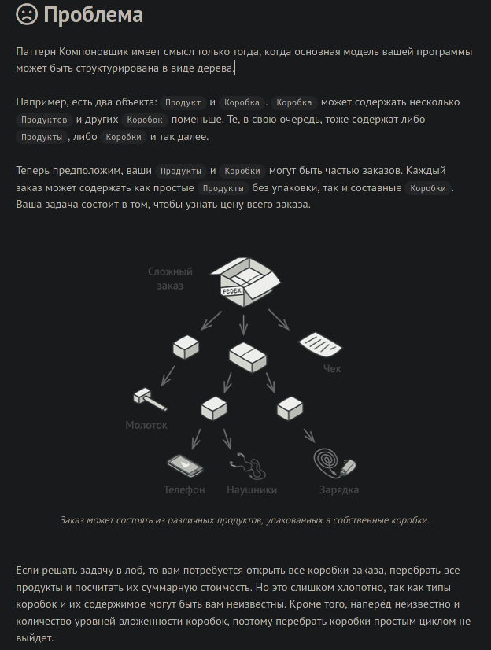

# Обработка исключений

## Теория:

### Как устроенный исключения


Слово `raise` переводиться как `поднять/возвысится/всплыть`, именно така логика работы исключений.
Место в котром возникло исключение, подымается по стеку вызовов, до тех пор пока оно не будет обработано в конструкции
`try\except`, либо это исключение дойдет до главного потока выполнения, и аварийно его завершит.

### try/except/finally

`try` = Попробуем выполнить код
`except` = Мы ожидаем что может возникнуть указанная ошибка
`finally` = Этот код мы выполняем в любом случае

Как это

```python
if __name__ == '__main__':

	x = 1
	y = 2

	a = open("tmp.txt", "w")
	try:
		a.write(x + y)
		print("try")
	except TypeError:
		a.write(f"{x + y}")
		print("except")
	finally:
		a.close()
		print("finally")
```

### Создаем собственные исключения

Для создания собственных исключений, необходимо наследоваться от стандартных исключений.

```python
class ValidatorError(ValueError): # !!!
	def __init__(self, text):
		self.text = text

	def __str__(self):
		return f"Ошибка вальвации: {self.text}"


def validation_token(token: str) -> bool:
	"""
	Токен должен начинается с `ghp` и должен иметь длину в 10 символов
	"""

	if token[:3] != "ghp":
		raise ValidatorError("Токен начинается без префикса `ghp`")
	elif len(token) < 10:
		raise ValidatorError("Токен короче 10 символов")
	elif len(token) > 10:
		raise ValidatorError("Токен больше 10 символов")

	return True


if __name__ == '__main__':
	token = "ghp_12ass3w"
	try:
		validation_token(token)
	except ValidatorError as e:
		print(f"Неверный токен, {e}")
```

## Закрепление:

### !

==Задача:==

Создайте функцию, которая делит два числа. При этом если произойдет деление на 0, функция должна обработать это исключение и
вернуть False.

# Типы лицензий

## Свободные лицензии

Виды свободных лицензий

- `BSD`
- `GNU/GPL`
- `Apache`
- `MIT`


[Все свободные лицензии](https://opensource.org/licenses/alphabetical)

## Платные лицензии

- Commercial software = Коммерческое программное обеспечение, т.е. программное обеспечение, всегда распространяемое только за плату.
    Оплата должна быть произведена авансом или сразу после получения копии на лицензионном диске или дискете в фирменной упаковке.

- Crippleware = Ключевые функциональные возможности отключаются до приобретения ключа.

## Условно-бесплатные

- Registerware = бесплатная программа, но с обязательной регистрацией.

- Shareware = Условно-бесплатное программное обеспечение - 
    пользователю бесплатно предоставляется программное
    обеспечение неполного функционала, то есть с некоторыми ограничениями,
    действующими до тех пор, пока не будет произведена оплата за полнофункциональный продукт.

---

# Пттерны проектирования

## Теория

### Синглтон

Синглтон - Гарантирует создания не более одного экземпляра.

---

- 
- 

---

Этот паттерн проектирования используют:

- при работе с файлами или БД.

---

Пример подключения к БД.

```python
from pprint import pformat


class Singleton:
    _instance = None  # Keep instance reference

    def __new__(cls, *args, **kwargs):  # 1
        if not cls._instance:
            cls._instance = super().__new__(cls)
            cls._instance.MAIN = args

        return cls._instance

    def __init__(self, name: str):  # 2
        self.name = name

    def __repr__(self):
        return pformat(self.__dict__)


if __name__ == '__main__':
    A = Singleton("Name A")
    B = Singleton("Name B")
    C = Singleton("Name C")
    D = Singleton("Name D")

    print(A) # {'MAIN': ('Name A',), 'name': 'Name D'}
    print(B) # {'MAIN': ('Name A',), 'name': 'Name D'}
    print(C) # {'MAIN': ('Name A',), 'name': 'Name D'}
    print(D) # {'MAIN': ('Name A',), 'name': 'Name D'}
```

---

### Легковес

Легковес — это паттерн проектирован, который экономит память, благодаря вынесению общих данных, за пределы класса.

---

- 

---

Этот паттерн проектирования используют:

- Когда ваш объект имеет множество экземпляров.

---

Пример с Односвязным списком. Здесь мы создали два класса, `Singlelist` для взаимодействия, а `NodeSinglelist` для хранения данных.
Если бы мы хранили в каждом экземпляре `NodeSinglelist` атрибут ,длинны, начала, и конца, то наша структура данных потребляла бы в 4 раза больше памяти

```python
class NodeSinglelist:
    def __init__(self, var):
        self.data: Any = var
        self.new_pt = None


class Singlelist:

    def __init__(self):
        self.head = None
        self.end = None
        self.len = 0

    def append(self, var):
        if self.end is not None:
            self.end.new_pt = NodeSinglelist(var)
            self.end = self.end.new_pt
        else:
            self.head = NodeSinglelist(var)
            self.end = self.head

        self.len += 1

    def __len__(self):  # !!
        return self.len


if __name__ == '__main__':
    A = Singlelist()
    A.append(1)
    A.append(2)
    A.append(3)
    A.append(4)

    print(A)
    print(len(A))
```

### Команда

Команда — Паттерн проектирования используемый для объединения различных запросов.

---

- 

---

Этот паттерн проектирования используют:

- Для стандартизации входных и выходных параметров.
- Для единого интерфейса, у разных классов, которые выполняют схожую задачу.

---

У нас есть три БД которые выполняют различные задачи. Они имеют методы, которые обрабатывают ошибки,
в процессе работы БД. Вся работа этих методов сводится к подготовке правильных данных, и добавления их в очередь.

Вся логика программу, которая отвечает за обработки и отправку ошибок находится в `HendlerEror`.

```python
from collections import deque
from datetime import datetime


class HendlerEror:
	__email = "my-email@google.com"
	__deque_error = deque()

	@staticmethod
	def sendErrorToEmail():
		print(HendlerEror.deque_error.poplef())

	@property
	def deque_error(self) -> deque:
		return HendlerEror.__deque_error

	@staticmethod
	def add_error(data_time: datetime, message_error: str):
		HendlerEror.deque_error.adppend((data_time, message_error))


class ModelPostgres:
	"""
	Бд для работников
	"""

	def error_worker_dont_have_name(self, id_worker: int):
		"""
		В БД есть запись про работника. Но в этой записи не обнаружено имени работника.

		:param id_worker: ID записи работника в бд
		"""
		HendlerEror.add_error(datetime.now(),
		                      f"У работника с ID:{id_worker} нет имени")


class ModelOrmMongoDb:
	"""
	БД для мобильного банка клиентов
	"""

	def error_limit_size_file(self, size_file: int):
		"""
		Файл БД достиг предельного размера

		:param size_file: Размер БД
		"""
		HendlerEror.add_error(datetime.now(),
		                      f"База данных {ModelOrmMongoDb.__name__}, достигла предельного размера = {size_file}")


class ModelMySQL:
	"""
	БД для налогового отчета
	"""

	def warning_connection_from_unknown_source(self):
		"""
		Произошло подключение к БД из неизвестного источника
		"""
		HendlerEror.add_error(datetime.now(),
		                      f"Подключение к {ModelMySQL.__name__} из неизвестного источника")

```

### Наблюдатель

Наблюдатель - паттерн проектирования, который создает механизм подписки. Позволяющий одним объектам следить и реагировать на события, происходящие в других объектах.

---

- 
- 

---

Этот паттерн проектирования используют:

- Когда у вас много клиентов(слушателей) с которыми нужно обмениваться данными.

---

Подключение к серверу через TCP протокол реальными пример, паттерна наблюдатель

---

### Прототип

Прототип - паттерн проектирования который позволяет копировать объекты, не вдаваясь в подробности их реализации.

---

- 
- 

---

Этот паттерн проектирования используют:

- Для создания копий

---

В `Python` есть специальный метод для копирования класса, он называется `__copy__`

```python
from copy import copy
from pprint import pformat


class MovieTicket:
	"""
	Билет в кино
	"""

	__id_ticket = 0

	def __init__(self, name_move: str, start_data_move: str):
		self.name_move = name_move
		self.start_data_move = start_data_move

		self.__id_ticket = MovieTicket.__id_ticket
		MovieTicket.__id_ticket += 1

	def __copy__(self):
		cls = self.__class__
		my_copy = cls.__new__(cls)
		my_copy.__dict__.update(self.__dict__)
		return my_copy

	def __repr__(self):
		return pformat(self.__dict__)


if __name__ == '__main__':
	A = MovieTicket("Очень интересный фильм", "2021.18.10:23:00")
	B = copy(A)

	print(A)
	print(B)

```

### Стратегия

Стратегия - паттерн проектирования, который объединяет семейство схожих алгоритмов.

---

- 

---

Этот паттерн проектирования используют:

- Когда существуют несколько алгоритмов, которые выполняют одну и тоже работу. Но мы не можем ограничиться одним алгоритмом,
    по причине совместимости со старыми версиями программ, или потому то, нам нужен оптимальный алгоритма под конкретные условию задачи.

---

Реальный пример паттерна **стратегия**, это подключение через HTTPS протокол. В этом протоколе
когда клиент подключается к серверу, он отправляет список поддерживаемых алгоритмов шифрования.
В ответ сервер отправляет один алгоритм из этого списка, который будет использовать.

- 
- 

### Адаптер

Адаптер — это паттерн проектирования, который позволяет объектам с несовместимыми интерфейсами работать вместе.

---

- 

---

Этот паттерн проектирования используют:

- Для уменьшения сложности программы, путем создания правильной абстракции, которая скрывает физические особенности и ограничений.

---

ORM системы это реальны пример адаптера. Мы можем написать один раз модель через ORM, и больше не задумываться об особеностях БД.
**(Но в некоторых случаях приходится учитывать особенности, для оптимизации программы!)**

---

### Компоновщик

Компоновщик = это паттерн проектирования, который позволяет сгруппировать множество объектов в древовидную структуру,
а затем работать с ней так, как будто это единичный объект.

---

- 
- 

---

Этот паттерн проектирования используют:

- Этот паттерн всегда используется при наследовании классов

---

Пример подсчета стоимости товара.

```python
class Product:  # Товар
	def __init__(self, name: str, price: int) -> None:
		self.name = name
		self.price = price

	def all_price(self):
		return self.price

	def __repr__(self):
		return self.name


class Box:  # Коробка
	def __init__(self, *args) -> None:
		self.box = list(args)

	def all_price(self):
		tmp = 0

		for _x in self.box:
			tmp += _x.all_price()

		return tmp

	def __repr__(self, res=""):
		return str(list(self.__dict__.items()))


if __name__ == '__main__':
	hammer = Product("Молоток", 450)
	phone = Product("Телефон", 45000)
	headphones = Product("Наушники", 4500)
	charging = Product("Зарядка", 1150)
	check = Product("Чек", 0)

	box_1 = Box(hammer)
	box_2 = Box(phone, headphones)
	box_3 = Box(charging)
	box_4 = Box(box_2, box_3)
	box_5 = Box(box_4, box_1, check)

	print(box_5)
	print(box_5.all_price())
	assert 450 + 45000 + 4500 + 1150 + 0 == box_5.all_price()


```

---

### Посредник

Посредник - паттерн проектирования который позволяет уменьшить связанность кода, путем создания промежуточных классов.

---

- 

---

Этот паттерн проектирования используют:

- В том случае если вы пишете программу для разных платформ, в которых нужно учитывать их особенности.

---

Например, вы хотите что бы ваша программа работала на ПК, смартфоне, и браузере. Все эти платформы имеют разные
подходы для создания графического интерфейса. Для того чтобы мы могли разрабатывать логику программы независимо от платформы,
мы используем класс посредник, который будет учитывать все особенности данной платформы.

Давайте посмотрим как можно реализовать функцию `os.listdir` используя только системные команды.

```python
import os
import sys


### Посредник, который дает команды
def get_command_all_file_in_folder() -> str:
	if sys.platform == "linux":
		return "ls"
	elif sys.platform == "win":
		return "ls"


def get_command_del_file() -> str:
	if sys.platform == "linux":
		return "rm"
	elif sys.platform == "win":
		return "del"
###

def listdir():
	os.system(f"{get_command_all_file_in_folder()} >> tmp.txt")

	with open("tmp.txt", "r") as _f:
		res = _f.read()

	os.system(f"{get_command_del_file()} tmp.txt")

	return res.split("\n")


if __name__ == '__main__':
	print(listdir())

```

[Реальный пример проекта](https://github.com/denisxab/console_debugger/blob/main/helpful/date_obj.py)

## Закрепление

[Другие примеры паттернов проектирования](https://refactoring.guru/ru/design-patterns/catalog)

# Композиции и Агрегация

Не стоить забывать о возможности создания экземпляра класса в классе.

- Здесь тоже есть зависимость, классов как при наследовании, но она более явная.
- Тут также можно расширять функционал с помощью других классов.
- Если ваши классы разные по логике, но работают для как-нибудь общей целью, и как то друг друга дополняют,
    то лучше не использовать наследование. Можно создавать экземпляр класса, в самом классе.

## Композиции

В композиции, один клас зависит от нескольких экземпляров других классов.
То есть у нас есть жёсткая связь с другими классами, которая заложена изначально.

```python
# Композиция

class File:
	def __init__(self, file_name: str):
		self.__file_name = file_name

	def write(self, data):
		print(f'Данные записаны в файл {data}')


class View:
	def __init__(self):
		self.__Model = Model()

	def show(self):
		print("Отрисовка данных")

	def save(self, data):
		print("Save")
		self.__Model.handler_write_to_file(data)


class Model:
	def __init__(self):
		self.__File = File("/home/document/save_file.txt")

	def handler_write_to_file(self, data):
		print("handler_write_to_file")
		self.__File.write(data)


if __name__ == '__main__':
	main_ = View()
	main_.save("Тест")
	"""
	Save
	handler_write_to_file
	Данные записаны в файл Тест
	"""

```

## Агрегация

Агрегация - это слабая форма композиции.
То есть мы определяем связи классов из вне, а потом уже передаем их в качестве параметров. В этом случае

```python
# Агрегация

class File:
	def __init__(self, file_name: str):
		self.__file_name = file_name

	def write(self, data):
		print(f'Данные записаны в файл {data}')


class View:
	def __init__(self, logic_model):
		self.__Model = logic_model

	def show(self):
		print("Отрисовка данных")

	def save(self, data):
		print("Save")
		self.__Model.handler_write_to_file(data)


class Model:
	def __init__(self, logic_file):
		self.__File = logic_file

	def handler_write_to_file(self, data):
		print("handler_write_to_file")
		self.__File.write(data)


if __name__ == '__main__':
	logic_file = File("/home/document/save_file.txt")
	logic_model = Model(logic_file)

	main_ = View(logic_model)

	main_.save("Тест")
	"""
	Save
	handler_write_to_file
	Данные записаны в файл Тест
	"""

```
