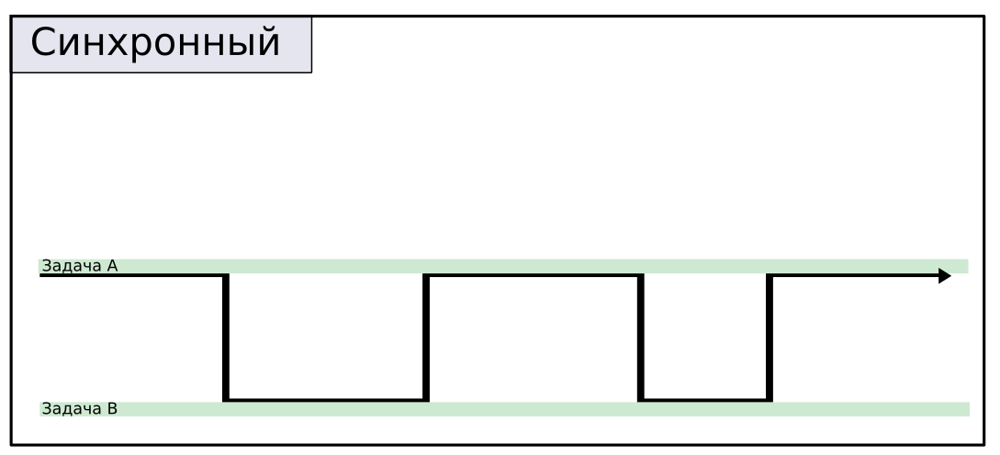
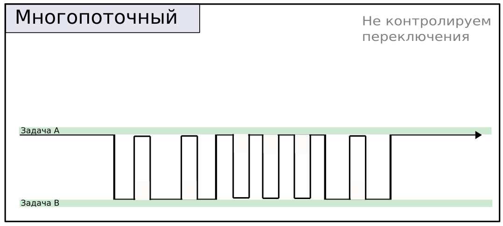
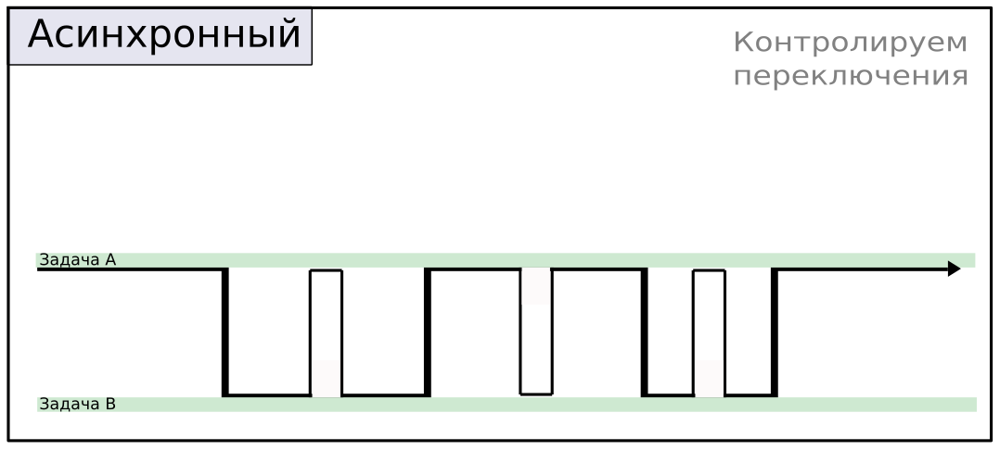

# Введение

**Псевдопараллелизм**- означает видимое одновременное выполнение нескольких вычислений на одном компьютере
Например, на компьютере с одноядерным центральным процессором (CPU) операционная система может  
быстро переключаться между программами. активизируя каждую из  
них в определенные моменты времени.

**Параллелизм** - это реальное параллельное выполнение нескольких  
вычислений в одно и то же время. Компьютеры с многоядерными процессорами
могут выполнять несколько задач одновременно. Каждое  
ядро выполняет инструкции отдельной программы. благодаря чему  
программы могут выполняться в течение одного и того же промежутка  
времени

Ключевым отличием истинного параллелизма от псевдопараллелизма
является выигрыш в производительности. Если программа выполняется
параллельно по двум возможным путям, то время, необходимое  
для выполнения определенного объема вычислений, сокращается в два  
раза, что равносильно двукратному увеличению производительности.  
В противоположность этому при псевдопараллелизме программы могут  
использовать для выполнения тысячи отдельных путей, однако никакого ускорения вычислений наблюдаться не будет.

---

В программирования существует 4 подхода для выполннения нескольких задач в одной программе.

- Синхронный подход = Его плюс заключается в простоте. Его легче разрабатывать и тестировать. Он не требует накладных расходов на запуск,
    поэтому идеально подходит для решения мелких задач, которые друг от друга зависят.
    

- Многопоточный подход = Его плюс заключается в относительной простоте создания многозадачности в коде.
    Он подходит для длительных вычислений, которые зависят друг от друга.
    

- Асинхронный подход = Его плюс в том что программисты могут лично управлять переключением между задачами, и в том что
    асинхронность потребляет меньше, памяти и времени на создания, в отличии от многопоточность. Подходит для I/O задач
    

- Многопроцессный подход = Его плюс в том что вы можете задействовать все мощности процессора для выполни сложных задач.
    

# Потоки

## Теория

### Как устроенны потоки

Поток – отдельное исполняемое задание внутри процесса. Процесс может содержать множество исполняемых потоков.
После запуска приложения запускается главный поток, который далее может порождать другие потоки.
Потоки существуют внутри процесса и обладают идентификатором внутри работающего приложения.

---

Особенности:

- Переключение потоков управляется ОС. Если программисту нужно координировать синхронность потоков, то ему нужно использовать
    блокировки
- Потоки имеют общую глобальную память, которая ограничивается процессом в котром они запущенны.
- Один поток в `Python` требует `512кб` ОЗУ
- Переключается каждые `5ms`
- Запуск потоков - дорогостоящее мероприятие. Если вы собираетесь постоянно создавать в программе функции ,
    предназначенные для одновременного выполнения, то накладные расходы. связанные с
    использованием потоков , значительно замедлят ее работу.
- Современные процессоры, распределяют нагрузку потоков на все ядра.
- Потоки не дают ощутимого ускорения при вычислениях.
- Потоки занимают время на свое создание. Чем больше потоков вы создаёте тем больше времени нужно, чтобы создать новый поток.

- 
- 

---

### Библиотека `threading`

Thread(`target=<:fun>, args=<:tuple>, daemon=<:bool>, name=<:str>`) - Основная функция которая отвечаете за создание потоков

- `target` Ссылка на функцию которая будет запущенна в новом потоке
- `args`Агргументы в функцию. Нужно передавать в виде `tuple`
- `daemon`Если значение `True` то принудительно завершит поток вмести с главным потоком.
- `name` Имя для потока

| Метод                      | Описание                                |
| -------------------------- | --------------------------------------- |
| threading.active_count()   | Количество запущенных потоков           |
| threading.enumerate()      | Получить список всех запущенных потоков |
| threading.current_thread() | Получить запущенный поток               |

| Метод             | Описание                             |
| ----------------- | ------------------------------------ |
| `<th>`.ident      | Получить Id запущенного потока       |
| `<th>`.name       | Получить имя потока                  |
| `<th>`.is_alive() | Узнать запущен ли поток              |
| `<th>`.start()    | Запустить поток                      |
| `<th>`.join()     | Подождите, пока поток не завершится. |

---

Пример использования синхронного и многопоточного кода

```python
import threading
import time


def test_sleep():
	Index = 0
	while True:
		time.sleep(0.3)
		print(Index)
		Index += 1


def thread_start():
	test_thread1 = threading.Thread(target=test_sleep, args=(), name="X1", daemon=True)
	test_thread2 = threading.Thread(target=test_sleep, args=(), name="X2", daemon=True)

	test_thread1.start()
	test_thread2.start()
	test_thread1.join()
	test_thread2.join()


def mono_start():
	test_sleep()


if __name__ == '__main__':
	thread_start()
```

---

Пример как запускать потоки через цикл

```python
list_thread = []
for x in range(count_tgread):
	test_thread1 = threading.Thread(target=test_sleep, args=(), name="X", daemon=True)
	list_thread.append(test_thread1)
	test_thread1.start()

for th in list_thread:
	th.join()
```

---

Часто встречается задача, когда нужно распределить участки массива на количество потоков

```python
def offset_thread(countItem, countThread) -> list[tuple[int, int]]:
	mid = countItem // countThread
	start: int = 0
	end: int = mid

	res: list[tuple[int, int]] = []
	for x in range(0, countThread - 1):
		res.append((start, end))
		start = end
		end += mid
	else:
		res.append((start, countItem))

	return res


if __name__ == '__main__':
	print(offset_thread(998, 4)) # [(0, 249), (249, 498), (498, 747), (747, 998)]
```

### Синхронизация потоков

### Не синхронный доступ

Пример **не** синхронного доступа к переменной. (Состояние гонки)

```python
import threading
import time

counter = 0


def f1():
    global counter
    while True:
        counter = 0
        time.sleep(0.1)
        print(counter)


def f2():
    global counter
    while True:
        counter = 1
        time.sleep(0.1)
        print(counter)


if __name__ == '__main__':
	a = threading.Thread(target=f1, daemon=True)
	b = threading.Thread(target=f2, daemon=True)

	a.start()
	b.start()
	a.join()
	b.join()
```

#### `RLock`

Особенность `RLock` заключается в том что мы можем, не беспокоится о блокировки всего процесса, при рекурсии.

---

Правила использования

```python
lock = RLock()

lock.acquire() # Выполнит блокировку данного участка кода

... доступ к общим ресурсам

lock.release() # Снять блокировку
```

Либо использовать контекстный менеджер

```python
lock = RLock()
with lock:
	... доступ к общим ресурсам
```

---

Пример синхронного блокирующего доступа. (То есть потоки будут ожидать разрешения)

```python
import threading
import time

counter = 0
lock = threading.RLock()


def f1():
	global counter
	while True:
		with lock:
			counter = 0
			time.sleep(0.1)
		print(counter)


def f2():
	global counter
	while True:
		with lock:
			counter = 1
			time.sleep(0.1)
		print(counter)


if __name__ == '__main__':
	a = threading.Thread(target=f1, daemon=True)
	b = threading.Thread(target=f2, daemon=True)

	a.start()
	b.start()
	a.join()
	b.join()
```

#### `Lock`

Правила использования.

```python
lock = Lock()

lock.acquire() # Выполнит блокировку данного участка кода

... доступ к общим ресурсам

lock.release() # Снять блокировку
```

Либо через контекстный менеджер.

```python
lock = Lock()
with lock:
	... доступ к общим ресурсам
```

Мы можем также проверять условие наличия блока. (Нам это пригодиться для синхронного не блокирующего доступа)

```python
if not _lock.locked():
	_lock.acquire()

	... доступ к общим ресурсам

	_lock.release()
```

---

Пример синхронного не блокирующего доступа. То есть поток будет пропускать итерацию если нет разрешения.

```python
import threading
import time

a = 0
_lock = threading.Lock()


def testTherad(name) -> None:
	global a, _lock

	for x in range(100):
		print(f"{name} = {a}\t\t")

		if not _lock.locked():
			_lock.acquire()

			a += 1
			time.sleep(3)

			_lock.release()

		else:
			time.sleep(1)
			continue


if __name__ == '__main__':
	threadList = []
	nameList = ["1", "2", "3", "4"]
	#
	for th in nameList:
		tmp = threading.Thread(target=testTherad, args=th, daemon=True)
		threadList.append(tmp)
		tmp.start()
	#
	for th in threadList:
		th.join()

```

### GIL

Python Global Interpreter Lock (GIL) — это своеобразная блокировка, позволяющая
только одному потоку управлять интерпретатором Python. Это означает, что в любой момент
времени будет выполняться только один конкретный поток.

Работа GIL может казаться несущественной для разработчиков, создающих однопоточные программы.
Но во многопоточных программах отсутствие GIL может негативно сказываться на производительности
процессоро-зависимых программ.

## Закрепление

### !

==Задача:== Придумать примеры где обязательно нужно использовать многопоточность

# Асинхронность

## Теория

### Как устроенна асинхронность

Асинхронность — однопоточный, однопроцессорный дизайн, использующий многозадачность.
Другими словами, асинхронность создает впечатление параллелизма, используя один поток в одном процессе.

Особенности:

- Программист может контролировать переключение процесса.
- Карутина требует менее `1кб` памяти.
- Карутины создаются намного быстрее потоков.
- Переключение между карутинами дольше чем у потоков.
- Используйте асинхронность в `I\O` задач.
- Существует много библиотек для реализации асинхронности в `I\O` задачах.(`httpx`)


### Собственный карутины

Асинхронность работает по принципу генераторов.

```python
def min_(name, arrt: tuple):
	min_a = arrt[0]
	for _x in arrt:
		if _x < min_a:
			min_a = _x
		else:
			yield None

	yield min_a


if __name__ == '__main__':

	a = min_("a", (12, 4, 10, 2))
	b = min_("b", (13, 2, 5, 0))
	c = min_("c", (34, 4, 10, 2))

	while True:
		try:
			print(next(a), next(b), next(c))
		except StopIteration:
			break

"""
None None None
None None None
2 0 2
"""
```

Аналог на `asyncio`

```python
async def min_(name, arrt: tuple):
	min_a = arrt[0]
	for _x in arrt:
		if _x < min_a:
			min_a = _x
		else:
			await asyncio.sleep(0)

	return min_a


async def main():
	tasks = [
			min_("a", (12, 4, 10, 2)),
			min_("b", (13, 2, 5, 0)),
			min_("c", (34, 4, 10, 2)),
			]

	return await asyncio.gather(*tasks)


if __name__ == '__main__':
	print(asyncio.run(main())) # [2, 0, 2]
```

Пример того как асинхронность справляется с `I/O` задачами

```python
import asyncio
import time

import httpx
import requests


async def re_get(url):
	async with httpx.AsyncClient() as client:
		response = await client.get(url)

	with open(f"async/image.jpg", 'wb') as f:
		f.write(response.content)
	return response


def re_get_sync(url):
	response = requests.get(url)

	with open(f"sync/image.jpg", 'wb') as f:
		f.write(response.content)
	return response


def async_test(url):
	start = time.time()

	async def main():
		tasks = [re_get(x) for x in url_]
		return await asyncio.gather(*tasks)

	print(asyncio.run(main()))
	end = time.time()
	print(end - start)


def sync_test(url):
	start = time.time()

	tasks = [re_get_sync(x) for x in url_]

	print(tasks)

	end = time.time()
	print(end - start)


if __name__ == '__main__':
	url_ = [
			"https://upload.wikimedia.org/wikipedia/commons/f/f8/Python_logo_and_wordmark.svg",
			"https://upload.wikimedia.org/wikipedia/commons/archive/f/f8/20100814032010%21Python_logo_and_wordmark.svg",
			"https://encrypted-tbn0.gstatic.com/images?q=tbn:ANd9GcTH4liiqVV_yMWR07-G9Q5UoZ-V3mDzYq7u5A&usqp=CAU",
			"https://bigpicture.ru/wp-content/uploads/2015/11/nophotoshop29-800x532.jpg",
			"https://upload.wikimedia.org/wikipedia/commons/f/f8/Python_logo_and_wordmark.svg",
			]
	url_ = url_ + url_ + url_ + url_ + url_ + url_ + url_ + url_
	print(len(url_))

	async_test(url_)	# 0.9230496883392334
	sync_test(url_)		# 5.610697031021118
```

### Библиотека `asyncio`

## Закрепление

### !

# Процессы

## Теория

### Как устроенны процессы

Процесс – это исполняемая копия приложения.
Например, когда вы открываете приложение MS Word, то запускаете процесс, исполняющий программу MS Word.

Каждый процесс обладает собственной памятью. Потоки же, которые запущены внутри процесса, разделяют память между собой.
Процесс внутри операционной системы обладает собственным идентификатором.
Многопроцессорность — отлично подходит для задач, нагружающих CPU.

Особенности:

- Один процесс нагружает одно ядро (CPU), но при этом процессов может быть больше чем реальных ядер.
- Процессы дольше создаются чем потоки.
- У процессов разное адресное пространство.
- В процессе могут быть потоки.
- В процессах нет GIL.


### Библиотека `multiprocessing`

Process(`target=<:fun>, args=<:tuple>, daemon=<:bool>, name=<:str>`) - Основная функция которая отвечаете за создание потоков

- `target` Ссылка на функцию которая будет запущенна в новом потоке
- `args`Агргументы в функцию. Нужно передавать в виде `tuple`
- `daemon`Если значение `True` то принудительно завершит поток вмести с главным потоком.
- `name` Имя для потока

| Метод             | Описание                               |
| ----------------- | -------------------------------------- |
| `<pr>`.ident      | Получить Id запущенного процесс        |
| `<pr>`.name       | Получить имя процесс                   |
| `<pr>`.is_alive() | Узнать запущен ли процесс              |
| `<pr>`.start()    | Запустить процесс                      |
| `<pr>`.join()     | Подождите, пока процесс не завершится. |

Простой пример

```python
import multiprocessing
import time


def work():
	a = 0
	while True:
		a += 1
		print(a)
		time.sleep(0.4)


if __name__ == '__main__':
	a = multiprocessing.Process(target=work, daemon=True)
	b = multiprocessing.Process(target=work, daemon=True)

	a.start()
	b.start()

	a.join()
	b.join()
```

---

Обратите внимание, что глобальные переменные не могут взаимодействовать друг с другом так как они находятся в разных адрессны пространствах.

```python
from multiprocessing import Process

RES = 0


def work(a):
	global RES
	RES += a + a
	print(f"work {RES = }")


if __name__ == '__main__':
	count = 5

	list_thread = []
	for x in range(1, count):
		a = Process(target=work, args=(x,),  daemon=True)
		list_thread.append(a)
		a.start()

	for x in list_thread:
		x.join()

	print(f"proc {RES = }")

```

#### Общие переменные

Для начало посмотрим что произойдет если мы обратимся к общей переменной.(Она будет уникальной для каждого процесса)

```python
from multiprocessing import Process, Value


def work(a, val):
	val[0] += a


def process_create(count):
	num = [0]

	list_thread = []
	for x in range(1, count):
		a = Process(target=work, args=(1, num),  daemon=True)
		list_thread.append(a)
		a.start()

	for x in list_thread:
		x.join()

	print(num) # [0]


if __name__ == '__main__':
	count = 5
	process_create(count)

```

Для того чтобы мы могли обращаться к переменным из других процессов нужно использовать тип данных `multiprocessing.Value`.
В этом случае ваши данные будут синхронизироваться через сокеты, поэтому все данные нужно хранить в битах.

```python
from multiprocessing import Process, Value


def work(a, val):
	val.value += a


def process_create(count):
	num = Value("d", 0)

	list_thread = []
	for x in range(1, count):
		a = Process(target=work, args=(1, num),  daemon=True)
		list_thread.append(a)
		a.start()

	for x in list_thread:
		x.join()

	print(num.value) # 4.0


if __name__ == '__main__':
	count = 5
	process_create(count)

```

Также напомню про то что мы можем работать со строками.

```python
from multiprocessing import Process, Value


def work(a, val):
	val.value = str(int(val.value) + a)


def process_create(count):
	num = Value("u", "0")

	list_thread = []
	for x in range(1, count):
		a = Process(target=work, args=(1, num),  daemon=True)
		list_thread.append(a)
		a.start()

	for x in list_thread:
		x.join()

	print(num.value) # 4


if __name__ == '__main__':
	count = 5
	process_create(count)

```

| Код типа | Тип в C            | Тип в python      | Минимальный размер в байтах |
| -------- | ------------------ | ----------------- | --------------------------- |
| 'b'      | signed char        | int               | 1                           |
| 'B'      | unsigned char      | int               | 1                           |
| 'u'      | wchar_t            | Unicode character | 2                           |
| 'h'      | signed short       | int               | 2                           |
| 'H'      | unsigned short     | int               | 2                           |
| 'i'      | signed int         | int               | 2                           |
| 'I'      | unsigned int       | int               | 2                           |
| 'l'      | signed long        | int               | 4                           |
| 'L'      | unsigned long      | int               | 4                           |
| 'q'      | signed long long   | int               | 8                           |
| 'Q'      | unsigned long long | int               | 8                           |
| 'f'      | float              | float             | 4                           |
| 'd'      | double             | float             | 8                           |

#### Общий массив

Для начало посмотрим что произойдет если мы обратимся к стандартным типам массивам.(Они будут уникальными для каждого процесса)

```python
from multiprocessing import Array, Process


def work(a, val):
	val[a] = a


def process_create(count):

	num = [0, 0, 0, 0, 0]

	list_thread = []
	for x in range(1, count):
		a = Process(target=work, args=(x, num), daemon=True)
		list_thread.append(a)
		a.start()

	for x in list_thread:
		x.join()

	print(num[:]) # [0, 0, 0, 0, 0]


if __name__ == '__main__':
	count = 5
	process_create(count)
```

Пример как можно использовать общий массив на несколько процессов. Для этого нужно использовать тип `multiprocessing.Array`

```python
from multiprocessing import Array, Process


def work(a, val):
	val[a] = a


def process_create(count):

	num = Array("i", [0, 0, 0, 0, 0])

	list_thread = []
	for x in range(1, count):
		a = Process(target=work, args=(x, num),  daemon=True)
		list_thread.append(a)
		a.start()

	for x in list_thread:
		x.join()

	print(num[:]) # [0, 1, 2, 3, 4]


if __name__ == '__main__':
	count = 5
	process_create(count)
```

#### Общая очередь

Пример того что стандартная очередь работает не корректно.(Они будут уникальными для каждого процесса)

```python
from collections import deque
from multiprocessing import Process, Value

def work(a, val):
	val.append(a)

def process_create(count):
	num = deque([0, 0, 0, 0, 0])

	list_thread = []
	for x in range(1, count):
		a = Process(target=work, args=(1, num),  daemon=True)
		list_thread.append(a)
		a.start()

	for x in list_thread:
		x.join()

	print(num) # deque([0, 0, 0, 0, 0])


if __name__ == '__main__':
	count = 5
	process_create(count)

```

Пример того как использовать специальную очередь для процессов. Тип данных `multiprocessing.Queue`

```python
from multiprocessing import Process, Queue


def work(a, val):
	val.put(a)


def process_create(count):
	num = Queue()

	list_thread = []
	for x in range(1, count):
		a = Process(target=work, args=(x, num), daemon=True)
		list_thread.append(a)
		a.start()

	for x in list_thread:
		x.join()

	for _ in range(num.qsize()):
		print(num.get(), end=', ') # 1,2,3,4


if __name__ == '__main__':
	count = 5
	process_create(count)

```

---

| Метод                          | Описание                                              |
| ------------------------------ | ----------------------------------------------------- |
| Queue.qsize() ->`int`          | Примерная длинна очереди                              |
| Queue.empty() ->`bool`         | Возвращает `True` если очередь пустая                 |
| Queue.full()->`bool`           | Возвращает `True` если очередь **не** пустая          |
| Queue.put(`<data:Any>`)        | Поместить элемент в очередь. Блокирует порядок        |
| Queue.put_nowait(`<data:Any>`) | Поместить элемент в очередь. **не** блокирует порядок |
| Queue.get()                    | Получить элемент из очереди. Блокирует порядок        |
| Queue.get_nowait()             | Получить элемент из очереди. **не** блокирует порядок |

[Документация](https://docs.python.org/3/library/multiprocessing.html#multiprocessing.Queue)

---

Пример как получить все элементы в очереди.

```python
while num.empty() != True:
	print(num.get())


# = или =

for _ in range(num.qsize()):
   print(num.get())
```

Вот пример, что будет если не блокировать очередь.

```python
from multiprocessing import Process, Queue


def work(a, val):
	val.put_nowait([a])


def process_create(count):
	num = Queue()

	list_thread = []
	for x in range(1, count):
		a = Process(target=work, args=(x, num), name=f"Поток{x}", daemon=True)
		list_thread.append(a)
		a.start()

	for x in list_thread:
		x.join()

	for _ in range(num.qsize()):
		print(num.get())


if __name__ == '__main__':
	count = 5
	process_create(count)

[1]
[2]
[4]
[3]
```

---

#### Синхронизация процессов

Синхронизация процессов такая же, как и у потоков. Но стоит помнить что данные в процессах уникальные.

Без синхронизации

```python
from multiprocessing import Lock, Process


def f(l, i):
	print('hello world', i)


if __name__ == '__main__':
	lock = Lock()

	for num in range(10):
		Process(target=f, args=(lock, num)).start()

```

С синхронизацией

```python
from multiprocessing import Lock, Process


def f(l, i):
	with l:
		print('hello world', i)


if __name__ == '__main__':
	lock = Lock()

	for num in range(10):
		Process(target=f, args=(lock, num)).start()

```

#### `Pool`

Если вам нужно распараллеливать вычисления только для одной задачи, то лучший использовать `Pool`.
Он запускает указанное количество процессов для выполнения функции, при этом он дожидается пока все процессы выполнятся, и
получает результат от них результат.

---

Как использовать.

```python
with multiprocessing.Pool(processes=<СколькоПроцессов>) as pool:
	results = pool.map(<СсылкаНаФункцию>, <Обьект.__iter__>)
```

---

Сравнение производительности.

```python
import multiprocessing
import time


def merge_names(n):
	fact = 1
	for i in range(1, n + 1):
		fact = fact * i
	return n


def merge_names_2(n, pqarr):
	fact = 1
	for i in range(1, n + 1):
		fact = fact * i
	pqarr.put(n)


def test_pool(count, fact):
	print("pool")
	start = time.time()
	with multiprocessing.Pool(processes=count) as pool:
		results = pool.map(merge_names, fact)

	end = time.time()
	print(end - start)
	print(results)


def test_sync(fact):
	print("sync")
	start = time.time()
	results = list(map(merge_names, fact))

	end = time.time()
	print(end - start)
	print(results)


def test_process(count, fact):
	print("process")
	start = time.time()

	pqarr = multiprocessing.Queue()

	list_thread = []
	for x in range(count):
		a = multiprocessing.Process(target=merge_names_2, args=(fact[x], pqarr), daemon=True)
		list_thread.append(a)
		a.start()

	for x in list_thread:
		x.join()

	end = time.time()
	print(end - start)

	for _ in range(pqarr.qsize()):
		print(pqarr.get(), end=", ")

	print()


if __name__ == '__main__':
	count = 4
	fact = [111116,
	        111117,
	        111118,
	        111119,
	        ]

	test_process(count, fact)
	time.sleep(1)
	test_pool(count, fact)
	time.sleep(1)
	test_sync(fact)

"""
process
5.797493934631348
[111118, 111116, 111117, 111119]

pool
5.736642360687256
[111116, 111117, 111118, 111119]

sync
11.319899559020996
[111116, 111117, 111118, 111119]
"""
```

## Закрепление

### !

==Задача:== Придумать примеры где обязательно нужно использовать мультипроцессинг

# Заключительные тесты

```bush
--------------------------------
Time CPU CPython
--------------------------------
pool		: 6.2107770442962650
process		: 7.2963356971740720
thread		: 10.433109760284424
sync		: 12.736245632171630
async		: 12.401671648025513
--------------------------------


--------------------------------
Time CPU PyPy
--------------------------------
process		: 4.87528204918
thread		: 11.0278871059
sync		: 11.0061020851
--------------------------------


---------------------------------------
Time CPU Скомпилированный через Nuitka
---------------------------------------
pool		: 5.597927808761597
process		: 6.027968645095825
thread		: 10.978685140609741
sync		: 10.996666193008423
async		: 12.906681776046753
---------------------------------------


----------------------------------------------------------------------
Time CPU Скомпилированный через Nuitka --plugin-enable=multiprocessing
----------------------------------------------------------------------
pool		: 5.459268808364868
process		: 5.439126968383789
thread		: 10.354399681091309
sync		: 10.886939287185669
async		: 12.748233795166016
----------------------------------------------------------------------


---------------------------------------------
Time Create x50
---------------------------------------------
Start async_test 	: 	0.0003001689910888672
Start thread_test	:	0.0034842491149902344
Start process_test	:	0.0532529354095459000
---------------------------------------------
```

---

Тест CPU

```python
import asyncio
import multiprocessing

import time
from collections import deque
from threading import Thread


def merge_names(n):
	fact = 1
	for i in range(1, n + 1):
		fact = fact * i
	return n


def merge_names_2(n, pqarr):
	fact = 1
	for i in range(1, n + 1):
		fact = fact * i
	pqarr.put(n)


def merge_names_3(n, arr: deque):
	fact = 1
	for i in range(1, n + 1):
		fact = fact * i
	arr.append(n)


async def merge_names_4(n):
	fact = 1
	for i in range(1, n + 1):
		fact = fact * i
		await asyncio.sleep(0)
	return n


def test_pool(count, fact):
	print("pool")
	start = time.time()
	with multiprocessing.Pool(processes=count) as pool:
		results = pool.map(merge_names, fact)

	end = time.time()
	print(end - start)
	print(results)


def test_sync(fact):
	print("sync")
	start = time.time()
	results = list(map(merge_names, fact))

	end = time.time()
	print(end - start)
	print(results)


def test_process(count, fact):
	print("process")
	start = time.time()

	pqarr = multiprocessing.Queue()

	list_thread = []
	for x in range(count):
		a = multiprocessing.Process(target=merge_names_2, args=(fact[x], pqarr), daemon=True)
		list_thread.append(a)
		a.start()

	for x in list_thread:
		x.join()

	end = time.time()
	print(end - start)

	for _ in range(pqarr.qsize()):
		print(pqarr.get(), end=", ")

	print()


def test_thread(count, fact):
	print("thread")
	start = time.time()

	pqarr = deque()

	list_thread = []
	for x in range(count):
		a = Thread(target=merge_names_3, args=(fact[x], pqarr), daemon=True)
		list_thread.append(a)
		a.start()

	for x in list_thread:
		x.join()

	end = time.time()
	print(end - start)
	print(pqarr)


def test_async(count, fact):
	print("async")

	start = time.time()

	async def main():
		tasks = [merge_names_4(fact[x]) for x in range(count)]
		return await asyncio.gather(*tasks)

	print(asyncio.run(main()))
	end = time.time()
	print(end - start)


if __name__ == '__main__':
	count = 4
	fact = [111116,
	        111117,
	        111118,
	        111119,
	        ]

	test_pool(count, fact)
	time.sleep(1)
	test_process(count, fact)
	time.sleep(1)
	test_thread(count, fact)
	time.sleep(1)
	test_sync(fact)
	time.sleep(1)
	test_async(count, fact)

```

Тест создания

```python
import asyncio
import threading
import time
from multiprocessing import Process


def work():
	time.sleep(5)


async def work_async():
	await  asyncio.sleep(5)


def thread_create(count):
	print("Start thread_test : ", end="")
	start = time.time()
	list_thread = []
	for x in range(0, count):
		a = threading.Thread(target=work, name=f"Поток{x}", daemon=True)
		list_thread.append(a)
		a.start()
		print(a.name)

	end = time.time()
	print(end - start)
	for x in list_thread:
		x.join()


def process_create(count):
	print("Start thread_test : ", end="")
	start = time.time()
	list_thread = []
	for x in range(0, count):
		a = Process(target=work, name=f"Процесс {x}", daemon=True)
		list_thread.append(a)
		a.start()
		print(a.name)

	end = time.time()
	print(end - start)
	for x in list_thread:
		x.join()


def async_create(count):
	print("Start async_test :", end="")
	start = time.time()

	end = 0

	async def main():
		nonlocal  end
		tasks = [work_async() for x in range(count)]

		end = time.time()
		return await asyncio.gather(*tasks)

	asyncio.run(main())
	print(end - start)


if __name__ == '__main__':
	count = 20
	async_create(count)     # 0.0002617835998535156
	# thread_create(count)    # 0.003774881362915039
	# process_create(count)   # 0.02444314956665039
```
