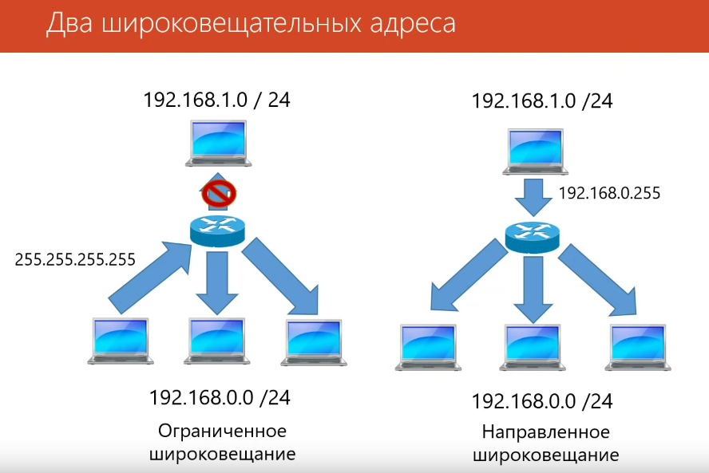
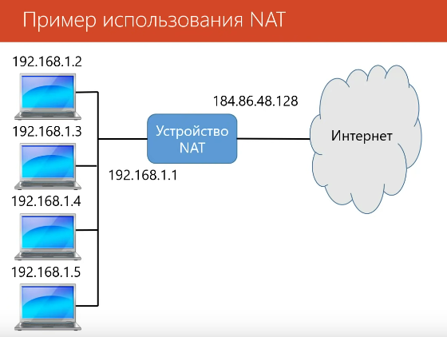
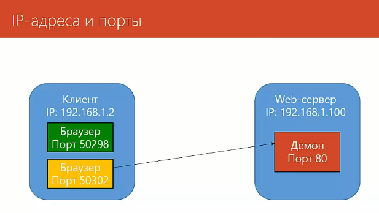
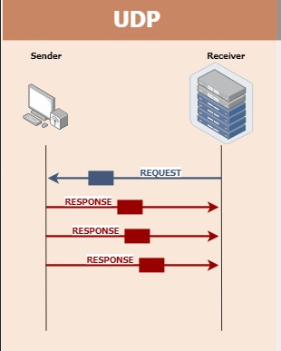
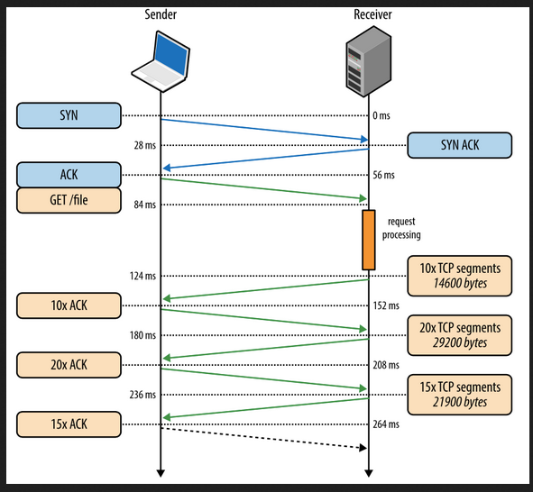
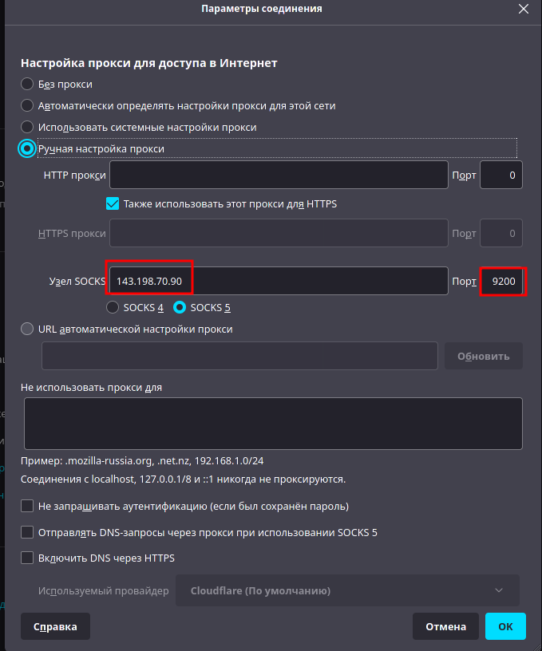

# Pickle, Json, Csv, YAML

## Теория

### Pickle

Сериализация = Преобразование объекта в строку бит

Десериализовать = Преобразование строки бит в объект

`Pickle` = Нужен для сериализация и десериализовать любый объектов в `Python`. Обратите внимание, что данные которые серализованны через `Pickle` не являются стандартном для других языков программирования, и без ваших доработок, они не смогут их десериализовать.

---

| Функция                                          | Описание                                    |
| ------------------------------------------------ | ------------------------------------------- |
| pickle.dump(`<Данные>, <_pickFile>, protocol=3`) | Сериализация и записать данных в файл       |
| pickle.load(`<_pickFile>`)                       | Прочитать и десериализовать данные из файла |
| ---                                              | ---                                         |
| pickle.dumps(`<Данные>, protocol=3`) -> `bytes`  | Сериализация данные                         |
| pickle.loads(`<Данные>`) -> `obj`                | Десериализация данных                       |

---

Высокоуровневый пример работы с `Pickle`

```python
import pickle
from os import makedirs, remove
from os.path import abspath, dirname, exists, getsize, splitext
from typing import Any, Union


class File:
	"""
	Родительский класс для работы с файлами
	"""
	__slots__ = "nameFile"

	def __init__(self, nameFile: str):
		self.nameFile: str = nameFile
		self.createFileIfDoesntExist()  # Создаем файл если его нет

	def createFileIfDoesntExist(self):
		# Создать файл если его нет
		if not exists(self.nameFile):
			tmp_ = dirname(self.nameFile)
			if tmp_:  # Если задан путь из папок
				makedirs(tmp_)  # Создаем путь из папок
				open(self.nameFile, "w").close()
			else:  # Если указано только имя файла без папок
				open(self.nameFile, "w").close()

	def checkExistenceFile(self) -> bool:
		# Проверить существование файла
		return True if exists(self.nameFile) else False

	def deleteFile(self):
		# Удаление файла
		if self.checkExistenceFile():
			remove(self.route())

	def sizeFile(self) -> int:
		# Размер файла в байтах
		return getsize(self.nameFile)

	def route(self) -> str:
		# Путь к файлу
		return abspath(self.nameFile)


class PickleFile(File):
	"""
	Работа с серализованными файлами
	"""

	def __init__(self, nameFile: str):

		if splitext(nameFile)[1] != ".pkl":  # Проверяем расширение файла
			raise FileNotFoundError("Файл должен иметь расширение .pkl")

		File.__init__(self, nameFile)

	def writeFile(self, data: Any, *, protocol: int = 3):
		# Сериализовать и записать данные в файл
		with open(self.nameFile, "wb") as _pickFile:
			pickle.dump(data, _pickFile, protocol=protocol)

	def readFile(self) -> Any:
		# Прочитать и десериализация данные из файла
		with open(self.nameFile, "rb") as _pickFile:
			return pickle.load(_pickFile)

	def appendFile(self, data: Union[tuple, list, dict, set], *, protocol: int = 3):
		tmp_data = self.readFile()

		if type(data) == type(tmp_data):  # Входные данные должны быть такого же типа что и в файле

			# List
			if type(data) == list:
				tmp_data.extend(data)
				self.writeFile(tmp_data, protocol=protocol)

			# Tuple
			elif type(data) == tuple:
				self.writeFile(tmp_data + data, protocol=protocol)

			# Dict Set
			elif type(data) == dict or type(data) == set:
				tmp_data.update(data)
				self.writeFile(tmp_data, protocol=protocol)

		else:
			raise TypeError("Тип данных в файле и тип входных данных различны")
```

Тесты

```python
def test_read_write():
	a = [1, 23, 43]

	pkfile = PickleFile("test/my.pkl")

	pkfile.writeFile(a)

	b = pkfile.readFile()

	print(f"a {id(a)}={a}")
	print(f"b {id(b)}={b}")

	assert a == b


def test_append():
	a = [3, 2, 1]
	pkfile = PickleFile("test/my.pkl")
	pkfile.writeFile(a)
	b = pkfile.readFile()
	print(f"a {id(a)}={a}")
	print(f"b {id(b)}={b}")
	assert a == b

	new_a = [-1, -2, 3]
	pkfile.appendFile(new_a)
	b = pkfile.readFile()

	print(f"a {id(a)}={a}")
	print(f"b {id(b)}={b}")
	assert a != b
	assert a + new_a == b

def test():
   a = (1,2,3,4)
   b = pickle.dumps(a)

   print(a)
   print(b)

   b = pickle.loads(b)

   print(a)
   print(b)

if __name__ == '__main__':
	test_read_write()
```

---

Также можно определять свою логику сериализация у классов

```python

class CustomClass:
	__id_count = 0

	def __init__(self, name_: str, id_: int):
		self.name = name_
		self.__id = CustomClass.__id_count
		CustomClass.__id_count += 1

	def __getstate__(self) -> dict: 				# pickle.dumps
		new_dict = self.__dict__.copy()
		new_dict.pop("_CostomClass__id")
		return new_dict

	def __setstate__(self, new_dict_data_: dict): 	# pickle.loads
		# new_dict_data_ Уже Десериализованынй
		self.__dict__.update(new_dict_data_)
		self.__dict__["_CostomClass__id"] = CustomClass.__id_count
		CustomClass.__id_count += 1

	def __str__(self):
		return pformat(self.__dict__)

if __name__ == '__main__':
   a = CustomClass("Тест", 1)
   f_data = pickle.dumps(a)
   f_new = pickle.loads(f_data)

   print(f_data)
   print(f"a {a}")			# a     {'_CostomClass__id': 0, 'name': 'Тест'}
   print(f"f_new {f_new}")	# f_new {'_CostomClass__id': 1, 'name': 'Тест'}
```

### Json

#### json

Формат файла который является стандартом для хранения данных. Он поддерживается всеми языками программирования. Активно используется в WEB разработки. Через формат `json` происходит взаимодействие бекенда и фронтенда.

---

Поддерживаемые типы для Json

- `list`
- `dict`
- `int`
- `str`
- `bool`
- `flaot`
- `None`
- `tuple` Будет записан как `list`

---

| Функция                                   | Описание                                 |
| ----------------------------------------- | ---------------------------------------- |
| json.dump(`<Данные>, <_jsonFile>, ...др`) | В json формат и записать данные в файл   |
| json.load(`<_jsonFile>`)                  | Прочитать и конвертировать из json файла |
| ---                                       | ---                                      |
| json.dumps(`<Данные>, ...др`) -> `str`    | В json                                   |
| json.loads(`<Данные>`) -> `obj`           | Конвертировать из json                   |

---

Высокоуровневый пример работы с `Json`

```python
import json
from os import makedirs, remove
from os.path import abspath, dirname, exists, getsize, splitext
from typing import Any, Union


class File:
	"""
	Родительский класс для работы с файлами
	"""
	__slots__ = "nameFile"

	def __init__(self, nameFile: str):
		self.nameFile: str = nameFile
		self.createFileIfDoesntExist()  # Создаем файл если его нет

	def createFileIfDoesntExist(self):
		# Создать файл если его нет
		if not exists(self.nameFile):
			tmp_ = dirname(self.nameFile)
			if tmp_:  # Если задан путь из папок
				makedirs(tmp_)  # Создаем путь из папок
				open(self.nameFile, "w").close()
			else:  # Если указано только имя файла без папок
				open(self.nameFile, "w").close()

	def checkExistenceFile(self) -> bool:
		# Проверить существование файла
		return True if exists(self.nameFile) else False

	def deleteFile(self):
		# Удаление файла
		if self.checkExistenceFile():
			remove(self.route())

	def sizeFile(self) -> int:
		# Размер файла в байтах
		return getsize(self.nameFile)

	def route(self) -> str:
		# Путь к файлу
		return abspath(self.nameFile)


class JsonFile(File):
	"""
	Работа с Json файлами
	"""

	def __init__(self, nameFile: str):

		if splitext(nameFile)[1] != ".json":  # Проверяем расширение файла
			raise FileNotFoundError("Файл должен иметь расширение .json")

		File.__init__(self, nameFile)

	def readFile(self) -> Union[list, dict, int, str, float, None, bool]:
		with open(self.nameFile, "r") as _jsonFile:
			return json.load(_jsonFile)

	def writeFile(self, data: Union[list, dict, int, str, float, None, bool, tuple],
	              *, indent=4,
	              skipkeys=False,
	              sort_keys=True,
	              ensure_ascii: bool = False):
		"""
		:param data: list, dict, int, str, float, None, bool, tuple.
		:param skipkeys: Если False вызовет исключение при неправильном типе данных.
		:param indent: Отступы для записи.
		:param sort_keys: Сортировать ключи.
		:param ensure_ascii: Экранировать символы, если False данные запишутся как есть.
		"""
		with open(self.nameFile, "w") as _jsonFile:
			json.dump(data, _jsonFile, skipkeys=skipkeys, sort_keys=sort_keys, indent=indent, ensure_ascii=ensure_ascii)

	def appendFile(self, data: Union[list, dict[str, Any]], *, ensure_ascii: bool = False):
		tmp_data = self.readFile()
		if type(data) == type(tmp_data):

			# List
			if type(data) == list:
				tmp_data.extend(data)
				self.writeFile(tmp_data, ensure_ascii=ensure_ascii)

			# Tuple
			elif type(data) == tuple:
				self.writeFile(tmp_data + data, ensure_ascii=ensure_ascii)

			# Dict Set
			elif type(data) == dict or type(data) == set:
				tmp_data.update(data)
				self.writeFile(tmp_data, ensure_ascii=ensure_ascii)

		else:
			raise TypeError("Тип данных в файле и тип входных данных различны")


def test_read_write():
	a = {
			"1.224.123.143" : ("898", "192.121.133.123:80", "Разрешить"),
			"2.234.65.34"   : ("875", "193.121.133.123:80", "Запретить"),
			"3.224.123.1423": ("898", "192.121.133.123:80", "Разрешить"),
			"5.234.65.343"  : ("875", "193.121.133.123:80", "Запретить"),
			"4.224.123.1543": ("898", "192.121.133.123:80", "Разрешить"),
			"7.2342.65.34"  : ("875", "193.121.133.123:80", "Запретить"),
			"6.2234.123.143": ("898", "192.121.133.123:80", "Разрешить"),
			"9.2345.65.34"  : ("875", "193.121.133.123:80", "Запретить"),
			}

	json = JsonFile("test/my.json")

	json.writeFile(a)

	b = json.readFile()

	print(f"a {id(a)}={a}")
	print(f"b {id(b)}={b}")


if __name__ == '__main__':
	test_read_write()

```

#### Json-RPC

[Официальная документация](https://www.jsonrpc.org/specification)

---

```python
pip install json-rpc
```

---

`Json-RPC` - Описывает правила взаимодействия с `API`. Данные храниться в формате `json`

---

Правила оформления

```python
get_ = {
		"jsonrpc": "2.0",  # Версия протокола
		"method" : "echo",  # Имя команды
		"params" : [],  # Параметры list|dict
		"id"     : 0,  # Номер запроса
		}

res_ = {
		"jsonrpc": "2.0",  # Версия протокола
		"result" : [],  # Результат str|list|dict|None
		"id"     : 0,  # Номер ответа

		"error"  : {  # Поля для ошибки
				"code"   : 0,  # Код ошибка
				"message": "",  # Короткое описание ошибки
				"data"   : [],  # Подробное описание
				},
		}
```

Пример работы с `Json-rpc`

```python
from pprint import pprint

import requests
import json


def main():
	url = "https://specialistoff.net/api"
	headers = {'content-type': 'application/json'}

	# Example echo method
	payload = {
			"method" : "questions",
			"params" : {"page": 1},
			"jsonrpc": "2.0",
			"id"     : 0,
			}
	response = requests.post(
			url, data=json.dumps(payload), headers=headers)

	print(response.url)

	pprint(response.json())


if __name__ == "__main__":
	main()

```

Пример ошибки в `Json-rpc`

```python
from pprint import pprint

import requests
import json


def main():
	url = "https://specialistoff.net/api"
	headers = {'content-type': 'application/json'}

	# Example echo method
	payload = {
			"method" : "questons",
			"params" : {"page": 1},
			"jsonrpc": "2.0",
			"id"     : 0,
			}
	response = requests.post(
			url, data=json.dumps(payload), headers=headers)

	print(response.url)

	pprint(response.json())


if __name__ == "__main__":
	main()

```

[Пример с VK API](https://github.com/denisxab/VK_skan/blob/main/vk_scan.py)

#### REST

`REST` - Описывает правила взаимодействия с `API`. Данные храниться в формате `json`. Поддерживает `GET` `POST` `PUT` `DELETE`

```python
from pprint import pprint
import requests


def main(get_dns):
	url = "https://api.domainsdb.info/v1/domains/search? "
	payload = {"limit" : "50",
	           "domain": get_dns}

	response = requests.get(url, params=payload)

	print(response.url)
	pprint(response.json())


if __name__ == "__main__":
	main("google")

```

[Исходный сайт](https://api.domainsdb.info/v1/#/)

#### `Pydantic`

##### Что такое ?

`Pydantic` - высокоуровневая библиотека для работы с `json` данными.

---

[Видео обзор `Pydantic`](https://www.youtube.com/watch?v=dOO3GmX6ukU&t=118s)

```bush
pip install pydantic
```

---

##### Общее

[Документация `Pydantic` ](https://pydantic-docs.helpmanual.io/usage/models/)

| Метод                                      | Описание                                    |
| ------------------------------------------ | ------------------------------------------- |
| `BaseModel`.json(`...`) -> `str`           | В `json`                                    |
| `BaseModel`.dict(`...`) -> `dict`          | В `dict`                                    |
| `BaseModel`.copy() ->`BaseModel`           | Возвращает копию объекта                    |
| `BaseModel`.schema() ->`dict`              | Вернуть подробную схему объекта `BaseModel` |
| `BaseModel`.schema_json() ->`str`          | Вернуть подробную схему объекта `BaseModel` |
| ---                                        | ---                                         |
| parse_raw(`'<JSON>'`) ->`BaseModel`        | Распарсить `JSON` текст                     |
| parse_obj(`<Dict>`) ->`BaseModel`          | Распарсить словарь                          |
| parse_file(`'<ПутьКФайлу>'`) ->`BaseModel` | Распарсить данные из файла                  |

.json(`by_alias=False`)

- `by_alias=False` Если `True` будет подставлять исходное имя. (Для двойных имен)
- `exclude=:set()` Указать какие поля исключить из конвертации в `json`

---

Создать класс из объектов `Python`

```python
from pydantic import BaseModel


class Profile(BaseModel):
	name: str
	fiends: list[int]
	old: int
	data_last_visit: int


if __name__ == '__main__':
	ob = {
			"name"           : "denis",
			"fiends"         : [1, 2, 3],
			"old"            : 21,
			"data_last_visit": 1231323,
			}

	user = Profile(**ob)
	print(user)         # name='denis' fiends=[1, 2, 3] old=21 data_last_visit=1231323
	print(user.fiends)  # [1, 2, 3]
	print(user.json())  # {"name": "denis", "fiends": [1, 2, 3], "old": 21, "data_last_visit": 1231323}
	print(user.dict())  # {'name': 'denis', 'fiends': [1, 2, 3], 'old': 21, 'data_last_visit': 1231323}
```

Создать класс из `json`

```python
from pydantic import BaseModel


class Profile(BaseModel):
	name: str
	fiends: list[int]
	old: int
	data_last_visit: int


if __name__ == '__main__':
	ob = """
	{
	"name": "denis",
	"fiends": [1, 2, 3],
	"old": 21,
	"data_last_visit": 1231323
	}
	"""

	user = Profile.parse_raw(ob)
	print(user)  # name='denis' fiends=[1, 2, 3] old=21 data_last_visit=1231323
	print(user.fiends)  # [1, 2, 3]
	print(user.json())  # {"name": "denis", "fiends": [1, 2, 3], "old": 21, "data_last_visit": 1231323}
	print(user.dict())  # {'name': 'denis', 'fiends': [1, 2, 3], 'old': 21, 'data_last_visit': 1231323}
```

---

##### Подробный отчет об ошибках

Подробный отчет об ошибки конвертации `ValidationError`

```python
from pydantic import BaseModel, ValidationError


class Profile(BaseModel):
	name: int
	fiends: list
	old: int
	data_last_visit: int


if __name__ == '__main__':

	json_input = """
	{
		"name":"Denis",
		"fiends":[1,2,3],
		"old":221,
		"data_last_visit":123
	}
	"""

	try:
		user = Profile.parse_raw(json_input)
		print(user)
	except ValidationError as e:
		print(e.json())

	"""
	[
	  {
		"loc": [
		  "name"
		],
		"msg": "value is not a valid integer",
		"type": "type_error.integer"
	  }
	]
	"""
```

---

##### Валидация полей

Мы можем установить проверку данных при распаковки `json` объектов

1. Нужно создать функция с декоратором `@root_validator` в который мы будем проверять все данные
2. Если данные не верны нужно вызвать исключение `ValueError`

```python
class Profile(BaseModel):
	name: str
	fiends: list[int]
	old: int
	data_last_visit: int


	@root_validator
	def main_validator(cls, jsonDict_: dict) ->dict:
		if jsonDict_["old"] <= 18:
			raise ValueError("key old dont Validator")

		return jsonDict_


if __name__ == '__main__':
	json_input = """
	{
		"name":"Denis",
		"fiends":[1,2,3],
		"old":15,
		"data_last_visit":123
	}
	"""

	try:
		user = Profile.parse_raw(json_input)
		print(user)
	except ValidationError as e:
		print(e.json())

"""
[
  {
    "loc": [
      "old"
    ],
    "msg": "My Validator",
    "type": "value_error"
  }
]
"""
```

Или можно проверить данные по отдельности. Для этого используем декоратор `@validator('<ИмяАтрибута>')`

```python
class Profile(BaseModel):
	name: str
	fiends: list[int]
	old: int
	data_last_visit: int


	@validator('old')
	def main_validator(cls, var: int) ->dict:
		if var <= 18:
			raise ValueError("key old dont Validator")
		return var


if __name__ == '__main__':
	json_input = """
	{
		"name":"Denis",
		"fiends":[1,2,3],
		"old":15,
		"data_last_visit":123
	}
	"""

	try:
		user = Profile.parse_raw(json_input)
		print(user)
	except ValidationError as e:
		print(e.json())

"""
[
  {
    "loc": [
      "old"
    ],
    "msg": "My Validator",
    "type": "value_error"
  }
]
"""
```

##### Двоенные имена `Aliase`

Изначально `Pydantic` ищет ключи из `json` по имени переменной в классе, но если у нас очень длинно имя в `json` мы можем изменить
логику поиска.

```python
from pydantic import BaseModel, Field


class Profile(BaseModel):
	name: str = Field(alias="BigNameBigNameBigName")
	old: int = Field(alias="BigNameBigNameBigOld")


if __name__ == '__main__':
	js = """
	{
		"BigNameBigNameBigName":"Ivan",
		"BigNameBigNameBigOld":23
	}
    """

	ob = Profile.parse_raw(js)

	print(js)
	print(ob)  # name='Ivan' old=23

	print(ob.json())  # {"name": "Ivan", "old": 23}
	print(ob.dict())  # {'name': 'Ivan', 'old': 23}

	print(ob.json(by_alias=True))  # {"BigNameBigNameBigName": "Ivan", "BigNameBigNameBigOld": 23}
	print(ob.dict(by_alias=True))  # {'BigNameBigNameBigName': 'Ivan', 'BigNameBigNameBigOld': 23}
```

---

### Csv

#### csv

CSV - текстовый формат, предназначенный для представления табличных данных. Строка таблицы соответствует строке текста, которая содержит одно или несколько полей, разделенных **запятыми**.

Высокоуровневый пример работы с `Csv`

```python
import csv
from os import makedirs, remove
from os.path import abspath, dirname, exists, getsize, splitext
from typing import Union

# pip install prettytable
from prettytable import PrettyTable


class File:
	"""
	Родительский класс для работы с файлами
	"""
	__slots__ = "nameFile"

	def __init__(self, nameFile: str):
		self.nameFile: str = nameFile
		self.createFileIfDoesntExist()  # Создаем файл если его нет

	def createFileIfDoesntExist(self):
		# Создать файл если его нет
		if not exists(self.nameFile):
			tmp_ = dirname(self.nameFile)
			if tmp_:  # Если задан путь из папок
				makedirs(tmp_)  # Создаем путь из папок
				open(self.nameFile, "w").close()
			else:  # Если указано только имя файла без папок
				open(self.nameFile, "w").close()

	def checkExistenceFile(self) -> bool:
		# Проверить существование файла
		return True if exists(self.nameFile) else False

	def deleteFile(self):
		# Удаление файла
		if self.checkExistenceFile():
			remove(self.route())

	def sizeFile(self) -> int:
		# Размер файла в байтах
		return getsize(self.nameFile)

	def route(self) -> str:
		# Путь к файлу
		return abspath(self.nameFile)


class CsvFile(File):
	def __init__(self, nameFile: str):

		if splitext(nameFile)[1] != ".csv":  # Проверяем расширение файла
			raise FileNotFoundError("Файл должен иметь расширение .csv")

		File.__init__(self, nameFile)

	def readFile(self,
	             *,
	             encoding: str = "utf-8",
	             limit: int = 0,
	             miss_get_head=False,
	             delimiter=",",
	             ) -> list[list[str]]:
		"""
		:param limit: Лимит чтения записей
		:param miss_get_head: Пропустить чтение заголовка
		:param delimiter: Символ, который будет разделять колонки
		:param encoding: Кодировка
		"""
		_res = []
		with open(self.nameFile, "r", encoding=encoding) as _csvFile:
			reader = csv.reader(_csvFile, delimiter=delimiter)

			if limit:  # Если есть лимит для чтения записей
				for _index, _row in enumerate(reader):
					if _index < limit:
						_res.append(_row)
					else:
						break
			else:  # Если лимита нет, то читаем все записи
				_res = list(reader)

			if miss_get_head:  # Если нужно пропустить заголовки
				return _res[1::]

			else:
				return _res

	def writeFile(self,
	              data: Union[list[Union[str, int, float]],
	                          list[list[Union[str, int, float]]]],
	              *,
	              header: tuple = None,
	              FlagDataConferToStr: bool = False,
	              encoding: str = "utf-8",
	              delimiter=",",
	              newline="",

	              ):
		"""
		:param data:
		:param header: Эти данные будут заголовками
		:param FlagDataConferToStr: Переводит все данные в формат str
		:param delimiter: Символ, который будет разделять колонки
		:param encoding: Кодировка
		"""
		with open(self.nameFile, "w", encoding=encoding, newline=newline) as _csvFile:
			writer = csv.writer(_csvFile, delimiter=delimiter)

			if header:  # Запись заголовка
				writer.writerow(header)

			if FlagDataConferToStr:
				if type(data[0]) != list:
					data = [str(n) for n in data]
				else:
					data = [[str(n) for n in m] for m in data]

			if type(data[0]) != list:
				writer.writerow(data)
			else:
				writer.writerows(data)

	def appendFile(self, data: Union[list[Union[str, int, float]],
	                                 list[list[Union[str, int, float]]]],
	               *,
	               FlagDataConferToStr: bool = False,
	               encoding: str = "utf-8",
	               delimiter=",",
	               ):
		"""
		:param data:
		:param FlagDataConferToStr: Переводит все данные в формат str
		:param delimiter: Символ, который будет разделять колонки
		:param encoding: Кодировка
		"""
		with open(self.nameFile, "a", encoding=encoding) as _csvFile:
			writer = csv.writer(_csvFile, delimiter=delimiter)

			if FlagDataConferToStr:
				if type(data[0]) != list:
					data = [str(n) for n in data]
				else:
					data = [[str(n) for n in m] for m in data]

			if type(data[0]) != list:
				writer.writerow(data)
			else:
				writer.writerows(data)

	@staticmethod
	def ptabel(data: list, align="l"):
		"""
		:param data:
		:param align:
		:return:
		"""
		x = PrettyTable(data[0])
		x.add_rows(data[1:])
		x.align = align
		return x
```

Тесты

```python
def test_1():
	cvs_file = CsvFile("test.csv")

	cvs_file.writeFile(
			[[1, 23, 41, 5],
			 [21, 233, 46, 35],
			 [13, 233, 26, 45],
			 [12, 213, 43, 56]], FlagDataConferToStr=True, header=("Данные", "Data", "Числа", "Num"))

	res = cvs_file.readFile(limit=2)
	print(res)

	assert res == [['Данные', 'Data', 'Числа', 'Num'], ['1', '23', '41', '5']]


def test_2():
	cvs_file = CsvFile("test.csv")
	cvs_file.writeFile(
			[
					["Kosta", "Мир как воля и представление", "3"],
					["Alex", "Бытие формирует мышление", "1"],
					["Ben", "Мышление фо,рмирует бытие", "3"],
					["Gena", "Один день много шансов", "1"],
					["Pavel", "Нет тех вершин что взять нельзя", "3"],
					],
			header=("Имя", "Цитата", "Рейтинг"),
			)

	res = cvs_file.readFile()
	print(res)

	assert res == [['Имя', 'Цитата', 'Рейтинг'], ['Kosta', 'Мир как воля и представление', '3'], ['Alex', 'Бытие формирует мышление', '1'],
	               ['Ben', 'Мышление фо,рмирует бытие', '3'], ['Gena', 'Один день много шансов', '1'], ['Pavel', 'Нет тех вершин что взять нельзя', '3']]


def test_3():
	cvs_file = CsvFile("test.csv")
	cvs_file.writeFile(
			[
					["Kosta", "Мир как воля и представление", "3"],
					["Alex", "Бытие формирует мышление", "1"],
					["Ben", "Мышление фо,рмирует бытие", "3"],
					["Gena", "Один день много шансов", "1"],
					["Pavel", "Нет тех вершин что взять нельзя", "3"],
					],
			header=("Имя", "Цитата", "Рейтинг"),
			)

	res = cvs_file.readFile()

	assert res == [['Имя', 'Цитата', 'Рейтинг'], ['Kosta', 'Мир как воля и представление', '3'], ['Alex', 'Бытие формирует мышление', '1'],
	               ['Ben', 'Мышление фо,рмирует бытие', '3'], ['Gena', 'Один день много шансов', '1'], ['Pavel', 'Нет тех вершин что взять нельзя', '3']]

	cvs_file.appendFile([
			["KostaS", 'Мир как воля, " и представление', "33"],
			["AlexS", "Бытие, формирует мышление", "12"],
			]
			)

	res = cvs_file.readFile()
	print(res)

	assert res == [['Имя', 'Цитата', 'Рейтинг'], ['Kosta', 'Мир как воля и представление', '3'], ['Alex', 'Бытие формирует мышление', '1'],
	               ['Ben', 'Мышление фо,рмирует бытие', '3'], ['Gena', 'Один день много шансов', '1'], ['Pavel', 'Нет тех вершин что взять нельзя', '3'],
	               ['KostaS', 'Мир как воля, " и представление', '33'], ['AlexS', 'Бытие, формирует мышление', '12']]


```

### YAML

#### yaml

- [Ознакомительное видео1](https://www.youtube.com/watch?v=YTnLSs1DmWQ)
- [Различия синтаксиса json vs yaml](https://www.youtube.com/watch?v=_zkTUhkRtuY)

---

YAML (Yet Another Markup Language/ Еще один язык разметки) = Аналог `json`. Ориентированный для удобного чтения.

---

- Как храниться `list`

    > ```python
    > [1,2,3,4,5]
    > ```
    >
    > Каждый элемент должен начинаться с `-` и одного пробела
    >
    > ```yaml
    > - 1
    > - 2
    > - 3
    > - 4
    > - 5
    > ```
    >
    > ```yaml
    > [1,2,3,4,5]
    > ```

- Как хранить двумерный `list`

    > ```yaml
    > - - 1
    >   - 1.1
    >   - 1.2
    > - - 2
    >   - 2.1
    >   - 2.2
    > - - 3
    >   - 3.1
    >   - 3.2
    > ```
    >
    > ```python
    > [[1, 1.1, 1.2], [2, 2.1, 2.2], [3, 3.1, 3.2]]
    > ```

- Как храниться `dict`

    > ```python
    > {"192.168.10.52":"8080", "192.168.10.9":"80"}
    > ```
    >
    > После ключа `:`
    >
    > ```yaml
    > 192.168.10.52: 8080
    > 192.168.10.9: 80
    > ```
    >
    > ```yaml
    > {192.168.10.52: 8080, 192.168.10.9: 80}
    > ```

- Как хранить двумерный `dict`

    > ```yaml
    > Main:
    >   head: '1'
    >   footer: '2'
    > Settings:
    >    head: '1'
    >    footer: '2'
    > Profile:
    >   head: '1'
    >   footer: '2'
    > ```
    >
    > ```python
    > {'Main': {'footer': '2', 'head': '1'},
    >  'Profile': {'footer': '2', 'head': '1'},
    >  'Settings': {'footer': '2', 'head': '1'}}
    > ```

- Словарь со списками.

    > ```yaml
    > Sun:
    > - Земля
    > - Венера
    > - Марс
    >
    > Alpha Centauri:
    > - Альфа Центавра B b
    > - Проксима Центавра b или Альфа Центавра C b
    > ```
    >
    > ```python
    > {
    > "Sun":[
    > 	"Земля",
    > 	"Венера",
    > 	"Марс"
    > 	],
    >
    > "Alpha Centauri":[
    > 		"Альфа Центавра B b",
    > 		"Проксима Центавра b или Альфа Центавра C b",
    > 		]
    > }
    > ```

- Список словарей.

    > ```yaml
    > - name: Kosta
    >   phone: 892312323
    > - name: Gerald
    >   phone: 392312323
    > - name: Tern
    >   phone: 192312323
    > ```

    > ```python
    > [
    >
    > 	{"name": "Kosta", "phone": "892312323"},
    > 	{"name": "Gerald", "phone": "392312323"},
    > 	{"name": "Tern", "phone": "192312323"},
    >
    > ]
    > ```

- Если есть специальные символы, то их нужно заключить в двойные`""` кавычки.

    > ```yaml
    > world: "anyname@email.com"
    > ```

- Если нужно записать многострочный текст, то нужно использовать. `>`

    > ```yaml
    > world: >
    >     Много
    >     Слов
    > ```

- Если вы хотите чтобы каждая строчка начиналась с новой строки. `|`

    > ```yaml
    > world: |
    >     Много
    >     Слов
    > ```

- Вы можете создавать переменные, которые потом считать. `&`Создать переменную. `*` считать переменную

    > ```yaml
    > world: &AnyName
    > - Настройка 1
    > - Настройка 2
    >
    > world2: *AnyName
    > world3: *AnyName
    > world4: *AnyName
    > world5: *AnyName
    > ```
    >
    > ```python
    > {'world': ['Настройка 1', 'Настройка 2'], 'world2': ['Настройка 1', 'Настройка 2'], 'world3': ['Настройка 1', 'Настройка 2'], 'world4': ['Настройка 1', 'Настройка 2'], 'world5': ['Настройка 1', 'Настройка 2']}
    > ```

- Разширение перемнных

    > ```yaml
    > world: &AnyName
    >   Настройка1: 1
    >   Настройка2: 2
    >
    > world2:
    >   <<: *AnyName
    >   Настройка3: 3
    >
    > world3: *AnyName
    > world4: *AnyName
    > world5: *AnyName
    >
    > ```
    >
    > ```python
    > {'world': {'Настройка1': 1, 'Настройка2': 2},
    >  'world2': {'Настройка1': 1, 'Настройка2': 2, 'Настройка3': 3},
    >  'world3': {'Настройка1': 1, 'Настройка2': 2},
    >  'world4': {'Настройка1': 1, 'Настройка2': 2},
    >  'world5': {'Настройка1': 1, 'Настройка2': 2}}
    > ```

- В `YAML` можно в одном файле создавать несколько документов. Их особенность заключается в том что у них разные пространство имен, и можно использовать те же самые ключи в разных документах.

    > ```yaml
    > foo: bar
    > ---
    > foo: bar
    > ```
    >
    > ```python
    > [{'foo': 'bar'}, {'foo': 'bar'}]
    > ```

---

#### Pyyaml

```bush
pip install pyyaml
```

Высокоуровневый пример работы с `YAML`

```python
from os import makedirs, remove
from os.path import abspath, dirname, exists, getsize, splitext
from pprint import pprint
from typing import Any, Generator, Union

import yaml
from yaml.composer import ComposerError


class File:
	"""
	Родительский класс для работы с файлами
	"""
	__slots__ = "nameFile"

	def __init__(self, nameFile: str):
		self.nameFile: str = nameFile
		self.createFileIfDoesntExist()  # Создаем файл если его нет

	def createFileIfDoesntExist(self):
		# Создать файл если его нет
		if not exists(self.nameFile):
			tmp_ = dirname(self.nameFile)
			if tmp_:  # Если задан путь из папок
				makedirs(tmp_)  # Создаем путь из папок
				open(self.nameFile, "w").close()
			else:  # Если указано только имя файла без папок
				open(self.nameFile, "w").close()

	def checkExistenceFile(self) -> bool:
		# Проверить существование файла
		return True if exists(self.nameFile) else False

	def deleteFile(self):
		# Удаление файла
		if self.checkExistenceFile():
			remove(self.route())

	def sizeFile(self) -> int:
		# Размер файла в байтах
		return getsize(self.nameFile)

	def route(self) -> str:
		# Путь к файлу
		return abspath(self.nameFile)


class YamlFile(File):
	def __init__(self, nameFile: str):
		if splitext(nameFile)[1] != ".yaml":  # Проверяем расширение файла
			raise FileNotFoundError("Файл должен иметь расширение .yaml")

		File.__init__(self, nameFile)

	def readFile(self,
	             *,
	             encoding: str = "utf-8",
	             Loader=yaml.Loader,
	             limit: int = 0
	             ) -> Union[list, dict, Any]:
		"""
		:param Loader: Разрешение чтение данных, которые хранятся в кастомном типе.
		:param encoding: Кодировка.
		:param limit: Если в файле есть документ, то можно указать сколько документов нужно прочитать. -1 пропитать все документы из файла
		"""

		def __read_all(__yamlFile):
			_reader: Generator = yaml.load_all(_yamlFile, Loader=Loader)
			return [_x for _x in _reader]

		with open(self.nameFile, "r", encoding=encoding) as _yamlFile:
			_res: Union[list, dict, Any] = []

			if limit == 0:  # Если нужно прочитать весь файл, в котором нет документов.
				try:
					_res = yaml.load(_yamlFile, Loader=Loader)
				except ComposerError as e:  # Если в файле есть несколько документов, то читаем все документы.
					_yamlFile.seek(0)  # Так как мы уже прочитали весь файл, то нам нужно вернутся в начало файла.
					_res = __read_all(_yamlFile)

			elif limit > 0:  # Если в файле есть документы, и нам нужно прочитать определенное количество документов.
				reader = yaml.load_all(_yamlFile, Loader=Loader)
				for _index, _row in enumerate(reader):
					if _index < limit:
						_res.append(_row)
					else:
						break
			else:  # Если в файле есть документы и нам нужно  прочитать все документы.
				_res = __read_all(_yamlFile)

		return _res

	def writeFile(self,
	              data: Union[list, dict, Any],
	              *,
	              encoding: str = "utf-8",
	              default_flow_style: bool = False,
	              allow_unicode=True,
	              ):
		"""
		:param data:
		:param encoding: Кодировка
		:param default_flow_style: 	Если вы хотите, чтобы коллекции всегда сериализовались в блочном стиле установите False
		:param allow_unicode:Экранировать символы, если True данные запишутся как есть.
		"""
		with open(self.nameFile, "w", encoding=encoding) as _yamlFile:
			yaml.dump(data, _yamlFile, default_flow_style=default_flow_style, allow_unicode=allow_unicode)

```

Тесты

```python
def test_1():
	data = [
			[1, 23, 41, 5],
			[21, 233, 46, 35],
			[13, 233, 26, 45],
			[12, 213, 43, 56]
			]

	yaml_file = YamlFile("test.yaml")

	yaml_file.writeFile(data)
	res = yaml_file.readFile()

	print(res)
	assert res == data


def test_2():
	__data = [
			["Kosta", "Мир как воля и представление", "3"],
			["Alex", "Бытие формирует мышление", "1"],
			["Ben", "Мышление фо,рмирует бытие", "3"],
			["Gena", "Один день много шансов", "1"],
			["Pavel", "Нет тех вершин что взять нельзя", "3"], ]

	yaml_file = YamlFile("test.yaml")

	yaml_file.writeFile(__data)
	res = yaml_file.readFile()

	print(res)
	assert res == __data


def test_3():
	yaml_file = YamlFile("test.yaml")
	res = yaml_file.readFile()
	pprint(res)


def test_4():
	__data = {"recept": {

			"pizza" : "1",
			"pizza2": "2",
			}}

	yaml_file = YamlFile("test.yaml")

	yaml_file.writeFile(__data)
	res = yaml_file.readFile()

	print(res)
	assert res == __data
```

## Закрепление

### !

# Введение в компьютерные сети

## Сетевая модель OSI

| Тип данных               | Название уровня | Ключевые слова                           | Примеры технологий           |
| ------------------------ | --------------- | ---------------------------------------- | ---------------------------- |
| Данные                   | Прикладной      | Доступ к сетевым службам                 | HTTP, FTP, IMAP, WebSocket   |
| Данные                   | Представление   | Представление и кодировка данных         | ASCII, UTF-8, HTML, PNG, MP3 |
| Данные                   | Сеансовый       | Управление сеансом                       | PRC, REST                    |
| Блок/сегмент/дейтаграмма | Транспортный    | Безопасность и надежность соединение     | TCP, UPD, TLS                |
| Пакет                    | Сетевой         | Определение пути и IP                    | IPv4, IPv6                   |
| Кадр                     | Канальный       | MAC и LLC (Физическая адресация)         | 802.22, Ethernet             |
| Биты                     | Физический      | Кабель, сигнал, бинарная передача данных | USB, витая пара, оптоволокно |


## Сетевая модель TCP-IP

| Тип данных               | Название уровня | Ключевые слова                       | Примеры технологий         |
| ------------------------ | --------------- | ------------------------------------ | -------------------------- |
| Данные                   | Прикладной      | Доступ к сетевым службам             | HTTP, FTP, IMAP, WebSocket |
| Блок/сегмент/дейтаграмма | Транспортный    | Безопасность и надежность соединение | TCP, UPD, TLS              |
| Пакет                    | Сетевой         | Определение пути и IP                | IPv4, IPv6                 |
| Кадр                     | Канальный       | MAC и LLC (Физическая адресация)     | Ethernet, 802.11           |

## Канальный

### Описание

Задача канального уровня

- Передача сообщений по каналу связи - кадров
- Определение начала и конца сообщения в потоке бит
- Обнаружения и коррекции ошибок
- Физическая адресация
- Согласования доступа к каналу

---

Ethernet - Передача данных через провод. (Размер кадра 1500 байт)

- Типы Ethernet
    > 

---

IEEE 802.11 - WiFi (Размер кадра 2304 байт)

- Типы Wifi

    > 

- Если в одной области используйтесь более 14 wifi точек, то будет возникать множество помех
    > 

---

### MAC - Адрес

`MAC addres`- идентификатор сетевой карты.

---

Все MAC - адреса должны быть уникальными в сети (Локальной). Они изначально назначаются производитель, но в интернете нет жёсткого контроля MAC адресов, и поэтому есть способы его поменять.

Способ изменить MAC адрес [Генератор MAC адресов](https://www.browserling.com/tools/random-mac)

```bush
sudo ifconfig enp3s0 down
sudo ifconfig enp3s0 hw ether 4c:49:1d:2b:2a:5f
sudo ifconfig enp3s0 up
```

---

[Узнать производителя по MAC адресу](https://dnschecker.org/mac-lookup.php?query=4c%3A49%3A1d%3A2b%3A2a%3A5f)

```bush
88:d7:f6:3c:54:63
```

1 три байта идентификатор производителя
2 три байта идентификатор устройства у производтеля

---

## Сетевой

- [Плейлист уроков про компьютерные сети](https://www.youtube.com/watch?v=OLFA0soYGhw&list=PLtPJ9lKvJ4oiNMvYbOzCmWy6cRzYAh9B1&index=2)

### IP

---

IP - Интернет протокол, глобальный адрес.


---

IPv4 = Длина 32 бит (4 актета)

```bush
192.168.10.52
```

IPv6 = Длина 128 бит

```bush
fe80::bc9a:6188:9888:54dc
```

---

Специальные IP адреса

| IPv4                                      | IPv6            | Описание                                                               |
| ----------------------------------------- | --------------- | ---------------------------------------------------------------------- |
| 127.0.0.1/8                               | ::1             | Локальный IP устройство (`localhost`)                                  |
| 10.0.0.0/8; 172.16.0.0/12; 192.168.0.0/16 | fec0:: — feff:: | IP для частных сетей, они не маршрутизируются в интернете              |
| 0.0.0.0                                   |                 | В контексте сервера, это значит прослушивать все `ip` адреса в системе |

---

Маска подсети - разделяет ip адрес сети от ip адреса хоста. виды записи.

- В десятичном виде

```bush
inet 	192.168.010.52  
netmask 255.255.255.00
host	000.000.000.52
```

- В виде префикса

```bush
inet 	192.168.010.52/24  
host	000.000.000.52
```

---

Внешний IP = Маршрутизируется в интернете, адреса выдается организаций `ICANN`. Обычные пользователи в реальности обращаемся к провайдерам и арендуем у них (внешний/статический ip), за определённую месячную плату.

- 

---

Частый IP = Назначается я из пула адресов `10.0.0.0/8; 172.16.0.0/12; 192.168.0.0/16`

- Данные ip адреса не маршрутизируются в интернете. Но использую устройства NAT который заменит наш частный ip на свой публичны ip, мы можем взаимодействовать с интернет сетями.

---

Широковещательный IP = Данные адресуется всем устройствам в частной сети. Маршрутизатор не пересылает широковещательные пакеты, в другие сети.

- Данный ip используется, чтобы найти все подключенные устройства к сети.
- Если нам нужно чтобы маршрутизатор отправил наш широковещательный пакет в другую сеть, к которой маршрутизатор подключен непосредственно, то нам нужно записать как `255` в адресе хоста`192.168.10.255`
- Если нам нужно отправить широковещательный запрос по все хостам внутри одного маршрутизатора, то нам нужно указать `255.255.255.255`



---

### DHCP

`DHCP` = протокол динамической конфигурации хостов. Этот протокол позволяет автоматически назначать ip адреса устройствам внутри сети.

[DHCP](https://www.youtube.com/watch?v=uZJ8WVdw-Ck&list=PLtPJ9lKvJ4oiNMvYbOzCmWy6cRzYAh9B1&index=27)

---

### ARP

`ARP` протокол позволяющий определить MAC адрес устройства по его IP адресу. `ARP` запросы не проходят через маршрутизаторы, поэтому мы можем получить MAC адреса только внутри сети.

Чтобы посмотреть `ARP` таблицу в Linux используйте команду
`sudo arp-scan --interface=<Интерфейс> --localnet`

[ARP](https://www.youtube.com/watch?v=EZkkodleWqc&list=PLtPJ9lKvJ4oiNMvYbOzCmWy6cRzYAh9B1&index=28)

---

### ICMP

`ICMP` протокол межсетевого управления. Используется для тестирования работоспособности сети.

Самый известные команды которые используют `ICMP` протокл

- `ping <IP\DOMEN>` = Проверить доступность к устройству.
- `traceroute -I <IP\DOMEN>` = Получить путь к хосту.(Через какие маршрутизаторы проходит трафик)
- `mtr -b <IP\DOMEN>` = То же самое что и `traceroute`, но работает быстрее.

[ICMP](https://www.youtube.com/watch?v=9iG6ECpF-ko&list=PLtPJ9lKvJ4oiNMvYbOzCmWy6cRzYAh9B1&index=29)

### NAT

Network Address Translation — трансляция сетевых адресов. Технология преобразования IP из частотной сети, в IP публичной сети.

Нужен он чаще всего для подключения вашей локальной сети к Интернету. Дело в том, что теоретически существует 4 миллиарда IPv4 адресов. Даже если бы у каждого жителя планеты был всего один компьютер, адресов бы уже не хватало. А тут разве что утюги к Интернету не подключаются. Умные люди сообразили это ещё в начале 90-х, и как временное решение предложили разделить пространство адресов на публичные (белые) и приватные (частные, серые).

Приватные мы можем свободно использовать в своей частной сети, и поэтому, разумеется, они будут повторяться. Как же быть с уникальностью ?. Тут и выходит на сцену NAT. По большому счёту, это обман, подстава. На натирующем устройстве ваш приватный адрес, грубо говоря, просто подменяется на белый адрес, который и будет фигурировать далее в пакете, пока он путешествует до WEB-сервера. А вот белые адреса очень даже хорошо маршрутизируются, и пакет точно вернётся обратно на натирующее устройство.

---

Типы NAT

- Статически = Один внутренний адрес имеет один внешний адрес.
- Динамический = Много внутренних адресов, и несколько внешних адресов.
- Один ко многим = Много внутренних адресов, и один внешний. (+)

Пример работы NAT (Преобразование выполняется с помощью NAT таблицы)

- 
- 
- 

Обратить внимание

- Внутренний порт может быть любым, и может повториться в столбце.
- Внешний порт должен быть уникальным в столбце, его генерирует само устройство NAT.

---

[Трансляция сетевых адресов (NAT)](https://www.youtube.com/watch?v=L1JtmAiSaFQ&list=PLtPJ9lKvJ4oiNMvYbOzCmWy6cRzYAh9B1&index=42)

### UDS - Unix Socket

Unix Socket = представляет собой механизм межпроцессного взаимодействия , который позволяет осуществлять обмен данными между двунаправленных процессов , работающих на одной и той же машине. Unix Socket , что они выполняются в одной и той же системе, поэтому они могут избежать некоторых проверок и операций (например, маршрутизации); что делает их быстрее и легче, чем IP-сокеты. Поэтому, если вы планируете взаимодействовать с процессами на одном хосте, это лучший вариант, чем IP-сокеты.

Доменные соединения Unix являются по сути байтовыми потоками, сильно напоминая сетевые соединения, но при этом все данные остаются внутри одного компьютера (то есть обмен данными происходит локально). UDS используют файловую систему как адресное пространство имен. Это позволяет двум различным процессам открывать один и тот же сокет для взаимодействия между собой. Однако, конкретное взаимодействие, обмен данными, не использует файловую систему, а использует оперативную память.

---

## Транспортный

### Порт

Порт - это адрес от 1 до 65535, которое использует приложения на устройстве. Он назначается автоматически операционной системой. Каждое приложение имеет свой порт, поэтому на одном устройстве может быть запущенно множество приложений, которые будут использовать одну и туже сетевую карту, MAC, IP адрес.

---

Обратите внимание, что порт по которому мы обращаемся к другому устройству, не обязан соответствовать порту котрой будет использоваться у нас. (То есть мы можем подключиться к множеству web-серверам по порту `80`, но получать данные от них мы будем на разные порты, которые назначила система). Если наше устройство выступает в качестве сервера, то тогда мы можем указать какой именно порт нужно "слушать".



---

Зарезервированные порты. (Хорошо инверсные порты)

| Порт  | Протокол |
| ----- | -------- |
| 21    | FTP      |
| 22    | SSH      |
| 25    | SMTP     |
| 80    | http     |
| 53    | DNS      |
| 67,68 | DNCP     |
| 143   | imap     |
| 443   | HTTPS    |

[Другие зарезервированные порты](https://ru.wikipedia.org/wiki/%D0%A1%D0%BF%D0%B8%D1%81%D0%BE%D0%BA_%D0%BF%D0%BE%D1%80%D1%82%D0%BE%D0%B2_TCP_%D0%B8_UDP)

Если мы хотим использовать свои порты, то лучше их выбирать из диапазона 49151-65535, потому что они не зарезервированные, и не требуют `root` доступа для создания.

---

Посмотреть все используемые порты на устройстве

```bush
netstat -ap
```

- `-a` = все порты
- `-t` = TCP порты
- `-u` = UDP порты
- `-x` = UDS порты

- `-l` = Показать только `LISTEN`
- `-s` = Посмотреть статистику порта
- `-p` = Выводит `PID` и имя файла использующий порт

---

### UDP

UDP = Протокол транспортного уровня. Так как он не требует подтверждения доставки данных от клиента, то он работает быстрее `TCP`.


---

- Не гарантируют доставку данных и порядок сообщений.
- Не требует соединения.
- Сообщение называют "дейтаграммой"



---

UDP используется в

- `DNS`
- Стриминги видео, звука

---

[Протокол UDP](https://www.youtube.com/watch?v=GBrLfZvRrd8&list=PLtPJ9lKvJ4oiNMvYbOzCmWy6cRzYAh9B1&index=32)

### TCP

TCP = Протокол транспортного уровня. Обеспечивает надежную передачу данных


---

- Гарантируют доставку данных и порядок сообщений.
- Требует соединения.
- Сообщение называют "Надежный поток байт" (stream)



---

TCP используется в

- `HTTP`/`HTTPS`/`SSH`/`FTP`

---

- [Протокол TCP](https://www.youtube.com/watch?v=CKUOb4htnB4&list=PLtPJ9lKvJ4oiNMvYbOzCmWy6cRzYAh9B1&index=33)
- [Протокол TCP: соединение](https://www.youtube.com/watch?v=vt69HEbZ_pI&list=PLtPJ9lKvJ4oiNMvYbOzCmWy6cRzYAh9B1&index=35)
- [Протокол TCP: скользящее окно](https://www.youtube.com/watch?v=hd6QNXK5rPk&list=PLtPJ9lKvJ4oiNMvYbOzCmWy6cRzYAh9B1&index=34)
- [Протокол TCP: управление потоком](https://www.youtube.com/watch?v=YCW4fLqFlME&list=PLtPJ9lKvJ4oiNMvYbOzCmWy6cRzYAh9B1&index=37)
- [Протокол TCP: формат заголовка](https://www.youtube.com/watch?v=wP8iUpM5DHU&list=PLtPJ9lKvJ4oiNMvYbOzCmWy6cRzYAh9B1&index=36)
- [Протокол TCP: управление перегрузкой 1](https://www.youtube.com/watch?v=lGUPQjvSMeo&list=PLtPJ9lKvJ4oiNMvYbOzCmWy6cRzYAh9B1&index=38)
- [Протокол TCP: управление перегрузкой 2](https://www.youtube.com/watch?v=H6rMGYRKI2s&list=PLtPJ9lKvJ4oiNMvYbOzCmWy6cRzYAh9B1&index=39)

## Прикладной

### DNS

`DNS` (Domain Name System «система доменных имён») Протокол используется для получения IP-адреса по имени хоста(домена). DNS имена распределяются организацией `ICAN`. В реальности, для того чтобы получить конкретно доменное, имя нужно его арендовать, например на сайте [reg.ru](https://www.reg.ru/domain/new/). Но также есть возможно получить бесплатное доменное имя в зависимости от зоны действия [freenom](https://www.freenom.com/ru/index.html?lang=ru). Также возможно что вмести с арендованием хостинга, вам выдадут случайны бесплатно домен второго уровня.

---

Зачем нужен:

- Понятное имя для человека
- Возможность изменять ip адреса, не изменяя домен.
- Одно доменное имя может иметь множество Ip адресов. Таким образом DNS распределят нагрузку на сервера.

---

Порядок идет с право на лево. Вышестоящий DNS сервер, должен знать только о ближайшем нижестоящем уровне. Конечный DNS сервер должен вернуть Ip адрес.

- 
- 
- 

---

- [Система доменных имен DNS](https://www.youtube.com/watch?v=B0J0c0KLtbQ&list=PLtPJ9lKvJ4oiNMvYbOzCmWy6cRzYAh9B1&index=45)
- [Протокол DNS](https://www.youtube.com/watch?v=yAlm-jTneeY&list=PLtPJ9lKvJ4oiNMvYbOzCmWy6cRzYAh9B1&index=46)

### Прокси сервер

Прокси-сервер (от англ. proxy — представитель, уполномоченный; часто просто прокси, сервер-посредник) — промежуточный сервер (комплекс программ) в компьютерных сетях, выполняющий роль посредника между пользователем и целевым сервером (при этом о посредничестве могут как знать, так и не знать обе стороны), позволяющий клиентам как выполнять косвенные запросы (принимая и передавая их через прокси-сервер) к другим сетевым службам, так и получать ответы. Сначала клиент подключается к прокси-серверу и запрашивает какой-либо ресурс (например e-mail), расположенный на другом сервере. Затем прокси-сервер либо подключается к указанному серверу и получает ресурс у него, либо возвращает ресурс из собственного кэша (в случаях, если прокси имеет свой кэш). В некоторых случаях запрос клиента или ответ сервера может быть изменён прокси-сервером в определённых целях. Прокси-сервер позволяет защищать компьютер клиента от некоторых сетевых атак и помогает сохранять анонимность клиента, но также может использоваться мошенниками для скрытия адреса сайта, уличённого в мошенничестве, изменения содержимого целевого сайта (подмена), а также перехвата запросов самого пользователя.

- Помогает обходить блокировки, путем изменения своего местоположения.
- Не шифрует трафик.
- Работают быстрее `VPN`.

---

`SOCKS 5` сетевой протокол сеансового уровня модели OSI, который позволяет пересылать пакеты от клиента к серверу через прокси-сервер прозрачно (незаметно для них) и таким образом использовать сервисы за межсетевыми экранами (файрволами).

Запрос клиента:

Ответ сервера:


---



---

[Актуальный список с прокси серверами](https://github.com/monosans/proxy-list)

> 

### HTTP

HTTP (англ. HyperText Transfer Protocol — «протокол передачи гипертекста») — протокол прикладного уровня передачи данных, изначально — в виде гипертекстовых документов в формате HTML, в настоящее время используется для передачи произвольных данных. Использует протокол транспортного уровня `TCP`, web сервер работает на `80` порту.

[Заголовки `Http`](https://developer.mozilla.org/ru/docs/Web/HTTP/Headers)

---

URL - Уникальное положение ресурса

```bush
<протокол>://<domen>/<полный_путь_к_странице>/?<key1>=<val1>&<key2>=<val3>&<key4>=<val5>
```

- `протокл`
    - `http
    - `https`
    - `ftp`

---

Структура `http` запроса

1. строка запроса (Request Line) = указывает метод передачи, URL-адрес, к которому нужно обратиться и версию протокола HTTP.
2. заголовки (Message Headers) = описывают тело сообщений, передают различные параметры и др. сведения и информацию.
3. тело сообщения (Entity Body) = это сами данные, которые передаются в запросе.  Тело сообщения – это необязательный параметр и может отсутствовать.

Запрос

```bush
GET / HTTP/1.1

Host: webkyrs.info
User-Agent: Mozilla/5.0 (Windows NT 6.1; rv:18.0) Gecko/20100101 Firefox/18.0
Accept: text/html,application/xhtml+xml,application/xml;q=0.9,*/*;q=0.8
Accept-Language: ru-RU,ru;q=0.8,en-US;q=0.5,en;q=0.3
Accept-Encoding: gzip, deflate
Cookie: wp-settings
Connection: keep-alive
```

Ответ

```bush
HTTP/1.1 200 OK

Date: Sun, 10 Feb 2013 03:51:41 GMT
Content-Type: text/html; charset=UTF-8
Transfer-Encoding: chunked
Connection: keep-alive
Keep-Alive: timeout=5
Server: Apache
X-Pingback: //webkyrs.info/xmlrpc.php

<!DOCTYPE html PUBLIC «-//W3C//DTD XHTML 1.0 Transitional//EN» «http://www.w3.org/TR/xhtml1/DTD/xhtml1-transitional.dtd»>
<html xmlns=»http://www.w3.org/1999/xhtml»>
<head>
<meta http-equiv=»Content-Type» content=»text/html; charset=utf-8″ />
<title>Документ без названия</title>
</head>
<body>
</body>
</html>
```

Пример на `Python` [Примеры клиент-серверного приложения](https://github.com/denisxab/socketlessen)

```python
# Это моя библиотека
import client


if __name__ == '__main__':
    cl = client.Ip4TcpClient("www.google.com",80)
    cl.connect()
    request = f"GET / HTTP/1.1\nHost:{cl.Ip}\n\n" # Должно быть 2 переноса строки
    print(request)
    cl.client_socket.send(request.encode())
    respons = cl.client_socket.recv(4096)
    print(respons.decode("utf-8"))
```

---

`Http` Методы у клиента

- `GET` Запрашивает представление ресурса. Запросы с использованием этого метода могут только извлекать данные.
- `POST` Применяется для передачи пользовательских данных заданному ресурсу.
- `HEAD` Запрашивает заголовки страницы.
- `PUT` Помещение ресурса на сервер.
- `DELETE` Удаляет указанный ресурс.
- `CONNECT` Подключение к серверу через прокси
- `OPTIONS` Запрос поддерживаемых методов HTTP у сервера
- `TRACE` Трассировка запроса.
- `PATCH` Используется для частичного изменения ресурса.

---

`Http` Статусы ответа от сервера

- 1xx = Информация
- 2xx = Успешное выполнение
- 3xx = Перенаправление
    - 301 = Поостоянное пренаправление
    - 307 = Временное пренаправление
- 4xx = Ошибка на стороне клиента
    - 403 = Доступ к сраницы запрещен
    - 404 = Страница не найдена
- 5xx = Ошибка на стороне сервера
    - 500 = внутреняя ошибка сервера

---

- [Протокол HTTP ](https://www.youtube.com/watch?v=RlccXUx4LVw&list=PLtPJ9lKvJ4oiNMvYbOzCmWy6cRzYAh9B1&index=49)
- [Постоянное соединение в HTTP](https://www.youtube.com/watch?v=7DitlqcesKI&list=PLtPJ9lKvJ4oiNMvYbOzCmWy6cRzYAh9B1&index=49)
- [Кэширование в HTTP](https://www.youtube.com/watch?v=esi6YZRvJzk&list=PLtPJ9lKvJ4oiNMvYbOzCmWy6cRzYAh9B1&index=50)

### HTTPS

[Протоколы TLS/SSL | Защищенные сетевые протоколы](https://www.youtube.com/watch?v=LTLqazCztnc&list=PLtPJ9lKvJ4oiFnWCsVRElorOLt69YDEnv)

### FTP

FTP = протокол передачи файлов - самый популярный сетевой протокол, который используется для передачи файлов и информации между двумя системами по сети. Однако FTP по умолчанию не шифрует трафик, что не является безопасным методом и может привести к атаке на сервер. Именно здесь появляется VSFTPD, который расшифровывается как Very Secure FTP Daemon и является безопасным, стабильным и быстрым FTP-сервером. VSFTPD находится под лицензией GNU GPL. Для большинства дистрибутивов Linux VSFTPD используется в качестве FTP-сервера по умолчанию.

```bush
ftp <ИмяПользователя>@<Ip/Domen>
```

> `ftp <ИмяПользователя>@<Ip/Domen> <Port>`

#### Команды для сервера

**Устанавливаем сервер FTP**

```bush
sudo apt install vsftpd
```

Если у нас существует фаервол, то разрешаем подключение по портам 20,21

```bush
sudo ufw allow 20/tcp
sudo ufw allow 21/tcp
```

| Команды                         | Описание                |
| ------------------------------- | ----------------------- |
| `sudo systemctl restart vsftpd` | Перезагрузить сервер    |
| `sudo systemctl start vsftpd`   | Запустить сервер        |
| `sudo systemctl status vsftpd`  | Получить статус сервера |
| `sudo systemctl stop vsftpd`    | Остановить сервер       |
| `vim /etc/vsftpd.conf`          | Открыть настройки       |

---

**Настроить конфигурации**

`sudo vim /etc/vsftpd.conf` [Описание всех парамеров](https://www.aitishnik.ru/linux/ftp-server-debian/optsii-vsftpd-conf.html)

```bush
listen=YES
anon_root=/home/
anonymous_enable=YES
local_enable=YES
write_enable=YES
local_umask=022
dirmessage_enable=YES
use_localtime=YES
xferlog_enable=YES
listen_port=21
connect_from_port_20=YES
pam_service_name=vsftpd
ssl_enable=NO
force_dot_files=YES
```

| Команда            | Описание                                                                                                                          |
| ------------------ | --------------------------------------------------------------------------------------------------------------------------------- |
| `anonymous_enable` | Анонимный вход. Можно читать данные из папки /srv/ftp без ввода пароля. Для входа в анонимном режиме укажите UserName `anonymous` |
| `local_enable`     | На FTP сервер могу входить другие пользователе кроме `root`                                                                       |
| `listen_port`      | Порт по которому подключаться к FTP                                                                                               |
| `anon_root`        | Указать каталог в который перенаправиться клиент при в ходе                                                                       |

---

#### Команды для пользователя

| Команда | Описание                                                    |
| ------- | ----------------------------------------------------------- |
| account | отправить серверу свой пароль для авторизации               |
| append  | добавить локальный файл в конец удаленного файла на сервере |
| ascii   | передавать файлы в кодировке ASCII                          |
| binary  | передавать файлы в бинарном формате                         |
| bye     | завершить сессию                                            |
| cd      | перейти в папку                                             |
| cdup    | перейти в папку уровнем выше                                |
| chmod   | изменить права на файл                                      |
| delete  | удалить файл с сервера                                      |
| dir     | посмотреть список файлов в папке                            |
| get     | скачать файл из сервера на локальную машину                 |
| hash    | отображать статус передачи файла                            |
| lcd     | сменить рабочую директорию на локальной машине              |
| ls      | список файлов в папке                                       |
| mdelete | удалить несколько файлов                                    |
| mget    | скачать несколько файлов                                    |
| mkdir   | создать папку                                               |
| mput    | передать несколько файлов на сервер                         |
| open    | подключится к удаленному FTP серверу                        |
| put     | передать файл на сервер                                     |
| pwd     | вывести текущую папку                                       |
| recv    | то же самое что и get                                       |
| rename  | переименовать файл на сервере                               |
| rmdir   | удалить папку                                               |
| size    | узнать размер файла                                         |
| user    | авторизоваться на сервере                                   |

---

**Подключится по ftp**

Через консоль. У вас может быть несколько пользователей на сервере, и нам нужно будет указать к какому конкретно пользователю мы подключаемся.(`usr_name`; `password`)

```bush
ftp <ИмяПользователя>@<Ip/Domen>
```

Если все настроено привально, то у вас будет вывод.

```bush
Connected <IP>
220 (vsFTPd 3.0.3)
Name (<IP>6:<Name>): <Name>
331 Please specify the password.
Password:  
230 Login successful.
```

#### Подключиться по `FTP` к `Termux`

- https://wiki.termux.com/wiki/Remote_Access
- https://github.com/termux/termux-app/issues/699#issuecomment-668097215

```bash
# Открыть доступ к фалам
termux-setup-storage
```

```bash
# Установить ftp
pkg install busybox termux-services
source $PREFIX/etc/profile.d/start-services.sh
```

```bash
# Добавить в авто загрузки # sv-disable ftpd - убрать из автозагрузки
sv-enable ftpd

# Влкючить сервер # sv down ftpd - выключить
sv up ftpd
```

```bash
# Запуск  ftp
busybox tcpsvd -vE 0.0.0.0 1024 busybox ftpd -w /data/data/com.termux/files/home/
```

- `0.0.0.0` ip
- `1024` порт
- `-w /data/data/com.termux/files/home/` Указать путь к папке которая будет доступна по `ftp`

---

### SSH

SSH = Протокол безлопастного доступа к удаленной системе. В основном ssh используется для удаленного управления серверами через терминал. [Как пользоваться SSH](https://losst.ru/kak-polzovatsya-ssh)

```bush
ssh <ИмяПользователя>@<Ip/Domen>
```

#### SSH сервер

**Устанавливаем сервер OpenSSH**

| Arch Linux               | Ubuntu                            | Mac OS |
| ------------------------ | --------------------------------- | ------ |
| `sudo pacman -S openssh` | `sudo apt install openssh-server` |        |

---

Команды на сервере

| Команды                         | Описание                 |
| ------------------------------- | ------------------------ |
| `sudo systemctl restart shhd`   | Перезагрузить сервер     |
| `sudo systemctl start shhd`     | Запустить сервер         |
| `sudo systemctl status sshd`    | Получить статус сервера  |
| `sudo systemctl stop shhd`      | Остановить сервер        |
| `sudo vim /etc/ssh/sshd_config` | Открыть настроить сервер |

---

Программа сервера `OpenSSH`: `sshd`

`sudo vim /etc/ssh/sshd_config` - файл конфигурации для ssh-сервера [Документация](https://www.opennet.ru/man.shtml?topic=sshd_config&category=5&russian=0)

```bush
#       $OpenBSD: sshd_config,v 1.104 2021/07/02 05:11:21 dtucker Exp $

# This is the sshd server system-wide configuration file.  See
# sshd_config(5) for more information.

# This sshd was compiled with PATH=/usr/local/sbin:/usr/local/bin:/usr/bin

# The strategy used for options in the default sshd_config shipped with
# OpenSSH is to specify options with their default value where
# possible, but leave them commented.  Uncommented options override the
# default value.

#Port 22
#AddressFamily any
#ListenAddress 0.0.0.0
#ListenAddress ::

#HostKey /etc/ssh/ssh_host_rsa_key
#HostKey /etc/ssh/ssh_host_ecdsa_key
#HostKey /etc/ssh/ssh_host_ed25519_key

# Ciphers and keying
#RekeyLimit default none

# Logging
#SyslogFacility AUTH
#LogLevel INFO

# Authentication:

#LoginGraceTime 2m
PermitRootLogin prohibit-password
#StrictModes yes
#MaxAuthTries 6
#MaxSessions 10

# !!!!
PubkeyAuthentication yes

# The default is to check both .ssh/authorized_keys and .ssh/authorized_keys2
# but this is overridden so installations will only check .ssh/authorized_keys
AuthorizedKeysFile      .ssh/authorized_keys

#AuthorizedPrincipalsFile none

#AuthorizedKeysCommand none
#AuthorizedKeysCommandUser nobody

# For this to work you will also need host keys in /etc/ssh/ssh_known_hosts
#HostbasedAuthentication no
# Change to yes if you don't trust ~/.ssh/known_hosts for
# HostbasedAuthentication
#IgnoreUserKnownHosts no
# Don't read the user's ~/.rhosts and ~/.shosts files
#IgnoreRhosts yes

# To disable tunneled clear text passwords, change to no here!
# !!!!
PasswordAuthentication yes
#PermitEmptyPasswords no

# Change to no to disable s/key passwords
KbdInteractiveAuthentication no

# Kerberos options
#KerberosAuthentication no
#KerberosOrLocalPasswd yes
#KerberosTicketCleanup yes
#KerberosGetAFSToken no

# GSSAPI options
#GSSAPIAuthentication no
#GSSAPICleanupCredentials yes

# Set this to 'yes' to enable PAM authentication, account processing,
# and session processing. If this is enabled, PAM authentication will
# be allowed through the KbdInteractiveAuthentication and
# PasswordAuthentication.  Depending on your PAM configuration,
# PAM authentication via KbdInteractiveAuthentication may bypass
# the setting of "PermitRootLogin without-password".
# If you just want the PAM account and session checks to run without
# PAM authentication, then enable this but set PasswordAuthentication
# and KbdInteractiveAuthentication to 'no'.
UsePAM yes

#AllowAgentForwarding yes
#AllowTcpForwarding yes
#GatewayPorts no
#X11Forwarding no
#X11DisplayOffset 10
#X11UseLocalhost yes
#PermitTTY yes
PrintMotd no # pam does that
#PrintLastLog yes
#TCPKeepAlive yes
#PermitUserEnvironment no
#Compression delayed
#ClientAliveInterval 0
#ClientAliveCountMax 3
#UseDNS no
#PidFile /run/sshd.pid
#MaxStartups 10:30:100
#PermitTunnel no
#ChrootDirectory none
#VersionAddendum none

# no default banner path
#Banner none

# override default of no subsystems
Subsystem       sftp    /usr/lib/ssh/sftp-server

# Example of overriding settings on a per-user basis
#Match User anoncvs
#       X11Forwarding no
#       AllowTcpForwarding no
#       PermitTTY no
#       ForceCommand cvs server
```

| Команда                  | Описание                                                             |
| ------------------------ | -------------------------------------------------------------------- |
| `PubkeyAuthentication`   | Допускать аутентификацию по открытому ключу. `yes`                   |
| `PasswordAuthentication` | Допускать аутентификацию по паролю. `yes`                            |
| `AllowUsers`             | Установить список пользователи к которым можно подключаться по `SSH` |

---

#### SSH Клиент

Клиентская программа `OpenSSH`: `ssh`

`sudo vim /etc/ssh/ssh_config` - файл конфигурации для ssh-клиента. [Документация](https://www.opennet.ru/man.shtml?topic=ssh_config&category=5&russian=0)

```bush
#       $OpenBSD: ssh_config,v 1.35 2020/07/17 03:43:42 dtucker Exp $

# This is the ssh client system-wide configuration file.  See
# ssh_config(5) for more information.  This file provides defaults for
# users, and the values can be changed in per-user configuration files
# or on the command line.

# Configuration data is parsed as follows:
#  1. command line options
#  2. user-specific file
#  3. system-wide file
# Any configuration value is only changed the first time it is set.
# Thus, host-specific definitions should be at the beginning of the
# configuration file, and defaults at the end.

# Site-wide defaults for some commonly used options.  For a comprehensive
# list of available options, their meanings and defaults, please see the
# ssh_config(5) man page.

Host *
#   ForwardAgent no
#   ForwardX11 no
#   PasswordAuthentication yes
#   HostbasedAuthentication no
#   GSSAPIAuthentication no
#   GSSAPIDelegateCredentials no
#   BatchMode no
#   CheckHostIP yes
#   AddressFamily any
#   ConnectTimeout 0
#   StrictHostKeyChecking ask
#   IdentityFile ~/.ssh/id_rsa
#   IdentityFile ~/.ssh/id_dsa
#   IdentityFile ~/.ssh/id_ecdsa
#   IdentityFile ~/.ssh/id_ed25519
#   Port 22
#   Ciphers aes128-ctr,aes192-ctr,aes256-ctr,aes128-cbc,3des-cbc
#   MACs hmac-md5,hmac-sha1,umac-64@openssh.com
#   EscapeChar ~
#   Tunnel no
#   TunnelDevice any:any
#   PermitLocalCommand no
#   VisualHostKey no
#   ProxyCommand ssh -q -W %h:%p gateway.example.com
#   RekeyLimit 1G 1h
#   UserKnownHostsFile ~/.ssh/known_hosts.d/%k
```

---

#### Приватный ключ

Для большей безопасности чтобы не раскрывать свой пароль от `root`, лучше сгенерировать ключи, между клиентом и сервером. После автоматически подключение по ключу.

1. Сгенерировать ключ на стороне клиента

    ```bush
    ssh-keygen
    ```

1. Скопировать наш ключ на сервер (Использовать аргумент`-f` для принудительного обновления ключа)

    ```bush
    ssh-copy-id <ИмяПользователя>@<сервер>
    ```

1. На сервере запретить аутентификацию по паролю.

    `sudo vim /etc/ssh/sshd_config`

    ```bush
    PasswordAuthentication no
    ```

1. Если вам нужно строго ограничить вход только по ключам, то установите.

    ```bush
    PubkeyAuthentication yes
    ```

---

| Файл                | Описание                                                          |
| ------------------- | ----------------------------------------------------------------- |
| `~/.ssh/id_rsa`     | Приватный ключ                                                    |
| `~/.ssh/id_rsa.pub` | Публичный ключ                                                    |
| `~/.ssh/known_host` | Файл, который создается при первом успешном подключение к серверу |

#### Подключиться по SHH к `Termux`

1. Узнаем свой `user_name`

    ```bush
    whoami
    ```

1. Создаем пароль на `termux`

    ```bush
    passwd
    ```

1. Узнаем свой `ip`

    ```bush
    ifconfig
    ```

1. Включить `sshd`

| Команда      | Описание          |
| ------------ | ----------------- |
| `sshd`       | Включаем `sshd`   |
| `pkill sshd` | Остановить `sshd` |

---

Подключаться к `termux` нужно по 8022 порту

```bush
ssh -p 8022 <user_name>@<ip>
```

## Cookie

`Cookie` = Небольшой фрагмент данных, отправленный веб-сервером и хранимый на компьютере пользователя. Веб-клиент (обычно веб-браузер) всякий раз при попытке открыть страницу соответствующего сайта пересылает этот фрагмент данных веб-серверу в составе HTTP-запроса. Применяется для сохранения данных на стороне пользователя, на практике обычно используется для.

- Аутентификации пользователя;
- Хранения персональных предпочтений и настроек пользователя;
- Отслеживания состояния сеанса пользователя;
- Сведения статистики о пользователях.

`Session` = Уникальный секретный ключ пользователя. Ключ храниться в `Cookie` пользователя, а сами данные хранят в БД на сервере

---

Плагин для редактирования [Cookie-Editor](https://cookie-editor.cgagnier.ca/) в браузере. Плагин для удобной навигации по [Cookie Quick Manager](https://addons.mozilla.org/ru/firefox/addon/cookie-quick-manager/)

(Показать пример как можно войти авторизоваться только через `cookie`)

---

Путь к `Cookie` в `firefox`

```bash
/home/denis/.mozilla/firefox/aj58hn66.default-release/cookies.sqlite
```

Путь к `Cookie` у других браузеров [+](https://ip-calculator.ru/blog/ask/gde-fajly-cookie-nahodyatsya-v-windows-10-dlya-vseh-veb-brauzerov/)

## Команды для network

Зависимости

|     |     | Arch Linux             | Описание                 |
| --- | --- | ---------------------- | ------------------------ |
|     |     | `yaourt -S bind-tools` | Для команды ` dig``host` |

| Windows            | MacOS | Linux                                              | Описание                                     |
| ------------------ | ----- | -------------------------------------------------- | -------------------------------------------- |
|                    |       | `ifconfig - a`                                     | Получить все подключенные сетевые устройства |
|                    |       | `sudo ifconfig <Интерфейс> down`                   | Отключить интерфейс                          |
|                    |       | `sudo ifconfig <Интерфейс> up`                     | Включить интерфейс                           |
|                    |       | `sudo arp-scan --interface=<Интерфейс> --localnet` | Получить все IP адреса в локальной сети      |
|                    |       | `wget -O - -q icanhazip.com`                       | Получить внешний IP адрес                    |
|                    |       | `watch -d -n 2 netstat -nlpt`                      | Посмотреть открытые порты TSP                |
|                    |       | `netstat -a`                                       | Посмотреть все порты                         |
|                    |       | `netstat -t`                                       | Посмотреть порты TCP                         |
|                    |       | `netstat -u`                                       | Посмотреть порты UDP                         |
|                    |       | `netstat -x`                                       | Посмотреть порты UNIX                        |
|                    |       | `ifconfig -a ¦ grep ether ¦ gawk '{print $2}'`     | Получить свой MAC Адрес                      |
| `route print`      |       | `route`                                            | Получить таблицу маршрутизации               |
| `nslookup <Домен>` |       | `host <Домен>`                                     | Получить от DNS сервера, Ip адрес по домену  |

---

Определить местоположение сервера по внешнему IP

```bush
git clone https://github.com/noob-hackers/ipdrone
cd ipdrone
python ipdrone.py -v <IP-адрес/Домен>
```


---

# Основы архитектуры клиент-сервер

## Библиотека Socket

Сокеты - стандарт для взаимодействия с транспортным уровнем.


```python
"""
`family` =
	AF_INET = IPv4
	AF_INET6 = IPv6
	AF_UNIX = Unix socket

`type`=
	SOCK_STREAM =  TCP
	SOCK_DGRAM =  UDP
"""
```

[Интерфейс сокетов](https://www.youtube.com/watch?v=_vAjHdh92YU&list=PLtPJ9lKvJ4oiNMvYbOzCmWy6cRzYAh9B1&index=40)

## Написание клиент-серверного приложения

[Примеры клиент-серверного приложения](https://github.com/denisxab/socketlessen)
