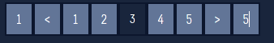
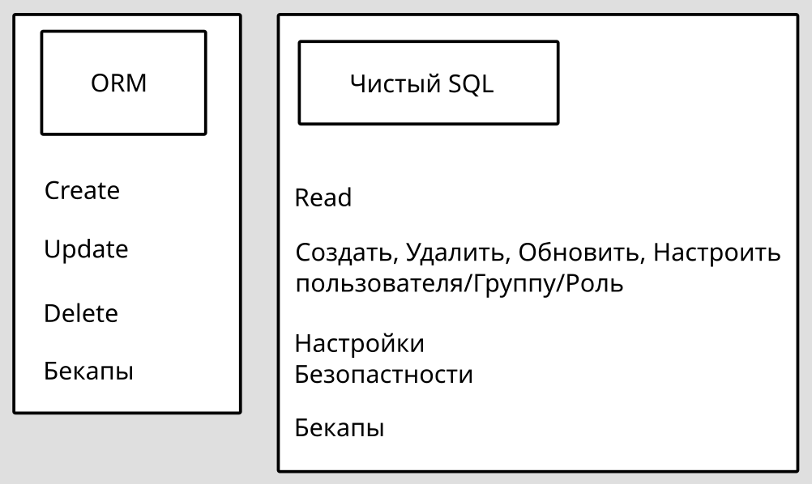
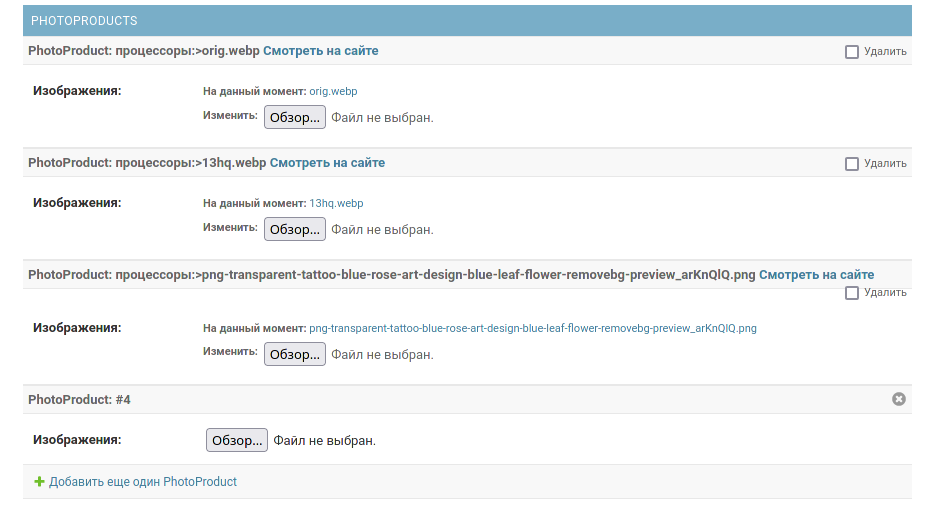
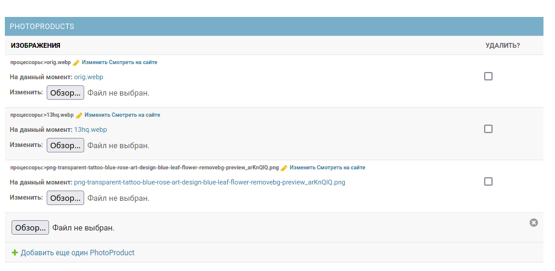
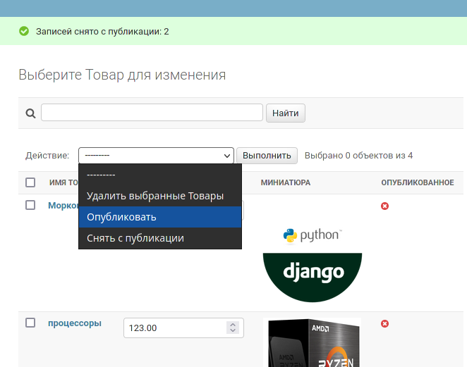
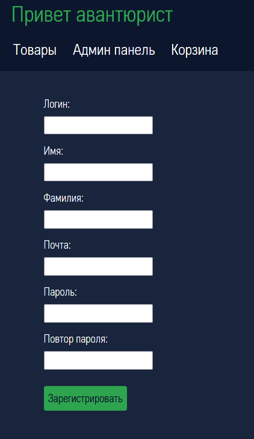
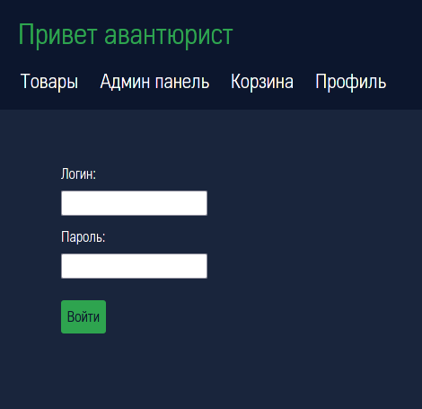

# Структура проекта

- `<Name_proj>`

    - `asgi.py` = Для настройки асинхронного ASGI (daphne)
    - `settings.py` = Глобальные настройки проекта
    - `urls.py`= **URL** маршрутизаци
    - `wsgi.py` = Для настройки многопоточного WSGI (gunicorn)

- `<Name_app>` = Стороннее Приложение

    - `migrations` = миграции БД.
        - `0001_initial.py` = Варианты мигарции БД
    - `templates` = Шаблоны для приложения
        - `<Name_app>` = Имя должно совпадать с именем приложения
            - `name.html`
    - `static` = Статические файлы для приложения
        - `<Name_app>` = Имя должно совпадать с именем приложения
            - `css`
                - `name.css`
            - `js`
                - `name.js`
            - `img`
                - `name.png`
            - `fonts` Сторонии шрифты
                - `name.ttf`
    - `templatetags` = Папка для пользовательских фильтров и тего`html`
    - `admin.py` = Связь с админ панелью сайта
    - `apps.py`= Настройки конфигурирования текущего приложения
    - `models.py `= Логика ORM моделей
    - `test.py` = Тесты
    - `views.py` = Логика представлений -`urls.py`
    - `forms.py` = Логика для форм
    - `urls.py`

- `media` = Общая папка для медео файлов.
- `templates` =Общие шаблоны проекта.
- `manage.py` = Файл нужен для управления проектом

---

# `settings.py` = Настройка для всего проекта

В `settings.py` хранятся все глобальные настройки для проекта. [Документация про settings.py](https://docs.djangoproject.com/en/3.2/ref/settings/)

---

```python
"""
Django settings for experement project.

Generated by 'django-admin startproject' using Django 3.2.8.

For more information on this file, see
https://docs.djangoproject.com/en/3.2/topics/settings/

For the full list of settings and their values,
https://docs.djangoproject.com/en/3.2/ref/settings/
"""
import os
from pathlib import Path


# Конфиденциальность ######################################################################################
import __dont_publish
__dont_publish.run() # Создаем переемные окружения
SECRET_KEY = os.getenv("DJANGO_SECRET_KEY") # Секретный ключ, который нужно держать в  тайне. Например получать из переменных окружения
############################################################################################################


# Диплой #################################################################################################
DEBUG = True # Если `True` будет отображать отладочную информацию
ALLOWED_HOSTS = [] # Список хостов который будет обслуживать Django
############################################################################################################


# Плагины ##################################################################################################
# Все инсталлированные приложения на вашем сайте.
INSTALLED_APPS = [
     'django.contrib.admin',
     'django.contrib.auth',
     'django.contrib.contenttypes',
     'django.contrib.sessions',
     'django.contrib.messages',
     'django.contrib.staticfiles',
]
"""
При создании приложений, нужно добавлять его сюда. Шаблон добавление приложения `"<name_app>.apps.<Name_app>Config",`
"""
# Список используемых плагинов.
MIDDLEWARE = [
    'django.middleware.security.SecurityMiddleware',
    'django.contrib.sessions.middleware.SessionMiddleware',
    'django.middleware.common.CommonMiddleware',
    'django.middleware.csrf.CsrfViewMiddleware',
    'django.contrib.auth.middleware.AuthenticationMiddleware',
    'django.contrib.messages.middleware.MessageMiddleware',
    'django.middleware.clickjacking.XFrameOptionsMiddleware',
]
############################################################################################################


# Шаблонизаторы #############################################################################################
"""
Список, содержащий настройки для всех шаблонизаторов, которые будут использоваться с Джанго.
Каждый элемент списка представляет собой словарь, содержащий параметры для индивидуального двигатель.
"""
TEMPLATES = [
    {
        'BACKEND': 'django.template.backends.django.DjangoTemplates', # Используемый шаблонный сервер.
        'DIRS': [os.path.join(BASE_DIR, 'templates')], # Каталоги, в которых движок должен искать исходные файлы шаблонов, в поиске порядок.
        'APP_DIRS': True, # Должен ли движок искать исходные файлы шаблонов внутри установленного Приложения.
        'OPTIONS': {
            'context_processors': [
                'django.template.context_processors.debug',
                'django.template.context_processors.request',
                'django.contrib.auth.context_processors.auth',
                'django.contrib.messages.context_processors.messages',
            ],
        },
    },
]
############################################################################################################


# Базы данных ###############################################################################################
"""
Словарь, содержащий настройки для всех баз данных, которые будут использоваться с Джанго.
"""
DATABASES = {

	# 'default': {
	# 		'ENGINE'  : 'django.db.backends.postgresql_psycopg2',  # Адаптер
	# 		'NAME'    : 'django_market',  # Имя Бд
	# 		'USER'    : 'postgres',  # Имя пользователя
	# 		'PASSWORD': '123',  # Пароль пользователя
	# 		'HOST'    : '127.0.0.1',  # Хост, мы будем использовать локальный сервер.
	# 		'PORT'    : 5432,  # Порт для подключения. По умолчанию это 5432
	# },


    'default': {
        'ENGINE': 'django.db.backends.sqlite3',
        'app_name': BASE_DIR / 'db.sqlite3',
    }
}
DEFAULT_AUTO_FIELD = 'django.db.models.BigAutoField' # Автоматически добавлять поле primary_key к БД


# Кеширование данных в файловой системе
CACHES = {
      'default': {
            'BACKEND' : 'django.core.cache.backends.filebased.FileBasedCache',
 'LOCATION': os.path.join(BASE_DIR, 'mai_cache')
      }
}
############################################################################################################


# Валидация ################################################################################################
"""
Список валидаторов, которые используются для проверки надежности паролей пользователей.
"""
AUTH_PASSWORD_VALIDATORS = [
    {
        'app_name': 'django.contrib.auth.password_validation.UserAttributeSimilarityValidator',
    },
    {
        'app_name': 'django.contrib.auth.password_validation.MinimumLengthValidator',
    },
    {
        'app_name': 'django.contrib.auth.password_validation.CommonPasswordValidator',
    },
    {
        'app_name': 'django.contrib.auth.password_validation.NumericPasswordValidator',
    },
]
############################################################################################################


# Локализацтя ##############################################################################################
LANGUAGE_CODE = 'ru' # Язык сервера
USE_I18N = True # Логическое значение, указывающее, должна ли быть включена система перевода Django.
TIME_ZONE = 'Europe/Moscow' #  Часовой пояс
USE_L10N = True # Логическое значение, указывающее, будет ли включено локализованное форматирование данны
USE_TZ = True # Логическое значение, указывающее, будут ли даты по умолчанию учитывать часовой пояс
############################################################################################################


# Пути к файлам ############################################################################################
BASE_DIR = Path(__file__).resolve().parent.parent # Полный путь к вашему проекту
ROOT_URLCONF = '<proj>.urls' # Путь к основному urls.py

## Статические файлы
STATIC_URL = '/static/' # URL-адрес для использования при обращении к статическим файлам, расположенным в STATIC_ROOT.
STATIC_ROOT = os.path.join(BASE_DIR, "static/")  # Путь к общей статической папки.
STATICFILES_DIRS = [ # Список нестандартных путей используемых для сборки.
    # os.path.join(BASE_DIR, "static"),
]
"""
Внимание **если у вас есть две папки** `static`, одна общая папка для всех,
а другая в приложение, то данные будут **браться из папки приложения**
"""

## Изображения
MEDIA_ROOT = os.path.join(BASE_DIR, 'media')  # Имя папки в корневом каталоге, для изображений
MEDIA_URL = '/media/' # Добавляет к файлам префикс
############################################################################################################


# Для отладки
if DEBUG:
	# pip install django-debug-toolbar  django-livereload-server
	INSTALLED_APPS.append('livereload')
	INSTALLED_APPS.append('debug_toolbar')
	INTERNAL_IPS = [
			'127.0.0.1',
	]
	MIDDLEWARE.append('debug_toolbar.middleware.DebugToolbarMiddleware')
	MIDDLEWARE.append('livereload.middleware.LiveReloadScript')

	# Отключить кеширование при отладке
	CACHES = {

			'default': {
					'BACKEND': 'django.core.cache.backends.dummy.DummyCache',
			}
	}

	# Info = Debugger(**dINFO)
	# Debug = Debugger(**dDEBUG)
	# Warning = Debugger(**dWARNING)
	# if not os.environ.get('console_debugger', False):  # Для защиты от двойного запуска Django
	#  os.environ['console_debugger'] = "True"
	# else:
	#  Debugger.GlobalManager(typePrint="socket"
```

# `urls.py` = Маршрутизация по сайту

## Функции для маршрутизации

Все запросы от клиентов приходят в этот файл. Наша задача перенаправить запрос в нужное "Представления" который храниться в `views.py` [Документация по urls.py](https://docs.djangoproject.com/en/3.2/ref/urls/)

```python
from django.contrib import admin
from django.urls import path, include

urlpatterns = [
	path('admin/', admin.site.urls),
	path('<Путь>', include('<main_app>.urls')),
]


# Для debug_toolbar и отдачи статических фалов / медиа фалов
if settings.DEBUG:
	# Для отладчика
	import debug_toolbar

	urlpatterns.append(
			path('__debug__/', include(debug_toolbar.urls)),
	)

	# Для работы static
	urlpatterns += static(settings.STATIC_URL,
	                      document_root=settings.STATIC_ROOT)

	# Для работы  media
	urlpatterns += static(settings.MEDIA_URL,
	                      document_root=settings.MEDIA_ROOT)

```

| Функция                                       | Url                                        | Описание                                                                                            |
| --------------------------------------------- | ------------------------------------------ | --------------------------------------------------------------------------------------------------- |
| path(`'admin/', admin.site.urls`)             | `http://127.0.0.1:8000/admin`              | Обработчик URL. Пример `url` обработчика админ панели                                               |
| path(`'<Путь>', include('<main_app>.url')`)   | `http://127.0.0.1:8000/<Путь>`             | Дописывать к URL приложению указанный `<Путь>`                                                      |
| path(`'<Путь>/<int:NAME_ID>/, ...`)',         | `http://127.0.0.1:8000/<Путь>/123`         | Динамические параметры для URL запроса, `NAME_ID` будет передан в функцию представления             |
| re_path(`r'<Путь>/(?P<name>pattern)/', ... `) | `http://127.0.0.1:8000/<Путь>/<параметер>` | Используя регулярные выражения, можно создавать свои правила для динамической обработки URL запроса |

---

## Динамические парамеры у URL запроса.

```python
from django.contrib import admin
from django.http import HttpResponse
from django.urls import path, include, re_path

urlpatterns = [
    path('cats/<int:NAME_ID>/', lambda request, NAME_ID: HttpResponse(f"{request.GET}{NAME_ID}")),
    re_path(r'^archive/(?P<year>[0-9]{4})/', lambda request, year: HttpResponse(f"{request.GET}{year}")),
]
```

> В регулярных выражениях Python синтаксис именованных групп регулярных выражений является `(?P<name>pattern)`, куда `name`это название группы и `pattern`это какой-то шаблон для сопоставления. [Источник](https://djbook.ru/rel3.0/topics/http/urls.html)

Кроме использования `int` в динамических параметрах URL. Можно использовать:

| Ключевое слово | Описание                             |
| -------------- | ------------------------------------ |
| `int`          | Любое положительное число            |
| `str`          | Любая не пустая строка, исключая `/` |
| `slug`         | Символы `ASCII`,`-`,`_`              |
| `uuid`         | Цифры, нижний регистр `ASCII`,`-`    |
| `path`         | Любая не пустая строка, включая `/`  |

---

## Именованные URL адреса

Для простого редиректа и навигации, лучше задавать имена к `URL` адресам. Для этого в функции `path`/`re_path` установите имя для аргумента `name`, после этого Django будет сам устанавливать полный путь к `url` адресу.
[Документация про именованные url адреса ](https://docs.djangoproject.com/en/3.2/topics/http/urls/#reverse-resolution-of-urls)

```python
#`app.urls.py`
urlpatterns = [
    path('', index, name="home"),  		# http://127.0.0.1:8000/app/
    path('test1', test_1),  			# http://127.0.0.1:8000/app/test1
]
```

```python
#`app.urls.py`
def test_1(request):
    if True:
        return redirect('home')
    return HttpResponse(f"{str(request.GET)}test_1")
```

После этого мы можем обращаться к этим именованным `url` адресам:

| Где    | Пример                                                                        | Описание                                                                |
| ------ | ----------------------------------------------------------------------------- | ----------------------------------------------------------------------- |
| `html` | `<a href=""></a>`                                         | В html шаблонах                                                         |
| `html` | `<a href=""></a>`         | В html шаблоны можно также передавать параметры для динамического `URL` |
| `py`   | `return redirect('<ИмяURL>')`                                                 | Перенаправление на указанную страницу.                                  |
| `py`   | `return reverse("<ИмяURL>", kwargs={"<POST_ID>": <self.NAME>})` ->`__proxy__` | Сразу определить `url` адрес.                                           |
| `py`   | `return reverse_lazy('<ИмяURL>')`->`str`                                      | Динамически определять `url` адрес, в момент вызова.                    |

---

Пример `<a href=""></a>`

`urls.py`

```python
from django.urls import path

from myapp.views import index_main

urlpatterns = [
    path('<int:name_id>/<int:name_id2>', index_main, name="home"),
]

```

`myapp/views.py`

```python
from django.core.handlers.wsgi import WSGIRequest
from django.shortcuts import render


# Create your views here.


def index_main(request: WSGIRequest, name_id, name_id2):
    context = {
        "name_id": name_id + 10,
        "name_id2": name_id2 + 10,
    }
    return render(request,
                  template_name="myapp/index_main.html",
                  context=context, )
```

`templates/myapp/index_main.html`

```html
<!DOCTYPE html>
<html lang="en">
<head>
    <meta charset="UTF-8">
    <title>Title</title>
</head>
<body>

<a href="">LIN</a>

</body>
</html>
```

---

Пример `return reverse("<ИмяURL>", kwargs={"<POST_ID>": <self.NAME>})`. Если нам нужно брать `url` адрес из БД, то лучше определить для этого метод `get_absolute_url`

`myapp/model.py`

```python
from django.db import models

# Create your models here.
from django.urls import reverse


class TestDb(models.Model):
    name = models.TextField(db_column="Наименование товара")

    def __str__(self):
        """
        Для отображение в текстовом виде для админ панели, и консоли.
        """
        return str(self.pk)

    def get_absolute_url(self):
        """
        Для получения ссылки записи в Html и отображение в админ панели.
        """
        return reverse("ПримерURL", kwargs={"pk": self.pk})

    class Meta:
        """
        Вспомогательный класс для админ панели.
        """
        verbose_name = "TestDb"  # Имя таблицы в единственном числе
        verbose_name_plural = "TestDbs"  # Имя таблицы во множественном числе
        ordering = ["pk", ]  # Сортировать записи по указан ным столбцам (можно указывать несколько столбцов)
```

`myapp/views.py`

```python
from django.core.handlers.wsgi import WSGIRequest
from django.http import HttpResponse
from django.shortcuts import render

# Create your views here.
from myapp.models import TestDb


def home_fun(request: WSGIRequest, pk):
    return HttpResponse(f"{request.GET}{pk}")


def index_main(request: WSGIRequest):
    post = TestDb.objects.first()
    context = {
        "post": post,
    }
    return render(request,
                  template_name="myapp/index_main.html",
                  context=context, )

```

`myapp/urls.py`

```python
from django.urls import path

from myapp.views import index_main, home_fun

urlpatterns = [
    path('', index_main, name="home"),
    path('home/<int:pk>', home_fun, name="ПримерURL"),
]

```

`templates/myapp/index_main.html`

```html
<!DOCTYPE html>
<html lang="en">
<head>
    <meta charset="UTF-8">
    <title>Title</title>
</head>
<body>

<a href="{{ post.get_absolute_url }}">LIN</a>

</body>
</html>
```

## Обработка `Http` ошибок

Можно переопределять логику программы при возникновении `http` ошибок. [Список ошибок](http://allerrorcodes.ru/http-2/)

| Ошибка     | Описание                                                 |
| ---------- | -------------------------------------------------------- |
| handler400 | Некорректный запрос                                      |
| handler403 | Доступ к странице запрещен. (клиент не аутентифицирован) |
| handler404 | Страница не найдена                                      |
| handler500 | Ошибка сервера                                           |

---

Пример переопределения ошибки. Обратите внимание, что обрабатывать исключения `http` лучше в `proj/urls.py`. Так ошибки могут возникать в разных `url` приложениях, и поэтому они могут не обработать их.

`proj/urls.py`

```python
from django.http import HttpResponseNotFound

urlpatterns = [ .. ]

handler404 = lambda request, exception: HttpResponse(f"Станица не найдена {exception}", status=404)
```

# `views.py`= Логика web-приложения

В файле `views.py` приходят запросы или ответы от `urls.py`, в этом файле нам нужно обработать эти данные, и передать их в шаблон `html`.

---

## Функции представления

**Функции представления** = Это простой способ настроить логику обработки `url` запроса. Функция представления всегда принимает первым аргументом`request`. [Документация про функции представления](https://docs.djangoproject.com/en/3.2/topics/http/shortcuts/).

---

| Функции                                                                      | Описание                                                                                                    |
| ---------------------------------------------------------------------------- | ----------------------------------------------------------------------------------------------------------- |
| return HttpResponse(`content="<HtmlТекст>", status=200`)                     | Вернуть html текст                                                                                          |
| return render(`<request>, "<Путь_к_html_файлу>", contect=<Данные_в_шаблон>`) | Вернуть шаблонный файл `html`. Помните о том что сначала нужно указать имя приложения. Пример: `app/t.html` |
| return redirect(`<"ИменованыйUrl">`)                                         | Перенаправить на указанный именованный `URL`адрес. Код `302` - Временно перемещена                          |
| return redirect(`<"ИменованыйUrl">, permanent=True`)                         | Перенаправить на указанный именованный `URL`адрес. Код `301` - Постоянное перемещение                       |

---

Стандартный шаблон.

```python
def index_main(request: WSGIRequest):

    context = {} # Укзать какие данные нужно отправить в шаблон `html`

    return render(request,
                  template_name="ИмяПриложения/Имяфайла.html",
                  context=context, )
```

## Классы представления

**Классы представления** = Классы представления это удобный механизм для создания логики обработке `http` запросов. К тому же, существует много готовых классов представления, которые помогают решать стандартные задачи.

---

Особенности Классов представления:

- В `urls.py` в функции `path`, нужно вызвать метод класса `$ИмяКлассаПредставления$.as_view()`
- Класс представления сам вызывает одноименные методы класса с `http` методами.

Полезные ссылки:

- [Введение в представления на основе классов](https://docs.djangoproject.com/en/3.2/topics/class-based-views/intro/)
- [Атрибуты и методы в классах представления](https://djbook.ru/rel1.9/ref/class-based-views/flattened-index.html)
- [Список всех классов представления](https://docs.djangoproject.com/en/3.2/ref/class-based-views/)
- [Видео урок про классы представления](https://www.youtube.com/watch?v=_0IDdU6PDJo)

---

| Класс представления | Описание                                                                            | Краткое имя для шаблона |
| ------------------- | ----------------------------------------------------------------------------------- | ----------------------- |
| `View`              | Базовый класс для всех классов представления                                        | `vview`                 |
| `DetailView`        | Подробные данные о записи из БД. Принимает динамический `url` записи                | `vdetail`               |
| `ListView`          | Класс для страницы с записями(ленты). Быстро можно настроить пагинацию по страницам | `vlist`                 |
| `CreateView`        | Класс для создания записей в БД. Использует `forms.ModelForm`                       | `vcreate`               |

---

`View` = Базовый класс для всех классов представления. В нем уже есть перенаправление в одноименные методы класса с `http` методами.

```python
class $NameClass$(View):

    template_name = "$app$/$name_file$.html" # Путь к шаблону `html`
    http_method_names = ["get", "post",] # Список методов HTTP, которые обрабатывает класс.

    # model = $NameModel$ # Какую модель используем
    # queryset = $NameModel$.objects.$MethodModel$ # Получаем данные из БД


    def get(self, request: WSGIRequest):
        """
        В методе обрабатывается GET запрос
        request.method == "GET"
        """
        return render(request,
                      template_name=self.template_name,
                      context=self.get_context_data(), )

    def post(self, request: WSGIRequest, *args, **kwargs):
        """
        В методе обрабатывается POST запрос
        request.method == "POST"
        """
        ...

    def get_context_data(self, **kwargs) -> dict[str, Any]:
        """
        Сформировать контекст для шаблона `html`
        """
        context = {
            $END$
        }
        return context
```

---

`DetailView` = Подробные данные об одной записи из БД.

- В `urls.py` у функции `path` должен быть динамический `url` - либо `<int:pk>/`либо `<int:slug>/` которые ищется в БД.
- Чтобы изменить имя динамического `url`, переопределить значения атрибутов `slug_url_kwarg` для `slug`. `pk_url_kwarg` для `pk`.

```python
class $NameClass$DetailView(DetailView):
    model = $NameModel$ # Какую модель используем
    queryset = $NameModel$.objects.$MethodModel$ # Получаем данные из БД
    template_name = "$app$/$name_file$.html" # Путь к шаблону `html`
    http_method_names = ["get", "post",] # Список методов HTTP, которые обрабатывает класс.
    context_object_name = "$NameClass$" # Для результата класса, Даем понятное имя переменой в шаблон.

    def get(self, request: WSGIRequest, *args, **kwargs):
        """
        В методе обрабатывается GET запрос

        request.method == "GET"
        print(request.GET)
        """

        resget = super().get(request, *args, **kwargs)
        return resget

    def post(self, request: WSGIRequest, *args, **kwargs):
        """
        В методе обрабатывается POST запрос

        request.method == "POST"
        """

        print(request.POST)

    def get_context_data(self, **kwargs) -> dict[str, Any]:
        """
        В этом методе формировать `context` для шаблон `html`
        :return: context
        """
        context = super().get_context_data(**kwargs)
        return context
```

Кастомный `DetailView`

```python
class  $NameClass$(View):
	model = $NameModel$  # Какую модель используем
	template_name = "$app$/$name_file$.html"  # Путь к шаблону `html`
	http_method_names = ["get", "post", ]  # Список методов HTTP, которые обрабатывает класс.
	context_object_name = "$NameClass$"  # Для результата класса, Даем понятное имя переменой в шаблон.

	def get(self, request: WSGIRequest, pk: int):
		"""
		В методе обрабатывается GET запрос
		request.method == "GET"

		http://<>/product/1
		"""

		return render(request,
		              template_name=self.template_name,
		              context=self.get_context_data(pk), )

	def get_queryset(self, pk: int):
		"""
		Запрос в БД
		"""
		queryset: RawQuerySet = self.model.objects.raw("""
		$QuerySQL$ WHERE id = %s
		""", (pk,))

		return queryset

	def get_context_data(self, pk, **kwargs) -> dict[str, Any]:
		"""
		Сформировать контекст для шаблона `html`
		"""
		context = {
				self.context_object_name: self.get_queryset(pk),
		}
		return context
```

---

`ListView` = Класс для страницы с записями. Лего можно настроить пагинацию.

- `allow_empty` = Логическое значение, указывающее, следует ли отображать страницу, если объекты отсутствуют. Если это `False`и нет записи, то вызовет `404` ошибку.
- `page`стандартное имя странице. Если нужно, то это имя можно переопределить в `page_kwarg`.

```python
class $NameClass$ListView(ListView):
    model = $NameModel$ # Какую модель используем
    queryset = $NameModel$.objects.$MethodModel$ # Получаем данные из БД
    template_name = "$app$/$name_file$.html" # Путь к шаблону `html`
    http_method_names = ["get", "post",] # Список методов HTTP, которые обрабатывает класс.
    context_object_name = "$NameClass$" # Для результата класса, Даем понятное имя переменой в шаблон.
    allow_empty = False  # Отображать ошибку 404 если страница не найдена

	paginate_by = $CountPost$ # Целое число, указывающее, сколько объектов должно отображаться на странице.
	ordering = "$SortColumn$" # Сортировать записи по столбцу


    def get(self, request: WSGIRequest, *args, **kwargs):
        """
        В методе обрабатывается GET запрос

        request.method == "GET"
        print(request.GET)
        """

        resget = super().get(request, *args, **kwargs)
        return resget

    def post(self, request: WSGIRequest, *args, **kwargs):
        """
        В методе обрабатывается POST запрос

        request.method == "POST"
        """

        print(request.POST)

    def get_context_data(self, **kwargs) -> dict[str, Any]:
        """
        В этом методе формировать `context` для шаблон `html`
        :return: context
        """
        context = super().get_context_data(**kwargs)
        # СВОЯ переменная, которую можно использовать для ограничения предложенных страниц
        context["max_offer_page"] = (-2,2)
        return context
```

Кастомный `ListView` = Использует собственный пагинатор из [Пагинация ListView](#Пагинация%20ListView)

```python
class $NameView$(View):
	template_name = "$app$/$name_file$.html" # Путь к шаблону `html`
	http_method_names = ["get", "post", ]  # Список методов HTTP, которые обрабатывает класс.

	model = $NameModel$ # Какую модель используем
	context_object_name = "$NameClass$" # Для результата класса, Даем понятное имя переменой в шаблон.

	paginate_by = 3  # Сколько объектов должно быть на одной странице
	paginator = page_obj_cast  # Какой плагиатор использовать (Это Кастомный)

	max_offer_page = 2 # Сколько цифр страниц показывать для переключения

	"""
	Основные действия в  _ListView
	1. Получить страницу из запроса клиента
	2. Получить общее количество записей
	3. Сделать запрос в БД с учетом отступов пагинации
	4. Отдать результат
	"""


	def get(self, request: WSGIRequest, **kwargs):
		"""
		В методе обрабатывается GET запрос
		request.method == "GET"

		- http://<>/?page=1
		"""
		# Проверить корректность запроса `GET` запроса, и получить из него номер страницы.
		# Если некорректный запрос, то вернут 404
		# tuple[bool, Union[НомерСтраницы:int, HttpResponse]]
		page = self.paginator.valid_page(request.GET.get("page"))
		if page[0]:
			return render(request,
			              template_name=self.template_name,
			              context=self.get_context_data(page[1]), )
		else:
			return page[1]


	def get_count(self) -> int:
		"""
		Получить колличество всех записей в таблице
		"""
		return self.model.objects.raw("""
				select 1 as id, count(id) as coun from $TabelName$;
		""")[0].coun

	def get_queryset(self, page):
		"""
		Запросы в БД

		:param page: Текущая страница
		"""

		# Получаем объекты из БД.
		raw_query_set: RawQuerySet = self.model.objects.raw("""

		$QuerySQL$ LIMIT %s OFFSET %s

		""", [self.paginate_by, self.paginate_by * page])

		return raw_query_set

	def get_context_data(self, page, **kwargs) -> dict[str, Any]:
		"""
		Сформировать контекст для шаблона `html`
		"""

		# Кеширование колличества записей в Таблице
		count = cache.get("count_ch")
		if not cache.get("count_ch"):
			count = cache.get_or_set('count_ch', self.get_count(), timeout=60)


		context = {
				# Запрос из БД
				self.context_object_name: self.get_queryset(page),
				# Данные для пагинации
				"page_obj": self.paginator(self.paginate_by, page, count, self.max_offer_page),
		}
		return context
```

---

`CreateView` = Класс для создания записей в БД. Использует Модель-Форму.

- `success_url` = URL-адрес для перенаправления после успешной обработки формы.

```python
class $NameClass$CreateView(CreateView):
    form_class = $ProductForm$ # Модель-формы
    template_name = "$app$/$name_file$.html" # Путь к шаблону `html`
    http_method_names = ["get", "post",] # Список методов HTTP, которые обрабатывает класс.
    success_url = reverse_lazy("$NameUrlRederect$")  # URL-адрес для перенаправления после успешной обработки формы.

    # model = $NameModel$ # Какую модель используем, по умолчанию берёт модель из `form_class`
    # context_object_name = "$NameClass$" # Для результата класса, Даем понятное имя переменой в шаблон.

    def get(self, request: WSGIRequest, *args, **kwargs):
        """
        В методе обрабатывается GET запрос

        request.method == "GET"
        """
        resget = super().get(request, *args, **kwargs)
        return resget

    def post(self, request: WSGIRequest, *args, **kwargs):
        """
        В методе обрабатывается POST запрос

        request.method == "POST"
        """
        # Проверить данные, если они корректные то сохранить их в БД
        respost = super().post(request, *args, **kwargs)
        return respost

    def get_context_data(self, **kwargs) -> dict[str, Any]:
        """
        В этом методе формировать `context` для шаблона `html`

        :return: context
        """
        context = super().get_context_data(**kwargs)
        return context
```

## Пагинация `ListView`

`page_obj` [Про Page](https://docs.djangoproject.com/en/3.2/ref/paginator/#page-class)

| Метод, Атрибут                | Описание                                                                                                  |
| ----------------------------- | --------------------------------------------------------------------------------------------------------- |
| `page`.number                 | Номер для этой страницы, отсчитываемый от 1.                                                              |
| `page`.has_next()             | Возврат `True`если есть следующая страница.                                                               |
| `page`.has_previous()         | Возврат `True`если есть предыдущая страница.                                                              |
| `page`.has_other_pages()      | Возврат `True`если есть следующая **или** предыдущая страница.                                            |
| `page`.next_page_number()     | Возвращает номер следующей страницы. Поднимает `InvalidPageесли` если следующая страница не существует.   |
| `page`.previous_page_number() | Возвращает номер предыдущей страницы. Поднимает `InvalidPageесли` если предыдущей страницы не существует. |
| `page`.paginator.count        | Общее количество всех элементов на всех страницах                                                         |
| `page`.paginator.num_pages    | Общее количество страниц.                                                                                 |
| `page`.paginator.page_range   | Итератор для страниц                                                                                      |

Шаблон для пагинации.

> 

```html
<!--

offer-page = Стиль для числа со страницей
select-offer-page = Стиль для выделенного числа со страницей

//-->


{# Если есть хотябы больше одной страницы#}


    {# Добавить кнопки перемещения страниц назад#}
    
        {# Первая страница #}
        <a href="?page=1">
            <div class="offer-page">
                1
            </div>
        </a>
        <a href="?page={{ page_obj.previous_page_number }}">
            <div class="offer-page">
                &lt;
            </div>
        </a>
    

    
        {# Выделеть выбранную страницу #}
        
            <div class="offer-page select-offer-page">
                {{ p }}
            </div>
            {# Не отображать страницы более N страниц #}
        

            <a href="?page={{ p }} ">
                <div class="offer-page">
                    {{ p }}
                </div>
            </a>
        
    

    {# Добавить кнопки перемещения страниц вперед#}
    
        <a href="?page={{ page_obj.next_page_number }}">
            <div class="offer-page">
                &gt;
            </div>
        </a>

        {# Последняя страница #}
        <a href="?page={{ page_obj.paginator.num_pages }}">
            <div class="offer-page">
                {{ page_obj.paginator.num_pages }}
            </div>
        </a>
    


```

```css
/*Пагинатор*/
.pagination {
    text-align: center;
    margin: auto;
    width: 50%;
    font-size: 22px;
}

.offer-page {
    padding: 10px;
    border: 3px solid var(--ThreeBg);
    background: var(--TwoBg);
    width: 60px;
    height: 60px;

}

.offer-page:hover {
    background: var(--OneBg);
    color: var(--OneColorText);
}

.select-offer-page {
    background: var(--OneBg);
}
/*END Пагинатор*/
```

```python
class MainProductRibbon(ListView):
    """
    Главная лента товаров
    """

    model = Product  # Какую модель используем
    queryset = Product.objects.all()  # Получаем данные из БД
    template_name = "myapp/MainProductRibbon.html"  # Путь к шаблону `html`
    http_method_names = ["get", "post", ]  # Список методов HTTP, которые обрабатывает класс.
    context_object_name = "MyPaginator"  # Для результата класса, Даем понятное имя переменой в шаблон.
    allow_empty = False  # Отображать ошибку 404 если страница не найдена

    paginate_by = 3  # Целое число, указывающее, сколько объектов должно отображаться на странице.
    ordering = "star"  # Сортировать записи по столбцу

    def get(self, request: WSGIRequest, *args, **kwargs):
        """
        В методе обрабатывается GET запрос

        request.method == "GfET"
        """
        resget = super().get(request, *args, **kwargs)
        return resget

    def post(self, request: WSGIRequest):
        """
        В методе обрабатывается POST запрос

        request.method == "POST"
        """
        ...

    def get_context_data(self, **kwargs) -> dict[str, Any]:
        """
        В этом методе формировать `context` для шаблона `html`

        :return: context
        """
        context = super().get_context_data(**kwargs)
        # СВОЯ переменная, которую можно использовать для ограничения предложенных страниц
        context["max_offer_page"] = (-2, 2)
        return context
```

---

Собственный пагинатор

```python
from typing import Any


class page_obj_cast:
	"""
	Плагиатор страниц
	"""

	def __init__(self, paginate_by: int, is_page: int, count: int, max_offer_page: int = 2):
		"""
		:param paginate_by: Колличество элементов на странице
		:param is_page: Текущая страница
		:param count: Всего записей

		| Метод, Атрибут                | Описание                                                                                                  |
		| ----------------------------- | -------------------------------------------------------------- |
		| `page`.number                 | Номер для этой страницы, отсчитываемый от 1.                   |
		| `page`.has_next()             | Возврат `True`если есть следующая страница.                    |
		| `page`.has_previous()         | Возврат `True`если есть предыдущая страница.                   |
		| `page`.has_other_pages()      | Возврат `True`если есть следующая **или** предыдущая страница. |
		| `page`.next_page_number()     | Возвращает номер следующей страницы.                           |
		| `page`.previous_page_number() | Возвращает номер предыдущей страницы.                          |
		| `page`.count                  | Общее количество всех элементов на всех страницах              |
		| `page`.num_pages              | Общее количество страниц.                                      |
		| `page`.page_range             | Итератор для страниц                                           |
		| `page`.max_offer_page         | Сколько страниц предлагать в баре для переключения             |
		| `page`.count                  | Общее количество                                               |
		"""
		self.number = is_page + 1
		self.num_pages = count // paginate_by + (1 if count % paginate_by != 0 else 0)
		self.page_range = range(1, self.num_pages + 1)
		self.has_next = True if self.number * paginate_by < count else False
		self.next_page_number = self.number + 1 if self.number * paginate_by < count else self.number
		self.has_previous = True if self.number > 1 else False
		self.previous_page_number = self.number - 1 if self.number > 1 else self.number
		self.has_other_pages = True if self.has_next or self.has_previous else False
		self.max_offer_page = (max_offer_page * -1, max_offer_page)
		self.count = count

	@staticmethod
	def valid_page(page) -> int:
		"""
		Отсчет начинается с 0
		:param page: page_obj_cast.valid_page(request.GET.get("page"))
		"""
		if page is not None and page.isdigit() and int(page) > 0:
			page = int(page) - 1
			return page
		else:
			return 0

	def __str__(self):
		return str(self.__dict__)
```

Шаблон `html`

```html
<!--
Нужен:
    - page_obj = Объект пагинатор
	- href_page = Добавить get запрос
-->

{#{{ page_obj }} <br>#}
{# Если есть хотя бы больше одной страницы#}



    {# Добавить кнопки перемещения страниц назад#}
    
        {# Первая страница #}
        <a href="?page=1{{ href_page }}">
            <div class="offer-page">
                1
            </div>
        </a>


        <a href="?page={{ page_obj.previous_page_number }}{{ href_page }}">
            <div class="offer-page">
                &lt;
            </div>
        </a>
    


    
        {# Выделеть выбранную страницу #}
        
            <div class="offer-page select-offer-page">
                {{ p }}
            </div>

            {# Не отображать страницы более N страниц #}

        
            <a href="?page={{ p }}{{ href_page }}">
                <div class="offer-page">
                    {{ p }}
                </div>
            </a>

        
    

    {# Добавить кнопки перемещения страниц вперед#}
    
        <a href="?page={{ page_obj.next_page_number }}{{ href_page }}">
            <div class="offer-page">
                &gt;
            </div>
        </a>
        {# Последняя страница #}
        <a href="?page={{ page_obj.num_pages }}{{ href_page }}">
            <div class="offer-page">
                {{ page_obj.num_pages }}
            </div>
        </a>
    

```

## `Cookie` / `Session`

`Cookie` — это небольшие кусочки информации, которые браузер сохраняет у себя в памяти, по просьбе веб сервера. Клиент при каждом обращении к веб серверу, отсылает полученную ранее `cookie`. [Сессии, пользователи и регистрация](https://djbook.ru/ch12.html). `Cookie` используются можно хранить временные настройки пользователя (Стиль сайта, Любимая страница, Посещенные ресурсы).

- `Cookie` ограничен размеров в 4096 байт - 4096 символов `ASCII`.
- `Cookie` Сохраняются через `Response`(Ответ сервера). То есть сервер устанавливает куки в ответ клиенту, а клиент в свою очередь их принимает(или отвергает).
- Самое главное, не сохраняйте важную информацию в cookie. Cookie небезопасны, особенно те, которые отправлялись без использования протокола HTTPS. Cookie крайне легко прочитать, по причине того, что они пересылают информацию чистым текстом. Таким образом, атакующий прослушивает канал, ловит cookie и читает информацию. Это означает, что вы никогда не будете пересылать важную информацию в cookie.
- Когда мы устанавливаем время жизни для `Cookie` то **браузер клиента** должен самостоятельно удаляет их по истечению заданного срока. Для установки время жизни используется аргумент `max_age`.

Для того чтобы получить данные из `Cookie` у объекта `request: WSGIRequest` есть атрибут `COOKIES`, он представляет собой словарь, у которого мы можем получать значение по ключу.

```python
class КлассПредставления(View):

	...

	def get(self, request: WSGIRequest, *args, **kwargs):
		"""
		В методе обрабатывается GET запрос

		request.method == "GfET"
		"""

		request.COOKIES # Поулчем все куки пользователя
		request.COOKIES["<МойКлюч>"] # Получить данные из куки по ключу `<МойКлюч>`
```

Чтобы отправить `cookie` данные для пользователя, мы должны в ответ нашего сервера вызвать метод `set_cookie("<Ключ>", "<Значени>")`, этот метод добавляет `cookie` в ответ сервера.

Вспомним что все ответы в `Django` наследуются от класса `HttpResponseBase` в котором и находится метод `set_cookie()`, поэтому для функций

- `HttpResponse`
- `redirect`
- `redirect`

Мы можем вызвать метод `set_cookie()`

```python
class КлассПредставления(View):

	...

	def get(self, request: WSGIRequest, *args, **kwargs):
		"""
		В методе обрабатывается GET запрос

		request.method == "GfET"
		"""


		response = super().get(request, *args, **kwargs)

		# Если у клиента нет куки, либо клиент удалил их через указанное время. То =>
		if not request.COOKIES.get('<Ключ>'):
   			response.set_cookie('<Ключ>', '<Значени>', max_age=5, secure=True)


		return response
```

| Функция                                                                                                   | Описание                                                                                                            |
| --------------------------------------------------------------------------------------------------------- | ------------------------------------------------------------------------------------------------------------------- |
| `request.COOKIES["<МойКлюч>"]`                                                                            | Получить данные `cookie` из запроса клиента                                                                         |
| `HttpResponseBase`.set_cookie(`'<Ключ>', '<Значение>', max_age=МаксимальноеВремяЖизниКуки, secure=False`) | Установить в ответ сервера `cookie` для клиента. Если `secure` равен `True` то данные передаются по https протоколу |
|                                                                                                           |                                                                                                                     |

---

`Session` - это данные который хранится в `cookie` файлах. Их особенность заключается в том что сессия хранит только идентификатор на данных, а сами данные хранятся уже на сервере. [Как использовать сессии](https://docs.djangoproject.com/en/3.2/topics/http/sessions/#cookie-session-backend)

- Сессий могут изменяться только в `Request`, потому что мы не изменяем данные идентификатор сессии, мы изменяем данные на сервере.
- Злоумышленник, владеющий `SECRET_KEY` может не только генерировать фальсифицированные данные сеанса, которым будет доверять ваш сайт, но также удаленно выполнять произвольный код, так как данные сериализуются с помощью pickle. Если вы используете сеансы на основе файлов cookie, обратите особое внимание на то, чтобы ваш секретный ключ был всегда держится в секрете для любой системы, которая может быть удаленно доступный.
- За работу сессий в `Django` отвечает плагин `'django.middleware.security.SecurityMiddleware',` который по умолчанию находится в `proj/settings.py->MIDDLEWARE`
- По умолчанию сессия храниться 2 недели (1209600 секунд), это значение можно изменить в `proj/settings.py/->SESSION_COOKIE_AGE=<ВремяЖизниВСекундах>`
- `Django` Не удаляет автоматически простроченные сессии, для этого нам нужно самим выполнять команду `python manage.py clearsessions`
- Сессии хранятся в БД в таблице `django_session`

|                                                           |                                                         |
| --------------------------------------------------------- | ------------------------------------------------------- |
| request.session.get(`'<Ключ>', '<ЗначениеПоУмолчанию>',`) | Получить значение из сессии                             |
| request.session[`'<Ключ>'`] = `'<Значение>'`              | Установить значение в ключ сессии                       |
| del request.session[`'<Ключ>'`]                           | Удалить элемент из сессии                               |
| request.session.modified = `True`                         | Явно указать `Django` что сессия была изменена          |
| request.session.get_session_cookie_age()                  | Возвращает возраст файлов cookie сеанса в секундах.     |
| request.session.get_expiry_age()                          | Возвращает количество секунд до истечения этого сеанса. |
| request.session.get_expiry_date()                         | Возвращает дату истечения этого сеанса.                 |

Когда нужно явно указывать изменения в сессии `request.session.modified = True`. Либо если вы хотите чтобы ваши данные сессии всегда сохранялись в на сервере при каждом запросе - установите в `proj/settings.py->SESSION_SAVE_EVERY_REQUEST = True`

```python
# Объект сессии модифицируется неявно.
# Изменения НЕ БУДУТ сохранены!
request.session['my_car']['wheels'] = 'alloy'

# Явное указание, что данные изменены.
# Сессия будет сохранена, куки обновлены (если необходимо).
request.session.modified = True
```

# `app/templates/app/file.html` = Html шаблоны

Все `html` документы для вашего приложения принято хранить в папке `ИмяПриложения/templates/ИмяПриложения`

Краткий обзор

| Внешний вид           | Название                                                                                               |
| --------------------- | ------------------------------------------------------------------------------------------------------ |
| ``       | Обращение к тегу. [Все встроенные теги](https://docs.djangoproject.com/en/3.2/ref/templates/builtins/) |
| `{{ ИмяПеременной }}` | Обращение к переменной. Нельзя давать имена переменым начинающеюся с нижнего подчеркивания `_`.        |
| `` | Сохранить результат тега в переменную                                                                  |

---

Все переменные переданные в шаблон `html` будут конвертированные в `str`. То есть при передаче в `html` шаблон `Django` будут вызвать метод класса `__str__()`. Пример:

```python
class Test:
    def __init__(self):
        self.name = (1, 2, 3)

    def __str__(self):
        return "Вызван метод __str__"
```

---

Для удобства вы можете выбрать подцветку синтаксиса шаблонизатора. Если у вас полная версия, то вам будет доступен `Django`


---

## Теги шаблонизатора

### `for`/`empty`/`cycle`/`if`/`elif`/`else`

---

Тег `for` работает как обычный цикл, он перебирает переданный итерируемый объект.

Пример одномерного массива

```html

{{ x }}

```

Пример двумерного массива. **Нужно обращаться к индексу через точку `.`**

```html

{{ x.0 }}{{ x.1 }}{{ x.2 }} <br>

```

Пример словаря. В шаблоне можно использовать такие же методы как и в `Python`, только их **не** нужно вызвать `()`

```html

    {{ k }}:{{ v }} <br>

```

Аналог `enumerate` это `{{ forloop.counter0 }}` [+](https://docs.djangoproject.com/en/3.2/ref/templates/builtins/#for)

```html

	{{ forloop.counter0 }} {{ x }}<br>

```

Создать итератор из строки это `|make_listp`

```html

	{{ star }}

```

Если нужно повторить несколько раз одно и то же действие, это `|rjust:`

```bush

	{{ star }}

```

---

Тег `empty`. Это тег срабатывает если массив пустой.

```python

    {{ v }}

    Извините но массив пустой


{#===#}


    
        {{ v }}
    

    Извините но массив пустой

```

---

Тег `cycle`. Бывает встречаться задачи когда нужно циклично дублировать стили для `html`. Для это есть шаблонный тег `cycle`

```html

    <span style="font-size:">
        {{ v }}
    </span>

```

- 

---

Тег `if`/`elif`/`else` работает как обычный `if`/`elif`/`else`. Пример:

```html

	...

	...

	...

```

Также можно указать несколько условия.

```python

	{{ v }}

```

### `block` / `extends` / `include`

`block` нужен для уменьшения дублирования когда, он это делает путем расширения готовых `html` шаблонов.
Правописание `block`. Принято закрывать блок с тем же именем, с каким он создан.

```html




```

---

`extends` Нужен как раз для расширения шаблона. Блоки с одинаковыми именами будут наследоваться. Обратите внимание при `extends` в базовый шаблон добавляется только `block`, любой другой контент просто игнорируется и в базовый шаблон не добавляется. [Наследование шаблонов](https://docs.djangoproject.com/en/3.2/ref/templates/language/#template-inheritance)

```html

```

Добавить контент из базового блока, в блок наследника, можно путем вызова функции. `{{ block.super }}`.

```bush


{{ block.super }}


```

---

`include` = Нужен для простой вставки содержания `html` файла. Правописание `include`:

```html

```

---

Давайте разбираем пример наследование шаблонов.

`urls.py`

```python
from django.urls import path

from myapp.views import index_main, home_fun

urlpatterns = [
    path('', index_main, name="index"),
    path('home/', home_fun, name="home"),
]
```

`views.py`

```python
from django.core.handlers.wsgi import WSGIRequest
from django.shortcuts import render


def home_fun(request: WSGIRequest):
    context = {
    }
    return render(request,
                  template_name="myapp/chaild.html",
                  context=context, )


def index_main(request: WSGIRequest):
    context = {
    }
    return render(request,
                  template_name="myapp/index_main.html",
                  context=context, )
```

`index_main.html`

```html


<!DOCTYPE html>
<html lang="en">
<head>
    <meta charset="UTF-8">
    <title>Title</title>
</head>
<body>
<h1>Привет авантюрист</h1>

<a href="">Index</a><br>
<a href="">Home</a><br>


    <h4>Главный текст</h4>


</body>
</html>
```

`chaild.html`. Обратите внимание, что негде нет`Любой текст из chaild.html`

```html

Любой текст из chaild.html

     {{ block.super }}
    <h4>Текст блока</h4>
    

```

> А вот пример того что `Любой текст из chaild.html` появился в `chaild.html`.
>
> ```python
> {##}
> Любой текст из chaild.html
> 
> {#     {{ block.super }}#}
>
>     <h4>Текст блока</h4>
> 
> ```

## Стандартыне фильтры для переменных

В `html` шаблонах мы можем применять некоторые готовые фильтры, или точнее "действия", для переемных. [Список встроенных фильтров](https://djbook.ru/rel3.0/ref/templates/builtins.html#built-in-filter-reference)

| Фильтр                               | Описание                                                                                                   |
| ------------------------------------ | ---------------------------------------------------------------------------------------------------------- |
| `{{ value │ safe }}`                 | Не экранировать `Html` код. (по умолчанию Джанго экранирует `hrml` код и вставляет его как простой текст)  |
| `{{ value │ default:"nothing" }}`    | Установить значение по умолчанию                                                                           |
| `{{ value │ dictsort:"name" }}`      | Сортировка словаря                                                                                         |
| `{{ value │ first }}`                | Возвращает первый элемент списка                                                                           |
| `{{ value │ last }}`                 | Возвращает последний элемент списка                                                                        |
| `{{ value │ linenumbers }}`          | Отображает текст как нумерованный                                                                          |
| `{{ value │ ljust:"10" }}`           | Выравнивает значение влево в поле указанной ширины.                                                        |
| `{{ value │ random }}`               | Возвращает случайный элемент из списка                                                                     |
| `{{ some_list │ slice:":2" }}`       | Сделать слайс списка                                                                                       |
| `{{ value │ truncatewords:2 }}`      | Обрезать сроку до длины                                                                                    |
| `{{ var │ unordered_list }}`         | Создает элемент таблицы HTML (li) [+](https://djbook.ru/rel3.0/ref/templates/builtins.html#unordered-list) |
| `{{ value │ urlize }}`               | Делает из текста ссылку                                                                                    |
| `{{ value │ urlizetrunc:15 }}`       | Делает из текста ссылку, обрезает результат до указанной длинно                                            |
| `{{ value │ wordcount }}`            | Возвращает количество слов                                                                                 |
| `{ value │ yesno:"yeah,no,maybe" }}` | Преобразует булевые значение в понятные сообщения                                                          |
| `{{ value │ linebreaks }}`           | Ставит переносы строки в конец текста                                                                      |

## Создание своих шаблоны в`html`

В `Django` бывает не хватает встроенных тегов, но у нас есть возможность создавать собственные теги. [Про собственные шаблоны и теги](https://djbook.ru/rel3.0/howto/custom-template-tags.html)

1. Создать пакет `templatetags`, и уже в нем создавать файлы с вашими тегами.
    - `ВашеПриложение`/
        - `__init__.py`
        - `models.py`
        - `templatetags/` (Обязательное имя)
            - `__init__.py` (+)
            - `ВашиТеги.py` (+)
                ```python
                from django import template
                register = template.Library()
                ```
        - `views.py`
1. Загрузить наш шаблон в `html` документ
    ```html
    
    ```

---

| Декоратор          | Описание                                      | Вид          |                    |
| ------------------ | --------------------------------------------- | ------------ | ------------------ | --- |
| `@register.filter` | Зарегестрировать фильтер                      | `{{ quantity | multiply:price }}` |     |
| `@stringfilter`    | Конвертировать входные данные функции в `str` |              |                    |

### Простой тег - функция

Простой тег - принимает данные как функция, и возвращает результат, в место своего вызова.

```python
@register.simple_tag()
def tagSum(a,b,c):
	"""
	
	"""
	return a+b+c
```

### Включающий тег - генерирует `html` фрагмент

Включающий тег - должен возвращать `context:dict` для `html` документа, который в свою очередь вставиться в место вызова "включающего тега". Таким обозом он генерирует `html` фрагмент.

```python
@register.inclusion_tag("myapp/testTag.html")
def tagInclusion(data1,data2):
	"""
	 # По имени

	 # По позиции
	"""
	return {"data": [data1,data2]}
```

### Фильтры

Фильтр - ведет себя как функция, но он всегда принимает минимум 2 аргумента

```python
@register.filter
def multiply(value, arg):
	"""
	{{ quantity | multiply:price }}` = `multiply(quantity,price)
	"""
	return value * arg
```

### Полезные сторонии шаблоны:

- Умножение - `{{ quantity | multiply:price }}`
    ```python
    @register.filter
    def multiply(value, arg):
    	return value * arg
    ```

## Подключение различных файлов к `Html` документу

### Подключение статических файлов `css`/`js`/`img`

- Для подключения статических файлов убедитесь что у вас есть `proj/settings.py->STATIC_URL = '/static/'`
- Для сборки всех статических файлов убедитесь что у вас есть `proj/settings.py->STATIC_ROOT` и выполните команду `python manage.py collectstatic`
- Внимание **если у вас есть две папки** `static`, одна общая папка для всех, а другая в приложение, то данные будут **браться из папки приложения**
- Помните о том что браузеры кешируют статические файлы, поэтому для обновленных данных нужно **перезагружать страницу с отчисткой кеша**. Например, у вас это возможно клавиша `Crtl+F5`.
- Помните о том что статические файлы при `DEBUG=False` должны обрабатываться веб сервером, например `nginx`. Но мы можем для теста запустить проект через команду `python manage.py runserver --insecure` и все будет работать, но такой вариант не эффективен для релиза. [Подробнее](https://stackoverflow.com/questions/5836674/why-does-debug-false-setting-make-my-django-static-files-access-fail).

    ```python
    # После `python manage.py collectstatic` закоментируйте `STATIC_ROOT` и раскоментируем `STATICFILES_DIRS`
    STATIC_URL = '/static/'
    # STATIC_ROOT = os.path.join(BASE_DIR, "static")
    STATICFILES_DIRS = [
    	os.path.join(BASE_DIR, "static"),
    ]
    ```

- Для работы со статическими фалами, нам нужно в самом вверх подключить тег `static`.

    ```html
    
    ```

- Принято подключать все статические файлы между тегами `<head></head>`

- `Name_proj/urls.py` Для того чтобы `Django` лично маршрутизировал статические файлы в режиме отладки

```python
if settings.DEBUG:
	# Для отладчика
	import debug_toolbar

	urlpatterns.append(
			path('__debug__/', include(debug_toolbar.urls)),
	)

	# Для работы static
	urlpatterns += static(settings.STATIC_URL,
	                      document_root=settings.STATIC_ROOT)

	# Для работы  media
	urlpatterns += static(settings.MEDIA_URL,
	                      document_root=settings.MEDIA_ROOT)

```

-  Для того чтобы получать статические фалы напрямую через `gunicorn` (для отладки) используйте такую конструкцию. `Name_proj/wsgi.py`

	```python
	import os

	from django.contrib.staticfiles.handlers import StaticFilesHandler
	from django.core.wsgi import get_wsgi_application

	from market_dajngo import settings

	os.environ.setdefault('DJANGO_SETTINGS_MODULE', 'market_dajngo.settings')

	if settings.DEBUG:
		# Для получения статических файлов при запуске `gunicorn` в режиме отладки 
		application = StaticFilesHandler(get_wsgi_application())
	else:
		application = get_wsgi_application()

	```


---

Подключить `css`

```html
<link href="" rel="stylesheet" type="text/css">
```

---

Подключить `img`. Картинка может быть любым доступным форматом изображения, например`jpeg`/`png`/`svg`

```html

```

---

Подключить `js`.

```html
<script src="" type="text/javascript"></script>
```

---

### Подключить стороннее шрифты

Особенности:

- Не получиться использовать теги шаблонизатора в `css` файлов. Поэтому мы не можем использовать тег ``, нам придется писать путь самим.
- Мы можем подключать множество сторонних шрифтов в одном `css` файле.

---

Например, давайте подключим шрифты [МойОфис](https://myoffice.ru/products/fonts/).

1. Для этого нам нужно скачать архив, и достать файл с расширением `.ttf`.
2. Создать папку `ИмяПриложения/static/fonts` и поместить туда шрифты.
3. В файле `.css` нужно добавить правило. `font-family` имя по которому можно получить шрифт во всем `css` файле, `src` путь к шрифту. [Источник](https://developer.mozilla.org/ru/docs/Web/CSS/@font-face)
    ```css
    @font-face {
    	font-family: 'XO_Courser_Nu';
        src: url('../fonts/XO_Oriel_CN_Nu.ttf') ;
    }
    ```

Пример структуры.

- `ИмяПриложения`
    - `static`
        - `css`
            - `main.css`
        - `fonts`
            - `XO_Oriel_CN_Nu.tff`
            - `XO_Courser_Nu.tff`

`main.css`

```css
.test {
    font-family: 'XO_Oriel_CN_Nu';

}

.test2 {
    font-family: 'XO_Courser_Nu';
}

@font-face {
    font-family: 'XO_Oriel_CN_Nu';
    src: url('../fonts/XO_Oriel_CN_Nu.ttf') ;
}

@font-face {
    font-family: 'XO_Courser_Nu';
    src: url('../fonts/XO_Courser_Nu.ttf') ;
}
```

### Подключаем `Bootstrap`

`Bootstrap` — свободный набор инструментов для создания сайтов и веб-приложений. Включает в себя HTML- и CSS-шаблоны оформления для типографики, веб-форм, кнопок, меток, блоков навигации и прочих компонентов веб-интерфейса, включая JavaScript-расширения. **Лицензия `MIT`**

---

Для простого и быстрого подключения `Bootstrap` скопируйте и вставьте ссылку `<link>`в ваш `<head>`, это ссылка должна быть выше других `css` файлов. [Источник с разными версиями Bootstrap](https://www.bootstrapcdn.com/)

```html
<link rel="stylesheet" href="https://cdn.jsdelivr.net/npm/bootstrap@5.1.3/dist/css/bootstrap.min.css" integrity="sha384-1BmE4kWBq78iYhFldvKuhfTAU6auU8tT94WrHftjDbrCEXSU1oBoqyl2QvZ6jIW3" crossorigin="anonymous">
```

---

Полезные ссылки:

- [Примеры стилей к элементам](https://bootstrap-4.ru/docs/4.0/components/progress/)

### Подключить `jQuery`

`jQuery` - Библиотека для `JavaScript`

AJAX или асинхронный JavaScript и XML — это набор методов веб-разработки, использующих веб-технологии на стороне клиента для создания асинхронных веб-запросов.

Проще говоря, AJAX позволяет обновлять веб-страницы асинхронно, негласно обмениваясь данными с веб-сервером. Это означает, что обновление частей веб-страницы возможно без перезагрузки всей страницы.

Мы можем делать запросы AJAX из шаблонов Django, используя JQuery. AJAX методы библиотеки jQuery позволяют нам запрашивать текст, HTML, XML или JSON с удаленного сервера, используя как HTTP Get, так и HTTP Post. Полученные данные могут быть загружены непосредственно в выбранные HTML-элементы вашей веб-страницы.

---

Устанвока:

1. Переходим на официальный [сайт jquery](https://jquery.com/download/).
2. Скачиваем [Download the compressed, production jQuery 3.6.0](https://code.jquery.com/jquery-3.6.0.min.js).
3. Переносим это файл в наши статические файлы. Например `app/static/js/jquery-3.6.0.min.js`.
4. Подключаем в `html` файл.

    ```html
    <script src=" " type="text/javascript"> </script>
    ```

---

## Работа с формами

### Стандартный тег `form`

- Все данные которые отправляются от клиента к серверу должны обрабатываться в `form` [Источник про form](http://htmlbook.ru/html/form).
- `Django` для нашей безопасности обязует чтобы форма имела ``, это нужно для защиты от "Межсайтовая подделка запроса" - это значит что данные из одной формы не могут скрытно отправиться в другую форму, это достигается путем выдачи уникальных `token` для каждой формы.
- Ответ из формы `<form method="post">` будет храниться в `request.POST:dict`. При этом `request.method == "POST"`
- Ответ из формы `<form method="get">` будет храниться в `request.GET:dict`. При этом `request.method == "GET"`

| Атрибуты Form  | Описание                                                                                                                                                                                                |
| -------------- | ------------------------------------------------------------------------------------------------------------------------------------------------------------------------------------------------------- |
| method         | Метод протокола HTTP. `get`/`post`                                                                                                                                                                      |
| name           | Определяет уникальное имя формы. Как правило, имя формы используется для доступа к ее элементам через скрипты.                                                                                          |
| action         | `URL` адрес в который отправиться результат из формы.                                                                                                                                                   |
| accept-charset | Кодировка символов `Windows-1251`, `UTF-8` и другие.                                                                                                                                                    |
| autocomplete   | Включает автозаполнение полей формы `on`/`off`                                                                                                                                                          |
| enctype        | Способ кодирования(не шифрования) данных формы. Передавать данные как текст(`application/x-www-form-urlencoded`) или как биты (`multipart/form-data`) [Подробнее](http://htmlbook.ru/html/form/enctype) |
| novalidate     | Если указать то отменяет встроенную верификацию данных формы.                                                                                                                                           |
| target         | Имя окна или фрейма, куда обработчик будет загружать возвращаемый результат. `_blank` в новом окне/`_self` в текущем окне/`_parent`/`_top`                                                              |

```html
<form method="post" name="MyForm"
      action=""
      accept-charset="UTF-8"
      autocomplete="on"
      target="_self"
      enctype="application/x-www-form-urlencoded"> 


</form>
```

---

#### `input`/`select`/`button`/`textarea`

**input**

[Про input](http://htmlbook.ru/html/input)

| Атрибуты input | Описание                                                                                                                                                       |
| -------------- | -------------------------------------------------------------------------------------------------------------------------------------------------------------- |
| accept         | Устанавливает фильтр на типы файлов, которые вы можете отправить через поле загрузки файлов. `<input type="file">`                                             |
| accesskey      | Переход к элементу с помощью комбинации клавиш.                                                                                                                |
| align          |                                                                                                                                                                |
| alt            | Альтернативный текст для кнопки с изображением                                                                                                                 |
| autocomplete   | Включает автозаполнение полей формы `on`/`off`                                                                                                                 |
| autofocus      | Автоматически устанавливает фокус в поле формы. В таком поле можно сразу набирать текст без явного щелчка по нему курсором мыши.                               |
| border         |                                                                                                                                                                |
| checked        | Предварительно активированный переключатель или флажок для `type="radio"`/ `type="checkbox"`                                                                   |
| disabled       | Блокирует доступ и изменение поля формы.                                                                                                                       |
| form           |                                                                                                                                                                |
| formaction     |                                                                                                                                                                |
| formenctype    |                                                                                                                                                                |
| formmethod     |                                                                                                                                                                |
| formnovalidate |                                                                                                                                                                |
| formtarget     |                                                                                                                                                                |
| list           | Указывает на список вариантов, созданный с помощью тега `<datalist>`, которые можно выбирать при наборе текста. [Про list](http://htmlbook.ru/html/input/list) |
| max            | Устанавливает верхнее значение для ввода числа или даты в поле формы. `type="number"`/`type="range"`/`type="date"`                                             |
| maxlength      | Устанавливает максимальное число символов для поля `type="text"`/`type="password"`                                                                             |
| min            | Нижнее значение для ввода числа или даты. `type="number"`/`type="range"`/`type="date"`                                                                         |
| multiple       | Позволяет загрузить несколько файлов одновременно. `type="file"`/ `type="email"`                                                                               |
| name           | Имя поля, предназначено для того, чтобы обработчик формы мог его идентифицировать.                                                                             |
| pattern        | Указывает регулярное выражение, согласно которому требуется вводить и проверять данные в поле формы. Данные не отправятся пока форма не корректна              |
| placeholder    | Выводит подсказывающий текст.                                                                                                                                  |
| readonly       | Устанавливает, что поле не может изменяться пользователем.                                                                                                     |
| required       | Обязательное поле для заполнения.                                                                                                                              |
| size           | Сколько символом можно вместить в текстовое поле. `type="text"`/`type="password"`                                                                              |
| src            | Адрес графического файла для поля с изображением. `type="image"`                                                                                               |
| step           |                                                                                                                                                                |
| tabindex       | Определяет порядок перехода между элементами с помощью клавиши Tab.                                                                                            |
| value          | Значение элемента.                                                                                                                                             |
| type           | Сообщает браузеру, к какому типу относится элемент формы.                                                                                                      |

| `<input type="...">` | Описание                                                                                                                                                       |                                                                                                                                         |
| -------------------- | -------------------------------------------------------------------------------------------------------------------------------------------------------------- | --------------------------------------------------------------------------------------------------------------------------------------- |
| button               | Кнопка.                                                                                                                                                        | <input type="submit" value="Кнопка">                                                                                                    |
| checkbox             | Флажки. Позволяют выбрать более одного варианта из предложенных.                                                                                               | <input type="checkbox" > Вариант1 <input type="checkbox" > Вариант2 <input type="checkbox" >Вариант3                                    |
| file                 | Поле для ввода имени файла, который пересылается на сервер.                                                                                                    | <input type="file">                                                                                                                     |
| hidden               | Скрытое поле. Оно никак не отображается на веб-странице.                                                                                                       | <input type="hidden">                                                                                                                   |
| image                | Поле с изображением. При нажатии на рисунок данные формы отправляются на сервер.                                                                               | <input type="image" src="https://clck.ru/YUarz" width="64"  height="64" alt="Фото">                                                     |
| password             | Обычное текстовое поле, но отличается от него тем, что все символы показываются звездочками. Предназначено для того, чтобы никто не подглядел вводимый пароль. | <input type="password">                                                                                                                 |
| radio                | Переключатели. Используются, когда следует выбрать один вариант из нескольких предложенных.                                                                    | <input type="radio" name="nradio" val> Вариант1 <input type="radio" name="nradio"> Вариант2 <input type="radio"  name="nradio">Вариант3 |
| reset                | Кнопка для возвращения данных формы в первоначальное значение.                                                                                                 | <input type="reset">                                                                                                                    |
| submit               | Кнопка для отправки данных формы на сервер.                                                                                                                    | <input type="submit" >                                                                                                                  |
| text                 | Текстовое поле. Предназначено для ввода символов с помощью клавиатуры.                                                                                         | <input type="text">                                                                                                                     |
| color                | Виджет для выбора цвета.                                                                                                                                       | <input type="color" value="#ff0000">                                                                                                    |
| date                 | Поле для выбора календарной даты.                                                                                                                              | <input type="date">                                                                                                                     |
| datetime             | -local Указание местной даты и времени.                                                                                                                        | <input type="datetime-local">                                                                                                           |
| email                | Для адресов электронной почты.                                                                                                                                 | <input type="email">                                                                                                                    |
| number               | Ввод чисел.                                                                                                                                                    | <input type="number">                                                                                                                   |
| range                | Ползунок для выбора чисел в указанном диапазоне.                                                                                                               | <input type="range">                                                                                                                    |
| search               | Поле для поиска.                                                                                                                                               | <input type="search">                                                                                                                   |
| tel                  | Для телефонных номеров.                                                                                                                                        | <input type="tel" pattern="[0-9]{3}-[0-9]{2}-[0-9]{3}">                                                                                 |
| time                 | Для времени.                                                                                                                                                   | <input type="time">                                                                                                                     |
| url                  | Для веб-адресов.                                                                                                                                               | <input type="url">                                                                                                                      |
| month                | Выбор месяца.                                                                                                                                                  | <input type="month">                                                                                                                    |
| week                 | Выбор недели.                                                                                                                                                  | <input type="week">                                                                                                                     |

---

**select**

[Про select](http://htmlbook.ru/html/select)

| Атрибут   | Описание                                                                             |
| --------- | ------------------------------------------------------------------------------------ |
| accesskey | Позволяет перейти к списку с помощью некоторого сочетания клавиш.                    |
| autofocus | Устанавливает, что список получает фокус после загрузки страницы.                    |
| disabled  | Блокирует доступ и изменение элемента.                                               |
| form      | Связывает список с формой.                                                           |
| multiple  | Позволяет одновременно выбирать сразу несколько элементов списка.                    |
| name      | Имя элемента для отправки на сервер или обращения через скрипты.                     |
| required  | Список обязателен для выбора перед отправкой формы.                                  |
| size      | Количество отображаемых строк списка.                                                |
| tabindex  | Определяет последовательность перехода между элементами при нажатии на клавишу `Tab` |

<tr valign="top">
	<td align="center">
		<select name="select" size="3" multiple="multiple">
			<option selected="selected">Чебурашка
			</option><option>Крокодил Гена</option>
			<option>Шапокляк</option>
			<option>Крыса Лариса</option>
		</select>
	</td>
	<td align="center">
		<select name="select2">
			<option selected="selected">Выберите героя</option>
			<option>Чебурашка</option>
			<option>Крокодил Гена</option>
			<option>Шапокляк</option>
			<option>Крыса Лариса</option>
		</select>
	</td>
</tr>

---

**button**

`button` отличается от `<input type="button">` тем что в него можно вставлять различный контент(фотки,gif)

[Про button](http://htmlbook.ru/html/button/type)

| Тег           | Описание                                                                              |
| ------------- | ------------------------------------------------------------------------------------- |
| value         | Значение кнопки, которое будет отправлено на сервер или прочитано с помощью скриптов. |
| type="submit" | Отправить данные на сервер                                                            |

<form action="">
	<p><input type="text" name="user"></p>
	<p><button type="reset">Очистить форму   </button> 
		<button type="submit">Отправить форму</button></p>
</form>

---

**textarea**

[Про textarea](http://htmlbook.ru/html/textarea)

| Атрибут     | Описание                                                                           |
| ----------- | ---------------------------------------------------------------------------------- |
| accesskey   | Переход к полю с помощью сочетания клавиш.                                         |
| autofocus   | Автоматическое получение фокуса.                                                   |
| cols        | Ширина поля в символах.                                                            |
| disabled    | Блокирует доступ и изменение элемента.                                             |
| form        | Связывает текстовое поле с формой по её идентификатору.                            |
| maxlength   | Максимальное число введенных символов.                                             |
| name        | Имя поля, предназначено для того, чтобы обработчик формы мог его идентифицировать. |
| placeholder | Указывает замещающийся текст.                                                      |
| readonly    | Устанавливает, что поле не может изменяться пользователем.                         |
| required    | Обязательное для заполнения поле.                                                  |
| rows        | Высота поля в строках текста.                                                      |
| tabindex    | Порядок перехода между элементами при нажатии на клавишу Tab.                      |
| wrap        | Параметры переноса строк.                                                          |

<form method="post">
	<p><b>Введите ваш отзыв:</b></p>
	<p><textarea rows="10" cols="45" name="text"></textarea></p>
	<p><input type="submit" value="Отправить"></p>
</form>

### `Ajax` = Асинхронная отправка форм

Если нужно отправлять данные на сервер не перезагружая страницу, надо использовать асинхронные `ajax` веб-запросы. Для работы в с `ajax` веб-запрсами используйте библиотеку `JQuery`. [Шпаргалка по AJAX](https://jquery-docs.ru/jQuery.ajax/)

`AJAX` (аббревиатура от «Asynchronous Javascript And Xml») - технология обращения к серверу без перезагрузки страницы.

---

В этом примере мы перехватываем синхронную отправку формы, и делаем асинхронный запрос. Плюс мы отправляем имя формы. Чтобы на сервере как-нибудь разграничить запросы. (Например добавить товар в корзину, удалить товар из корзины)

1. Для централизованности и порядка ,будет создавать и хранить переменные с адресом сервера.(Нужно создать обязательно до jQuery )

    ```html
    <script>
    		{# Url сервера который обрабатывает запросы работы корзины#}
    		const UrlBasketServer = "";
     </script>

    {# jQuery #}
    <script src=" " type="text/javascript"></script>
    {# Корзина JS #}
    <script src=" " type="text/javascript"></script>
    ```

2. Пример формы для отправки асинхронных запросов. (`Django` обязательно требует наличие `{{ csrf_token }}` в любой форме [+](https://stackoverflow.com/questions/5100539/django-csrf-check-failing-with-an-ajax-post-request))

    ```html
    {# Кнопка в добовления товара в корзину #}
    <form class="AddProductInBasket"
    	  csrfmiddlewaretoken="{{ csrf_token }}"
    	  id_product={{ it_product.id }}>

    	<input type="submit" value="В корзину +">
    </form>
    ```

3. Создадим обработчик отправки формы, который отправлять синхронные запросы на сервер

    ```js
    //   Когда `html`  документ  загружен
    $(document).ready(function () {

    	// Перехватываем отправку формы
    	$('.КлассФормы').submit(function () {

    		// Получаем данные из формы, и создаем обьект
    		const dataVar = {
    			csrfmiddlewaretoken: $(this).attr('csrfmiddlewaretoken'), // Специально имя для токена
    			id_product: $(this).attr('id_product'),
    		};

    		// Отладочная информация
    		console.log(dataVar)


    		// Отправляем `ajax` запрос
    		$.ajax({
    			// Тело сообщения
    			method: "POST", // Http Метод отправки данных на сервер
    			url: UrlBasketServer, // Берем url из ранее созданной переменной в шаблоне
    			data: dataVar, // Данные на сервер


    			// Вызовится если при отправке возникли ошибки
    			error: function (response) {
    				const exceptionVar = "Ошибка отправки" + response
    				alert(exceptionVar);
    				console.log(exceptionVar)
    			}
    		}).done(function (msg) { // Получаем ответ от сервера, и обрабатываем его.
    			alert(msg)
    			console.log(msg)
    		});

    		// Остановить перезагрузку страницы
    		return false;
    	});

    })
    ```

### Получим файлы из форм, и сохранить его на сервере.

Для того чтобы получить данные из формы мы должны указать следующие настройки для тега`form`

- `method="post"` Файлы много занимают место поэтому, данные естественно лучше передавать через метод `post`.
- `enctype="multipart/form-data"` Указывает что не нужно конвертировать данные в строку, а передать как есть.

```python
<form method="post" name="ImageUser"
	  enctype="multipart/form-data">


<input type="file" name="FilePhoto">
<input type="submit">
```

Для того чтобы получить файлы на сервере и сохранить его. [Загрузка файлов](https://docs.djangoproject.com/en/3.2/topics/http/file-uploads/)

```python
class КлассПредставления( View):

	def post(self, request: WSGIRequest, *args,з **kwargs):
		"""
		В методе обрабатывается POST запрос
		request.method == "POST"
		"""

		print(request.FILES) # В этом атрибуте хранится файлы из формы


		# Варианты как сохранить файл ниже


		return redirect("profile_user")
```

Просто вариант сохранения фала.

```python
with open(request.FILES["FilePhoto"].name,"wb") as _file:
	for chunk in request.FILES["FilePhoto"].chunks(): # Для сохраниния в файл
		_file.write(chunk)
```

В этом варианте мы используем класс `FileSystemStorage` по умолчанию все файл будут сохраниться в папку `MEDIA_ROOT`, но мы можем указать любое расположения файлов указав его в аргументе `location`.

```python
fs = FileSystemStorage() # location="Любой друго путь для фала"
fs.save(name=request.FILES["FilePhoto"].name, content=request.FILES["FilePhoto"])
```

### `forms.py`

#### Формы связанные с моделью БД

Если вам нужно создать форму для заполнения данных БД. То быстрее всего это сделать через формы `ModelForm` [+Все методы форм](https://docs.djangoproject.com/en/3.2/topics/forms/modelforms/).

Для начало на нужно создать файл `app/forms.py`. В нем буду храниться наши шаблоны форм.

```python
from typing import Tuple, Any

from django import forms
from django.core.handlers.wsgi import WSGIRequest
from django.forms import ValidationError

from .models import Product


class ProductForm(forms.ModelForm):

    def __init__(self, *args, **kwargs):
        super().__init__(*args, **kwargs)

        # Пример установки параметров поля. Во время создания формы
        # self.fields['Имя'].Атрибут = "Значение"

	class Meta:
		"""
		Класс отвечает за логику связи модели БД с формой.
		"""

		# Установить связь с моделью БД
		model = Product

		# Какие поля нужно отобразить в форме
		fields = [
			"name_product",
			"shot_description",
			"star",
			"rating",
			"details_description", ]

		# Какие паля нужно исключить из формы
		# exclude = []

		# Если вам нужно задать атрибуты для html формы, то сделайте это здесь.
		widgets = {
			"name": forms.Textarea(attrs={"cols": 10, "rows": 1}),
		}


	def clean(self):
		"""
		Этот метод вызвается при проверки всех данных формы

		self.cleaned_data =  Словарь с результатом

		raise ValidationError = Вызвать Если данные не коректные
		"""
		...

	def clean_<ИмяПоляФормы>(self):
		"""
		Этот метод вызвается при проверки указанной `<ИмяПоляФормы>` данных формы

		self.cleaned_data =  Словарь с результатом

		raise ValidationError = Вызвать Если данные не коректные
		"""
		...


	@classmethod
	def save_from_form(cls, request: WSGIRequest, true_method="POST") -> Tuple[bool, Any]:
		"""
		Метод для верификации и сохранения данных, из формы, в БД. Вызывать вручную.
		"""
		"""
		def index(request:WSGIRequest):
			form = AddPost.create_form(request)
			context = {"form": form[1], ... }
			return render(request, template_name="Name_app/Name.html", context=context, )
		"""
		if request.method == true_method:  # Проверим метод запроса с необходимым методом
			form = cls(request.POST)  # Если метод подходящий, то создаем объект формы
			if form.is_valid():  # Проверим валидность данных из формы
				form.save()  # Если данные корректны, то сохранить данные в БД
				return True, ""  # Возвращаем заглушку
			return False, form  # Если валидация не пройдена, то вернем форму с сообщениями об ошибках
		else:
			return False, cls()  # Если метод не подходящий, то вернем форму для html шаблона
```

`app/views.py` Использование в функции представлении

```python
def form_test(request: WSGIRequest):
    form = ProductForm.save_from_form(request)

    context = {
        "form": form[1]
    }
    return render(request,
                  template_name="myapp/form_test.html",
                  context=context, )
```

`app/templates/app/form_test.html` Использование в `html` шаблоне

```js
<div class="myform">
    <form method="post" name="MyForm"
          action=""
          accept-charset="UTF-8"
          autocomplete="on"
          target="_self"
          enctype="application/x-www-form-urlencoded"> 


        
            <label>
                {{ f.label }} <br>
                {{ f }}
            </label>{{ f.errors }} <br>

        

        <input type="submit">
    </form>
</div>
```

#### `ModelForm` не связанные с БД

`ModelForm` не связанные с БД - относительно сложнее создавать чем `html` формы. Поэтому лучше использовать стандартные тег `form` для `html`.

- [Все модели форм](https://docs.djangoproject.com/en/3.2/ref/forms/fields/)
- [Работа с формами](https://docs.djangoproject.com/en/1.10/topics/forms/#rendering-fields-manually)
- [Формы не свеянные с моделью](https://www.youtube.com/watch?v=u37FXeVQIpU&t=873s)
- [Сайт администратора Django](https://docs.djangoproject.com/en/3.2/ref/contrib/admin/)

| Атрибут                    | Описание               |
| -------------------------- | ---------------------- |
| `{{ field.label }}`        | Заголовок поля         |
| `{{ field.help_text }}`    | Текст подсказка        |
| `{{ field.errors }}`       | Ошибка заполнения поля |
| `{{ field.id_for_label }}` | Id для поля            |

---

Для валидации полей формы, вы должны создать методы по типу `clean_<ПолеФормы>`

```python
from django import forms

from django.core.exceptions import ValidationError
from django.utils.translation import ugettext_lazy
import datetime #for checking renewal date range.

class RenewBookForm(forms.Form):
    renewal_date = forms.DateField(help_text="Укажите свой возраст")

    def clean_renewal_date(self):

		# Получаем значение из формы
        data = self.cleaned_data['renewal_date']

        #Проверка того, что дата не выходит за "нижнюю" границу
        if 1800 < data  :
            raise ValidationError(ugettext_lazy('Вы путишественик во времени ?'))

        #Проверка того, то дата не выходит за "верхнюю" границу (+4 недели).
        if data > datetime.date.now().year:
            raise ValidationError(ugettext_lazy('Вы слишком молоды'))

        # Помните, что всегда надо возвращать данные из формы.
        return data
```

# `models.py` = Модели базы данных

Структура БД

В `Django` есть удобный инструмент для работы с БД, он использует принципы `ORM`. Класс в котором реализована логика работы базы данных, называется моделью БД, и соответственно эти классы должны храниться в файле `models.py`. Для того чтобы из ваших моделей создать реальные базы данных, нужно создать миграцию, а потом её применить. Все что делает `ORM` это на основе драйверов генерирует `SQL` запросы, сгенерированный `SQL` запроса всегда храниться в `<QuerySet>.query` или `<RawQuerySet>.query`.

> `Миграции` - это описание изменений, которые вы хотите внести в таблицы базы данных.

> `ORM`(объектно-реляционное отображение) = технология программирования, которая связывает базы данных с концепциями объектно-ориентированных языков программирования

```python
from django.db import models

# Create your models here.
from django.urls import reverse


class NameDataBase(models.Model):
	"""
	Место для столбцов таблицы. Создаются как статические атрибуты
	"""

    def __str__(self):
        """
        Для отображение в текстовом виде для админ панели, и консоли.
        """
        return str(self.pk)

    def get_absolute_url(self):
        """
        Для получения ссылки записи в Html и отображение в админ панели.
        """
        return reverse("#", kwargs={"": self.pk})

    class Meta:
        """
        Вспомогательный класс для админ панели.
        """
        verbose_name = "NameDataBase"  # Имя таблицы в единственном числе
        verbose_name_plural = "NameDataBases"  # Имя таблицы во множественном числе
        ordering = ["pk", ]  # Сортировать записи по указанным столбцам (можно указывать несколько столбцов)
```

## Поля для модели

[Справочник по полям модели](https://djbook.ru/rel3.0/ref/models/fields.html)

### Типы полей

Информационный шаблон аргументов для поля модели БД.

`minf` =`db_column="$NameColumn$", verbose_name="$NameColumn$", help_text="$NameColumn$"`

| Тип поля                                                                    | Описание                                                                                                                                                                                                                                                  | Краткое имя | Шаблон                                                         |
| --------------------------------------------------------------------------- | --------------------------------------------------------------------------------------------------------------------------------------------------------------------------------------------------------------------------------------------------------- | ----------- | -------------------------------------------------------------- |
| CharField(`max_length=None`)                                                | Поле для хранения строк указанной длинны.                                                                                                                                                                                                                 | mchar       | `$name_var$ = models.CharField(max_length=$len$)`              |
| TextField()                                                                 | Неограниченное текстовое поле                                                                                                                                                                                                                             | mtext       | `$name_var$ = models.TextField()`                              |
| DateField(`auto_now=False, auto_now_add=False,`)                            | Для хранения только даты. `auto_now` авто обновления даты при изменении записи, `auto_now_add` авто установка текущей даты при создании записи                                                                                                            | mdata       | `$name_var$ = models.DateField()`                              |
| DateTimeField(`auto_now=False, auto_now_add=False,`)                        | То же самое что `DateField`, плюс также хранит часы/минуты/секунды.                                                                                                                                                                                       | mtime       | `$name_var$ = models.DateTimeField()`                          |
| IntegerField()                                                              | Число от -2147483648 - 2147483647                                                                                                                                                                                                                         | mint        | `$name_var$ = models.IntegerField()`                           |
| PositiveIntegerField(`max_digits=9, decimal_places=2`)                      | Число от 0 - 2147483647                                                                                                                                                                                                                                   | mpint       | `$name_var$ = models.PositiveIntegerField()`                   |
| DecimalField(`max_digits=9, decimal_places=2`)                              | Десятичное число с фиксированной точностью, `max_digits` максимальное количество цифр в числе,`decimal_places` количество знаков после запятой                                                                                                            |             |                                                                |
| ---                                                                         | ---                                                                                                                                                                                                                                                       | ---         | ---                                                            |
| BinaryField()                                                               | Поле для хранения необработанных двоичных данных. Обычно в 99% случаях лучше хранить файлы вне БД, потому получать большие данные из БД долго.                                                                                                            | mbin        | `$name_var$ = models.BinaryField()`                            |
| FileField(`upload_to=None`)                                                 | Поле для загрузки файла. Хранит только путь к файлам, сами файлы расположены вне БД. Про хранение файлов [Сохраняем файлы в БД](#Как%20хранить%20файлы%20в%20БД)                                                                                          | mfile       |                                                                |
| ImageField(`upload_to=None, height_field=None, width_field=None`)           | Хранить путь к изображению                                                                                                                                                                                                                                | mimg        | `$name_var$ = models.ImageField(upload_to=f"photo/%Y/%m/%d/")` |
| ---                                                                         | ---                                                                                                                                                                                                                                                       |             |                                                                |
| SlugField(`max_length=255, allow_unicode=True, unique=True, db_index=True`) | Слаг используют как альтернативу `id` для записей, суть в том что мы можем указывать в слаге буквы.`allow_unicode` при `True` разрешает символы `UTF-8`, `unique=True` должен быть уникальным, `db_index=True` индексировать столбец для быстрого поиска. |             |                                                                |

### Как хранить файлы в БД

Лучше всего хранить файлы вне базы данных, потому что к ним быстрее доступ, и эти данные можно использовать различными другими БД. Конечно, вы можете хранить бинарные файлы в БД для этого используйте поле `BinaryField`, но как говорилось раньше лучше хранить файл в не БД и сохранить только путь к файлам, для этого у нас есть два поля `FileField` для любых файлов, и наследуемый от этого поля - поле `ImageField`.

- Внимание, при удалении (файла / изображения) он удаляется только запись из БД, но не сам файл. Для того чтобы автоматически удалялись файлы при удалении их из бд - используйте плагин `django_cleanup`. [Обсуждение этого вопроса](https://overcoder.net/q/16374/django-%D1%83%D0%B4%D0%B0%D0%BB%D0%B8%D1%82%D1%8C-filefield)
    ```bash
    pip install django-cleanup
    ```
    ```python
    INSTALLED_APPS = [
    		...,
    		'django_cleanup',
    ]
    ```

Давайте рассмотрим как использовать `FileField` / `ImageField` - [FileField](https://djbook.ru/rel3.0/ref/models/fields.html#filefield)

```python
def user_directory_path(instance, filename):
	"""
	Функция, которая будет сохранять файлы по своему пути

	instance =  Это экземпляр вашей модель
	"""
	# Это путь `MEDIA_ROOT/user_{0}/{1}/{2}`
	return 'user_{0}/{1}/{2}'.format(instance.__class__.__name__, slugify(instance.name_product), filename)


class МодельБД(models.Model):


	image_product = models.ImageField(upload_to=f"photo/%Y/%m/%d/",  # Файлы будут распологатся в папках по времяни созания
									  db_column="Фото товара",
									  verbose_name="Фото товара",
									  help_text="Фото товара", )

	test_binary_file = models.FileField(upload_to=user_directory_path, # Создаем свой вариант располежения к файлам
										db_column="Файл",
										verbose_name="Файл",
										help_text="Файл")
```

### Общие параметры для полей модели БД

[Приведенные аргументы доступны для всех полей. Все они не обязательны.](https://djbook.ru/rel3.0/ref/models/fields.html#field-options)

| Аргумент         | Описание                                                                                                                                |
| ---------------- | --------------------------------------------------------------------------------------------------------------------------------------- |
| `null`           | Пусто значение равно `NULL`                                                                                                             |
| `blank`          | Поле может быть пустым                                                                                                                  |
| `unique`         | Поля должно быть уникальным в своем столбце                                                                                             |
| `db_column`      | Имя колонки в базе данных.                                                                                                              |
| `verbose_name`   | Имя колонки в админ панели.                                                                                                             |
| `db_index`       | Индексировать столбец для быстрого поиска                                                                                               |
| `default`        | Значение по умолчанию, можно указать как переменную, так и функцию                                                                      |
| `editable`       | При `False`, поле не будет отображаться в админке                                                                                       |
| `error_messages` | Позволяет переопределить сообщения ошибки для поля                                                                                      |
| `help_text`      | Подсказка, отображаемая под полем в интерфейсе администратора. Это полезно для описания поля, даже если модель не используется в форме. |
| `primary_key`    | При `True` это поле будет первичным ключом.                                                                                             |
| `validators`     | Список валидаторов для поля                                                                                                             |

### Валидаторы для поля модели БД

Можно создавать свои валидаторы, для этого нужно вызвать исключение `ValidationError`
если данные не верны.

```python
from django.core.exceptions import ValidationError
from django.utils.translation import gettext_lazy as _
from django.db import models

def validate_even(value):
	if value % 2 != 0:
		raise ValidationError(
			_('%(value)s is not an even number'),
			params={'value': value},
		)

class MyModel(models.Model):
	even_field = models.IntegerField(validators=[validate_even])
```

---

Список стандартных валидаторов. [Валидаторы Django](https://djbook.ru/rel3.0/ref/validators.html#module-django.core.validators "Ссылка на этот заголовок")

| Название                                | Описание                    |
| --------------------------------------- | --------------------------- |
| `RegexValidator`                        | Регулярные выражения        |
| `EmailValidator`                        | Проверка корректности почты |
| `URLValidator`                          | Проверка корректности URL   |
| `validate_slug`                         | Только буквы цифры `-` `_`  |
| `validate_unicode_slug`                 |                             |
| `validate_ipv4_address`                 |                             |
| `validate_ipv6_address`                 |                             |
| `validate_ipv46_address`                |                             |
| `validate_comma_separated_integer_list` |                             |
| `int_list_validator`                    |                             |
| `MaxValueValidator`                     | Максимальное значение       |
| `MinValueValidator`                     | Минимальное значение        |
| `MaxLengthValidator`                    | Максимальная длина          |
| `MinLengthValidator`                    | Минимальная длина           |
| `DecimalValidator`                      |                             |
| `FileExtensionValidator`                |                             |
| `validate_image_file_extension`         |                             |
| `ProhibitNullCharactersValidator`       |                             |

### Связи между моделями в ORM

```python
 ForeignKey(
	 to=<ИмяГлавнойМодели>, # Можно указать как строку имени модели, так и переменную класса модели.
	 on_delete=model.<ДействиеПриУдалениеГлавнойЗаписи>,
	 to_field='ИмяСтолбцаИзДругойТаблицыДляСвязи',# По умоланию указывается столбце `pk`, столбец должен быть ункиальным
	 related_name=<'Название связи'>
 )
```

`ДействиеПриУдалениеГлавнойЗаписи`: [+](https://djbook.ru/rel3.0/ref/models/fields.html#django.db.models.ForeignKey.on_delete)

- `CASCADE` - цепное удаление, если удалить запись из главной таблицы(там где PK) то удалятся записи из подчиненных(там где FK)
- `PROTECT` - запрещает удалять запись из главной таблицы если на неё ссылается внешний ключ.
- `SET_NULL` - Тоже что и `CASCADE`, только не удаляет запись в подчинённой таблице, а устанавливаем её внешни ключ в `NULL`,
- `SET_DEFAULT` - Тоже что и `SET_NULL`, но если у столбца в подчинённой таблице есть значение по умолчанию, то установиться значение по умолчанию.

> Обратите внимание, что к вашему реальному имени атрибут внешнего ключа автоматически добавиться `_id` в конец.

---

Один-к-одному: [+](https://djbook.ru/rel3.0/ref/models/fields.html#onetoonefield). Пример из чистого `SQL` [Один к одному](../Django/PostgreSQL.md#Один%20к%20одному)

```python
from django.db.models import *

class Сотрудник(Model):
	f_name = CharField(max_length=255)
	l_name = CharField(max_length=255)
	position = IntegerField(default=0)


class Паспорта_сотрудников(Model):
	id_person = ForeignKey(Сотрудник, on_delete=CASCADE, unique=True)
	passport_number = CharField(max_length=255)
```

Проверим.

```bash
python manage.py shell -i bpython
```

```python
from one_to_one.models import *
res = Сотрудник.objects.raw(
		"""
		select сотрудник.f_name, сотрудник.id, пс.id_person_id, пс.passport_number
		from one_to_one_сотрудник сотрудник
				 join one_to_one_паспорта_сотрудников пс on сотрудник.id = пс.id_person_id
		""")

for _x in res:
	print(_x.f_name,_x.passport_number)

return HttpResponse('ok')
```

| f_name    | passport_number  |
| --------- | ---------------- |
| Karyn     | 4041373299689293 |
| Rhys      | 4041593351596    |
| Cahra     | 4041372241190    |
| Rafi      | 4041379655579705 |
| Jeannie   | 4041373879659    |
| Kristel   | 4041376224537479 |
| Patrizio  | 4017952389376596 |
| Margareta | 4041596168463750 |
| Raphael   | 4041594578866    |
| Dallis    | 4041592771576393 |

---

Один-ко-многим: [+](https://djbook.ru/rel3.0/ref/models/fields.html#foreignkey). Пример из чистого `SQL` [Один ко многим](../Django/PostgreSQL.md#Один%20ко%20многим)

```python
class Сотрудник(Model):
	f_name = CharField(max_length=255)
	l_name = CharField(max_length=255)
	position = IntegerField(default=0)

class Паспорта_сотрудников(Model):
	id_person = ForeignKey(Сотрудник, on_delete=CASCADE)
	passport_number = CharField(max_length=255)

```

```python
res = пользователь.objects.raw("""

SELECT пользователь.f_name, пользователь.id, ф.id_user_id, ф.path_image
FROM many_to_one_пользователь пользователь
		 JOIN many_to_one_фотографии ф ON пользователь.id = ф.id_user_id WHERE пользователь.f_name = 'Osgood'
""")

for _x in res:
	print(_x.f_name, _x.path_image)

return HttpResponse('ok')
```

| f_name | path_image                                      |
| ------ | ----------------------------------------------- |
| Osgood | http://dummyimage.com/170x100.png/cc0000/ffffff |
| Osgood | http://dummyimage.com/217x100.png/dddddd/000000 |
| Osgood | http://dummyimage.com/235x100.png/ff4444/ffffff |

---

Многие-ко-многим: [+](https://djbook.ru/rel3.0/ref/models/fields.html#manytomanyfield). Пример из чистого `SQL` [Один ко многим](../Django/PostgreSQL.md#Один%20ко%20многим)

```python
from django.db import models


# Create your models here.


class покупатель(models.Model):
	name = models.CharField(max_length=255)
	email = models.CharField(max_length=200)
	phone = models.CharField(max_length=30)


class продукт(models.Model):
	name = models.CharField(max_length=255)
	price = models.IntegerField()


class корзина(models.Model):
	id_buyer = models.ForeignKey(покупатель, on_delete=models.CASCADE)
	id_product = models.ForeignKey(продукт, on_delete=models.CASCADE)
```

```python
res = покупатель.objects.raw("""
SELECT  покупатель.id, покупатель.name, п.price, п.name
FROM many_to_many_покупатель покупатель
		 JOIN many_to_many_корзина к ON покупатель.id = к.id_buyer_id
		 JOIN many_to_many_продукт п ON п.id = к.id_product_id
WHERE покупатель.name = 'Brana'
""")

for _x in res:
	print(_x.name, _x.price, _x.name)

return HttpResponse('ok')
```

| name  | price | name  |
| ----- | ----- | ----- |
| Brana | 8864  | Brana |
| Brana | 9515  | Brana |

> Обротаете внимание мы должны обязательно указать `SELECT покупатель.id`, либо просто поставить заглушку `SELECT 1 as id ...`

## CRUD

Когда использовать `ORM`, а когда чистые `SQL` команды ?


### Create

#### Чистый SQL

```python
with connection.cursor() as cursor:
	cursor.execute("""
	INSERT INTO <Таблица> (<Атрибут1>, <Атрибут2>) VALUES

	(Значение1, Значение2),
	(Значение1, Значение2),
	""")
```

#### ORM

Запись полей в БД:

Либо мы создаем объект, а потом вызываем у него метод для записи в БД[+](https://docs.djangoproject.com/en/3.2/ref/models/instances/#django.db.models.Model.save), в этом случае стоит помнить что у нас создаются новые объекты, а не генерируются `SQL` команды, бы могли дополниться и объединятся.

```python
tmp = <Модель>(<Атрибут1>=<Значение1>, <Атрибут2>=<Значение2>, ...)
tmp.save()
```

Либо мы сразу записываем данные в БД[+](https://docs.djangoproject.com/en/3.2/ref/models/querysets/#create)

```python
<Модель>.objects.create(<Атрибут1>=<Значение1>, <Атрибут2>=<Значение2>, ...)
```

### Read

#### Чистый SQL

На что обратить внимание:

- Нам нужно всегда получать `Id` из таблиц, а если их нет то мы должны указать хотя бы заглушку в виде `SELECT 1 as id FROM <Таблица>`. Иначе будет ошибка `django.core.exceptions.FieldDoesNotExist: Raw query must include the primary key`
- Если мы обращаемся к столбцу которого нет в `SELECT` нашего запроса, то `Django` будет делать дополнительные запросы в БД, что очень плохо влияет на производительность. Поэтому если нам нужно получить столбец, то укажите его в своем запросе, а не вынуждайте `django` лишний раз за ними бегать.

- Форматировать(вставлять значения из переемных) `SQL` строку в метод `raw` нужно обязательно через аргумент `params`. Это необходимо для защиты от `SQL инъекций`

- [Документация про чисты SQL запросы Django](https://docs.djangoproject.com/en/dev/topics/db/sql/)
- Чисты `SQL` запросы создают объект `RawQuerySet`. Он такой же ленивый, как и `QuerySet` и выполняется только при чтении переменной. Вы также можете посмотреть `SQL` запроса в `<RawQuerySet>.query`
- Обратите внимание, что мы не можем сделать что-то вроде `.raw(select * from tabel where col in (%s), ["1,2,3"])`, все это экранируется и НЕ будет равно запросу `select * from tabel where col in (1,2,3)`. В этом случае нужно указывать для каждого элемента знак `%s`, в итоге правильный запрос будет выглядеть `.raw("select * from tabel where in (%s,%s,%s)",["1","2","3"])`

- Настройки SQL находяться в 

- Для того чтобы выполнить форматировать строки, используете функцию `concat` - `ILIKE concat('%%',%s,'%%')`.(Если вам нужно поставить действительно только знак процента `%` то напишите его два раза )

---

Если `params == list или tuple` то для получения их в `raw_query` нужно указать `%s`

```python
<Модель>.objects.raw(
	raw_query = "SQL запрос %s %s",
	params=("Слово1","Слово2"), # Переменные для вставки в строку `raw_query`
)
```

Если `params == dict` для получения их в `raw_query` нужно указать `%(<КлючСловаря>)s`

```python
<Модель>.objects.raw(
	raw_query = "SQL запрос %(Ключ2)s  %(Ключ1)s",
	params={"Ключ1":"Слово1","Ключ2":"Слово2"}, # Переменные для вставки в строку `raw_query`
)
```

---

Есть возможность выполнять произвольные `SQL` команды вне модели для этого нужно получить подключение к БД [+](https://docs.djangoproject.com/en/3.2/topics/db/sql/#executing-custom-sql-directly)

```python
from django.db import connection

with connection.cursor() as _cursor:
	_res = _cursor.execute("""<Команда>""")
```

| Работа с результатом подключения | Описание                                                           |
| -------------------------------- | ------------------------------------------------------------------ |
| `_res.fetchone()`                | Получить первый объект                                             |
| `_res.fetchall()`                | Получить все объекты                                               |
| dictfetchall(`_res`)             | Получить данные в виде словаря (Нестандартная функция)             |
| namedtuplefetchall(`_res`)       | Получить данные в виде именованного картежа(Нестандартная функция) |

```python
def dictfetchall(cursor) -> list[dict[str, Any]]:
	"Return all rows from a cursor as a dict"
	columns = [col[0] for col in cursor.description]
	return [
			dict(zip(columns, row))
			for row in cursor.fetchall()
	]

dictfetchall(_res)
```

```python
def namedtuplefetchall(cursor) -> list[namedtuple]:
	"Return all rows from a cursor as a namedtuple"
	desc = cursor.description
	nt_result = namedtuple('_', [col[0] for col in desc])
	return [nt_result(*row) for row in cursor.fetchall()]

namedtuplefetchall(_res)
```

#### ORM

---

- Чтение из базы данных ленивое, то есть мы считываем данные из БД только когда к ним обращаемся (в шаблоне или через цикл, и тд.).
- Ниже указанные методы, на самом деле генерируют `Sql` запросы в зависимости от БД которой вы используете.
- Для того чтобы хранить `Sql` запросы, и генерировать их, `Django` использует `QuerySet` [Про QuerySet](https://docs.djangoproject.com/en/3.2/ref/models/querysets/)
- Посмотреть все `SQL` запросы
    ```python
    from django.db import connection
    connection.queries
    ```

---

| Команда                                                               | Описание                                                                                                                                       | Краткое имя | Шаблон                   |
| --------------------------------------------------------------------- | ---------------------------------------------------------------------------------------------------------------------------------------------- | ----------- | ------------------------ |
| `ВашаМодель`.objects.all() -> `QuerySet`                              | Получить все записи.                                                                                                                           | dall        | `$db$.objects.all()`     |
| `QuerySet`.order_by(`"Колонка_1"`)                                    | Отсортировать по указанным колонкам. Знак `-` в начале сортирует в обратном порядке.                                                           | dsort       | `.order_by("$Column$",)` |
| `QuerySet`.values(`"Колонка_1"`)                                      | Взять только указанные колонки.                                                                                                                | dval        | `.values("$Column$",)`   |
| `QuerySet`.[`start:stop:steep`]                                       | Используйте сайлы, для того чтобы ограничить количество выводимых записей                                                                      |             |                          |
| `QuerySet`.filter(`<ИмяАтрибута>='ЗначениеДляФильтрации'`)            | Аналог `WHERE <> <>`                                                                                                                           |             |                          |
| `QuerySet`.get(`<ИмяАтрибута>='ЗначениеДляФильтрации'`)               | Получить запись из уникального столбца. `WHERE <> LIMIT 1`                                                                                     |             |                          |
| `QuerySet`.first()                                                    | Получить первую запись из `QuerySet`                                                                                                           |             |                          |
| `QuerySet`.aggregate(`<АгригатнаяФункция>('Столбец')`)                | Агрегатные функции [+](https://docs.djangoproject.com/en/3.2/ref/models/querysets/#aggregate)                                                  |             |                          |
| `QuerySet`.values_list(`name1, name2, ... , flat=False, named=False`) | Выбрать конкретные колонки из Таблицы.`flat` = Если `False` Возвращает кортеж, Если `True` список,`named` = Если `True` возвращает `nametuple` |             |                          |

---

### Update

#### Чисты SQL

Получаем курсор, выполняем команды `sql` команды в методе `execute`, как только мы выйдем из контекстного менеджера `with` данные запишутся в БД

```python
with connection.cursor() as cursor:
 	cursor.execute("UPDATE <Таблица> SET <Столбец> = <Значение> WHERE <Условие>", params=[]/{}/())
```

#### ORM

Обновить конкретную запись в столбце

```python
a = model.object.all()
<ЕденичныйОбъектQuerySet> = a[0]

<ЕденичныйОбъектQuerySet>.<Столбец> = <Значение>
<ЕденичныйОбъектQuerySet>.save()
```

Либо обновить все записи в столбце

```python
a = model.object.update(<Столбец>=<Значение>)
```

### Delete

#### Чисты SQL

Получаем курсор, выполняем команды `sql` команды в методе `execute`, как только мы выйдем из контекстного менеджера `with` данные запишутся в БД

```python
with connection.cursor() as cursor:
 	cursor.execute("DELETE FROM <Таблица> WHERE <Условие>", params=[]/{}/())
```

#### ORM

```python
a = model.object.all()
<ЕденичныйОбъектQuerySet> = a[0]

<ЕденичныйОбъектQuerySet>.delete()
```

## PostgreSQL

[PostgreSQL](../Django/PostgreSQL.md)

# `admin.py` = Django Admin панель

## Создать Admin пользователя

Подготовка:

1. Установить русский язык для админ панель

    `Nmae_proj/settings.py`

    ```python
    LANGUAGE_CODE = 'ru'
    ```

1. Создать профиль админа

    ```bush
    python manage.py createsuperuser
    ```

1. Зарегистрировать модель в `ИмяПриложения/admin.py`

    ```python
    from django.contrib import admin
    from .models import <ИМЯ_МОДЕЛИ_БД1>, <ИМЯ_МОДЕЛИ_БД2>

    admin.site.register(<ИМЯ_МОДЕЛИ_БД1>)
    admin.site.register(<ИМЯ_МОДЕЛИ_БД2>)
    ```

1. Войти в админ панель, по стандарту это `URL` = `http://<domen>/admin/`

## Регистрация и настройка модели БД

У нас есть много настроек отображения данных в админ панели `Django`. [Все методы для ModelAdmin](https://docs.djangoproject.com/en/3.2/ref/contrib/admin/#modeladmin-options)

`app/admin.py`

```python
from django.contrib import admin
from .models import *


@admin.register($NameModel$) # Регистрируем модель БД, с классом `admin.ModelAdmin`
class $NameModel$Admin(admin.ModelAdmin):


	## Мы вставлять кастомные `html` в форму
    #def get_html_photo(self, obj):
	#
    #   """
	#	Метод для вывода миниатюр изображений.
	#	После этого можно указывать в
	#	- list_display=('get_html_photo', )
	#	- readonly_fields=('get_html_photo', )
	#	mark_safe - Явно пометьте строку как безопасную для целей вывода (HTML)
	#   format_html - Можно форматировать строки
	#	"""
    #    if obj.image_product:
    #        return format_html(f"")
	# Имя столбца в админ панели.
    ##get_html_photo.short_description = "$Any5$"

	# def set_publish(self, request, queryset):
	# 	"""Метод - действие"""
	# 	row_update = queryset.update(is_publish=True)
	# 	# Сообщение в админ панель по окончанию дествия
	# 	self.message_user(request, f"Записей опубликовано: {row_update}")
	#
	# # Название действия в админ панели
	# set_publish.short_description = "Опубликовать"
	# # Выполнять это действия могу  только пользователи с правами на `редактирования` записи
	# set_publish.allowed_permissions = ("change",)

	# Имя столбца которые мы хотим видеть в админ панели.
    list_display = ("$Any1$",)
	# Указать имя столбца через которое можно перейти редактированию записи.
	list_display_links = ("$Any2$",)
	# Указать по каким столбцам можно делать поиск.
    search_fields = ("$Any3$",)
	# Столбцы которые можно редактировать не открывая всю запись.
    list_editable = ("$Any4$",)
	# Столбцы, по которым можно фильтровать записи.
    list_filter = ("$Any4$",)

	# Отобразить панель с удаление/созданием записи вверху редактирования запси.
	save_on_top = True
	# У нас будет кнопка "Сохранить как ноывый обьект", тоесть данные не сортутся из формы,
	# при сохранение, и мы можем быстро создать похожий обьект.
	save_as = True

	# inlines = [,] # StackedInline/TabularInline Внешние формы, перечислять экземпляры
	# actions = [""]  # Регистрируем действия

	# prepopulated_fields = {"slug": ("name",)}  # Авто заполнение слага URL на основе столбца
	# date_hierarchy = "$DataCreate$" # Поля, в котором содержится дата создания. Будет полоса хроналогии

	# readonly_fields = ("",)  # Поля которые можно только смотреть, но не редактировать.
	# Порядок отображения всех полей при редактировании записи, можно указывать картеж из имен
	# тогда формы будут в одну строку. (По умолчанию каждая формы на новой строке)
    # fields = ("",)

	# form = ДополнительнаяМодельФормы
	# autocomplete_fields = ("ПоляВнешнегоКлюча",) # Добавить Поиск по указзаным полям ForeignKey/ManyToManyField
	# raw_id_fields = ("ПоляВнешнегоКлюча",) # Тоже что и `autocomplete_fields` только другой вид


	def save_model(self, request, obj, form, change):
		"""
		Этот метод вызывается при нажатии кнопки сохранить
		"""
		super().save_model(request, obj, form, change)


	def get_form(self, request, obj=None, **kwargs):
		"""
		Вызывается при получении формы для редактирования записи
		"""
		form = super().get_form(request, obj, **kwargs)
		#form.base_fields[""]
		return form

```

Так же можно зарегистрировать только модель

```python
admin.site.register(NameTable)
```

---

## `Inline` - обьединение форм редактирования моделей

Если у нас есть связанные друг с другом модели, то мы можем объединить редактирование их в админ панели для этого есть `StackedInline`(Большой вариант) и `TabularInline`(Компактный вариант). У них одинаковый функционал [+](https://docs.djangoproject.com/en/3.2/ref/contrib/admin/#inlinemodeladmin-objects)

```python
class $AnyName$(admin.StackedInline):
	model = $PhotoProduct$  # Подчененая модель модель
	# fk_name = "" # Имя атрибута внешнего ключа, стоит указвать если у вас два внешних ключа

	extra = 1  # Начально количество форм
	max_num = 10  # Максимальное количество форм
	min_num = 1  # Минимально количество форм

	# template = Шаблон формы

	can_delete = True  # Можно ли удалять объекты, сразу в редакторе
	show_change_link = True  # Можно ли изменять объекты, сразу в редакторе
```



```python
class $AnyName$(admin.TabularInline):
	model = $PhotoProduct$  # Подчененая модель модель
	# fk_name = "" # Имя атрибута внешнего ключа, стоит указвать если у вас два внешних ключа

	extra = 1  # Начально количество форм
	max_num = 10  # Максимальное количество форм
	min_num = 1  # Минимально количество форм

	# template = Шаблон формы

	can_delete = True  # Можно ли удалять объекты, сразу в редакторе
	show_change_link = True  # Можно ли изменять объекты, сразу в редакторе
```



Для того чтобы добавить эти дополнительные формы, укажите их в атрибуте `inlines = [ИмяСвязаннойФормы]`

---

Если у вас много внешних ключей, то можно добавить поиск к выпадающему списку `autocomplete_fields = ['Поле']` [+](https://docs.djangoproject.com/en/3.2/ref/contrib/admin/#django.contrib.admin.ModelAdmin.autocomplete_fields)


Есть еще такой вариант для поиска внешнего ключа `raw_id_fields = ['Поле']` [+](https://docs.djangoproject.com/en/3.2/ref/contrib/admin/#django.contrib.admin.ModelAdmin.raw_id_fields)


---

## `actions` - Действия

Действия `actions`. Они часто используются для переключения каких либо булевых значений, метод который указан в `actions` будет доступен для выполения. Этот метод принимает запрос и модель БД.



```python
@admin.register(<ИмяМодели>)  # Регистрируем модель БД, с классом `admin.ModelAdmin`
class <ЛюбоеИмя>(admin.ModelAdmin):

	def set_publish(self, request, queryset):
		"""Метод - действие"""
		row_update = queryset.update(is_publish=True)
		# Сообщение в админ панель по окончанию дествия
		self.message_user(request, f"Записей опубликовано: {row_update}")

	# Название в админ панели
	set_publish.short_description = "Опубликовать"
	# Выполнять это действия могу  только пользователи с правами на `редактирования` записи
	set_publish.allowed_permissions = ("change",)

	def del_publish(self, request, queryset):
		row_update = queryset.update(is_publish=False)
		self.message_user(request, f"Записей снято с публикации: {row_update}")

	# Название в админ панели
	del_publish.short_description = "Снять с публикации"
	# Выполнять это действия могу  только пользователи с правами на `редактирования` записи
	del_publish.allowed_permissions = ("change",)


	actions = ["set_publish", "del_publish"]  # Регистрируем действия

```

## Кастомный шаблон для редакирования

Вы можете полностью переопределить страницу для редактирования модели в админ панели.

```python
from django.contrib import admin
from .models import *


@admin.register($NameModel$) # Регистрируем модель БД, с классом `admin.ModelAdmin`
class $NameModel$Admin(admin.ModelAdmin):


	change_form_template = "ИмяПриложения/admin.html" # Путь к кастомному шаблону
```

Такой шаблон выполняться когда стандартная форма редактирования модели полностью прогрузится. (Это нужно напри мер для добавления JavaScript логики)
`"ИмяПриложения/admin.html"`

```python





	{{ block.super }}


    Свой текст
    <script>
		console.log("123")
    </script>



```

# `apps.py` = Настройки для приложения

В этом файле нужно создавать настройки только для проекта.

```python
from django.apps import AppConfig


class MyappConfig(AppConfig):
    default_auto_field = 'django.db.models.BigAutoField'
    name = 'myapp' # Полный путь к приложению
	verbose_name = "$NameAppAdmin$" # Красивое имя приложения в админ панели
```

# Авторизация

## Регистрация пользователь

Мы будем использовать стандартную модель `Django` для регистрации пользователей. А для регистрации переопределим стандартную форму `UserCreationForm`

- Получить модель пользователя можно из `get_user_model`

    ```python
    from django.contrib.auth import get_user_model
    # Получить модель пользователя
    User = get_user_model()
    ```



---

Пример класса представления для регистрации

```python
from django.contrib.auth import login
from django.views.generic import CreateView


class RegisterUserViewCreateView(CreateView):
	form_class = RegisterForm  # Наша форма регистрации
	template_name = "profile_user/register_user.html"  # Путь к шаблону `html`
	http_method_names = ["get", "post", ]  # Список методов HTTP, которые обрабатывает класс.
	success_url = reverse_lazy("profile_user")  # URL-адрес для перенаправления после успешной обработки формы.


	def form_valid(self, form):
		"""
		Вызнается при успешной валидации формы.
		- При успешной валидации перенаправляем в профиль
		"""
		user = form.save() # Сохраняем форму
		login(self.request, user) # Входим в профиль
		return redirect("profile_user") # Перенаправляем на станицу
```

Переопределяем стандартную форму регистрации `App/forms.py`

```python
from django import forms
from django.contrib.auth.forms import UserCreationForm
from django.contrib.auth.models import User


class RegisterForm(UserCreationForm):
	"""
	Переопределяем стандартную форму регистрации
	"""

	username = forms.CharField(
			label="Логин",
			widget=forms.TextInput(attrs={"class": "form-class"}))
	first_name = forms.CharField(
			label="Имя",
			widget=forms.TextInput(attrs={"class": "form-class"}))
	last_name = forms.CharField(
			label="Фамилия",
			widget=forms.TextInput(attrs={"class": "form-class"}))
	email = forms.EmailField(
			label="Почта",
			widget=forms.EmailInput(attrs={"class": "form-class"}))
	password1 = forms.CharField(
			label="Пароль",
			widget=forms.PasswordInput(attrs={"class": "form-class"}))
	password2 = forms.CharField(
			label="Повтор пароля",
			widget=forms.PasswordInput(attrs={"class": "form-class"}))

	class Meta:
		# Установить связь с стандартной модель пользователей в `django`
		model = User
		# Какие поля нужно отобразить в форме
		fields = (
				"username",
				"first_name",
				"last_name",
				"email",
				"password1",
				"password2",
		)
```

Шаблон `html`

```html





    {{ block.super }}
    {# Подклюить стили для формы регистрации #}
    <link href="" rel="stylesheet" type="text/css">

    {# Блок с формой регистрации#}
    <div class="register-box">
        {# Форма регистрации#}
        <form method="post">
            

            
                {# Поле формы#}
                <div class="form-profile-input">
                    {# Названия поля#}
                    <div class="form-label">
                        <label for="{{ f.id_for_label }}"> {{ f.label }}:</label>
                    </div>
                    {# Поле ввода#}
                    <div class="form-input">
                        {{ f }}
                    </div>
                    {# Уведомление об ошибки заполнения поля формы#}
                    <div class="form-error">
                        {{ f.errors }}
                    </div>
                </div>
            

            {# Кнопка отправки формы #}
            <div class="profile-button">
                <button type="submit">Зарегистрировать</button>
            </div>
        </form>
    </div>

```

Стили для регистрации

```css
.register-box {
    font-size: 20px;
    width: 50%;
    max-width: 1000px;
    min-width: 300px;
    margin-left: 100px;
}

.form-error {
    display: inline-block;
    color: var(--ColorError);
}

.form-input {
    display: inline-block;
}

.form-box {

}

.form-register-input {
    padding-top: 15px;
}

.register-button {
    margin-top: 30px;


}

.register-button button {
    padding: 8px;
    border-radius: 4px;
    border: var(--TwoColorText);
    background: var(--TwoColorText);
    color: var(--ThreeBg);
}

.register-button button:hover {
    box-shadow: inset 0 0 30px rgba(0, 0, 0, 0.5);
}
```

## Аутентифицировать пользователя

Будем использовать **Миксин** `LoginRequiredMixin` для реализации аутентифицировать пользователя. Данные об авторизации пользователя находятся в `request.user`.

- [Использование системы аутентификации пользователя](https://djbook.ru/rel3.0/topics/auth/default.html)
- [Этот документ предоставляет справочные материалы по API для компонентов Django's система аутентификации.](https://docs.djangoproject.com/en/3.2/ref/contrib/auth/)

---

Проверка аутентифицировать в `Python`. Пример применения миксина `LoginRequiredMixin`

```python
from django.contrib.auth.mixins import LoginRequiredMixin

class ProfileView(LoginRequiredMixin, View):
	...
	...

	# Перенаправить на указанную страницу если пользователь не авторизован
	login_url = reverse_lazy("login_user")

	...
	...

```

---

Проверка аутентифицировать в шаблоне `html`. Ключевое имя `user.is_authenticated `

```html
{# Если пользователь авторизован то показываем Профиль и Выход #}

	...

{# Если пользователь НЕ авторизован то показываем Вход и Регистрацию #}

	...


```

---

Данные о пользователи

```html




    {{ block.super }}
    {# Подклюить стили для формы регистрации #}
    <link href="" rel="stylesheet" type="text/css">

    {# Блок  пользоватлея #}
    <div class="profile-box">
        <p> Ник: {{ user.username }}</p>
        <p> Имя: {{ user.last_name }}</p>
        <p> Фамилия: {{ user.first_name }}</p>
        <p> Поное имя: {{ user.get_full_name }}</p>
        <p> Группа: {{ user.groups }}</p>
        <p> Почта: {{ user.email }}</p>
        <p> Время последнего входа: {{ user.last_login }}</p>
        <p> Время создания профиля: {{ user.date_joined }}</p>
        <p> Это профиль админа?: {{ user.is_superuser }}</p>
    </div>

```

| Метод                 | Описание                      |
| --------------------- | ----------------------------- |
| user.is_anonymous     | Это анонинам ?                |
| user.is_superuser     | Это админ ?                   |
| user.is_authenticated | Пользователь аутентифицирован |
| user.date_joined      | Дата и время создания профиля |
| user.last_login       | Время последнего входа        |
| user.email            | Почта                         |
| user.groups           | Группа                        |
| user.get_full_name    | Имя и фамилия                 |
| user.first_name       | Фамилия                       |
| user.last_name        | Имя                           |
| user.username         | Ник                           |

## Login пользователя

Для входа на сайт будет переопределять стандартную форму `AuthenticationForm`



---

Класс представляем для входа

```python
class LoginUserView(LoginView):
	template_name = "profile_user/login_user.html"  # Путь к шаблону `html`
	form_class = LoginUserForm  # Форма аутентификации
	http_method_names = ["get", "post", ]  # Список методов HTTP, которые обрабатывает класс.

	def get_success_url(self):
		"""
		При успешном входе перенаправить на указанную страницу
		"""
		return reverse_lazy("profile_user")
```

Переопределим стандартную форму `AuthenticationForm` для входа `App/forms.py`

```python
from django import forms
from django.contrib.auth.forms import AuthenticationForm


class LoginUserForm(AuthenticationForm):
	username = forms.CharField(label="Логин",
	                           widget=forms.TextInput(attrs={'autofocus': True}))
	password = forms.CharField(label="Пароль", strip=False,
	                           widget=forms.PasswordInput(attrs={'autocomplete': 'current-password'}), )
```

Шаблон входа. Стили взяты из регистрации.

```html



    {{ block.super }}
    {# Подклюить стили для формы регистрации #}
    <link href="" rel="stylesheet" type="text/css">

    {# Блок с формой регистрации#}
    <div class="register-box">

        <div class="form-error">{{ form.non_field_errors }}</div>


        <form method="post">
            
            
                {# Поле формы#}
                <div class="form-profile-input">
                    {# Названия поля#}
                    <div class="form-label">
                        <label for="{{ f.id_for_label }}"> {{ f.label }}:</label>
                    </div>
                    {# Поле ввода#}
                    <div class="form-input">
                        {{ f }}
                    </div>
                    {# Уведомление об ошибки заполнения поля формы#}
                    <div class="form-error">
                        {{ f.errors }}
                    </div>
                </div>
            

            {# Кнопка отправки формы #}
            <div class="profile-button">
                <button type="submit">Войти</button>
            </div>
        </form>
    </div>

```

## Logout пользователя

Выйти из профиля очень прост нужно создать одну функцию представления которая, вызовет `from django.contrib.auth import logout`

```python
from django.contrib.auth import logout

def logout_user(request: WSGIRequest):
	"""
	При выходе из профиля вся сессия отчищается !
	"""
	logout(request)  # Стандартная функция выхода в `Django`
	return redirect("login_user")  # Перенаправить на страницу после выхода
```

# Тестирование !!!

[Тестирование приложений Django](https://developer.mozilla.org/ru/docs/Learn/Server-side/Django/Testing)

# Кеширование

[Документация](https://djbook.ru/rel3.0/topics/cache.html)

## Установка

Кеширование на уровне файловой системы. (Создать `Name_proj/settings.py`)

```python
CACHES = {
	'default': {
		'BACKEND': 'django.core.cache.backends.filebased.FileBasedCache',
		'LOCATION': os.path.join(BASE_DIR, 'mai_cache')
	}
}
```

## Кеширование на уровне страницы

`Name_app/urls.py`

```python
from django.views.decorators.cache import cache_page

urlpatterns = [
   path('', cache_page(<ВремяЖизниКеша_в_Секундах>)(<КлассПредстовления>.as_view()), name="ИмяПути"),
]
```

## Кеширвоание на уровне шаблона HTML

`Name_app/templates/Name_app/reg.html`

```html


	...


```

## Кеширование переменных

- `cache.set('<key>', <val>, timeout=)` = Сохранить переемную в кеш по ключу
- `cache.get('<key>', default=None, timeout=)` = Выбрать данные из кеша по ключу
- `cache.add()` = Заносит данные если их там нет, иначе игнорирует
- `cache.get_or_set('<key>', default=None, timeout=)` = Извлекает данные из кеша, если их нет то автоматом заносит значение по умолчанию
- `cache.delete()` = Удаляет данные из кеша по ключу
- `cache.delete_many()` = Удалить несколько данных из кеша
- `cache.clear()` = Отчищает кеш
- `cache.touch('<key>', timeout=)` = Обновить время у кеша

```python
from django.core.cache import cache


count_all = cache.get("count_ch")
if not cache.get("count_ch"):
	count_all = cache.get_or_set('count_ch', self.get_count(), timeout=60)
```

## Кеширование `RawQuerySet`

Для того чтобы кешировать результат чистого `SQL` запроса необходимо его вызвать(потому что он ленивый). Для этого мы используем генератор списков `[dict(cow.__dict__) for cow in sql_req]`, и записываем его в кеш. Он будет также корректно работать как и обычный `RawQuerySet`

```python
	@staticmethod
	def <ИмяМетодаВ_Предстовлении>() -> list[<Модель>]:


		_name_ch = "ИмяКлючаВкеше"


		list_res = cache.get(_name_ch)
		if not cache.get(_name_ch):
			sql_req = <Модель>.objects.raw("""<SQL запрос>""")

			list_res = cache.get_or_set(
					_name_ch,

					[dict(cow.__dict__) for cow in sql_req]

					, timeout=60)


		return list_res
```
