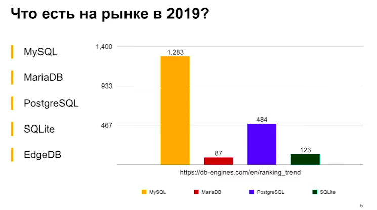

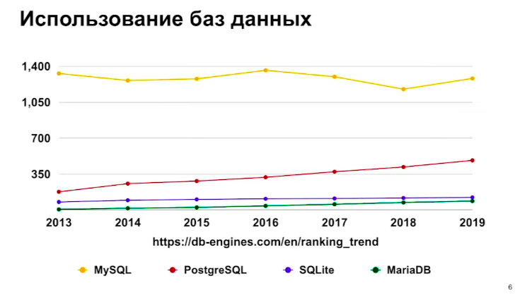

MySQL

- Мультипоточная архитектура
- GPL Лицензия, либо открывать исходники, либо покупать лицензию
- Закрытая система, сообщество не виляет на развитие

PostgreSQL

- Мультипроцессорная архитектура
- Большое сообщество в РФ
- Свободная лицензия MIT

# SQL

Полезные ресурсы:

- [SQL Tutorial, есть готовые БД, для тестирование `sql` команд](https://www.w3schools.com/sql/)
- [Примеры и описание `sql` команд](http://2sql.ru/advanced/sql-in/)
- [Тестовые БД](https://www.sql-ex.ru/db_script_download.php?Lang=0)
- [Генерировать рандомные данные для БД](https://mockaroo.com/schemas/new)

## Create / Delete

### Общее

Создать БД [+](https://postgrespro.ru/docs/postgresql/9.6/sql-createdatabase).

```sql
CREATE DATABASE <ИмяБд> OWNER <ИмяВладельцаДляНовойБд>;
```

Удалить БД.

```sql
DROP DATABASE <ИмяБд>;
```

---

Создать таблицу новую таблицу с указанными типами [+](https://postgrespro.ru/docs/postgresql/9.6/sql-createtable). [Типы данных в PostgreSQL](../Django/PostgreSQL.md#Типы%20данных%20в%20PostgreSQL)

```sql
CREATE TABLE IF NOT EXISTS <ИмяТаблицы> (
	<ИмяСтолбца1> <Тип> <>,
	<ИмяСтолбца2> <Тип> <>,
	<ИмяСтолбца3> <Тип> <>,
);
```

|                                                                                                |                                                                                                                                                                                                       |                                                                                                    |
| ---------------------------------------------------------------------------------------------- | ----------------------------------------------------------------------------------------------------------------------------------------------------------------------------------------------------- | -------------------------------------------------------------------------------------------------- |
| `<ИмяСтолбца1> <Тип> DEFAULT <Значение по умолчанию>`                                          | Если данные не указаны, то будут подставлены значения по умолчанию.                                                                                                                                   |                                                                                                    |
| `<ИмяСтолбца1> <Тип> SERIAL`                                                                   | Если данные не указаны, то число будет автоматически увеличено на единицы(число возьмётся с последнего автоматического увеличения).                                                                   |                                                                                                    |
| `<ИмяСтолбца1> <Тип> CHECK (Столбец >/</=/ знаечние)`                                          | Проверять значения перед добавлением в таблицу, если данные не проходя проверку, возникает исключение (Ограничения столбца).                                                                          | [+](https://postgrespro.ru/docs/postgresql/9.5/ddl-constraints#ddl-constraints-check-constraints)  |
| `CHECK (Столбец1 >/</=/ Столбец2)`                                                             | Проверять столбец перед добавлением в таблицу, если данные не проходя проверку, возникает исключение (Ограничение таблицы).                                                                           |                                                                                                    |
| `<ИмяСтолбца1> <Тип> NOT NULL`                                                                 | Столбец должен быть заполнен.(Он не может быть NULL).                                                                                                                                                 |                                                                                                    |
| `<ИмяСтолбца1> <Тип> UNIQUE`                                                                   | Гарантирует уникальности значений в столбце.                                                                                                                                                          | [+](https://postgrespro.ru/docs/postgresql/9.5/ddl-constraints#ddl-constraints-unique-constraints) |
| `<ИмяСтолбца1> <Тип> CONSTRAINT <ЛюбоеНовоеИмяДляОграничителя> <PRIMARY KEY/UNIQUE/CHECK>` (-) | С помощью ключевого слова `CONSTRAINT` можно задать имя для ограничений.(но это не обязательно)                                                                                                       | [+](https://metanit.com/sql/postgresql/2.4.php)                                                    |
|                                                                                                |                                                                                                                                                                                                       |                                                                                                    |
| ---                                                                                            | ---                                                                                                                                                                                                   |                                                                                                    |
| `<ИмяСтолбца1> <Тип> PRIMARY KEY`                                                              | То же самое что `UNIQUE NOT NULL`, то есть столбец должен быть не пустым, и должен быть уникальным. Но при этом таблица может иметь максимум один первичный ключ, а `UNIQUE NOT NULL` сколько угодно. | [+](https://postgrespro.ru/docs/postgresql/9.5/ddl-constraints#ddl-constraints-primary-keys)       |
| `<ИмяСтолбца1> <Тип> SERIAL PRIMARY KEY`                                                       | Уникальное не пусто число, которое автоматически увеличивается на единицу, при добавление записи. Часто используется для создания `ID`.                                                               |                                                                                                    |
| ---                                                                                            | ---                                                                                                                                                                                                   |                                                                                                    |
| `<ИмяСтолбца1> <Тип> REFERENCES <ДрТаблица>(<ДрСтолбец>)`                                      | Связать столбце этой таблицы, со столбцом из другой таблицы. Это называется внешний ключ `FOREIGN KEY`, этих ключей может быть неограниченное количество в таблице.                                   | [+](https://postgrespro.ru/docs/postgresql/9.5/ddl-constraints#ddl-constraints-fk)                 |
| `<ИмяСтолбца1> <Тип> REFERENCES <ДрТаблица>(<ДрСтолбец>) UNIQUE(<ИмяСтолбца1>)`                | То же самое, но теперь наш внешний ключ должен быть уникальным в столбце.                                                                                                                             |                                                                                                    |
| ---                                                                                            |                                                                                                                                                                                                       |                                                                                                    |

> Создать таблицу новую таблицу на основе результата `sql` запроса. (Помните о том `<SQLЗапросИзДругойТаблицы>` вернет только данные, и их типы, дополнительные настройки и ограничений такие, как `pk`,`defaukt`,`not null` не будут добавленные в новую таблицу).
>
> ```sql
> CREATE TABLE IF NOT EXISTS <ИмяТаблицы>  as <SQLЗапросИзДругойТаблицы>
> ```

Создать временную Таблицу `TEMP`. Временная таблица автоматически удалится при выходе пользователя.

```sql
CREATE TEMP TABLE <ИмяТаблицы> (
	<ИмяСтолбца1> <Тип> <>,
	<ИмяСтолбца2> <Тип> <>,
	<ИмяСтолбца3> <Тип> <>,
);
```

Удалить таблицу.

```sql
DROP TABLE ИмяТАблицы;
```

---

Добавить записи в таблицу. (Даже если у вас одно `значение` его нужно заключить в круглые скобки)

```sql
INSERT INTO <ИмяТаблицы> (<поле1>, <поле2>, ...)

VALUES
		(<значение1>, <значение2> ...),
		(<значение1>, <значение2> ...) ...;
```

Добавит записи в таблицу из другого `SQL` запроса. (Без перечисления `СвойСтолбец`, добавит все столбцы из `SQL` запроса)

```sql
INSERT INTO <ИмяТаблицы> (<СвойСтолбец1, СвлоСтолбец2, ...>)

SELECT <ДругойСтолбец1, ДругойСтолбец2, ... > FROM <ИмяДругойТаблицы>
```

> ```sql
> CREATE TABLE A
> (
>     id   serial,
>     time integer
> );
> INSERT INTO A (id,time)
> VALUES (1, 5000),
>        (2, 2000);
>
>
> CREATE TABLE B
> (
>     id   serial,
>     time integer
> );
>
> INSERT INTO B (time) SELECT time FROM A;
> ```

Добавление строки, полностью состоящей из значений по умолчанию.

```sql
INSERT INTO  <ИмяТаблицы> DEFAULT VALUES;
```

Удалить запись из таблицы.

```sql
DELETE FROM <ИмяТаблицы> WHERE <УсловияДляУдаленияЗаписи>
```

### Индексация столбцов

Индексация столбцов - нужна для ускоренного поиска записи, по умолчанию столбцы (PK) и (FK) индексируются.

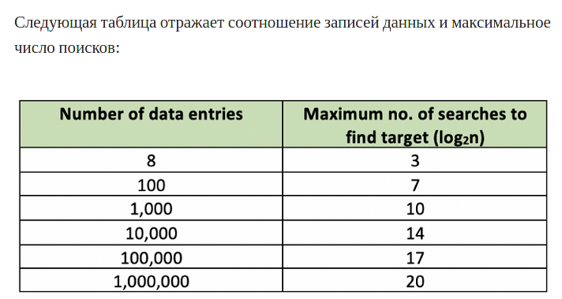

Добавить индексацию к столбцу [+](https://postgrespro.ru/docs/postgresql/9.6/sql-createindex)

```sql
CREATE INDEX <НовоеИмяОгранечителя> ON <Таблица> (<Столбец>);
```

Удалить индексацию

```sql
DROP INDEX <ИмяОгранечителя>;
```

## Update

Обновить значения в таблице

```sql
UPDATE <ИмяТаблицы> SET <КакойСтолбцеМеняем>=<НовоеЗначение> WHERE <УсловиеИзмененияСтолбца>
```

Изменить значения указанного столбца, только у одной записи по её `id`.

```sql
UPDATE <ИмяТаблицы> SET <КакойСтолбцеМеняем>=<НовоеЗначение> WHERE id=<НужныйID>
```

---

Обновить таблицу [+](https://postgrespro.ru/docs/postgresql/10/sql-altertable):

- Изменить тип данных столбца

    ```sql
    ALTER TABLE <ИмяТаблицы> ALTER COLUMN <Столбец> TYPE <НовыйТипСтолбца>;
    ```

- Добавить столбце в таблицу

    ```sql
    ALTER TABLE <ИмяТаблицы> ADD COLUMN <Столбец> <Тип> <Ограничители>;
    ```

- Удалить столбец из таблицы

    ```sql
    ALTER TABLE <ИмяТаблицы> ADD DROP <Столбец>;
    ```

- Добавить проверку столбцу
    ```sql
    ALTER TABLE <ИмяТаблицы> ADD CHECK (<Столбец> >/</=/!= <Значению>);
    ```
- Добавить ограничитель

    ```sql
    ALTER TABLE <ИмяТаблицы> ALTER COLUMN <Столбец> SET <Ограничитель>;
    ```

- Снять ограничитель

    ```sql
    ALTER TABLE <ИмяТаблицы> ALTER COLUMN <Столбец> DROP <Ограничитель>;
    ```

- Добавить ограничитель уникальности

    ```sql
    ALTER TABLE <ИмяТаблицы> ADD UNIQUE (<Столбец>) ;
    ```

- Добавить оганичитель для внешнего ключа

```sql
	ALTER TABLE <ИмяТаблицы> ADD CONSTRAINT <НовоеИмяОгранечитселя>
	FOREIGN KEY (ИмяСтолбцаИзНашейТаблице)
	REFERENCES <ДругаяТаблица>(<ДругойСтолбце>) <ЧтоДелатьПриУдаленииЗаписи>
```

- Удалить ограничитель

```sql
    ALTER TABLE <ИмяТаблицы> DROP CONSTRAINT <ИмяОграничителя>
```

---

## Read

### Все команды

| Символы | Описание                  |
| ------- | ------------------------- |
| `*`     | Подразумевает все столбцы |
| `,`     | Перечисление              |

[Функции и операторы `PostgreSQL`](https://postgrespro.ru/docs/postgrespro/9.5/functions)

| Команда                                                                                | Описание                                                                                                 |
| -------------------------------------------------------------------------------------- | -------------------------------------------------------------------------------------------------------- |
| `SELECT <ИзСтолбцов>`                                                                  | Забрать данные                                                                                           |
| `SELECT <ИмяСтолбца> AS <ОтобразитьНовоеИмяСтолбца>`                                   | Отобразить столбец с другим именем                                                                       |
| `SELECT DISTINCT <ИмяСтолбца>`                                                         | Выбирать только уникальные значения столбца                                                              |
| `FROM <ИзТаблицы>`                                                                     | Откуда взять данные, обычно из таблицы                                                                   |
| `FROM <ИзТаблицы> <Псевдоним>`                                                         | Через пробел можно указать псевдоним имени таблицы, и имено его нужно будет использовать далее в запросе |
| ---                                                                                    |                                                                                                          |
| `WHERE <Уловия>`                                                                       | Условие выборки [WHERE](#WHERE)                                                                          |
| ---                                                                                    |                                                                                                          |
| `LIMIT <ДоЧисла>`                                                                      | Ограничить выборку записей                                                                               |
| `LIMIT <ДоЧисла> OFFSET <СколькоПропустить>`                                           | Пропустить с начало, и ограничить выборку                                                                |
| ---                                                                                    |                                                                                                          |
| `ORDER BY <СортироватьПоСтолбцу1> <ASC/DESC>, <СортироватьПоСтолбцу2> <ASC/DESC>, ...` | Сортировать результат по указанным столбцам. `ASC` от меньшего к большему, `DESC` от большего к меньшему |

### `WHERE`

```sql
WHERE <Название_Столбца> <Операторы>;
```

| Операторы                                                                                     | Описание                                                                                   |
| --------------------------------------------------------------------------------------------- | ------------------------------------------------------------------------------------------ |
| `WHERE <Название_Столбца> == <Значение>`                                                      |                                                                                            |
| `WHERE <Название_Столбца> != <Значение>`                                                      |                                                                                            |
| `WHERE <Название_Столбца> > <Значение>`                                                       |                                                                                            |
| `WHERE <Название_Столбца> < <Значение>`                                                       |                                                                                            |
| `WHERE <Название_Столбца> >= <Значение>`                                                      |                                                                                            |
| `WHERE <Название_Столбца> <= <Значение>`                                                      |                                                                                            |
| `WHERE <Название_Столбца> <Услвоие1> <Значение> AND <Название_Столбца> <Услвоие2> <Значение>` |                                                                                            |
| `WHERE <Название_Столбца> <Услвоие1> <Значение> OR <Название_Столбца> <Услвоие2> <Значение>`  |                                                                                            |
| `WHERE <Название_Столбца> BETWEEN <от> AND <до>`                                              | Промежуток                                                                                 |
| `WHERE <Название_Столбца> LIKE <шаблон>`                                                      | Устанавливает соответствие символьной строки с простым шаблоном.                           |
| `WHERE <Название_Столбца> ILIKE <шаблон>`                                                     | Устанавливает соответствие символьной строки с простым шаблоном. (Без учета регистра букв) |
| `WHERE <Название_Столбца> IN (<значение1>,<значение2>, ...)`                                  | совпадает ли значение объекта со значением в списке.                                       |
| `NOT`                                                                                         | Отрицание                                                                                  |
| `WHERE <Название_Столбца> SIMILAR TO <регуляроное выражение>`                                 | Устанавливает соответствие символьной строки с шаблоном.(Регулярному выражению)            |
|                                                                                               |                                                                                            |

| `LIKE` | [+](https://postgrespro.ru/docs/postgrespro/9.5/functions-matching#functions-like) |
| ------ | ---------------------------------------------------------------------------------- |
| `'%'`  | Строка любой длинны                                                                |
| `'_'`  | Любой одиночный символ                                                             |

| `SIMILAR TO` | [+](https://postgrespro.ru/docs/postgrespro/9.5/functions-matching#functions-similarto-regexp) |
| ------------ | ---------------------------------------------------------------------------------------------- |
| `'%'`        | Строка любой длинны                                                                            |
| `'_'`        | Любой одиночный символ                                                                         |
| `'│'`        | означает выбор (одного из двух вариантов).                                                     |
| `'*'`        | повторение предыдущего элемента 0 и более раз.                                                 |
| `'+'`        | повторение предыдущего элемента 1 и более раз.                                                 |
| `'?'`        | вхождение предыдущего элемента 0 или 1 раз.                                                    |
| `'{от,до}'`  | повторение предыдущего элемента `от` - `до` раз                                                |
| `'()'`       | объединяют несколько элементов в одну логическую группу.                                       |
| `[]`         | Причисление подходящих символов                                                                |
| `[^]`        | Причисление НЕ подходящих символов                                                             |

```sql
CREATE TABLE product(
    id serial PRIMARY KEY,
    price integer,
    name_product varchar(255)
);


INSERT INTO product (id, price, name_product)
VALUES (1, 503, 'Pineapple - Regular'),
       (2, 950, 'White Fish - Filets'),
       (3, 781, 'Beef - Tenderlion, Center Cut'),
       (4, 159, 'Lettuce - California Mix'),
       (5, 657, 'Latex Rubber Gloves Size 9'),
       (6, 175, 'Pork - European Side Bacon'),
       (7, 106, 'Dasheen'),
       (8, 520, 'Appetizer - Cheese Bites'),
       (9, 793, 'Nescafe - Frothy French Vanilla'),
       (10, 648, 'Wine - Casillero Del Diablo');
```

```sql
SELECT * FROM product WHERE  name_product SIMILAR TO '[PWL]%';
```

| id  | price | name_product                |
| :-- | :---- | :-------------------------- |
| 1   | 503   | Pineapple - Regular         |
| 2   | 950   | White Fish - Filets         |
| 4   | 159   | Lettuce - California Mix    |
| 5   | 657   | Latex Rubber Gloves Size 9  |
| 6   | 175   | Pork - European Side Bacon  |
| 10  | 648   | Wine - Casillero Del Diablo |

### Агрегатные функции

#### Все агрегатные функции

**Агрегатные функции** - это функции применяемые к набору входных данных и возвращающие по ним одно результирующее значение [Все агрегатные функции в PostgreSQL](https://postgrespro.ru/docs/postgrespro/9.5/functions-aggregate)

```SQL
SELECT SUM(price), MAX(price), FROM market;
```

| Функции                                       | Описание                                                                       |
| --------------------------------------------- | ------------------------------------------------------------------------------ |
| `avg(столбец)`                                | Среднее значение                                                               |
| `count(столбец)`                              | Общее количество                                                               |
| `max(столбец)`                                | Максимум                                                                       |
| `min(столбец)`                                | Минимум                                                                        |
| `sum(столбец)`                                | Сумма                                                                          |
| `floor(столбец)`                              | Округлить. `floor(avg(<Столбце>))`                                             |
| `coalesce(столбец, <ДругоеЗначениеЕслиNull>)` | Если значение из столбца равно `NULL` то показывает `<ДругоеЗначениеЕслиNull>` |
| `concat(<Строка1> , <Строка2>, ...)`          | Объединить строки. `concat(<Цена>::numeric, ' руб')`                           |
| `array_agg(<столбец>)`                        | Сгруппировать одинаковые объекты в массив                                      |

---

Для проверки условия результата агрегатных функций, аналогом `WHERE` является `HAVING`

```SQL
SELECT SUM(price), MAX(price), FROM market HAVING SUM(price)>10000;
```

---

- `array_agg`, Одинаковые объекты объединяться в список

    ```sql
    CREATE TABLE покупатели
    (
    	id    serial PRIMARY KEY,
    	email varchar(255),
    	buy   money
    );

    INSERT INTO покупатели (id, email, buy)
    VALUES (1, 'dcurrington0@umn.edu', 955),
    	   (2, 'rhartland1@blog.com', 430),
    	   (3, 'zkinton2@so-net.ne.jp', 817),
    	   (4, 'btuison6@themeforest.net', 281),
    	   (5, 'gczajka4@tinypic.com', 610),
    	   (6, 'btuison6@themeforest.net', 281),
    	   (7, 'btuison6@themeforest.net', 281),
    	   (8, 'aclancy7@tmall.com', 884),
    	   (9, 'zkinton2@so-net.ne.jp', 817),
    	   (10, 'ndelaperrelle9@smh.com.au', 523);

    SELECT array_agg(email), sum(buy)
    FROM покупатели
    GROUP BY email;
    ```

    ```sql
    SELECT array_agg(email), sum(buy)
    FROM покупатели
    GROUP BY email;
    ```

    | array_agg                                                                        | sum        |
    | :------------------------------------------------------------------------------- | :--------- |
    | {zkinton2@so-net.ne.jp,zkinton2@so-net.ne.jp}                                    | 1 634,00 ₽ |
    | {btuison6@themeforest.net,btuison6@themeforest.net,btuison6@themeforest.net} (+) | 843,00 ₽   |
    | {aclancy7@tmall.com}                                                             | 884,00 ₽   |
    | {ndelaperrelle9@smh.com.au}                                                      | 523,00 ₽   |
    | {dcurrington0@umn.edu}                                                           | 955,00 ₽   |
    | {gczajka4@tinypic.com}                                                           | 610,00 ₽   |
    | {rhartland1@blog.com}                                                            | 430,00 ₽   |

---

#### `GROUP BY`

```sql
CREATE TABLE покупатели
(
    id    serial PRIMARY KEY,
    email varchar(255),
    buy   money
);

INSERT INTO покупатели (id, email, buy)
VALUES (1, 'dcurrington0@umn.edu', 955),
       (2, 'rhartland1@blog.com', 430),
       (3, 'zkinton2@so-net.ne.jp', 817),
       (4, 'btuison6@themeforest.net', 281),
       (5, 'gczajka4@tinypic.com', 610),
       (6, 'btuison6@themeforest.net', 281),
       (7, 'btuison6@themeforest.net', 281),
       (8, 'aclancy7@tmall.com', 884),
       (9, 'zkinton2@so-net.ne.jp', 817),
       (10, 'ndelaperrelle9@smh.com.au', 523);
```

Изначально агрегатные функции группируют по все столбцы. Например, если мы используем `SUM(buy)` без группировки, то мы получим общую стоимость всех заказов в столбце.

| id  | email                     | buy      |
| :-- | :------------------------ | :------- |
| 1   | dcurrington0@umn.edu      | 955,00 ₽ |
| 2   | rhartland1@blog.com       | 430,00 ₽ |
| 3   | zkinton2@so-net.ne.jp     | 817,00 ₽ |
| 4   | btuison6@themeforest.net  | 281,00 ₽ |
| 5   | gczajka4@tinypic.com      | 610,00 ₽ |
| 6   | btuison6@themeforest.net  | 281,00 ₽ |
| 7   | btuison6@themeforest.net  | 281,00 ₽ |
| 8   | aclancy7@tmall.com        | 884,00 ₽ |
| 9   | zkinton2@so-net.ne.jp     | 817,00 ₽ |
| 10  | ndelaperrelle9@smh.com.au | 523,00 ₽ |

```sql
SELECT sum(buy)
FROM покупатели;
```

| sum        |
| ---------- |
| 5 879,00 ₽ |

Но если мы хотим узнать, стоимость заказа для каждого `email` клиента то нам нужна группировка `group by`

```sql
SELECT email, sum(buy)
FROM покупатели GROUP BY email;
```

| email                     | sum        |
| :------------------------ | :--------- |
| zkinton2@so-net.ne.jp     | 1 634,00 ₽ |
| btuison6@themeforest.net  | 843,00 ₽   |
| aclancy7@tmall.com        | 884,00 ₽   |
| ndelaperrelle9@smh.com.au | 523,00 ₽   |
| dcurrington0@umn.edu      | 955,00 ₽   |
| gczajka4@tinypic.com      | 610,00 ₽   |
| rhartland1@blog.com       | 430,00 ₽   |

---

Пример:

```sql
-- Например у нас есть таблица которая хранит все заказы
-- на сайте, учтем тот факт что один и тот же
-- клиент может сделать несколько заказов.
-- Мы хотим чтобы те клиенты которы вообщем сделали
-- заказы более чем на 10_000 рублей получали скидку
-- на следующие заказы.


-------------------------
-- Таблица клиента
create table client
(
    id         serial primary key,
    first_name varchar(200)        not null,
    phone      varchar(40) unique  not null,
    email      varchar(200) unique not null
);
insert into client (id, first_name, phone, email)
values (1, 'Nomi', '+86-713-441-0872', 'nhitzke0@alexa.com'),
       (2, 'Micah', '+63-494-697-4014', 'mgilbart1@pbs.org'),
       (3, 'Karine', '+63-371-916-1099', 'kduffit2@aol.com'),
       (4, 'Fidel', '+66-175-890-0091', 'fmaclennan3@npr.org'),
       (5, 'Sean', '+351-711-481-7929', 'sossenna4@parallels.com'),
       (6, 'Rene', '+86-759-542-6974', 'rambroisin5@house.gov'),
       (7, 'Kent', '+66-291-346-0327', 'kcarville6@dedecms.com'),
       (8, 'Aleen', '+86-340-358-8279', 'amangin7@bloglovin.com'),
       (9, 'Osborne', '+54-340-340-2340', 'obedward8@list-manage.com'),
       (10, 'Zelma', '+86-903-277-9631', 'zlaxon9@amazon.com');

```

| id  | first_name | phone             | email                     |
| :-- | :--------- | :---------------- | :------------------------ |
| 1   | Nomi       | +86-713-441-0872  | nhitzke0@alexa.com        |
| 2   | Micah      | +63-494-697-4014  | mgilbart1@pbs.org         |
| 3   | Karine     | +63-371-916-1099  | kduffit2@aol.com          |
| 4   | Fidel      | +66-175-890-0091  | fmaclennan3@npr.org       |
| 5   | Sean       | +351-711-481-7929 | sossenna4@parallels.com   |
| 6   | Rene       | +86-759-542-6974  | rambroisin5@house.gov     |
| 7   | Kent       | +66-291-346-0327  | kcarville6@dedecms.com    |
| 8   | Aleen      | +86-340-358-8279  | amangin7@bloglovin.com    |
| 9   | Osborne    | +54-340-340-2340  | obedward8@list-manage.com |
| 10  | Zelma      | +86-903-277-9631  | zlaxon9@amazon.com        |

```sql
-- Таблица для всех заказов
create table all_orders
(
    id        serial primary key,
    id_client integer references client (id),
    price_buy numeric not null
);
insert into all_orders (id_client, price_buy)
values (1, 4497),
       (1, 900),
       (10, 2007),
       (10, 3116),
       (6, 1767),
       (9, 1698),
       (1, 2661),
       (8, 938),
       (8, 88),
       (4, 799),
       (8, 511),
       (1, 169),
       (6, 2979),
       (7, 109),
       (5, 2126),
       (10, 365),
       (2, 505),
       (2, 4953),
       (2, 2707),
       (5, 2383),
       (8, 3135),
       (2, 2186),
       (8, 2952),
       (6, 2790),
       (6, 2577);
```

| id  | id_client | price_buy |
| :-- | :-------- | :-------- |
| 1   | 1         | 4497      |
| 2   | 1         | 900       |
| 3   | 10        | 2007      |
| 4   | 10        | 3116      |
| 5   | 6         | 1767      |
| 6   | 9         | 1698      |
| 7   | 1         | 2661      |
| 8   | 8         | 938       |
| 9   | 8         | 88        |
| 10  | 4         | 799       |
| 11  | 8         | 511       |
| 12  | 1         | 169       |
| 13  | 6         | 2979      |
| 14  | 7         | 109       |
| 15  | 5         | 2126      |
| 16  | 10        | 365       |
| 17  | 2         | 505       |
| 18  | 2         | 4953      |
| 19  | 2         | 2707      |
| 20  | 5         | 2383      |
| 21  | 8         | 3135      |
| 22  | 2         | 2186      |
| 23  | 8         | 2952      |
| 24  | 6         | 2790      |
| 25  | 6         | 2577      |

```sql
-------------------------

-- Увидем результат объединения
select first_name, client.id, all_orders.price_buy
from client
         join all_orders on client.id = all_orders.id_client;

-------------------------

-- Увидем результат объединения и групировки
select first_name, sum(all_orders.price_buy)
from client
         join all_orders on client.id = all_orders.id_client
group by client.first_name;

-------------------------

-- Увидем результат объединения и групировки и проверки того что общая сумма заказов более 10_000 тысяч
select first_name, sum(all_orders.price_buy)
from client
         join all_orders on client.id = all_orders.id_client
group by client.first_name
HAVING sum(all_orders.price_buy) > 10000;

```

| first_name | sum   |
| :--------- | :---- |
| Rene       | 10113 |
| Micah      | 10351 |

# Связи таблиц

## `REFERENCES` - ссылка

### on delete

- `CASCADE` Если мы удалим запись из главной таблицы(там где первичный ключ), то автоматически удалятся записи из подчинённых таблиц(там где внешний ключ указывает на первичный ключ). Но такая цепная реакция работает только если мы удаляем запись из главной таблицы, а если мы удаляем запись из подчинённой таблице, то ни какого каскадного(ценённого) удаления не произойдет, удаляется только та запись которую мы удаляем.

> В `SQLite` для каскадно удаления нужно сначала выполнить команду `PRAGMA foreign_keys = ON;`, иначе каскадного удаления не будет, удалиться только запись из главной таблицы, а записи в подчинённых таблицах будут не тронуты.

```sql
-- Будет ошибка - потому что мы пытаемся создать подчененную таблицу, а её некому подчинятся.
-- Надо сначало создачть главную таблицу а потом уже почененню

CREATE TABLE фотографии
(
    id          serial PRIMARY KEY,
    путь_к_фото varchar(255) NOT NULL,
    fk_id       bigint REFERENCES пользователь (id) ON DELETE CASCADE
);
INSERT INTO фотографии (путь_к_фото, fk_id)
VALUES ('Длинный путь к фото1', 1),
       ('Длинный путь к фото2', 2),
       ('Длинный путь к фото3', 3),
       ('Длинный путь к фото4', 4),
       ('Длинный путь к фото5', 5),
       ('Длинный путь к фото6', 6);


CREATE TABLE пользователь
(
    id     serial PRIMARY KEY,
    имя    varchar(255) NOT NULL,
    статус varchar(600)
);
INSERT INTO пользователь (id, имя, статус)
VALUES (1, 'Петя', 'iterate 24/7 platforms'),
       (2, 'Maressa Daysh', 'benchmark leading-edge paradigms'),
       (3, 'Humbert Iddons', 'orchestrate visionary synergies'),
       (4, 'Петя', 'enable leading-edge e-tailers'),
       (5, 'Min O''Carney', 'incubate next-generation relationships'),
       (6, 'Devina Semon', 'incubate dot-com convergence');


-- alter table фотографии drop constraint фотографии_fk_id_fkey;
-- alter table фотографии
--     add CONSTRAINT фотографии_fk_id_fkey
--         foreign key (fk_id)
--             REFERENCES пользователь (id) on delete set null
```

| id    | имя            | статус                                 |
| :---- | :------------- | :------------------------------------- |
| 1 (+) | Петя           | iterate 24/7 platforms                 |
| 2     | Maressa Daysh  | benchmark leading-edge paradigms       |
| 3     | Humbert Iddons | orchestrate visionary synergies        |
| 4 (+) | Петя           | enable leading-edge e-tailers          |
| 5     | Min O'Carney   | incubate next-generation relationships |
| 6     | Devina Semon   | incubate dot-com convergence           |

| id  | pathimage            | fk_id |
| :-- | :------------------- | :---- |
| 1   | Длинный путь к фото1 | 1 (+) |
| 2   | Длинный путь к фото2 | 2     |
| 3   | Длинный путь к фото3 | 3     |
| 4   | Длинный путь к фото4 | 4 (+) |
| 5   | Длинный путь к фото5 | 5     |
| 6   | Длинный путь к фото1 | 6     |

Если удаляем запись в главной таблице, то удаляться записи в подчинённой таблице.

```sql
DELETE FROM пользователь WHERE имя = 'Петя';
```

| id  | имя            | статус                                 |
| :-- | :------------- | :------------------------------------- |
| 2   | Maressa Daysh  | benchmark leading-edge paradigms       |
| 3   | Humbert Iddons | orchestrate visionary synergies        |
| 5   | Min O'Carney   | incubate next-generation relationships |
| 6   | Devina Semon   | incubate dot-com convergence           |

| id  | путь*к*фото          | fk_id |
| :-- | :------------------- | :---- |
| 2   | Длинный путь к фото2 | 2     |
| 3   | Длинный путь к фото3 | 3     |
| 5   | Длинный путь к фото5 | 5     |
| 6   | Длинный путь к фото6 | 6     |

---

- `RESTRICT` Запрещает удалять запись из главной таблицы, если на неё ссылаются внешний ключ из подчинённой таблицы. Но обратите внимание, мы можем спокойно удалять записи из подчинённой таблицы. Либо можно посмотреть с другой стороны. `RESTRICT` предотвращает какие-либо действия в зависимой таблице при удалении или изменении связанных строк в главной таблице, то есть предотвращать каскадное(цепное) удаление в обе стороны.

```sql
CREATE TABLE должник
(
    id              serial PRIMARY KEY,
    имя             varchar(255),
    кредитная_карта varchar(600)
);

INSERT INTO должник (id, имя, кредитная_карта)
VALUES (1, 'Mindy', '3562822845980383'),
       (2, 'Amerigo', '5602236041733594'),
       (3, 'Magdalene', '3556440707788071'),
       (4, 'Emlynn', '6304800561469092'),
       (5, 'Bridgette', '3583651819496422'),
       (6, 'Lainey', '5038224787180226620'),
       (7, 'Ludovico', '3563801233697576'),
       (8, 'Teddy', '3553964798301208'),
       (9, 'Cob', '5108757749261355'),
       (10, 'Nolan', '3553306634560532');
CREATE TABLE таблица_долгов
(
    id          serial PRIMARY KEY,
    price       money,
    name        varchar(255),
    id_должника integer REFERENCES должник (id) ON DELETE RESTRICT
);
INSERT INTO таблица_долгов (id, price, name, id_должника)
VALUES (1, 839, 'Свет', 6),
       (2, 238, 'Газ', 4),
       (3, 7884, 'Отопление', 1),
       (4, 5618, 'Горячая вода', 7),
       (5, 7205, 'Газ', 7),
       (6, 5512, 'Газ', 2),
       (7, 8407, 'Холодная вода', 3),
       (8, 9715, 'Свет', 7),
       (9, 8198, 'Поборы', 9),
       (10, 5886, 'Отопление', 5);
```

| id  | имя       | кредитная_карта     |
| :-- | :-------- | :------------------ |
| 1   | Mindy     | 3562822845980383    |
| 2   | Amerigo   | 5602236041733594    |
| 3   | Magdalene | 3556440707788071    |
| 4   | Emlynn    | 6304800561469092    |
| 5   | Bridgette | 3583651819496422    |
| 6   | Lainey    | 5038224787180226620 |
| 7   | Ludovico  | 3563801233697576    |
| 8   | Teddy     | 3553964798301208    |
| 9   | Cob       | 5108757749261355    |
| 10  | Nolan     | 3553306634560532    |

| id  | price      | name          | id_должника |
| :-- | :--------- | :------------ | :---------- |
| 1   | 839,00 ₽   | Свет          | 6           |
| 2   | 238,00 ₽   | Газ           | 4           |
| 3   | 7 884,00 ₽ | Отопление     | 1           |
| 4   | 5 618,00 ₽ | Горячая вода  | 7           |
| 5   | 7 205,00 ₽ | Газ           | 7           |
| 6   | 5 512,00 ₽ | Газ           | 2           |
| 7   | 8 407,00 ₽ | Холодная вода | 3           |
| 8   | 9 715,00 ₽ | Свет          | 7           |
| 9   | 8 198,00 ₽ | Поборы        | 9           |
| 10  | 5 886,00 ₽ | Отопление     | 5           |

Если мы попробуем удалить запись с `id = 4` из главной таблице `должник`, то будет ошибка, потому что на `id` , есть ссылка из таблицы `таблица_долгов`

```sql
DELETE FROM должник WHERE id = 4;
```

```bash
[23503] ОШИБКА: UPDATE или DELETE в таблице "должник" нарушает ограничение внешнего ключа
"таблица_долгов_id_должника_fkey" таблицы "таблица_долгов" Подробности: На ключ (id)=(4) всё ещё есть
ссылки в таблице "таблица_долгов".
```

Поэтому нам сначала нужно удалить запись из подчинённой таблицы, а потом уже мы можем удалить запись из главной

```sql
DELETE FROM таблица_долгов WHERE id_должника=4;
```

```sql
DELETE FROM должник WHERE id = 4;
```

| id  | price      | name          | id_должника |
| :-- | :--------- | :------------ | :---------- |
| 1   | 839,00 ₽   | Свет          | 6           |
| 3   | 7 884,00 ₽ | Отопление     | 1           |
| 4   | 5 618,00 ₽ | Горячая вода  | 7           |
| 5   | 7 205,00 ₽ | Газ           | 7           |
| 6   | 5 512,00 ₽ | Газ           | 2           |
| 7   | 8 407,00 ₽ | Холодная вода | 3           |
| 8   | 9 715,00 ₽ | Свет          | 7           |
| 9   | 8 198,00 ₽ | Поборы        | 9           |
| 10  | 5 886,00 ₽ | Отопление     | 5           |

| id  | имя       | кредитная_карта     |
| :-- | :-------- | :------------------ |
| 1   | Mindy     | 3562822845980383    |
| 2   | Amerigo   | 5602236041733594    |
| 3   | Magdalene | 3556440707788071    |
| 5   | Bridgette | 3583651819496422    |
| 6   | Lainey    | 5038224787180226620 |
| 7   | Ludovico  | 3563801233697576    |
| 8   | Teddy     | 3553964798301208    |
| 9   | Cob       | 5108757749261355    |
| 10  | Nolan     | 3553306634560532    |

- `NO ACTION` Делает то же самое что и `RESTRICT`, (запрещает удалять записи из главной таблице если на неё ссылаются внешним ключом) только проверяет целостность в конце. (Используется по умолчанию)(Используется для проверки транзакции)

- `SET NULL` Похоже на каскадное удлинение, только вместо удаления всей записи в подчинённой таблице, столбец внешнего ключа устанавливается в `NULL`, а вся запись остается(не удаляется).

```sql
CREATE TABLE военнослужащий
(
    id   serial PRIMARY KEY,
    name varchar(255) NOT NULL
);
INSERT INTO военнослужащий (id, name)
VALUES (1, 'Wash'),
       (2, 'Krishnah'),
       (3, 'Albrecht'),
       (4, 'Nikolaus'),
       (5, 'Shaine'),
       (6, 'Siward'),
       (7, 'Davy'),
       (8, 'Udall'),
       (9, 'Marwin'),
       (10, 'Adamo');
CREATE TABLE должности
(
    id                 serial PRIMARY KEY,
    имя_должности      varchar(600) NOT NULL,
    id_военнослужащего integer REFERENCES военнослужащий (id) ON DELETE SET NULL UNIQUE
);
INSERT INTO должности (id, имя_должности, id_военнослужащего)
VALUES (1, 'Valentin', 1),
       (2, 'Farr', 3),
       (3, 'Solomon', 2),
       (4, 'Herc', 5),
       (5, 'Raleigh', 4),
       (6, 'Alberto', 6),
       (7, 'Amby', 7),
       (8, 'Yulma', 8),
       (9, 'Jarrod', 10),
       (10, 'Magnum', 9);
```

| id  | name     |
| :-- | :------- |
| 1   | Wash     |
| 2   | Krishnah |
| 3   | Albrecht |
| 4   | Nikolaus |
| 5   | Shaine   |
| 6   | Siward   |
| 7   | Davy (+) |
| 8   | Udall    |
| 9   | Marwin   |
| 10  | Adamo    |

| id  | имя_должности | id_военнослужащего |
| :-- | :------------ | :----------------- |
| 1   | Valentin      | 1                  |
| 2   | Farr          | 3                  |
| 3   | Solomon       | 2                  |
| 4   | Herc          | 5                  |
| 5   | Raleigh       | 4                  |
| 6   | Alberto       | 6                  |
| 7   | Amby          | 7 (+)              |
| 8   | Yulma         | 8                  |
| 9   | Jarrod        | 10                 |
| 10  | Magnum        | 9                  |

Если мы удаляем запись из главной таблицы, то автоматически внешний ключ в подчинённой таблицы устанавливается в `NULL`

```sql
DELETE FROM военнослужащий WHERE name = 'Davy'
```

| id  | name     |
| :-- | :------- |
| 1   | Wash     |
| 2   | Krishnah |
| 3   | Albrecht |
| 4   | Nikolaus |
| 5   | Shaine   |
| 6   | Siward   |
| 8   | Udall    |
| 9   | Marwin   |
| 10  | Adamo    |

| id  | имя_должности | id_военнослужащего |
| :-- | :------------ | :----------------- |
| 1   | Valentin      | 1                  |
| 2   | Farr          | 3                  |
| 3   | Solomon       | 2                  |
| 4   | Herc          | 5                  |
| 5   | Raleigh       | 4                  |
| 6   | Alberto       | 6                  |
| 8   | Yulma         | 8                  |
| 9   | Jarrod        | 10                 |
| 10  | Magnum        | 9                  |
| 7   | Amby          | NULL (+)           |

- `SET DEFAULT` То же самое что и `set null` только устанавливает значение по умолчанию для столбца внешнего ключа. Ограничение `DEFAULT`(значение по умолчанию) нужно указывать отдельно.(Удалим у `id_военнослужащего` ограничитель `UNIQUE` )

```sql
CREATE TABLE военнослужащий
(
    id   serial PRIMARY KEY,
    name varchar(255) NOT NULL
);
INSERT INTO военнослужащий (id, name)
VALUES (1, 'Wash'),
       (2, 'Krishnah'),
       (3, 'Albrecht'),
       (4, 'Nikolaus'),
       (5, 'Shaine'),
       (6, 'Siward'),
       (7, 'Davy'),
       (8, 'Udall'),
       (9, 'Marwin'),
       (10, 'Adamo');
CREATE TABLE должности
(
    id                 serial PRIMARY KEY,
    имя_должности      varchar(600) NOT NULL,
    id_военнослужащего integer REFERENCES военнослужащий (id) ON DELETE SET NULL DEFAULT 1
);
INSERT INTO должности (id, имя_должности, id_военнослужащего)
VALUES (1, 'Valentin', 1),
       (2, 'Farr', 3),
       (3, 'Solomon', 2),
       (4, 'Herc', 5),
       (5, 'Raleigh', 4),
       (6, 'Alberto', 6),
       (7, 'Amby', 7),
       (8, 'Yulma', 8),
       (9, 'Jarrod', 10),
       (10, 'Magnum', 9);
```

| id  | name     |
| :-- | :------- |
| 1   | Wash     |
| 2   | Krishnah |
| 3   | Albrecht |
| 4   | Nikolaus |
| 5   | Shaine   |
| 6   | Siward   |
| 7   | Davy (+) |
| 8   | Udall    |
| 9   | Marwin   |
| 10  | Adamo    |

| id  | имя_должности | id_военнослужащего |
| :-- | :------------ | :----------------- |
| 1   | Valentin      | 1                  |
| 2   | Farr          | 3                  |
| 3   | Solomon       | 2                  |
| 4   | Herc          | 5                  |
| 5   | Raleigh       | 4                  |
| 6   | Alberto       | 6                  |
| 7   | Amby          | 7 (+)              |
| 8   | Yulma         | 8                  |
| 9   | Jarrod        | 10                 |
| 10  | Magnum        | 9                  |

Мы удаляем запись из главно таблице, и автоматически в подчинённой таблице столбце внешнего ключа устанавливается в значение по умолчанию.(в нашем случае это `1`)(Обратите внимание, что даже в этом случае мы не можем нарушить правило - указать значение по умолчанию которое бы указывала на несуществующе запись)

```sql
DELETE FROM военнослужащий WHERE name = 'Davy'
```

| id  | name     |
| :-- | :------- |
| 1   | Wash     |
| 2   | Krishnah |
| 3   | Albrecht |
| 4   | Nikolaus |
| 5   | Shaine   |
| 6   | Siward   |
| 8   | Udall    |
| 9   | Marwin   |
| 10  | Adamo    |

| id  | имя_должности | id_военнослужащего |
| :-- | :------------ | :----------------- |
| 1   | Valentin      | 1                  |
| 2   | Farr          | 3                  |
| 3   | Solomon       | 2                  |
| 4   | Herc          | 5                  |
| 5   | Raleigh       | 4                  |
| 6   | Alberto       | 6                  |
| 8   | Yulma         | 8                  |
| 9   | Jarrod        | 10                 |
| 10  | Magnum        | 9                  |
| 7   | Amby          | 1 (+)              |

### on update

Работает так же как `on delete` только в этом случаем контролируем обновление столбца `pk_id` в главной таблице, и обновления`fk_id` в подчененой таблице. Давайте посмотрим пример с каскадным обновлением.

- `CASCADE`

```sql
CREATE TABLE пользователь
(
    id     serial PRIMARY KEY,
    имя    varchar(255) NOT NULL,
    статус varchar(600)
);
INSERT INTO пользователь (id, имя, статус)
VALUES (1, 'Петя', 'iterate 24/7 platforms'),
       (2, 'Maressa Daysh', 'benchmark leading-edge paradigms'),
       (3, 'Humbert Iddons', 'orchestrate visionary synergies'),
       (4, 'Петя', 'enable leading-edge e-tailers'),
       (5, 'Min O''Carney', 'incubate next-generation relationships'),
       (6, 'Devina Semon', 'incubate dot-com convergence');

CREATE TABLE фотографии
(
    id          serial PRIMARY KEY,
    путь_к_фото varchar(255) NOT NULL,
    fk_id       bigint REFERENCES пользователь (id) ON UPDATE CASCADE
);
INSERT INTO фотографии (путь_к_фото, fk_id)
VALUES ('Длинный путь к фото1', 1),
       ('Длинный путь к фото2', 2),
       ('Длинный путь к фото3', 3),
       ('Длинный путь к фото4', 4),
       ('Длинный путь к фото5', 5),
       ('Длинный путь к фото6', 6);
```

Обновляем `id`в главной таблице, и он автоматически обновляется в подчинённой таблице.

```sql
UPDATE пользователь SET id = 99 WHERE id = 6;
```

| id     | имя            | статус                                 |
| :----- | :------------- | :------------------------------------- |
| 1      | Петя           | iterate 24/7 platforms                 |
| 2      | Maressa Daysh  | benchmark leading-edge paradigms       |
| 3      | Humbert Iddons | orchestrate visionary synergies        |
| 4      | Петя           | enable leading-edge e-tailers          |
| 5      | Min O'Carney   | incubate next-generation relationships |
| 99 (+) | Devina Semon   | incubate dot-com convergence           |

| id  | pathimage            | fk_id |
| :-- | :------------------- | :---- |
| 1   | Длинный путь к фото1 | 1     |
| 2   | Длинный путь к фото2 | 2     |
| 3   | Длинный путь к фото3 | 3     |
| 4   | Длинный путь к фото4 | 4     |
| 5   | Длинный путь к фото5 | 5     |
| 6   | Длинный путь к фото6 | 99(+) |

---

### Комбинировать `on delete` и `on update`.

Вот пример каскадного обновления и каскадного удаления

```sql
create table other_vpntable2
(
    id       serial primary key,
    NameSend varchar(255) not null,
    Message  varchar(600) not null,
    NameGet  varchar(255) not null
);
insert into other_vpntable2 (NameSend, NameGet, Message)
values ('Петя', 'Кости', 'Привет'),
       ('Петя', 'Маше', 'Привет'),
       ('Петя', 'Сереже', 'Привет'),
       ('Костя', 'Пети', 'Здоров'),
       ('Маша', 'Кости', 'Я занята'),
       ('Петя', 'Кости', 'Как дела');


create table other_vpnphoto2
(
    id        serial primary key,
    PathImage varchar(255) not null,
    fk_id     bigint references other_vpntable2 (id) ON UPDATE cascade ON DELETE cascade
);
insert into other_vpnphoto2 (PathImage, fk_id)
values ('Длинный путь к фото1', 1),
       ('Длинный путь к фото2', 2),
       ('Длинный путь к фото3', 3),
       ('Длинный путь к фото4', 4),
       ('Длинный путь к фото5', 5),
       ('Длинный путь к фото6', 6);
```

Обновляем `id`в главной таблице, и он автоматически обновляется в подчинённой таблице.

```sql
UPDATE пользователь SET id = 99 WHERE id = 6;
```

| id     | namesend | message  | nameget |
| :----- | :------- | :------- | :------ |
| 1      | Петя     | Привет   | Кости   |
| 2      | Петя     | Привет   | Маше    |
| 3      | Петя     | Привет   | Сереже  |
| 4      | Костя    | Здоров   | Пети    |
| 5      | Маша     | Я занята | Кости   |
| 99 (+) | Петя     | Как дела | Кости   |

| id  | pathimage            | fk_id |
| :-- | :------------------- | :---- |
| 1   | Длинный путь к фото1 | 1     |
| 2   | Длинный путь к фото2 | 2     |
| 3   | Длинный путь к фото3 | 3     |
| 4   | Длинный путь к фото4 | 4     |
| 5   | Длинный путь к фото5 | 5     |
| 6   | Длинный путь к фото6 | 99(+) |

Если удаляем запись в главной таблице, то удаляться записи в подчинённой таблице.

```sql
DELETE FROM пользователь WHERE id=99;
```

| id  | namesend | message  | nameget |
| :-- | :------- | :------- | :------ |
| 1   | Петя     | Привет   | Кости   |
| 2   | Петя     | Привет   | Маше    |
| 3   | Петя     | Привет   | Сереже  |
| 4   | Костя    | Здоров   | Пети    |
| 5   | Маша     | Я занята | Кости   |

| id  | pathimage            | fk_id |
| :-- | :------------------- | :---- |
| 1   | Длинный путь к фото1 | 1     |
| 2   | Длинный путь к фото2 | 2     |
| 3   | Длинный путь к фото3 | 3     |
| 4   | Длинный путь к фото4 | 4     |
| 5   | Длинный путь к фото5 | 5     |

## `Join` - объединение

```sql
SELECT <СтолбцыОтображения> FROM <ИмяОсновнойТаблицы>
<LEFT INNER FULL RIGHT> JOIN <ИмяДругойТаблицы> ON <УсловияСвязывния>
```

> `OUTER` можно не указывать !

1. `INNER JOIN` или `INNER OUTER JOIN` или просто `JOIN`

    - 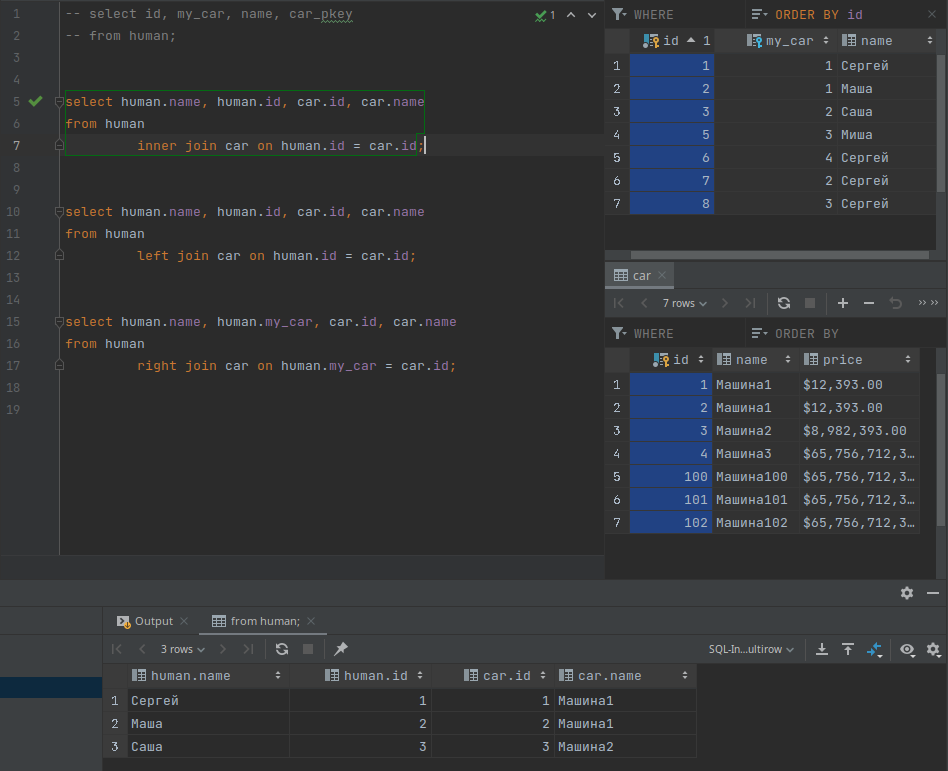
    - 

1. `LEFT JOIN` или `LEFT OUTER JOIN`

    - 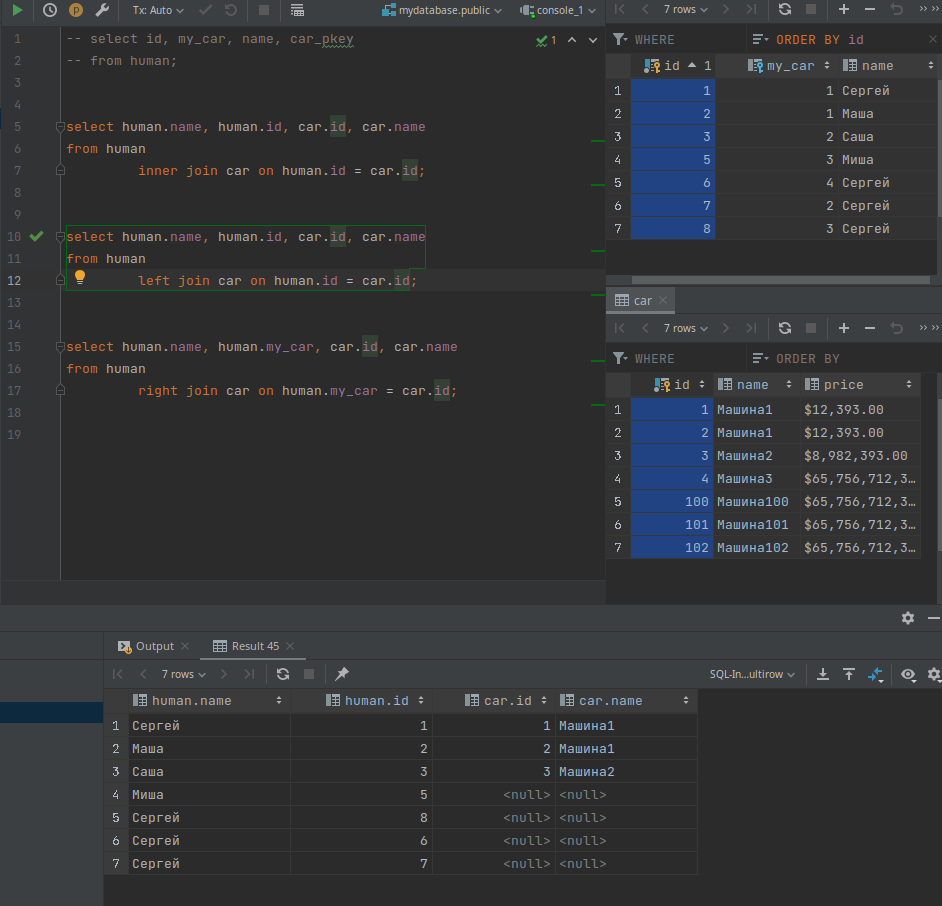
    - 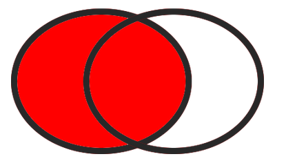

1. Выбрать столбцы из левой таблицы у которых нет значений в правой таблицы. Нужно указать условие `where СтолбецИзПравойТаблицы.id is null`

    - 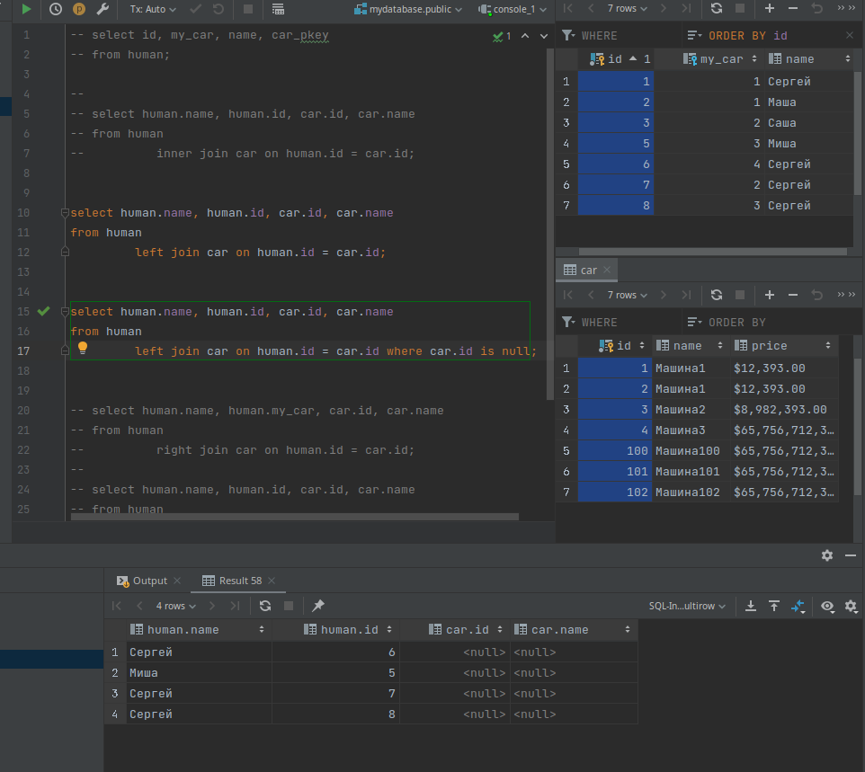
    - 

1. `RIGHT JOIN` или `RIGHT OUTER JOIN`

    - 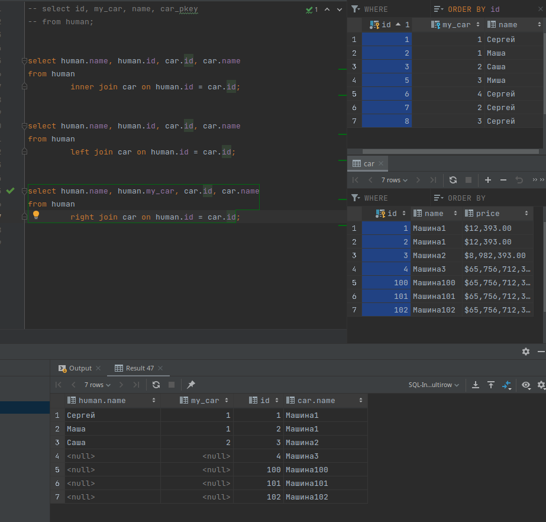
    - 

1. Выбрать столбцы из правой таблицы у которых нет значений в левой таблицы. Нужно указать условие `where СтолбецИзЛевойТаблицы.id is null`

    - 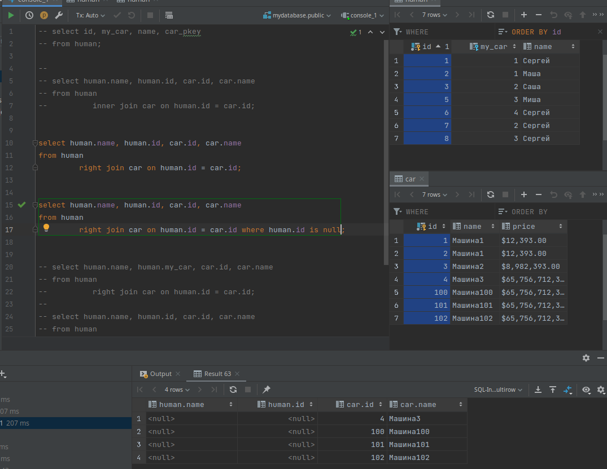
    - 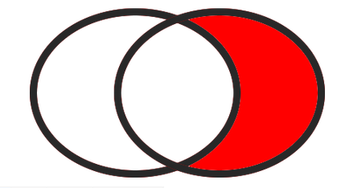

1. `FULL JOIN` или `FULL OUTER JOIN`

    - 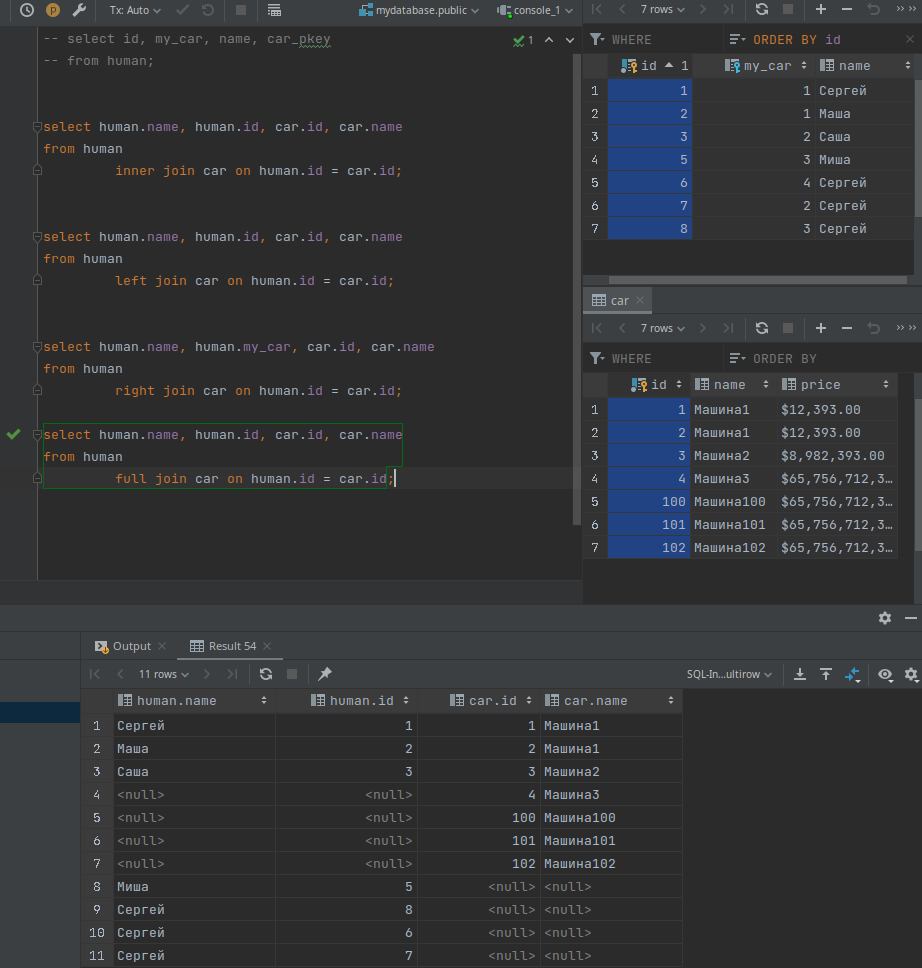
    - 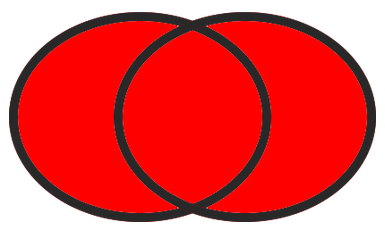

1. Выбрать столбцы у которых нет совпадений. Нужно указать условие `where СтолбецИзЛевойТаблицы.id is null OR СтолбецИзПравойТаблицы.id is null `
    - 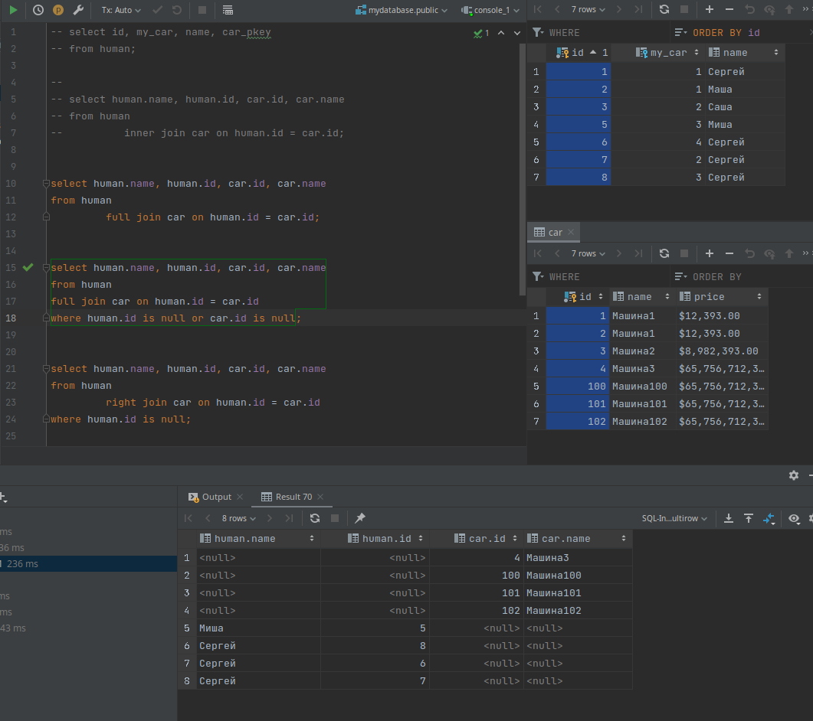
    - 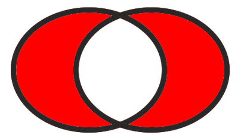

## Типы связей

### Один к одному

У одной записи в главной таблице есть только одна запись в другой таблице.

---

Связь один к одному используется для:

- Расширения данных о главной таблицы
- Для защиты (скрытия) данных, путем создания отдельных таблиц

---

В этом примере мы разделили таблицу сотрудников, и таблицу паспортных данных, ради конфиденциальности сотрудников, таблицу `сотрудник` мы можем спокойно давать читать и анализировать другим пользователям, не боясь того что кто-то узнает точные паспортные данных наших сотрудников. При этом у нас есть ограничитель уникальности в таблице `паспорта_сотрудников`, то есть у одного сотрудника есть только один паспорт.

```sql
create table сотрудник
(
    id       serial primary key,
    f_name   varchar(255) not null,
    l_name   varchar(255) not null,
    position integer default 0 -- Должность
);
insert into сотрудник (id, f_name, l_name, position)
values (1, 'Patrizio', 'Skeat', 35),
       (2, 'Raphael', 'Clouston', 82),
       (3, 'Karyn', 'Coole', 6),
       (4, 'Rhys', 'Cicconetti', 58),
       (5, 'Cahra', 'Belcham', 90),
       (6, 'Margareta', 'Aristide', 48),
       (7, 'Kristel', 'Garvan', 37),
       (8, 'Dallis', 'Robbings', 56),
       (9, 'Rafi', 'Dewerson', 51),
       (10, 'Jeannie', 'Durrant', 36);


create table паспорта_сотрудников
(
    id              serial,
    id_person       integer references сотрудник (id) on delete cascade UNIQUE, -- Уникальный
    passport_number varchar(255) not null
);
insert into паспорта_сотрудников (id, id_person, passport_number)
values (1, 3, '4041373299689293'),
       (2, 4, '4041593351596'),
       (3, 5, '4041372241190'),
       (4, 9, '4041379655579705'),
       (5, 10, '4041373879659'),
       (6, 7, '4041376224537479'),
       (7, 1, '4017952389376596'),
       (8, 6, '4041596168463750'),
       (9, 2, '4041594578866'),
       (10, 8, '4041592771576393');

--drop table сотрудник;
--drop table паспорта_сотрудников;
```

| id  | f_name    | l_name     | position |
| :-- | :-------- | :--------- | :------- |
| 1   | Patrizio  | Skeat      | 35       |
| 2   | Raphael   | Clouston   | 82       |
| 3   | Karyn     | Coole      | 6        |
| 4   | Rhys      | Cicconetti | 58       |
| 5   | Cahra     | Belcham    | 90       |
| 6   | Margareta | Aristide   | 48       |
| 7   | Kristel   | Garvan     | 37       |
| 8   | Dallis    | Robbings   | 56       |
| 9   | Rafi      | Dewerson   | 51       |
| 10  | Jeannie   | Durrant    | 36       |

| id  | id_person | passport_number  |
| :-- | :-------- | :--------------- |
| 1   | 3         | 4041373299689293 |
| 2   | 4         | 4041593351596    |
| 3   | 5         | 4041372241190    |
| 4   | 9         | 4041379655579705 |
| 5   | 10        | 4041373879659    |
| 6   | 7         | 4041376224537479 |
| 7   | 1         | 4017952389376596 |
| 8   | 6         | 4041596168463750 |
| 9   | 2         | 4041594578866    |
| 10  | 8         | 4041592771576393 |

```sql
select сотрудник.f_name, сотрудник.id, пс.id_person, пс.passport_number
from сотрудник
         join паспорта_сотрудников пс on сотрудник.id = пс.id_person;
```

| f_name    | id  | id_person | passport_number  |
| :-------- | :-- | :-------- | :--------------- |
| Karyn     | 3   | 3         | 4041373299689293 |
| Rhys      | 4   | 4         | 4041593351596    |
| Cahra     | 5   | 5         | 4041372241190    |
| Rafi      | 9   | 9         | 4041379655579705 |
| Jeannie   | 10  | 10        | 4041373879659    |
| Kristel   | 7   | 7         | 4041376224537479 |
| Patrizio  | 1   | 1         | 4017952389376596 |
| Margareta | 6   | 6         | 4041596168463750 |
| Raphael   | 2   | 2         | 4041594578866    |
| Dallis    | 8   | 8         | 4041592771576393 |

### Один ко многим

У одной записи в главной таблице может быть несколько записей в подчинённой таблице

- У одного пользователя может быть множество фотографий. (+)
- У одного покупателя может быть множество товаров.
- У одной категории есть множество товаров.
- У одного дня может быть множество событий.

```sql
CREATE TABLE пользователь
(
    id     serial PRIMARY KEY,
    f_name varchar(255) NOT NULL,
    l_name varchar(255) NOT NULL
);
INSERT INTO пользователь (id, f_name, l_name)
VALUES (1, 'Carola', 'Yandle'),
       (2, 'Risa', 'Follet'),
       (3, 'Cele', 'Caslin'),
       (4, 'Osgood', 'Demead'),
       (5, 'Roldan', 'Malby'),
       (6, 'Reynard', 'Garlee'),
       (7, 'Erna', 'Vigurs'),
       (8, 'Stewart', 'Naismith'),
       (9, 'Poppy', 'Watling'),
       (10, 'Sybila', 'Teliga');

CREATE TABLE фотографии
(
    id         serial PRIMARY KEY,
    id_user    integer REFERENCES пользователь (id) ON DELETE CASCADE ON UPDATE CASCADE,
    path_image varchar(600)
);
INSERT INTO фотографии (id, id_user, path_image)
VALUES (1, 1, 'http://dummyimage.com/212x100.png/dddddd/000000'),
       (2, 4, 'http://dummyimage.com/170x100.png/cc0000/ffffff'),
       (3, 5, 'http://dummyimage.com/147x100.png/dddddd/000000'),
       (4, 6, 'http://dummyimage.com/122x100.png/5fa2dd/ffffff'),
       (5, 2, 'http://dummyimage.com/222x100.png/dddddd/000000'),
       (6, 4, 'http://dummyimage.com/217x100.png/dddddd/000000'),
       (7, 1, 'http://dummyimage.com/192x100.png/cc0000/ffffff'),
       (8, 9, 'http://dummyimage.com/118x100.png/5fa2dd/ffffff'),
       (9, 6, 'http://dummyimage.com/215x100.png/cc0000/ffffff'),
       (10, 4, 'http://dummyimage.com/235x100.png/ff4444/ffffff');

```

| id  | f_name  | l_name   |
| :-- | :------ | :------- |
| 1   | Carola  | Yandle   |
| 2   | Risa    | Follet   |
| 3   | Cele    | Caslin   |
| 4   | Osgood  | Demead   |
| 5   | Roldan  | Malby    |
| 6   | Reynard | Garlee   |
| 7   | Erna    | Vigurs   |
| 8   | Stewart | Naismith |
| 9   | Poppy   | Watling  |
| 10  | Sybila  | Teliga   |

| id  | id_user | path_image                                      |
| :-- | :------ | :---------------------------------------------- |
| 1   | 1       | http://dummyimage.com/212x100.png/dddddd/000000 |
| 2   | 4       | http://dummyimage.com/170x100.png/cc0000/ffffff |
| 3   | 5       | http://dummyimage.com/147x100.png/dddddd/000000 |
| 4   | 6       | http://dummyimage.com/122x100.png/5fa2dd/ffffff |
| 5   | 2       | http://dummyimage.com/222x100.png/dddddd/000000 |
| 6   | 4       | http://dummyimage.com/217x100.png/dddddd/000000 |
| 7   | 1       | http://dummyimage.com/192x100.png/cc0000/ffffff |
| 8   | 9       | http://dummyimage.com/118x100.png/5fa2dd/ffffff |
| 9   | 6       | http://dummyimage.com/215x100.png/cc0000/ffffff |
| 10  | 4       | http://dummyimage.com/235x100.png/ff4444/ffffff |

У одного пользователя может быть множество фотографий.

```sql
SELECT пользователь.f_name, пользователь.id, ф.id_user, ф.path_image
FROM пользователь
         JOIN фотографии ф ON пользователь.id = ф.id_user;
```

| f_name  | id  | id_user | path_image                                      |
| :------ | :-- | :------ | :---------------------------------------------- |
| Carola  | 1   | 1       | http://dummyimage.com/212x100.png/dddddd/000000 |
| Osgood  | 4   | 4       | http://dummyimage.com/170x100.png/cc0000/ffffff |
| Roldan  | 5   | 5       | http://dummyimage.com/147x100.png/dddddd/000000 |
| Reynard | 6   | 6       | http://dummyimage.com/122x100.png/5fa2dd/ffffff |
| Risa    | 2   | 2       | http://dummyimage.com/222x100.png/dddddd/000000 |
| Osgood  | 4   | 4       | http://dummyimage.com/217x100.png/dddddd/000000 |
| Carola  | 1   | 1       | http://dummyimage.com/192x100.png/cc0000/ffffff |
| Poppy   | 9   | 9       | http://dummyimage.com/118x100.png/5fa2dd/ffffff |
| Reynard | 6   | 6       | http://dummyimage.com/215x100.png/cc0000/ffffff |
| Osgood  | 4   | 4       | http://dummyimage.com/235x100.png/ff4444/ffffff |

```sql
SELECT пользователь.f_name, пользователь.id, ф.id_user, ф.path_image
FROM пользователь
         JOIN фотографии ф ON пользователь.id = ф.id_user WHERE пользователь.f_name = 'Osgood' ;
```

| f_name | id  | id_user | path_image                                      |
| :----- | :-- | :------ | :---------------------------------------------- |
| Osgood | 4   | 4       | http://dummyimage.com/170x100.png/cc0000/ffffff |
| Osgood | 4   | 4       | http://dummyimage.com/217x100.png/dddddd/000000 |
| Osgood | 4   | 4       | http://dummyimage.com/235x100.png/ff4444/ffffff |

Если я изменю `id`(pk) в главной таблице, то измениться ключ внешний ключ в подчинённой таблице.
Это происходит потому что я установил `ON UPDATE CASCADE`.

```sql
UPDATE пользователь  SET id=99 WHERE f_name='Osgood';
```

| id     | f_name  | l_name   |
| :----- | :------ | :------- |
| 1      | Carola  | Yandle   |
| 2      | Risa    | Follet   |
| 3      | Cele    | Caslin   |
| 5      | Roldan  | Malby    |
| 6      | Reynard | Garlee   |
| 7      | Erna    | Vigurs   |
| 8      | Stewart | Naismith |
| 9      | Poppy   | Watling  |
| 10     | Sybila  | Teliga   |
| 99 (+) | Osgood  | Demead   |

| id  | id_user | path_image                                      |
| :-- | :------ | :---------------------------------------------- |
| 1   | 1       | http://dummyimage.com/212x100.png/dddddd/000000 |
| 3   | 5       | http://dummyimage.com/147x100.png/dddddd/000000 |
| 4   | 6       | http://dummyimage.com/122x100.png/5fa2dd/ffffff |
| 5   | 2       | http://dummyimage.com/222x100.png/dddddd/000000 |
| 7   | 1       | http://dummyimage.com/192x100.png/cc0000/ffffff |
| 8   | 9       | http://dummyimage.com/118x100.png/5fa2dd/ffffff |
| 9   | 6       | http://dummyimage.com/215x100.png/cc0000/ffffff |
| 2   | 99 (+)  | http://dummyimage.com/170x100.png/cc0000/ffffff |
| 6   | 99 (+)  | http://dummyimage.com/217x100.png/dddddd/000000 |
| 10  | 99 (+)  | http://dummyimage.com/235x100.png/ff4444/ffffff |

Если я удалю запись из главной таблицы, то автоматически удаляться записи из подчиненной таблицы.
Это происходит потому что я установил `ON DELETE CASCADE`.

```sql
DELETE FROM пользователь WHERE id=99;
```

| id  | f_name  | l_name   |
| :-- | :------ | :------- |
| 1   | Carola  | Yandle   |
| 2   | Risa    | Follet   |
| 3   | Cele    | Caslin   |
| 5   | Roldan  | Malby    |
| 6   | Reynard | Garlee   |
| 7   | Erna    | Vigurs   |
| 8   | Stewart | Naismith |
| 9   | Poppy   | Watling  |
| 10  | Sybila  | Teliga   |

| id  | id_user | path_image                                      |
| :-- | :------ | :---------------------------------------------- |
| 1   | 1       | http://dummyimage.com/212x100.png/dddddd/000000 |
| 3   | 5       | http://dummyimage.com/147x100.png/dddddd/000000 |
| 4   | 6       | http://dummyimage.com/122x100.png/5fa2dd/ffffff |
| 5   | 2       | http://dummyimage.com/222x100.png/dddddd/000000 |
| 7   | 1       | http://dummyimage.com/192x100.png/cc0000/ffffff |
| 8   | 9       | http://dummyimage.com/118x100.png/5fa2dd/ffffff |
| 9   | 6       | http://dummyimage.com/215x100.png/cc0000/ffffff |

### Многие ко многим

Как понятно из названия если у нас есть множество разных объектов в одной таблице, и есть множество разных объектов в другой таблице, но нам как то нужно их объединить, то самый правильный вариант это **создать промежуточную общую таблицу** которая будет хранить связи.

Рассмотрим пример. У нас есть множество покупателей, и множество товаров, нам нужно создать таблицу "корзина" которая объединить их.

```sql
CREATE TABLE покупатель
(
    id    serial PRIMARY KEY,
    name  varchar(255) NOT NULL,
    email varchar(200) NOT NULL,
    phone varchar(30)  NOT NULL
);
INSERT INTO покупатель (id, name, email, phone)
VALUES (1, 'Judye', 'jtooher0@example.com', '347-939-4170'),
       (2, 'Modesty', 'mwatsonbrown1@qq.com', '161-531-4674'),
       (3, 'Aeriell', 'atytler2@timesonline.co.uk', '998-431-1572'),
       (4, 'Fina', 'fclaessens3@nhs.uk', '730-912-4144'),
       (5, 'Nancey', 'ngloy4@bigcartel.com', '254-308-9831'),
       (6, 'Odelia', 'ofarherty5@bloomberg.com', '507-974-3377'),
       (7, 'Theda', 'tlitchmore6@mlb.com', '409-530-0378'),
       (8, 'Sibby', 'stiddy7@stanford.edu', '716-841-6935'),
       (9, 'Brana', 'browthorne8@bloglovin.com', '653-677-7885'),
       (10, 'Dyanna', 'dfishwick9@a8.net', '843-828-9672');
CREATE TABLE продукт
(
    id    serial PRIMARY KEY,
    name  varchar(255),
    price money
);
INSERT INTO продукт (id, name, price)
VALUES (1, 'Sonsing', 4231),
       (2, 'Voyatouch', 7226),
       (3, 'Opela', 9666),
       (4, 'Greenlam', 2354),
       (5, 'Bigtax', 2796),
       (6, 'Ventosanzap', 8864),
       (7, 'Voyatouch', 9515),
       (8, 'Sonsing', 7622),
       (9, 'Tresom', 8602),
       (10, 'Pannier', 8115);
CREATE TABLE корзина
(
    id         serial,
    id_buyer   integer REFERENCES покупатель (id) ON DELETE CASCADE ON UPDATE CASCADE,
    id_product integer REFERENCES продукт (id) ON DELETE CASCADE ON UPDATE CASCADE
);
INSERT INTO корзина (id, id_buyer, id_product)
VALUES (1, 1, 9),
       (2, 5, 2),
       (3, 1, 9),
       (4, 10, 3),
       (5, 4, 5),
       (6, 9, 6),
       (7, 8, 10),
       (8, 9, 7),
       (9, 4, 2),
       (10, 2, 10);
```

| id  | name    | email                      | phone        |
| :-- | :------ | :------------------------- | :----------- |
| 1   | Judye   | jtooher0@example.com       | 347-939-4170 |
| 2   | Modesty | mwatsonbrown1@qq.com       | 161-531-4674 |
| 3   | Aeriell | atytler2@timesonline.co.uk | 998-431-1572 |
| 4   | Fina    | fclaessens3@nhs.uk         | 730-912-4144 |
| 5   | Nancey  | ngloy4@bigcartel.com       | 254-308-9831 |
| 6   | Odelia  | ofarherty5@bloomberg.com   | 507-974-3377 |
| 7   | Theda   | tlitchmore6@mlb.com        | 409-530-0378 |
| 8   | Sibby   | stiddy7@stanford.edu       | 716-841-6935 |
| 9   | Brana   | browthorne8@bloglovin.com  | 653-677-7885 |
| 10  | Dyanna  | dfishwick9@a8.net          | 843-828-9672 |

| id  | name        | price     |
| :-- | :---------- | :-------- |
| 1   | Sonsing     | $4,231.00 |
| 2   | Voyatouch   | $7,226.00 |
| 3   | Opela       | $9,666.00 |
| 4   | Greenlam    | $2,354.00 |
| 5   | Bigtax      | $2,796.00 |
| 6   | Ventosanzap | $8,864.00 |
| 7   | Voyatouch   | $9,515.00 |
| 8   | Sonsing     | $7,622.00 |
| 9   | Tresom      | $8,602.00 |
| 10  | Pannier     | $8,115.00 |

| id  | id_buyer | id_product |
| :-- | :------- | :--------- |
| 1   | 1        | 9          |
| 2   | 5        | 2          |
| 3   | 1        | 9          |
| 4   | 10       | 3          |
| 5   | 4        | 5          |
| 6   | 9 (+)    | 6          |
| 7   | 8        | 10         |
| 8   | 9 (+)    | 7          |
| 9   | 4        | 2          |
| 10  | 2        | 10         |

Объединим три таблицы, чтобы узнать имя покупателя и имя товара.

```sql
SELECT покупатель.name, п.name, concat(п.price::numeric, ' руб')
FROM покупатель
	JOIN корзина к ON покупатель.id = к.id_buyer
	JOIN продукт п ON п.id = к.id_product;
```

| name      | name        | concat      |
| :-------- | :---------- | :---------- |
| Judye     | Tresom      | 8602.00 руб |
| Nancey    | Voyatouch   | 7226.00 руб |
| Judye     | Tresom      | 8602.00 руб |
| Dyanna    | Opela       | 9666.00 руб |
| Fina      | Bigtax      | 2796.00 руб |
| Brana (+) | Ventosanzap | 8864.00 руб |
| Sibby     | Pannier     | 8115.00 руб |
| Brana (+) | Voyatouch   | 9515.00 руб |
| Fina      | Voyatouch   | 7226.00 руб |
| Modesty   | Pannier     | 8115.00 руб |

Теперь мы можем с помощью агрегатной функции, и группировки по имени, найти общую стоимость заказа для каждого покупателя. (Например отправим эти данные покупателям на почту )

```sql
SELECT покупатель.name, покупатель.email,concat(sum(п.price::numeric), ' руб')
FROM покупатель
         JOIN корзина к ON покупатель.id = к.id_buyer
         JOIN продукт п ON п.id = к.id_product


GROUP BY покупатель.name,покупатель.email;
```

| name      | email                     | concat       |
| :-------- | :------------------------ | :----------- |
| Modesty   | mwatsonbrown1@qq.com      | 8115.00 руб  |
| Nancey    | ngloy4@bigcartel.com      | 7226.00 руб  |
| Brana (+) | browthorne8@bloglovin.com | 18379.00 руб |
| Sibby     | stiddy7@stanford.edu      | 8115.00 руб  |
| Judye     | jtooher0@example.com      | 17204.00 руб |
| Fina      | fclaessens3@nhs.uk        | 10022.00 руб |
| Dyanna    | dfishwick9@a8.net         | 9666.00 руб  |

Мы также можем узнать что конкретно закакз пользователь.

```sql
SELECT покупатель.name, concat(п.price::numeric, ' руб'), п.name
FROM покупатель
         JOIN корзина к ON покупатель.id = к.id_buyer
         JOIN продукт п ON п.id = к.id_product WHERE покупатель.name = 'Brana';
```

| name  | concat      | name        |
| :---- | :---------- | :---------- |
| Brana | 8864.00 руб | Ventosanzap |
| Brana | 9515.00 руб | Voyatouch   |

---

Мы можем спокойно удалять записи из корзины, и это не затронет записи в таблице `покупатель` и таблице `продукт`

| id    | id_buyer | id_product |
| :---- | :------- | :--------- |
| 1     | 1        | 9          |
| 2     | 5        | 2          |
| 3     | 1        | 9          |
| 4     | 10       | 3          |
| 5     | 4        | 5          |
| 6     | 9        | 6          |
| 7     | 8        | 10         |
| 8 (+) | 9 (-)    | 7 (-)      |
| 9     | 4        | 2          |
| 10    | 2        | 10         |

```sql
DELETE FROM корзина WHERE id=8;
```

| id  | id_buyer | id_product |
| :-- | :------- | :--------- |
| 1   | 1        | 9          |
| 2   | 5        | 2          |
| 3   | 1        | 9          |
| 4   | 10       | 3          |
| 5   | 4        | 5          |
| 6   | 9        | 6          |
| 7   | 8        | 10         |
| 9   | 4        | 2          |
| 10  | 2        | 10         |

| id    | name    | email                      | phone        |
| :---- | :------ | :------------------------- | :----------- |
| 1     | Judye   | jtooher0@example.com       | 347-939-4170 |
| 2     | Modesty | mwatsonbrown1@qq.com       | 161-531-4674 |
| 3     | Aeriell | atytler2@timesonline.co.uk | 998-431-1572 |
| 4     | Fina    | fclaessens3@nhs.uk         | 730-912-4144 |
| 5     | Nancey  | ngloy4@bigcartel.com       | 254-308-9831 |
| 6     | Odelia  | ofarherty5@bloomberg.com   | 507-974-3377 |
| 7     | Theda   | tlitchmore6@mlb.com        | 409-530-0378 |
| 8     | Sibby   | stiddy7@stanford.edu       | 716-841-6935 |
| 9 (+) | Brana   | browthorne8@bloglovin.com  | 653-677-7885 |
| 10    | Dyanna  | dfishwick9@a8.net          | 843-828-9672 |

| id    | name        | price     |
| :---- | :---------- | :-------- |
| 1     | Sonsing     | $4,231.00 |
| 2     | Voyatouch   | $7,226.00 |
| 3     | Opela       | $9,666.00 |
| 4     | Greenlam    | $2,354.00 |
| 5     | Bigtax      | $2,796.00 |
| 6     | Ventosanzap | $8,864.00 |
| 7 (+) | Voyatouch   | $9,515.00 |
| 8     | Sonsing     | $7,622.00 |
| 9     | Tresom      | $8,602.00 |
| 10    | Pannier     | $8,115.00 |

---

Если мы удалим покупателя, то удалиться и его заказ из корзины, но при этом записи из таблицы `продукт` не удалятся. (Это потому что мы указали `id_buyer ... REFERENCES ... ON DELETE CASCADE`)

| id    | name    | email                      | phone        |
| :---- | :------ | :------------------------- | :----------- |
| 1     | Judye   | jtooher0@example.com       | 347-939-4170 |
| 2     | Modesty | mwatsonbrown1@qq.com       | 161-531-4674 |
| 3     | Aeriell | atytler2@timesonline.co.uk | 998-431-1572 |
| 4 (+) | Fina    | fclaessens3@nhs.uk         | 730-912-4144 |
| 5     | Nancey  | ngloy4@bigcartel.com       | 254-308-9831 |
| 6     | Odelia  | ofarherty5@bloomberg.com   | 507-974-3377 |
| 7     | Theda   | tlitchmore6@mlb.com        | 409-530-0378 |
| 8     | Sibby   | stiddy7@stanford.edu       | 716-841-6935 |
| 9     | Brana   | browthorne8@bloglovin.com  | 653-677-7885 |
| 10    | Dyanna  | dfishwick9@a8.net          | 843-828-9672 |

| id  | id_buyer | id_product |
| :-- | :------- | :--------- |
| 1   | 1        | 9          |
| 2   | 5        | 2          |
| 3   | 1        | 9          |
| 4   | 10       | 3          |
| 5   | 4 (+)    | 5 (-)      |
| 6   | 9        | 6          |
| 7   | 8        | 10         |
| 9   | 4 (+)    | 2 (-)      |
| 10  | 2        | 10         |

| id    | name        | price     |
| :---- | :---------- | :-------- |
| 1     | Sonsing     | $4,231.00 |
| 2 (-) | Voyatouch   | $7,226.00 |
| 3     | Opela       | $9,666.00 |
| 4     | Greenlam    | $2,354.00 |
| 5 (-) | Bigtax      | $2,796.00 |
| 6     | Ventosanzap | $8,864.00 |
| 7     | Voyatouch   | $9,515.00 |
| 8     | Sonsing     | $7,622.00 |
| 9     | Tresom      | $8,602.00 |
| 10    | Pannier     | $8,115.00 |

```sql
DELETE FROM покупатель WHERE name='Fina';
```

| id  | name    | email                      | phone        |
| :-- | :------ | :------------------------- | :----------- |
| 1   | Judye   | jtooher0@example.com       | 347-939-4170 |
| 2   | Modesty | mwatsonbrown1@qq.com       | 161-531-4674 |
| 3   | Aeriell | atytler2@timesonline.co.uk | 998-431-1572 |
| 5   | Nancey  | ngloy4@bigcartel.com       | 254-308-9831 |
| 6   | Odelia  | ofarherty5@bloomberg.com   | 507-974-3377 |
| 7   | Theda   | tlitchmore6@mlb.com        | 409-530-0378 |
| 8   | Sibby   | stiddy7@stanford.edu       | 716-841-6935 |
| 9   | Brana   | browthorne8@bloglovin.com  | 653-677-7885 |
| 10  | Dyanna  | dfishwick9@a8.net          | 843-828-9672 |

| id  | id_buyer | id_product |
| :-- | :------- | :--------- |
| 1   | 1        | 9          |
| 2   | 5        | 2          |
| 3   | 1        | 9          |
| 4   | 10       | 3          |
| 6   | 9        | 6          |
| 7   | 8        | 10         |
| 10  | 2        | 10         |

| id    | name        | price     |
| :---- | :---------- | :-------- |
| 1     | Sonsing     | $4,231.00 |
| 2 (-) | Voyatouch   | $7,226.00 |
| 3     | Opela       | $9,666.00 |
| 4     | Greenlam    | $2,354.00 |
| 5 (-) | Bigtax      | $2,796.00 |
| 6     | Ventosanzap | $8,864.00 |
| 7     | Voyatouch   | $9,515.00 |
| 8     | Sonsing     | $7,622.00 |
| 9     | Tresom      | $8,602.00 |
| 10    | Pannier     | $8,115.00 |

---

Соответственно если мы удаляем продукт, то он удаляется из корзины, но при этом записи из таблицы `покупатель` не удалятся. (Это потому что мы указали `id_product ... REFERENCES ... ON DELETE CASCADE`)

| id  | name    | email                      | phone        |
| :-- | :------ | :------------------------- | :----------- |
| 1   | Judye   | jtooher0@example.com       | 347-939-4170 |
| 2   | Modesty | mwatsonbrown1@qq.com       | 161-531-4674 |
| 3   | Aeriell | atytler2@timesonline.co.uk | 998-431-1572 |
| 5   | Nancey  | ngloy4@bigcartel.com       | 254-308-9831 |
| 6   | Odelia  | ofarherty5@bloomberg.com   | 507-974-3377 |
| 7   | Theda   | tlitchmore6@mlb.com        | 409-530-0378 |
| 8   | Sibby   | stiddy7@stanford.edu       | 716-841-6935 |
| 9   | Brana   | browthorne8@bloglovin.com  | 653-677-7885 |
| 10  | Dyanna  | dfishwick9@a8.net          | 843-828-9672 |

| id  | id_buyer | id_product |
| :-- | :------- | :--------- |
| 1   | 1        | 9          |
| 2   | 5        | 2          |
| 3   | 1        | 9          |
| 4   | 10       | 3          |
| 6   | 9        | 6          |
| 7   | 8        | 10 (+)     |
| 10  | 2        | 10 (+)     |

| id     | name        | price     |
| :----- | :---------- | :-------- |
| 1      | Sonsing     | $4,231.00 |
| 2      | Voyatouch   | $7,226.00 |
| 3      | Opela       | $9,666.00 |
| 4      | Greenlam    | $2,354.00 |
| 5      | Bigtax      | $2,796.00 |
| 6      | Ventosanzap | $8,864.00 |
| 7      | Voyatouch   | $9,515.00 |
| 8      | Sonsing     | $7,622.00 |
| 9      | Tresom      | $8,602.00 |
| 10 (+) | Pannier     | $8,115.00 |

```sql
DELETE FROM продукт WHERE name='Pannier';
```

| id  | name    | email                      | phone        |
| :-- | :------ | :------------------------- | :----------- |
| 1   | Judye   | jtooher0@example.com       | 347-939-4170 |
| 2   | Modesty | mwatsonbrown1@qq.com       | 161-531-4674 |
| 3   | Aeriell | atytler2@timesonline.co.uk | 998-431-1572 |
| 5   | Nancey  | ngloy4@bigcartel.com       | 254-308-9831 |
| 6   | Odelia  | ofarherty5@bloomberg.com   | 507-974-3377 |
| 7   | Theda   | tlitchmore6@mlb.com        | 409-530-0378 |
| 8   | Sibby   | stiddy7@stanford.edu       | 716-841-6935 |
| 9   | Brana   | browthorne8@bloglovin.com  | 653-677-7885 |
| 10  | Dyanna  | dfishwick9@a8.net          | 843-828-9672 |

| id  | id_buyer | id_product |
| :-- | :------- | :--------- |
| 1   | 1        | 9          |
| 2   | 5        | 2          |
| 3   | 1        | 9          |
| 4   | 10       | 3          |
| 6   | 9        | 6          |

| id  | name        | price     |
| :-- | :---------- | :-------- |
| 1   | Sonsing     | $4,231.00 |
| 2   | Voyatouch   | $7,226.00 |
| 3   | Opela       | $9,666.00 |
| 4   | Greenlam    | $2,354.00 |
| 5   | Bigtax      | $2,796.00 |
| 6   | Ventosanzap | $8,864.00 |
| 7   | Voyatouch   | $9,515.00 |
| 8   | Sonsing     | $7,622.00 |
| 9   | Tresom      | $8,602.00 |

# Сохранить и перенести БД - `dump`

## `SQLite3`

Для того чтобы сохранить данные БД, нужно сделать `Dump`.

```bush
sqlite3 ИмяБД.sqlite .dump > ДампФайл.sql
```

> Создать `dump` определённой таблицы из БД
>
> 1. Войти в Бд из которой нужно сохранить таблицу `sqlite ИмяБД.db`
> 2. Выбрать файл в который будет записан результат `.output ДампФайл.sql`
> 3. Создать дамп определённой таблицы `.dump ИмяТаблицы`
> 4. Выйти из БД `.exit`

Для того чтобы восстановить БД из `dump`

```bush
sqlite3 ИмяНовойБд.db < ДампФайл.sql
```

---

## `PostgreSQL`

Для того чтобы сохранить данные БД, нужно сделать `Dump`.

1. Войти в `sudo -iu postgres`
2. Сделать `dump`

```bush
pg_dump -h Хост -U Пользователь -F Формат -f ПутькДамбФайл.dump ИмяБдКоторуюСохранить
```

- `Хост` = если бд расположена на вашем локальном сервере то хост равен `127.0.0.1`
- `Пользователь` = Указать каким пользователем сделать дамп
- `Формат`
    - c = архив `tar.gz`
    - t = архивировать `tar`
    - p = текстовый файл
- `ПутькДамбФайл` нужно указать общедоступную папку например `/tmp/ИмяДампа.dump`
- `ИмяБдКоторуюСохранить` указать какую БД нужно сохранить

Для того чтобы восстановить БД из `dump`

```bush
psql -d ИмяБД -U ИмяПользователя < ПутькДамбФайл.dump
```

## Переносить БД через `Django`

Создать `dump` БД.

```bush
python manage.py dumpdata Приложени.Модель > ИмяДамФайла.json
```

Загрузить `dump` в новую БД.

```bush
python manage.py loaddata --database ИмяБД  ИмяДамФайла.json
```

> При первом запуске проекта сначала выполните миграции БД. А потом отчистите столбцы БД
>
> ```bash
> python manage.py makemigrations && python manage.py migrate &&  python manage.py flush
> ```
