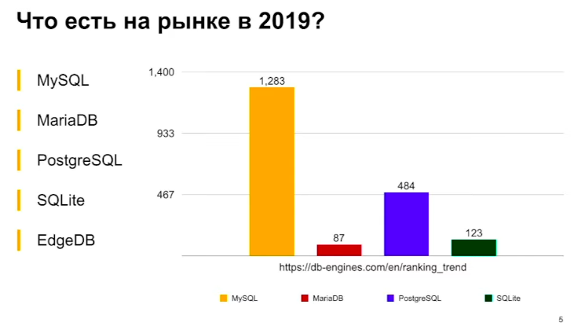

# Django + SQL, Django - модели

# Использование баз данных в Python приложениях

MySQL

- Мультипоточная архитектура
- GPL Лицензия, либо открывать исходники, либо покупать лицензию
- Закрытая система, сообщество не виляет на развитие

PostgreSQL

- Мультипроцессорная архитектура
- Большое сообщество в РФ
- Свободная лицензия MIT

---

Чтобы не потерять данные из бд
[Транзакции в Django]()

---
