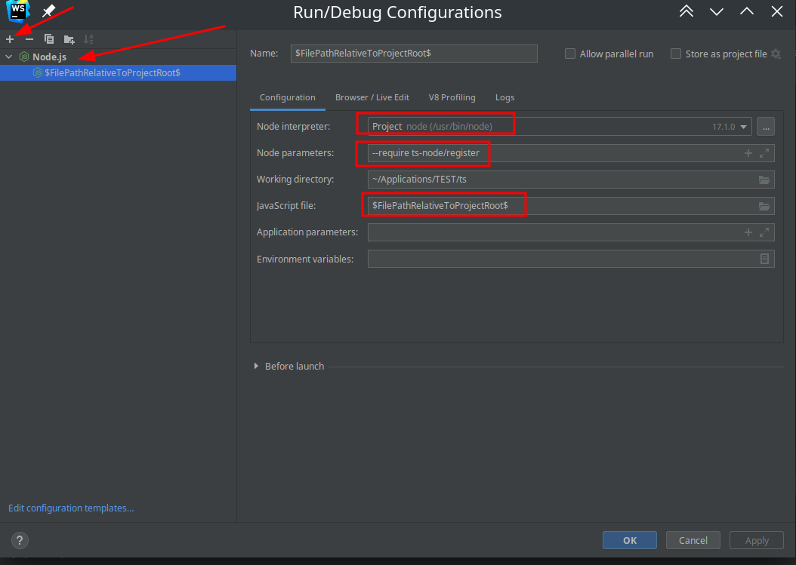

# TypeScript

## Подготовка

Уроки:

- [Видео урок](https://youtu.be/nyIpDs2DJ_c)

---

Глобально установить `TypeScript`

```bash
sudo npm install -g typescript;
tsc -v;
```

[Все команды `tsc`](https://www.typescriptlang.org/docs/handbook/compiler-options.html)

| Команда `tsc`            | Описание                                                                                    |
| ------------------------ | ------------------------------------------------------------------------------------------- |
| `tsc --init`             | Создать файл `tsconfig.json`                                                                |
| `tsc --watch <ИмяФайла>` | Компилировать файл `js`при измение `ts`                                                     |
| `tsc -w`                 | Следить за всеми изменениями файлов(указанных в `tsconfig.json`), и компелировать их в `JS` |

---

Запустить `TypeScript`

1. Скомпилировать `.ts` в `.js` а потом уже запустить через `npm` файл `.js`

    ```bash
    tsc <ИмяФайла>.ts;
    node <ИмяНовогоСкомпелированногоФайла>.js;
    ```

2. Запускать `.ts` сразу, используя [Интерпретатор TypeScript](https://github.com/TypeStrong/ts-node) `ts-node`.

    1. Глобально установить `ts-node`
        ```bash
        sudo npm install -g ts-node typescript '@types/node';
        ```
    2. Запустить `.ts` файл. (`.js` файл не будет создан)

        ```bash
        ts-node <ИмяФайла>.ts;
        ```

3. Запустить `TypeScript` в `WebShtorm`

    1. Локально установить `ts-node`

        ```bash
        npm install --save ts-node @types/node
        ```

    2. 

    - `--require ts-node/register`
    - `$FilePathRelativeToProjectRoot$` Макрас который обозначает (Выполнять открытый файл)

---

`package.json`

```json
{
	"name": "ts",
	"version": "1.0.0",
	"description": "",
	"main": "index.js",
	"scripts": {
		"test": "echo \"Error: no test specified\" && exit 1",
		"watch:build": "tsc --watch"
	},
	"author": "",
	"license": "ISC"
}
```

## Настройка `TypeScript`

1. Создать настройки проекта `tsconfig.json`

    ```bash
    tsc --init
    ```

2. Получить отрендеренные конфигурации `tsconfig.json`

    ```bash
    tsc --showConfig
    ```

---

`tsconfig.json` [Документация](https://www.typescriptlang.org/tsconfig/#lib) [Статья на `Habr`](https://habr.com/ru/post/542234/) [Статья на `Habr` 2](https://habr.com/ru/post/557738/)

```json
{
	// Список исключенных из компиляции файлов
	"exclude": [
		""
		// "./ПутьК_Фалйлу",
	],
	// Список путей к папкам для компиляции
	"include": [
		""
		// "./src/**/*",
	],

	// Список конкретных файлов для компиляции
	"files": [
		""
		// "./ПутьК_Файлу",
	],
	"compilerOptions": {
		"module": "commonjs",
		"esModuleInterop": true,
		"forceConsistentCasingInFileNames": true,
		"skipLibCheck": true,
		"strictNullChecks": true,
		// По какому стандарту `JS` компилировать файлы [es5,es6,es2020]
		"target": "es2016",
		// Путь к папке в которую будут помещены скомпилированный `JS`
		"outDir": "./dist",
		// Путь к главной директории с `TS`
		"rootDir": "./",
		// Список импортов
		//"lib": [
		//  "DOM",
		//  "ScriptHost",
		//  "DOM.Iterable",
		//  "ES6"
		//],
		// Каким образом компилировать `JSX` синтаксис
		"jsx": "react",
		// Создать вспомогательный файл для отображения `TS` в браузере,
		"sourceMap": true,
		// Удалять комментарии в `JS`
		"removeComments": true,
		// Не компилировать `JS` если возникли ошибки
		"noEmitOnError": true,
		// Строгая проверка типов в `TS`
		"strict": true
	}
}
```

## Типы данных

### Типы переменных

| Тип     | Описание              |
| ------- | --------------------- |
| `const` | Неизменяемое значение |
| `let`   | Изменяемое значение   |

Для указания типа переменной нужно соблюдать следующий синтаксис:

```ts
const <ИмяПерменной>: <ТипПеременной_1>  | <ТипПеременной_...>   = <Значение>;
```

---

Получить тип переменной

```ts
typeof <ИмяПерменной>
```

Проверить тип переменной с учетом наследования

```ts
let <ИмяПерменной> : <Класс> = new <Класс>(<Аьриубты_...>)

if (<ИмяПерменной> instanceof <Класс> {

}
```

### Простые

#### Логические

| Тип         | Описание                                                                                |
| ----------- | --------------------------------------------------------------------------------------- |
| `boolean`   | `true`/ `false`                                                                         |
| `any`       | Любой тип данных                                                                        |
| `void`      | Тип нечего аналог `undefined` для функций                                               |
| `never`     | Указывает что функция некогда не остановиться (либо остановиться только при исключении) |
| `null`      | Тип нечего                                                                              |
| `undefined` | Тип не существования                                                                    |

#### Числовые

| Тип      | Описание                                                            |
| -------- | ------------------------------------------------------------------- |
| `number` | Целочисленное значение / Дробные числа / максимальное значение 2^53 |

#### Строчные

| Тип      | Описание |
| -------- | -------- |
| `string` | Строка   |

---

Конкатенация строк:

### Составные типы и структуры данных

#### Список

Особенности:

- Изменяемый тип данных

---

Для объявления списка нужно соблюдать следующий синтаксис:

```ts
const <ИмяПерменной>: <ТипПеременной>[] = [<Значение_1>, <Значение_2>, <Значение_...>];
```

---

Деструктурирование массивов. (Также работает с кортежам)

```ts
let arr = [1, 2, 3]
let [a, b, c] = arr;

console.log(a) // 1
console.log(b) // 2
console.log(c) // 3

// Можно пропускать элементы
let arr2 = [1, 2, 3]
let [, , c2] = arr2;

console.log(c2) // 3
```

- Слайс

```ts
let arr = [1, 2, 3]
arr.slice($Начало$,$Конец$) // 2,3
```

#### Кортеж

Особенности:

- Не изменяемый тип данных

---

Для объявления кортежа нужно соблюдать следующий синтаксис:

```ts
const <ИмяПерменной>: [<ТипПеременной_1>,<ТипПеременной_2>, <ТипПеременной_...>] = [<Значение_1>, <Значение_2>, <Значение_...>];
```

#### Словарь - `object`

Деструктурирование словаря

```ts
let dict = {
	a: 1,
	b: 2,
	c: 3
}
let {a, c} = dict;


console.log(a) // 1
console.log(c) // 3

// Или
interface Dog {
  name: string
  age: number
}

const dog: Dog = body.value
```

Переопределение ключа

```ts
let dict = {
	a: 1,
	b: 2,
	c: 3
}
let c = {...dict, a:10};

console.log(c) // {a:10, b:2, c:3}
```

| Код                                          | Описание               |
| -------------------------------------------- | ---------------------- |
| `Object.assign(<Объект_1>,<Объект_2>, ...);` | Объединить два объекта |
| `Object.keys(<Объект_1>)`                    | Получить все ключи из объекта                       |

#### Множество

[Документация](https://metanit.com/web/javascript/14.3.php)

#### Перечисления - `enum`

Для объявления перечисления нужно соблюдать следующий синтаксис:

```ts
enum <ИмяПеречисления>{
	<Ключ_1> = <Значение_1>,
	<Ключ_2> = <Значение_2>,
	<Ключ_...> = <Значение_...>
}

const <ИмяПеременной> = <ИмяПеречисления>.<Ключ_...>
```

---

```ts
enum E1{
  A,
  B,
  C
}

console.log(E1.A); // 0
console.log(E1[0]); // A


enum E2 {
  A = "Арбуз",
  B = "Виноград",
  C = "Слива",
}

console.log(E2.A); // Арбуз
console.log(E2["Арбуз"]); // Ошибка !!!
```

### Конвертация типов

| Функций    | Описание                 |
| ---------- | ------------------------ |
| `Number`   | В число                  |
| `parseInt` | В число (с учетом `css`) |
|            |                          |

## Собственные типы данных

### Собственный тип

Для объявления собственного типа данных нужно соблюдать следующий синтаксис:

```ts
type <ИмяНовогоТипа> = <СуществующийТип>
```

Можно указать несколько вариантов типов. (либо 1 тип, либо 2 тип) (Можно указывать сколько угодно вариантов типа данных)

```ts
type <ИмяНовогоТипа> = <СуществующийТип_1> | <СуществующийТип_2>
```

Можно указать не только тип, но и строку с текстом

```ts
type <ИмяНовогоТипа> = "<Значение_1>" | "<Значение_...>"
```

### Шаблоны типов - `generic`

Шаблоны типов нужны для того чтобы автоматически подстраивать тип в зависимости от переданного. Нужно использовать такой подход, а не `any` потому что через шаблоны типов мы можем указывать структур данных.

```ts
function ИмяФункции<T [extends НаследоватьсяОтТипа], R>(Аргумент: T[], Аргумент: R): T[]{

}
```

Шаблон для объекта

```ts
function ИмяФункции<T [extends НаследоватьсяОтТипа], R>(Аргумент: T[], Аргумент: R): {value: T, count: R}{
	return {
		value: 'He',
		cbount: 1
	}
}
```

---

```ts
function fun__<T>(a : T[]) : T[] {
	return a.reverse()
}

let a: Array<number> = [1, 2, 3, 4, 5]
console.log(fun__(a));
```

```ts
function fun__<T>(a : T[]) : T[] {
	return a.reverse()
}

let a = {a: 1, b: 3, c: 4, d: 5,}
console.log(fun__(a));
```

### Структуры - интерфейсы - имплементация - `interface`

#### Интерфейсы

Для объявления интерфейса нужно соблюдать следующий синтаксис: (Обычно в начале имени интерфейса ставят букву `I`) [Документация `interface`](https://www.typescriptlang.org/docs/handbook/interfaces.html)

```ts
interface <IИмяИнтерфейса> {
  readonly <ИмяКлюча>: <ТипКлюча>;
  <ИмяКлюча>?: <ТипКлюча>;
  [key:<ТипКлюча>]: <ТипЗначения>;
  (<ИмяАргумента_1>: <ТипАргумента_1>, <ИмяАргумента_...>: <ТипАргумента_...>: <РезультатФункции>;
}
```

| Запись                                                                                             | Обозначение                                                                                                             |
| -------------------------------------------------------------------------------------------------- | ----------------------------------------------------------------------------------------------------------------------- |
| `readonly <ИмяКлюча>: <ТипКлюча>;`                                                                 | Ключа только для чтения                                                                                                 |
| `<ИмяКлюча>?: <ТипКлюча>;`                                                                         | Необязательный ключ                                                                                                     |
| `[key:<ТипКлюча>]: <ТипЗначения>;`                                                                 | Если у нас неопределенное количество элементов в словаре то можно указать общий тип для ключа и значения всех элементов |
| `(<ИмяАргумента_1>: <ТипАргумента_1>, <ИмяАргумента_...>: <ТипАргумента_...>: <РезультатФункции>;` | Интерфейс для функций                                                                                                   |

---

Наследование интерфейсов. (Поддерживается множественное наследование)

```ts
interface <ИмяДочернегоИнтерфейса> extends <ИмяБазовогоИнтерфейса>  {
	//
}
```

Наследование интерфейса для класса (имплементация). Поддерживается множественное наследование)

```ts
class <ИмяКласса> implements <ИмяБазовогоИнтерфейса>  {
	//
}
```

---

Пример контроля типа данных указанных в интерфейсе

```ts
interface React {
  readonly id: string;
  color?: string;
}

let react_1: React = {
  id: "He",
  color: "3",
};

// error TS2540: Cannot assign to 'id' because it is a read-only property.
react_1.id = "Hd";
```

Интерфейс для функций

```js
interface SearchFunc {
	(source: string, subString: string): boolean;
}

let mySearch: SearchFunc = (source: string, subString: string): boolean => {
	let result = source.search(subString);
	return result > -1;
};
```

---

Можно указать доступные значения для переменной используя интерфейсы

```ts
interface Person{
	name: string
	age: number
}
type PersonKey: keyof Person
let key: PersonKey = 'name'
key = 'NotName'
```

---

Создать тип на основе массива

```ts
// Массив
const colors = ['red', 'orange', 'yellow', 'green', 'blue', 'indigo', 'violet'] as const;
export type Color = typeof colors[number]; // 'red'|'orange'|'yellow'|'green'|'blue'|'indigo'|'violet'
// Множество
let AVAILABLE_LANG_SET = new Set(["ru", "en", "jp", "uk"]);
const AVAILABLE_LANG_ARR = Array.from(AVAILABLE_LANG_SET)
type TYPE_AVAILABLE_LANG = typeof AVAILABLE_LANG_ARR[number];
```

#### Утилиты для интерфейсов

[Полная документация](https://www.typescriptlang.org/docs/handbook/utility-types.html)

| Утилита                                                                | Описание                                                                                                             |
| ---------------------------------------------------------------------- | -------------------------------------------------------------------------------------------------------------------- |
| `Omit<$Интерфейс$,$Свойство_...$>`                                     | Исключить указанное свойство из интерфейса                                                                           |
| `Pick<$Интерфейс$,$Свойство_...$>`                                     | Добавить указанное свойства из интерфейса (Создать новый интерфейс)                                                  |
| `Requerid<$Интерфейс$>`                                                | Создать интерфейс где все типы обязательные(не опционально)                                                          |
| `Requerid<Pick<>>`                                                     | Добавить указанное свойства из интерфейса и сделать их обязательными                                                 |
| `Requerid<Pick< ... ,'$Свойство_1$'>>` & `Omit< ... , '$Свойство_1$'>` | Добавить указанное свойства из интерфейса и сделать их обязательными, а остальные свойства добавить без изменения () |
| `Readonly<$Интерфейс$>`                                                | Создать копию интерфейса и сделать все его свойства только для чтения                                                |

---

`type $ИмяНовогоИнтерфейса$= Omit<$БазовыйИнтефейс$, "$ИсключитьСвойство_1$"|"$ИсключитьСвойство_...$" >`

```ts
interface Book {
	price : number;
	pageCount : number;
	author? : string;
}
type Article = Omit<Book, "pageCount" >

const a : Article = {price: 1, author: 'asdd'}
const b : Book = {price: 1, pageCount: 12, author: 'asdd'}
```

`type $ИмяНовогоИнтерфейса$= Pick<$БазовыйИнтефейс$, "$ДобавитьСвойство_1$"|"$ДобавитьСвойство_...$" >`

```ts
interface Book {
	price : number;
	pageCount : number;
	author? : string;
}
type Article = Omit<Book, "author"|"price" >

const a : Article = {price: 1, author: 'asdd'}
const b : Book = {price: 1, pageCount: 12, author: 'asdd'}
```

---

## Условные операторы

```bush
&&  = И
||  = Или
! 	= Не
in  = Вхождение значения в массив
```

Обычный

```js
if(){
	... ;
}
else if () {
	... ;
}
else {
	... ;
}
```

Тернарный оператор

```js
let <res> = (<условие>) ? true : false;
```

switch-case

```js
switch(<var>) {
	case <Значение1>: ... ;
	case <Значение2>: ... ;break;
	default: ... ;
}
```

## Циклы

- Цикл со счетчиком.

    ```js
    for (<Инициализация_Счетчика>; <Условие>; <Изменение_Счетчика>){
    	... ;
    }
    ```

- Перебрать свойств объекта(если это массив то Индексы).

    ```js
    for (let <item> in <arr>){
    	... ;
    }

    ```

- Перебрать значения объекта.

    ```js
    for (let <item> of <arr>){
    	... ;
    }
    ```

- Цикл с условием остановки.

    ```js
    while(<условие>){
    	... ;
    }
    ```

- Цикл с диапазоном (наподобие `range()`)

    ```ts
    for (const _x of Array($СколькоИтераций$).keys()){
    	...;
    }
    ```

- Циклы специально для массивов:

    - Перебрать элементы массива.

        ```js
        let <arr> = [..., ..., ...]

        <arr>.map((<Элемент>,<Индекс>,<КопияТекущегоМассива>) =>
          ...;
        )
        ```

    - Отфильтровать элементы массива.

        ```js
        let <arr> = [..., ..., ...]

        let <NewArrr> = <arr>.filter((<Элемент>,<Индекс>,<КопияТекущегоМассива>) =>
          // Условие фильтрации - должен вернться `boolean`
        )
        ```

## Функции

### Введение

Для объявления функции нужно соблюдать следующий синтаксис:

```ts
function <ИмяФункции>(<Аргумент_1>:<ТипАргумента_1>,<Аргумент_...>:<ТипАргумента_...>): <ТипРезультата>{

	// Тело функции

	return <Результат>
}
```

Если мы используем стрелочную функцию, то нужно соблюдать следующий синтаксис:

```ts
const <ИмяПеерменной>: (<Аргумент_1>:<ТипАргумента_1>,<Аргумент_...>:<ТипАргумента_...>) => <ТипРезультата> = (<Аргумент_1>:<ТипАргумента_1>,<Аргумент_...>:<ТипАргумента_...>) =>{

	// Тело функции

	return <Результат>
}
```

---

Остаточные аргументы. Для того чтобы аргумент принимал все остаточные значения перед его названием нужно указать `...<ИмяАргумента>`

```ts
function buildName(firstName : string, ...restOfName : string[]) {
	return firstName + " " + restOfName.join(" ");
}

let employeeName = buildName("Joseph", "Samuel", "Lucas", "MacKinzie")
console.log(employeeName)
```

### Перегрузка функций

Перегрузка интерфейсов функций в зависимости от входных аргументов

```ts
interface A {
    x: number;
}

interface C extends A {
    y: string;
}

interface D extends C {
    z: boolean;
}

function F(): A;
function F(_a: number): C;
function F(_a: number, _b: boolean): D;


function F(_a?: number, _b?: boolean) {
    if (!_a && !_b) {
        return {x: 0};
    } else if (!_b) {
        return {x: 1, y: "Y"};
    }

    return {x: 1, y: "Y", z: true};
}


console.log("1", F()); 			// 1 { x: 0 }
console.log("2", F(1));			// 2 { x: 1, y: 'Y' }
console.log("3", F(1, true));	// 3 { x: 1, y: 'Y', z: true }
```

## Классы

### Введение

Для объявления классов нужно соблюдать следующий синтаксис:

```ts
// Объявить класс
class <ИмяКласса>[<ШаблонТипа>] <extends <ИмяБазовогоКласса>> {

	// Укзаать какие атриубту могут находиться в `this`
	<УровеньДоступа> <static/readonly> <АтрибутКласса_...>: <ТипАтрибута> = <ЗначениеАтрибута>

	// Также можно указать атриубт только для чтения. (Но его можно изменять в конструкторе класса)
	// readonly <СтатическйиАтрибутКласса_...>: <ТипАтрибута> = <ЗначениеАтрибута>

 	// Конструктор класса constructor() { ... }
    constructor(<Аргумент_1>:<ТипАргумента_1>,<Аргумент_...>:<ТипАргумента_...>){
		// this.<АтрибутКласса_...>
	}

	// Метод
    <УровеньДоступа> <method_...>(Аргумент_1>:<ТипАргумента_1>,<Аргумент_...>:<ТипАргумента_...>): <ТипРезультата>{
		// this.<АтрибутКласса_...>
	}
}

// Создать объект класса
const <ОбьектКласса> = new <ИмяКласса>(<АругментВ_Конструктор_...>)
```

| Уровень доступа                                                             | Описание                                                                  |
| --------------------------------------------------------------------------- | ------------------------------------------------------------------------- |
| `private <ИмяАтриубта>: <ТипАтрибута>`                                      | Виде только внутри класса                                                 |
| `protected <ИмяАтриубта>: <ТипАтрибута>`                                    | Виден внутри класса и в классах наследниках                               |
| `public <ИмяАтриубта>: <ТипАтрибута>`                                       | Виден всем (по умолчанию)                                                 |
| ---                                                                         | ---                                                                       |
| `<private/protected/public> static <ИмяАтриубта>: <ТипАтрибута>`            | Указывает на то что атрибут статичный                                     |
| `<private/protected/public> <static> readonly <ИмяАтриубта>: <ТипАтрибута>` | Атрибут только для чтения. Но записать данные можно в конструкторе класса |

---

Обычный вариант создания атрибутов

```ts
class MyClass {
    public readonly a: number;

    // Конструктор класса
    constructor(a: number) {
        this.a = a
    }

}

const tmp = new MyClass(1)
console.log(tmp.a) // 1
```

Сокращённый вариант создания атрибутов

```ts
class MyClass {
    // Конструктор класса
    constructor(public readonly a: number) {
    }
}

const tmp = new MyClass(1)
console.log(tmp.a) // 1
```

---

### Абстрактный класс

```ts
abstract class <ИмяАбстрактногоКласса> {
	<protected/public> abstract <АбстрактныйАтриубт> : <ТипАтрибута>

	abstract <АбстрактныйМетод>() : <ТипРезультатаМетода>

}

class <ИмяКласса>  extends <ИмяАбстрактногоКласса>  {
	<АбстрактныйАтриубт> : <ТипАтрибута>;

	constructor() {
		super()
		this.<АбстрактныйАтриубт> = <Значение>

	}

	<АбстрактныйМетод>():<ТипРезультатаМетода> {
		// code
	}
}

// Создать объект класса
const <ОбьектКласса> = new <ИмяКласса>(<АругментВ_Конструктор_...>)
```

### Гетеры - Сеттеры

```ts
let passcode = "secret passcode";

class Employee {

	// Атрибут
	private _fullName : string = '';

	// Гетер Атрибута
	get fullName() : string {
		return this._fullName;
	}

	// Сеттер Атрибута
	set fullName(newName : string) {
		if (passcode && passcode == "secret passcode") {
			this._fullName = newName;
		}
		else {
			console.log("Error: Unauthorized update of employee!");
		}
	}
}

let employee = new Employee();
employee.fullName = "Bob Smith";
if (employee.fullName) {
	console.log(employee.fullName);
}
```

## Модули

### Экспорт

Чтобы объявить функцию или класс как экспортируемый, то нужно поставит ключевое слово `export`

```ts
export function sum__(a : number, b : number) {
	return a + b
}

export function subtracting(a : number, b : number) {
	return a - b
}

export let var__ : Array<number> = [1, 2, 3]
```

### Импорт

Чтобы импортировать, функции или классы нужно указать ключевые слава `import {Функции, Классы} from "./ФайлИмпорта"`

```ts
import { subtracting, sum__, var__ } from "./main";


console.log(sum__(10, 5))
console.log(subtracting(10, 5))
console.log(subtracting(var__[0], 5))
```

## Регулярные выражения

- [1](https://developer.mozilla.org/ru/docs/Web/JavaScript/Guide/Regular_Expressions)
- [2](https://learn.javascript.ru/regular-expressions)
