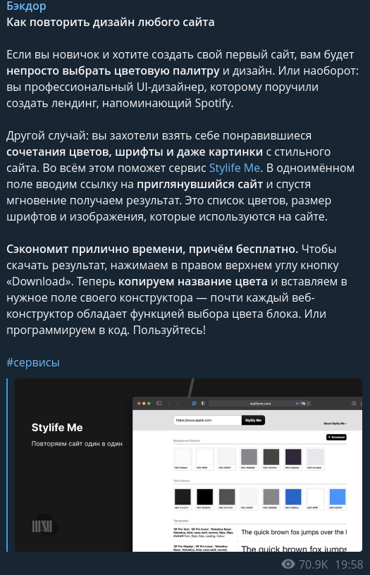

# Программы для фронта

## Разработка

---

- [Случайное фото](https://source.unsplash.com/)

    > 

- [Сайт с иконками](https://icons8.ru/icons/set/favicon)

    > 

---

- [Responsively = Разрабатывайте адаптивные веб-приложения в 5 раз быстрее!](https://responsively.app/)

    > 

- [Генератор градиента](https://www.grabient.com/)

> 

---

## Фичи

---

- [Как повторить дизайн любого сайта](http://stylifyme.com/)

    > 

- [Получить все изображения указанного сайта](https://extract.pics/)
    - 
    - 

---

## Готовые решения

- [Бесплатные иконки и шрифты. Более 6200+ Иконок от сообщества!](https://github.com/Templarian/MaterialDesign)

    - 

- [Бесплатные игонки от Google](https://github.com/google/material-design-icons)

    - 

- [Свободные анимации для сайта](https://github.com/animate-css/animate.css)
    - [Пример](https://animate.style/)
    - 
