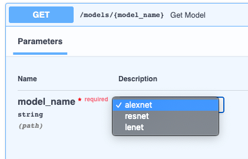

## Подготовка

- [Документация](https://fastapi.tiangolo.com/ru/)

### Установка

```bash
poetry add fastapi uvicorn orjson jinja2 websockets python-multipart sqlalchemy psycopg2-binary
```

- `fastapi` - Это `Fast Api`
- `uvicorn` - ASGI сервер
- `orjson` - Быстрый `json`
- `jinja2` - Шаблонизатор `HTML`
- `python-multipart` - Работы с файлами
- `sqlalchemy` - `ORM` система
    - `psycopg2` - Адаптер для `PostgreSQL`
- `websockets` - ?

### Основные фичи

Посмотреть сгенерированную документацию по ссылки

- http://127.0.0.1:8000/docs - [`Swagger UI`](https://github.com/swagger-api/swagger-ui)
- http://127.0.0.1:8000/redoc - [`ReDoc`](https://github.com/Rebilly/ReDoc)

## Основной `API` `Fast Api` (!)

- `FastAPI`(`version="1", default_response_class=ORJSONResponse`)
    - `version:str="1"` - Версия `api`
    - `default_response_class:obj=JSONResponse` - Класс для сериализации `json` ответа . Рекомендую `from fastapi.responses import ORJSONResponse`

---

- `@api.<HttpМетод>('/<ИмяПути>/{$ДинамическийURL$}',$...$)`

    - `response_class:JSONRespons=JSONRespons` - Указывает какой тип мы хотим вернуть из [функции](https://fastapi.tiangolo.com/advanced/custom-response/)
        - `ORJSONResponse` - `orjson`
        - `HTMLResponse(content=$html_content$, status_code=$200$)` - `Html` код
        - `PlainTextResponse` простой текст
        - `RedirectResponse($URL$,status_code=$307$)` - Перенаправление на другой `URL`
        - `FileResponse($Путь$)`- Передать асинхронно файл
    - `status_code:int=200` -`HTTP` Код ответа

    ***

    - `summary:str=None` - Краткое описание
    - `description:str=None` - Полное описание (Лучше использовать `""" """` в функции)

    ***

    - `response_model:BaseModel=None` - Тип возвращаемой схемы
    - `response_model_exclude:set=None` - Множество котрое нужно исключить из ответа схемы
    - `response_model_include:set=None` - Множество которое доступно для ответа схемы, все вне списка не попдут в ответ.
    - `response_description:str=None` - Описание ответа
    - `response_model_exclude_unset:bool=False` - Если `True` то поля обявленные как необязательные в схеми, можно вообще не указывать в запросе.

    ***

    - `tags:str|Enum=None` - Условное `api` разделение по группам. Один `api` может быть в несколькх группах [+](https://fastapi.tiangolo.com/tutorial/path-operation-configuration/)
        - 

## Маршрутизация

Особенности:

- Все по умолчанию параметры кроме схем, передаются в `URL` запросе. Если нам нужно принудительно передать данные в `HTML` теле то укажите тип `Form(...)`

---

```python
@api.<HttpМетод>('/<ИмяПути>/{$ДинамическийURL$}') # PATH Параметры
def add_basket(request: WSGIRequest, $ДинамическийURL$: $Тип$): # GET Параметры / POST параметры для схем
	...
```

## Схемы / Перечисления

### Схемы

Схемы это модели `Padantic` которые проверяют данные, и хранят их.

---

Особенности:

- Схемы всегда отправляться в `HTML` теле запроса

---

```python
from pydantic import BaseModel

# Схема ответа
class $ИмяСхемы$(BaseModel):
	"""Документация схемы"""

	$АтриубтСхемы$: $ТипАтрибута$ = Field(..., title="Заголовок атрибута", description="Полное Описание атрибута")

	#Валидация атрибута
	@validator("$АтриубтСхемы$")
	def $АтриубтСхемы$(cls, var) -> $Тип$:
		if len(var) <= 5:
			raise ValueError(f"Атриубт `{$АтриубтСхемы$.__name__}` не прошел валидацию")
		return var

	class Config:
		# Понятное название схемы
		title = "Название Схемы"

# http://127.0.0.1:8090/api/ИмяПути/ДинамическийURL
@api.<HttpМетод>('/<ИмяПути>/{$ДинамическийURL$}', summary="Краткое описание", response_model=$ИмяСхемы$)
def add_basket(request: WSGIRequest, $ДинамическийURL$: $Тип$):
	"""Полное описание API метода"""
	return $ИмяСхемы$(<АтриубтСхемы>=<Значение>)
```

### Перечисления

Перечисления позволяют нам указать определенные доступные значения от пользователя [+](https://fastapi.tiangolo.com/tutorial/path-params/#predefined-values)

```python
class $Перечисление$(str, Enum):
    $Атрибут_...$ = "$Значение$_..."


@app.get("/")
def index($Аргумент$: $Перечисление$):
    return {"code": 200, "body": $Аргумент$}
```



### Валидация

- `Query($ЗначенияПоУмнолчанию$, $...$)` - Валидация параметров для методов запроса `GET`

    - `min_length:int` - Мин длинна строки
    - `max_length:int` - Макс длинна строки
    - `regex:str` - Регулярное выражение
    - `deprecated` - Покажет что данный параметр устарел
    - `example` - Пример входных данных
    - `alias:str=None` - По этому имени клиент будет делать запрос (но ответ останется на старому имени)
    - `title` - Не работает
    - `description` - Описание ограничителя
    - `gt` больше
    - `ge` больше или равно
    - `lt` - меньше
    - `le` - меньше или равно
    - `examples` - Привести несколько примеров [+](https://fastapi.tiangolo.com/tutorial/schema-extra-example/#body-with-multiple-examples)
    - `include_in_schema:bool=True` - Можно скрыть параметр из запроса, если указать `False`

    ```python
    from fastapi import FastAPI, Query
    from fastapi.responses import ORJSONResponse
    from pydantic import BaseModel

    app = FastAPI(version="1.2", default_response_class=ORJSONResponse)


    class Test(BaseModel):
    	pk: int
    	name: str


    class ModelName(str, Enum):
    	alexnet = "alexnet"
    	resnet = "resnet"
    	lenet = "lenet"


    # http://127.0.0.1:8000/1/123?name=denis
    @app.get("/1/{pk}")
    def index(pk: int  q: str = Query(..., min_length=3, max_length=10)):
    	return {"code": 200, "q": q, "pk": pk, "name": name}
    ```

- `Path($ЗначенияПоУмнолчанию$, $...$)` - Валидация `URL` пути
- `Field(...)` - Базовый класс проверки из `padantic`(используется только в схемах)
- `Body(...)`- Передать как сырой текст. Использовать для добавления полей в схемы, а также настроку самой схемы.
    - `embed:bool=False` Если `True` то в модель `BaseModel` будет подставленно своё имя модели
- `Cookie(...)` - Данные должны быть переданы через `Cookie` [+](https://fastapi.tiangolo.com/tutorial/cookie-params/)
- `Header(...)` - Данные должны быть переданы в заголовках
- `Form(...)` - Передать данные в `HTML` теле запроса (`POST`)

---

Фалы

Особенности:

- Обязательно `HTTP` тип `POST`, тип аргумента `bytes`
- Нужно установить `python-multipart`
- Можно загружать несколько файлов если указать их в `list` (`file: list[UploadFile]`) / (`file: list[bytes] = File(...)`) [+](https://fastapi.tiangolo.com/tutorial/request-files/#multiple-file-uploads)

- `File(...)` - Передать файл. На вход получаем сырые данные из файла

    - `media_type:str="application/x-www-form-urlencoded"` - Тип данных в форме

    ```python
    @app.post("/1")
    def index(file: bytes = File(...)):
    	return {"code": 200, "file_size": len(file)}
    ```

- `UploadFile(...)` - Передать файл. На входе у нас дескриптор файла [+](https://fastapi.tiangolo.com/tutorial/request-files/#uploadfile)

    Асинхронные методы у объекта

    - `read()` - Прочитать
    - `write()` - Записать
    - `seek()` - Передвинуть указатель
    - `close` - Закрыть файл

    ```python
    @app.post("/")
    def index(file: UploadFile = None):
    	text = file.file.read()
    	print(text)
    	return {"code": 200, "file": text}
    ```

## Шаблонизатор `jinja2`

[Документация](https://fastapi.tiangolo.com/advanced/templates/)

- `static`
    - `style.css`
- `templates`
    - `item.html`
- `main.py`

```python
from fastapi.responses import ORJSONResponse

from fastapi import FastAPI, Request
from fastapi.responses import HTMLResponse
from fastapi.staticfiles import StaticFiles
from fastapi.templating import Jinja2Templates

app = FastAPI(version="1.2", default_response_class=ORJSONResponse)

# Добавляем путь к статическим файлам.
app.mount(
    # `URL` путь
    "/static",
    # Директория в которой искать статические файлы
    StaticFiles(directory="static"),
    # Это имя будем использовать в
    # `{{ url_for('$name$', path='/$Файл$.css') ) }}`
    name="static")

# Указываем директорию, где искать шаблоны
templates = Jinja2Templates(directory="templates")


# Указываем что возвращаем `HTML`
@app.get("/items/{id_}", response_class=HTMLResponse)
def read_item(request: Request, id_: str):
    print("!@#")
    # Собираем шаблон
    return templates.TemplateResponse("item.html",
                                      {"request": request,
                                       "id": id_
                                       })
```

## Исключения

[Документация](https://fastapi.tiangolo.com/tutorial/handling-errors/)

Вызвать исключение

```python
from fastapi import HTTPException

#@app.get("/items/{item_id}")
#async def read_item(item_id: str):
#    if item_id not in items:
        raise HTTPException(status_code=$КодОшибки$, detail="$ОписаниеОшибки$", headers=$Заголовки$)
#    return {"item": items[item_id]}
```

## БД (!)

## Безопасность (!)

https://fastapi.tiangolo.com/tutorial/security/first-steps/

## Расширяемость (!)

## Тестирование (!)

[Документация](https://fastapi.tiangolo.com/tutorial/testing/)
