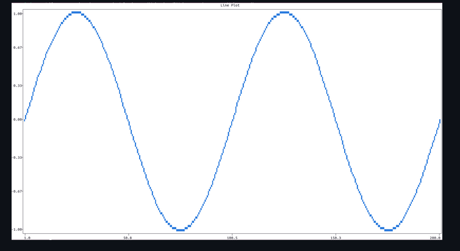
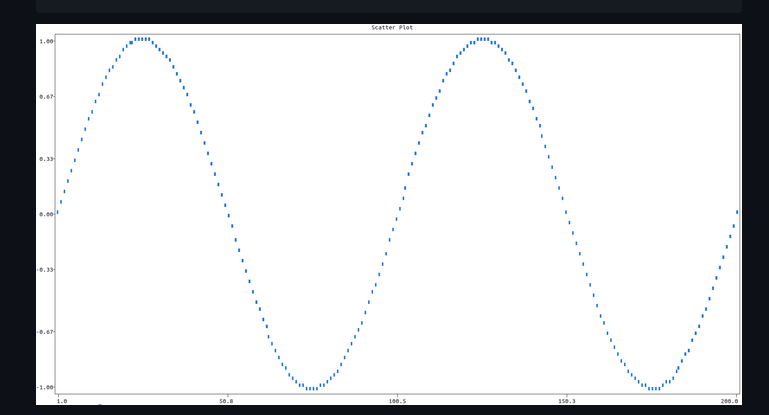
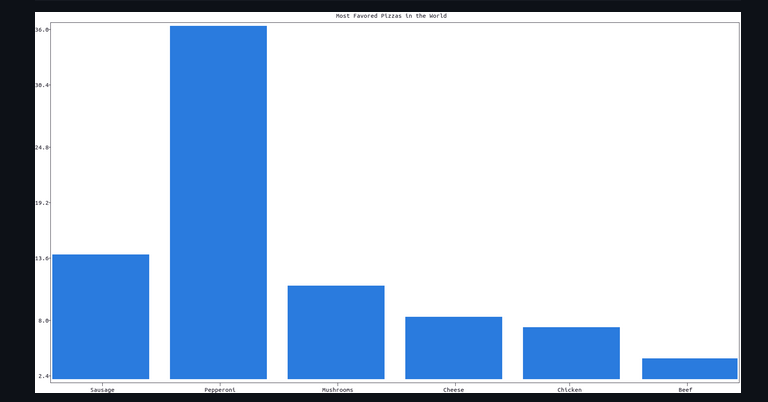
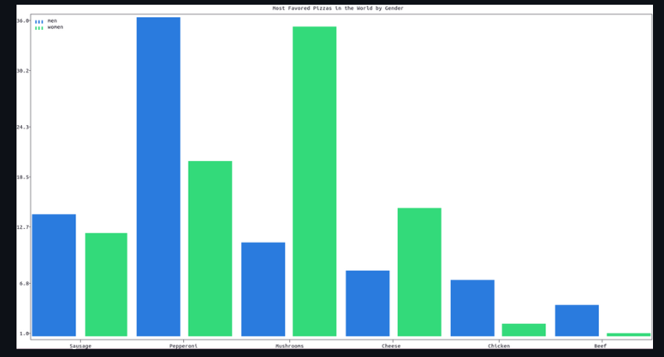
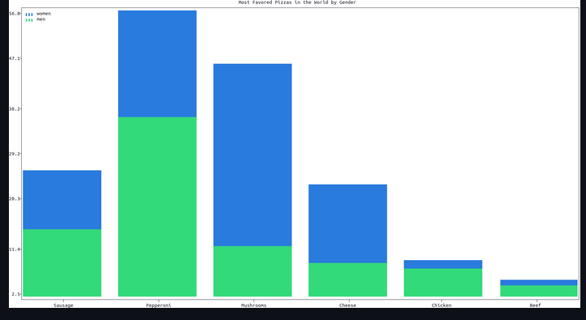
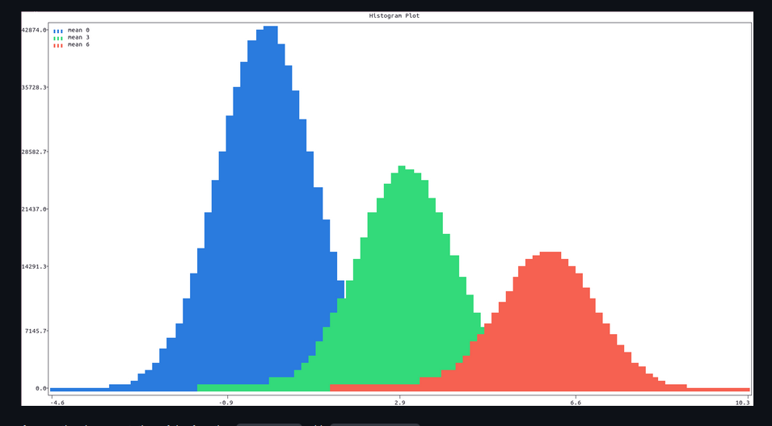
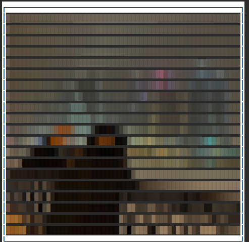

# `plotext` - графики в терминале

```bash
pip install plotext
```

| Функция                             | Описание                                                   |
| ----------------------------------- | ---------------------------------------------------------- |
| `plt.show()`                        | Отобразить график                                          |
| `plt.ylim($Низ$, $Верх$)`           | Установить границы по `Y`                                  |
| `plt.xlim($Лево$, $Право$)`         | Установить границы по `X`                                  |
| --- Внешний вид                     | ---                                                        |
| `plt.clc()`                         | Удалить цвет фона                                          |
| `plt.cld()`                         | очистить только данные графика (без очистки стиля графика) |
| `plt.clt()`                         | очистить экран терминала перед реальным сюжетом.           |
| `plt.plot_size($Ширина$, $Высота$)` | Изменить размер графика                                    |
| `plt.title("$НазваниеГрафика$")`    | Установить заголовок графика                               |

---

Типы:

- `plt.plot($X$,$Y$)` Добавить данные для сплошного графика.

    - `xside:str="$Название$"` - Название `X`
    - `yside:str="$Название$"`- Название `X`
    - `label:str="$Название$"`- Название графика
    - `fillx:bool=False` - Закрасить все что под графиком`X`
    - `filly:bool=False` - Закрасить все что под графиком `Y`
    - 

- `plt.scatter($X$,$Y$)` - Добавить данные для прерывистого графика.

    - 

- `plt.bar($НазваниеСтолбцов$, $Количество$)` - Добавить данные в виде столбцов (`$Количество$` нужно указать по индексам )

    - `orientation:str='v'` - ориентация столбцов (`v`/`h`)
    - `label:list[str] = None` - Название столбцовв
    - 

- `plt.multiple_bar($НазваниеСтолбцов$, [$Количество_1$,$Количество_...$])` - Добавить данные в виде нескольких типов столбцов расположенных рядом

    - `orientation='v'` - ориентация столбцов (`v`/`h`)
    - `label:list[str] = None` - Название столбцов
    - 

- `plt.stacked_bar($НазваниеСтолбцов$, [$Количество_1$,$Количество_...$])` - Добавить данные в виде нескольких типов столбцов друг над другом

    - `label:list[str] = None` - Название столбцов
    - 

- `plt.hist($Данные$)` - Гистограмма
    - `label:list[str] = None` - Название столбцов
    - 

## Фото в терминал

```python
import plotext as plt
# Нужно установить PIL


if __name__ == '__main__':
    size = plt.image_plot(
        # Путь к фото
        "/home/denis/Загрузки/Screenshot 2022-01-14 at 20-19-05 Дети цветы жизни в Instagram «Goodbye Omerica».png",
        # Размер
        size=[68, 38],
        # Сохранить пропорции
        keep_ratio=True)
    plt.plotsize(*size)
    plt.frame(True)
    plt.show()
```



## Группировка графиков

https://github.com/piccolomo/plotext/blob/master/readme/subplots.md
